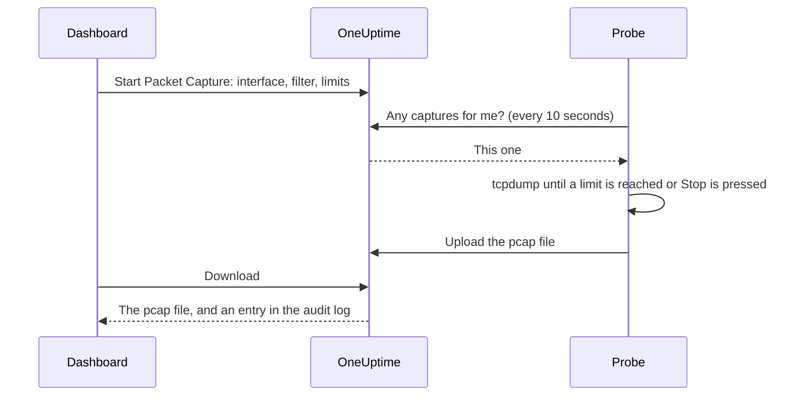

# Packet Capture

Capture the traffic one of your probes sees, straight from the dashboard, and open the file in Wireshark. The probe already sits in the network you are troubleshooting, so there is no VPN to open and no jump host to log in to.

Captures are off on every probe until whoever runs the probe turns them on, and they run only on your project's own probes.

:::cards
- [How it works](#how-it-works): From Start Packet Capture to a file in Wireshark.
- [Turn on packet capture](#turn-on-packet-capture): What whoever runs the probe sets, for Docker, Docker Compose and Kubernetes.
- [Start a capture](#start-a-capture): Pick an interface, narrow it to what you need, download the file.
- [Reference](#reference): Limits, filters, permissions, the audit log and how long files are kept.
- [Troubleshooting](#troubleshooting): What a failed capture's message means.
:::

## How it works



1. **Start.** Someone allowed to start captures picks the probe's interface, a filter and the limits, and clicks **Start Capture**. OneUptime checks the filter and the limits against what the probe allows before the capture is saved.
2. **Pick up.** The probe asks OneUptime for work every ten seconds, the way it asks for monitors. It takes the capture and starts `tcpdump`.
3. **Capture.** The capture stops at the first of its limits: its duration, its packet limit or its file size. **Stop** ends it early, and keeps what it has captured.
4. **Upload.** The probe uploads the pcap file. OneUptime stores it as a private file of the project.
5. **Download.** The capture says **Completed** with a **Download** button. The file opens in Wireshark, tcpdump or any other tool that reads pcap files.

## Before you begin

- **One of your project's own probes.** Global probes carry other projects' traffic, so they never capture. To install a probe of your own, see [Custom Probes](/docs/probe/custom-probe).
- **A probe from this release or later.** Older probes don't report what they can capture on.
- **The right permissions.** Starting and stopping a capture takes **Start Packet Capture**, and downloading a file takes **Download Packet Capture**. Project owners and admins have both. See [Permissions](#permissions).
- **A mirrored port, for traffic that doesn't reach the probe.** A probe sees only the traffic on its own host's interfaces. To capture traffic between other devices, mirror their switch port (SPAN) to a spare interface of the probe's host.

## Turn on packet capture

Whoever runs the probe turns captures on where the probe runs: the dashboard can't, by design. The probe needs three things:

| Setting | Why |
| --- | --- |
| `PROBE_PACKET_CAPTURE_ENABLED=true` | Turns captures on. Any other value, or none, leaves them off. |
| Host networking | Lets the probe see the host's own interfaces, and a mirrored port. Without it, the probe sees only its container's network. |
| The `NET_RAW` capability | Lets tcpdump capture. Docker grants it by default. Kubernetes' restricted Pod Security standard drops it, so add it. |

:::tabs
@tab Docker
```bash
docker run --name oneuptime-probe --network host \
  --cap-add NET_RAW \
  -e PROBE_KEY=<probe-key> \
  -e PROBE_ID=<probe-id> \
  -e ONEUPTIME_URL=https://oneuptime.com \
  -e PROBE_PACKET_CAPTURE_ENABLED=true \
  -d oneuptime/probe:release
```
@tab Docker Compose
```yaml
services:
  oneuptime-probe:
    image: oneuptime/probe:release
    container_name: oneuptime-probe
    network_mode: host
    cap_add:
      - NET_RAW
    environment:
      - PROBE_KEY=<probe-key>
      - PROBE_ID=<probe-id>
      - ONEUPTIME_URL=https://oneuptime.com
      - PROBE_PACKET_CAPTURE_ENABLED=true
    restart: always
```
@tab Kubernetes
```yaml
apiVersion: apps/v1
kind: Deployment
metadata:
  name: oneuptime-probe
spec:
  selector:
    matchLabels:
      app: oneuptime-probe
  template:
    metadata:
      labels:
        app: oneuptime-probe
    spec:
      hostNetwork: true
      dnsPolicy: ClusterFirstWithHostNet
      containers:
        - name: oneuptime-probe
          image: oneuptime/probe:release
          securityContext:
            capabilities:
              add: ["NET_RAW"]
          env:
            - name: PROBE_KEY
              value: "<probe-key>"
            - name: PROBE_ID
              value: "<probe-id>"
            - name: ONEUPTIME_URL
              value: "https://oneuptime.com"
            - name: PROBE_PACKET_CAPTURE_ENABLED
              value: "true"
```
:::

When the probe starts, its log says `Packet capture is on: captures of up to 30 minutes and 25 MB can be started on this probe from the dashboard.` Within a minute, the probe's page in the dashboard offers **Start Packet Capture**.

To set a lower ceiling on this probe than every probe holds to, add either of these:

| Variable | Default | What it does |
| --- | --- | --- |
| `PROBE_PACKET_CAPTURE_MAX_DURATION_IN_SECONDS` | `1800` | The longest capture this probe runs, from 5 to 1800 seconds. |
| `PROBE_PACKET_CAPTURE_MAX_FILE_SIZE_IN_MB` | `25` | The largest capture file this probe makes, from 1 to 25 MB. |

> [!NOTE]
> The probes that come with a self-hosted OneUptime install, through Docker Compose or the Helm chart, are global probes, so they never capture. Run a custom probe in the network you want to capture in.

## Start a capture

:::steps
### Open the probe or the device

Open **Monitors → Settings → Probes** and click your probe: its **Packet Captures** card lists its captures. Or open a network device and go to its **Traffic** page: captures there run on the device's own probe, and start filtered to the device's address.

### Click Start Packet Capture

The form says what a capture holds before you start one: passwords, tokens and personal data that cross the wire end up in the file.

### Pick the interface

**All interfaces (any)** captures on every interface the probe has. Pick the interface a switch mirrors traffic to when you capture mirrored traffic.

### Choose which packets

Fill in **Host or network**, **Port** and **Protocol** to narrow the capture down, or leave them empty to keep every packet. The form shows the filter they make, such as `host 10.0.0.5 and tcp port 443`. Click **Write a BPF filter instead** to write your own.

### Check the limits

**More fields** holds **Duration**, **Packet limit** and **File size limit (MB)**. Its summary says when the capture stops: `Stops after 1 minute, 100,000 packets or 10 MB, whichever comes first.`

### Click Start Capture

The capture says **Pending** until the probe picks it up, then **Running**, with how far it has got. Click **Stop** to end it early.
:::

When the capture says **Completed**, click **Download**, then open the `.pcap` file in Wireshark. A capture on **All interfaces (any)** is a Linux cooked capture, which Wireshark reads as it reads any other.

## Reference

### Limits

| Limit | Default | Range |
| --- | --- | --- |
| Duration | 1 minute | 5 seconds to 30 minutes |
| Packet limit | 100,000 | 1 to 1,000,000 |
| File size limit | 10 MB | 1 to 25 MB |

- A capture stops at the first limit it reaches. A file that reaches its size limit is cut after the last whole packet, so it always opens.
- A probe runs at most 2 captures at once.
- A capture the probe doesn't pick up within 5 minutes fails, and says so.
- The probe holds every capture to these limits again, and to its own lower ones.

### Filters

The form's fields make a [BPF filter](https://www.tcpdump.org/manpages/pcap-filter.7.html), the capture filter language of tcpdump and Wireshark:

| Host or network | Port | Protocol | Filter |
| --- | --- | --- | --- |
| `10.0.0.5` | | Any protocol | `host 10.0.0.5` |
| `10.0.0.0/24` | `443` | TCP | `net 10.0.0.0/24 and tcp port 443` |
| | `5060` | UDP | `udp port 5060` |
| | `8000-8080` | Any protocol | `portrange 8000-8080` |
| `10.0.0.5` | | ICMP | `host 10.0.0.5 and (icmp or icmp6)` |

A filter you write yourself is one line of at most 500 characters, made of letters, numbers, spaces and `. : / ( ) [ ] ! & | < > = + - * % ^ _`. OneUptime checks it before it is saved, and tcpdump compiles it on the probe. The probe passes it to tcpdump as one argument, never through a shell.

### Permissions

| Permission | Lets someone | Who has it by default |
| --- | --- | --- |
| **Start Packet Capture** | Start captures, and stop them | Project Owner, Project Admin |
| **Download Packet Capture** | Download capture files | Project Owner, Project Admin |
| **Delete Packet Capture** | Delete captures and their files | Project Owner, Project Admin |
| **Read Packet Capture** | See captures: when they ran, on which probe and with which filter | Project Owner, Project Admin, Project Member, Viewer |

To give a team **Start Packet Capture** or **Download Packet Capture**, open it under **Settings → Teams** and add the permission on its **Permissions** page. See [Permissions](/docs/permissions/index).

### Audit log and privacy

- Starting a capture is recorded in the audit log as a **Create** of the **Packet Capture**, and deleting one as a **Delete**. Each download is recorded as a **Download**, with who downloaded which capture.
- The file is a private file of the project. Only the **Download** button, with **Download Packet Capture**, hands it out.
- Captures and their files are deleted 7 days after they start. Deleting a capture deletes its file at once.

## Troubleshooting

:::details "Packet capture is off on this probe"
The probe runs without `PROBE_PACKET_CAPTURE_ENABLED=true`. Restart it with the settings in [Turn on packet capture](#turn-on-packet-capture).
:::

:::details "The probe is not allowed to capture packets on eth0"
tcpdump could not open the interface. Give the probe's container the `NET_RAW` capability: `--cap-add NET_RAW` with Docker, `cap_add` with Docker Compose, `securityContext.capabilities.add` with Kubernetes.
:::

:::details "The interface does not exist on the probe"
The interface went away since the probe last reported it, or the probe runs without host networking and sees only its container's interfaces. Run it with host networking, then pick the interface again.
:::

:::details "tcpdump could not use the filter"
tcpdump could not compile the filter. The message has tcpdump's own words, such as `syntax error`. Check the filter against the [pcap-filter manual](https://www.tcpdump.org/manpages/pcap-filter.7.html).
:::

:::details "The probe did not pick up this capture within 5 minutes"
The probe is disconnected, or packet capture was turned off on it after the capture was started. Check the probe's **Connection Status**, and its log.
:::

:::details "No packets matched the filter."
The capture ran, and nothing on the interface matched the filter. Check that the traffic crosses this interface: traffic between other devices reaches the probe only through a mirrored port.
:::

:::details "This probe is already running 2 packet captures"
A probe runs 2 captures at once. Wait for one to finish, or stop one, and start yours again.
:::

## Next steps

:::cards
- [Custom Probes](/docs/probe/custom-probe): Install a probe in the network you want to capture in.
- [Network Device Monitor](/docs/monitor/network-device-monitor): Monitor the devices whose traffic you capture.
- [Permissions](/docs/permissions/index): Give a team the packet capture permissions.
:::
