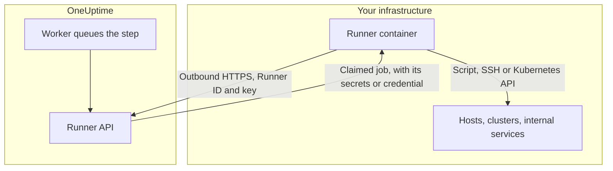
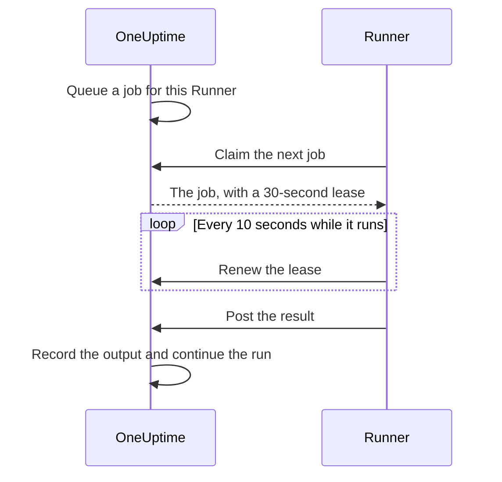

# Runbook Agents

A **Runbook Agent**, called a **Runner** in the dashboard, is a small self-hosted process that runs the JavaScript, Bash, SSH and Kubernetes steps of your runbooks **inside your own infrastructure**. The OneUptime Worker never runs your scripts: it queues them, and the Runner the step's author picked claims each one, runs it and posts the result back. This page is for whoever installs and operates Runners.

:::cards
- [Install a Runner](#install-a-runner): From the dashboard to a connected container, in five steps.
- [Point a step at a Runner](#point-a-step-at-a-runner): Bind a step to the Runner that should run it.
- [Timeouts](#timeouts): Claim and execution timeouts, and how they interact.
- [Environment variables](#environment-variables): What the container reads when it starts.
:::

## How it works



1. You create a Runner in OneUptime. OneUptime generates an ID and a secret key for it.
2. You run the Runner container on a host inside your infrastructure, with that ID and key and your OneUptime URL.
3. The Runner asks OneUptime for work every 5 seconds, and reports that it is alive every 60 seconds.
4. When you write a JavaScript, Bash, SSH or Kubernetes step, you pick the Runner from a dropdown. The step is bound to that Runner.
5. When the step runs, the Worker queues a job with `targetAgentId` set to that Runner. Only that Runner can claim it.
6. The Runner runs the job locally — `bash -c <script>` for Bash, an `isolated-vm` sandbox for JavaScript, an SSH connection or a call to the cluster's API server with the step's credential — captures the result, and posts it back. The Worker resumes the runbook with the result.

The Runner only needs **outbound HTTPS** to your OneUptime instance. It does not accept any inbound connections.

What a Runner holds is its ID and key. It receives everything else with the job it claims: a script, with the [runbook secrets](/docs/runbooks/credentials#secrets-for-scripts) assigned to it filled in, or the [credential](/docs/runbooks/credentials) an SSH or Kubernetes step names. That is why anyone holding a Runner's key can act as that Runner: treat the key like the credentials assigned to it.

## Why scripts run on a Runner

Running scripts on the OneUptime Worker had two problems:

- **Trust boundary.** Anyone who could author a runbook could run code on the Worker, with access to whatever the Worker could reach.
- **Reach.** Most useful steps act on _your_ infrastructure ("restart this service", "look up a record in our internal database"), not on OneUptime's.

With Runners, those steps run on a host you control, and you decide what that host can do. HTTP request and AI steps still run on the Worker, because they need nothing from your network.

## Before you begin

- **A host with Docker** inside your infrastructure, that can reach your OneUptime URL over HTTPS and the systems your steps act on.
- **A role that creates Runners.** Project Owner, Project Admin, Project Member and Runbook Admin can create one. Only a Project Owner, Project Admin or Runbook Admin can see a Runner's key, which the setup command contains.

## Install a Runner

### 1. Create the agent record

Go to **Runbooks → Runners** and create a new agent. Click **Create Runner** and fill in its two steps:

| Field | Step | Notes |
| --- | --- | --- |
| **Name** | **Runner** | A friendly name, usually where it runs and what it can reach, such as `prod-eu-west-1`. This is what you pick when you write a step. |
| **Description** | **Runner** | Optional. A sentence on what this host can reach. |
| **Labels** | **Runner** (under **More fields**) | Optional. |
| **Runs Runbooks** | **Capabilities** | On by default. Lets this Runner take runbook steps. |
| **Runs AI Code Fixes** | **Capabilities** | Off by default. Lets it open AI code-fix pull requests; see [Fix Tasks](/docs/ai/ai-agent). |
| **Runs AI Remediation Commands** | **Capabilities** | Off by default. Lets AI auto-remediation run policy-checked commands on it. Turning it on for a Runner that holds SSH credentials takes permission to read runbook credentials; see [Runners that run OneUptime AI's commands](/docs/runbooks/credentials#runners-that-run-oneuptime-ais-commands). |

A Runner picks up a change to its capabilities on its next heartbeat; there is no need to restart it.

### 2. Copy the install command

On the Runner's row, click **Show setup instructions**. The **Runner setup** dialog shows a `docker run` command preloaded with this Runner's ID and key. The same command is on the Runner's own page, under **Setup Instructions**.

Only a Project Owner, Project Admin or Runbook Admin can read the key. Anyone else sees "You do not have permission to view this Runner's key" instead of the command.

### 3. Run it on a host inside your infrastructure

Run the command on a host in your environment that can:

- reach your OneUptime instance over HTTPS, and
- do what your steps need to do, such as reach other hosts over SSH, call a cluster's API server or talk to a database.

```bash
docker run --name oneuptime-runner --restart unless-stopped \
  -e ONEUPTIME_RUNNER_ID=<runner-id> \
  -e ONEUPTIME_RUNNER_KEY=<runner-key> \
  -e ONEUPTIME_URL=https://oneuptime.yourdomain.com \
  -d oneuptime/runner:release
```

### 4. Verify the agent is connected

Go back to **Runbooks → Runners**. Within a minute of the container starting, the Runner's **Status** should read **Connected**, with a fresh **Last Seen**. On the Runner's own page, the **Runner Status** card shows its **Runner Version** and **Host**. If it stays **Never connected** or **Disconnected**, see [Troubleshooting](#troubleshooting).

### 5. Keep the agent up to date

When an agent runs an older version than your OneUptime, a warning sign appears beside its **Runner Version** on its page. Select it to see how to upgrade: pull the new image and remove the container, then run the install command from step 2 again. An agent the Kubernetes agent chart installed is upgraded with the chart instead.

```bash
docker pull oneuptime/runner:release
docker rm -f oneuptime-runner
```

## Point a step at a Runner

:::steps
### Add a step that runs on a Runner

In your runbook's **Steps**, add a JavaScript, Bash, SSH or Kubernetes step.

### Pick the Runner

The step's **Runner** dropdown lists every Runner in the project, with whether it is connected. If the project has none yet, the step says so and points you to **Runbooks › Runners**.

### Save the steps

Click **Save Steps**. When a run reaches the step, the Worker queues a job for that Runner's ID, and only that Runner can claim it.
:::

Bash is executed with `bash -c`. JavaScript runs in an `isolated-vm` sandbox on the Runner, with no filesystem or process access; it can call public HTTP APIs with `axios`, but not addresses on a private network. SSH and Kubernetes steps use the [credential](/docs/runbooks/credentials) the step names, which must be assigned to the same Runner.

Need more than one Runner? Create them, then point each step at the one that fits. For redundancy, run a second Runner and split your steps between them, or keep a backup runbook whose steps target the other Runner.

## Operational notes

### Timeouts

Two timeouts apply to every step that runs on a Runner:

| Timeout | Default | What it controls |
| --- | --- | --- |
| **Claim timeout** | 2 minutes | How long the Worker waits for the selected Runner to claim the job. If the Runner doesn't pick it up in time, the step fails as timed out and the runbook moves on (or stops, depending on **Continue on failure**). |
| **Execution timeout** | 30 seconds | How long the Runner lets the step run before stopping it. Bash gets `SIGKILL`; JavaScript's sandbox is torn down. |

Both are configurable per step. Open **Runbooks › your runbook › Steps**, expand the step, and set **Execution timeout** and **Claim timeout** (in seconds) under its settings. Leave a field blank to use the default. Each accepts 1 second to 1 hour; values outside that range are clamped when the step runs.

The Worker's overall wait window is `claim timeout + execution timeout + a few seconds`. Pick numbers that match the step.

Two things to keep in mind when you lower the claim timeout:

- The Runner asks for work on a poll cycle (`ONEUPTIME_RUNNER_POLL_INTERVAL_MS`, 5 seconds by default). A claim timeout shorter than one poll cycle can expire before a perfectly healthy Runner has even seen the job, and the step then fails with the same message an offline Runner causes.
- A Runner runs one job at a time by default (`ONEUPTIME_RUNNER_CONCURRENCY`). While a long step occupies it, other steps pointed at the same Runner wait out their own claim timeouts. If you raise an execution timeout to minutes, raise the claim timeout on the steps that share that Runner to match, or give them a different Runner.

### Lease and heartbeat



When a Runner claims a job, it gets a short lease (30 seconds by default). While the step runs, the Runner renews the lease every 10 seconds. If the Runner dies or loses its network mid-script, the lease expires and the Worker marks the job `TimedOut` rather than waiting forever.

Bash child processes are **not** automatically cancelled when the lease expires (a JavaScript sandbox is also left to finish, if it ever does), but the Worker stops waiting for them, and the Runner cannot submit a result once another claim has taken over. Design scripts to be safe to re-run if you care about exactly-once.

### If the OneUptime Worker restarts mid-step

A runbook execution runs on one Worker from start to finish, so a deploy or a crash can interrupt it while a step is in flight. What happens next depends on whether the execution gets picked back up:

- **It resumes.** The Worker that picks it up finds the job your step already created and **re-attaches to it**. It waits on that job rather than sending your Runner a second copy of the script. If the Runner had already finished, the recorded result is used as-is. A step is dispatched to a Runner at most once per execution.
- **It does not resume.** If the execution is never picked back up, a sweep marks it `Failed` once it has outlived the claim and execution window its current step was configured for, with a message naming that step. An execution never hangs in `Running`.

The one thing this cannot tell you is how far a script got before the Worker vanished. A step that was mid-run is reported as failed with a note that it may have partially run: check the target system before running the runbook again.

### No agent online

If the selected Runner is offline when the step runs, the job waits as `Pending` until the claim timeout elapses, and then the step fails with "No runbook agent picked up this step before the wait window expired." The **Runners** page is where you confirm coverage before running a runbook in anger.

### Output cap

Combined stdout and stderr are capped at **50 KB** per step. Longer output is cut off with a marker. If you need a full log, write it to your log store or object storage inside the script and `echo` the URL.

### Cancellation

Cancelling a runbook execution, from the execution page or the API, immediately marks all of its `Pending`, `Claimed` and `Running` jobs as `Cancelled`. A Runner that's already mid-script finishes its work, but the server does not accept its result, and no later step in the runbook is dispatched.

### Concurrency

Each Runner runs one job at a time by default. To allow more, set `ONEUPTIME_RUNNER_CONCURRENCY` on the container, but remember the Runner shares the host with whatever else lives there.

## Environment variables

The Runner reads these on startup:

| Variable | Required | Default | Notes |
| --- | --- | --- | --- |
| `ONEUPTIME_URL` | yes | — | Base URL of your OneUptime instance, such as `https://oneuptime.yourdomain.com`. |
| `ONEUPTIME_RUNNER_ID` | yes | — | The Runner's ID, from its setup command. |
| `ONEUPTIME_RUNNER_KEY` | yes | — | The Runner's secret key, from its setup command. |
| `ONEUPTIME_RUNNER_POLL_INTERVAL_MS` | no | `5000` | How often the Runner asks for new jobs. A value under `1000` falls back to the default. |
| `ONEUPTIME_RUNNER_HEARTBEAT_INTERVAL_MS` | no | `60000` | How often the Runner reports that it is alive. A value under `5000` falls back to the default. |
| `ONEUPTIME_RUNNER_JOB_HEARTBEAT_INTERVAL_MS` | no | `10000` | How often the Runner renews a running job's lease. A value under `1000` falls back to the default. |
| `ONEUPTIME_RUNNER_CONCURRENCY` | no | `1` | Maximum simultaneous jobs on this Runner. |
| `ONEUPTIME_RUNNER_ENABLE_RUNBOOKS` | no | — | Set to `false` to stop this Runner taking runbook steps, whatever the dashboard says. It can only turn the capability off. |
| `ONEUPTIME_RUNNER_ENABLE_CODE_FIXES` | no | — | Set to `false` to stop this Runner taking AI code-fix runs, whatever the dashboard says. |
| `ONEUPTIME_RUNNER_ENABLE_AI_COMMANDS` | no | — | Set to `false` to stop this Runner running AI remediation commands, whatever the dashboard says. |

## Rotating an agent key

If a key leaks, reset it. The old key stops working immediately.

:::steps
### Reset the key

Open the Runner from **Runbooks → Runners**, click **Reset Runner Key** and confirm. The Runner stops connecting until it has the new key.

### Run the container with the new key

Copy the new command from the Runner's **Setup Instructions**, remove the old container and run the new command on the same host:

```bash
docker rm -f oneuptime-runner
```

### Check that it reconnects

On **Runbooks → Runners**, the Runner's **Status** goes back to **Connected** within a minute.
:::

## Permissions

Managing agents lives under the existing Runbooks permission group:

- `CreateRunner`, `EditRunner`, `DeleteRunner`, `ReadRunner` — manage agent records.
- `RunbookAdmin`, `RunbookMember`, `RunbookViewer` (roles) — `RunbookAdmin` builds runbooks, their rules and the Runners they run on, and runs them. `RunbookMember` opens runbooks and their runs and runs them — it starts a run, completes or skips its steps and cancels it — but creates, changes and deletes no runbook or Runner. `RunbookViewer` reads runbooks and their runs and runs nothing. `RunbookAdmin` bundles all of the granular permissions above.

Triggering a runbook (and so dispatching its steps to Runners) takes a role that runs runbooks — `ProjectOwner`, `ProjectAdmin`, `ProjectMember`, `RunbookAdmin` or `RunbookMember` — or `CreateRunbookExecution`; completing, skipping or cancelling a run also accepts `EditRunbookExecution`. A role runs only the runbooks its scope reaches.

A Runner's key is readable only by Project Owners, Project Admins and Runbook Admins.

## Agent-facing API

For the curious: the Runner uses these endpoints, mounted under `/runner-ingest`. The pre-merge path `/runbook-agent-ingest` is still served for agents that have not been redeployed yet, so upgrading the server does not break them. They are authenticated by the Runner's ID and key in the JSON body (`agentId` and `agentKey`), or in the `x-agent-id` and `x-agent-key` headers.

| Endpoint | Purpose |
| --- | --- |
| `POST /heartbeat` | Liveness. Updates the Runner's last-seen time, version and host information, and returns the capabilities the project granted it. |
| `POST /claim-next-job` | Atomically claim the oldest `Pending` job targeted at this Runner's ID. Returns `{ job: null }` when there is nothing to do. |
| `POST /job/:jobId/heartbeat` | Refresh the job's lease. Returns 404 once the lease has lapsed or the job is terminal. |
| `POST /job/:jobId/result` | Submit the final outcome. Ignored if the lease has already moved on. |
| `POST /disconnect` | Sign off on a clean shutdown. |

You should not need to call these by hand: the bundled Runner does. They're documented here so you can build your own agent if you have a constraint that ours doesn't fit.

## Troubleshooting

:::details The Runner stays Never connected or Disconnected
- Check the container logs with `docker logs oneuptime-runner` for authentication errors or network failures.
- Check that the host can reach your OneUptime URL, for example with `curl`.
- Check that the ID and key were copied without whitespace, and that `ONEUPTIME_URL` is the address you open OneUptime at.

**Never connected** means the Runner has never reported in. **Disconnected** means it did, but not in the last 5 minutes.
:::

:::details Steps fail with "No runbook agent picked up this step before the wait window expired."
The step's Runner did not claim the job within its claim timeout. Check that the Runner is **Connected**, that **Runs Runbooks** is on for it, and that it is not busy with a long step: it runs one job at a time unless you raise `ONEUPTIME_RUNNER_CONCURRENCY`. A claim timeout shorter than the poll interval fails the same way.
:::

:::details Steps fail with "The runbook agent stopped responding while this step was running."
The Runner claimed the job, then stopped renewing its lease: it crashed, restarted or lost its network. Check that it is online, then check the target system before you run the runbook again.
:::

:::details The Runner logs "No capability is enabled"
Every capability is off for this Runner. Turn on **Runs Runbooks** on the Runner's page in OneUptime. It picks the change up on its next heartbeat.
:::

## Next steps

:::cards
- [Authoring a Runbook](/docs/runbooks/authoring): Write the steps that run on your Runner.
- [Runbook Credentials](/docs/runbooks/credentials): Give SSH and Kubernetes steps managed access.
- [Runbook Configuration & Safety](/docs/runbooks/configuration): Limits, permissions and hardening.
:::
