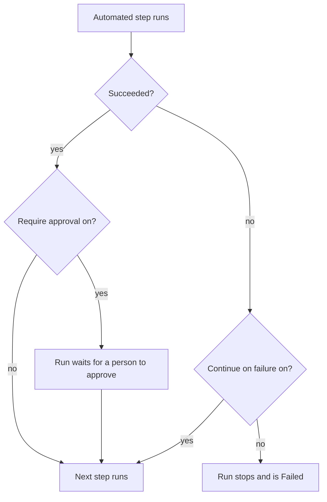

# Authoring a Runbook

You write a runbook as an ordered list of steps on its **Steps** page. This page shows how to create a runbook, how to set up each of the seven step types, and how failures and approvals change the course of a run.

:::cards
- [Create a runbook](#create-a-runbook): From an empty runbook to saved steps.
- [Step types](#step-types): Manual, JavaScript, HTTP request, Bash, SSH, Kubernetes and AI.
- [Failure handling and approvals](#failure-handling-and-approvals): What happens after a step fails, or succeeds.
- [A worked example](#a-worked-example): A five-step database failover.
:::

## Before you begin

- **A role that writes runbooks.** Project Owner, Project Admin and Runbook Admin create runbooks and save their steps. With granular permissions, you need **Create Runbook** and **Edit Runbook**. See [Permissions](/docs/runbooks/configuration#permissions).
- **A Runner, for JavaScript, Bash, SSH and Kubernetes steps.** These steps run on a [Runner](/docs/runbooks/agents) inside your own infrastructure, never on the OneUptime Worker. Install one first.
- **A credential, for SSH and Kubernetes steps.** See [Runbook Credentials](/docs/runbooks/credentials).
- **An LLM provider, for AI steps.** See [LLM Providers](/docs/ai/llm-provider).

## Create a runbook

:::steps
### Open Runbooks

Open **Products → Runbooks**. Runbooks is in the **Dashboards & Automation** group.

### Create the runbook

Click **Create Runbook**, enter a **Name** and, optionally, a **Description** of what the runbook is for. Under **More fields** are the **Enabled** switch, on by default, and **Labels**. The new runbook appears in the list: open it.

### Add steps

Go to **Steps**. Under **Start your runbook**, pick the type of the first step; below the last step, **Add another step** offers the same seven types. Each step opens with its **Title**, its **Description** (Markdown, shown to the responder) and the settings of its type.

### Put the steps in order

Steps run **in order**. To change the order, drag a step by the grip at the left of its header; from the keyboard, focus the grip, press Space, move the step with the arrow keys and press Space again.

### Save the steps

Click **Save Steps**. Until you do, the editor says **Unsaved changes**. Once saved, you see **Saved**, and the runbook is ready to [run](/docs/runbooks/running).
:::

## Anatomy of a step

Every step has these fields:

| Field | Purpose |
| --- | --- |
| **Title** | A short label, shown in the step list and on every run. |
| **Description** | Optional context for the responder, in Markdown. On a Manual step it is the instruction the responder reads. |
| **Continue on failure** | Automated steps only. If on, a failing step does not stop the run: the next step still runs. |
| **Require approval** | Automated steps only. If on, the runbook pauses after this step and waits for a user to approve before running the next step. The switch reads **Require approval before running the next step**. |
| Type-specific settings | The script, URL, Runner, credential or prompt. See [Step types](#step-types). |

## Step types

| Type | Runs on | Needs |
| --- | --- | --- |
| [Manual](#manual) | A person | Nothing |
| [JavaScript](#javascript) | A Runner | A Runner |
| [HTTP request](#http-request) | The OneUptime Worker | Nothing |
| [Bash](#bash) | A Runner | A Runner |
| [SSH](#ssh) | A Runner | A Runner and an SSH credential |
| [Kubernetes](#kubernetes) | A Runner | A Runner and a Kubernetes credential |
| [AI](#ai) | The OneUptime Worker | An LLM provider |

### Manual

A checklist item for a person. The run pauses when it reaches a Manual step and stays in `WaitingForManualStep` (**Waiting for you**) until someone clicks **Mark complete** or **Skip**. A run that waits for a person never times out.

Use it for what only a human can check or do: "Confirm traffic has moved to the secondary region in the load balancer dashboard."

### JavaScript

A snippet of JavaScript, run in an `isolated-vm` sandbox on a [Runbook Agent](/docs/runbooks/agents) inside your own infrastructure, not on the OneUptime Worker.

| Field | What it does | Default |
| --- | --- | --- |
| **Runner** | The Runner that runs the step. Only that Runner may claim the job. | — |
| **Script** | The JavaScript to run. `return` a value to capture it; each `console.log` line is captured too. Throwing an error fails the step. | — |
| **Execution timeout** | How long the Runner lets the snippet run before tearing the sandbox down. | 30 seconds |
| **Claim timeout** | How long the Worker waits for the Runner to pick the job up. | 2 minutes |

```javascript
const start = Date.now();
// ... your logic ...
console.log("replica lag checked");
return { durationMs: Date.now() - start };
```

The sandbox has no filesystem or process access. It can make HTTP requests with `axios`, but only to public addresses: a request to a private network, to the Runner's own host or to a cloud metadata endpoint is refused. To reach a service inside your network, use a [Bash](#bash) step with `curl`.

### HTTP request

An outbound HTTP call, made by the OneUptime Worker. No Runner is needed.

| Field | What it does | Default |
| --- | --- | --- |
| **Method** | `GET`, `POST`, `PUT`, `PATCH`, `DELETE` or `HEAD`. | `GET` |
| **URL** | The endpoint to call. | Empty |
| **Headers (JSON)** | A JSON object, such as `{ "Authorization": "Bearer ..." }`. Headers that are not valid JSON fail the step. | None |
| **Body** | Sent as JSON when it parses as JSON, and as text otherwise. | None |
| **Request timeout** | How long to wait for the endpoint to respond before failing the step. | 30 seconds |

The step succeeds on a `2xx` or `3xx` response and fails on anything else, with `HTTP <status>` as its error. Redirects are not followed. The response's status, headers and body are captured, up to 50 KB.

> [!NOTE]
> The Worker never calls loopback or link-local addresses, such as a cloud metadata endpoint. On OneUptime Cloud it calls public addresses only. A self-hosted OneUptime also reaches private networks, unless `DATA_SOURCE_BLOCK_PRIVATE_ADDRESSES` is `true`. To call a service inside your network from OneUptime Cloud, use a [Bash](#bash) step with `curl`.

Useful for: opening a PagerDuty incident, posting to a Slack webhook, calling your cloud provider's or your own public API.

### Bash

A bash script, run with `bash -c <script>` on a [Runbook Agent](/docs/runbooks/agents) in your own infrastructure. Bash never runs on the OneUptime Worker.

| Field | What it does | Default |
| --- | --- | --- |
| **Runner** | The Runner that runs the step. Only that Runner may claim the job. | — |
| **Bash script** | The script. Output (stdout and stderr) is captured up to 50 KB, and a non-zero exit code fails the step. | — |
| **Execution timeout** | How long the Runner lets the script run before killing it with `SIGKILL`. Raise it for steps that legitimately take minutes. | 30 seconds |
| **Claim timeout** | How long the Worker waits for the Runner to pick the job up. | 2 minutes |

The script runs inside the Runner's container, with the tools its image ships, such as `curl`, `wget` and the `ssh` client, and with the network access of the host it runs on. For example, to check a service that only your network can reach:

```bash
set -euo pipefail
HTTP_CODE=$(curl -s -o /tmp/resp.txt -w "%{http_code}" "http://payments.internal:8080/health")
echo "HTTP $HTTP_CODE"
cat /tmp/resp.txt
if [[ "$HTTP_CODE" != "200" ]]; then
  echo "Health check failed"
  exit 1
fi
```

If the selected Runner is offline when the run reaches this step, the step waits up to the **claim timeout** (default 2 minutes) and then fails as timed out. Add an agent under **Runbooks → Runners** before relying on a Bash step.

> [!TIP]
> Keep passwords and tokens out of the script. Store them as runbook secrets and write `{{runbookSecrets.NAME}}` in a Bash or JavaScript script: the Runner receives the script with the value filled in. See [Secrets for scripts](/docs/runbooks/credentials#secrets-for-scripts).

### SSH

Run one command on a host the Runner can reach over SSH. Unlike `ssh host cmd` in a Bash step, the access is a managed [credential](/docs/runbooks/credentials) rather than a private key on the Runner's disk: encrypted at rest, assigned to specific Runners, and never readable back through the API.

| Field | What it does |
| --- | --- |
| **Runner** | The Runner that opens the connection. It must be able to reach the host on the network. |
| **Credential** | An SSH credential holding the host, port, user and key or password. It must be assigned to the Runner you picked, or the step fails rather than running with the wrong access. |
| **Command** | Run on the remote host as the credential's user. Output is captured up to 50 KB, and a non-zero exit code fails the step. |
| **Execution timeout** | Covers connecting, authenticating and running the command together, so a command that hangs cannot hold the step open. Default 30 seconds. |
| **Claim timeout** | How long the Worker waits for the Runner to pick the job up. Default 2 minutes. |

### Kubernetes

Restart or scale a workload in a cluster. The actions are a closed set on purpose: a step that could change arbitrary objects would be a cluster-admin shell, and this step type exists to make the common remediations safe enough for auto-remediation.

| Field | What it does |
| --- | --- |
| **Runner** | The Runner that calls the cluster's API server. It must be able to reach it. |
| **Credential** | A Kubernetes credential: the API server URL, a service account token and the cluster CA. Bind that service account to a role that permits only what your runbooks need. |
| **Action** | **Restart workload** changes the pod template so the controller recreates the pods, as `kubectl rollout restart` does. **Scale workload** sets the replica count. |
| **Workload kind** | **Deployment**, **StatefulSet** or **DaemonSet**. |
| **Namespace** and **Workload name** | The workload to act on. |
| **Replicas** | Scale only. Zero is allowed: draining a workload is a legitimate remediation. A DaemonSet runs one pod per node and cannot be scaled; restart it instead. |
| **Execution timeout** | How long the Runner waits for the API server to accept the change. Default 30 seconds. |
| **Claim timeout** | How long the Worker waits for the Runner to pick the job up. Default 2 minutes. |

If the API server refuses the change, its own message is shown on the step, so a permission failure tells you which role binding to widen.

### AI

Ask AI to analyze, summarize or decide something mid-run. The response becomes the step's output on the execution. AI steps run on the OneUptime Worker; no Runner is needed.

| Field | What it does |
| --- | --- |
| **Prompt** | What the AI should do. For example: "Review the output of the previous steps and say whether it is safe to proceed with remediation." |
| **LLM provider** | Optional. **Project default** uses the project's default provider. Pin a provider when the step needs a specific model, such as a self-hosted one for data that must not leave your network. See [LLM Providers](/docs/ai/llm-provider). |
| **Include previous step context** | If on, the AI sees everything about the steps that ran before this one: title, type, status, output and error messages. |
| **Include trigger context** | If on, the AI sees what started the run: the linked incident, alert or scheduled maintenance event (its description, severity, current state, affected monitors, root cause, state timeline and public notes), or who ran the runbook by hand. |

Pair an AI step with **Require approval** to keep a person in the loop: the AI analyzes, a responder reads its answer and approves, and only then does the next (remediation) step run.

**What the AI never sees.** An AI step's answer is stored as step output on the execution, and executions are readable by anyone with runbook-read permission, a wider audience than the incident's. So the trigger context leaves out **private internal notes** and **Slack and Microsoft Teams channel messages**. The output of earlier steps is scanned for secrets (tokens, keys, credentials), which are redacted before it is sent to the model.

AI steps are metered and billed like any other AI feature. The step fails, with a message that says why, when it has no prompt, when AI features are turned off for the project, when no LLM provider is available, or when the pinned provider is no longer available to the project. Turn on **Continue on failure** if the rest of the runbook should still run.

## Failure handling and approvals



By default, a failing step halts the run and marks the execution `Failed`, with the step's error as the reason. With **Continue on failure** on, the failure is recorded and the next step runs, which suits "try these three things, then notify" runbooks. **Require approval** applies after a step succeeds: the run waits on that step until someone clicks **Approve & continue** or **Skip**.

## Saving and editing

Changes to the steps take effect when you click **Save Steps**. Each run works from the snapshot taken when it started, so executions already in flight keep the steps they started with, and editing never rewrites the history of past runs.

## A worked example

A runbook for "DB primary unreachable":

| # | Type | What it does |
| --- | --- | --- |
| 1 | JavaScript | Fetch the current primary host from your config service and log it. |
| 2 | Manual | "Confirm replication lag in the secondary is under 5 seconds." |
| 3 | HTTP request | `POST` to your failover orchestrator's API. |
| 4 | Manual | "Verify writes are now going to the new primary." |
| 5 | HTTP request | `POST` an all-clear message to a Slack webhook. |

The responder watches step 1 run, ticks off step 2, watches step 3 run, ticks off step 4, and the run ends with step 5. Every step's output is captured for the postmortem.

## Next steps

:::cards
- [Running a Runbook](/docs/runbooks/running): Start a run, and complete, approve or skip its steps.
- [Runbook Rules](/docs/runbooks/rules): Start this runbook automatically on matching incidents.
- [Runbook Agents](/docs/runbooks/agents): Install the Runner your script steps need.
- [Runbook Credentials](/docs/runbooks/credentials): Give SSH and Kubernetes steps managed access.
:::
