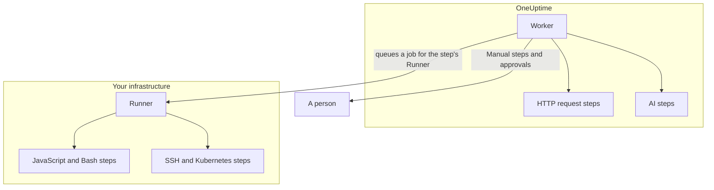

# Runbook Configuration & Safety

This is the reference for operators and security reviewers: where each kind of step runs, the limits and timeouts a step is held to, who may do what, and how runbooks are hardened.

:::cards
- [Where each step type runs](#where-each-step-type-runs): The Worker, a Runner or a person.
- [Output caps and timeouts](#output-caps-and-timeouts): Every limit a step is held to.
- [Permissions](#permissions): Granular permissions, the three runbook roles, and which runbooks a role reaches.
- [Hardening notes](#hardening-notes): Sandboxing, network access and Runner authentication.
:::

## Where each step type runs

| Step type | Runs on | How |
| --- | --- | --- |
| Manual | A person | The run waits until someone completes or skips the step. |
| JavaScript | A Runner | In an `isolated-vm` sandbox. |
| HTTP request | The OneUptime Worker | An outbound HTTP call. |
| Bash | A Runner | `bash -c <script>`. |
| SSH | A Runner | An SSH connection, with a [credential](/docs/runbooks/credentials). |
| Kubernetes | A Runner | A call to the cluster's API server, with a credential. |
| AI | The OneUptime Worker | A call to the project's LLM provider. |

## How Runner steps are dispatched

JavaScript, Bash, SSH and Kubernetes steps **never execute on the OneUptime Worker**. They are dispatched as jobs to a specific [Runbook Agent](/docs/runbooks/agents): a small process you install on a host inside your own infrastructure.

The dispatch model:

1. The runbook step author picks a Runner from the dropdown when writing the step.
2. When the step runs, the Worker inserts a row in `RunnerJob` with `targetAgentId` set to that Runner's ID and status `Pending`.
3. That specific Runner (and only that Runner) atomically claims the job, runs it locally — Bash via `bash -c <script>`, JavaScript inside an `isolated-vm` sandbox, SSH and Kubernetes with the step's credential — and posts the result back.
4. The Worker resumes the runbook with the result.

There is no `RUNBOOK_BASH_ENABLED` environment flag any more. Whether these steps work in a deployment depends entirely on whether the project has a connected Runner with **Runs Runbooks** on.

## Output caps and timeouts

| Limit | Value | Applies to |
| --- | --- | --- |
| Output per step | **50 KB**. Longer output is cut off with a marker. | Every automated step |
| Execution timeout | **30 seconds** by default | JavaScript, Bash, SSH and Kubernetes steps |
| Request timeout | **30 seconds** by default | HTTP request steps |
| Claim timeout | **2 minutes** by default: how long the Worker waits for the selected Runner to pick up the job before failing it | JavaScript, Bash, SSH and Kubernetes steps |
| Timeout range | **1 second to 1 hour** | Every timeout |
| Waiting for a person | No limit | Manual steps and approvals |

Set the timeouts per step on the runbook's **Steps** page; leave a field blank to keep the default. A value outside the range is clamped when the step runs, so a mistyped config can neither disable the timeout nor pin a Worker slot open indefinitely.

## Permissions

Runbook permissions live in the `Runbook` permission group:

- `CreateRunbook`, `EditRunbook`, `DeleteRunbook`, `ReadRunbook` — manage runbook templates.
- `CreateRunbookExecution`, `EditRunbookExecution`, `DeleteRunbookExecution`, `ReadRunbookExecution` — start, tick off, delete and read executions.
- `CreateRunbookRule`, `EditRunbookRule`, `DeleteRunbookRule`, `ReadRunbookRule` — manage auto-trigger rules.
- `CreateRunner`, `EditRunner`, `DeleteRunner`, `ReadRunner` — manage Runners that execute steps in your own infrastructure. (These were named `*RunbookAgent` before the Runner rename; existing grants were migrated, so nothing needs reassigning.)
- `RunbookAdmin`, `RunbookMember`, `RunbookViewer` (roles) — `RunbookAdmin` builds runbooks, their rules and the Runners they run on, and runs them. `RunbookMember` opens runbooks and their runs and runs them — it starts a run, completes or skips its steps and cancels it — but creates, changes and deletes no runbook or Runner. `RunbookViewer` reads runbooks and their runs and runs nothing. `RunbookAdmin` bundles all of the granular permissions above.

A role runs the runbooks its scope reaches. A `RunbookMember`, `RunbookAdmin` or `ProjectMember` grant limited to some labels starts and moves along runs of the runbooks that carry those labels, one scoped to **Owned** those of the runbooks its team owns, and a team's block on a label takes those runbooks away. `CreateRunbookExecution` and `EditRunbookExecution` are about runs, which carry no labels, so they reach every runbook in the project. Approving a remediation suggestion that starts a runbook is checked the same way.

Credentials and secrets sit outside `RunbookAdmin`. Managing them takes `ProjectOwner` or `ProjectAdmin`, or the `CreateRunbookCredential`, `EditRunbookCredential`, `DeleteRunbookCredential`, `ReadRunbookCredential` and `CreateRunbookSecret`, `EditRunbookSecret`, `DeleteRunbookSecret`, `ReadRunbookSecret` permissions. See [Runbook Credentials](/docs/runbooks/credentials).

For how roles and granular permissions combine, see [Users, Teams & Permissions](/docs/permissions/index).

## Queue & worker

Runbook executions run on the `Runbook` BullMQ queue. Each Worker process runs up to 25 executions at once; the number is fixed in the code, not set by an environment variable.

When a manual step is ticked off via the API, the execution is re-enqueued to continue from the next step. It waits as `Scheduled` until a Worker picks it up again, and a queued execution is never failed for waiting.

## Hardening notes

- **JavaScript, Bash, SSH and Kubernetes** run on a Runner host you control, not on the OneUptime Worker. JavaScript runs in a separate `isolated-vm` isolate with 128 MB of memory and no access to the Runner's filesystem or processes; it can make HTTP requests with `axios`, but requests to private networks, loopback and link-local addresses are refused. Bash runs via `bash -c`, with its timeout enforced on the Runner.
- **HTTP steps** use a permissive status validator, so a 4xx or 5xx response is recorded as a failed step rather than thrown, and the captured output reflects what the upstream actually returned. Redirects are not followed. The Worker never calls loopback or link-local addresses, such as a cloud metadata endpoint; on OneUptime Cloud it also refuses private network addresses, and a self-hosted OneUptime refuses them with `DATA_SOURCE_BLOCK_PRIVATE_ADDRESSES=true`.
- **AI steps** never see private incident notes or Slack and Microsoft Teams messages, and earlier step output is scanned for secrets, which are redacted, before it reaches the model. See [AI](/docs/runbooks/authoring#ai).
- **Runner auth** is by ID and secret key, set on the Runner container as environment variables. Server-side, the authoritative Runner identity comes from the database row keyed by the presented ID and key: a client cannot impersonate a different Runner even with a compromised key.
- **Credentials and secrets** are encrypted at rest, never returned by the API, and handed only to the Runners they are assigned to, when those claim a step.

## Database tables

| Table | What it holds |
| --- | --- |
| `Runbook` | The template: name, slug, description, `isEnabled`, labels and the steps as JSON. |
| `RunbookExecution` | One row per run, with nullable `incidentId`, `alertId` and `scheduledMaintenanceId` foreign keys and a JSON `stepExecutions` array snapshotting the steps and each step's state. |
| `RunbookRule` | Auto-trigger rules, with a `triggerEntityType` discriminator (Incident, Alert, ScheduledMaintenance), a many-to-many relationship to runbooks to start, and what they match on: a JSON `criteria` column (the conditions) plus many-to-many links to monitors, incident severities, alert severities, labels and monitor labels, and title, description, monitor name and monitor description patterns. |
| `Runner` | One row per installed Runner: name, secret key, `lastAlive`, `connectionStatus`, host info and capabilities. |
| `RunnerJob` | One row per step dispatched to a Runner: `targetAgentId` (the Runner the step author picked), step type, script or payload, status (`Pending` → `Claimed` → `Running` → `Succeeded`, `Failed`, `TimedOut` or `Cancelled`), claim deadline, lease, output and exit code. |
| `RunbookCredential` | SSH and Kubernetes credentials, with their secret fields encrypted, and the Runners they are assigned to. |
| `RunbookSecret` | Runbook secrets, encrypted, and the Runners that may receive them. |

## Operational tips

- **Make sure the Runner you pick on a step is healthy.** If you need redundancy, run a second Runner and split your steps between them, or keep a backup runbook that targets the other Runner.
- **Capture URLs, not blobs.** If a step generates more than a few KB of output, write it to object storage or your logging stack and return the URL.
- **Idempotency matters.** An HTTP request or AI step runs again if the Worker restarts mid-step and the run resumes. A step on a Runner is dispatched at most once per execution, but a script may have partly run before a failure, and you may run the runbook again. Design steps to be safe to retry.

## Next steps

:::cards
- [Runbook Agents](/docs/runbooks/agents): Install, operate and troubleshoot Runners.
- [Runbook Credentials](/docs/runbooks/credentials): Managed SSH and Kubernetes access, and secrets for scripts.
- [Users, Teams & Permissions](/docs/permissions/index): How roles, labels and teams decide who runs what.
:::
