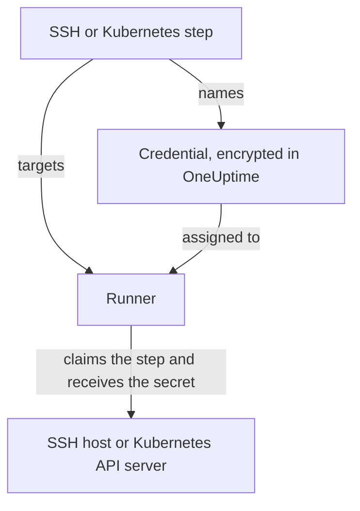

# Runbook Credentials

A credential is how a runbook reaches something that is **not** the Runner's own host — a server over SSH, or a Kubernetes cluster. Without one, "restart the service" means writing a shell script and provisioning a key or a kubeconfig onto the Runner host by hand, where it sits on disk outside OneUptime's control. A credential is that same access as a managed object: encrypted at rest, assigned to specific Runners, and referenced by name from a step.

Manage them under **Runbooks → Runners → Credentials**.

:::cards
- [Create a credential](#create-a-credential): Its access, and the Runners that may use it.
- [Least privilege on the far side](#least-privilege-on-the-far-side): Limit what the key or token can do.
- [Secrets for scripts](#secrets-for-scripts): Give a Bash or JavaScript script a password or token.
:::

## How a credential is used



An SSH or Kubernetes step names a credential and a Runner. When that Runner claims the step, OneUptime checks that the credential is assigned to it, decrypts the secret and hands it over in the answer to that claim only. The secret is never stored on the job and never readable through the API.

## Before you begin

- **A role that manages credentials.** Project Owner and Project Admin, or anyone with the **Create Runbook Credential** permission. The Runbook Admin role does not include it. Assigning an SSH credential to a Runner that runs OneUptime AI's commands also takes **Read Runbook Credential**; see [Runners that run OneUptime AI's commands](#runners-that-run-oneuptime-ais-commands).
- **A plan that includes them.** On OneUptime Cloud, runbook credentials need the **Growth** plan or above.
- **A [Runner](/docs/runbooks/agents)** that can reach the host or the cluster's API server over the network.

## Create a credential

:::steps
### Open Credentials

Open **Runbooks → Runners → Credentials** and click **Create Runbook Credential**.

### Name it and pick its type

On the **Credential** step, enter a **Name**, such as `prod-cluster`, an optional **Description**, and the **Type**: **SSH** or **Kubernetes**. The type cannot be changed later; create a new credential instead.

### Enter the access

:::tabs
@tab SSH
On **SSH Host**, enter the **Hostname**, the **Port** (22 when left empty) and the **Username**. On **SSH Authentication**, paste a **Private Key (PEM)**, with its **Private Key Passphrase** if it has one, or enter a **Password** for a host without key access. A key is the better option where you have the choice.
@tab Kubernetes
On **Kubernetes**, enter the **API Server URL**, such as `https://10.0.0.1:6443`, the **Service Account Token**, and the **CA Certificate (PEM)** so the Runner can verify the API server. Leave the CA empty only if the API server presents a certificate the Runner already trusts.
:::

### Assign it to Runners

On the **Runners** step, pick the Runners that may use the credential, then click **Create Runbook Credential**. A credential assigned to no Runner can be used by no step.

### Use it in a step

In an [SSH or Kubernetes step](/docs/runbooks/authoring#step-types), pick one of those Runners, then the credential under **Credential**. A step only offers credentials of its own type.
:::

## What is stored

| Type | Fields |
| --- | --- |
| SSH | Hostname, port (defaults to 22), username, and either a PEM private key (with an optional passphrase) or a password. |
| Kubernetes | API server URL, a service account token, and the cluster CA certificate. |

## Secret values are write-only

Private keys, passphrases, passwords and service account tokens are encrypted at rest and the API **never returns them** — not to the dashboard, not to a workflow, not to an export. The table can show you what a credential *is* without ever showing what it holds.

That means there is no "view" for a secret value, only "replace": re-entering a value is how you rotate it. If you lose the original, issue a new key on the target system and update the credential.

## Assigning a credential to Runners

A credential is usable only by the Runners you assign it to, and a step must target one of those Runners. If a step names a credential its Runner is not assigned to, the step **fails rather than running** — a Runner that silently does nothing looks exactly like one that worked.

The assignment is the access boundary, so keep it narrow: a Runner that only ever restarts one cluster does not need the SSH key for your database hosts.

### Runners that run OneUptime AI's commands

On a Runner with **Runs AI Remediation Commands** on, OneUptime AI picks from the SSH credentials assigned to the Runner for the commands it runs there. So an SSH credential reaches such a Runner only through someone who may read runbook credentials (**Read Runbook Credential**, or a Project Owner or Project Admin), whichever is saved first:

- **Assigning the credential.** Creating an SSH credential with such a Runner, or adding such a Runner to one, takes that permission. Without it, the save is refused and names the Runner: assign the credential to Runners that don't run AI remediation commands, or ask someone who has the permission to assign it.
- **Turning the switch on.** Turning on **Runs AI Remediation Commands** for a Runner that holds SSH credentials takes the same permission.

Removing Runners from a credential, saving a credential with the Runners it has, and Kubernetes credentials ask nothing more: OneUptime AI's kubectl commands run with the credential bound to their cluster. Assigning credentials and turning the switch on by someone without that permission are saved one at a time in a project, so the two can't pass their checks together; a save that comes while another is being saved waits for it, and if that takes too long it is refused with *Try again in a moment*. Save it again.

A workflow's steps act as a Project Admin, but are not lent a Project Admin's read of runbook credentials: a step has it only when the person who last saved the workflow's steps has it. See [What workflow steps can do](/docs/workflows/configuration#what-workflow-steps-can-do).

## Least privilege on the far side

OneUptime cannot restrict what your credential is allowed to do on the target system — that is the target system's job, and it is worth doing:

- **SSH** — prefer a key over a password, give the user only the commands it needs (a forced command or a restricted shell where practical), and do not reuse an administrator's personal key.
- **Kubernetes** — bind the service account to a Role that permits `patch` on exactly the workloads your runbooks touch, in exactly the namespaces they run in. **Restart workload** patches the workload itself, and **Scale workload** patches its `scale` subresource: nothing more is needed.

For example, a service account that may restart and scale one Deployment, and nothing else:

```yaml title="oneuptime-runbooks-rbac.yaml"
apiVersion: v1
kind: ServiceAccount
metadata:
  name: oneuptime-runbooks
  namespace: checkout
---
apiVersion: rbac.authorization.k8s.io/v1
kind: Role
metadata:
  name: oneuptime-runbooks
  namespace: checkout
rules:
  # Restart workload: patches the Deployment's pod template.
  - apiGroups: ["apps"]
    resources: ["deployments"]
    resourceNames: ["checkout-api"]
    verbs: ["patch"]
  # Scale workload: patches the Deployment's scale subresource.
  - apiGroups: ["apps"]
    resources: ["deployments/scale"]
    resourceNames: ["checkout-api"]
    verbs: ["patch"]
---
apiVersion: rbac.authorization.k8s.io/v1
kind: RoleBinding
metadata:
  name: oneuptime-runbooks
  namespace: checkout
subjects:
  - kind: ServiceAccount
    name: oneuptime-runbooks
    namespace: checkout
roleRef:
  apiGroup: rbac.authorization.k8s.io
  kind: Role
  name: oneuptime-runbooks
```

For a StatefulSet or DaemonSet, use `statefulsets` or `daemonsets` instead. A DaemonSet cannot be scaled, so it needs no `scale` rule.

## Secrets for scripts

Bash and JavaScript steps have no **Credential** field. To give a script a password, a token or an API key without writing it into the runbook, store it as a **runbook secret**. Secrets are managed under **Runbooks → Settings → Secrets**, by Project Owners and Project Admins or with the **Create Runbook Secret** permission.

:::steps
### Create the secret

Click **Create Runbook Secret**. On the **Secret** step, enter a **Name** (letters, numbers, hyphens and underscores), an optional **Description** and the **Secret Value**. On the **Access** step, pick the Runners under **Runbook agents which have access to this secret**.

### Use it in a script

Write `{{runbookSecrets.NAME}}` where the value goes:

```bash
curl -s -X POST \
  -H "Authorization: Bearer {{runbookSecrets.CDN_API_TOKEN}}" \
  "https://api.cdn.example.com/v1/purge"
```

When a Runner the secret is assigned to claims the step, it receives the script with the value filled in.
:::

Like a credential's secret fields, a secret's value is encrypted at rest and never returned by the API: **Update Secret Value** replaces it. On OneUptime Cloud, runbook secrets also need the **Growth** plan or above.

| | Credential | Runbook secret |
| --- | --- | --- |
| Used by | SSH and Kubernetes steps | Bash and JavaScript scripts |
| Holds | A host and its key, or a cluster's URL and token | Any single value |
| Managed under | **Runbooks → Runners → Credentials** | **Runbooks → Settings → Secrets** |
| Reaches the Runner | In the answer to the claim of a step that names it | Filled into the script of the step it claims |
| Read back through the API | Its non-secret fields only | Never its value |

## Who can see them

Creating, editing and deleting credentials needs the Runbook Credential permissions (or Project Owner/Admin). Reading a credential shows its non-secret fields only.

Note that a Runner's **agent key** is equivalent to the credentials assigned to that Runner: anything holding the key can claim work as that Runner and receive credential material. Agent keys are readable only by Project Owners, Project Admins and Runbook Admins for that reason — treat them the same way you would treat the credentials themselves.

## Next steps

:::cards
- [Authoring a Runbook](/docs/runbooks/authoring): Write the SSH and Kubernetes steps that use a credential.
- [Runbook Agents](/docs/runbooks/agents): Install the Runner a credential is assigned to.
- [Runbook Configuration & Safety](/docs/runbooks/configuration): Permissions and hardening for the whole runbook stack.
:::
