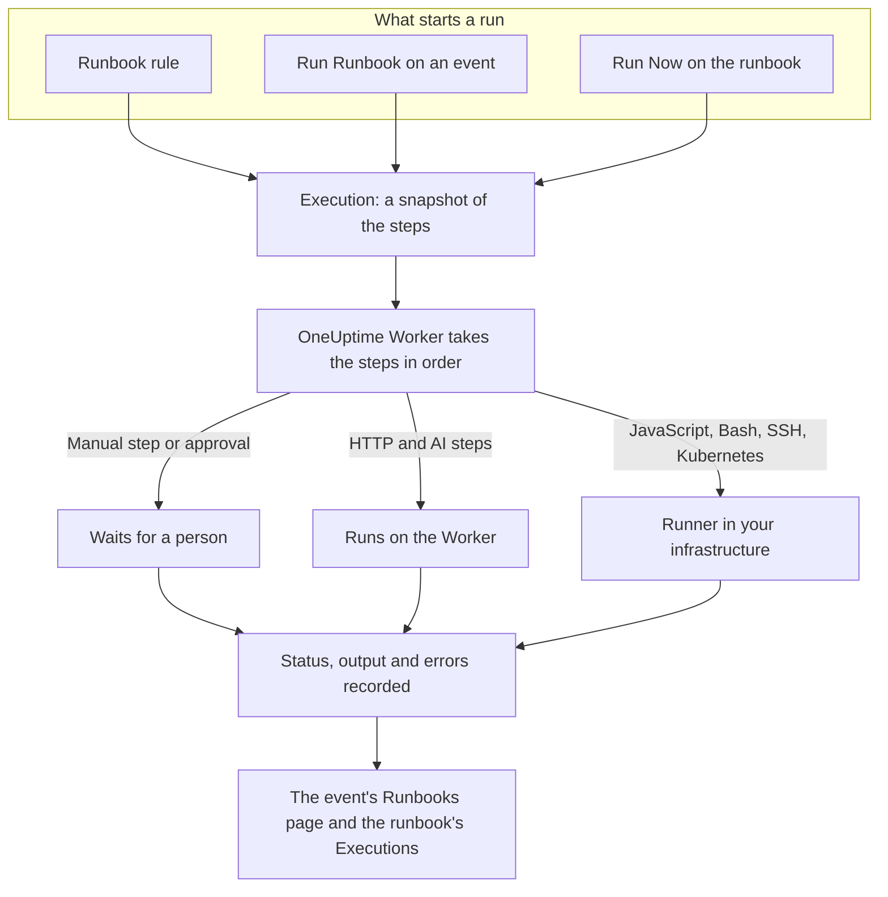

# Runbooks Overview

A runbook is a reusable response procedure: an ordered list of manual and automated steps that you run on an incident, an alert or a scheduled maintenance event. It turns the "what do we do now?" thread into a checklist anyone on call can follow at 3am, with the scripts, API calls and approvals already written. Runbooks are for the on-call engineers who respond to incidents and for the platform teams who automate that response.

:::cards
- [Authoring a Runbook](/docs/runbooks/authoring): Create a runbook and write its steps.
- [Runbook Rules](/docs/runbooks/rules): Start runbooks on new incidents, alerts and maintenance events.
- [Running a Runbook](/docs/runbooks/running): Start a run, complete and approve its steps, cancel it.
- [Runbook Agents](/docs/runbooks/agents): Install the Runner that runs your scripts in your own infrastructure.
:::

## How a runbook runs



Every run is an **execution**. When it starts, the runbook's steps are copied onto it, and OneUptime works through them in order. A Manual step, or a step that needs approval, pauses the run until someone acts on it.

HTTP and AI steps run on the OneUptime Worker. JavaScript, Bash, SSH and Kubernetes steps run on a [Runner](/docs/runbooks/agents) you install in your own infrastructure, so your scripts never run on OneUptime's servers. Each step's status, output and error message are recorded on the execution, which stays with the incident, alert or event it ran for.

## Key concepts

| Term | Meaning |
| --- | --- |
| **Runbook** | The template. A named, reusable procedure with an ordered list of steps and a **Run this runbook** switch. |
| **Step** | One item in a runbook. It has a type (Manual, JavaScript, HTTP request, Bash, SSH, Kubernetes or AI), a title, a description and type-specific settings. |
| **Runbook Rule** | A rule that auto-attaches one or more runbooks to incidents, alerts, or scheduled maintenance events that match its conditions: their monitors, severity, labels, monitor labels, title or description. |
| **Execution** | One run of a runbook. Created when a rule fires, when someone clicks **Run Runbook** on an event, or when someone clicks **Run Now** on the runbook itself. It holds a snapshot of the steps and each step's status and output. |
| **Snapshot** | The frozen copy of the runbook's steps that lives on each execution. You can edit the runbook later without rewriting the history of past runs. |
| **Runner** | A small agent you run on a host in your own infrastructure. It runs the JavaScript, Bash, SSH and Kubernetes steps that name it. Also called a Runbook Agent. |
| **Credential** | Managed SSH or Kubernetes access that SSH and Kubernetes steps use. Encrypted at rest and handed only to the Runners you assign it to. |

## Step types

Pick the type that fits each step. [Authoring a Runbook](/docs/runbooks/authoring) has every type's settings.

| Step type | Runs on | Reach for it when… | Example |
| --- | --- | --- | --- |
| **Manual** | A person | A human has to verify something, make a judgement call, or act where OneUptime can't. | "Confirm traffic has moved to the secondary region." |
| **JavaScript** | A Runner | You need a small, contained computation, sandboxed. | Compute replica lag and decide whether to proceed. |
| **HTTP request** | The OneUptime Worker | You're calling an existing API: a cloud provider, PagerDuty, a Slack webhook, your own service. | `POST` to your failover orchestrator. |
| **Bash** | A Runner | You need shell commands on your own infrastructure. | Run `kubectl rollout restart` or a recovery script. |
| **SSH** | A Runner | You need one command on a remote host, with a managed SSH credential. | Restart a service on a web server. |
| **Kubernetes** | A Runner | You need to restart or scale a Deployment, StatefulSet or DaemonSet. | Restart `checkout-api` in `production`. |
| **AI** | The OneUptime Worker | You want an analysis, a summary or a judgement call mid-run, from your project's LLM provider. | "Review the diagnostics above. Is it safe to fail over?" |

A runbook can mix all of them. The strength of runbooks is interleaving human checks with automation and AI analysis.

## What starts a run

| How | Where | The execution is attached to |
| --- | --- | --- |
| A runbook rule | **Incidents**, **Alerts** or **Scheduled Maintenance** → **Rules** → **Runbook Rules** | The new incident, alert or event |
| **Run Runbook** | The **Runbooks** page of an incident, alert or scheduled maintenance event | That event |
| **Run Now** | The runbook's **Overview** page | Nothing: an ad-hoc run |
| An auto-remediation rule | See [AI SRE](/docs/ai/ai-sre) | The incident or alert |

A runbook whose **Run this runbook** switch is off, on its **Settings** page, is not started by any of these. Runs that already started carry on.

## Where runbooks live in the dashboard

Runbooks is under **Products**, in the **Dashboards & Automation** group.

| Page | What you do there |
| --- | --- |
| **Products → Runbooks** | Browse, create and open runbooks. |
| A runbook's **Steps** | Write and reorder its steps, then **Save Steps**. |
| A runbook's **Overview** | See its last run and outcomes, and click **Run Now**. |
| A runbook's **Executions** | Every run of this runbook, filtered by status or start date. |
| A runbook's **Settings** | Turn **Run this runbook** off without deleting the runbook. |
| **Runbooks → Executions** | Every run of every runbook in the project. |
| **Runbooks → Runners** and **Runbooks → Runners → Credentials** | Install [Runners](/docs/runbooks/agents) and manage [credentials](/docs/runbooks/credentials). |
| **Incidents / Alerts / Scheduled Maintenance → Rules → Runbook Rules** | Create the rules that start runbooks automatically. |
| An incident, alert or maintenance event → **Runbooks** | See the runs attached to it, and click **Run Runbook** to start one. |

## A worked example

Suppose you want every incident with "db-primary" in its title to start a five-step database failover runbook.

:::steps
### Create the runbook

Under **Runbooks**, click **Create Runbook** and name it "DB primary failover". Open it, go to **Steps** and add these steps, then click **Save Steps**:

| # | Type | Title |
| --- | --- | --- |
| 1 | JavaScript | Capture pre-failover replica lag |
| 2 | Manual | Confirm the replica is healthy in the DBA dashboard |
| 3 | HTTP request | `POST` to the failover orchestrator |
| 4 | Manual | Verify writes are going to the new primary |
| 5 | HTTP request | Post the all-clear to `#db-incidents` in Slack |

### Add a rule

Under **Incidents → Rules → Runbook Rules**, create a rule with one condition and the runbook to start:

```text
Conditions:  Incident Title starts with db-primary
Runbooks:    [DB primary failover]
```

### Let it run

A monitor opens incident `INC-4821 · db-primary connection timeout`. The rule matches and an execution starts:

- Step 1 (JavaScript) runs on the Runner you picked for it. Its return value, such as `{ lagMs: 412 }`, is captured.
- Step 2 (Manual) pauses the run, which shows **Waiting for you**. The on-call checks the dashboard and clicks **Mark complete**.
- Step 3 (HTTP request) runs, and the `POST` response is captured.
- Step 4 (Manual) pauses the run again until someone completes it.
- Step 5 (HTTP request) runs, and the execution is **Completed**.

### Review it

The execution stays on the incident's **Runbooks** page. When you write the postmortem, every step's output, error and timing is one click away.
:::

## Common use cases

- **Database failover**: capture state with JavaScript, ask the on-call DBA to confirm replica health (Manual), call the orchestrator (HTTP request), confirm DNS (Manual), post the all-clear (HTTP request).
- **Cache flush**: one HTTP request, then a Manual "confirm the cache hit rate is recovering".
- **Customer-impacting incident**: Manual "post a status page update", HTTP request to notify the support team, JavaScript to pull the list of affected accounts.
- **Scheduled maintenance pre-flight**: snapshot metrics, confirm the change window with stakeholders (Manual), enable maintenance mode on the load balancer (HTTP request).
- **Diagnose, then fix**: a Bash step collects diagnostics, an AI step with **Require approval** reads them and recommends a fix, and a Kubernetes step restarts the workload only once a person has approved.
- **Always-run hygiene**: a rule with no conditions that captures system state on every incident, for the postmortem.

## How runbooks fit with the rest of OneUptime

- **Monitors** open incidents and alerts, and **runbook rules** turn them into runbook executions: detect, trigger, respond, record.
- **[On-call policies](/docs/on-call/schedules)** decide who is paged. Runbooks decide what that person does once they are awake.
- **[Workspace connections](/docs/workspace-connections/slack)** such as Slack and Microsoft Teams are natural targets for HTTP request steps that post updates.
- **[Status pages](/docs/status-pages/index)** are often updated as a Manual step of a customer-facing runbook.

## Next steps

:::cards
- [Authoring a Runbook](/docs/runbooks/authoring): Create your first runbook and its steps.
- [Runbook Agents](/docs/runbooks/agents): Install a Runner before you write a JavaScript, Bash, SSH or Kubernetes step.
- [Runbook Rules](/docs/runbooks/rules): Start runbooks automatically when incidents are created.
- [Runbook Configuration & Safety](/docs/runbooks/configuration): Limits, timeouts, permissions and hardening.
:::
