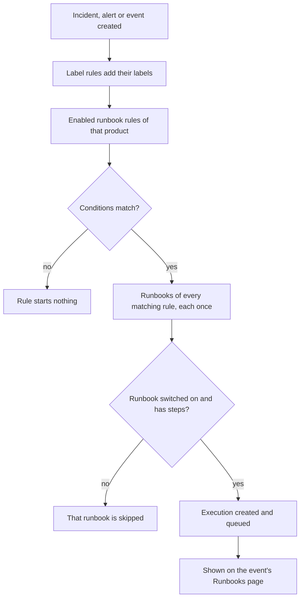

# Runbook Rules

Runbook rules start runbooks automatically when an **incident**, **alert**, or **scheduled maintenance event** is created, so nobody has to remember to run them in the middle of an outage. Each product has its own rules page, in its **Rules** menu:

- Incidents → Rules → **Runbook Rules**
- Alerts → Rules → **Runbook Rules**
- Scheduled Maintenance → Rules → **Runbook Rules**

All three pages edit the same kind of rule, filtered to the rules for that product.

:::cards
- [Create a runbook rule](#create-a-runbook-rule): Four steps: a name, conditions and the runbooks to start.
- [Conditions](#conditions): Every criterion and operator a rule can use.
- [Matching semantics](#matching-semantics): Several rules, monitor conditions and label rules.
- [Examples](#examples): Three rules to copy.
:::

## How a rule starts a runbook



When a rule fires, for each runbook it names:

1. The runbook is loaded.
2. Its steps are **snapshotted** onto a new runbook execution.
3. The execution is enqueued to the Runbook queue worker.
4. The execution is linked to the source entity: it shows up on the incident's, alert's or scheduled maintenance event's **Runbooks** page and on the runbook's **Executions** list.

You can see every run, rule-triggered or not, under **Runbooks → Executions**, filtered by status, runbook or start date.

## Before you begin

- **A runbook that can run.** It needs at least one step, and **Run this runbook** on, on its **Settings** page. See [Authoring a Runbook](/docs/runbooks/authoring).
- **Permission to manage rules.** Project Owner, Project Admin and Runbook Admin create runbook rules, as does anyone with the **Create Runbook Rule** permission.

## Create a runbook rule

:::steps
### Open Runbook Rules

In **Incidents**, **Alerts** or **Scheduled Maintenance**, open **Rules → Runbook Rules**, then click **Create Runbook Rule**.

### Name the rule

On **Basic Info**, enter a **Name**, such as "Start DB failover for database incidents", and optionally a **Description**.

### Add conditions

On **Match Criteria**, click **Add condition**, pick a criterion and an operator, and enter or pick the value. Add more conditions if you need them, and choose **Match all** or **Match any**. Add none to start the runbooks for every new event of this kind.

### Pick the runbooks

On **Runbooks**, choose one or more **Runbooks to Start**, then click **Create Runbook Rule**. The rule is on as soon as it is created, and it appears in the list with the status **Enabled**.
:::

## Anatomy of a rule

| Field | Purpose |
| --- | --- |
| **Name** | A short, human label for the rule. |
| **Description** | Optional context for teammates. |
| **Enabled** | On for a new rule. Switch it off on the rule's edit form to suspend it without deleting it. |
| **Conditions** | What the rule matches, on the **Match Criteria** step. Leave it empty to match every event of its type. |
| **Runbooks to Start** | One or more runbooks to launch when the rule fires. |

## Conditions

Each condition compares one thing about the incident, alert or scheduled maintenance event with a value you give. A runbook rule offers the same criteria as the other rules of its product: an incident runbook rule matches on what an incident privacy or on-call rule matches on.

| Criterion | What it checks |
| --- | --- |
| **Monitors** | The monitors the incident or the scheduled maintenance event affects, or the monitor that raised the alert. |
| **Incident Severities** / **Alert Severities** | The incident's or the alert's severity. Scheduled maintenance events have no severity, so their rules don't offer it. |
| **Incident Labels** / **Alert Labels** / **Event Labels** | The labels on the incident, alert or event itself, including the ones label rules attached when it was created. |
| **Monitor Labels** | The labels on its monitors. Label your monitors `production` or `staging` to run a runbook for one environment only. |
| **Incident Title** / **Alert Title** / **Event Title** | Its title. |
| **Incident Description** / **Alert Description** / **Event Description** | Its description. |
| **Monitor Name** / **Monitor Description** | The name or description of its monitors. |

Pick an operator for each condition:

- A list criterion — **Monitors**, the severities and the labels — uses **Has any of**, **Has all of** or **Has none of** the values you pick.
- A text criterion uses **Contains** (where a new condition starts), **Does not contain**, **Equals**, **Does not equal**, **Starts with**, **Ends with**, or **Matches pattern** / **Does not match pattern** for a case-insensitive regular expression or a `*` wildcard. Text comparisons ignore case.

With two or more conditions, choose **Match all** (every condition must be true) or **Match any** (at least one must be).

## Matching semantics

- A rule with no conditions runs on every event of its type (a global "always run" rule).
- Multiple rules can match the same event. Every match fires, and the union of their runbooks runs: each runbook gets its own execution, and a runbook that two matching rules name runs once.
- Monitor conditions are checked one monitor at a time. With **Match all**, "**Monitor Name** contains `api`" and "**Monitor Labels** has any of _Production_" need one monitor that is both, not one monitor of each.
- Runbook rules run after label rules, so a label that a label rule attaches to a new incident, alert or event can start a runbook.
- An incident or alert created already resolved starts no runbook: it was over before it was recorded. See [Declared already acknowledged or resolved](/docs/incidents/declaring-incidents#declared-already-acknowledged-or-resolved).
- A condition on another product's severity — **Alert Severities** on an incident rule, say — can never be true, so the API refuses to save it.
- Rules are evaluated once, when the event is created. Editing an incident's title, severity or labels later does not re-trigger rules.

## Examples

### DB failover for database incidents

```text
Name:        Start DB failover for DB incidents
Trigger:     Incident
Conditions:  Incident Title matches pattern (?:^|\b)(db|database|postgres|mysql|mongo)
Runbooks:    [DB failover playbook, Notify DBA team]
```

This creates two runbook executions every time an incident with "db", "database", "postgres" and so on in its title is created.

### Only for critical production incidents

```text
Name:        Flush the CDN cache for critical production incidents
Trigger:     Incident
Conditions:  Match all
             Monitor Labels has any of Production
             Incident Severities has any of Critical
Runbooks:    [Flush CDN cache]
```

Runs for a critical incident on a monitor labelled _Production_, and for nothing on staging.

### Always-run hygiene rule

```text
Name:        Always-run pre-flight check
Trigger:     Incident
Conditions:  (none)
Runbooks:    [Capture pre-incident state]
```

Fires on every incident: useful for capturing system state snapshots, page metrics and the like for the postmortem.

## Disabled runbooks

If a rule references a runbook that is turned off (**Run this runbook** off on the runbook's **Settings** page, `isEnabled = false`), the rule still matches but the runbook execution is skipped. Turn the switch back on to resume. A runbook with no steps is skipped the same way.

## Testing a rule

Before relying on a rule in production, create a test incident (or alert) that matches the rule's conditions, and check that the expected runbooks appear on its **Runbooks** page.

> [!NOTE]
> Runbook rules only act on new events. Unlike label and owner rules, they cannot be [run against existing records](/docs/configuration/run-rules-now): that would start runbooks for incidents that are already over.

## Troubleshooting

:::details A rule matched, but no runbook ran
Check, in order:

- The rule is **Enabled**.
- Each runbook has **Run this runbook** on, on its **Settings** page, and has at least one saved step.
- The incident or alert was not created already resolved.
- The runbook's execution is not simply waiting: open it from the event's **Runbooks** page. A Manual step or an approval shows **Waiting for you**.
:::

:::details A rule never matches
Rules see the event as it was created, with the labels label rules added at that moment. A label, severity or title changed afterwards is not seen. With several conditions, check **Match all** against **Match any**, and remember that monitor conditions must all hold for one monitor.
:::

:::details The API refuses a rule with "can only be used by"
A severity criterion belongs to one product. **Alert Severities** on an incident rule, or **Incident Severities** on an alert rule, could never match, so the rule is refused with a message such as "Alert Severities can only be used by alert runbook rules." Remove that condition. The dashboard only offers each product's own criteria.
:::

## Next steps

:::cards
- [Running a Runbook](/docs/runbooks/running): What responders see once a rule starts a run.
- [Authoring a Runbook](/docs/runbooks/authoring): Write the runbooks your rules start.
- [Declaring an Incident](/docs/incidents/declaring-incidents): How incidents are created, and when rules see them.
:::
