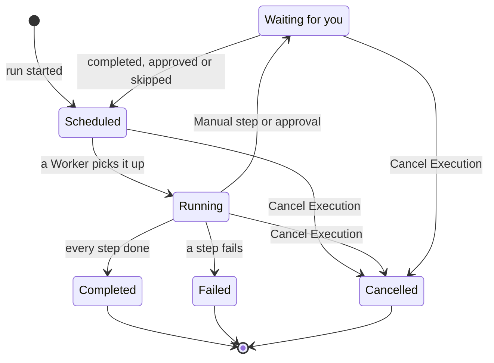

# Running a Runbook

Each run of a runbook is an **execution**: a snapshot of the runbook's steps, worked through in order, with every step's status and output recorded. This page is for the responders who start runs and move them along: how a run starts, what the execution page shows, and how to complete, approve, skip and cancel steps.

:::cards
- [Start a run](#start-a-run): From an incident, alert or event, or from the runbook itself.
- [The execution view](#the-execution-view): What each step shows while a run is in progress.
- [Completing, approving and skipping steps](#completing-approving-and-skipping-steps): Which step takes a decision, and when.
- [Troubleshooting](#troubleshooting): Runs that will not start, or will not finish.
:::

## How a run moves

A new run is **Scheduled** until a Worker picks it up and marks it **Running**. It pauses as **Waiting for you** on a Manual step, or after a step that needs approval, and goes back to the queue once someone acts. A run that waits for a person never times out. It ends **Completed**, **Failed** or **Cancelled**.

## Start a run

There are three ways a runbook execution gets created:

1. **Automatically via a rule**: a [runbook rule](/docs/runbooks/rules) starts it when a matching incident, alert or scheduled maintenance event is created. An auto-remediation rule can start one too; see [AI SRE](/docs/ai/ai-sre).
2. **Manually from an event**: click **Run Runbook** on an incident, alert or scheduled maintenance event. The execution is attached to that event.
3. **Manually from the runbook page**: click **Run Now** on a runbook's **Overview** page. The run is not attached to any incident, alert or scheduled maintenance event.

To start one by hand:

:::tabs
@tab From an event
1. Open the incident, alert or scheduled maintenance event, and go to its **Runbooks** page.
2. Click **Run Runbook**. The **Run a Runbook** dialog lists the project's runbooks that are switched on.
3. Click **Run** next to the runbook. The run appears in the event's list: click **View** to open it.
@tab From the runbook
1. Open the runbook from **Runbooks**.
2. On its **Overview**, click **Run Now**.
3. The execution page opens.
:::

Starting a run takes Project Owner, Project Admin, Project Member, Runbook Admin or Runbook Member, or the **Create Runbook Execution** permission. Runbook Viewer and Viewer see **Run Now** locked, with the reason. See [Permissions](/docs/runbooks/configuration#permissions).

## The execution view

Open any execution to see its checklist UI. The top of the page shows the run's **Status**, its **Progress** (steps done out of all steps), when it **Started**, and what **Triggered by** it. Each step shows:

- **Status pill** — Pending, Running, Waiting for you, Done, Skipped, Failed or Cancelled.
- **Title and description** — copied from the runbook at execution time.
- **Output** (collapsible) — stdout, return values, HTTP responses, or the AI's answer.
- **Error message** if the step failed.
- On the step the run is waiting on: **Mark complete** (a Manual step) or **Approve & continue** (a step with **Require approval**), and **Skip**.
- While the run is paused, **Skip** on later automated steps that don't require approval.

While the run is in progress, the page refreshes itself every 30 seconds. Click **Refresh** to see the latest state at once.

## Completing, approving and skipping steps

Only the step the run is waiting on can be marked complete, approved, or skipped to continue the run. A Manual step or a step with **Require approval** can't be ticked off or skipped before the run reaches it — its job is to stop the run, so it only takes a decision once the run is there (for an approval, once the step has run and you can see its output).

While the run is paused, you can also skip a later automated step that doesn't require approval, so it won't run when the run continues. The run stays paused on the step that is waiting for you. Skipping isn't available while steps are running — wait for the run to pause, or cancel it. Each step records who completed or skipped it.

| The step | Mark complete or approve | Skip |
| --- | --- | --- |
| The one the run is waiting on | Yes | Yes |
| A later automated step, without **Require approval** | No | Yes, while the run is paused |
| A later Manual step, or one with **Require approval** | No | No |
| Any step, while steps are running | No | No |

Completing, approving, skipping and cancelling take the same roles as starting a run, or the **Edit Runbook Execution** permission.

## Interleaving manual and automated steps

The classic flow:

| # | Step | What happens |
| --- | --- | --- |
| 1 | Bash: capture system state | Runs on its Runner as soon as the run starts. |
| 2 | Manual: "Notify customers with the status page banner." | The run pauses until a responder clicks **Mark complete**. |
| 3 | HTTP request: page the DBA through PagerDuty | Runs on the Worker. |
| 4 | Manual: "Confirm the secondary database is now primary." | The run pauses again. |
| 5 | HTTP request: post the all-clear to a Slack webhook | Runs, and the execution is **Completed**. |

Steps 2 and 4 pause the run until someone ticks them off. Steps 1, 3 and 5 run automatically. The whole run is one execution, one timeline and one source of truth.

## Cancelling a run

Click **Cancel Execution** on the execution page. A step that is already running finishes, but no later step starts, and the status becomes `Cancelled`. Jobs still waiting for a Runner are cancelled; a Runner that is already running a script finishes it, but its result is not accepted.

## Output limits

Per-step output is capped at **50 KB**, so a runaway script cannot bloat the database. Longer output is cut off with a marker. If you need bigger artifacts, write them to object storage or a logger from the script and put the URL in the output.

## Re-running a runbook

An execution is a one-shot, immutable record. To run the runbook again, click **Run Again** on a finished execution, or **Run Now** on the runbook. Either creates a fresh execution from the runbook's current steps, not attached to any event. To run it again on an incident, use **Run Runbook** on the incident's **Runbooks** page. The original execution stays intact for the audit trail.

## Finding past executions

| Where | What it lists |
| --- | --- |
| A runbook's **Executions** | Every run of that runbook, with filters for status and start date, and a **Triggered by** column. |
| **Runbooks → Executions** | Every run of every runbook in the project. |
| An incident's, alert's or event's **Runbooks** | The runs attached to it. The event's overview shows them too, once there are any. |

## Troubleshooting

:::details Run Now is locked
Your role reads runbooks but does not run them: the button says "You do not have permission to start runbook executions in this project." Ask for Runbook Member, or for the **Create Runbook Execution** permission.
:::

:::details Starting a run fails with "Runbook is disabled" or "Runbook has no steps to run"
The runbook's **Run this runbook** switch is off, on its **Settings** page, or it has no saved steps. Turn the switch on, or add steps and click **Save Steps**.
:::

:::details A step failed because no runbook agent picked it up
The message reads "No runbook agent picked up this step before the wait window expired." The step's Runner did not claim the job within its claim timeout. Check on **Runbooks → Runners** that the Runner is **Connected** and that **Runs Runbooks** is on. See [Runbook Agents](/docs/runbooks/agents#troubleshooting).
:::

:::details The run has been waiting for hours
A run that waits for a person never times out. Open it and act on the step marked **Waiting for you**, or click **Cancel Execution**.
:::

:::details A step says it may have partially run
The OneUptime Worker running the step restarted or stopped responding, and the run was failed instead of being left running. Check the target system before you run the runbook again.
:::

## Next steps

:::cards
- [Authoring a Runbook](/docs/runbooks/authoring): Add Manual steps and approvals where a person should decide.
- [Runbook Rules](/docs/runbooks/rules): Start runs automatically on new incidents.
- [Runbook Agents](/docs/runbooks/agents): Keep the Runners your steps need online.
:::
