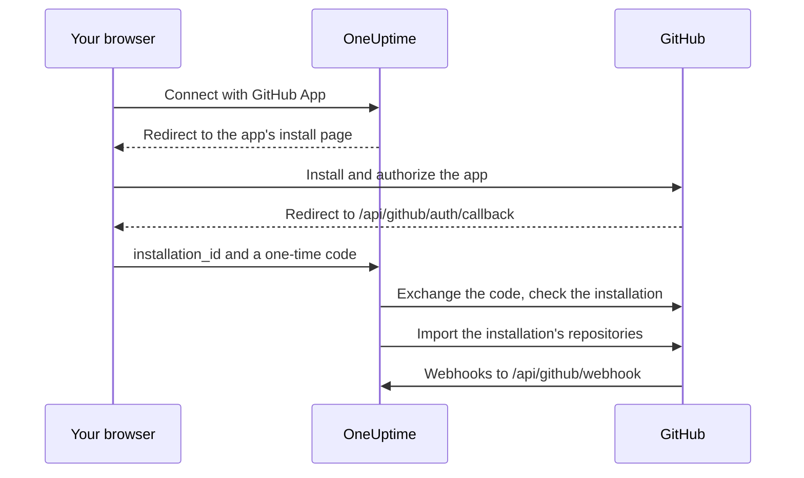

# GitHub Integration

Connect your self-hosted OneUptime to GitHub with a GitHub App you own. Once the app is installed from OneUptime, the installation's repositories are imported into your project and kept in sync, AI fix tasks open pull requests, and people can hand work to the app from GitHub by mentioning it.

This page is for whoever runs the OneUptime server: you create the app once, and each project then connects it from **Code Repositories**.

:::cards
- [Create the GitHub App](#create-the-github-app): Register the app with the right URLs, permissions and events.
- [Configure OneUptime](#configure-oneuptime): Give the server the app's six values.
- [Connect repositories](#connect-repositories): Install the app from OneUptime.
- [Troubleshooting](#troubleshooting): What Code Repositories' messages mean.
:::

## How it works

Installing starts in OneUptime, not on GitHub: the link OneUptime sends you to GitHub with is what ties the installation to your project.



- The browser redirect carries the installation and a one-time OAuth code. OneUptime trades the code to confirm that the GitHub account that installed the app administers that installation, then imports its repositories.
- Webhooks keep the repository list in sync and hand work to the app: mentions, assignments, trigger labels and review requests. GitHub signs each one with the webhook secret, and OneUptime rejects any it cannot verify.

## Before you begin

- A GitHub account that can create GitHub Apps for the organization or user the app will be installed on. To install it on an organization, you need to be an owner of it, or have an owner approve the request.
- A public HTTPS hostname for OneUptime that GitHub can reach for webhooks. See [Network access](#network-access-for-self-hosted-deployments).
- Access to the server's configuration: `config.env` for Docker Compose, or your Helm values for Kubernetes.

## Create the GitHub App

:::steps
### Open the GitHub App settings

- **For an organization:** `https://github.com/organizations/YOUR_ORG/settings/apps`
- **For a personal account:** `https://github.com/settings/apps`

Select **New GitHub App**.

### Fill in the registration form

| Field | Value |
| --- | --- |
| **GitHub App name** | Any unique name, for example `OneUptime`. Note it exactly: it is `GITHUB_APP_NAME`. |
| **Homepage URL** | `https://your-oneuptime-domain.com` |
| **Callback URL** | `https://your-oneuptime-domain.com/api/github/auth/callback` |
| **Request user authorization (OAuth) during installation** | On. **It is required**: see the note below. |
| **Setup URL** | `https://your-oneuptime-domain.com/api/github/auth/callback`, if GitHub lets you enter one (see below). |
| **Redirect on update** | Optional. After someone changes an installation on GitHub, OneUptime takes them to **Code Repositories**. |
| **Webhook URL** | `https://your-oneuptime-domain.com/api/github/webhook`, with the webhook **Active**. |
| **Webhook secret** | A long random string. Note it: it is `GITHUB_APP_WEBHOOK_SECRET`. **Required**: OneUptime rejects unsigned webhooks, so leaving `GITHUB_APP_WEBHOOK_SECRET` unset stops repository sync rather than accepting unverified payloads. |

GitHub's documentation says that with **Request user authorization (OAuth) during installation** on, [you cannot enter a Setup URL](https://docs.github.com/en/apps/creating-github-apps/registering-a-github-app/about-the-setup-url): users are sent to the Callback URL after they install the app instead. Both point at the same OneUptime address, so either way the redirect lands in the right place.

> [!IMPORTANT]
> **Why "Request user authorization (OAuth) during installation" is required.** After an install, GitHub redirects back with an `installation_id` in the URL. That number alone proves nothing about who owns the installation — anyone can type a different one. With this option enabled GitHub also returns a single-use OAuth `code` tied to the GitHub account that performed the install, which OneUptime exchanges to confirm that account really administers the installation before connecting it to your project.
>
> Without it, OneUptime refuses to connect the installation and the dashboard shows an error asking you to enable this setting. This is deliberate: accepting the installation ID unverified would let one OneUptime project claim another organization's repositories.

### Set the permissions

Under **Permissions & events**, set these **Repository permissions**:

| Permission | Access | What OneUptime uses it for |
| --- | --- | --- |
| Contents | Read and write | Read repository files, and push the branches of AI fix pull requests |
| Pull requests | Read and write | Open and update pull requests, and post reviews |
| Issues | Read and write | Post the app's comments — **including on pull requests**, whose conversation GitHub routes through the issues API |
| Checks | Read-only | Optional. Read the CI result of fix pull requests. Without it, their CI status stays unverified |
| Metadata | Read-only | Basic repository metadata (GitHub requires it) |

**Issues: Read and write is what makes the app interactive.** Without it, mentions are received and then fail silently when the app tries to answer — GitHub serves pull request conversation comments from the issues API, so this single permission gates every reply the app writes. See [Working with OneUptime from GitHub](/docs/ai/github-app).

OneUptime needs no organization or account permissions.

### Subscribe to webhook events

OneUptime uses two sets of events, and they do different jobs.

**Repository synchronisation** — `installation` and `installation_repositories`. GitHub Apps receive these automatically; they keep the set of connected repositories in step with what the app is installed on.

**The interactive app** — these must be subscribed to explicitly, and each one enables a specific way of handing work to the app:

| Event | What it enables |
| --- | --- |
| **Issue comment** | `@mention` commands on issues **and** on pull requests |
| **Issues** | assigning an issue to the app, and the repository's trigger label |
| **Pull request** | requesting a review from the app |
| **Pull request review** | a mention written in the body of a submitted review |
| **Pull request review comment** | a mention on an inline comment in the diff |

If none of these are subscribed, the GitHub App still connects repositories and still opens fix pull requests from OneUptime — it simply never responds to anything written in GitHub. That is the most common cause of "the bot ignores me". See [Working with OneUptime from GitHub](/docs/ai/github-app) for what the commands are and who is allowed to issue them.

Other events (**Push**, **Workflow run**) are acknowledged and ignored; subscribing to them does not enable notifications or CI/CD automation.

### Choose where the app can be installed

Under **Where can this GitHub App be installed?**, choose:

- **Only on this account** - For private/internal use
- **Any account** - If you want others to install your app

### Create the app and note its IDs

Select **Create GitHub App**. GitHub opens the app's settings page. Note the **App ID**, at the top of the page, and the **Client ID**, in the **About** section.

### Generate a client secret

Under **Client secrets**, select **Generate a new client secret**. Copy it straight away: GitHub shows it only once.

### Generate a private key

Under **Private keys**, select **Generate a private key**. GitHub downloads a `.pem` file. Keep it secure: it lets OneUptime authenticate as the app.
:::

## Configure OneUptime

:::tabs
@tab Docker Compose
`config.env` holds one value per line, so give the private key base64-encoded, on a single line. OneUptime decodes it:

```bash
base64 < private-key.pem | tr -d '\n'
```

```bash title="config.env"
GITHUB_APP_ID=YOUR_APP_ID
GITHUB_APP_NAME=YOUR_APP_NAME
GITHUB_APP_CLIENT_ID=YOUR_CLIENT_ID
GITHUB_APP_CLIENT_SECRET=YOUR_CLIENT_SECRET
GITHUB_APP_PRIVATE_KEY=YOUR_BASE64_ENCODED_PRIVATE_KEY
GITHUB_APP_WEBHOOK_SECRET=YOUR_WEBHOOK_SECRET
```

Apply the change with `npm run start`, which recreates the containers. `docker compose restart` does not re-read `config.env`.
@tab Kubernetes
```yaml title="values.yaml"
gitHubApp:
  id: "YOUR_APP_ID"
  name: "YOUR_APP_NAME" # The exact name of your GitHub App
  clientId: "YOUR_CLIENT_ID"
  clientSecret: "YOUR_CLIENT_SECRET"
  privateKey: "<BASE64_ENCODED_PRIVATE_KEY_CONTENT>"
  webhookSecret: "YOUR_WEBHOOK_SECRET"
```

`privateKey` also takes the PEM itself, as a multi-line block (`privateKey: |`). Apply the change with `helm upgrade`.
:::

When OneUptime is back, **Code Repositories** shows **Connect with GitHub App** instead of **GitHub App is not configured on this server**.

### Environment variables reference

| Docker Compose (`config.env`) | Helm (`values.yaml`) | Value |
| --- | --- | --- |
| `GITHUB_APP_ID` | `gitHubApp.id` | The **App ID**. Used to authenticate as the app. |
| `GITHUB_APP_NAME` | `gitHubApp.name` | The app's exact name. The install link and the app's `@mention` handle (lower-cased, spaces as hyphens) are built from it. Without it, **Code Repositories** cannot connect. |
| `GITHUB_APP_CLIENT_ID` | `gitHubApp.clientId` | The **Client ID**. Needed to verify who installed the app. |
| `GITHUB_APP_CLIENT_SECRET` | `gitHubApp.clientSecret` | The client secret you generated. Needed with the client ID. |
| `GITHUB_APP_PRIVATE_KEY` | `gitHubApp.privateKey` | The private key: the PEM, or the PEM base64-encoded. |
| `GITHUB_APP_WEBHOOK_SECRET` | `gitHubApp.webhookSecret` | The webhook secret. Every webhook is verified with it, and none is accepted without it. |

All six are required.

## Connect repositories

Start the connection from OneUptime, not from the app's page on GitHub: the link OneUptime sends you to GitHub with is what ties the installation to your project.

:::steps
1. Log into your OneUptime dashboard
2. Navigate to **Products** > **Tasks** > **Code Repositories**
3. Click **Connect with GitHub App**. OneUptime takes you to GitHub
4. Select the organization or account to install the app on, and choose which repositories it can access: **All repositories** (every current and future repository) or **Only select repositories**
5. Click **Install** (or **Save**, if the app is already installed there)
6. GitHub sends you back to **Code Repositories**, and every repository in the installation is imported. Repositories later added to or removed from the installation are kept in sync automatically.
:::

**Who can connect.** Connecting imports the installation's repositories into the project, so it needs permission to add code repositories: **Project Owner**, **Project Admin**, **Project Member**, **Settings Admin**, **Settings Member**, or a team with **Create Code Repository**. A team that blocks the permission takes it away. On OneUptime Cloud, code repositories need the Growth plan or above. For anyone else, the card is locked and says what it takes.

**Finish within 15 minutes, in the same browser.** The link works once, for 15 minutes, in the browser that started it. When GitHub sends you back, OneUptime checks the permission again before it imports anything.

## Network access for self-hosted deployments

### Traffic direction and endpoints

| Traffic | Required access |
| --- | --- |
| OneUptime to GitHub | DNS and outbound HTTPS on TCP 443 to `api.github.com` for GitHub App tokens and repository API calls, and `github.com` for OAuth token exchange and HTTPS Git operations |
| GitHub to OneUptime | Public HTTPS on TCP 443 to `POST /api/github/webhook` for installation and repository-access synchronization, and for the interactive app |
| User's browser to OneUptime | Dashboard access and `GET /api/github/auth/callback` for installation/authorization redirects; these can remain accessible through the user's VPN |

The callback is a [browser redirect](https://docs.github.com/en/apps/creating-github-apps/registering-a-github-app/about-the-user-authorization-callback-url), whereas the webhook is a request from GitHub's servers. A user's VPN connection does not give GitHub access to the webhook. The domains above cover the integration's core requests; additional repository tooling, downloads, LFS, or packages may require other destinations. These settings describe GitHub.com; changing the firewall does not configure support for a GitHub Enterprise Server hostname.

### Private deployments and callback security

Expose `/api/github/webhook` through a public gateway with public DNS, a publicly trusted HTTPS certificate and complete chain, and a private route to OneUptime's ingress. Allow inbound TCP 443 to the gateway and restrict public forwarding to this POST route. Keep the dashboard and browser callback on the private ingress if users access them over VPN; split DNS can serve the same hostname internally and externally.

Set `HOST=oneuptime.example.com` and `HTTP_PROTOCOL=https` in `config.env`, or `host: oneuptime.example.com` and `httpProtocol: https` in Helm. Apply the configuration and wait for OneUptime to restart. These values generate URLs; they do not provision DNS, TLS, or network access. If the hostname changes, update the GitHub App's webhook, callback, setup, and homepage URLs.

Preserve the method, original path, query string, body, `Content-Type`, `X-Hub-Signature-256`, `X-GitHub-Event`, and `X-GitHub-Delivery`. Preserve the public host and HTTPS scheme through trusted proxy headers. Exempt the webhook from browser SSO, CAPTCHA, and proxy login pages. Keep GitHub's SSL verification enabled and configure the same `GITHUB_APP_WEBHOOK_SECRET` in both systems: OneUptime rejects unsigned requests and cannot validate webhooks without this secret. See GitHub's [webhook validation guidance](https://docs.github.com/en/webhooks/using-webhooks/validating-webhook-deliveries).

If you also restrict webhook source IPs, use the current `hooks` ranges from GitHub's Meta API and refresh them regularly; do not substitute GitHub Actions runner ranges or omit signature verification. GitHub warns that [its addresses change and the published list is not exhaustive](https://docs.github.com/en/authentication/keeping-your-account-and-data-secure/about-githubs-ip-addresses).

### Verify access and understand limitations

:::steps
1. Connect an installation from **Code Repositories**.
2. In the GitHub App's settings, open **Advanced** and look at **Recent Deliveries**. Redeliver a delivery and confirm that the gateway forwards it and OneUptime accepts it.
3. Add or remove a test repository from the installation, and check that the repository list in OneUptime follows.
:::

GitHub documents [delivery diagnostics](https://docs.github.com/en/webhooks/testing-and-troubleshooting-webhooks/viewing-webhook-deliveries) and requires [a 2xx acknowledgment within ten seconds](https://docs.github.com/en/webhooks/using-webhooks/best-practices-for-using-webhooks). A browser GET to the webhook does not test a signed POST.

> [!WARNING]
> Without inbound access, browser authorization and outbound API and Git operations may work, but webhooks cannot reach OneUptime: deleted installations and repository-access changes do not synchronize, and the app never responds to mentions, assignments or review requests.

The [private network access setting](/docs/self-hosted/private-network-access) controls outbound requests to private destinations and does not make the webhook reachable by GitHub.

## Troubleshooting

### Connecting did not finish

When GitHub sends you back and the installation was not connected, **Code Repositories** says **GitHub was not connected**, with one sentence saying why, in your language. It never shows what GitHub itself answered: that is in the OneUptime server log, with the reason. The sentences are:

- **"This connection link is invalid, has expired, or has already been used. Please start again.":** Start again from **Code Repositories** and finish on GitHub within 15 minutes, in the same browser. Installing the app from its page on GitHub does not connect it to a project: start from **Code Repositories** in OneUptime.
- **"You do not have permission to add code repositories to this project":** Connecting needs permission to add code repositories (see [Connect repositories](#connect-repositories)). Ask a project admin to grant it. It is asked again when GitHub sends you back, so a permission taken away in the meantime ends the connection here too.
- **"Connecting GitHub needs the ... plan.":** On OneUptime Cloud, code repositories need the plan the sentence names. Upgrade the project's plan, then connect again.
- **"GitHub did not confirm who installed the app, so the installation could not be checked.":** Turn on **Request user authorization (OAuth) during installation** in the GitHub App's settings (see [Create the GitHub App](#create-the-github-app)), then connect again.
- **"OneUptime could not confirm that your GitHub account can manage this installation.":** The GitHub account that finished the installation does not administer it. Install the app with an account that owns the organization or user it is installed on, or ask an owner to.
- **"GitHub did not send an installation back.":** When an organization member requests the app instead of installing it, an owner of the organization has to approve the request first. Connect again once they have.
- **"The GitHub App is not set up on this OneUptime server.":** Set both `GITHUB_APP_CLIENT_ID` and `GITHUB_APP_CLIENT_SECRET` (see [Configure OneUptime](#configure-oneuptime)) and restart OneUptime.
- **"OneUptime could not finish connecting. Please try again.":** GitHub answered with an error, or a request or a write failed while finishing. The OneUptime server log says which. Try again; if it keeps happening, check the log and the GitHub App's settings.

### Other problems

:::details Code Repositories says "GitHub App is not configured on this server"
`GITHUB_APP_NAME` is not set. Set it to the app's exact name, along with the other five values, and restart OneUptime.
:::

:::details I am not sent back to OneUptime after installing the app
Check that the app's **Callback URL** is `https://your-oneuptime-domain.com/api/github/auth/callback`, and the **Setup URL** too if one is set. Both must point at the same `/api/github/auth/callback` endpoint, on the hostname in `HOST`.
:::

:::details GitHub's Recent Deliveries show "Invalid webhook signature"
The webhook secret in the GitHub App and `GITHUB_APP_WEBHOOK_SECRET` differ, or a proxy changed the request body. Set the same secret in both, and make sure the gateway forwards the body unchanged.
:::

:::details Webhook events are not received
Check that the webhook URL is publicly reachable over HTTPS, then look at **Advanced > Recent Deliveries** in the GitHub App's settings for each attempt and its response. Webhooks are refused while `GITHUB_APP_WEBHOOK_SECRET` is unset.
:::

:::details Repositories or fix tasks fail with an authentication error
OneUptime authenticates as the app with `GITHUB_APP_ID` and `GITHUB_APP_PRIVATE_KEY`. Check that the App ID is right and that the key is the complete PEM, including its `BEGIN` and `END` lines, or that PEM base64-encoded. If the app was uninstalled from GitHub, connect it again from **Code Repositories**.
:::

:::details Repositories are missing after the installation
Check which repositories the installation can access, in the installation's settings on GitHub. Repositories you add there are imported automatically, as long as webhooks reach OneUptime.
:::

:::details The app ignores mentions in GitHub
Give the app **Issues: Read and write** and subscribe it to the interactive events in [Subscribe to webhook events](#subscribe-to-webhook-events). Mentions also only match the handle built from `GITHUB_APP_NAME`, so set it to the app's real name.
:::

## Security best practices

- **Rotate secrets regularly.** Generate new client secrets and private keys periodically.
- **Keep the webhook secret set.** OneUptime refuses webhooks it cannot verify.
- **Limit repository access.** Only grant the installation the repositories that need to be connected.
- **Watch webhook deliveries.** Check regularly for failed deliveries or suspicious activity.
- **Keep private keys out of version control.**

## Next steps

:::cards
- [Working with OneUptime from GitHub](/docs/ai/github-app): The commands people can give the app, and who may give them.
- [Fix Tasks](/docs/ai/ai-agent): How the AI agent opens fix pull requests.
- [Private Network Access](/docs/self-hosted/private-network-access): Let workflows and webhooks reach internal tools.
:::
