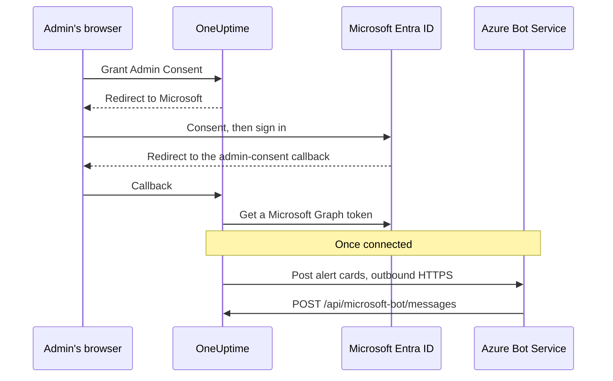
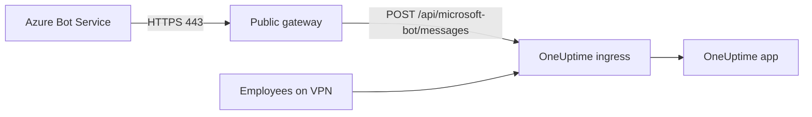

# Microsoft Teams Integration

Connect your self-hosted OneUptime to Microsoft Teams. You register an app in Microsoft Entra ID, create an Azure Bot for it, give OneUptime the app's credentials, and install the Teams app package your server builds. OneUptime then posts alerts and incidents to your channels and chats, and people act on them from Teams.

This page is for whoever runs the OneUptime server. Once Teams is connected, notification rules are set up per project: see [Microsoft Teams](/docs/workspace-connections/microsoft-teams).

:::cards
- [Set up the integration](#set-up-the-integration): Nine steps, from the Azure portal to your first team.
- [Environment variables](#environment-variables): The three values OneUptime needs from the app registration.
- [Network access](#network-access): The bot endpoint Microsoft must be able to reach.
- [Troubleshooting](#troubleshooting): Unreachable endpoints, missing installs and failed connections.
:::

## How it works

OneUptime uses an Azure Bot for its Teams integration. Traffic flows both ways, and the two directions are independent: OneUptime calls Microsoft to post messages, and Azure Bot Service calls your server when someone presses a button, messages the bot or adds it to a chat.



An Incoming Webhook or a Teams Workflow URL does not replace this bot's messaging endpoint.

## Before you begin

- An Azure subscription, for the Azure Bot resource.
- An account that can create app registrations in Microsoft Entra ID, and a Microsoft 365 administrator to grant admin consent.
- A public HTTPS hostname for OneUptime that Azure Bot Service can reach. See [Network access](#network-access).
- Access to the server's configuration: `config.env` for Docker Compose, or your Helm values for Kubernetes.
- To connect a project, the **Project Owner**, **Project Admin** or **Project Member** role in it.

## Set up the integration

:::steps
### Step 1: Create Azure App Registration

In the [Azure Portal](https://portal.azure.com), open **App registrations** and select **New registration**. Fill in the form:

- **Name:** oneuptime
- **Supported account types:** Accounts in this organizational directory only (Single tenant)
- **Redirect URI:** Web - `https://your-oneuptime-domain.com/api/microsoft-teams/auth`

Select **Register**, then add a second Web redirect URI, `https://your-oneuptime-domain.com/api/microsoft-teams/admin-consent/callback`. Note the **Application (client) ID** and the **Directory (tenant) ID**: you need both later.

> [!NOTE]
> **Why single tenant:** a self-hosted OneUptime instance serves one organization, and its bot is registered against the single tenant you set in `MICROSOFT_TEAMS_APP_TENANT_ID` (Step 6). Registering the app as multitenant does not extend that, and it introduces a failure mode: guest / B2B users whose Microsoft home tenant differs from yours will reach the bot with their own tenant id, which OneUptime cannot map to your project. If you already registered a multitenant app it will keep working — just make sure `MICROSOFT_TEAMS_APP_TENANT_ID` is your own tenant, and expect guest accounts to need an account in your tenant to use the bot.

### Step 2: Configure App Permissions

In your app registration, open **API permissions**, select **Add a permission** and choose **Microsoft Graph**.

**Add Delegated Permissions** (when acting on behalf of a signed-in user):

- **User.Read** - Required to get the authenticated user's profile information (display name, email) during the OAuth flow
- **Team.ReadBasic.All** - Required to list teams that the user is a member of when selecting which team to connect
- **Channel.ReadBasic.All** - Required to read channel information and list channels within teams for notification delivery
- **ChannelMessage.Send** - Required to send alert and incident notifications to Teams channels

**Add Application Permissions** (when acting as the app itself, without a signed-in user):

- **Team.ReadBasic.All** - Required to list all teams in the organization after admin consent is granted
- **Channel.ReadBasic.All** - Required to verify channel existence and retrieve channel details
- **TeamsAppInstallation.ReadForTeam.All** - Required for diagnosis. Lets OneUptime read which app package is really installed in a team and compare it against this deployment's client id, so a failed send can tell you _which_ of the possible causes it is. Without it OneUptime cannot tell "not installed" apart from "installed, but it is somebody else's package", and simply reports what Microsoft said — which is the single biggest reason this integration takes days instead of minutes to debug. Grant it.
- **Chat.ReadBasic.WhereInstalled** - Optional. Lets OneUptime read the name of every chat the OneUptime app is in. Without it, each chat grants that through the manifest's **ChatSettings.Read.Chat** permission (below), which a chat added with an older manifest only has once the app is updated in it.

`ChannelMessage.Send` is a delegated permission only; it has no application permission variant in the [Microsoft Graph permissions reference](https://learn.microsoft.com/en-us/graph/permissions-reference#channelmessagesend). Keep it in the delegated list above.

Then select **Grant admin consent** for your organization.

The bot itself uses Resource-Specific Consent (RSC) permissions defined in the Teams app manifest. They are granted when the app is installed or updated in a team or chat, not in Entra ID:

- **ChannelMessage.Send.Group** - Allows the bot to send messages to team channels
- **ChannelMessage.Read.Group** - Allows the bot to read channel messages for interactive commands
- **Channel.Create.Group** - Allows the bot to create channels when needed
- **ChatMessage.Read.Chat** - Allows the bot to read messages in chats it has been added to (for interactive commands)
- **ChatMember.Read.Chat** - Allows the bot to read the members of chats it has been added to (to name chats in OneUptime)
- **ChatSettings.Read.Chat** - Allows OneUptime to read the name of group chats the app is added to. Teams does not reliably send a group chat's name to the bot, so without it a named group chat is listed by its members' names
- **TeamsAppInstallation.Read.Group** - Allows OneUptime to confirm the app is installed in a team it is about to post to

If you uploaded the app manifest before these permissions existed, download it again from **Project Settings > Workspace > Microsoft Teams** and upload it to Teams as an update of the OneUptime app. Teams grants team and chat permissions when the app is installed or updated in that team or chat, so accept the update in each team and chat that already has the app. See [A group chat is listed by its members' names](#a-group-chat-is-listed-by-its-members-names) for chats.

### Step 3: Create Client Secret

In your app registration, open **Certificates & secrets** and select **New client secret**. Add a description, choose an expiry (24 months is a sensible choice), and select **Add**. Copy the secret's value straight away: Azure shows it only once.

> [!IMPORTANT]
> Copy the secret's **Value**, not its **Secret ID**. The value is the longer string.

### Step 4: Create a Bot Service

In the Azure Portal, create an **Azure Bot** resource:

- **Bot handle:** oneuptime-bot
- **Subscription** and **Resource group:** your own
- **Pricing tier:** F0 (Free) is enough for testing
- **Type of App:** Single Tenant, using the existing app registration: its **Application (client) ID** and **Directory (tenant) ID** from Step 1

Select **Review + create**, then **Create**. When the bot is deployed, open its **Configuration** page, set **Messaging endpoint** to `https://your-oneuptime-domain.com/api/microsoft-bot/messages` and save.

**Verify the endpoint before you move on.** Azure Bot Service calls this URL from the public internet, so check it from somewhere outside your network — not from inside the cluster, and not from a VPN that can see the host when Azure cannot:

```bash
curl -sS -i https://your-oneuptime-domain.com/api/microsoft-bot/messages
```

Use `-i` rather than just the status code: on a 404 the **body is the only thing that tells you who produced it**, and that distinction is the whole diagnosis.

- **405** is correct and means you are done. The endpoint only accepts POST, so a GET is answered `405 Method Not Allowed`, with `Allow: POST` and a description of the endpoint. Reaching it at all is the thing being tested.
- **404 with a JSON body of `{"message":"Page not found - /api/microsoft-bot/messages"}`** came from OneUptime, so the request *did* arrive. Either this deployment predates the 405 response above — older versions served this path for POST only, so a GET fell through to the generic not-found handler — or something in front of OneUptime is rewriting the path and stripping the `/api` prefix before the app sees it (a Kubernetes ingress with `rewrite-target: /` is the usual culprit).
- **404 with an HTML error page** from nginx, your ingress or a load balancer means the opposite: the request never reached OneUptime, and whatever is in front of it is not routing `/api` to the app.
- **A TLS error, a timeout or a connection refusal** means Azure will not reach it either. See [the messaging endpoint troubleshooting section](#card-buttons-say-unable-to-reach-app-and-chats-never-appear) below.

### Step 5: Add Microsoft Teams Channel to the Bot

In your Azure Bot resource, open **Channels** and add **Microsoft Teams**. Keep the default messaging options unless you have specific needs, and save. Without this channel the bot is never provisioned into Teams conversations.

### Step 6: Configure OneUptime Environment Variables

Give OneUptime the app's credentials:

:::tabs
@tab Docker Compose
```bash title="config.env"
MICROSOFT_TEAMS_APP_CLIENT_ID=YOUR_TEAMS_APP_CLIENT_ID
MICROSOFT_TEAMS_APP_CLIENT_SECRET=YOUR_TEAMS_APP_CLIENT_SECRET
MICROSOFT_TEAMS_APP_TENANT_ID=YOUR_MICROSOFT_TENANT_ID
```

Apply the change with `npm run start`, which recreates the containers. `docker compose restart` does not re-read `config.env`.
@tab Kubernetes
```yaml title="values.yaml"
microsoftTeamsApp:
  clientId: YOUR_TEAMS_APP_CLIENT_ID
  clientSecret: YOUR_TEAMS_APP_CLIENT_SECRET
  tenantId: YOUR_MICROSOFT_TENANT_ID
```

To keep the values in a Kubernetes Secret you manage, set `microsoftTeamsApp.existingSecret` instead: its `name`, and the keys `clientIdKey`, `clientSecretKey` and `tenantIdKey`. Apply the change with `helm upgrade`.
:::

When OneUptime is back, **Project Settings > Workspace > Microsoft Teams** shows the **Grant Admin Consent** card instead of the setup guide.

### Step 7: Grant Admin Consent in OneUptime

Open **Project Settings > Workspace > Microsoft Teams** and select **Grant Admin Consent**. Sign in to Microsoft as a Microsoft 365 administrator and accept the permissions. Microsoft sends you back to the same page, and the card reads **Admin Consent Completed**: the project is now connected to your tenant.

Then select **Connect my account with Microsoft Teams** to link your own account. Everyone else in the project does the same from **User Settings > Workspace > Microsoft Teams**.

### Step 8: Upload the Teams App Manifest

After admin consent, **Project Settings > Workspace > Microsoft Teams** shows the **Action Required: Install This Deployment's App on Microsoft Teams** card. Select **Download App Manifest Zip**: the package carries this deployment's bot id.

In Microsoft Teams, open **Apps > Manage your apps**, select **Upload an app**, then **Upload a custom app**, and choose the zip you downloaded.

> [!WARNING]
> Do not install "OneUptime" from the Microsoft Teams store for a self-hosted deployment. The store app points at OneUptime Cloud's bot, so Teams accepts it and then refuses every message this deployment sends.

### Step 9: Add OneUptime to Each Team (Required)

Uploading the manifest installs the app for **you**. It does **not** give the bot access to any team's channels. Microsoft only accepts messages into a team the app has been added to, so you must do this for every team you want notifications in:

1. In Microsoft Teams, click the "..." next to the **team name** (not the channel name)
2. Choose **Manage team** > **Apps** > **More apps**
3. Find **OneUptime** and click **Add**

Notes:

- Installing OneUptime for yourself, or adding it to a chat, is a **different** installation. Neither one lets it post to a team's channels.
- **Private channels** need the app installed into the channel itself: open the channel > "..." > **Manage channel** > **Apps** > **Add an app**. A team-level install does not cover private channels.
- **Shared channels** cannot receive notifications at all — Microsoft Teams does not support bots in shared channels. OneUptime hides them from the channel picker.
- If **Manage team > Apps > More apps** is empty or greyed out, your Teams app setup policy is blocking custom apps. Fix this in the Teams admin center under **Teams apps > Manage apps** and **Setup policies**.
:::

## Environment variables

| Docker Compose (`config.env`) | Helm (`values.yaml`) | Value |
| --- | --- | --- |
| `MICROSOFT_TEAMS_APP_CLIENT_ID` | `microsoftTeamsApp.clientId` | The **Application (client) ID**. It is also the bot id in the Teams app package, so it must be a GUID. |
| `MICROSOFT_TEAMS_APP_CLIENT_SECRET` | `microsoftTeamsApp.clientSecret` | The client secret's **Value**, not its ID. |
| `MICROSOFT_TEAMS_APP_TENANT_ID` | `microsoftTeamsApp.tenantId` | The **Directory (tenant) ID**. The bot authenticates as a single-tenant app in this tenant. |
| `HOST` | `host` | Your public hostname. Redirect URIs, the messaging endpoint and the Teams app package are built from it. |
| `HTTP_PROTOCOL` | `httpProtocol` | `https`. Azure Bot Service only calls HTTPS endpoints. |

All three `MICROSOFT_TEAMS_APP_*` values are required:

- Without the client ID, the Microsoft Teams page shows the setup guide instead of **Grant Admin Consent**.
- Without the client ID or the secret, connecting ends with **"Microsoft Teams is not set up on this OneUptime server."**
- Without the tenant ID, the bot cannot authenticate, so posting and the bot endpoint fail.

## Network access

Microsoft requires a [publicly accessible HTTPS endpoint for a self-hosted bot](https://learn.microsoft.com/en-us/azure/bot-service/bot-service-resources-faq-security?view=azure-bot-service-4.0). A private IP address, internal DNS name, or an employee's VPN connection does not give Azure Bot Service access to OneUptime.

| Direction | Destination | Purpose |
| --- | --- | --- |
| OneUptime to Microsoft | HTTPS on TCP 443 to Microsoft Graph, Microsoft identity, and Bot Framework services | Token exchange, team/channel lookup, and notification delivery |
| Microsoft to OneUptime | `POST /api/microsoft-bot/messages` | Bot messages, conversation installation events, and card actions |
| User's browser to OneUptime | `/api/microsoft-teams/auth` and `/api/microsoft-teams/admin-consent/callback` | Sign-in and administrator-consent redirects |

The app registration's redirects to `/api/microsoft-teams/auth` and `/api/microsoft-teams/admin-consent/callback` return through the user's browser. That browser must reach OneUptime, for example through your corporate network or VPN. Bot messages and card actions arrive from Microsoft's servers and need their own reachable ingress. Outbound alert delivery alone does not verify inbound connectivity.

### Publish the bot endpoint from a private deployment



:::steps
1. Point public DNS for your OneUptime hostname to an internet-facing reverse proxy or load balancer. Allow inbound TCP 443 and serve a publicly trusted TLS certificate with its complete chain.
2. Connect the gateway to the private OneUptime ingress, directly or through your own site-to-site VPN/private link, and permit its upstream service port. A Kubernetes `ClusterIP` service needs a reachable ingress or another route from the gateway. Keep databases and other internal services private.
3. Publish `/api/microsoft-bot/messages` through that gateway and set the Azure Bot **Messaging endpoint** in Step 4 to the full public HTTPS URL. Preserve the method, `/api` prefix, query string, body, and `Authorization` header. Preserve the public `Host` and set trusted forwarding headers for the public host and HTTPS scheme. Do not add redirects, browser SSO, CAPTCHA, or proxy login to this route; OneUptime's Bot Framework adapter must receive and authenticate the request.
4. Keep other routes private if needed. With split DNS, employees can resolve the same hostname to the private ingress over the corporate network or VPN. That ingress must also serve HTTPS with a certificate valid for the hostname, and allow the browser redirects in the table above. Limit origin access to the gateway and authorized internal clients.
5. Set `HOST=oneuptime.example.com` and `HTTP_PROTOCOL=https` in Docker Compose's `config.env`, or `host: oneuptime.example.com` and `httpProtocol: https` in Helm values. Replace the example with your domain, apply the deployment update, and wait for the application to restart. These values generate URLs; they do not provision DNS, TLS, or network access. If the hostname changes, update the Azure Bot endpoint and app registration redirects, then download and upload the Teams manifest again.
:::

OneUptime's [Private Network Access settings](/docs/self-hosted/private-network-access) govern outbound requests to internal services. Enabling `ALLOW_PRIVATE_NETWORK_WEBHOOKS` does not make the bot endpoint reachable by Microsoft.

### Outbound access and IP restrictions

Allow DNS resolution and outbound HTTPS from the OneUptime application. It uses `graph.microsoft.com`, `login.microsoftonline.com`, Bot Framework authentication/channel endpoints, and the connector service URL supplied for a conversation. The commercial-cloud fallback connector is `https://smba.trafficmanager.net/teams/`; conversation service URLs can differ. Apply [Microsoft's firewall guidance](https://learn.microsoft.com/en-us/azure/bot-service/bot-service-resources-faq-security?view=azure-bot-service-4.0) and inspect blocked traffic during testing; this is not an exhaustive hostname list.

Microsoft does not support fixed inbound Bot Framework IP allowlists because its source addresses change. Teams client media IP ranges do not describe bot webhook sources. Keep Bot Framework authentication enabled instead of treating a source IP as proof of identity.

### Testing and deployments with no inbound access

Use Step 4 to verify public DNS, TLS, and routing from outside your network and VPN. Then connect Teams, send a test notification, message the bot, and press a card button. Confirm the action in OneUptime and correlate Microsoft delivery diagnostics with gateway and application logs. A reachable GET route or a delivered notification alone does not verify an authenticated inbound bot POST.

For development, Microsoft's [local Teams bot testing guide](https://learn.microsoft.com/en-us/microsoftteams/platform/bots/how-to/authentication/add-authentication#testing-the-bot-locally-in-teams) describes exposing a local service with a tunnel. Forward to a proxy permitting the bot endpoint and use `/api/microsoft-bot/messages`, replacing Microsoft's sample `/api/messages` path. Update the configured hostname and Azure Bot endpoint whenever the public tunnel URL changes, stop the tunnel after testing, and use stable ingress for production. A tunnel still exposes inbound access.

> [!WARNING]
> If policy forbids inbound connectivity, the complete Teams bot integration cannot work: commands, card actions, and conversation discovery depend on Microsoft reaching OneUptime. Azure Bot Private Endpoint does not resolve this requirement. Microsoft's [network isolation instructions](https://learn.microsoft.com/en-us/azure/bot-service/dl-network-isolation-how-to?view=azure-bot-service-4.0) describe Direct Line isolation and state that disabling public network access unconfigures Teams channels. A fully disconnected installation cannot use Teams.

## Troubleshooting

Start with these checks:

- The app registration has the permissions above, and admin consent is granted.
- The redirect URIs match exactly (replace `your-oneuptime-domain.com` with your actual domain).
- The environment variables are set, and OneUptime was restarted after setting them.
- The bot messaging endpoint is reachable from the internet, and the bot has the Microsoft Teams channel.
- The Teams app package you uploaded is the one downloaded from this deployment.

### Card buttons say "Unable to reach app", and chats never appear

These symptoms often mean **Azure Bot Service cannot deliver authenticated activities to your messaging endpoint**. Check routing, bot authentication, and project configuration.

The confusing part is that alert cards keep arriving in Teams, which makes the integration look mostly healthy. It is not — the two directions are independent, and only one of them is working:

| Direction | How it travels | Needs Azure to reach you? |
| --- | --- | --- |
| OneUptime posts an alert card to a channel | OneUptime calls Microsoft, authenticating with your client secret | **No** |
| You tap a button on that card | Azure Bot Service POSTs to `/api/microsoft-bot/messages` | **Yes** |
| You type `help` to the bot | Azure Bot Service POSTs to `/api/microsoft-bot/messages` | **Yes** |
| A chat registers under **Chats** | Azure Bot Service POSTs a bot activity to `/api/microsoft-bot/messages` | **Yes** |

So a working alert verifies that particular outbound send; it does not verify every Graph permission or the inbound bot endpoint. Interactive features require successful inbound bot activity processing.

OneUptime records chats from bot activities, such as the app being installed, the bot being added to the conversation, or a message sent to the bot in that chat. All arrive over the same inbound endpoint. An empty **Chats** list after adding the app and messaging it means no chat has been recorded for that project; check incoming requests, authentication errors, and tenant/project mapping. Clicking **Refresh Chats** re-reads OneUptime's stored chats, and re-reads the name of each stored group chat from Microsoft.

**Diagnose it in this order:**

1. **Look for the POST, not for 404s.** This is where most investigations go wrong:

   ```bash
   grep 'POST /api/microsoft-bot/messages' <your access log>
   ```

   If there are no POST lines, confirm that the correct access log is recording requests, then check the configured Azure endpoint and the network path. If POSTs arrive, inspect their responses and OneUptime's authentication or project-mapping errors. `GET` lines returning 404 are a separate check — see the note below.

2. **Call the endpoint from outside your network,** as in Step 4, with `curl -i` so you can see the body. A `405` proves the route is live and reachable from wherever you ran the command. A TLS error, timeout or refused connection is your answer.

3. **Check the certificate chain.** Azure requires HTTPS with a publicly trusted certificate served with its full chain. A self-signed certificate, an internal CA, or a missing intermediate fails the TLS handshake before OneUptime sees the request — so your access log stays empty and looks like Azure never tried:

   ```bash
   openssl s_client -connect your-oneuptime-domain.com:443 -servername your-oneuptime-domain.com -verify_return_error </dev/null
   ```

4. **Check that the host is publicly resolvable.** A private DNS name, a split-horizon record, or an internal-only ingress all reach you and your VPN while remaining invisible to Azure. Resolve it from a network with no access to yours.

5. **Confirm the endpoint on the Azure Bot resource** matches this deployment exactly, including scheme and path: `https://your-oneuptime-domain.com/api/microsoft-bot/messages`.

**A 404 on `GET /api/microsoft-bot/messages` is not the bug, and it is not evidence Azure could not reach you.** The endpoint has always accepted POST only, so on versions before this one a browser GET fell through to OneUptime's generic not-found handler and came back `{"message":"Page not found - /api/microsoft-bot/messages"}`. That reads as a missing route and has sent more than one admin looking for a regression that was not there — but note what it actually proves: OneUptime generated that response, so the request reached the app. It is 58 bytes, which is why it shows up in an access log as `"GET /api/microsoft-bot/messages HTTP/1.1" 404 58`.

This version answers a GET with `405 Method Not Allowed` and a description of itself, so the distinction no longer needs explaining. If you are still on an older build, judge a 404 by its body: OneUptime's JSON means the request arrived, an HTML error page from your proxy means it did not.

### A group chat is listed by its members' names

Teams does not reliably send a group chat's name to the bot, so OneUptime reads it from Microsoft Graph. That needs the manifest's **ChatSettings.Read.Chat** permission, which each chat grants when the OneUptime app in it is installed or updated. Chats the app was added to with an older manifest do not have it, and **Refresh Chats** marks them. Fix it one of two ways:

1. Download the manifest again from **Project Settings > Workspace > Microsoft Teams**, upload it to Teams as an update of the OneUptime app, accept the update in each of those chats, then click **Refresh Chats**.
   - Teams only takes the upload as an update when its version is higher than the installed one. Release images set it from `APP_VERSION`. A build without `APP_VERSION` uses a fixed fallback that only changes when OneUptime changes the manifest; if Teams says the package is not newer, raise the `version` in the manifest before uploading.
   - If your tenant only lets preapproved apps use chat permissions, add **ChatSettings.Read.Chat** to OneUptime's preapproval policy first (for example `Update-MgBetaTeamAppPreapproval -TeamsAppId <app id> -ResourceSpecificApplicationPermissionsAllowedForChats @('ChatMember.Read.Chat','ChatMessage.Read.Chat','ChatSettings.Read.Chat')`), or the updated app cannot be added to chats.
2. Or grant the app registration the **Chat.ReadBasic.WhereInstalled** application permission (Step 2) with admin consent, then click **Refresh Chats**. That covers every chat the app is in at once, with no per-chat update. OneUptime keeps using its current Microsoft Graph token until it expires, so a newly granted permission can take up to an hour to take effect.

A group chat that has no name in Teams is listed by its members' names by design. A chat renamed in Teams picks up its new name the next time someone clicks **Refresh Chats**.

### Checking this deployment's bot configuration

```bash
curl -sS https://your-oneuptime-domain.com/api/microsoft-bot/test | jq
```

This reports what OneUptime can see locally: whether `MICROSOFT_TEAMS_APP_CLIENT_ID` and `MICROSOFT_TEAMS_APP_CLIENT_SECRET` are set, the messaging endpoint this deployment expects, and — most usefully — the **bot id** your Teams app package must carry.

It reads environment variables and nothing else. It does not call Azure, so it cannot tell you the Azure Bot resource exists, that its messaging endpoint points back here, that the Teams channel is enabled, that the secret is still valid, or that Azure can reach you. The response says as much, listing what it checked and what it did not, so it is never mistaken for a green light.

The one decisive check it enables: compare the `botId` it returns against the bot id of the OneUptime app installed in Teams. If they differ, that package cannot receive messages from this deployment — see Step 8.

### "The OneUptime app is not installed in the Microsoft Teams team ..."

OneUptime checked with Microsoft Graph and the app really is absent from that team (or, for a private channel, from that channel). Complete **Step 9** above. OneUptime can list every channel in your tenant using Graph application permissions, but it can only _post_ to teams the app is a member of.

### "Microsoft Teams refused the message ... because the OneUptime bot is not a member of that conversation"

Microsoft rejected the post (its own wording is `BotNotInConversationRoster`) and OneUptime could **not** confirm the app is missing — so do not assume it is. Work through the causes in the order below; the first two are the ones that look identical to a correct setup from inside Teams.

1. **The app in the team is a different package.** Seeing a tile named "OneUptime" under **Manage team > Apps** is not enough — what matters is whether that package's bot id is _this_ deployment's `MICROSOFT_TEAMS_APP_CLIENT_ID`. The public OneUptime app from the Teams store points at OneUptime Cloud's bot and will never accept posts from your self-hosted instance. Only the manifest downloaded from **Project Settings > Workspace > Microsoft Teams** (Step 8) is built for your deployment. If in doubt, remove the app from the team, re-upload your own manifest, and add that.
2. **The Azure Bot has no Microsoft Teams channel.** Complete **Step 5**. Without it the bot is never provisioned into Teams conversations, so it is in no channel's roster — even though the app installs cleanly and the app list looks correct.
3. **The app is installed for you, or in a chat, but not in the team.** Complete **Step 9**.
4. **The channel is private.** A team-level install does not cover private channels — see the notes under Step 9.

Grant **TeamsAppInstallation.ReadForTeam.All** (Step 2) to have OneUptime tell you which of these it is instead of listing them.

### Notifications work in one team but not another

Installation is per team. Adding OneUptime to one team does nothing for any other, and neither does connecting the integration — that grants tenant-wide Graph _read_ access, which is why the channel picker can show you channels in teams the bot cannot post to. Complete **Step 9** for every team you want notifications in.

### "Test Rule" passes but real notifications never arrive

Check which destinations the rule actually has enabled. A rule only exercises what it is configured for: with **Create Microsoft Teams Channel** on, the test creates a channel and posts into that channel, which proves the bot can post _to the team that channel was created in_ — and nothing about any other team. Notification Logs (**Settings > Notification Logs**) records every test send, including the raw error from Microsoft when one fails.

### "Sorry, I couldn't find your project configuration"

The Microsoft tenant the bot activity came from is not the tenant connected to any OneUptime project. Check the tenant id in your server logs:

```bash
grep "Project auth not found for tenant ID" <your app logs>
```

Compare it with the tenant stored for the project:

```sql
SELECT "projectId", "workspaceProjectId"
FROM "WorkspaceProjectAuthToken"
WHERE "workspaceType" = 'MicrosoftTeams';
```

If they differ, the user messaging the bot is signed in to a different Microsoft tenant (commonly a guest / B2B account whose home tenant is not yours). Have them use an account in the connected tenant, or @mention the bot inside a channel of the connected team instead of a 1:1 chat.

### "This Microsoft 365 organization is connected to more than one OneUptime project"

Two or more OneUptime projects have connected the same Microsoft tenant. A bot message only carries a tenant id, so OneUptime cannot tell which project you mean and refuses rather than guessing. Disconnect Microsoft Teams from all but one project.

### "Microsoft Teams App Client ID must be a valid GUID"

**Download App Manifest Zip** refuses to build a package when `MICROSOFT_TEAMS_APP_CLIENT_ID` is not a GUID, because Teams requires one for the app and bot id. Copy the **Application (client) ID** from the app registration's overview again, set it, and apply the configuration.

### Connecting did not finish

When Microsoft sends you back and the connection was not made (granting admin consent, or signing in with Microsoft), the Microsoft Teams page you started from (**Project Settings > Workspace > Microsoft Teams**, or your own **User Settings > Workspace > Microsoft Teams** when you were connecting your account) says **Microsoft Teams was not connected**, with one sentence saying why, in your language. The rest of the page loads as usual, so you can try again right there. It never shows what Microsoft itself answered (an `AADSTS` code, say): that is in the OneUptime server log, with the reason.

| The page says | What to do |
| --- | --- |
| **"This connection link is invalid, has expired, or has already been used. Please start again."** | The link works once, for 15 minutes, in the browser that started it. Start again from the Microsoft Teams page and finish within 15 minutes, in the same browser. |
| **"You do not have permission to connect this project to Microsoft Teams."** | Granting admin consent for the project needs **Project Owner**, **Project Admin** or **Project Member**. It is asked again when Microsoft sends you back. |
| **"You are no longer a member of this project."** | Connecting your own Microsoft account needs you to be a member of the project when Microsoft sends you back. |
| **"You signed in to a different Microsoft 365 organization from the one this connection is for."** | Sign in with an account from the Microsoft 365 organization that granted admin consent, or that the project is connected to. |
| **"Your Microsoft 365 organization has no teams yet."** | Create a team in Microsoft Teams, then grant admin consent again. |
| **"The connection was cancelled, so nothing was changed."** | Consent was not granted in Microsoft. Start again and accept it. |
| **"Microsoft Teams is not set up on this OneUptime server."** | Set the Microsoft Teams app's client ID and secret (see [Step 6](#step-6-configure-oneuptime-environment-variables)) and restart OneUptime. |
| **"OneUptime could not finish connecting. Please try again."** | Microsoft answered with an error, or a request or a write failed while finishing. The OneUptime server log says which. Try again; if it keeps happening, check the log and the app registration's settings. |

We would like to improve this integration, so feedback is welcome at [hello@oneuptime.com](mailto:hello@oneuptime.com).

## Next steps

:::cards
- [Microsoft Teams](/docs/workspace-connections/microsoft-teams): Create notification rules and summaries for the project.
- [Slack Integration](/docs/self-hosted/slack-integration): Set up the Slack app on your server too.
- [Private Network Access](/docs/self-hosted/private-network-access): Let workflows and webhooks reach internal tools.
:::
