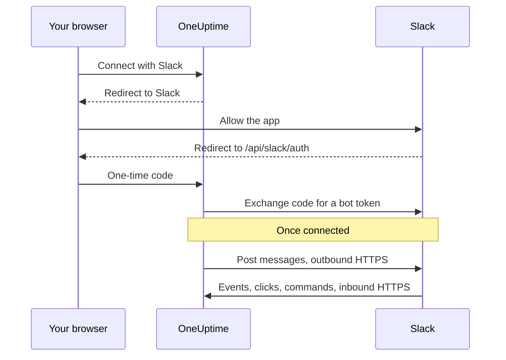

# Slack Integration

Connect your self-hosted OneUptime to Slack. You create a Slack app from the manifest your server generates, give OneUptime the app's credentials, and connect each project to a workspace. OneUptime then posts incidents, alerts and scheduled maintenance to your channels, and people act on them from Slack.

This page is for whoever runs the OneUptime server. Once Slack is connected, notification rules are set up per project: see [Slack](/docs/workspace-connections/slack).

:::cards
- [Set up the Slack app](#set-up-the-slack-app): Create the app from your manifest and connect a project.
- [Environment variables](#environment-variables): The three values OneUptime needs from the app.
- [Network access](#network-access-for-self-hosted-deployments): The callbacks Slack must be able to reach.
- [Troubleshooting](#troubleshooting): What the Slack page's messages mean, and what to do.
:::

## How it works

The Slack app is your own: it is installed in your workspace and talks only to your server. Traffic flows both ways, and each direction needs its own network access.



- **Outbound**: OneUptime calls Slack's Web API to post messages, create channels and upload images.
- **Inbound**: Slack calls four routes on your server for events, button clicks, menus and slash commands. Each request is signed with the app's signing secret. OneUptime rejects a request whose signature does not match or whose timestamp is more than five minutes old.

## Before you begin

- A Slack workspace where you can create and install apps.
- A public HTTPS hostname for OneUptime that Slack can reach. See [Network access](#network-access-for-self-hosted-deployments).
- Access to the server's configuration: `config.env` for Docker Compose, or your Helm values for Kubernetes.
- To connect a project, the **Project Owner**, **Project Admin** or **Project Member** role in it.

## Set up the Slack app

:::steps
### Set the public URL

OneUptime builds the app manifest and every callback URL from `HOST` and `HTTP_PROTOCOL`. Set them to the hostname Slack will call, over HTTPS:

:::tabs
@tab Docker Compose
```bash title="config.env"
HOST=oneuptime.example.com
HTTP_PROTOCOL=https
```
@tab Kubernetes
```yaml title="values.yaml"
host: oneuptime.example.com
httpProtocol: https
```
:::

These values only generate URLs. They do not create DNS records, certificates or firewall rules.

### Copy the app manifest

Open **Project Settings > Workspace > Slack**. Until Slack is set up on the server, the page shows **Integrating Slack with your OneUptime Project** with the manifest generated for your hostname. It is also served at `https://oneuptime.example.com/api/slack/app-manifest`.

Check that every URL in the manifest starts with your public hostname. If it does not, fix `HOST` and `HTTP_PROTOCOL` and apply the change first.

### Create the Slack app

On [api.slack.com/apps](https://api.slack.com/apps), create a new app from a manifest, pick your workspace and paste the manifest. Always use the manifest your own server generates, so its URLs match your hostname.

### Copy the app's credentials

On the app's **Basic Information** page, under **App Credentials**, copy the **Client ID**, **Client Secret** and **Signing Secret**.

### Add the credentials to OneUptime

:::tabs
@tab Docker Compose
```bash title="config.env"
SLACK_APP_CLIENT_ID=YOUR_SLACK_APP_CLIENT_ID
SLACK_APP_CLIENT_SECRET=YOUR_SLACK_APP_CLIENT_SECRET
SLACK_APP_SIGNING_SECRET=YOUR_SLACK_APP_SIGNING_SECRET
```
@tab Kubernetes
```yaml title="values.yaml"
slackApp:
  clientId: "YOUR_SLACK_APP_CLIENT_ID"
  clientSecret: "YOUR_SLACK_APP_CLIENT_SECRET"
  signingSecret: "YOUR_SLACK_APP_SIGNING_SECRET"
```

To keep the values in a Kubernetes Secret you manage, set `slackApp.existingSecret` instead: its `name`, and the keys `clientIdKey`, `clientSecretKey` and `signingSecretKey`.
:::

### Apply the configuration

:::tabs
@tab Docker Compose
```bash
npm run start
```

This recreates the containers with the new `config.env`. `docker compose restart` does not re-read it.
@tab Kubernetes
```bash
helm upgrade my-oneuptime oneuptime/oneuptime -f values.yaml
```
:::

When OneUptime is back, **Project Settings > Workspace > Slack** shows a **Connect with Slack** button instead of the manifest.

### Verify the Events request URL

In the Slack app's **Event Subscriptions**, verify the request URL. OneUptime only answers Slack's challenge once the signing secret is set, so retry it if it failed while you were creating the app.

### Connect the project

In **Project Settings > Workspace > Slack**, select **Connect with Slack** and allow the app in Slack. Slack sends you back to the same page, which now names your workspace.

### Connect your own Slack account

Buttons, forms and commands act as the OneUptime user linked to the Slack account that uses them. Each person opens **User Settings > Workspace > Slack** and selects **Connect my account with Slack**. Someone who has not connected an account gets a direct message from the app asking them to.
:::

## Environment variables

| Docker Compose (`config.env`) | Helm (`values.yaml`) | Required | Value |
| --- | --- | --- | --- |
| `SLACK_APP_CLIENT_ID` | `slackApp.clientId` | Yes | The app's **Client ID**. Without it, the Slack page shows the setup guide instead of **Connect with Slack**. |
| `SLACK_APP_CLIENT_SECRET` | `slackApp.clientSecret` | Yes | The app's **Client Secret**, used to exchange the code Slack returns for a token. |
| `SLACK_APP_SIGNING_SECRET` | `slackApp.signingSecret` | Yes | The app's **Signing Secret**. Every request from Slack is checked against it. |
| `HOST` | `host` | Yes | Your public hostname, without the scheme. |
| `HTTP_PROTOCOL` | `httpProtocol` | Yes | `https`. Slack only calls HTTPS URLs. |

## What the app can do

The manifest sets up these features. Each one reaches your server on the route shown, so it only works when Slack can reach that route.

| Feature | What it does | Route |
| --- | --- | --- |
| `/incident` and the **Create New Incident** shortcut | Declare an incident from Slack | `POST /api/slack/interactive` |
| `/maintenance` and the **Create Scheduled Event** shortcut | Schedule maintenance from Slack | `POST /api/slack/interactive` |
| `/oneuptime` | Ask OneUptime AI about your logs, traces, metrics, incidents and monitors | `POST /api/slack/command` |
| Buttons and forms on OneUptime messages | Acknowledge, resolve, add a note, change the state, run an on-call policy | `POST /api/slack/interactive` and `POST /api/slack/options-load` |
| Events | Mentions, messages, reactions and pins, for example saving a message as a note | `POST /api/slack/events` |

### Images in messages

Incident and alert descriptions can carry screenshots - a synthetic monitor's, for one (see [Showing a screenshot](/docs/monitor/incident-alert-templating#showing-a-screenshot)). OneUptime shows them in Slack messages by uploading each one to your workspace as a private file, which needs the `files:write` bot scope. The generated manifest includes it.

If you created your Slack app from an older manifest, add `files:write` under **OAuth & Permissions > Bot Token Scopes** (or update the app from the current manifest). Then select **Connect with Slack** again in **Project Settings > Workspace > Slack**, so the new scope is granted. Until then, each screenshot is shown as its alt text.

## Network access for self-hosted deployments

### Traffic direction and endpoints

| Traffic | Required access |
| --- | --- |
| OneUptime to Slack | DNS and outbound HTTPS on TCP 443 to `slack.com` for Web API calls and OAuth token exchange; `hooks.slack.com` for command response URLs and incoming-webhook notifications when used |
| Slack to OneUptime | Public HTTPS on TCP 443 to the four POST routes below for the complete integration |
| User's browser to OneUptime | Dashboard access and OAuth redirects to `/api/slack/auth/:projectId/:userId` and `/api/slack/auth/:projectId/:userId/user`; these can remain accessible through the user's VPN |

The outbound domains describe OneUptime's Slack integration, not an exhaustive allowlist for Slack clients or every Slack feature. A Slack *incoming webhook* is hosted by Slack: OneUptime sends to it, so it is not an inbound endpoint on your server. See Slack's [incoming webhook guide](https://docs.slack.dev/messaging/sending-messages-using-incoming-webhooks/).

Forward these callbacks to OneUptime through its ingress:

| Method and path | Purpose |
| --- | --- |
| `POST /api/slack/events` | Events API verification, reactions, pins, mentions and messages |
| `POST /api/slack/interactive` | Buttons, shortcuts, modal submissions, `/incident` and `/maintenance` |
| `POST /api/slack/options-load` | Interactive menu option requests |
| `POST /api/slack/command` | `/oneuptime` command |

OAuth is a [browser redirect followed by a server-side token exchange](https://docs.slack.dev/authentication/installing-with-oauth/). The manifest registers `/api/slack/auth` as the redirect URL prefix, and OneUptime adds the project and user paths when it starts the authorization. Browser access alone does not let Slack deliver events or button clicks.

### Private deployments and callback security

```mermaid title="Publishing the Slack callbacks from a private deployment"
flowchart LR
    Slack["Slack"] -->|HTTPS 443| GW["Public gateway"]
    GW -->|"/api/slack/* POST only"| ING["OneUptime ingress"]
    Users["Employees on VPN"] --> ING
    ING --> App["OneUptime app"]
```

Use public DNS and a gateway with a publicly trusted HTTPS certificate, a complete certificate chain, and a private route to your OneUptime ingress. Allow inbound TCP 443 to the gateway and forward only the four callback routes above. A private `ClusterIP`, an internal DNS name or an employee's VPN connection is not reachable by Slack. Split DNS can keep the dashboard and OAuth routes private under the same hostname.

Regenerate the manifest and update the Slack app after a hostname change.

Through the gateway, preserve:

- the method, path, query string and original body;
- `Content-Type`, `X-Slack-Signature` and `X-Slack-Request-Timestamp`;
- the public host and HTTPS scheme, through trusted proxy headers.

Exempt the callback routes from browser SSO, CAPTCHA and proxy login pages, and keep OneUptime's signing-secret and timestamp checks. Keep the server clock synchronized: a request more than five minutes off is rejected. Slack documents [request signature verification](https://docs.slack.dev/authentication/verifying-requests-from-slack/); a source IP check does not replace it.

### Verify access and understand limitations

:::steps
1. In the Slack app's **Event Subscriptions**, verify the request URL. Slack sends a [POST challenge and checks TLS](https://docs.slack.dev/apis/events-api/using-http-request-urls/).
2. Send a test notification, run a slash command, press a button on an incident message and trigger a subscribed event.
3. Check the gateway and OneUptime logs for failed deliveries, without logging secrets.
:::

Slack expects prompt acknowledgments, including [a response within three seconds for interactions](https://docs.slack.dev/interactivity/handling-user-interaction/). A browser GET or a successful outbound message does not verify these POST callbacks.

> [!WARNING]
> If all inbound connectivity is prohibited, an already authorized app can still send messages with outbound HTTPS, but events, buttons, shortcuts and commands cannot work. OneUptime's manifest uses HTTP callbacks and disables Socket Mode; turning on Slack Socket Mode is not a supported substitute for these routes.

The [private network access settings](/docs/self-hosted/private-network-access) control outbound requests to private destinations. They do not expose callbacks to Slack.

## Troubleshooting

### Connecting did not finish

When Slack sends you back and the connection was not made, the Slack page you started from (**Project Settings > Workspace > Slack**, or your own **User Settings > Workspace > Slack** when you were connecting your account) says **Slack was not connected**, with one sentence saying why, in your language. The rest of the page loads as usual, so you can connect again right there. It never shows what Slack itself answered: that is in the OneUptime server log, with the reason.

| The page says | What to do |
| --- | --- |
| **"This connection link is invalid, has expired, or has already been used. Please start again."** | The link works once, for 15 minutes, in the browser that started it. Start again from the Slack page and finish in Slack within 15 minutes, in the same browser. |
| **"You do not have permission to connect this project to Slack."** | Installing OneUptime in Slack needs **Project Owner**, **Project Admin** or **Project Member**. It is asked again when Slack sends you back, so a role taken away in the meantime ends the connection here too. |
| **"You are no longer a member of this project."** | Connecting your own Slack account needs you to be a member of the project when Slack sends you back. |
| **"This project is not connected to a Slack workspace yet."** | Install OneUptime in Slack from **Project Settings > Workspace > Slack** first, then connect your own account. |
| **"You signed in to a different Slack workspace from the one this project is connected to."** | Connect your account while signed in to the Slack workspace the project is installed in. |
| **"The connection was cancelled, so nothing was changed."** | The request was not allowed in Slack. Start again and allow it. |
| **"Slack is not set up on this OneUptime server."** | Set `SLACK_APP_CLIENT_ID` and `SLACK_APP_CLIENT_SECRET` (see [Environment variables](#environment-variables)) and restart OneUptime. |
| **"OneUptime could not finish connecting. Please try again."** | Slack answered with an error, or a request or a write failed while finishing. The OneUptime server log says which. Try again; if it keeps happening, check the log and the Slack app's settings. |

### Other problems

:::details Slack cannot verify the Events request URL
OneUptime answers Slack's challenge only when `SLACK_APP_SIGNING_SECRET` is set and the request reaches it. Set the signing secret, apply the configuration, and retry the verification. If it still fails, check that `POST /api/slack/events` is reachable from the internet with a publicly trusted certificate.
:::

:::details Buttons and slash commands do nothing, but notifications arrive
Notifications are outbound, so they work without inbound access. Buttons, shortcuts and commands are inbound: check that Slack can reach `POST /api/slack/interactive` and `POST /api/slack/command`, and that the gateway preserves the body and the `X-Slack-Signature` and `X-Slack-Request-Timestamp` headers.
:::

:::details The app says my Slack account is not connected to OneUptime
Buttons, forms and commands need your Slack account linked to your OneUptime user. Open **User Settings > Workspace > Slack** and select **Connect my account with Slack**. If you were removed from the project, the app says so instead, and actions from Slack are refused.
:::

:::details Screenshots show up as text
The Slack app is missing the `files:write` scope. See [Images in messages](#images-in-messages).
:::

## Next steps

:::cards
- [Slack](/docs/workspace-connections/slack): Create notification rules and summaries for the project.
- [Microsoft Teams Integration](/docs/self-hosted/microsoft-teams-integration): Set up the Teams bot on your server too.
- [Private Network Access](/docs/self-hosted/private-network-access): Let workflows and webhooks reach internal tools.
:::
