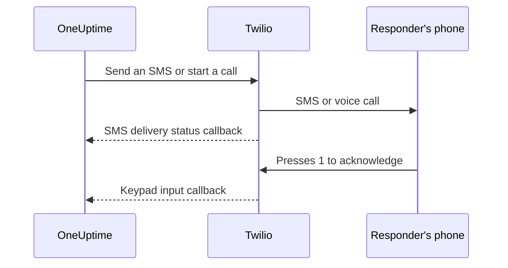

# Twilio SMS and Voice Integration

Self-hosted OneUptime sends SMS and voice alerts through your own Twilio account, and you pay Twilio directly. You save the Twilio credentials in OneUptime's dashboard, not in environment variables: notification delivery reads the saved configuration, and the Helm chart has no Twilio credential values.

> [!NOTE]
> A legacy migration imported `TWILIO_ACCOUNT_SID`, `TWILIO_AUTH_TOKEN`, and `TWILIO_PHONE_NUMBER`; changing those variables is not the way to update an existing installation's credentials.

:::cards
- [Prepare your Twilio account](#1-prepare-your-twilio-account): Credentials, a phone number and the account's limits.
- [Save the credentials](#2-save-the-credentials-in-oneuptime): For one project, or for the whole installation.
- [Configure network access](#3-configure-network-access): What Twilio must reach on your server, and when.
- [Verify phone numbers](#5-verify-team-members-phone-numbers): How team members' numbers are verified.
- [Incoming Call Policy](/docs/on-call/incoming-call-policy): Let callers reach your on-call engineers through a Twilio number.
:::

## 1. Prepare your Twilio account

:::steps
### Copy your credentials

Open the [Twilio Console](https://console.twilio.com/) and copy your **Account SID** and **Auth Token**.

### Get a phone number

Get a Twilio phone number with the SMS and/or Voice capabilities you need. Use E.164 format, including the country code, for sender and recipient numbers.

### Check the account's limits

Check the account balance, destination-country permissions, and applicable sender registration requirements. Trial accounts have recipient, geographic, and other restrictions that can prevent real OneUptime alerts from working; review [Twilio's account and trial documentation](https://www.twilio.com/docs/usage/tutorials/how-to-use-your-free-trial-account) before testing. Use an upgraded account for production.
:::

## 2. Save the credentials in OneUptime

Save the credentials for one project, or once for the whole installation:

| | Project configuration | Installation-wide configuration |
| --- | --- | --- |
| Where | The **Twilio Config** card in **Project Settings > Notifications > Notification Settings** | **Admin Dashboard > Settings > Call and SMS** |
| Who can set it | **Project Owner**, **Project Admin**, or **Create Call and SMS** in a custom role | A master admin |
| Used for | SMS and calls to the project's members while it is the project default, status pages it is assigned to, and incoming call policies that use it | SMS and calls to the members of any project that has no default configuration |

To add a project configuration:

:::steps
1. Go to **Project Settings > Notifications > Notification Settings**.
2. In **Twilio Config**, select **Create Twilio Config**.
3. Enter a name, **Twilio Account SID**, **Twilio Auth Token**, and **Twilio Primary Phone Number**. Optionally enter comma-separated **Twilio Secondary Phone Numbers** for other countries.
4. **Set as Project Default** starts on for the project's first configuration, so the SMS and calls to the project's members, including on-call notifications, go through it as soon as you save. Turn it off if this account is only for status pages or incoming calls. A later configuration starts with the switch off: turn it on, or pick **Set as Project Default** from the configuration's row menu, to move those messages to it. An API request that leaves `isProjectDefault` out is treated the same way.
5. Save. Only one configuration can be the project default. Status pages use the configuration explicitly assigned to each status page.

> [!IMPORTANT]
> **SMS** and **Phone Calls** start off in every project, and until they are on nobody in the project can add a phone number for them. A project owner, a **Billing Admin** or someone with **Manage Billing** turns them on in the **Notification Channels** card on the same page.
:::

For an installation-wide default, an administrator can instead open **Admin Dashboard > Settings > Call and SMS**, edit the Twilio credentials and phone numbers, and save. Member notifications use this global configuration when their project has no default. Keep the Auth Token confidential.

## 3. Configure network access

Sending works with outbound access alone. Delivery updates, keypad acknowledgement and incoming calls need Twilio to reach your server.

A private deployment needs DNS resolution and outbound HTTPS on TCP 443 to Twilio to submit SMS and calls. Twilio recommends allowing outbound HTTPS to `*.twilio.com` because its API addresses are dynamic; see [Twilio IP addresses](https://help.twilio.com/articles/115015934048-All-About-Twilio-IP-Addresses). Apply this to the OneUptime application workload's egress, including Kubernetes NetworkPolicies and external firewalls.

Inbound access depends on the feature:

| Feature | Does Twilio need to reach OneUptime? |
| --- | --- |
| SMS submission | No. Delivery status updates do need a callback. |
| A plain test voice call | No. OneUptime supplies the spoken instructions with the outbound API request. |
| Pressing 1 to acknowledge an on-call alert | Yes. Twilio submits the keypad input to OneUptime. |
| Incoming Call Policies | Yes. Twilio requests call instructions and reports dial results. |

These are the external paths, through OneUptime's Nginx gateway. The placeholders vary per notification:

| Method | Path | Purpose |
| --- | --- | --- |
| POST | `/notification/sms/status-callback/:smsLogId/:token` | SMS delivery status |
| POST | `/api/user-notification-log-timeline/call/gather-input/:itemId?token=...` | Keypad acknowledgement |
| POST | `/notification/incoming-call/voice` | Optional incoming-call instructions |
| POST | `/notification/incoming-call/dial-status/:callLogId/:callLogItemId` | Optional incoming-call routing results |

OneUptime generates the SMS and acknowledgement URLs automatically. Do not replace their tokens with a static webhook URL. For incoming calls, follow [Incoming Call Policies](/docs/on-call/incoming-call-policy), which configures the number's webhook when you attach a number.

Twilio requires [publicly reachable webhook URLs](https://www.twilio.com/docs/usage/webhooks/webhooks-overview). Use a publicly trusted TLS certificate and preserve the original host, protocol, path, query parameters, body, and `X-Twilio-Signature` header through proxies. Incoming-call handlers validate Twilio signatures; SMS delivery uses a per-message URL token, and keypad acknowledgement uses a signed query token. Do not expose tokens in shared logs or screenshots. See [Twilio webhook security](https://www.twilio.com/docs/usage/webhooks/webhooks-security).

### Publish callbacks from a private deployment

:::steps
1. Publish DNS for your OneUptime hostname, for example `oneuptime.example.com`, pointing to an internet-facing reverse proxy or load balancer. Allow inbound TCP 443 and configure a publicly trusted certificate with its complete chain. A private IP, internal-only DNS, or an administrator's VPN connection does not provide Twilio connectivity.
2. Give that gateway a network route to OneUptime's private ingress, directly or through your own site-to-site VPN/private link. Permit the upstream service port. A Kubernetes `ClusterIP` service needs a reachable ingress or another route from the gateway. Keep databases and other internal services private.
3. Publish only the callback paths you use from the table above. Forward them through OneUptime's Nginx gateway, which maps the external `/notification` prefix to the application. Keep `/api` on the keypad route. Preserve the HTTP method and request data; do not redirect to another URL. Preserve the public `Host` and set trusted forwarding headers for the public host and HTTPS scheme at your proxy.
4. Exempt these routes from browser SSO, CAPTCHA, and proxy login pages. Keep OneUptime's callback authentication enabled. Limit access to the private origin to the gateway and authorized internal clients.
5. Set `HOST=oneuptime.example.com` and `HTTP_PROTOCOL=https` in Docker Compose's `config.env`, or `host: oneuptime.example.com` and `httpProtocol: https` in Helm values. Apply the deployment change and wait for the application to restart. These settings generate URLs; they do not create DNS, certificates, or firewall rules. OneUptime has no separate Twilio callback hostname setting. If the hostname changes, update the webhook on existing Twilio phone numbers as well.
:::

The dashboard can remain on a private ingress: with split DNS, employees resolve the same hostname to that ingress over the corporate network or VPN, while Twilio resolves it to the gateway. Serve a certificate valid for that hostname on both paths. OneUptime's [Private Network Access settings](/docs/self-hosted/private-network-access) govern outbound requests to internal services; `ALLOW_PRIVATE_NETWORK_WEBHOOKS` does not publish an inbound endpoint.

### IP restrictions and deployments with no inbound access

Twilio's ordinary webhook source addresses change, so do not use SIP or media IP ranges as a callback allowlist. Eligible Twilio editions provide [Static Proxy for Webhooks](https://www.twilio.com/docs/iam/twilio-editions/twilio-static-proxy). Confirm your edition's eligibility and supported products, and configure your firewall using Twilio's current published ranges; continue validating callbacks even when using it.

> [!WARNING]
> If policy forbids inbound connections, SMS submission and simple inline voice playback can work with outbound HTTPS. SMS delivery updates, keypad acknowledgement, and incoming call routing cannot work without reachable callbacks. A fully disconnected installation cannot use Twilio.

For development, Twilio's [webhook testing guide](https://www.twilio.com/docs/usage/webhooks/webhook-testing) describes using a public tunnel: forward it to a proxy permitting only the required routes, configure the resulting hostname as above, and stop it after testing. A tunnel still exposes inbound access.

## 4. Test delivery and callbacks separately

:::steps
1. From outside your corporate network and VPN, verify that the callback hostname resolves to the public gateway and serves a valid TLS certificate. A browser GET does not exercise these POST callbacks.
2. Use **Send Test SMS** and **Send Test Call** on the project's Twilio configuration. Confirm receipt on the destination phone. Both need permission to add Twilio configurations: **Project Owner**, **Project Admin**, or **Create Call and SMS** and **Read Call and SMS** in a custom role.
3. Configure the user's verified SMS/call contact and notification rules, then trigger a controlled on-call alert. Press 1 and confirm acknowledgement in OneUptime. If you use Incoming Call Policies, call the configured number and check its routing and call log.
4. Confirm SMS delivery status in OneUptime and Twilio's message logs. An accepted send is not proof of delivery; [Twilio reports later status changes through callbacks](https://www.twilio.com/docs/messaging/guides/track-outbound-message-status).
:::

| Symptom | Where to look |
| --- | --- |
| Nothing is sent | Credentials, the number's capabilities, account restrictions and outbound connectivity. |
| The SMS or call arrives, but its status or the acknowledgement does not update | The callback URL and the public ingress logs. Twilio's [HTTP retrieval failure guidance](https://www.twilio.com/docs/api/errors/11200) helps diagnose unreachable callbacks, TLS problems, and HTTP errors. |

A successful test call alone does not verify callback access.

## 5. Verify team members' phone numbers

Adding a phone number for SMS or calls sends its verification code straight away, and the verify dialog opens. It shows when the code was sent and until when it works, and sends a new code when asked, at most once a minute. Nothing needs to be resent before verifying.

When no code can be sent, the dialog says why instead of claiming one was sent: for example, that no Twilio account is set up, until a project default configuration or the installation-wide configuration above exists. A number whose first code cannot be sent is not added, and the form shows the reason, such as Twilio refusing a destination country.

A number verified for SMS is also verified for calls, with no second code. Verifying by call does not verify SMS, because a number that takes calls, such as a landline, cannot always receive texts. If Twilio accepts a code that never arrives, the project's SMS log shows its delivery status.
