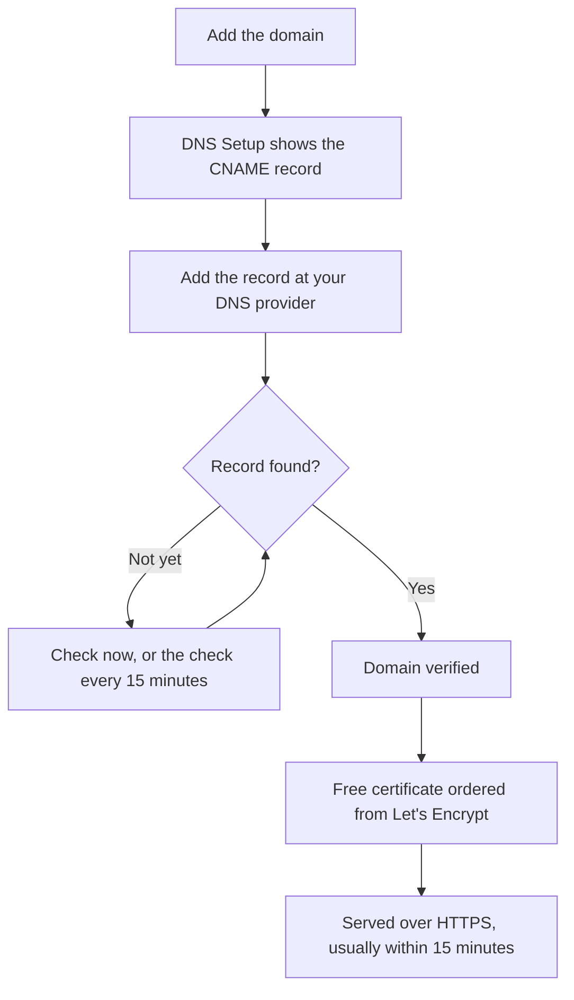

# Status Page Branding & Domains

Your status page is the one OneUptime screen your customers look at, so it should look like yours and live on your own domain, such as `status.yourcompany.com`. This page walks the **Branding** page card by card, then puts the page on your domain: add the domain, add one DNS record, and the free SSL certificate follows on its own.

:::cards
- [The Branding page](#the-branding-page): Logo, title, favicon, links, footer, colors and languages.
- [Custom HTML, CSS and JavaScript](#custom-html-css-and-javascript): Anything the built-in controls do not cover.
- [Custom domains](#custom-domains): Your own hostname, with a free certificate.
- [The Status column](#reading-the-domain-status-column): Where each domain is on its way to HTTPS.
:::

## Where each branding control lives

Open a status page, and the side menu's **Branding** section has three items:

| Page | What you set there |
| ---- | ------------------ |
| **Branding** | Logo and cover image, page title and description, favicon, header links, the overview page description, the copyright line and footer links. Folded under **More settings**: history chart colors, languages and search engine indexing. |
| **Custom Domains** | Your own domain, its DNS record, and its free SSL certificate. |
| **HTML, CSS & JavaScript** | Header HTML, footer HTML, custom CSS, custom JavaScript. |

Three things that look like branding are on **Status Pages → your page → Advanced → Advanced Settings** (`{id}/settings`) instead, because they decide what the page shows rather than how it looks: the overall uptime percent, which monitor statuses count against uptime, and the "Powered by OneUptime" line. All three are rows of the **What your status page shows** card there.

Branding used to be split across separate **Essential Branding**, **Header**, **Footer**, **Overview Page** and **Languages** screens. Their old addresses (`{id}/header-style`, `{id}/footer-style`, `{id}/overview-page-branding` and `{id}/languages`) now open the **Branding** page, so old bookmarks and links still work.

## The Branding page

**Status Pages → your page → Branding → Branding** (`{id}/branding`). Each card saves on its own. After the logo, the title and the favicon, the cards follow your status page from top to bottom: the header's links, the text at the top of the overview, then the footer. What few people change is folded under **More settings**, at the bottom.

### Logo and cover image

The first card, **Logo and Cover Image**, has an **Edit Images** button that opens two steps:

| Step | Fields |
| ---- | ------ |
| **Logo** | The logo upload (placeholder `Upload logo`) and **Logo Alt Text** (placeholder `Logo of My Company`). Leave the alt text blank and the status page title is used instead. |
| **Cover Image** | **Cover**, an upload (placeholder `Upload cover image`) for the wide banner behind the header, and **Cover Image Alt Text**. Leave the alt text blank if the cover is purely decorative. |

The logo, the cover image and the favicon are files uploaded in the status page's own project, and that is checked whenever one is saved — from the dashboard, the API, Terraform or a workflow. A file uploaded in another project is refused with the words a file that no longer exists gets: "The logo's file could not be found. Upload the logo again.", "The cover image's file could not be found. Upload the cover image again." or "The favicon's file could not be found. Upload the favicon again." Uploading the image again from the page fixes it.

Your status page shows only images of its own project; an image it cannot show is left out, as if the page had none. The dashboard, the API and Terraform read the page's images the same way: an image of another project comes back as no image at all. The emails the page sends — to subscribers, and to private users about their sign-in — show its logo the same way: a logo the page cannot show is left out of them too, rather than shown as a broken image.

### Title, description and favicon

- **Title and Description** — the card notes this is also used for SEO. **Edit** opens **Page Title** (placeholder `Please enter page title here.`) and **Page Description**. Search engines and link previews show these, so write them for a customer, not for your team.
- **Favicon** — **Edit Favicon** opens the **Favicon** upload: the small icon in the browser tab.

### Header links

The **Header Links** table holds the links in the status page's header, such as your website, your docs or a support portal. Each link has a **Title** and a **Link** (a URL, placeholder `https://link.com`), and you reorder them by dragging. With none, the table says **No status header link for this status page**, with **Create Status Page Header Link** under it.

### Overview page description

**Overview Page Description** is the first thing on the status page's overview, above the announcements, the overall status and your resources. **Edit Description** opens a markdown field. Use it for a sentence of context: what this page covers, and where to go for support. An image you put in it is shown to every visitor of the page.

### Footer

- **Copyright Info** — **Edit Copyright** opens one field, **Copyright Info**, with the placeholder `Acme, Inc.`.
- **Footer Links** — the same **Title** and **Link** pair as the header links, ordered by dragging. With none, it says "No status footer link for this status page."

Header links are for navigation; footer links are for the fine print, such as legal, privacy and terms.

### More settings

The last section of the page is folded under **More settings**, because few people ever change what is in it. Folded, its header names its four sections — **Default Bar Color**, **Bar Color Rules**, **Languages** and **Search Engine Indexing** — and shows each one that differs from what a new status page starts with: a default bar color other than the green every page starts with, any bar color rule, a default language other than English, a shorter list of languages, or search engine indexing turned off. Click it to open it: it is one card, the four sections one under the other, each with its own title and button, separated by dividers.

**History chart colors.** These are the only built-in color controls on a status page.

- **Default Bar Color of the History Chart** — **Edit Default Bar Color** opens the **Default Bar Color** picker. Every new status page starts with green. With bar color rules, it is also the color of a day no rule matches. A day the page has no data for is always drawn grey.
- **Rules for Bar Colors of History Chart** — an ordered table of rules you sort by dragging. Each rule has **When uptime % is greater than or equal to** and **Then, use this bar color**; the table's columns read `When Uptime Percent >=` and `Then, Bar Color is`. A new rule's color is already picked, one the other rules do not use yet; pick the one you want instead. Order matters, so arrange the rules the way you want them evaluated. With no rules, each day's bar takes the color of the lowest monitor status of that day.

How many days the chart covers is not set here. That is **Uptime History** in the **What your status page shows** card on **Advanced → Advanced Settings**, from 1 to 90 days. Which monitor statuses count as down is **Counts as downtime**, in the same row of that card.

**Languages.** The **Languages** section sets the language switcher visitors get in the page footer. **Edit Languages** opens two fields:

| Field | What it does |
| ----- | ------------ |
| **Default Language** | The language first-time visitors see, picked from a list that names each language natively and in English (`Deutsch (German)`). It defaults to English, and visitors can always switch from the footer. |
| **Enabled Languages** | A multi-select, placeholder `All languages`. Leave it empty and every supported language is offered; choose a few and the footer lists only those. |

Seventeen languages ship with OneUptime: English, German, French, Spanish, Italian, Portuguese, Dutch, Danish, Norwegian, Swedish, Russian, Japanese, Korean, Chinese (Simplified), Chinese (Traditional), Hindi and Persian.

**Search Engine Indexing.** One switch, **Allow Search Engines to Index this Status Page**, decides whether Google, Bing and other search engines may list the page. It is on by default. There is no **Edit** button: the switch saves the moment you flip it. Switch it off and the page is served with `noindex, nofollow` (a robots meta tag and an `X-Robots-Tag` header); anyone with the link can still open it. Search engines can take a few weeks to drop a page they have already indexed.

> [!TIP]
> Turn **Allow Search Engines to Index this Status Page** off while a page is internal-only or still being set up, so a half-finished page does not start ranking for your brand name.

## Uptime percent and downtime statuses

Both are in the **Uptime History** row of the **What your status page shows** card on **Status Pages → your page → Advanced → Advanced Settings** (`{id}/settings`). There is no **Edit** button: each saves the moment you change it.

- **Show Overall Uptime Percent** — a switch, off by default. While it is on, **Precision** beside it picks how many decimals the percentage shows: `99%`, `99.9%`, `99.99%` (the default) or `99.999%`. On OneUptime Cloud, turning the percentage on needs the **Scale** plan; its precision can be changed on every plan.
- **Counts as downtime** — the monitor statuses, as colored chips, whose time counts against uptime on this page. This is where you decide whether, say, a degraded status counts against uptime. At least one status stays picked.

They used to be two cards of their own, **Overall Uptime Percent** and **Downtime Monitor Statuses**, each behind an **Edit** button. See [Choosing what shows on the page](/docs/status-pages/index#choosing-what-shows-on-the-page) for the rest of the card.

## Custom HTML, CSS and JavaScript

**Status Pages → your page → Branding → HTML, CSS & JavaScript** (`{id}/custom-code`) has four cards, each edited on its own and stored in a column of the status page:

| Card | Column | What it holds |
| ---- | ------ | ------------- |
| **Header HTML** | `headerHTML` | HTML added to the page header (placeholder `Insert Custom HTML here.`). |
| **Footer HTML** | `footerHTML` | HTML added to the page footer. |
| **Custom CSS** | `customCSS` | Styles for the whole page (placeholder `Insert Custom CSS here.`). |
| **Custom JavaScript** | `customJavaScript` | A script the page runs (placeholder `Insert Custom JavaScript here.`). |

> [!IMPORTANT]
> Custom HTML, CSS and JavaScript are served only on a verified custom domain. They are turned off on the default `/status-page/:id` address, because that address shares OneUptime's signed-in origin.

On OneUptime Cloud, adding or changing any of them needs the **Growth** plan. Emptying one works on every plan, so custom code a trial added can always be removed.

**There is no theme picker.** OneUptime status pages have no theme or brand-color setting: the only built-in color controls anywhere are **Default Bar Color** and the history chart bar color rules, under **More settings** on the **Branding** page. Fonts, background colors, accent colors and layout tweaks all go through **Custom CSS**. If you have been looking for a "brand color" field, this is the answer: there isn't one, and this box is the way to do it.

> [!WARNING]
> Custom JavaScript runs in your visitors' browsers, on a page people open precisely when they think something is broken. Keep it small, host what it loads yourself where you can, and test it before you rely on it.

## Custom domains

By default a status page is reachable at the preview URL on its **Overview** screen. To put it on your own hostname, go to **Status Pages → your page → Branding → Custom Domains** (`{id}/domains`).

The **Custom Domains** card says what to do: point each domain's CNAME record to your installation's status page CNAME record, and OneUptime issues the domain's SSL certificate and renews it for you. With nothing set up, the table says **No custom domains found**, with **Create Status Page Domain** under it. The table has two columns, **Domain** and **Status**, and filters for **Domain**, **CNAME Valid** and **SSL Provisioned**.

Putting the page on your domain takes three steps, and only the first two are yours:

1. **Add the domain**: a subdomain and one of your verified domains.
2. **Add its CNAME record** at your DNS provider. The **DNS Setup** dialog shows the record as soon as you add the domain.
3. **The free SSL certificate is issued automatically** once the record is found. There is no button to press.



### Before you start

- **The parent domain must be verified.** The **Domain** dropdown lists only the domains verified under **Project Settings → Domains**, where you prove you own a domain with a TXT record. The **Add a domain** link beside the field opens that page in a new tab.
- **Your installation needs a status page CNAME record.** OneUptime Cloud has one. On a self-hosted installation, set it to a hostname that points at your OneUptime server (an A record), and make sure the server answers on port 80, where Let's Encrypt checks it. Without it, the card and the **DNS Setup** dialog say "Custom Domains not enabled for this OneUptime installation" instead of showing a record.

:::tabs
@tab Docker Compose
```ini title="config.env"
STATUS_PAGE_CNAME_RECORD=oneuptime.yourcompany.com
```
@tab Kubernetes
```yaml title="values.yaml"
statusPage:
  cnameRecord: oneuptime.yourcompany.com
```
:::

### Adding the domain

:::steps
#### Open Create Status Page Domain

On **Custom Domains**, click **Create Status Page Domain**. The dialog is one page.

#### Enter the subdomain

In **Subdomain** (placeholder `status (leave blank for root)`), enter only the label, such as `status`, not the whole hostname. Leave it blank, or enter `@`, to use the root (apex) domain.

#### Pick the domain

In **Domain** (placeholder `Select domain`), pick one of your verified domains. A domain you have not verified is not listed, because it would be refused.

#### Keep the free certificate, or upload your own

**More fields** is folded, and its header says which certificate the domain will use: "We issue a free SSL certificate for this domain and renew it automatically." Open it only to use a certificate of your own: switch **Upload Custom Certificate** on, then paste the **Certificate** and the **Certificate Private Key** in PEM format. Both are then required.

#### Create the domain

Click **Create Status Page Domain**. The dialog closes and the new domain's **DNS Setup** opens, with the record to add.
:::

A domain's full name is fixed when you add it, so **Edit** changes only its certificate. To use a different subdomain, add that domain and delete the old one.

### DNS Setup and verification

The **DNS Setup** dialog shows the record to add at your DNS provider, one field per row, each with a copy button:

| Field | What to enter |
| ----- | ------------- |
| **Type** | `CNAME` |
| **Name** | The full domain you added, for example `status.yourcompany.com` |
| **Value** | Your installation's status page CNAME record |

> [!NOTE]
> For a root domain, one with no subdomain, the dialog adds a note: many DNS providers do not allow a CNAME record there. Use your provider's ALIAS, ANAME or CNAME flattening record with the same value instead.

OneUptime checks every unverified domain every 15 minutes and verifies yours as soon as its record is live, whether or not you come back. To check right away, click **Check now**:

- **The record is not found yet.** The dialog stays open and says which record it looked for. A new DNS record can take a while to show up: click **Check now** again later, or leave it to the 15-minute check.
- **The record is found.** The dialog says "Your CNAME record is verified." and what happens to the certificate next. The free certificate is ordered at that moment.

Until a domain is verified and its certificate is in place, its row has a **DNS Setup** action that opens the same dialog. On a verified domain whose certificate order keeps failing, or whose certificate has expired, **Check now** there orders again and shows why the last order failed. It orders at most once per domain every 15 minutes; in between, OneUptime keeps retrying on its own.

### SSL certificates

Every custom domain gets a free certificate from Let's Encrypt, issued and renewed automatically. There is nothing to click:

- **Check now** orders the certificate the moment the record is found. The dialog then says the certificate is usually live within 15 minutes.
- When the 15-minute check verifies a domain, it orders the domain's certificate in the same check.
- Renewal is automatic, well before the certificate expires. If your DNS does not answer for a moment while a certificate is being renewed, the certificate keeps serving and is renewed on a later attempt. A failed DNS check never removes a certificate that is still valid.

A new certificate is served within 15 minutes of being issued, because that is how often certificates are written out to the servers that answer for your domain. The Status column says _usually_ within 15 minutes: when many domains are waiting at once, they are worked through a few at a time.

Every OneUptime certificate is ordered from one shared Let's Encrypt account, and Let's Encrypt limits how many new orders one account may place in a short time, and how often an order for the same domain may fail. OneUptime keeps all of its orders - new domains, **Check now**, reissues and renewals - within those limits together, and renewals always come first, so a burst of new domains never holds up the renewals that keep existing domains online.

If an order fails, the domain's Status column says so, with the reason on the line below, and **Check now** in **DNS Setup** shows it too. OneUptime keeps trying on its own, waiting a little longer after each failure in a row, so a domain whose order keeps failing does not use up the orders every other domain needs. The usual causes are a CAA record on your domain that does not allow `letsencrypt.org` and, on a self-hosted install, a server that Let's Encrypt cannot reach on port 80; on a self-hosted install the worker logs have the details. Once you have fixed the cause, click **Check now** to order again straight away. It places at most one order per domain every 15 minutes; a click in between shows how the last order went.

If you uploaded your own certificate under **More fields**, OneUptime serves that one instead, within 15 minutes of saving. Upload its replacement before it expires by editing the domain.

### Reissuing a certificate

Automatic renewal covers the ordinary case, but sometimes you want a brand new certificate right now: a private key you would rather not keep, a certificate your own scanner is unhappy with, or a domain that changed upstream. Once a free certificate has been ordered for a domain, its row shows a **Reissue SSL** action.

Its dialog, **Reissue SSL Certificate for this Status Page**, asks Let's Encrypt for a fresh certificate for the domain and replaces the one being served with it. Your status page stays online on the existing certificate meanwhile, and the new certificate is served within 15 minutes. Click **Reissue SSL Certificate** to order it.

> [!NOTE]
> A domain can be reissued only once every 24 hours. Let's Encrypt limits how often the same domain can be issued, and every OneUptime certificate is ordered against one shared account, including the automatic renewals that keep everybody else's pages online. Inside that window the dialog tells you how long is left instead of ordering. If a certificate for the domain is being ordered at that moment, or the installation's Let's Encrypt orders are used up for the moment, the dialog says so, nothing is ordered, and the press does not count as your reissue.

The action does not appear on a domain using a certificate you uploaded: there is no Let's Encrypt certificate to reissue, so upload a new one by editing the domain instead. It also does not appear before the domain's first certificate is ordered, which happens on its own once its CNAME record is verified.

The same button, with the same 24 hour limit, is on dashboard custom domains under **Dashboards → your dashboard → Branding → Custom Domains**, which work the same way as status page custom domains: see [Sharing & Public Dashboards](/docs/dashboards/sharing#custom-domains).

### Reading the domain Status column

The **Status** column says where each domain is on its way to HTTPS, in one of seven states. When an order failed, the reason is on the line below.

| What the Status column says | What it means |
| --------------------------- | ------------- |
| Waiting for DNS: add the CNAME record. | The CNAME record is not found yet. Open **DNS Setup** for the record, add it at your DNS provider, then click **Check now** or wait for the 15-minute check. |
| Issuing a free certificate, usually within 15 minutes. | The record is verified, and the certificate is being ordered or written out. Nothing to do. |
| Could not issue a free certificate yet. We keep trying. | The record is verified, but ordering its certificate failed, for the reason on the line below. Fix the cause, then open **DNS Setup** and click **Check now** to order again now. |
| Certificate expired. We keep trying to renew it. | The domain's certificate has expired because its renewals failed. Open **DNS Setup** and click **Check now** to renew it now and see why. |
| Certificate issued, renews automatically. | Done. The domain serves its certificate over HTTPS, and OneUptime renews it. |
| Certificate issued, but renewing it failed. We keep trying. | The domain still serves a valid certificate, but its last renewal failed, for the reason on the line below. OneUptime tries again well before the certificate expires. |
| Uses your uploaded certificate. | The record is verified, and the domain is served with the certificate you uploaded. |

:::details A domain stays on "Waiting for DNS" long after I added the record
Check that the record's name is the full domain, such as `status.yourcompany.com`, and that its value matches your installation's CNAME record exactly. On a root domain, use an ALIAS, ANAME or flattened CNAME record. Then click **Check now** in **DNS Setup**.
:::

:::details The Status column says it could not issue a free certificate
Look for a CAA record on your domain that leaves out `letsencrypt.org`, and, on a self-hosted install, check that your server answers on port 80. Fix the cause, then click **Check now** in **DNS Setup** to order again.
:::

### Who can check and reissue

**Check now**, ordering a domain's certificate and **Reissue SSL** change the domain, so they need permission to edit it: **Edit Status Page Domain**, or a role that includes it (Project Owner, Project Admin, Project Member, Status Page Admin or Status Page Member).

Someone who can only read the domain, such as a Viewer or a Status Page Viewer, still sees the **Status** column and the record to add in **DNS Setup**. For them **Check now** and **Reissue SSL** are locked, and say which permission they need. OneUptime keeps checking every domain and ordering its certificate on its own either way.

The same goes for API keys. A key that can only read status page domains can't call `verify-cname`, `order-ssl` or `reissue-ssl` on `/status-page-domain`. Give it **Read Status Page Domain** and **Edit Status Page Domain** if it needs to.

## Powered by OneUptime

The "Powered by OneUptime" line is not a branding setting. It is the last switch of the **What your status page shows** card on **Status Pages → your page → Advanced → Advanced Settings** (`{id}/settings`): **Show Powered By OneUptime Branding**, on by default. Turn it off to hide the line; it saves at once. On OneUptime Cloud, hiding it needs the **Scale** plan.

## Next steps

:::cards
- [Status Pages Overview](/docs/status-pages/index): What the page shows, and who can see it.
- [Status Page Resources & Groups](/docs/status-pages/resources-and-groups): Choose what visitors actually see on the page.
- [Subscribers & Announcements](/docs/status-pages/subscribers): The emails that carry your logo and link to your domain.
- [Public API](/docs/status-pages/public-api): Read the page as JSON, on your own domain too.
:::
