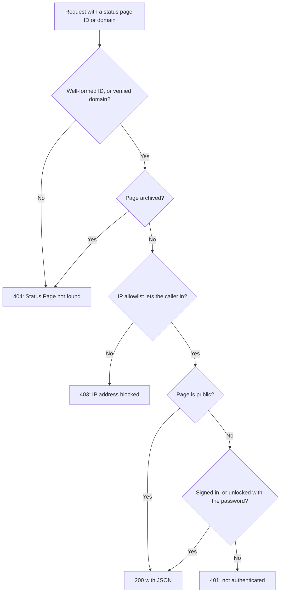

# Public API

Every status page answers a small set of read-only JSON endpoints: its overview, uptime, incidents, episodes, scheduled maintenance events and announcements. They are the endpoints the status page itself loads, so they return exactly what a visitor sees, and a public page needs no API key. Use them to show your status in your own app, a chat bot or a wall display.

:::cards
- [Endpoints](#endpoints): One endpoint for each thing the page shows.
- [Read the overview](#read-the-overview): The whole page in one request, with curl, Node.js and Python.
- [Uptime for a date range](#uptime-for-a-date-range): Uptime per resource and group, for up to 90 days.
- [Errors](#errors): What each status code means.
:::

## How a request is answered

Each request names the status page by its ID or by one of its custom domains. OneUptime finds the page, applies the same access rules a visitor meets, and answers with JSON.



A private page answers only a browser that has signed in to it, or unlocked it with its password: the API reads the same session the page does. For a script, use a public page. See [Restricting who can see the page](/docs/status-pages/index#restricting-who-can-see-the-page).

An ID that is well formed but belongs to no status page goes down the same path as a private page, and is answered `401`. If a public page answers `401`, check the ID.

## Before you begin

- **The status page ID.** Open the page in the dashboard (**Status Pages → All Status Pages**, then the page). The **Status Page Details** card on its **Overview** shows the **Status Page ID**.
- **The base URL.** Every endpoint below is under `/status-page-api`:

| Where the page runs | Base URL |
| ------------------- | -------- |
| OneUptime Cloud | `https://oneuptime.com/status-page-api` |
| Self-hosted OneUptime | `https://<your-oneuptime-host>/status-page-api` |
| A custom domain of the page | `https://status.example.com/status-page-api` |

Wherever a path below says `{statusPageIdOrDomain}`, you can send the page's ID or one of its verified custom domains, such as `status.example.com`. The uptime endpoint takes the ID only, and answers a domain with `401`.

## Endpoints

| Endpoint | Methods | Returns |
| -------- | ------- | ------- |
| `/overview/{statusPageIdOrDomain}` | `GET`, `POST` | Everything the overview shows: the overall status, resources and groups, active incidents and episodes, scheduled maintenance, live announcements and the data behind the uptime bars. |
| `/uptime/{statusPageId}` | `POST` | Uptime percentages per resource and per group, for a date range. |
| `/incidents/{statusPageIdOrDomain}` | `GET`, `POST` | The incidents the page lists, with their public notes and state changes. |
| `/incidents/{statusPageIdOrDomain}/{incidentId}` | `POST` | One incident. |
| `/episodes/{statusPageIdOrDomain}` | `POST` | The incident episodes the page lists. |
| `/episodes/{statusPageIdOrDomain}/{episodeId}` | `POST` | One episode. |
| `/scheduled-maintenance-events/{statusPageIdOrDomain}` | `GET`, `POST` | The scheduled maintenance events the page lists, with their public notes and state changes. |
| `/scheduled-maintenance-events/{statusPageIdOrDomain}/{scheduledMaintenanceId}` | `POST` | One scheduled maintenance event. |
| `/announcements/{statusPageIdOrDomain}` | `GET`, `POST` | The announcements the page lists. |
| `/announcements/{statusPageIdOrDomain}/{announcementId}` | `POST` | One announcement. |

The endpoints follow the page's own settings, in the **What your status page shows** card (see [Choosing what shows on the page](/docs/status-pages/index#choosing-what-shows-on-the-page)):

- A list that is switched off refuses its endpoint, for example `Incidents are not enabled on this status page.`
- Each list reaches back as far as its **Show the last … days** setting (14 by default). The incidents list also includes every incident that is not resolved yet, and the scheduled maintenance list every event that is still to come or in progress.
- By its ID, an incident, episode, event or announcement is returned however old it is, so a link to an older one keeps working. One the page does not show at all, such as an incident on a monitor that is not on the page, comes back as an empty list, and an episode as `404`.

**Which incidents a page returns.** The incidents endpoint returns the incidents on the page's monitors, less the ones limited to other status pages, and less every incident not limited to this page if the page only shows incidents scoped to it (see [One Status Page per Audience](/docs/status-pages/one-status-page-per-audience)). Which pages an incident is limited to is never part of the response.

## Read the overview

The overview is one request for the whole page. It is the same data the status page draws, and it is at most 15 seconds old.

:::tabs
@tab curl
```bash
curl https://oneuptime.com/status-page-api/overview/YOUR_STATUS_PAGE_ID
```
@tab Node.js
```javascript title="status.mjs"
// Node.js 18 or later: fetch is built in. Run with `node status.mjs`.
const statusPageId = "YOUR_STATUS_PAGE_ID";

const response = await fetch(
  `https://oneuptime.com/status-page-api/overview/${statusPageId}`,
);
const body = await response.json();

if (!response.ok) {
  throw new Error(`${response.status}: ${body.error}`);
}

console.log(body.overallStatus?.name); // "Operational"
```
@tab Python
```python title="status.py"
# Python 3, standard library only. Run with `python3 status.py`.
import json
import urllib.request

STATUS_PAGE_ID = "YOUR_STATUS_PAGE_ID"
url = f"https://oneuptime.com/status-page-api/overview/{STATUS_PAGE_ID}"

with urllib.request.urlopen(url, timeout=10) as response:
    overview = json.load(response)

print((overview.get("overallStatus") or {}).get("name"))  # Operational
```
:::

The overall status is the worst current status of the monitors and monitor groups on the page, the one with the highest priority. A monitor status looks like this:

```json
{
  "_id": "cc80b385-4190-42a3-ae8b-9b391e90d79f",
  "name": "Operational",
  "color": { "_type": "Color", "value": "#2ab57d" },
  "isOperationalState": true,
  "priority": 1
}
```

### What the overview returns

| Key | What it holds |
| --- | ------------- |
| `overallStatus` | The page's overall status, a monitor status as above. A page with nothing on it gets the project's lowest-priority status. |
| `statusPage` | The page's public settings: its title, description, branding and what it shows. |
| `statusPageResources` | Each resource: its display name, description, group, monitor or monitor group, and display options. |
| `resourceGroups` | The groups, with `parentStatusPageGroupId` for nested groups. |
| `monitorStatuses` | Every monitor status of the project, from the lowest priority to the highest. |
| `monitorGroupCurrentStatuses`, `monitorsInGroup` | The current status of each monitor group on the page, and the monitors in it. |
| `monitorStatusTimelines`, `uptimeDailyAggregate`, `monitorGroupMergedDowntime`, `statusPageHistoryChartBarColorRules` | What the uptime bars are drawn from, and the page's bar color rules. |
| `activeIncidents`, `incidentPublicNotes`, `incidentStateTimelines`, `incidentStates` | The unresolved incidents the page shows, their public notes and state changes, and the project's incident states. |
| `timelineIncidents` | The incidents in the uptime bars' window, resolved ones included, for the bars' tooltips. |
| `activeEpisodes`, `episodePublicNotes`, `episodeStateTimelines` | The same for incident episodes. |
| `scheduledMaintenanceEvents`, `scheduledMaintenanceEventsPublicNotes`, `scheduledMaintenanceStateTimelines`, `scheduledMaintenanceStates` | The scheduled maintenance events that are still to come or in progress, their public notes and state changes. |
| `activeAnnouncements` | The announcements showing now: started, and not ended. |

## Uptime for a date range

`POST /uptime/{statusPageId}` returns the uptime of each resource and group on the page between two dates. Both dates are optional:

| Field | Default | Notes |
| ----- | ------- | ----- |
| `startDate` | 14 days ago | An ISO 8601 date and time. |
| `endDate` | Now | Must not be before `startDate`. The range can cover at most 90 days. |

:::tabs
@tab curl
```bash
curl -X POST https://oneuptime.com/status-page-api/uptime/YOUR_STATUS_PAGE_ID \
  -H "Content-Type: application/json" \
  -d '{"startDate": "2026-09-01T00:00:00Z", "endDate": "2026-09-30T23:59:59Z"}'
```
@tab Node.js
```javascript title="uptime.mjs"
// Node.js 18 or later. Run with `node uptime.mjs`.
const statusPageId = "YOUR_STATUS_PAGE_ID";

const response = await fetch(
  `https://oneuptime.com/status-page-api/uptime/${statusPageId}`,
  {
    method: "POST",
    headers: { "Content-Type": "application/json" },
    body: JSON.stringify({
      startDate: "2026-09-01T00:00:00Z",
      endDate: "2026-09-30T23:59:59Z",
    }),
  },
);
const uptime = await response.json();

for (const group of uptime.groupUptimes) {
  console.log(group.statusPageGroupName, group.uptimePercent);
}
```
@tab Python
```python title="uptime.py"
# Python 3, standard library only. Run with `python3 uptime.py`.
import json
import urllib.request

STATUS_PAGE_ID = "YOUR_STATUS_PAGE_ID"

request = urllib.request.Request(
    f"https://oneuptime.com/status-page-api/uptime/{STATUS_PAGE_ID}",
    data=json.dumps(
        {"startDate": "2026-09-01T00:00:00Z", "endDate": "2026-09-30T23:59:59Z"}
    ).encode(),
    headers={"Content-Type": "application/json"},
    method="POST",
)

with urllib.request.urlopen(request, timeout=10) as response:
    uptime = json.load(response)

for group in uptime["groupUptimes"]:
    print(group["statusPageGroupName"], group["uptimePercent"])
```
:::

The response:

```json
{
  "statusPageResourceUptimes": [
    {
      "statusPageResourceId": {
        "_type": "ObjectID",
        "value": "cfffa3c3-fdf3-4cd7-9585-d6d408a14663"
      },
      "uptimePercent": 99.98,
      "statusPageResourceName": "Checkout API",
      "currentStatus": {
        "_id": "cc80b385-4190-42a3-ae8b-9b391e90d79f",
        "name": "Operational",
        "color": { "_type": "Color", "value": "#2ab57d" },
        "isOperationalState": true,
        "priority": 1
      }
    }
  ],
  "groupUptimes": [
    {
      "statusPageGroupId": {
        "_type": "ObjectID",
        "value": "df7632c4-c5c0-453c-88bf-9ee3d68d45f2"
      },
      "parentStatusPageGroupId": null,
      "uptimePercent": 99.98,
      "statusPageResourceUptimes": [
        {
          "statusPageResourceId": {
            "_type": "ObjectID",
            "value": "8175534f-aa77-456c-ad5b-b8e7b85876aa"
          },
          "uptimePercent": 99.98,
          "statusPageResourceName": "Web app",
          "currentStatus": {
            "_id": "cc80b385-4190-42a3-ae8b-9b391e90d79f",
            "name": "Operational",
            "color": { "_type": "Color", "value": "#2ab57d" },
            "isOperationalState": true,
            "priority": 1
          }
        }
      ],
      "statusPageGroupName": "Web",
      "currentStatus": {
        "_id": "cc80b385-4190-42a3-ae8b-9b391e90d79f",
        "name": "Operational",
        "color": { "_type": "Color", "value": "#2ab57d" },
        "isOperationalState": true,
        "priority": 1
      }
    }
  ],
  "startDate": "2026-09-01T00:00:00.000Z",
  "endDate": "2026-09-30T23:59:59.000Z"
}
```

| Key | What it holds |
| --- | ------------- |
| `statusPageResourceUptimes` | The resources in no group, the ones visitors see at the top of the page. |
| `groupUptimes` | One entry per group. A group's `uptimePercent` and `currentStatus` cover every resource beneath it, nested groups included; its `statusPageResourceUptimes` lists only the resources directly in it. Rebuild the tree with `parentStatusPageGroupId`. |
| `uptimePercent` | Rounded to the resource's or group's own precision. `null` when the resource or group does not show an uptime percentage. |
| `currentStatus` | `null` when the resource or group does not show its current status. |

Time counts as downtime when its monitor status is one of the page's **Counts as downtime** statuses.

## Incidents, episodes, maintenance and announcements

The list endpoints answer `GET` as well as `POST`; the single-item endpoints and the episode endpoints answer `POST`.

:::tabs
@tab curl
```bash
# The incidents the page lists
curl https://oneuptime.com/status-page-api/incidents/YOUR_STATUS_PAGE_ID

# One scheduled maintenance event
curl -X POST https://oneuptime.com/status-page-api/scheduled-maintenance-events/YOUR_STATUS_PAGE_ID/EVENT_ID
```
@tab Node.js
```javascript title="incidents.mjs"
// Node.js 18 or later. Run with `node incidents.mjs`.
const statusPageId = "YOUR_STATUS_PAGE_ID";

const response = await fetch(
  `https://oneuptime.com/status-page-api/incidents/${statusPageId}`,
);
const { incidents } = await response.json();

for (const incident of incidents) {
  console.log(incident.title, incident.currentIncidentState?.name);
}
```
@tab Python
```python title="incidents.py"
# Python 3, standard library only. Run with `python3 incidents.py`.
import json
import urllib.request

STATUS_PAGE_ID = "YOUR_STATUS_PAGE_ID"
url = f"https://oneuptime.com/status-page-api/incidents/{STATUS_PAGE_ID}"

with urllib.request.urlopen(url, timeout=10) as response:
    incidents = json.load(response)["incidents"]

for incident in incidents:
    print(incident["title"], (incident.get("currentIncidentState") or {}).get("name"))
```
:::

| Endpoint | Keys in the response |
| -------- | -------------------- |
| Incidents | `incidents`, `incidentPublicNotes`, `incidentStateTimelines`, `incidentStates`, `statusPageResources`, `monitorsInGroup` |
| Episodes | `episodes`, `episodePublicNotes`, `episodeStateTimelines`, `incidentStates`, `statusPageResources`, `monitorsInGroup` |
| Scheduled maintenance events | `scheduledMaintenanceEvents`, `scheduledMaintenanceEventsPublicNotes`, `scheduledMaintenanceStateTimelines`, `scheduledMaintenanceStates`, `statusPageResources`, `monitorsInGroup` |
| Announcements | `announcements`, `statusPageResources`, `monitorsInGroup` |

A single-item request answers with the same keys, holding that one record.

## Errors

An error answers with a status code and a JSON body that says why:

```json
{ "error": "You can only get uptime for 90 days. Please select a date range within 90 days." }
```

| Status | When |
| ------ | ---- |
| `400` | The request asks for something the page does not show, such as a list that is switched off, or the uptime range is longer than 90 days or ends before it starts. |
| `401` | The page is private, and the request has no signed-in session or password for it. A well-formed ID that no status page has is answered `401` too. |
| `403` | The page's IP allowlist does not include the caller's address. |
| `404` | The ID is not well formed, no verified custom domain matches, or the page is archived. An episode the page does not show answers `404` too. |

## Other ways to read a status page

- **RSS.** Every status page serves `/rss`, a feed of its incidents, announcements and scheduled maintenance events. See [The embeddable badge and the RSS feed](/docs/status-pages/index#the-embeddable-badge-and-the-rss-feed).
- **llms.txt.** Next to `/rss`, every status page serves `/llms.txt`, which points AI agents at the RSS feed and the overview JSON.
- **MCP.** AI agents can read the page through OneUptime's MCP server at `https://oneuptime.com/mcp`, with no API key, by passing the page's ID or domain as `statusPageIdOrDomain`. It is on by default; turn it off with **Enable MCP Server** under **AI → MCP** in the page's side menu. See [MCP Server](/docs/ai/mcp-server).
- **The REST API.** To create or change status pages, resources, subscribers and announcements, use the [OneUptime API](/docs/api-reference/api-reference) with an API key.

## Next steps

:::cards
- [Status Pages Overview](/docs/status-pages/index): What a status page shows, and who can see it.
- [Status Page Resources & Groups](/docs/status-pages/resources-and-groups): The resources and groups these endpoints return.
- [One Status Page per Audience](/docs/status-pages/one-status-page-per-audience): Why one page lists an incident that another does not.
- [Status Page Branding & Domains](/docs/status-pages/branding-and-domains): Serve the page, and these endpoints, on your own domain.
:::
