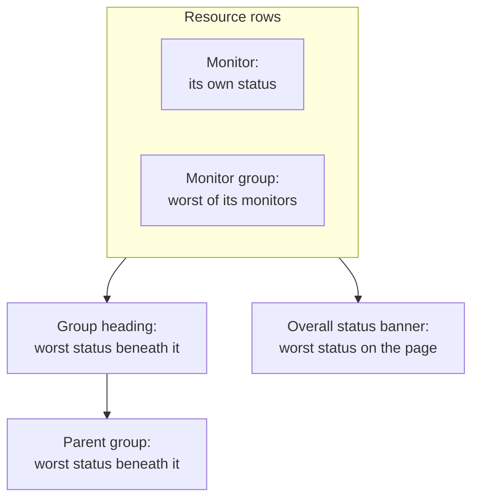

# Status Page Resources & Groups

A resource is one row on your status page: a monitor, or a monitor group, with a name your customers understand, its current status and, if you like, its uptime and history. Groups are sections that hold resources, so a page with forty monitors reads as "API", "Web app" and "Data pipeline" instead of one endless list. You build both on one screen: open a status page and pick **Resources** in its side menu.

:::cards
- [Add a monitor](#add-a-monitor): Put a monitor on the page, with the name visitors read.
- [Groups](#groups): Split the page into sections, and nest them.
- [Monitor rules](#add-monitors-automatically-with-monitor-rules): Let a rule add every matching monitor for you.
- [Import groups from CSV](#importing-groups-from-csv): Build a deep hierarchy in one go.
:::

Visitors judge "is it me or is it them?" from these rows, so name them the way customers talk about your product: **Checkout API**, not `prod-checkout-lb-healthcheck-us-east-1`.

## How a status rolls up the page

Every row shows the current status of its monitor. Every level above it shows the worst status of everything beneath it, where the worst status is the one with the highest priority in your project's monitor statuses.

A resource decides more than the color of its row:

- **Archived monitors are not shown.** A monitor that is archived is no longer checked, so its last status is frozen; the page leaves its row out (and leaves it out of a monitor group's status) rather than show that frozen status as if it were live. The row is kept, so unarchiving the monitor puts it straight back.
- **Resources decide which incidents the page shows.** An incident appears here, and the page's subscribers hear about it, when one of the incident's monitors is a resource on the page, directly or through a monitor group. Put the same monitor on several pages and its incidents reach all of them, unless an incident is limited to some of those pages. See [One Status Page per Audience](/docs/status-pages/one-status-page-per-audience).
- **A monitor group row stands for every monitor in it, for subscribers too.** On a page that lets subscribers choose resources, someone who subscribes to a monitor group hears about incidents, scheduled maintenance events and announcements on any monitor in the group, as if they had picked that monitor. See [Subscribers & Announcements](/docs/status-pages/subscribers#letting-subscribers-choose-resources-and-event-types).

## The Resources screen

The item is labeled **Resources** on projects with monitor groups turned on, and **Monitors** on the others; it is the same screen. Groups used to have a page of their own, and the old `/groups` address now opens this screen.

The screen is split in two:

| Part | What it holds |
| ---- | ------------- |
| **Group navigator** (left) | Every group on the page, as a tree, with a **Search groups...** box above it and a count below it, such as `3 groups · 12 resources`. A long list ends with a **Show N more of M** button. |
| **Top of page** | The first row of the navigator: resources in no group, which visitors see first, above every group. On a page with no groups, the right pane is titled **All resources** instead. |
| **Resource pane** (right) | The selected group's resources. Its header holds **Edit Group**, the primary **Add Monitor** button and a **More actions** menu. |
| Card header | **New Group**, and a three-dot menu with **Import groups from CSV** and **Refresh**. |

**Empty states tell you what to do.** An empty group shows **No monitors here yet** with **Add Monitor**, **Add Multiple** and, only while the page has no groups at all, **Create a Group**. A search that matches nothing shows **No resources match your search**.

## Add a monitor

:::steps
### Pick where the row goes

In the group navigator, select the group the resource belongs in, or **Top of page** for a row in no group.

### Click Add Monitor

The **Add a monitor to {group}** dialog opens. It is one page.

### Pick the monitor

Choose it in **Monitor** (placeholder **Select Monitor**). **Display Name**, the text visitors read, fills in with the monitor's name, and follows when you pick another monitor, until you type a name of your own. It is stored apart from the monitor's own name, so renaming it here changes nothing in monitoring.

### Set the display options, if you want to

**More fields** is folded. It holds **Description** (optional markdown shown under the row, good for a sentence explaining what the service actually does; an image in it is shown to every visitor) and the [display options](#display-options-on-a-resource). Leave it closed and the resource gets their defaults.

### Save the resource

Click **Add Monitor**. The row appears in the group, and on the status page.
:::

In a grid group, the dialog also asks for the row and the column the monitor goes in, above **More fields**; see [List layout vs grid layout](#list-layout-vs-grid-layout).

> [!TIP]
> To show several checks as one row, add a monitor group. With the **Monitor Groups** switch on (**Project Settings** > **Advanced** > **Feature Flags**, which saves as soon as you flip it), a link under the dropdown reads **Add a Monitor Group instead.** Click it and **Monitor** becomes **Monitor Group** (**Select Monitor Group**); **Add a Monitor instead.** switches back.

### Adding several at once

**Add Multiple** (also **Add multiple monitors** in the **More actions** menu) opens **Add Multiple Monitors**. It is one page too: a **Monitors** multi-select, then the same folded **More fields**, whose display options apply to every monitor you pick. Each resource takes its display name and description from its monitor, and **Add Monitors** adds them all. This is the fastest way to seed a new page.

The multi-select has a **Labels** tab: click a label and every monitor carrying it is selected at once.

### Adding by label twice is safe

A status page lists a monitor once. Adding is idempotent, so picking the same label again after labelling a few new monitors adds only the new ones — the monitors already on the page are left exactly as they are, with whatever display name and options you gave them.

The summary at the end of the bulk add says so: added monitors are listed under **Added**, and the ones that were already there under **Already Added**. Nothing is reported as a failure, and nothing is written for them.

The same rule holds everywhere else a resource is created. Adding a monitor that is already on the page from the single-add form, or pointing an existing resource at one from the edit form, is refused with *"This monitor is already added to this status page"* — including when the existing resource already sits in a different group, because a visitor would still see the monitor twice. To show a monitor in a different group, delete the resource it already has and add it where you want it.

## Display options on a resource

The **More fields** section is the same on the single-add form and the bulk modal. It starts folded on both, and on **Edit resource** too, where its folded header shows what in it is not at its default. Everything here is per resource: two rows in the same group can be set up differently.

| Field | Default | What it does |
| ----- | ------- | ------------ |
| **Tooltip** (`displayTooltip`) | Empty | Shown as a tooltip beside the resource on your status page. Use it for scope: "US and EU customers". |
| **Show Current Resource Status** (`showCurrentStatus`) | On | Shows the live status, such as operational, degraded or offline, beside the row. |
| **Show Uptime %** (`showUptimePercent`) | Off | Shows an uptime percentage beside the resource. |
| **Select Uptime Precision** (`uptimePercentPrecision`) | One decimal | Appears once **Show Uptime %** is on, and is required then. |
| **Show Status History Chart** (`showStatusHistoryChart`) | On | Shows the day-by-day uptime history bars for the resource. |

**Display Name** (`displayName`) and **Description** (`displayDescription`) are display-only too: they never change the monitor itself.

## Uptime percentages and history charts

**Show Uptime %** and **Show Status History Chart** both read one page-wide setting: how many days they cover. That is **Uptime History** in the **What your status page shows** card on **Status Pages → your page → Advanced → Advanced Settings**. It accepts 1 to 90 days and defaults to 90. So turn the switches on per resource, then set the window once for the whole page.

**Precision is a judgment call.** **Select Uptime Precision** offers `99% (No Decimal)`, `99.9% (One Decimal)`, `99.99% (Two Decimal)` and `99.999% (Three Decimal)`. More decimals look precise and invite arguments about the third one; if you publish an SLA at three nines, match it and no more.

Groups have their own copies of these switches (see below), so a group can show a rolled-up percentage while the monitors inside it stay quiet, or the other way round.

The colors of the history chart bars are set under **More settings** on the **Branding** page, and which monitor statuses count as "down" in **Counts as downtime**, in the **What your status page shows** card on **Advanced Settings**, both covered in [Status Page Branding & Domains](/docs/status-pages/branding-and-domains).

## Groups

Most groups need only a name.

:::steps
### Click New Group

**Create New Status Page Group** opens: two fields, then two folded sections.

### Name the group

Type the **Group Name**: the section heading visitors see.

### Nest it, if it belongs inside another group

Pick a **Parent Group**, or leave it at **No parent group (top level)**. **Add a sub group** in a group's menus fills this in for you.

### Create the group

Click **Create Status Page Group**. The group appears in the navigator, ready for monitors.
:::

The two fields are **Group Name** (`name`) and **Parent Group** (`parentStatusPageGroupId`). The two folded sections hold everything else:

- **Layout** — its folded header says **List** or **Grid**. It holds **View Mode** and a grid's axes (see [List layout vs grid layout](#list-layout-vs-grid-layout)), and it opens by itself on a grid group.
- **More fields** — the group-level copies of the resource options:
  - **Group Description** (`description`) — optional markdown, shown under the heading. An image in it is shown to every visitor.
  - **Expand on Status Page by Default** (`isExpandedByDefault`) — on by default: whether the section starts open or collapsed for visitors.
  - **Show Current Group Status** (`showCurrentStatus`) — on by default. Shows a status beside the group heading.
  - **Show Uptime %** (`showUptimePercent`) — off by default, with **Select Uptime Precision** once it is on.

To change a group, use **Edit Group** in the pane header, or **Edit group** in the navigator's row menu: **Edit Status Page Group** opens, with a **Save Changes** button. The pane header shows chips for the settings that are on — **Grid**, **Collapsed by default**, **Uptime %** — so you can see how a group is set up without opening the form.

### Managing a group

| Where | Actions |
| ----- | ------- |
| The navigator's row menu | **Edit group**, **Move up**, **Move down**, **Show ID**, **Delete group** |
| The pane's **More actions** menu | **Edit this group**, **Add a sub group**, **Move group up**, **Move group down**, **Show group ID**, **Refresh**, **Delete this group** |

A group saved without a name shows as **Untitled group**, which is a good sign you meant to type something.

## Nesting groups

Groups nest: set **Parent Group** on the child, or use **Add a sub group inside this group** in the navigator. The form's help text describes the shape it is built for — something like Corporate Units › Region › Market — and every level shows the rolled-up status and uptime of everything beneath it.

When a group has children, the resource pane shows a **Sub groups** chip row that links straight to each child, so you can walk the hierarchy without going back to the navigator.

Nesting earns its keep on large pages: a hosting provider with regions inside products, or a retailer with markets inside business units. On a page with twelve monitors, one flat level is friendlier.

## List layout vs grid layout

The **Layout** section of the group form sets the group's **View Mode** (`viewMode`), which changes how the group shows on the status page.

| If you want to… | Pick |
| --------------- | ---- |
| Show a plain vertical list of services, one per row | **List** (the default) |
| Show the same service across several regions or tenants as a matrix | **Grid** |

Choose **Grid** and four more fields appear:

| Field | What to enter |
| ----- | ------------- |
| **Row Axis Label** | The name of the row dimension, placeholder `Service`. |
| **Row Axis Values** | The rows, added one at a time with **Add Row** (placeholder `e.g. Auth`). |
| **Column Axis Label** | The column dimension, placeholder `Region`. |
| **Column Axis Values** | The columns, added with **Add Column** (placeholder `e.g. US-East`). |

Each monitor in a grid group sits in a cell, so **Add Monitor** and the bulk modal ask for the row and the column alongside the monitor, using your own axis labels.

> [!IMPORTANT]
> Set up the axes before you add monitors. A grid group with no rows or columns shows a notice that there is nowhere to put a monitor yet, with a **Set up the grid** button that opens the group's form on its **Layout** section, and its **Add Monitor** button is withdrawn until you do.

## Ordering what visitors see

Order is yours to set, not alphabetical:

| What | How to reorder it |
| ---- | ----------------- |
| Resources inside a group | Drag a row. The pane says so: **Drag a row to change the order visitors see**. |
| Groups relative to each other | **Move up** / **Move down** in the navigator's row menu, or **Move group up** / **Move group down** in **More actions**. |
| Resources in no group | They are in **Top of page** and always show above every group, so put the one thing everyone checks first there. |

**Two cases where dragging is off.** Searching with the **Search in {group}...** box turns reordering off — the pane says `N of M shown · drag to reorder is off while filtering` — so clear the search first. And grid groups never reorder by dragging, because a monitor's place comes from its row and column.

Put your most-asked-about service at the top. Visitors who come to the page during an outage usually stop reading after the first screen.

## Add monitors automatically with monitor rules

A monitor rule adds monitors to the page for you: describe the monitors once, and every monitor that matches lands in the group you chose. Rules are under **Resources → Monitor Rules**, beside the Resources screen.

:::steps
### Open Monitor Rules

Open the status page, pick **Monitor Rules** in the **Resources** section of its side menu, and click **Create Status Page Monitor Rule**.

### Name the rule

On **Basic Info**, enter a **Name**. **Enabled** is on by default.

### Say which monitors it matches

On **Match Criteria**, fill in at least one of **Monitor Labels** (a monitor carrying any one of them matches), **Monitor Name** and **Monitor Description**. A monitor has to pass every criterion you fill in. The two patterns take a case-insensitive regular expression (`^api-.*`) or a `*` wildcard (`*checkout*`); `.*` matches every monitor.

### Pick the group

On **Group**, choose **Add Monitors To Group**, or leave it empty to add the monitors in no group. The same display options as a resource follow; on a rule, **Show Uptime %** starts on.

### Save the rule

The rule runs at once against every monitor that already exists, and the list shows the group it adds monitors to under **Adds Monitors To**.
:::

After that, a rule runs again for a monitor whenever one is created or its labels, name or description change. A rule removes only the resources it added: turning it off or deleting it takes those off the page, and a monitor you added by hand is never touched. A monitor already on the page is never added twice.

## Importing groups from CSV

Building a deep hierarchy by hand is tedious. **Import groups from CSV**, in the card header's three-dot menu, opens the **Import Groups from CSV** modal.

:::steps
### Download the template

Click **Download CSV Template** to get `status-page-groups-template.csv`.

### Fill it in

One row per group. Only `name` is required; the columns are listed below.

### Upload and preview

Click **Choose CSV File**, pick your file, then **Preview Import** to check what will be created before anything is written.

### Import

Run the import. An **Import results** table lists every row as **Created**, **Failed** or **Skipped**, with the reason, so a bad row never vanishes silently.
:::

| Column | What it sets |
| ------ | ------------ |
| `name` | The group name. Required. |
| `parentName` | The name of the group this one nests inside. |
| `description` | The group description. |
| `isExpandedByDefault` | Whether the section starts open for visitors. |
| `showCurrentStatus` | Whether a status shows beside the group heading. |
| `showUptimePercent` | Whether an uptime percentage shows beside the group. |
| `uptimePercentPrecision` | How many decimal places that percentage uses. |
| `viewMode` | `List` or `Grid`. |
| `rowAxisLabel` | The row dimension's name, for a grid group. |
| `rowAxisValues` | The row values, for a grid group. |
| `columnAxisLabel` | The column dimension's name, for a grid group. |
| `columnAxisValues` | The column values, for a grid group. |

The import creates groups, not resources: add monitors afterwards with **Add Monitor**, **Add Multiple** or a monitor rule.

## Troubleshooting

:::details "This monitor is already added to this status page"
A page lists each monitor once, even across groups. The monitor already has a resource, perhaps in another group or added by a monitor rule. Search the navigator for it, delete that resource, and add the monitor where you want it.
:::

:::details A monitor I added does not show on the status page
Check whether the monitor is archived: an archived monitor's row is left out until you unarchive it. Also check the group: a group set to start collapsed (**Expand on Status Page by Default** off) hides its rows until a visitor opens it.
:::

:::details There is no Add Monitor button in a grid group
The grid has no rows or columns yet. Click **Set up the grid**, add the axis values on the **Layout** section, and **Add Monitor** comes back.
:::

:::details I cannot drag rows
Clear the **Search in {group}...** box: reordering is off while the pane is filtered. Grid groups never reorder by dragging.
:::

## Next steps

:::cards
- [Status Page Branding & Domains](/docs/status-pages/branding-and-domains): Logo, favicon, history chart colors, and your own domain.
- [Subscribers & Announcements](/docs/status-pages/subscribers): Who gets told when these resources change.
- [One Status Page per Audience](/docs/status-pages/one-status-page-per-audience): The same monitor on many pages, and an incident that reaches only some of them.
- [Public API](/docs/status-pages/public-api): Read resources, groups and uptime as JSON.
:::
