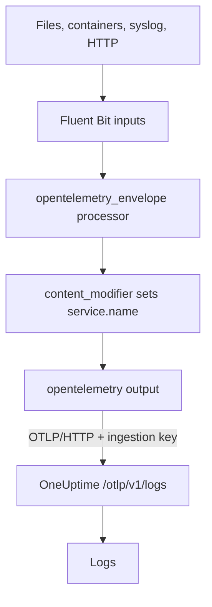

# Fluent Bit

[Fluent Bit](https://docs.fluentbit.io/manual) is a lightweight agent that collects logs from files, systemd, containers, syslog, HTTP and many other sources. Its [OpenTelemetry output](https://docs.fluentbit.io/manual/pipeline/outputs/opentelemetry) sends what it collects to OneUptime's OpenTelemetry (OTLP) endpoint, where the logs become searchable under **Products → Logs**.

:::cards
- [Configure Fluent Bit](#configure-fluent-bit): Add the OpenTelemetry output and name your service.
- [Complete example](#complete-example): A whole configuration file to start from.
- [Self-hosted OneUptime](#self-hosted-oneuptime): Point Fluent Bit at your own instance.
:::

## How it works



Fluent Bit wraps each record in an OpenTelemetry envelope, so it can carry resource attributes such as `service.name`. The OpenTelemetry output then posts the records to OneUptime with your ingestion key in the `x-oneuptime-token` header. OneUptime files them under the service named by `service.name`, and creates that service the first time it sends.

## Before you begin

- **Install Fluent Bit** — see the [installation guide](https://docs.fluentbit.io/manual/installation/getting-started-with-fluent-bit). The configuration on this page uses Fluent Bit's YAML format and the `opentelemetry_envelope` processor, so use a current release.
- **A OneUptime project.** On OneUptime Cloud, telemetry is billed per GB ingested — see [pricing](https://oneuptime.com/pricing) — and a project on the Free plan needs a payment method before it can send telemetry.
- **A telemetry ingestion key.** If you do not have one:

:::steps
### Open the ingestion keys

Go to **Products → Project Settings**, open **Telemetry & APM** in the side menu and select **Ingestion Keys**.


### Create a key

Click **Create Ingestion Key**. The dialog has the key's name filled in and **Server** picked — the kind of key an application or a collector sends with — so click **Create Ingestion Key** to create it, or rename it first.

### Copy the secret

The new key opens on its own page. Copy its **Secret Key**: this is the `YOUR_TELEMETRY_INGESTION_TOKEN` in the configuration below.


:::

## Configure Fluent Bit

Fluent Bit reads its YAML configuration from a file such as `/etc/fluent-bit/fluent-bit.yaml`.

:::steps
### Add the OpenTelemetry output

Add an `opentelemetry` output that sends to OneUptime. Keep the `stdout` output while you test if you want to see the records locally:

```yaml title="fluent-bit.yaml"
pipeline:
  outputs:
    - name: stdout
      match: "*"
    - name: opentelemetry
      match: "*"
      host: "oneuptime.com"
      port: 443
      metrics_uri: "/otlp/v1/metrics"
      logs_uri: "/otlp/v1/logs"
      traces_uri: "/otlp/v1/traces"
      tls: On
      header:
        - x-oneuptime-token YOUR_TELEMETRY_INGESTION_TOKEN
```

### Wrap logs in an OpenTelemetry envelope and name the service

Add the `opentelemetry_envelope` processor to each input, followed by a `content_modifier` that sets `service.name`. Replace `YOUR_SERVICE_NAME` with the name the logs should appear under in OneUptime:

```yaml title="fluent-bit.yaml"
pipeline:
  inputs:
    - name: tail # or any other input
      path: /var/log/my-app/*.log

      processors:
        logs:
          - name: opentelemetry_envelope

          - name: content_modifier
            context: otel_resource_attributes
            action: upsert
            key: service.name
            value: YOUR_SERVICE_NAME
```

### Restart Fluent Bit

Restart the Fluent Bit service, or start it with `fluent-bit -c /etc/fluent-bit/fluent-bit.yaml`. Within a few seconds the logs appear under **Products → Logs**, and the service is listed under **Products → Services**.
:::

## Complete example

This configuration receives logs over HTTP on port `8888` and forwards them to OneUptime:

```yaml title="fluent-bit.yaml"
service:
  flush: 1
  log_level: info

pipeline:
  inputs:
    - name: http
      listen: 0.0.0.0
      port: 8888

      processors:
        logs:
          - name: opentelemetry_envelope

          - name: content_modifier
            context: otel_resource_attributes
            action: upsert
            key: service.name
            value: YOUR_SERVICE_NAME

  outputs:
    - name: stdout
      match: "*"
    - name: opentelemetry
      match: "*"
      host: "oneuptime.com"
      port: 443
      metrics_uri: "/otlp/v1/metrics"
      logs_uri: "/otlp/v1/logs"
      traces_uri: "/otlp/v1/traces"
      tls: On
      header:
        - x-oneuptime-token YOUR_TELEMETRY_INGESTION_TOKEN
```

Replace the `http` input with the inputs you need — for example `tail` for log files or `systemd` for the journal — and keep the two processors on each of them.

## Self-hosted OneUptime

Set `host` to the host of your OneUptime instance. If it is served over plain HTTP rather than HTTPS, also set `port` to the port it listens on (usually `80`) and remove `tls`:

```yaml title="fluent-bit.yaml"
pipeline:
  outputs:
    - name: stdout
      match: "*"
    - name: opentelemetry
      match: "*"
      host: "your-oneuptime-instance.com"
      port: 80
      metrics_uri: "/otlp/v1/metrics"
      logs_uri: "/otlp/v1/logs"
      traces_uri: "/otlp/v1/traces"
      header:
        - x-oneuptime-token YOUR_TELEMETRY_INGESTION_TOKEN
```

## Troubleshooting

:::details Fluent Bit logs `401` from the OpenTelemetry output
The ingestion key is missing, unknown or expired. Check the `header` line: it is `x-oneuptime-token`, a space, then the key's **Secret Key**.
:::

:::details Fluent Bit logs `402` or `422`
`402`: on OneUptime Cloud, the project is on the Free plan and has no payment method. Add one under **Project Settings → Billing and Invoices → Billing**. `422`: the key is disabled, or it is a Browser key. Turn **Enabled** back on in the key's settings, or create a **Server** key.
:::

:::details Logs arrive under an unexpected service
The service comes from `service.name`. Check that every input has the `opentelemetry_envelope` processor followed by the `content_modifier` that sets it.
:::

:::details Nothing arrives, and Fluent Bit logs connection errors
Check that `tls: On` and `port: 443` are set for an HTTPS endpoint, and that the host running Fluent Bit can reach your OneUptime host on that port.
:::

If you have any questions or need help with the configuration, please reach out to us at support@oneuptime.com.

## Next steps

:::cards
- [Log Pipelines](/docs/telemetry/log-pipelines): Parse and enrich the logs Fluent Bit sends.
- [Search Syntax](/docs/telemetry/search-syntax): Find the logs in the Logs explorer.
- [OpenTelemetry](/docs/telemetry/open-telemetry): Endpoints, keys and limits for all telemetry.
- [Fluentd](/docs/telemetry/fluentd): Use Fluentd instead.
:::
