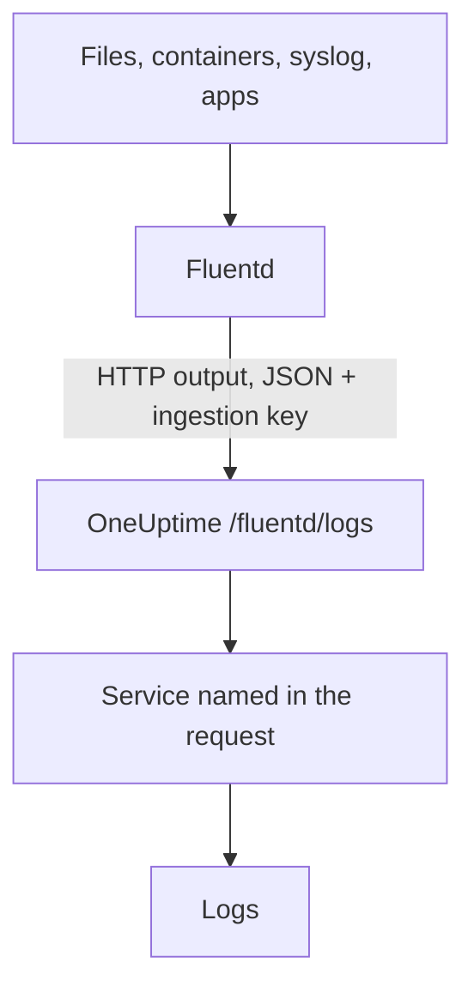

# Send Logs with Fluentd

[Fluentd](https://www.fluentd.org/) collects logs from files, containers, syslog, applications and [many other sources](https://www.fluentd.org/datasources). Its built-in [HTTP output](https://docs.fluentd.org/output/http) sends them to OneUptime's Fluentd endpoint, where they become searchable under **Products → Logs**.

:::cards
- [Configure Fluentd](#configure-fluentd): Add an HTTP output that points at OneUptime.
- [How records are read](#how-records-are-read): Which fields become the message, the severity and attributes.
- [Self-hosted OneUptime](#self-hosted-oneuptime): Point Fluentd at your own instance.
:::

## How it works



Fluentd posts batches of records as JSON, with your ingestion key in the `x-oneuptime-token` header and the service name in `x-oneuptime-service-name`. OneUptime turns each record into a log of that service, and creates the service the first time it sends.

## Before you begin

- **Install Fluentd** — see the [installation guide](https://docs.fluentd.org/installation).
- **A OneUptime project.** On OneUptime Cloud, telemetry is billed per GB ingested — see [pricing](https://oneuptime.com/pricing). If you need help, reach out to support@oneuptime.com.
- **A telemetry ingestion key.** If you do not have one:

:::steps
### Open the ingestion keys

Go to **Products → Project Settings**, open **Telemetry & APM** in the side menu and select **Ingestion Keys**.


### Create a key

Click **Create Ingestion Key**. The dialog has the key's name filled in and **Server** picked — the kind of key an application or a collector sends with — so click **Create Ingestion Key** to create it, or rename it first.

### Copy the secret

The new key opens on its own page. Copy its **Secret Key**: this is the `YOUR_SERVICE_TOKEN` in the configuration below.


:::

## Configure Fluentd

Fluentd's configuration file is usually `/etc/fluent/fluentd.conf`, or `/etc/td-agent/td-agent.conf` for the older td-agent package.

:::steps
### Add an HTTP output

Add a `<match>` section that sends records to OneUptime. Replace `YOUR_SERVICE_TOKEN` with your ingestion key, and `YOUR_SERVICE_NAME` with the name the logs should appear under — any name you like:

```text title="fluentd.conf"
# Match all patterns
<match **>
  @type http

  endpoint https://oneuptime.com/fluentd/logs
  open_timeout 2

  headers {"x-oneuptime-token":"YOUR_SERVICE_TOKEN", "x-oneuptime-service-name":"YOUR_SERVICE_NAME"}

  content_type application/json
  json_array true

  <format>
    @type json
  </format>
  <buffer>
    flush_interval 10s
  </buffer>
</match>
```

`json_array true` sends each buffer flush as one JSON array, and `flush_interval 10s` sends a batch every 10 seconds.

### Restart Fluentd

Restart the Fluentd service so it loads the new output.

### Check that logs arrive

Within a few seconds of the next flush, the logs appear under **Products → Logs**. The service is listed under **Products → Services** — if it did not exist yet, OneUptime creates it.
:::

## Complete example

This configuration receives records over Fluentd's forward protocol on port `24224` and sends them all to OneUptime:

```text title="fluentd.conf"
####
## Source descriptions:
##

## built-in TCP input
## @see https://docs.fluentd.org/input/forward
<source>
  @type forward
  port 24224
  bind 0.0.0.0
</source>

<match **>
  @type http

  endpoint https://oneuptime.com/fluentd/logs
  open_timeout 2

  headers {"x-oneuptime-token":"YOUR_SERVICE_TOKEN", "x-oneuptime-service-name":"YOUR_SERVICE_NAME"}

  content_type application/json
  json_array true

  <format>
    @type json
  </format>
  <buffer>
    flush_interval 10s
  </buffer>
</match>
```

To send different sources as different services, use one `<match>` section per tag, each with its own `x-oneuptime-service-name`.

## How records are read

OneUptime reads these fields from each record. Every other field becomes a log attribute you can search and filter on.

| Log field | Read from the record's first field of | Notes |
| --- | --- | --- |
| Body | `message`, `log`, `msg`, `body`, `text` | The log line. |
| Severity | `level`, `severity`, `loglevel`, `log_level`, `priority`, `severityText`, `severity_text` | Names such as `trace`, `debug`, `info`, `notice`, `warn`, `error`, `critical` and `fatal`, in any case. Any other value is stored as Unspecified. |
| Trace ID | `trace_id`, `traceId`, `traceid` | Links the log to its trace. |
| Span ID | `span_id`, `spanId`, `spanid` | Links the log to its span. |
| Service | the `x-oneuptime-service-name` header | `Fluentd` when the header is not set. |

Fluentd logs go through your [log pipelines](/docs/telemetry/log-pipelines), drop filters and scrub rules like any other log.

## Self-hosted OneUptime

Replace `https://oneuptime.com` in `endpoint` with the URL of your OneUptime instance: `http(s)://YOUR_ONEUPTIME_HOST/fluentd/logs`.

## Troubleshooting

:::details Fluentd logs `401` from the HTTP output
The ingestion key is missing, unknown or expired. Check the `x-oneuptime-token` value in `headers`.
:::

:::details Logs arrive under the `Fluentd` service
The `x-oneuptime-service-name` header is missing. Add it to `headers` in each `<match>` section.
:::

:::details The log body is empty, or the whole record shows as attributes
OneUptime takes the body from the first of `message`, `log`, `msg`, `body` or `text` that the record has. Rename the field that holds your log line to one of these, for example with Fluentd's `record_transformer` filter.
:::

If you have any questions or need help with the configuration, please reach out to us at support@oneuptime.com.

## Next steps

:::cards
- [Log Pipelines](/docs/telemetry/log-pipelines): Parse and enrich the logs Fluentd sends.
- [Search Syntax](/docs/telemetry/search-syntax): Find the logs in the Logs explorer.
- [Fluent Bit](/docs/telemetry/fluentbit): A lighter-weight agent that sends over OpenTelemetry.
- [Logs Monitor](/docs/monitor/logs-monitor): Alert when matching logs appear.
:::
