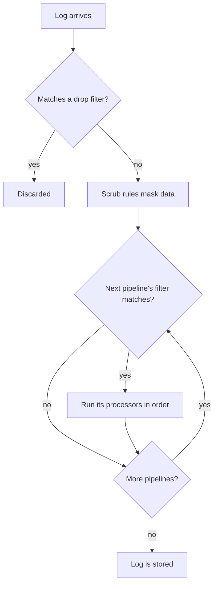

# Log Pipelines

Log pipelines transform logs as OneUptime ingests them, before they are stored. A pipeline has a **filter** that decides which logs it applies to and an ordered list of **processors** that each change those logs: pull fields out of the message, fix the severity, rename an attribute, or tag the log with a category.

Pipelines live under **Logs → Settings → Pipelines**.

:::cards
- [How a pipeline runs](#how-a-pipeline-runs): Where pipelines sit in ingest, and in what order they run.
- [Create a pipeline](#create-a-pipeline): Match some logs and add processors to them.
- [Key=Value Parser](#keyvalue-parser): Turn firewall and logfmt lines into attributes.
- [Example: Sophos XGS firewall](#example-sophos-xgs-firewall): Parse firewall syslog end to end.
:::

## How a Pipeline Runs

Pipelines run on every log OneUptime ingests — OpenTelemetry logs, syslog and Fluentd alike — after drop filters and scrub rules, and before the log is stored:



- **Pipelines run in order** — the order of the list, which you change by dragging rows. A pipeline only touches the logs its filter matches, and every pipeline whose filter matches runs, not just the first.
- **Processors run in order too**, and each one sees what the previous one produced, so a parser has to come before a processor that reads the fields it extracts. A later pipeline's filter also sees what earlier pipelines changed.
- **Processing happens at ingest.** Changing a pipeline affects the logs that arrive afterwards, within about a minute; logs already stored are not reprocessed.
- **A processor never drops or blanks a log.** A line a parser cannot read passes through unchanged. To discard logs, use **Logs → Settings → Drop Filters**.
- **Only enabled pipelines and processors run.** Turn one off on its page to pause it without losing its setup.

## Processor Types

| Processor          | What it does                                                                                     |
| ------------------ | ------------------------------------------------------------------------------------------------ |
| Grok Parser        | Pulls fields out of a line with a fixed shape (an nginx access line) using a named pattern.      |
| Key=Value Parser   | Splits a line of `key=value` pairs (Sophos XGS, Fortinet, logfmt) into attributes, in any order. |
| Severity Remapper  | Maps a raw level such as `warn` from an attribute onto the log's standard severity.              |
| Attribute Remapper | Renames or copies an attribute, for example `src_ip` to `source_ip`.                             |
| Category Processor | Tags a log with a category name when it matches a filter, for example "Payment Error".           |

## Before you begin

- Logs arriving in OneUptime — over [OpenTelemetry](/docs/telemetry/open-telemetry), [syslog](/docs/telemetry/syslog), [Fluentd](/docs/telemetry/fluentd) or a probe.
- Permission to change pipelines. Project owners and admins have it; anyone else needs the **Create Log Pipeline** and **Create Log Pipeline Processor** permissions.

## Create a pipeline

:::steps
### Create the pipeline

Go to **Logs → Settings → Pipelines** and click **Create Log Pipeline**. Give it a **Name**, such as *Parse firewall logs*, and create it. The pipeline's page opens.

### Choose which logs it applies to

Under **Filter Conditions**, click **Edit** and add conditions on **Severity**, **Log Body**, **Service ID** or a custom attribute. Join them with **All conditions** or **Any condition**, then click **Save Changes**. A pipeline with no conditions applies to every log.

### Add processors

Under **Processors**, click **Add Processor**, enter a **Processor Name**, pick a **Processor Type** and fill in its settings. The Grok and Key=Value parsers have a tester: paste a sample line to see what they would extract. Click **Create Processor**.

### Put them in order

Drag processors to change the order they run in, and drag pipelines on the **Pipelines** list the same way. New logs are processed within about a minute.
:::

### Filter conditions

Each condition compares a field with a value. Behind the builder, the filter is a query such as `severityText = 'Error' AND body LIKE 'timeout'`, which **Preview query** shows.

| Operator | In the query | Notes |
| --- | --- | --- |
| equals | `=` | Exact and case-sensitive. |
| does not equal | `!=` | Exact and case-sensitive. |
| contains | `LIKE` | Ignores case. `%` in the value is a wildcard. |
| is one of | `IN` | A comma-separated list of exact values. |

Severity values are `Fatal`, `Error`, `Warning`, `Information`, `Debug`, `Trace` and `Unspecified` — so `severityText = 'Error'` matches and `'ERROR'` never will. A custom attribute is written `attributes.<key>`, for example `attributes.networkDevice.name = 'hq-firewall'`.

## Key=Value Parser

Firewalls and other network appliances log every event as one line of `key=value` pairs. Which fields a line has, and in what order, depends on the event, so a single grok pattern cannot describe them. The Key=Value Parser does not need one: it walks the line and turns every pair it finds into a log attribute, whatever the order. Once they are attributes you can search and filter on them, use them in a [log monitor](/docs/monitor/logs-monitor), and alert once per tunnel, interface or user with [Group By](/docs/monitor/logs-monitor#per-group-alerting-group-by).

### Configuration

| Setting              | Default        | Description                                                                                                                                                                                                  |
| -------------------- | -------------- | ------------------------------------------------------------------------------------------------------------------------------------------------------------------------------------------------------------ |
| Source Field         | `body`         | The field to parse: `body` for the log message, or an attribute such as `attributes.raw_line`.                                                                                                               |
| Target Prefix        | none           | A namespace for the extracted keys. `sophos` stores `con_name` as `sophos.con_name`. A separator is added unless the prefix already ends in `.`, `_`, `-` or `:`.                                            |
| Pair Delimiter       | any whitespace | What separates one pair from the next. Leave it blank for Sophos, Fortinet and logfmt; set `,`, `;` or `\|` for other formats.                                                                               |
| Key-Value Delimiter  | `=`            | What separates a key from its value, for example `:` for `status:up`.                                                                                                                                        |
| Override on Conflict | off            | Whether a key may replace an attribute the log already has. Off by default: the keys come from the line itself, so a line could otherwise rewrite attributes set at ingest, such as the device it came from. |

The two delimiters must be different, must not contain one another, and cannot contain quotes or backslashes; each is at most 8 characters long. The processor form checks this before saving, and its tester, **Test With a Sample Line**, shows the exact attributes a sample line would produce.

### Parsing Rules

- **Quoted values** keep their spaces and delimiters: `message="IPSec Connection HQ-Branch1 terminated"` is one value. Double and single quotes both work, and `\"` inside a value is a literal quote. A quote that is never closed - a line cut off by a syslog size limit - runs to the end of the line.
- **Unquoted values** run to the next pair delimiter, so `url=https://example.com/?a=b` keeps its `=`.
- **Empty values** (`key=` and `key=""`) are stored as empty strings.
- **Values are always text.** `latency=11` is stored as `"11"`, the same as an untyped grok capture.
- **Keys** start with a letter or underscore and contain letters, digits and `. _ - @`. Text before the first pair, such as an RFC 3164 syslog header, and stray words without a delimiter are skipped. A syslog priority glued to the first key (`<30>device_name="SFW"`) is dropped and the key kept.
- **A repeated key keeps its first value**; later ones are ignored.
- **Limits:** a line longer than 32 KiB is not parsed, at most 100 pairs are taken from one line, keys longer than 256 characters are skipped, and values longer than 4,096 characters are truncated.

### Example: Sophos XGS Firewall

When a Sophos XGS firewall sends syslog to a [probe](/docs/monitor/network-device-monitor), each message is stored as a log of the network device, with the syslog message as its body. To parse it:

:::steps
#### Create a pipeline for the firewall

Go to **Logs → Settings → Pipelines** and create a pipeline. Give it a filter that matches the firewall's logs, for example the custom attribute `networkDevice.name` equals `hq-firewall` (`attributes.networkDevice.name = 'hq-firewall'`), or **Log Body** contains `log_component=` to match every Sophos line.

#### Add the parser

Open the pipeline and click **Add Processor**. Choose **Key=Value Parser**, keep **Source Field** as `body`, and set **Target Prefix** to `sophos` (optional, but it keeps the firewall's fields together).

#### Test it and save

Paste a line from the firewall into **Test With a Sample Line** to check the result, then click **Create Processor**.
:::

A Sophos IPsec event:

```text
device_name="SFW" timestamp="2024-05-02T11:03:12+0200" device_model="XGS2100" device_serial_id="X1234" log_id="010101600001" log_type="Event" log_component="IPSec" log_subtype="System" severity="Information" con_name="HQ-Branch1" src_ip="10.171.4.117" dst_ip="10.171.4.118" status="Terminated" message="IPSec Connection HQ-Branch1 between 10.171.4.117 and 10.171.4.118 for Child HQ-Branch1 terminated."
```

becomes these attributes (among others):

| Attribute              | Value                                                                                                |
| ---------------------- | ---------------------------------------------------------------------------------------------------- |
| `sophos.log_component` | `IPSec`                                                                                              |
| `sophos.con_name`      | `HQ-Branch1`                                                                                         |
| `sophos.status`        | `Terminated`                                                                                         |
| `sophos.src_ip`        | `10.171.4.117`                                                                                       |
| `sophos.message`       | `IPSec Connection HQ-Branch1 between 10.171.4.117 and 10.171.4.118 for Child HQ-Branch1 terminated.` |

An SD-WAN SLA line has a different set of fields in a different order, and the same processor handles it:

```text
log_id=158825619025 log_type="SD-WAN" log_component="SLA" profile_name="Branch-Internet" gw_name="WAN2" latency=11 jitter=2 packet_loss=0 gw_status="up" sla_status="SLA met"
```

gives `sophos.gw_name = WAN2`, `sophos.latency = 11`, `sophos.packet_loss = 0`, `sophos.gw_status = up` and `sophos.sla_status = SLA met`. Older SFOS releases log a legacy format (`device="SFW" date=2017-01-31 time=18:02:03 timezone="IST" ... connectionname="Tunnel A"`); it parses the same way, with the tunnel name in `connectionname` instead of `con_name`.

To turn those SLA lines into latency, jitter and packet-loss metrics per gateway, see the [Log Recording Rules](/docs/telemetry/log-recording-rules) example.

### Example: Fortinet FortiGate

FortiGate logs use the same style:

```text
date=2024-01-01 time=10:00:00 devname="FG100" logid="0100032001" type="event" subtype="vpn" level="notice" action="tunnel-down" vpntunnel="HQ-to-Branch2" msg="IPsec tunnel down"
```

With the default settings and a `fortigate` prefix this gives `fortigate.devname = FG100`, `fortigate.subtype = vpn`, `fortigate.action = tunnel-down`, `fortigate.vpntunnel = HQ-to-Branch2` and `fortigate.time = 10:00:00` - the colons in a time value are part of the value, not a delimiter.

### Alert Once per Tunnel

With the fields parsed, a [Logs monitor](/docs/monitor/logs-monitor) can count the failures and raise a separate alert for each tunnel: filter on `sophos.log_component` = `IPSec` with the body containing `terminated`, and group by `sophos.con_name`. See [Per-group alerting](/docs/monitor/logs-monitor#per-group-alerting-group-by).

## Grok Parser

Pulls structured fields out of a line with a fixed shape. A grok pattern is a regular expression with named references: `%{IPV4:client_ip}` means "match an IPv4 address and store it as `client_ip`". The pattern does not have to match the whole line, and a line that does not match is left unchanged.

| Setting | Default | Description |
| --- | --- | --- |
| **Source Field** | `body` | The field to parse, like the Key=Value Parser's. |
| **Target Prefix** | none | A namespace for the extracted fields, added the same way. |
| **Grok Pattern** | — | The pattern. The form lists the available named patterns. |

A capture is stored as text unless you give it a type: `%{NUMBER:status:int}` stores it as a number. The types are `int`, `long`, `float`, `double`, `boolean` and `string`. Check a pattern against a sample line in **Test Your Pattern** before you save it.

| Log body                     | Pattern                                                                    | Attributes added                |
| ---------------------------- | -------------------------------------------------------------------------- | ------------------------------- |
| `10.0.1.5 - GET /health 200` | `%{IPV4:client_ip} - %{WORD:method} %{NOTSPACE:path} %{NUMBER:status:int}` | client_ip, method, path, status |

Use the Key=Value Parser instead when the line is made of `key=value` pairs whose order changes.

## Severity Remapper

Reads a raw value from an attribute and maps it to a standard severity. Set **Source Attribute** to the attribute that holds the level (`level` by default), then add **Mappings**: each pairs a value your application emits, such as `warn`, with a severity, such as Warning. Matching ignores case. A value with no mapping leaves the log's severity as it was.

## Attribute Remapper

Moves the value of one attribute (**Source Key**) to another (**Target Key**), for example `src_ip` to `source_ip`.

| Setting | Default | Effect |
| --- | --- | --- |
| **Preserve Source** | off | Off renames the attribute: the source key is removed. On copies it and keeps the source key. |
| **Override on Conflict** | on | On replaces the target when it already exists. Off leaves the target alone and skips the remap. |

## Category Processor

Evaluates a list of rules in order and stores the name of the first rule whose filter matches under a target attribute, so you can search for every "Payment Error" log at once. Set **Target Attribute** (`category` by default), then add **Category Rules**: a **Category name** and the conditions under **When logs match**. The first matching rule wins; a log that matches none is left unchanged.

## Next steps

:::cards
- [Logs Monitor](/docs/monitor/logs-monitor): Alert on the attributes your pipelines extract.
- [Log Recording Rules](/docs/telemetry/log-recording-rules): Turn parsed log fields into metrics.
- [Syslog](/docs/telemetry/syslog): Send firewall and server syslog to OneUptime.
- [Search Syntax](/docs/telemetry/search-syntax): Search on the new attributes in the Logs explorer.
:::
