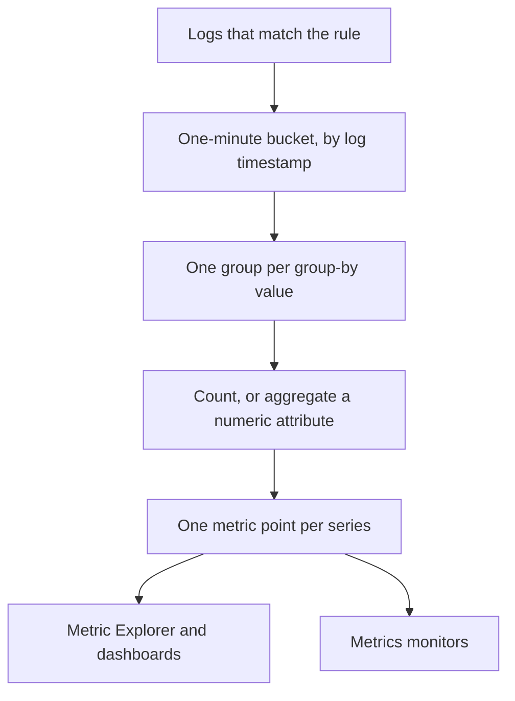
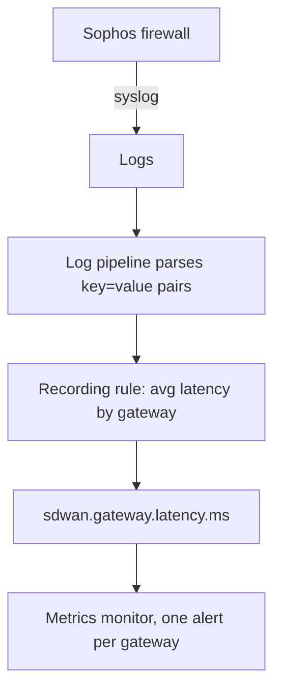

# Log Recording Rules

A **Log Recording Rule** turns logs into a metric. Every minute it takes the logs that match its filter and writes one number per minute into the metric store: how many logs matched, or the sum, average, minimum, maximum or a percentile of a numeric attribute those logs carry. Split the result by up to five log attributes and you get one series per value - one per gateway, per host, per customer.

:::cards
- [How a rule works](#how-a-rule-works): Buckets, timing, catch-up and gaps.
- [Creating a rule](#creating-a-rule): The fields of the rule editor.
- [Example: SD-WAN gateway latency](#example-sd-wan-gateway-latency-from-a-sophos-firewall): From firewall syslog to a per-gateway alert.
- [Permissions](#permissions): Who can create, change and read rules.
:::

## Overview

The output is an ordinary metric. Chart it in the **Metric Explorer** and on dashboards, and alert on it with a **Metrics** monitor - including per-series alerting with **Group By**.

Use a log recording rule when the number you care about only exists in your logs: a firewall's SLA summaries, a batch job that logs how long it took, an access log's response sizes, or simply how many error logs a service writes each minute.

Log recording rules live under **Logs → Settings → Recording Rules**. Their siblings for metrics and spans are under **Metrics → Settings → Recording Rules** and **Traces → Settings → Recording Rules**.

## How a Rule Works



- **One point per minute, per series.** Logs are grouped into 1-minute buckets by their timestamp. Each bucket produces one point for each distinct combination of the group-by attributes' values.
- **Computed 30 seconds after the minute ends.** The short wait lets logs that arrive a little late still land in their minute. A log that arrives later than that is not counted.
- **No gaps, no double counting.** Each rule remembers the last minute it wrote (shown as **Computed Until** in the rules list). After a worker restart or other downtime it catches up on the minutes it missed, up to 60 minutes back, and it never writes the same minute twice.
- **A count with no group by never has gaps.** A minute with no matching logs is written as `0`. Every other rule writes nothing for a minute with nothing to aggregate, so charts and monitors see no data rather than a made-up zero.
- **Written like any other derived metric.** Points are Gauge data points named after the rule's **Output Metric Name**, carrying the group-by attributes and `oneuptime.derived.log_rule_id` (the rule's ID), and they follow the same retention as the metric and trace recording rules' points: 15 days.

Changing a rule's definition applies from the next minute it writes; points already written are not rewritten. Turning a rule off stops it; turned back on, it catches up on the minutes it missed while it was off, up to the same 60 minutes.

## Creating a Rule

:::steps
### Open the recording rules

Go to **Logs → Settings → Recording Rules** and choose **Create Log Recording Rule**.

### Name the rule

Type a **Name**. The **Output Metric Name** under it is made from the name as you type; choose **Edit** next to it to type your own.

### Choose the logs and what to compute

Under **Which Logs**, narrow the rule down with telemetry services, severities, body text and attribute filters. Pick an **Aggregation**, and for anything but a count, the **Numeric Attribute** to aggregate.

### Split the result, and save

Optionally add **Group By** attributes and a **Unit**. Check the line at the bottom of the editor, then save. Within a few minutes the rules list shows a **Computed Until** time.
:::

| Field              | What it does                                                                                                                                                                                               |
| ------------------ | ---------------------------------------------------------------------------------------------------------------------------------------------------------------------------------------------------------- |
| Name               | What the rule computes, e.g. _SD-WAN gateway latency_.                                                                                                                                                     |
| Output Metric Name | The metric the rule writes. Made from the name - _SD-WAN gateway latency_ writes `sd_wan_gateway_latency` - unless you choose **Edit** and type your own. It must be unique among the project's recording rules. |
| Which Logs         | Optional filters, all ANDed: telemetry services, severities, text the body contains, and attribute filters (an attribute equal to a value).                                                               |
| Aggregation        | `Count of logs`, or an aggregation of a numeric attribute (see below).                                                                                                                                     |
| Numeric Attribute  | For every aggregation but Count: the attribute whose values are aggregated, e.g. `latency`.                                                                                                                |
| Group By           | Optional: up to 5 attribute keys. One series per distinct combination of their values.                                                                                                                    |
| Unit               | Optional: the output metric's unit, e.g. `ms`. Shown wherever the metric is charted.                                                                                                                      |
| Description        | Under **More fields**: what the rule is for.                                                                                                                                                               |
| Enabled            | Under **More fields**: on by default. Only enabled rules are computed.                                                                                                                                     |

The line at the bottom of the editor says what the rule will write, e.g. `avg(latency) by gw_name, profile_name`.

A rule can filter on at most 10 attributes and 100 telemetry services.

### Aggregations

| Aggregation   | Each minute's point                                  |
| ------------- | ---------------------------------------------------- |
| Count of logs | How many logs matched the filter.                    |
| Average       | The average of the numeric attribute's values.       |
| Sum           | The attribute's values added up.                     |
| Minimum       | The smallest value.                                  |
| Maximum       | The largest value.                                   |
| p50 (median)  | The median value.                                    |
| p75           | The 75th percentile.                                 |
| p90           | The 90th percentile.                                 |
| p95           | The 95th percentile.                                 |
| p99           | The 99th percentile.                                 |

### Numeric attributes

The numeric attribute's value must be a plain number. It can arrive as a number (`latency=11` parsed as a number) or as text (`"11"`, `"11.5"`, `"1e3"`). A log whose value is missing or is not a number - `"11ms"`, `"n/a"`, an empty string - is **skipped**. It is never counted as `0`, so a malformed log cannot drag an average down.

### Attribute keys

Attribute filter keys match whatever their case, like the log explorer's filters. The numeric attribute and the group-by keys must be written exactly as your logs carry them - including any prefix a log pipeline adds. The key fields suggest the keys your project's logs carry, so pick from the list rather than typing a key by hand.

Keys may contain letters, digits and `. _ : / -`.

### Group by, and the series cap

Every group-by key multiplies the number of series a rule writes, so group by attributes that identify a thing you want to see or alert on separately - a gateway, a host, a customer - not by ones that are different on every log, such as a request ID or a client IP address.

A rule writes at most 1,000 series per minute. Past that, the series with the most matching logs are kept and the rest of that minute is dropped. A log that does not carry one of the group-by attributes still counts; its series is written without that attribute.

## Example: SD-WAN Gateway Latency from a Sophos Firewall

A Sophos XGS firewall with SD-WAN logging on sends an SLA summary per SD-WAN profile and gateway every few minutes:

```text
log_type="SD-WAN" log_component="SLA" profile_name="Branch-Internet" gw_name="WAN2" latency=11 jitter=2 packet_loss=0 gw_status="up" sla_status="SLA met"
```

This example turns those summaries into a latency metric per gateway, and alerts when one gateway's latency stays high.



:::steps
### Get the logs in, with their fields as attributes

1. Send the firewall's syslog to OneUptime - see [Syslog](/docs/telemetry/syslog).
2. Under **Logs → Settings → Pipelines**, add a pipeline with a processor that parses the body's `key=value` pairs into log attributes, so each summary carries `log_type`, `log_component`, `profile_name`, `gw_name`, `latency`, `jitter` and `packet_loss` as attributes. The [Key=Value Parser](/docs/telemetry/log-pipelines#keyvalue-parser) does this.
3. Open the **Logs** explorer and check the attribute names on an SLA log. If your pipeline adds a prefix, use the prefixed names below.

### Create the recording rule

Under **Logs → Settings → Recording Rules**, create a rule:

- **Name:** SD-WAN gateway latency
- **Output Metric Name:** choose **Edit** and type `sdwan.gateway.latency.ms`
- **Which Logs:** attribute filters `log_type` = `SD-WAN` and `log_component` = `SLA`
- **Aggregation:** Average, **Numeric Attribute:** `latency`
- **Group By:** `gw_name` and `profile_name`
- **Unit:** `ms`

Over the API, MCP or Terraform the same rule's **definition** is:

```json
{
  "filter": {
    "attributeFilters": [
      { "key": "log_type", "value": "SD-WAN" },
      { "key": "log_component", "value": "SLA" }
    ]
  },
  "aggregationType": "Avg",
  "valueAttribute": "latency",
  "groupByAttributes": ["gw_name", "profile_name"],
  "unit": "ms"
}
```

Repeat with `jitter` (`sdwan.gateway.jitter.ms`, unit `ms`) and `packet_loss` (`sdwan.gateway.packet_loss.percent`, unit `%`) for the other two SLA measurements. A **Count of logs** rule filtered on `gw_status` = `down` and grouped by `gw_name` counts gateway-down reports per gateway.

Within a few minutes the rules list shows a **Computed Until** time, and `sdwan.gateway.latency.ms` appears in the Metric Explorer: pick it, group by `gw_name`, and you have one latency line per gateway.

### Alert when one gateway's latency stays high

Create a **Metrics** monitor (see [Metrics Monitor](/docs/monitor/metrics-monitor)):

1. **Metric query:** `sdwan.gateway.latency.ms`, aggregation **Average**, **Group By** `gw_name` and `profile_name`.
2. **Rolling time window:** Past 15 Minutes. The firewall reports every few minutes, so the window holds several points per gateway.
3. **Aggregation strategy:** **All Values** - every point in the window must breach, so one slow summary does not page anyone. Use **Average** instead to alert on a high average.
4. **Criteria:** Metric value **Greater Than** `150` opens an alert.
5. Optionally use the group-by values in the alert title, e.g. `SD-WAN latency high on {{gw_name}} ({{profile_name}})`.

With Group By set, each gateway is its own series: WAN2 going slow opens an alert for WAN2 alone, and it resolves on its own when WAN2 recovers - see [Per-Series Alerting](/docs/monitor/metrics-monitor#per-series-alerting-group-by).
:::

## Good to Know

- **Timestamps come from the logs.** A log lands in the minute of its own timestamp. A device whose clock is off by more than a little lands its logs in the wrong minute, or outside the window entirely.
- **No backfill.** A new rule starts with the minute before it first runs; older logs are not computed.
- **Deleting a rule** stops it. The points it already wrote stay until they expire.
- **Recording rules run with the project's full view of logs.** Anyone who can read the output metric sees numbers computed from every log the rule's filter matches, so creating and editing log recording rules is limited to project owners, admins and the **Create / Edit Log Recording Rule** permissions.

## Permissions

| Permission                | Allows                                  |
| ------------------------- | --------------------------------------- |
| Create Log Recording Rule | Creating rules.                         |
| Edit Log Recording Rule   | Changing rules, and turning them off.   |
| Delete Log Recording Rule | Deleting rules.                         |
| Read Log Recording Rule   | Seeing rules and what they compute.     |

Project owners and admins can do all of these. Project members, viewers and the telemetry roles can read rules.

## Next steps

:::cards
- [Metrics Monitor](/docs/monitor/metrics-monitor): Alert on the metrics your rules write.
- [Log Pipelines](/docs/telemetry/log-pipelines): Extract the attributes a rule aggregates.
- [Syslog](/docs/telemetry/syslog): Send firewall and server logs to OneUptime.
:::
