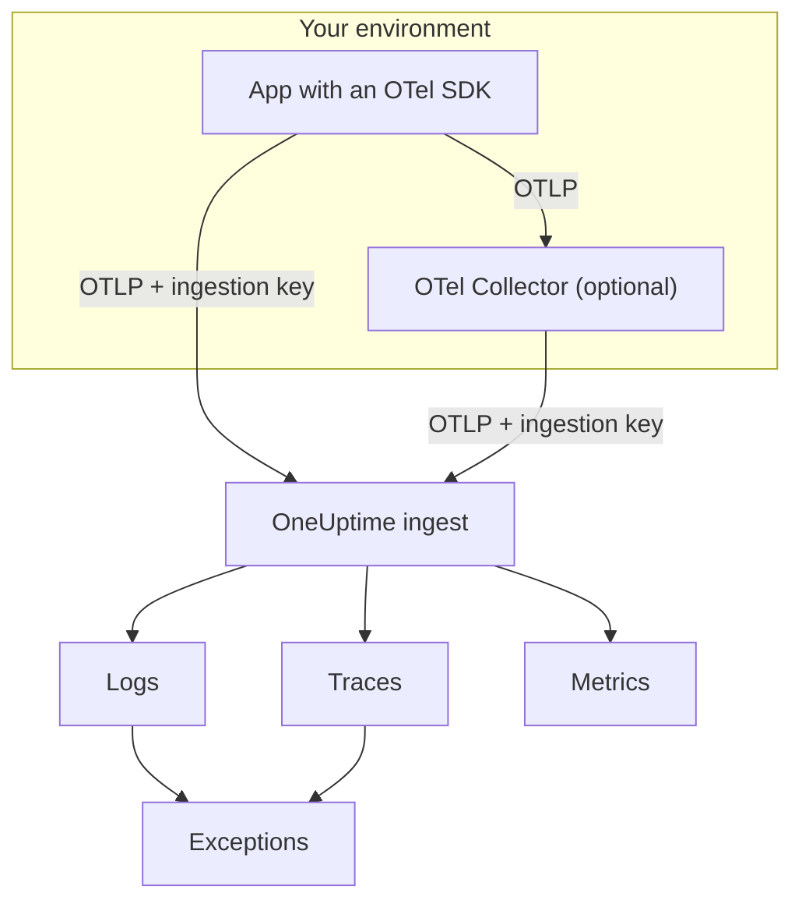

# OpenTelemetry

OneUptime ingests logs, metrics and traces over the OpenTelemetry Protocol (OTLP). Point any OpenTelemetry SDK, or an OpenTelemetry Collector, at OneUptime with an ingestion key, and your data shows up under **Logs**, **Traces**, **Metrics** and **Exceptions**. This page gets a service sending in a few minutes, then covers the endpoints, limits and errors you need in production.

:::cards
- [Quickstart](#quickstart): Create a key, set four environment variables and add the SDK.
- [Use a Collector](#send-through-an-opentelemetry-collector): Add OneUptime as an exporter to a collector you already run.
- [Endpoints and limits](#endpoints-and-limits): URLs, ports, encodings, size limits and status codes.
- [Troubleshooting](#troubleshooting): What to check when no data arrives.
:::

## How it works

Your application exports OTLP straight to OneUptime, or to an OpenTelemetry Collector that forwards it. Every request carries your ingestion key in the `x-oneuptime-token` header, and OneUptime uses the key to find your project.



- **Services are created for you.** The `service.name` resource attribute (set with `OTEL_SERVICE_NAME`) names the service your data belongs to. OneUptime creates the service the first time it sends, and lists it under **Products → Services**.
- **Errors become exceptions.** Exception events on spans, and exceptions recorded in logs, are grouped into issues under **Exceptions** — see [Exceptions from logs](#exceptions-from-logs).

## Before you begin

- A OneUptime project in which you can create ingestion keys: project owners and admins can, and so can anyone with the **Create Telemetry Ingestion Key** permission.
- An application you can add an OpenTelemetry SDK to, or an OpenTelemetry Collector.
- Outbound HTTPS (port 443) from your application or collector to `oneuptime.com`, or to your own OneUptime host.

> [!NOTE]
> On OneUptime Cloud, telemetry is billed per GB ingested. A project on the Free plan needs a payment method before it can send telemetry — the dialog that creates the key shows the pricing.

## Quickstart

:::steps
### Create an ingestion key

1. Go to **Products → Project Settings**.
2. In the side menu, open **Telemetry & APM** and select **Ingestion Keys**.
3. Click **Create Ingestion Key**. The dialog fills in a name and picks the **Server** key type, which is what an application or a collector sends with. Rename it if you like, then click **Create Ingestion Key**.


The new key opens on its own page. Copy its **Secret Key** — this is the token you send as `x-oneuptime-token`.


### Set the OpenTelemetry environment variables

Every OpenTelemetry SDK reads the same standard environment variables, so this step is the same in every language.

| Environment Variable | Value | What it does |
| --- | --- | --- |
| `OTEL_EXPORTER_OTLP_ENDPOINT` | `https://oneuptime.com/otlp` | Where to send. The SDK adds `/v1/traces`, `/v1/metrics` and `/v1/logs` itself. |
| `OTEL_EXPORTER_OTLP_HEADERS` | `x-oneuptime-token=YOUR_ONEUPTIME_INGESTION_KEY` | Sends your ingestion key with every request. |
| `OTEL_EXPORTER_OTLP_PROTOCOL` | `http/protobuf` | OTLP over HTTP. Some SDKs default to gRPC, which uses a different endpoint. |
| `OTEL_SERVICE_NAME` | `my-service` | The service your data appears under in OneUptime. |

```bash
export OTEL_EXPORTER_OTLP_ENDPOINT="https://oneuptime.com/otlp"
export OTEL_EXPORTER_OTLP_HEADERS="x-oneuptime-token=YOUR_ONEUPTIME_INGESTION_KEY"
export OTEL_EXPORTER_OTLP_PROTOCOL="http/protobuf"
export OTEL_SERVICE_NAME="my-service"
```

Self-hosting? Replace `https://oneuptime.com` with the URL of your OneUptime instance, for example `https://oneuptime.example.com/otlp`. To tag exceptions with an environment, also set `OTEL_RESOURCE_ATTRIBUTES` to `deployment.environment=production`.

### Add OpenTelemetry to your app

Pick your language. Each setup reads the environment variables above, so no endpoint or key appears in your code.

:::tabs
@tab Node.js
Install the SDK, the automatic instrumentations and the OTLP/HTTP exporters:

```bash
npm install @opentelemetry/sdk-node @opentelemetry/auto-instrumentations-node \
  @opentelemetry/exporter-trace-otlp-proto @opentelemetry/exporter-metrics-otlp-proto \
  @opentelemetry/exporter-logs-otlp-proto @opentelemetry/sdk-metrics @opentelemetry/sdk-logs
```

Create the SDK in a file of its own:

```javascript title="instrumentation.js"
const { NodeSDK } = require("@opentelemetry/sdk-node");
const { getNodeAutoInstrumentations } = require("@opentelemetry/auto-instrumentations-node");
const { OTLPTraceExporter } = require("@opentelemetry/exporter-trace-otlp-proto");
const { OTLPMetricExporter } = require("@opentelemetry/exporter-metrics-otlp-proto");
const { OTLPLogExporter } = require("@opentelemetry/exporter-logs-otlp-proto");
const { PeriodicExportingMetricReader } = require("@opentelemetry/sdk-metrics");
const { BatchLogRecordProcessor } = require("@opentelemetry/sdk-logs");

// The exporters read OTEL_EXPORTER_OTLP_ENDPOINT and OTEL_EXPORTER_OTLP_HEADERS.
const sdk = new NodeSDK({
  traceExporter: new OTLPTraceExporter(),
  metricReader: new PeriodicExportingMetricReader({
    exporter: new OTLPMetricExporter(),
  }),
  logRecordProcessors: [new BatchLogRecordProcessor(new OTLPLogExporter())],
  instrumentations: [getNodeAutoInstrumentations()],
});

sdk.start();
```

Load it before your application code:

```bash
node --require ./instrumentation.js app.js
```
@tab Python
Install the OpenTelemetry distribution and exporter, then the instrumentations for the libraries your app uses:

```bash
pip install opentelemetry-distro opentelemetry-exporter-otlp
opentelemetry-bootstrap -a install
```

Start your app through `opentelemetry-instrument`. It exports traces, metrics and logs; the logging variable also sends records written with Python's `logging` module:

```bash
OTEL_PYTHON_LOGGING_AUTO_INSTRUMENTATION_ENABLED=true opentelemetry-instrument python app.py
```
@tab Go
Add the SDK and the OTLP/HTTP exporters:

```bash
go get go.opentelemetry.io/otel go.opentelemetry.io/otel/sdk go.opentelemetry.io/otel/sdk/metric \
  go.opentelemetry.io/otel/exporters/otlp/otlptrace/otlptracehttp \
  go.opentelemetry.io/otel/exporters/otlp/otlpmetric/otlpmetrichttp
```

Create the tracer and meter providers when your program starts:

```go title="main.go"
package main

import (
	"context"
	"log"

	"go.opentelemetry.io/otel"
	"go.opentelemetry.io/otel/exporters/otlp/otlpmetric/otlpmetrichttp"
	"go.opentelemetry.io/otel/exporters/otlp/otlptrace/otlptracehttp"
	sdkmetric "go.opentelemetry.io/otel/sdk/metric"
	sdktrace "go.opentelemetry.io/otel/sdk/trace"
)

func main() {
	ctx := context.Background()

	// Both exporters read OTEL_EXPORTER_OTLP_ENDPOINT and OTEL_EXPORTER_OTLP_HEADERS.
	traceExporter, err := otlptracehttp.New(ctx)
	if err != nil {
		log.Fatal(err)
	}
	tracerProvider := sdktrace.NewTracerProvider(sdktrace.WithBatcher(traceExporter))
	defer tracerProvider.Shutdown(ctx)
	otel.SetTracerProvider(tracerProvider)

	metricExporter, err := otlpmetrichttp.New(ctx)
	if err != nil {
		log.Fatal(err)
	}
	meterProvider := sdkmetric.NewMeterProvider(
		sdkmetric.WithReader(sdkmetric.NewPeriodicReader(metricExporter)),
	)
	defer meterProvider.Shutdown(ctx)
	otel.SetMeterProvider(meterProvider)

	// Your application code.
}
```

The providers take `OTEL_SERVICE_NAME` from the environment. For logs, add `otlploghttp` with a log bridge such as `otelslog`; it reads the same variables.
@tab Java
Download the OpenTelemetry Java agent and attach it to your application. No code changes are needed:

```bash
curl -L -O https://github.com/open-telemetry/opentelemetry-java-instrumentation/releases/latest/download/opentelemetry-javaagent.jar
java -javaagent:opentelemetry-javaagent.jar -jar my-app.jar
```

The agent instruments common frameworks and libraries, and exports traces, metrics and logs written through Logback or Log4j.
@tab .NET
Add the OpenTelemetry packages for ASP.NET Core:

```bash
dotnet add package OpenTelemetry.Extensions.Hosting
dotnet add package OpenTelemetry.Exporter.OpenTelemetryProtocol
dotnet add package OpenTelemetry.Instrumentation.AspNetCore
dotnet add package OpenTelemetry.Instrumentation.Http
```

Register OpenTelemetry at startup. `UseOtlpExporter()` sends traces, metrics and logs, and reads the `OTEL_EXPORTER_OTLP_*` variables:

```csharp title="Program.cs"
using OpenTelemetry;
using OpenTelemetry.Metrics;
using OpenTelemetry.Trace;

var builder = WebApplication.CreateBuilder(args);

builder.Services.AddOpenTelemetry()
    .WithTracing(tracing => tracing
        .AddAspNetCoreInstrumentation()
        .AddHttpClientInstrumentation())
    .WithMetrics(metrics => metrics
        .AddAspNetCoreInstrumentation()
        .AddHttpClientInstrumentation())
    .WithLogging()
    .UseOtlpExporter();

var app = builder.Build();
app.Run();
```

Using Serilog? See [Serilog](/docs/telemetry/serilog) to send its logs to OneUptime.
:::

### Check that data arrives

Ask OneUptime whether it accepts your key:

```bash
curl -i -H "x-oneuptime-token: YOUR_ONEUPTIME_INGESTION_KEY" \
  https://oneuptime.com/otlp/v1/validate
```

A key that works returns `200` with `"valid": true`. Anything else returns `401` with a message saying what is wrong — unknown, disabled or expired.

Then run your app and use it for a minute. Open **Products → Services**: your service is listed under the name you set in `OTEL_SERVICE_NAME`, with its logs, traces, metrics and exceptions. **Products → Logs**, **Products → Traces** and **Products → Metrics** show the same data across every service.
:::

:::details Send a test log without an SDK
OTLP/HTTP also accepts JSON, so you can post a log with `curl`. The `severityNumber` `9` makes it an informational log:

```bash
curl -i https://oneuptime.com/otlp/v1/logs \
  -H "Content-Type: application/json" \
  -H "x-oneuptime-token: YOUR_ONEUPTIME_INGESTION_KEY" \
  -d '{
    "resourceLogs": [{
      "resource": {
        "attributes": [
          { "key": "service.name", "value": { "stringValue": "my-service" } }
        ]
      },
      "scopeLogs": [{
        "logRecords": [{
          "severityNumber": 9,
          "body": { "stringValue": "Hello from curl" }
        }]
      }]
    }]
  }'
```

A `200` means the log was accepted. It appears under **Products → Logs** within a few seconds, in the service `my-service`.
:::

## Send through an OpenTelemetry Collector

Run a collector when you already have one, when you want to batch, filter or enrich data in one place, or to keep the ingestion key out of your applications. Your apps export to the collector, and only the collector talks to OneUptime.

:::steps
### Add OneUptime as an exporter

Add an `otlphttp` exporter that points at OneUptime, and send every pipeline through it:

```yaml title="otel-collector-config.yaml"
receivers:
  otlp:
    protocols:
      grpc:
        endpoint: 0.0.0.0:4317
      http:
        endpoint: 0.0.0.0:4318

processors:
  batch: {}

exporters:
  otlphttp:
    endpoint: https://oneuptime.com/otlp
    headers:
      x-oneuptime-token: YOUR_ONEUPTIME_INGESTION_KEY

service:
  pipelines:
    traces:
      receivers: [otlp]
      processors: [batch]
      exporters: [otlphttp]
    metrics:
      receivers: [otlp]
      processors: [batch]
      exporters: [otlphttp]
    logs:
      receivers: [otlp]
      processors: [batch]
      exporters: [otlphttp]
```

Keep the exporter's defaults: it sends protobuf, compressed with gzip, and OneUptime accepts both. Do not set a `Content-Type` header on the exporter — OneUptime picks its decoder from that header, so a JSON content type in front of protobuf bytes breaks ingestion.

### Run the collector

:::tabs
@tab Docker
```bash
docker run -d --name otel-collector \
  -p 4317:4317 -p 4318:4318 \
  -v "$(pwd)/otel-collector-config.yaml:/etc/otelcol-contrib/config.yaml" \
  otel/opentelemetry-collector-contrib:latest
```
@tab Linux
```bash
otelcol-contrib --config otel-collector-config.yaml
```
:::

The collector listens for OTLP on port `4317` (gRPC) and `4318` (HTTP), the ports SDKs send to by default.

### Point your apps at the collector

In your applications, set `OTEL_EXPORTER_OTLP_ENDPOINT` to the collector, for example `http://localhost:4318`, and remove `OTEL_EXPORTER_OTLP_HEADERS` — the collector adds the key. Keep `OTEL_SERVICE_NAME` in each application.

Data arrives in OneUptime exactly as in the quickstart. If it does not, the collector's own log says why — see [Troubleshooting](#troubleshooting).
:::

Already exporting to another vendor? Add the `otlphttp` exporter next to the existing one and list both in each pipeline's `exporters` to send to both while you compare. To collect host metrics and log files as well, see the [Host OpenTelemetry Collector](/docs/telemetry/host-otel-collector) guide.

## Endpoints and limits

| Setting | OTLP/HTTP (recommended) | OTLP/gRPC |
| --- | --- | --- |
| Endpoint | `https://oneuptime.com/otlp` | `https://oneuptime.com:443` |
| Authentication | `x-oneuptime-token` header | `x-oneuptime-token` metadata |
| Encoding | Protobuf (`application/x-protobuf`) or JSON (`application/json`) | Protobuf |
| Compression | None, `gzip`, `deflate` or `zstd` | None or `gzip` |
| Request size | Up to 4 MB per request on `/otlp` | Up to 4 MB per message |

Over HTTP, each signal has its own path under the endpoint. SDKs and the collector add it for you; set it yourself only when a tool asks for a full URL.

| Signal | OTLP/HTTP URL |
| --- | --- |
| Traces | `https://oneuptime.com/otlp/v1/traces` |
| Metrics | `https://oneuptime.com/otlp/v1/metrics` |
| Logs | `https://oneuptime.com/otlp/v1/logs` |
| Profiles | `https://oneuptime.com/otlp/v1/profiles` |

For continuous profiling, most profilers send to the Pyroscope-compatible endpoint instead — see [Continuous Profiling](/docs/telemetry/profiles). A collector that exports OTLP profiles must set the exporter's `profiles_endpoint` to `https://oneuptime.com/otlp/v1/profiles`, because by default it posts profiles to a development path that OneUptime does not serve.

### OTLP over gRPC

OneUptime serves OTLP/gRPC on the same host as the web app, on port 443 over TLS. Set `OTEL_EXPORTER_OTLP_PROTOCOL` to `grpc` and `OTEL_EXPORTER_OTLP_ENDPOINT` to `https://oneuptime.com:443`, and send the same `x-oneuptime-token` header. In a collector, use the `otlp` exporter with `endpoint: oneuptime.com:443` and the same `headers`.

On a self-hosted installation, gRPC reaches OneUptime only over HTTPS: a plain-HTTP (h2c) connection is refused. If your instance is served over plain HTTP, use OTLP/HTTP.

Two of a key's settings apply to OTLP/HTTP only: its **Requests Per Minute Limit** and its **Pinned Service Name**. Data sent over gRPC keeps the `service.name` it was sent with, and is not counted against the limit.

### Responses

OneUptime answers an export as soon as the data is queued, and the data appears a few seconds later.

| Response | gRPC status | Meaning | What to do |
| --- | --- | --- | --- |
| `200` | `OK` | Accepted. | Nothing. |
| `401` | `UNAUTHENTICATED` | The key is missing, unknown or expired. | Check the `x-oneuptime-token` value against the key's **Secret Key**. |
| `402` | `PERMISSION_DENIED` | OneUptime Cloud only: the project is on the Free plan and has no payment method. | Add one under **Project Settings → Billing and Invoices → Billing**. |
| `413` | — | The request is larger than the size limit. | Send smaller batches. |
| `415` | — | Unsupported `Content-Encoding`. | Use `gzip`, `deflate` or `zstd`, or no compression. |
| `422` | `PERMISSION_DENIED` | The key is disabled, or it is a Browser key used outside its allowed origins. | Re-enable the key, or send with a Server key. |
| `429` | — | The key's **Requests Per Minute Limit** is reached. | Nothing at first: exporters retry after the `Retry-After` time. Raise the limit if it keeps happening. |
| `503` | `UNAVAILABLE` | OneUptime is starting up, or the ingest queue is unavailable. | Nothing: OTLP exporters retry `503` by themselves. |

`401`, `402`, `413`, `415` and `422` are permanent errors for OTLP exporters: the exporter drops the batch and logs the error rather than retrying it.

### Restarts and upgrades

While OneUptime restarts or is upgraded, it answers exports with `503` and `Retry-After: 5` until it is ready, and exporters send them again. A collector's exporter keeps retrying for five minutes by default (`retry_on_failure`) and holds what it could not send in its `sending_queue`, so leave both turned on. The time OneUptime was not receiving is never held against your servers, hosts or other resources: see [When OneUptime Is Not Receiving Data](/docs/monitor/when-oneuptime-is-not-receiving#starting-up).

### Ingestion keys

Each key's page, under **Project Settings → Telemetry & APM → Ingestion Keys**, has these settings:

| Setting | What it does |
| --- | --- |
| **Key Type** | **Server** (the default) for applications, collectors and agents. **Browser** for keys that ship in a web page: write-only, and accepted only from its **Allowed Origins**. It cannot be changed after the key is created. |
| **Allowed Origins** | The web origins a Browser key works from, such as `https://app.example.com`. Ignored on a Server key. |
| **Pinned Service Name** | When set, replaces `service.name` on everything sent with this key over OTLP/HTTP. |
| **Enabled** | Turn it off to stop accepting data sent with the key at once, without deleting it. |
| **Expires At** | After this date the key is refused. Empty means it never expires. |
| **Requests Per Minute Limit** | The most OTLP/HTTP requests per minute the key is accepted for, across every client that uses it. Empty means no limit on a Server key, and 6,000 on a Browser key. |
| **Last Used At** | When data was last accepted with the key. Use it to find keys that are safe to rotate or delete. |

**Reset Secret Key** on the key's page replaces the secret. Every application and collector that sends with the old one is refused until you update it.

## Self-hosted OneUptime

Everything on this page works the same against your own installation. Use your OneUptime URL wherever this page says `https://oneuptime.com`:

- `OTEL_EXPORTER_OTLP_ENDPOINT` is `https://YOUR-ONEUPTIME-HOST/otlp`, or `http://YOUR-ONEUPTIME-HOST/otlp` if you serve OneUptime over plain HTTP.
- The bundled ingress accepts requests of up to 4 MB on `/otlp`. A proxy you run in front of OneUptime may have a lower limit — ingress-nginx defaults `proxy-body-size` to 1 MB — so raise it for `/otlp` as well, or exporters see `413`.
- If `DISABLE_TELEMETRY_INGESTION=true` is set, OneUptime accepts every export and stores nothing. Check it first when a self-hosted instance shows no data at all.

## Exceptions from logs

OneUptime finds exceptions inside your **logs** and rolls them into the same **Exceptions** view that trace errors feed. Each log already belongs to a service or host, so the exception is attributed to it. Log and trace exceptions share fingerprint grouping, so an error reported by both a trace and a log collapses into one issue.

There are two ways a log becomes an exception:

| Detection | Logs it applies to | How it works |
| --- | --- | --- |
| **Exception attributes** (recommended) | Any log | A log record with the OpenTelemetry `exception.type`, `exception.message` or `exception.stacktrace` attribute becomes an exception directly. Most logging integrations set these when you log an exception: Logback and Log4j appenders, Serilog, the Python logging instrumentation. It is precise and works in every language. |
| **Stack trace in the body** | Error and fatal logs that do not carry a trace ID and a span ID | OneUptime scans the first 16 KB of the body for a JavaScript, Python, Java, Go, Ruby, C#/.NET or PHP stack trace, and takes the type, message and frames from it. A log written inside a span is skipped, because the span reports the exception itself. |

The body scan suits plain-text logs such as raw stdout, journald or syslog that a collector reads. A multi-line stack trace has to arrive as a single log record, so enable multiline recombination in the collector — see the [Host OpenTelemetry Collector](/docs/telemetry/host-otel-collector) guide.

Detection is on by default. On a self-hosted installation, turn it off by setting `TELEMETRY_LOG_EXCEPTION_EXTRACTION_ENABLED=false` on the `app` service — and on the `worker` too, if you run the Helm chart's dedicated worker.

## Troubleshooting

:::details No data appears, and the exporter logs `401`
The key is missing, unknown or expired. Check that `OTEL_EXPORTER_OTLP_HEADERS` is `x-oneuptime-token=` followed by the key's **Secret Key**, with no quotes or spaces inside the value, and that the key belongs to the project you are looking at. The validation request in [Check that data arrives](#check-that-data-arrives) says which of these it is.
:::

:::details The exporter logs `422`
The key is disabled, or it is a Browser key. Turn **Enabled** back on in the key's settings, or create a **Server** key: a Browser key is only accepted from a web page on one of its allowed origins.
:::

:::details The exporter logs `402`
The project is on OneUptime Cloud's Free plan and has no payment method, and telemetry is billed as you use it. Add a payment method under **Project Settings → Billing and Invoices → Billing**, and exports are accepted again.
:::

:::details The exporter logs `404`
The SDK is posting to the wrong path. `OTEL_EXPORTER_OTLP_ENDPOINT` must end in `/otlp` with no trailing slash, and no `/v1/...` — the SDK adds that. If you set a signal-specific variable such as `OTEL_EXPORTER_OTLP_TRACES_ENDPOINT`, it takes the full URL, for example `https://oneuptime.com/otlp/v1/traces`.
:::

:::details Nothing happens at all, and the SDK logs connection errors
The SDK is probably exporting over gRPC to an HTTP endpoint, or to `localhost`. Set `OTEL_EXPORTER_OTLP_PROTOCOL=http/protobuf`, or use the gRPC endpoint described in [OTLP over gRPC](#otlp-over-grpc). Also check that the process actually sees the environment variables — in a container, set them on the container, not in your shell.
:::

:::details The collector logs `Exporting failed` with `413`
A batch is larger than the size limit. Lower the batch size, for example `send_batch_max_size: 1000` on the `batch` processor. If you self-host behind your own proxy, also check that proxy's body-size limit.
:::

:::details Data arrives under the wrong service, or under Unknown Service
The service comes from the `service.name` resource attribute. Set `OTEL_SERVICE_NAME` in each application. If the key has a **Pinned Service Name**, every OTLP/HTTP export with that key is filed under that name instead.
:::

## Next steps

:::cards
- [Search Syntax](/docs/telemetry/search-syntax): Filter logs, traces, metrics and exceptions in the explorers.
- [Log Pipelines](/docs/telemetry/log-pipelines): Parse and enrich logs as they arrive.
- [Logs Monitor](/docs/monitor/logs-monitor): Alert when matching logs appear.
- [Host OpenTelemetry Collector](/docs/telemetry/host-otel-collector): Collect host metrics and log files with a collector.
:::
