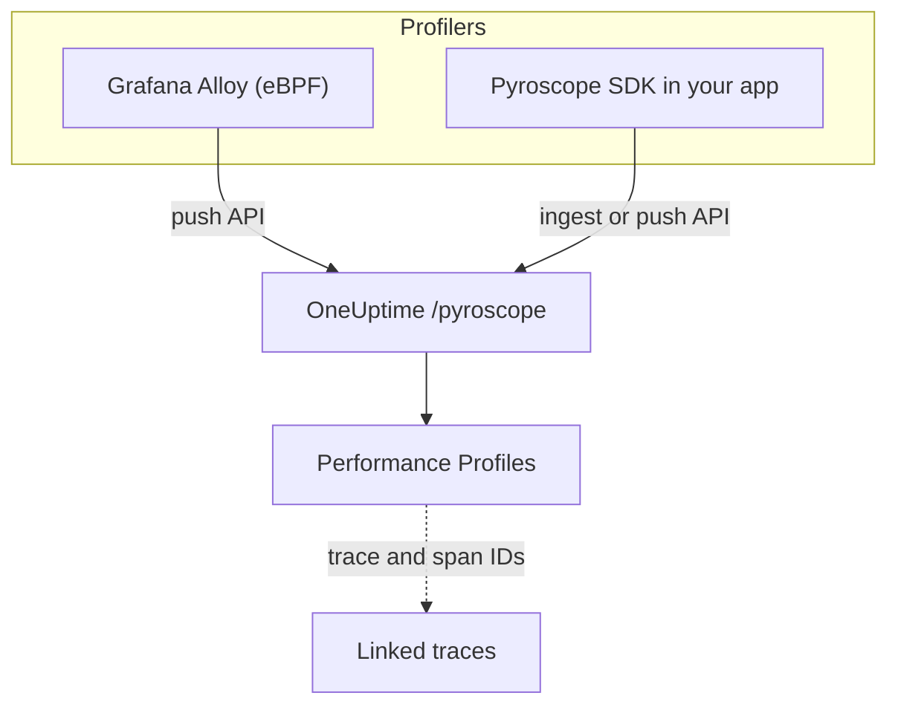

# Send Continuous Profiling Data to OneUptime

Continuous profiling shows how your application spends CPU time and memory, function by function. OneUptime exposes a **Pyroscope-compatible ingest API**, so anything that can push to a Pyroscope server — the Grafana Alloy eBPF profiler or a Pyroscope language SDK — can push to OneUptime, and you read the result as flame graphs next to your logs, metrics and traces.

:::cards
- [Send profiles](#send-profiles): Grafana Alloy with eBPF, or a Pyroscope SDK in your app.
- [Ingest endpoint](#ingest-endpoint): The base URL and the three ways to pass the key.
- [Verify it is working](#verify-it-is-working): Check the key, the page and the upload status.
- [Explore profiles](#explore-profiles-in-oneuptime): Flame graphs, top functions, diffs and trace links.
:::

## How it works

A profiler samples your processes and uploads a profile every few seconds to OneUptime's `/pyroscope` endpoint, with your ingestion key. OneUptime stores each profile under the service it names and draws it as a flame graph under **Performance Profiles**.



## Before you begin

You need a **Server** telemetry ingestion key. If you do not have one yet:

:::steps
### Open the ingestion keys

Go to **Products → Project Settings**, open **Telemetry & APM** in the side menu and select **Ingestion Keys**.


### Create a key

Click **Create Ingestion Key**. The dialog has the key's name filled in and **Server** picked — the kind of key an application or a collector sends with — so click **Create Ingestion Key** to create it, or rename it first.

### Copy the secret

The new key opens on its own page. Copy its **Secret Key**: this is the ingestion token the examples below call `YOUR_ONEUPTIME_INGESTION_TOKEN`.


:::

## Ingest Endpoint

| Setting                             | Value                                               |
| ----------------------------------- | --------------------------------------------------- |
| Base URL (Pyroscope server address) | `https://oneuptime.com/pyroscope`                   |
| Authentication header               | `x-oneuptime-token: YOUR_ONEUPTIME_INGESTION_TOKEN` |

Clients append their own path to the base URL — `/ingest` for most Pyroscope SDKs, `/push.v1.PusherService/Push` for Grafana Alloy and the .NET SDK from v0.14 — so you always configure just the base URL, with no trailing slash.

OneUptime reads the ingestion token from any of these, so use whichever your client supports:

| Method | When to use it |
| --- | --- |
| `x-oneuptime-token` header | Clients that let you add custom headers. |
| `Authorization: Bearer <token>` | SDKs with an `authToken` / `auth_token` option — that is what they send. |
| HTTP basic auth, with the token as the **password** (any user name) | Clients that only offer a basic-auth user and password. |

> [!NOTE]
> Self-hosting OneUptime? Replace `https://oneuptime.com` with your own host, for example `https://YOUR-ONEUPTIME-HOST/pyroscope`.

## Supported Profile Formats

| Format                                      | Sent by                                                             | Supported                                     |
| ------------------------------------------- | ------------------------------------------------------------------- | --------------------------------------------- |
| pprof (binary protobuf, optionally gzipped) | Go, Node.js, and .NET Pyroscope SDKs; Grafana Alloy                 | Yes                                           |
| Folded / collapsed text                     | Python, Ruby, and Rust Pyroscope SDKs (their default upload format) | Yes                                           |
| JFR (Java Flight Recorder)                  | Pyroscope Java agent                                                | Not yet — use Grafana Alloy for Java services |

## Send profiles

Grafana Alloy profiles every process on a host with no code changes, and is the recommended way to start. A Pyroscope SDK runs inside your application instead.

:::tabs
@tab Grafana Alloy
[Grafana Alloy](https://grafana.com/docs/alloy/latest/) collects CPU profiles from every process on a Linux host using eBPF — no agent inside your application and no code changes. It works for Go, Rust, C/C++, Java, Python, Ruby, PHP, Node.js, and .NET.

Create the Alloy configuration:

```hcl title="alloy-config.alloy"
discovery.process "all" {
  refresh_interval = "60s"
}

discovery.relabel "alloy_profiles" {
  targets = discovery.process.all.targets

  rule {
    action       = "replace"
    source_labels = ["__meta_process_exe"]
    target_label  = "service_name"
  }
}

pyroscope.ebpf "default" {
  targets    = discovery.relabel.alloy_profiles.output
  forward_to = [pyroscope.write.oneuptime.receiver]

  collect_interval = "15s"
  sample_rate      = 97
}

pyroscope.write "oneuptime" {
  endpoint {
    url = "https://oneuptime.com/pyroscope"
    headers = {
      "x-oneuptime-token" = "YOUR_ONEUPTIME_INGESTION_TOKEN",
    }
  }
}
```

Run it with Docker. eBPF needs a privileged container with the host PID namespace:

```yaml title="docker-compose.yml"
services:
  alloy:
    image: grafana/alloy:latest
    privileged: true
    pid: host
    volumes:
      - ./alloy-config.alloy:/etc/alloy/config.alloy
      - /proc:/proc:ro
      - /sys:/sys:ro
    command:
      - run
      - /etc/alloy/config.alloy
```

Or run it directly on the host:

```bash
alloy run alloy-config.alloy
```

The relabel rule names each profile's service after the process executable.
@tab Go
The Go SDK uploads pprof. Point its server address at the OneUptime base URL and pass your ingestion token as the auth token:

```go
import "github.com/grafana/pyroscope-go"

pyroscope.Start(pyroscope.Config{
    ApplicationName: "my-service",
    ServerAddress:   "https://oneuptime.com/pyroscope",
    AuthToken:       "YOUR_ONEUPTIME_INGESTION_TOKEN",
    ProfileTypes: []pyroscope.ProfileType{
        pyroscope.ProfileCPU,
        pyroscope.ProfileAllocObjects,
        pyroscope.ProfileAllocSpace,
        pyroscope.ProfileInuseObjects,
        pyroscope.ProfileInuseSpace,
        pyroscope.ProfileGoroutines,
    },
})
```
@tab Node.js
The Node.js SDK uploads pprof:

```javascript
const Pyroscope = require("@pyroscope/nodejs");

Pyroscope.init({
  serverAddress: "https://oneuptime.com/pyroscope",
  appName: "my-service",
  authToken: "YOUR_ONEUPTIME_INGESTION_TOKEN",
});

Pyroscope.start();
```
@tab Python
The Python SDK uploads folded text:

```python
import pyroscope

pyroscope.configure(
    application_name="my-service",
    server_address="https://oneuptime.com/pyroscope",
    auth_token="YOUR_ONEUPTIME_INGESTION_TOKEN",
)
```
@tab .NET
The Pyroscope .NET profiler is a native CLR profiler: it needs no code changes and is switched on entirely through environment variables. Download the release for your image from [pyroscope-dotnet releases](https://github.com/grafana/pyroscope-dotnet/releases) — `glibc` or `musl` (Alpine), `x86_64` or `aarch64` — and load it into the runtime:

```dockerfile title="Dockerfile"
FROM alpine:3.20 AS pyroscope-profiler
ARG PYROSCOPE_DOTNET_VERSION=1.5.1
ADD https://github.com/grafana/pyroscope-dotnet/releases/download/pyroscope-${PYROSCOPE_DOTNET_VERSION}/pyroscope.${PYROSCOPE_DOTNET_VERSION}-glibc-x86_64.tar.gz /tmp/pyroscope.tar.gz
RUN mkdir -p /pyroscope && tar -xzf /tmp/pyroscope.tar.gz -C /pyroscope

FROM mcr.microsoft.com/dotnet/aspnet:10.0
# ... your application ...
COPY --from=pyroscope-profiler /pyroscope /pyroscope
ENV CORECLR_ENABLE_PROFILING=1
ENV CORECLR_PROFILER={BD1A650D-AC5D-4896-B64F-D6FA25D6B26A}
ENV CORECLR_PROFILER_PATH=/pyroscope/Pyroscope.Profiler.Native.so
ENV LD_PRELOAD=/pyroscope/Pyroscope.Linux.ApiWrapper.x64.so
ENV LD_LIBRARY_PATH=/pyroscope
```

Then point it at OneUptime, for example in your Kubernetes / Helm environment:

```bash
PYROSCOPE_APPLICATION_NAME=my-service
PYROSCOPE_PROFILING_ENABLED=1
PYROSCOPE_SERVER_ADDRESS=https://oneuptime.com/pyroscope
PYROSCOPE_BASIC_AUTH_USER=oneuptime
PYROSCOPE_BASIC_AUTH_PASSWORD=YOUR_ONEUPTIME_INGESTION_TOKEN
```

The ingestion token goes in the basic-auth password. The user name can be any non-empty value, but the profiler sends no credentials at all unless both are set. To send the token as a header instead, set `PYROSCOPE_HTTP_HEADERS={"x-oneuptime-token":"YOUR_ONEUPTIME_INGESTION_TOKEN"}`.

How the token is passed depends on the profiler release. 1.5 and later ignore `PYROSCOPE_AUTH_TOKEN`, so if you upgrade from an older release and keep that setting, every upload is rejected with `401`:

| pyroscope-dotnet release | Uploads to                              | Token setting                                                                                                                                                     |
| ------------------------ | --------------------------------------- | ----------------------------------------------------------------------------------------------------------------------------------------------------------------- |
| v0.13 and earlier        | `/pyroscope/ingest`                     | `PYROSCOPE_AUTH_TOKEN`                                                                                                                                            |
| v0.14 to 1.4             | `/pyroscope/push.v1.PusherService/Push` | `PYROSCOPE_AUTH_TOKEN`                                                                                                                                            |
| 1.5 and later            | `/pyroscope/push.v1.PusherService/Push` | `PYROSCOPE_BASIC_AUTH_USER=oneuptime` and `PYROSCOPE_BASIC_AUTH_PASSWORD=<token>` (both must be set), or `PYROSCOPE_HTTP_HEADERS={"x-oneuptime-token":"<token>"}` |

Releases before 1.0 are tagged `v<version>-pyroscope` instead of `pyroscope-<version>` (for example `https://github.com/grafana/pyroscope-dotnet/releases/download/v0.13.0-pyroscope/pyroscope.0.13.0-glibc-x86_64.tar.gz`); the profiler GUID and file names are the same in every release.

CPU profiling is on by default. Wall-time, allocation, exception and lock-contention profiling are opt-in: set `PYROSCOPE_PROFILING_WALLTIME_ENABLED`, `PYROSCOPE_PROFILING_ALLOCATION_ENABLED`, `PYROSCOPE_PROFILING_EXCEPTION_ENABLED` or `PYROSCOPE_PROFILING_LOCK_ENABLED` to `true`. Static labels go in `PYROSCOPE_LABELS` (`key:value,key:value`).

The profiler uploads every 15 seconds and does **not** compress its uploads, so a busy service can send several MB per upload. OneUptime's own ingress accepts up to 16 MB on `/pyroscope`; if another proxy sits in front of OneUptime (for example ingress-nginx, whose default `proxy-body-size` is 1 MB), raise its body-size limit for `/pyroscope` as well, or large uploads are rejected with `413` before they reach OneUptime.
@tab Java
The Pyroscope Java agent uploads profiles in JFR format, which OneUptime does not ingest yet. Profile Java services with Grafana Alloy (the **Grafana Alloy** tab) instead — it captures JVM CPU profiles with no agent or code changes.
:::

**Ruby** and **Rust** work like Go, Node.js and Python: install the [Pyroscope SDK for your language](https://grafana.com/docs/pyroscope/latest/configure-client/) and set the server address to `https://oneuptime.com/pyroscope` with your ingestion token as the auth token (or, if your SDK version only offers basic auth, as the basic-auth password).

## Supported Profile Types

A pprof can declare several sample types; each uploaded profile is stored under one of them — CPU time (`cpu` in nanoseconds) if it has it, otherwise wall time, otherwise in-use then allocated bytes, otherwise the first type it declares. Any type is stored and viewable; the types below get first-class grouping, units, and labels in the OneUptime UI:

| Profile type                         | Shown as               | Unit        |
| ------------------------------------ | ---------------------- | ----------- |
| `cpu`, `samples`                     | CPU time               | nanoseconds |
| `wall`                               | Wall time              | nanoseconds |
| `inuse_space`, `alloc_space`, `heap` | Memory (bytes)         | bytes       |
| `inuse_objects`, `alloc_objects`     | Memory (object counts) | count       |
| `mutex`, `contention`, `block`       | Lock contention        | nanoseconds |
| `goroutine`                          | Goroutines (Go)        | count       |

Anything else (for example a custom sample type) appears under "Other" with its raw name.

## Verify It Is Working

:::steps
### Check your token

The ingest endpoints answer a missing or invalid token with `401`, but most profilers do not surface that anywhere you will see it (the .NET profiler, for one, logs HTTP responses only at debug level). Ask the validation endpoint directly:

```bash
curl -i -H "x-oneuptime-token: YOUR_ONEUPTIME_INGESTION_TOKEN" \
  https://oneuptime.com/otlp/v1/validate
```

A valid token returns `200` with `{"valid": true, ...}`; an unknown or revoked token returns `401`.

### Open the Profiles page

In the OneUptime Dashboard go to **Products → Performance Profiles**. With Alloy's 15-second collect interval (or the SDKs' 10- to 15-second upload interval), the first profiles and their flame graphs appear within a minute or two of the agent starting.

### Check the service

Profiles are attached to the telemetry service named by the SDK's `application_name` / `appName` / `PYROSCOPE_APPLICATION_NAME` (or the process executable name under Alloy's relabel rule above).

### Still nothing? Look at the upload status

For the .NET profiler, set `DD_TRACE_DEBUG=1` on the application for a minute: it then logs a `PyroscopePprofSink <status>` line for every upload. `200` means OneUptime accepted it; `401` is the token; `404` usually means `PYROSCOPE_SERVER_ADDRESS` is missing the `/pyroscope` suffix; `413` means a proxy in front of OneUptime rejected the upload's size (see the **.NET** tab under [Send profiles](#send-profiles)). If you run OneUptime yourself, the ingress (nginx) access log records the same status for every `/pyroscope` request.
:::

## Explore profiles in OneUptime

**Products → Performance Profiles** opens an overview of where the time is going across your services, with **All profiles** listing every upload. Pick what to analyze — **Everything**, **CPU time**, **Memory** or **Locks**, or a specific type such as **Wall time** or **Goroutines**.

A profile's page has three views:

| View | What it shows |
| --- | --- |
| **Flame graph** | Each bar is a function in the call stack, and its width is proportional to the time or resources it consumed. Click a function to zoom in and see its callers and callees. |
| **Top functions** | The functions in the profile, ranked by self time or total time. **Only my code** hides library frames. |
| **Diff vs. baseline** | The profile compared with an earlier period — **vs. 1 hour ago**, **vs. yesterday** or **vs. last week** — with the **Most regressed** and **Most improved** functions. |

**Download pprof** saves the profile for local tools such as `go tool pprof`.

### Trace correlation

When a profile carries trace and span IDs (for example as `trace_id` / `span_id` sample labels), you can navigate directly from a slow trace span to the corresponding CPU or memory profile to understand exactly what code was executing, and **Open linked trace** goes the other way.

A span's **Profile** tab also includes the samples linked to the spans nested under it, since profilers often attach a request's CPU time to a child span rather than to the request span itself.

## Data Retention

Profiles are kept for your project's telemetry retention: **Project Settings → Telemetry & APM → Data Retention** sets the **Default Retention (Days)**, 15 days unless you change it. Data is deleted automatically when the retention period ends. Plans that include retention overrides can also keep profiles longer or shorter than other telemetry, or set retention per service on the service's **Settings** page.

## Next steps

:::cards
- [Profiles Monitor](/docs/monitor/profiles-monitor): Alert on the profiles your services send, by count and type.
- [OpenTelemetry](/docs/telemetry/open-telemetry): Send the traces your profiles link to.
- [Kubernetes Agent](/docs/telemetry/kubernetes-agent): Profile a whole cluster with the agent's eBPF profiler.
:::
