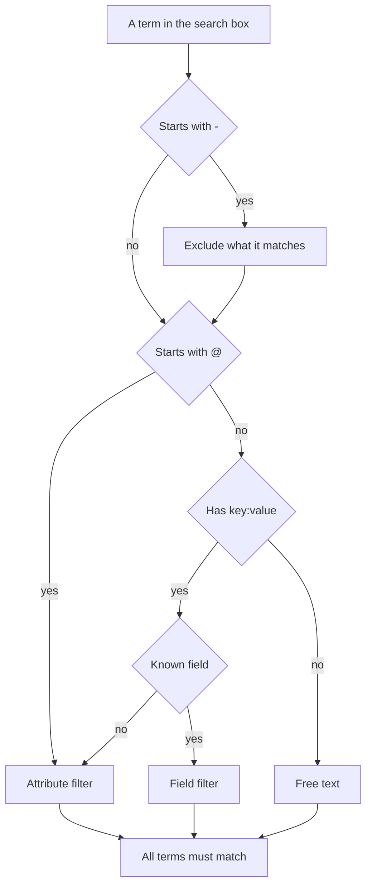

# Search Syntax

The search box above the Logs, Traces, Metrics and Exceptions explorers speaks one query language. A query is a list of filters separated by spaces, and **every filter must match** — there is no implicit OR between filters. Use this page as a reference while you search.

:::cards
- [The two kinds of filter](#the-two-kinds-of-filter): Built-in fields, attributes and free text.
- [Matching values](#matching-values): Wildcards, contains, comparisons and lists.
- [Excluding](#excluding): Turn any filter around with a leading `-`.
- [Fields by signal](#fields-by-signal): What you can filter on in each explorer.
:::

## How a query is read

```text
severity:error @platform.team:a* -@http.method:GET timeout
```

That reads as: error-level logs, whose `platform.team` attribute starts with `a`, whose `http.method` attribute is not `GET`, and whose message mentions `timeout`.

| Term | Kind | Matches |
| --- | --- | --- |
| `severity:error` | Field | The log's severity is Error. |
| `@platform.team:a*` | Attribute | The `platform.team` attribute starts with `a`. |
| `-@http.method:GET` | Excluded attribute | The `http.method` attribute is anything but `GET`. |
| `timeout` | Free text | The message contains `timeout`. |

Each space-separated term is read on its own, then all of them are combined with AND:



## The two kinds of filter

| Form | Filters | Example |
| --- | --- | --- |
| `field:value` | A built-in field of the signal | `severity:error` |
| `@attribute:value` | An OpenTelemetry attribute on the row | `@http.status_code:500` |
| bare words | The message (logs), span name (traces), metric name (metrics) or exception message (exceptions) | `connection refused` |

A bare `key:value` whose key is not a known field is treated as an attribute, so `k8s.pod:api-0` and `@k8s.pod:api-0` mean the same thing. Prefixing with `@` always means "look in the attributes", with one exception: on the Exceptions explorer, `@type:`, `@service:`, `@env:` and `@class:` still filter those fields.

Text that merely happens to contain a colon stays text — `https://example.com` and `12:30` are searched for as words, not read as filters.

## Matching values

Everything in this table works on any attribute and on most built-in fields; [Fields by signal](#fields-by-signal) notes the fields that read a value more simply.

| You type | It matches |
| --- | --- |
| `@k:abc` | exactly `abc` |
| `@k:a*` | anything starting with `a` — `abc`, `alpha` |
| `@k:*c` | anything ending with `c` |
| `@k:a*c` | starts with `a` and ends with `c` |
| `@k:a?c` | `?` is exactly one character — `abc`, `axc`, but not `ac` |
| `@k:*` | the attribute is present and not empty |
| `@k:~abc` | contains `abc` anywhere |
| `@k:!abc` | anything except `abc` |
| `@k:>100` | greater than 100. Also `>=`, `<`, `<=` |
| `@k:(a OR b)` | either value. `@k:[a, b]` is the same thing |
| `@k:(a* OR b*)` | either pattern |

Wildcard and contains matching ignore case; exact matching does not, because it is compared against the value exactly as it was stored.

### Values with spaces

Wrap the value in double quotes:

```text
name:"SELECT wp_options"
@k8s.container.name:"my container"
```

Quotes protect **spaces**, not wildcards — `@k:"a b*"` still matches anything starting with `a b`.

### Literal `*`, `?` and other punctuation

A backslash makes the next character literal:

| You type | It matches |
| --- | --- |
| `@k:a\*b` | exactly `a*b` |
| `@k:\~abc` | exactly `~abc` |
| `@k:\>5` | exactly `>5` |

Values containing `%` or `_` need no escaping — they are always literal.

## Excluding

A leading `-` inverts any filter, including the ones above:

| You type | It matches |
| --- | --- |
| `-severity:debug` | everything except debug |
| `-@platform.team:a*` | anything whose `platform.team` does **not** start with `a`, including rows that have no `platform.team` at all |
| `-@k:*` | the attribute is absent or empty |
| `-@k:(a OR b)` | neither value |
| `-@k:>100` | 100 or less |
| `-@k:~abc` | does not contain `abc` |

On the Traces explorer, `-` excludes attributes only. `-status:error` is read as text to find in span names, and finds nothing; ask for the values you want instead, such as `status:(ok OR unset)`.

## Fields by signal

Field names are not case-sensitive: `statusMessage:` and `statusmessage:` are the same field.

### Logs

| Field | Aliases | Notes |
| --- | --- | --- |
| `severity` | `level` | `fatal`, `error`, `warning` (or `warn`), `info` (or `information`), `debug`, `trace`, `unspecified` — any casing |
| `service` | | Service name, written in full, in any casing |
| `trace` | | Trace ID |
| `span` | | Span ID |
| `message` | `msg`, `log`, `body` | The log line. Bare words search this too |

### Traces

Trace fields take a plain value or an any-of list such as `status:(ok OR unset)`, and `duration` also takes `>` and `<`. Wildcards, `~`, `!` and a leading `-` work only on attributes here.

| Field | Notes |
| --- | --- |
| `service` | Service name |
| `name` | Span name. A single value matches any part of it. Bare words search this too |
| `status` | `ok`, `error`, `unset` (unset = no error status set, the OpenTelemetry default) |
| `kind` | `server`, `client`, `producer`, `consumer`, `internal` |
| `duration` | Milliseconds: `duration:>500`, `duration:<200` or an exact value |
| `statusMessage` | Status message text. A single value matches any part of it |
| `hasException` | `true` or `false` |
| `trace`, `span` | IDs |

### Metrics

| Field | Notes |
| --- | --- |
| `name` | Metric name. A plain value matches any part of it, so `name:http.server` finds `http.server.request.duration`. Bare words search this too |
| `service` | Service name. A plain value matches any part of it |

### Exceptions

| Field | Aliases | Notes |
| --- | --- | --- |
| `type` | `exceptionType` | Exception type, e.g. `type:TypeError` |
| `env` | `environment` | Environment, from the `deployment.environment` resource attribute |
| `service` | | Service name. A plain value matches any part of it |
| `class` | `errorClass` | Whose fault the error is: `code-fault`, `user-error`, `expected-denial`, `infrastructure` or `unknown` |

Bare words search the exception message.

The **Security Events** explorer uses the same language with fields of its own, such as `severity`, `tactic` and `user` — see [Security Events](/docs/telemetry/security-events).

## Combining filters

Filters are combined with AND. `AND` may be written between them and changes nothing:

```text
severity:error service:api          # both must hold
severity:error AND service:api      # identical
```

There is no OR or NOT **between** filters: `OR` and `NOT` written there are skipped, so `NOT severity:debug` means the same as `severity:debug`. Exclude with a leading `-` (`-severity:debug`), and to match either of two values for the same key, use the any-of form:

```text
@http.method:(GET OR POST)
```

Two filters on the same key are ANDed, which is how a range or a two-sided pattern is written:

```text
@http.status_code:>=500 @http.status_code:<=599
@k:a* @k:*z
```

## Chips and the search box

Pressing Enter on a `key:value` term applies it, usually as a chip above the results. A chip carries the value exactly as it was typed, so a wildcard stays a wildcard. A term a chip cannot carry, such as an excluded `-key:value`, stays in the search box and filters from there. Clicking a value in the facet sidebar adds the same kind of chip, with its value escaped — a stored value that happens to contain `*` filters for that literal value, not as a pattern.

Chips are part of the saved view and the page URL, so a filter survives a refresh, a bookmark and a shared link.

## Good to know

- Attribute **keys** are matched case-insensitively for wildcard, contains and prefix/suffix filters, so you do not have to remember whether it was ingested as `requestId` or `requestid`.
- A `-@k:...` filter also matches rows that never had the attribute — a row that does not carry `platform.team` at all trivially does not start with `a`.
- Numeric comparisons work on attribute values stored as text; a value that is not a number never satisfies one.

## Next steps

:::cards
- [Zooming Into a Time Range](/docs/telemetry/charts-and-time-ranges): Narrow the explorers to the moment that matters.
- [Log Pipelines](/docs/telemetry/log-pipelines): Turn parts of a log line into attributes you can search.
- [Logs Monitor](/docs/monitor/logs-monitor): Alert when the logs you search for appear.
- [OpenTelemetry](/docs/telemetry/open-telemetry): Send logs, metrics and traces to search.
:::
