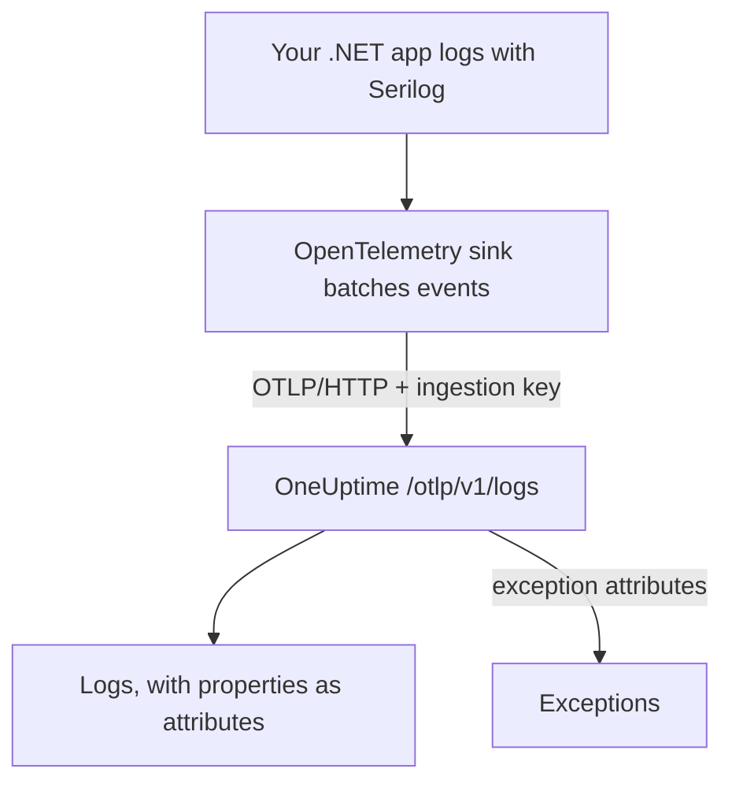

# Send Serilog Logs to OneUptime

[Serilog](https://serilog.net) is the most popular structured logging library for .NET. With the official [`Serilog.Sinks.OpenTelemetry`](https://github.com/serilog/serilog-sinks-opentelemetry) sink, every event your application logs through Serilog is shipped to OneUptime over the OpenTelemetry Protocol (OTLP), and becomes searchable in **Products → Logs** with its structured properties, severity and trace correlation.

There is no OneUptime-specific package to install — the sink talks to the same OTLP endpoint that OneUptime exposes for all OpenTelemetry data. This works for console apps, worker services, ASP.NET Core apps, and anything else that runs on .NET.

:::cards
- [Set up the sink](#set-up-the-sink): Install two packages and configure them in code or in `appsettings.json`.
- [Exceptions](#exceptions): Logged exceptions become issues in Exceptions.
- [Troubleshooting](#troubleshooting): What to check when no logs arrive.
:::

## How it works



The sink batches log events and sends them in the background. Each named property becomes a log attribute, and an exception logged with Serilog arrives with the attributes OneUptime turns into an issue.

## Before you begin

- A OneUptime project. On OneUptime Cloud, telemetry is billed per GB ingested — see [pricing](https://oneuptime.com/pricing).
- A .NET application that uses, or can use, Serilog.
- A telemetry ingestion key to authenticate your logs. If you do not have one:

:::steps
### Open the ingestion keys

Go to **Products → Project Settings**, open **Telemetry & APM** in the side menu and select **Ingestion Keys**.


### Create a key

Click **Create Ingestion Key**. The dialog has the key's name filled in and **Server** picked — the kind of key an application or a collector sends with — so click **Create Ingestion Key** to create it, or rename it first.

### Copy the secret

The new key opens on its own page. Copy its **Secret Key**: this is the `YOUR_TELEMETRY_INGESTION_TOKEN` in the examples below.


:::

## What you need from OneUptime

| Setting       | Value                                                        |
| ------------- | ------------------------------------------------------------ |
| OTLP Endpoint | `https://oneuptime.com/otlp`                                 |
| Auth header   | `x-oneuptime-token: YOUR_TELEMETRY_INGESTION_TOKEN`          |
| Service name  | The name your service should appear under, e.g. `my-service` |

> [!NOTE]
> Self-hosting OneUptime? Replace `https://oneuptime.com/otlp` with `https://YOUR-ONEUPTIME-HOST/otlp` (or `http://...` if you are not terminating TLS). Everything else stays the same.

With the protocol set to `HttpProtobuf`, the sink appends the `/v1/logs` path to the endpoint, so the final URL it posts to is `https://oneuptime.com/otlp/v1/logs`. You only need to provide the base `/otlp` endpoint.

## Set up the sink

:::steps
### Install the NuGet packages

Add Serilog and the OpenTelemetry sink to your project:

```bash
dotnet add package Serilog
dotnet add package Serilog.Sinks.OpenTelemetry
```

If you are configuring the sink from `appsettings.json`, also add `Serilog.Settings.Configuration`. For ASP.NET Core apps, add `Serilog.AspNetCore`, which wires Serilog into the host and the request pipeline:

```bash
dotnet add package Serilog.Settings.Configuration
dotnet add package Serilog.AspNetCore
```

### Configure the sink

Point the sink at your OneUptime OTLP endpoint, set the protocol to `HttpProtobuf`, pass your ingestion token as a header, and tag the logs with a `service.name`. Configure it in code, in `appsettings.json`, or in the ASP.NET Core host:

:::tabs
@tab In code
```csharp title="Program.cs"
using Serilog;
using Serilog.Sinks.OpenTelemetry;

Log.Logger = new LoggerConfiguration()
    .MinimumLevel.Information()
    .Enrich.FromLogContext()
    .WriteTo.Console() // optional: keep local logs too
    .WriteTo.OpenTelemetry(options =>
    {
        // Base OTLP endpoint. The sink appends /v1/logs automatically.
        options.Endpoint = "https://oneuptime.com/otlp";
        options.Protocol = OtlpProtocol.HttpProtobuf;

        // Authenticate with your OneUptime telemetry ingestion token.
        options.Headers = new Dictionary<string, string>
        {
            ["x-oneuptime-token"] = "YOUR_TELEMETRY_INGESTION_TOKEN"
        };

        // Identify your service in OneUptime.
        options.ResourceAttributes = new Dictionary<string, object>
        {
            ["service.name"] = "my-service",
            ["deployment.environment"] = "production"
        };
    })
    .CreateLogger();

try
{
    Log.Information("Application starting up");
    // ... your application code ...
}
finally
{
    // Flush any buffered logs before the process exits.
    Log.CloseAndFlush();
}
```
@tab appsettings.json
Put the sink settings in `appsettings.json`:

```json title="appsettings.json"
{
  "Serilog": {
    "Using": ["Serilog.Sinks.OpenTelemetry"],
    "MinimumLevel": "Information",
    "WriteTo": [
      {
        "Name": "OpenTelemetry",
        "Args": {
          "endpoint": "https://oneuptime.com/otlp",
          "protocol": "HttpProtobuf",
          "headers": {
            "x-oneuptime-token": "YOUR_TELEMETRY_INGESTION_TOKEN"
          },
          "resourceAttributes": {
            "service.name": "my-service",
            "deployment.environment": "production"
          }
        }
      }
    ]
  }
}
```

Then build the logger from configuration:

```csharp title="Program.cs"
using Serilog;
using Microsoft.Extensions.Configuration;

IConfiguration configuration = new ConfigurationBuilder()
    .AddJsonFile("appsettings.json")
    .Build();

Log.Logger = new LoggerConfiguration()
    .ReadFrom.Configuration(configuration)
    .CreateLogger();
```
@tab ASP.NET Core
For ASP.NET Core (.NET 6+ minimal hosting), use `Serilog.AspNetCore` so Serilog replaces the default logger and captures framework and request logs as well:

```csharp title="Program.cs"
using Serilog;
using Serilog.Sinks.OpenTelemetry;

var builder = WebApplication.CreateBuilder(args);

builder.Host.UseSerilog((context, services, configuration) =>
{
    configuration
        .ReadFrom.Configuration(context.Configuration)
        .Enrich.FromLogContext()
        .WriteTo.OpenTelemetry(options =>
        {
            options.Endpoint = "https://oneuptime.com/otlp";
            options.Protocol = OtlpProtocol.HttpProtobuf;
            options.Headers = new Dictionary<string, string>
            {
                ["x-oneuptime-token"] = "YOUR_TELEMETRY_INGESTION_TOKEN"
            };
            options.ResourceAttributes = new Dictionary<string, object>
            {
                ["service.name"] = "my-service"
            };
        });
});

var app = builder.Build();

// Logs one summary event per HTTP request.
app.UseSerilogRequestLogging();

app.MapGet("/", () => "Hello World");
app.Run();
```
:::

> [!IMPORTANT]
> The sink batches log events and sends them asynchronously. Always call `Log.CloseAndFlush()` (or dispose the logger) before your application exits, otherwise the last batch of logs may be lost. In ASP.NET Core, `Serilog.AspNetCore` handles this for you on graceful shutdown.

> [!TIP]
> Keep the token out of source control. Reference it from an environment variable or a secrets store and inject it into configuration at startup rather than committing it to `appsettings.json`.

### Write logs

Use Serilog as you normally would. Structured properties are preserved and become searchable attributes in OneUptime:

```csharp
Log.Information("Order {OrderId} placed by {CustomerId} for {Amount:C}",
    orderId, customerId, amount);

Log.Warning("Payment gateway slow: {LatencyMs}ms", latencyMs);
```

Each named property (`OrderId`, `CustomerId`, `Amount`, `LatencyMs`) is sent as a log attribute, so you can filter and search on them in the **Products → Logs** explorer.

### Check that logs arrive

Run your application and write a few log events. Within a few seconds they appear under **Products → Logs**, and on your service's page under **Products → Services** — the service is named after the `service.name` you set (`my-service`). Their structured properties are available as filters.
:::

## Exceptions

When you log an exception with Serilog, the sink attaches the OpenTelemetry `exception.type`, `exception.message`, and `exception.stacktrace` attributes to the log record:

```csharp
try
{
    ProcessPayment();
}
catch (Exception ex)
{
    Log.Error(ex, "Failed to process payment for order {OrderId}", orderId);
}
```

OneUptime detects these attributes and rolls the error into the **Exceptions** (Issues) view automatically, grouped by fingerprint and attributed to the right service. An error reported by both a trace and a log collapses into a single issue. See [Exceptions from logs](/docs/telemetry/open-telemetry#exceptions-from-logs) for details on how detection works.

## Trace correlation

If your application is also instrumented with the OpenTelemetry .NET SDK for traces, Serilog log events emitted inside an active span are automatically stamped with the current `TraceId` and `SpanId` (this is part of the sink's default `IncludedData`). That lets OneUptime link a log line directly to the trace it happened in, so you can jump from a log to the surrounding request and back.

To send traces and metrics as well, see the .NET setup in the [OpenTelemetry quickstart](/docs/telemetry/open-telemetry#quickstart).

## Troubleshooting

:::details No logs appear
Double-check the `x-oneuptime-token` value and confirm it belongs to the project you are viewing. Verify the endpoint is `https://oneuptime.com/otlp` (base path only — do not append `/v1/logs` yourself).
:::

:::details Logs appear only when the app exits, or the last logs are missing
Ensure `Log.CloseAndFlush()` runs on shutdown. The sink batches events, so buffered logs are lost if the process is killed without flushing.
:::

:::details 401 Unauthorized, and nothing is ingested
The token is missing or invalid. Confirm the header key is exactly `x-oneuptime-token`, and that the key is enabled and has not expired.
:::

:::details Logs arrive under the wrong service name
Set `service.name` in `ResourceAttributes` (code) or `resourceAttributes` (appsettings.json). Without it, your logs are filed under whatever placeholder name the sink sends instead of your service's name.
:::

:::details Connection errors to a self-hosted instance
Make sure the protocol matches your endpoint scheme (`https://` vs `http://`) and that your OneUptime host is reachable from the application.
:::

If you have any questions or need help, please reach out to us at support@oneuptime.com.

## Next steps

:::cards
- [OpenTelemetry](/docs/telemetry/open-telemetry): Send traces and metrics from .NET too.
- [Log Pipelines](/docs/telemetry/log-pipelines): Parse and enrich logs as they arrive.
- [Logs Monitor](/docs/monitor/logs-monitor): Alert when matching logs appear.
- [Search Syntax](/docs/telemetry/search-syntax): Filter on your Serilog properties.
:::
