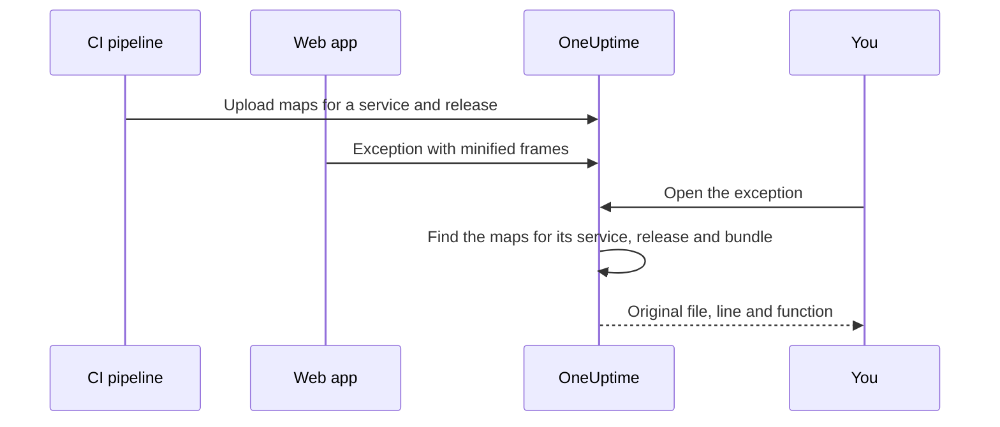

# Source Maps

Upload your front-end build's source maps to OneUptime, and browser exceptions in **Exceptions** show your original file names, lines and functions instead of minified ones. This page is for front-end developers who already send browser telemetry to OneUptime.

:::cards
- [How matching works](#how-matching-works): Service name, release and bundle file.
- [Upload source maps](#upload-source-maps): One `curl` request from CI.
- [Limits](#limits): Sizes, counts and the self-hosted settings.
- [Viewing resolved stack traces](#viewing-resolved-stack-traces): What a resolved frame looks like.
:::

## Overview

Production front-end bundles are minified, so a browser exception captured through the OpenTelemetry web SDK arrives with stack frames like:

```text
TypeError: Cannot read properties of undefined (reading 'id')
    at e.onSelect (https://app.example.com/assets/main.a8f1b2.js:1:48291)
```

Upload your build's source maps to OneUptime and the Exceptions dashboard resolves those frames back to the original file, line, function name — and, when the map was built with `sourcesContent`, the surrounding lines of your original source.

Maps are uploaded to OneUptime over an authenticated API and are **never fetched from your site**, so you can (and should) keep building with `hidden-source-map` (webpack) or `sourcemap: 'hidden'` (Vite / Rollup) and never publish the `.map` files next to your bundles.



## How matching works

A source map is stored against three keys:

| Key | Must match |
|---|---|
| Service name | The `service.name` OpenTelemetry resource attribute your web app sends telemetry with |
| Service version | The `service.version` resource attribute (your release identifier) |
| Bundle path | The minified file the map was generated for, e.g. `main.a8f1b2.js` |

When you open an exception, OneUptime looks up the maps uploaded for that exception's service and release, matches each stack frame to a bundle by file name (path suffixes are fine — `main.a8f1b2.js` matches `https://app.example.com/assets/main.a8f1b2.js`), and resolves the minified line and column through the map. Resolution happens lazily when the exception is viewed, never on the ingestion path — so a map uploaded a few minutes *after* the first error of a new release still applies retroactively.

## Before you begin

- A **Server** telemetry ingestion key, from **Project Settings → Telemetry & APM → Ingestion Keys**. See [Create an ingestion key](/docs/telemetry/open-telemetry#step-1-create-telemetry-ingestion-token).
- A web app that already sends exceptions to OneUptime with the OpenTelemetry web SDK — see [Browser Setup](/docs/rum/browser-setup).
- A build that writes source maps, with `sourcesContent` included (the default for most bundlers) if you want source snippets around each frame.

## Upload source maps

:::steps
### Send `service.version` with your telemetry

Your web app must send `service.version`, and it must be the same string you upload the maps with:

```javascript
import { resourceFromAttributes } from "@opentelemetry/resources";

const resource = resourceFromAttributes({
  "service.name": "my-web-app",
  "service.version": "1.4.2", // same value you upload maps with
});
```

Any stable release identifier works — a semantic version, a git commit SHA, a build number — as long as the uploaded `serviceVersion` and the `service.version` resource attribute are the same string.

### Upload the maps after each production build

Upload from CI, with your ingestion key in the `x-oneuptime-token` header:

```bash
curl --fail -X POST "https://oneuptime.com/source-maps/v1/upload" \
  -H "x-oneuptime-token: YOUR_TELEMETRY_INGESTION_KEY" \
  -F "serviceName=my-web-app" \
  -F "serviceVersion=1.4.2" \
  -F "sourcemap=@dist/assets/main.a8f1b2.js.map" \
  -F "sourcemap=@dist/assets/vendor.9c3d4e.js.map"
```

For self-hosted installations, replace `oneuptime.com` with your OneUptime host. `Authorization: Bearer YOUR_KEY` is accepted as an alternative to the `x-oneuptime-token` header.

### Check the upload

A successful upload returns a JSON body listing the stored maps, so CI can assert on it. The maps are also listed on the service's **Source Maps** page in OneUptime.
:::

A typical CI step uploads every map the build emitted:

```bash
VERSION="$(git rev-parse --short HEAD)"

find dist -name "*.js.map" -print0 | while IFS= read -r -d '' map; do
  curl --fail -X POST "https://oneuptime.com/source-maps/v1/upload" \
    -H "x-oneuptime-token: $ONEUPTIME_INGESTION_KEY" \
    -F "serviceName=my-web-app" \
    -F "serviceVersion=$VERSION" \
    -F "sourcemap=@$map"
done
```

### Upload rules

- Each uploaded file's bundle path is its file name with the trailing `.map` stripped — `main.a8f1b2.js.map` becomes `main.a8f1b2.js`. If your map file name does not follow that convention, upload one file per request and pass an explicit `bundlePath` field.
- Re-uploading the same bundle for the same service and version replaces the previous map, so CI retries are safe.
- Files must be [source map v3](https://tc39.es/ecma426/) JSON (which is what every modern bundler emits — indexed maps with `sections` are supported too).
- If your self-hosted operator has disabled telemetry ingestion (`DISABLE_TELEMETRY_INGESTION`), uploads return an empty success response and nothing is stored — the same behavior every telemetry ingest endpoint has in that mode. A real upload always returns a JSON body listing the stored maps, so CI can tell the two apart.

## Limits

Each `.map` file may be up to 50 MB, but the ingress also caps the **whole request body** at 50 MB — so upload large maps one per request. Up to 50 files are accepted per request, and one release (service + version) can hold at most 1,000 maps in total; an upload that would exceed that is rejected with a message naming the limit. A build that emits more maps than one request accepts should simply send several requests — uploads for the same release accumulate.

Self-hosted installations can change these. All five are ordinary environment variables, and the Helm chart exposes them under `sourceMaps` in `values.yaml`:

| `values.yaml` | Environment variable | Default |
| --- | --- | --- |
| `sourceMaps.maxMapsPerRelease` | `SOURCE_MAP_MAX_MAPS_PER_RELEASE` | `1000` |
| `sourceMaps.maxFilesPerRequest` | `SOURCE_MAP_MAX_FILES_PER_REQUEST` | `50` |
| `sourceMaps.maxFileSizeBytes` | `SOURCE_MAP_MAX_FILE_SIZE_BYTES` | `52428800` |
| `sourceMaps.maxBytesPerResolve` | `SOURCE_MAP_MAX_BYTES_PER_RESOLVE` | `536870912` |
| `sourceMaps.retentionDays` | `SOURCE_MAP_RETENTION_DAYS` | `90` |

`maxMapsPerRelease` is the one to raise if your build outgrows the default; it is a storage-shape limit and nothing more, because resolution is bounded by `maxBytesPerResolve` rather than by how many maps a release holds. `maxFilesPerRequest` and `maxFileSizeBytes` can only be **lowered** — the multipart body is parsed before the request is authenticated, so the shared ceilings above them are what an unauthenticated caller is held to, and a larger value is narrowed rather than applied.

## Viewing resolved stack traces

Open any exception under **Exceptions** in the dashboard. Frames that were resolved through a source map show a **Source mapped** badge and display the original function name and file location; expanding a frame shows the original source snippet (when the map carries `sourcesContent`) alongside the minified location.

Uploaded maps for a service can be reviewed and deleted under **Products → Services → your service → Source Maps**, which lists each map's release, bundle, size and upload time.

## Retention

Source maps are kept for 90 days after upload, then deleted automatically. A map is only useful while exceptions from its release are within your telemetry retention window, so this comfortably outlives the exceptions it unminifies. Re-upload maps for a release if you need them again.

## Security

- Maps are uploaded over an authenticated endpoint and stored in your OneUptime project — they are never fetched from your website, so hidden source maps stay hidden.
- The raw map content (which includes your original source when built with `sourcesContent`) can only be read back by project owners and admins, and by anyone given the **Read Telemetry Source Map** permission. Other team members see just the resolved frames and the few source lines around each crash site of exceptions they already have access to.
- Deleting a service deletes its source maps.

## Troubleshooting

:::details Frames are still minified
The exception's release has no matching maps. Check that the `service.version` your app sends is exactly the `serviceVersion` you uploaded with, that `serviceName` matches `service.name`, and that a map was uploaded for that bundle file: the service's **Source Maps** page lists the release and bundle of every map.
:::

:::details The upload is rejected because a map is too large
A single map may be up to 50 MB, and the whole request too. Upload large maps one per request, as the CI loop above does.
:::

## Next steps

:::cards
- [Browser Setup](/docs/rum/browser-setup): Send browser traces and exceptions with the OpenTelemetry web SDK.
- [Exceptions Monitor](/docs/monitor/exceptions-monitor): Alert when new exceptions appear.
- [OpenTelemetry](/docs/telemetry/open-telemetry): Endpoints, keys and limits for all telemetry.
:::
