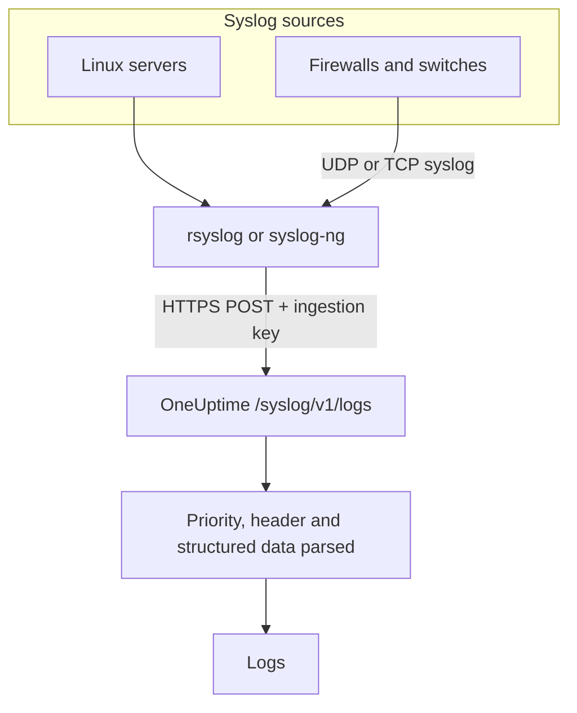

# Syslog

OneUptime accepts syslog over HTTPS. Post RFC 5424 or RFC 3164 messages to `/syslog/v1/logs` with your ingestion key, and each becomes a searchable log, with its priority, facility, severity, host, application and structured data as attributes. Use it to forward from rsyslog, syslog-ng or any relay that can make HTTP requests.

:::cards
- [Send a test message](#send-a-test-message): One `curl` request.
- [Forward from rsyslog](#forward-from-rsyslog): Send everything a server or relay receives.
- [Parsed attributes](#parsed-attributes): What OneUptime extracts from each message.
- [Troubleshooting](#troubleshooting): Rejected requests and unexpected services.
:::

## How it works



OneUptime answers as soon as it has read the messages from the request, and parses and stores them a moment later. The message text stays in the log body; everything else becomes an attribute.

> [!TIP]
> Network devices you monitor with a OneUptime probe can send their syslog straight to the probe over UDP, with no relay — the logs then appear on the device in OneUptime. See [Network Vendor Guides](/docs/monitor/network-vendor-guides).

## Before you begin

- **A OneUptime project** – on OneUptime Cloud, telemetry is billed per GB ingested, and a project on the Free plan needs a payment method before it can send telemetry.
- **Telemetry ingestion key** – create a **Server** key under **Products → Project Settings → Telemetry & APM → Ingestion Keys**, and copy its **Secret Key**. You send it in the `x-oneuptime-token` header.
- **Syslog forwarder** – any tool capable of sending HTTP POST requests (for example `curl`, `rsyslog` via `omhttp`, or `syslog-ng` with its HTTP destination).
- **Service name (optional)** – set the `x-oneuptime-service-name` header to group incoming logs under a specific telemetry service. When omitted, OneUptime falls back to the syslog `APP-NAME`, hostname, or `Syslog`.

## Endpoint

```http
POST https://oneuptime.com/syslog/v1/logs
```

| Header | Required | Value |
| --- | --- | --- |
| `x-oneuptime-token` | Yes | Your ingestion key. |
| `Content-Type` | Yes, for JSON bodies | `application/json` |
| `x-oneuptime-service-name` | No | The service the logs belong to. |
| `Content-Encoding` | No | `gzip`, for a compressed body. |

Replace `oneuptime.com` with your host if you are self-hosting OneUptime.

## Request body

Send a JSON payload with a `messages` array. Both RFC 5424 and RFC 3164 (BSD) formats are supported, and you can mix them in one request:

```json
{
  "messages": [
    "<34>1 2025-03-02T14:48:05.003Z web-01 nginx 7421 ID47 [env@32473 host=\"web-01\"] 502 on /api/login",
    "<13>Feb  5 17:32:18 db-01 postgres[2419]: connection received from 10.0.0.12"
  ]
}
```

### Supported body formats

| Body | How to send it |
| --- | --- |
| A JSON object with a `messages` array | `Content-Type: application/json` — recommended. |
| A JSON array of messages | `Content-Type: application/json`. |
| A JSON object with one `message` | `Content-Type: application/json`. A value with several lines is read as several messages. |
| Newline-separated messages | Compressed with gzip, and sent with `Content-Encoding: gzip`. |

A plain-text body that is not gzip-compressed is not read, and the request is rejected with `400`. A gzip-compressed body is always read as newline-separated messages, so do not compress a JSON body. Keep each request under 1 MB: OneUptime's ingress does not raise nginx's default request-body limit for this endpoint.

## Send a test message

```bash
curl \
  -X POST https://oneuptime.com/syslog/v1/logs \
  -H "Content-Type: application/json" \
  -H "x-oneuptime-token: YOUR_TELEMETRY_KEY" \
  -H "x-oneuptime-service-name: production-web" \
  -d '{
    "messages": [
      "<34>1 2025-03-02T14:48:05.003Z web-01 nginx 7421 ID47 [env@32473 host=\"web-01\"] 502 on /api/login"
    ]
  }'
```

A `200` means the message was accepted. Open **Products → Logs**: the log appears in the `production-web` service with the body `502 on /api/login`, severity **Error** and the attributes in [Parsed attributes](#parsed-attributes).

## Forward from rsyslog

rsyslog sends to OneUptime with its HTTP output module, `omhttp`.

:::steps
### Make sure `omhttp` is available

The configuration below loads it with `module(load="omhttp")`. If rsyslog reports that it cannot load the module, install the package that provides `omhttp` for your distribution.

### Add the OneUptime destination

Create `/etc/rsyslog.d/oneuptime.conf`. The template rebuilds each message as an RFC 5424 line and wraps it in the JSON body OneUptime expects:

```text title="/etc/rsyslog.d/oneuptime.conf"
module(load="omhttp")

template(name="OneUptimeJson" type="string"
         string="{\"messages\":[\"<%PRI%>1 %TIMESTAMP:::date-rfc3339% %HOSTNAME% %APP-NAME% %PROCID% %MSGID% - %msg:::json%\"]}")

action(
  type="omhttp"
  server="oneuptime.com"
  serverport="443"
  usehttps="on"
  restpath="syslog/v1/logs"
  httpheaders=[
    "x-oneuptime-token: YOUR_TELEMETRY_KEY",
    "x-oneuptime-service-name: rsyslog-demo"
  ]
  template="OneUptimeJson"
)
```

`restpath` takes the path without its leading slash. `omhttp` sends a JSON `Content-Type` by default, which is what this template produces.

### Check the configuration and restart rsyslog

```bash
sudo rsyslogd -N1
sudo systemctl restart rsyslog
```

`rsyslogd -N1` validates the configuration without starting rsyslog. After the restart, new messages appear under **Products → Logs** in the `rsyslog-demo` service.
:::

The action forwards every message rsyslog handles — local programs, the systemd journal when rsyslog reads it, and anything it receives from the network.

### Relay syslog from network devices

Firewalls, switches and other appliances often send syslog only over UDP or TCP. Point them at an rsyslog relay, and let the relay forward over HTTPS. Add a listener to the relay's configuration, before the `action`:

```text title="/etc/rsyslog.d/oneuptime.conf"
module(load="imudp")
input(type="imudp" port="514")
```

Set `x-oneuptime-service-name` to a name such as `perimeter-firewall`, or remove the header so each device's logs are grouped by its hostname. Many appliances write their message as `key=value` pairs; a [Key=Value Parser](/docs/telemetry/log-pipelines#keyvalue-parser) turns them into attributes.

:::details Send in batches instead of one request per message
rsyslog can batch messages and gzip them, which OneUptime reads as newline-separated messages. Replace the template and action with:

```text title="/etc/rsyslog.d/oneuptime.conf"
template(name="OneUptimeLine" type="string"
         string="<%PRI%>1 %TIMESTAMP:::date-rfc3339% %HOSTNAME% %APP-NAME% %PROCID% %MSGID% - %msg%")

action(
  type="omhttp"
  server="oneuptime.com"
  serverport="443"
  usehttps="on"
  restpath="syslog/v1/logs"
  httpheaders=["x-oneuptime-token: YOUR_TELEMETRY_KEY"]
  template="OneUptimeLine"
  batch="on"
  batch.format="newline"
  compress="on"
)
```

Keep `compress="on"`: OneUptime reads newline-separated messages only from a gzip-compressed body.
:::

### Other forwarders

- **syslog-ng** – use its HTTP destination with the same URL, headers and JSON body.
- **Fluent Bit** – receive syslog with Fluent Bit's `syslog` input and forward it like any other log. See [Fluent Bit](/docs/telemetry/fluentbit).

## Parsed attributes

OneUptime automatically adds the following attributes to each log entry:

| Attribute | Value | From the test message |
| --- | --- | --- |
| `syslog.priority` | The priority, `<PRI>` | `34` |
| `syslog.facility.code`, `syslog.facility.name` | The facility, from the priority | `4`, `security` |
| `syslog.severity.code`, `syslog.severity.name` | The severity, from the priority | `2`, `critical` |
| `syslog.version` | The RFC 5424 version | `1` |
| `syslog.hostname` | `HOSTNAME` | `web-01` |
| `syslog.appName` | `APP-NAME`, or the RFC 3164 tag | `nginx` |
| `syslog.processId` | `PROCID` | `7421` |
| `syslog.messageId` | `MSGID` | `ID47` |
| `syslog.structured.raw` | The RFC 5424 structured data, as sent | `[env@32473 host="web-01"]` |
| `syslog.structured.*` | Each structured-data parameter, flattened | `syslog.structured.env_32473.host` = `web-01` |
| `syslog.raw` | The original message, for traceability | the whole line |

These attributes become searchable inside the **Products → Logs** explorer — for example `@syslog.severity.name:error` or `@syslog.hostname:web-01`. See [Search Syntax](/docs/telemetry/search-syntax).

The message itself stays in the log body. Firewalls such as Sophos XGS and Fortinet FortiGate write it as `key=value` pairs (`log_component="IPSec" con_name="HQ-Branch1" status="Terminated"`); add a **Key=Value Parser** processor in a [log pipeline](/docs/telemetry/log-pipelines#keyvalue-parser) to turn those pairs into attributes too.

### Severity

| Syslog severity | Code | OneUptime severity |
| --- | --- | --- |
| Emergency, Alert | `0`, `1` | Fatal |
| Critical, Error | `2`, `3` | Error |
| Warning | `4` | Warning |
| Notice, Informational | `5`, `6` | Information |
| Debug | `7` | Debug |
| No priority in the message | — | Unspecified |

A message without a timestamp is stored with the time OneUptime received it.

### Service

Each log is filed under a telemetry service, which OneUptime creates the first time it sends. The service is the first of:

1. the `x-oneuptime-service-name` header;
2. the message's `APP-NAME` (or tag);
3. the message's hostname;
4. `Syslog`.

## Troubleshooting

:::details HTTP 401
The key is missing, unknown or expired. Check that the `x-oneuptime-token` header carries the **Secret Key** of an ingestion key in the project that should receive the logs.
:::

:::details HTTP 402 or 422
`402`: on OneUptime Cloud, the project is on the Free plan and has no payment method. Add one under **Project Settings → Billing and Invoices → Billing**. `422`: the key is disabled, or it is a Browser key. Turn **Enabled** back on in the key's settings, or create a **Server** key.
:::

:::details HTTP 400, or no logs appear
Confirm the request body actually contains syslog lines, as JSON with `Content-Type: application/json`. Empty bodies — and plain-text bodies that are not gzip-compressed — are rejected with HTTP 400.
:::

:::details HTTP 413
The request is larger than the ingress accepts. Send fewer messages per request.
:::

:::details Logs arrive under an unexpected service name
Set `x-oneuptime-service-name` to override the default detection logic, which uses the `APP-NAME`, then the hostname.
:::

## Next steps

:::cards
- [Log Pipelines](/docs/telemetry/log-pipelines): Parse `key=value` messages into attributes.
- [Log Recording Rules](/docs/telemetry/log-recording-rules): Turn the numbers in your syslog into metrics.
- [Logs Monitor](/docs/monitor/logs-monitor): Alert when matching syslog messages arrive.
:::
