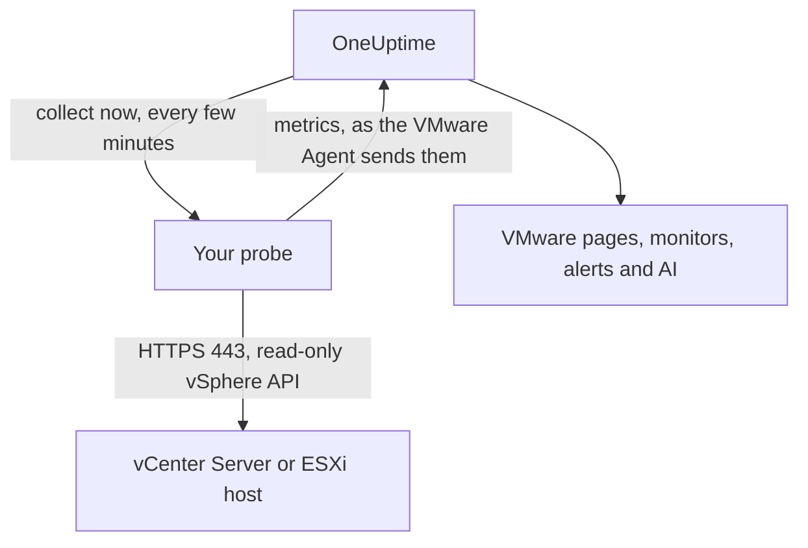

# VMware Without an Agent

Monitor a vCenter Server, or a standalone ESXi host, without installing anything: enter vCenter's address and a read-only account in OneUptime, pick the probe that can reach it, and the probe collects the same data the [VMware Agent](/docs/telemetry/vmware) would. There is no agent to install, upgrade or keep running, and no machine of its own to provision.

:::cards
- [Before you begin](#before-you-begin): A probe that reaches vCenter, and a read-only account.
- [Connect a vCenter](#connect-a-vcenter): Four fields, a test and a name.
- [Troubleshooting](#troubleshooting): What each message means and what fixes it.
:::

## How it works

Every few minutes the probe logs in to vCenter with the account you saved, reads the inventory, the performance counters and vSAN statistics, and sends them to OneUptime. They arrive exactly as the VMware Agent's do, so every VMware page, [VMware monitor](/docs/monitor/vmware-monitor), alert template and OneUptime AI reads them the same way. The probe keeps its vCenter session between collections, so vCenter's event log does not fill with logins.

## Probe or agent?

| | A probe (this page) | The VMware Agent |
|---|---|---|
| What you run | A probe you already run, or a new one | The agent, on a machine of its own |
| Where the account is kept | Encrypted in OneUptime, sent only to the probe | In the agent's `.env` file |
| What it needs to reach | vCenter on TCP 443, from the probe | vCenter on TCP 443, from the agent |
| Largest vCenter | About 48 MiB of metrics per collection | No limit |
| ESXi syslog and the AI agent | Not included | Included |

Both send the same data. You can switch a vCenter from one to the other at any time on its **Settings** page.

## Before you begin

- **A probe that can reach vCenter on TCP 443.** This is usually a [custom probe](/docs/probe/custom-probe) in vCenter's network. On OneUptime Cloud, the shared probes never receive a vCenter password, so add a probe of your own. On a self-hosted instance, the instance's own probes can collect too.
- **A vSphere user with the Read-Only role** on the top-level vCenter object, with **Propagate to children** ticked. Follow [Create the Read-Only vSphere User](/docs/telemetry/vmware#create-the-read-only-vsphere-user): the account is the same one the agent uses.

> [!IMPORTANT]
> Without **Propagate to children**, the user logs in but sees nothing, and the probe reports that the account cannot read vCenter's inventory.

## Connect a vCenter

:::steps
### Open vCenters
In OneUptime, open **VMware → All vCenters** and click **Connect vCenter**.

### Enter the address and the account
Enter the address you open the vSphere Client at, such as `https://vcsa.example.com`, the user name with its domain, such as `oneuptime@vsphere.local`, and its password. Pick the probe that reaches vCenter.

### Test the connection
On the next step, click **Test connection**. The probe logs in, reads what the account can see and logs out, and the result says how many datacenters, clusters, hosts, virtual machines and datastores it found.

### Trust vCenter's certificate
vCenter uses a certificate from its own authority by default, which the probe does not trust. The test then shows the certificate: check its fingerprint against vCenter's own, then click **Trust this certificate**.

### Name it and connect
The name defaults to vCenter's host name. Click **Connect vCenter** to save.
:::

The vCenter's **Overview** shows a **Data Collection** card. It reads **Checking** until the first collection, which starts within a minute, then **Collecting**, and the inventory fills in.

## Certificates

The probe never skips certificate verification. Every connection completes a full TLS handshake, and then:

- with no certificate trusted, vCenter's certificate must come from an authority the probe's machine trusts, for the address you entered;
- with a certificate trusted, vCenter must present exactly that certificate, identified by its SHA-256 fingerprint. Nothing else is accepted, not even a publicly trusted one.

To check a fingerprint, open the vSphere Client at **Administration → Certificates → Certificate Management**, or run `openssl s_client -connect vcsa.example.com:443 </dev/null | openssl x509 -noout -fingerprint -sha256` from the probe's machine.

When vCenter's certificate is renewed, collection stops with **vCenter's certificate changed** and the new certificate is shown. Nothing is sent to vCenter until you trust it, on the vCenter's **Overview** or **Settings** page.

## The saved password

The password is encrypted and write-only: nobody can read it back, and the API never returns it. It is sent only to the probe that collects the vCenter, which keeps it in memory.

A saved password is only ever sent to the address, through the probe and to the certificate it was entered for. Changing the address, the probe or the trusted certificate asks for the password again, so nobody who can edit the vCenter can send it somewhere else. Trusting the certificate the probe found at the saved address keeps it.

## Switch between the agent and a probe

Open the vCenter's **Settings** page. Its **Data Collection** card offers **Collect With a Probe** for a vCenter the agent sends, and **Use the VMware Agent** for one a probe collects. Switching to the agent forgets the saved password.

> [!WARNING]
> Stop the VMware Agent once the first probe collection succeeds. While both run, every metric arrives twice.

## Reference

| Setting | Default | Notes |
|---|---|---|
| Collect every | 2 minutes | From 1 to 60 minutes. Collect a large vCenter less often to go easier on it. |
| Collections at once | 4 per probe | A collection slower than its interval is skipped, never stacked. |
| Largest collection | About 48 MiB | Larger vCenters need the VMware Agent. |
| Connection test | 90 seconds to start | A test no probe picks up in time, or that runs longer than 2 minutes, is answered as failed. |

## Troubleshooting

:::details vCenter's certificate is not trusted
vCenter presents a certificate from its own authority. Check the fingerprint shown against vCenter's certificate, then click **Trust this certificate**.
:::

:::details vCenter refused the login
Use the full user name with its domain, such as `oneuptime@vsphere.local`, and check the password and that the account is not locked. Change them with **Edit Connection** on the vCenter's **Settings** page.
:::

:::details The user cannot read vCenter's inventory
Give the user the Read-Only role on the top-level vCenter object with **Propagate to children** ticked.
:::

:::details The probe gets no answer from vCenter
The probe's network cannot reach vCenter on TCP 443. Allow it through the firewall, or pick a probe in vCenter's network.
:::

:::details The probe did not pick this up
The probe is offline, or runs a OneUptime version older than VMware collection. Check that it is connected in the **Custom Probes** table, and update it.
:::

:::details This vCenter is too large to collect from a probe
Its metrics are larger than one probe upload may be. Use the [VMware Agent](/docs/telemetry/vmware) for this vCenter.
:::

## Next steps

:::cards
- [VMware Monitor](/docs/monitor/vmware-monitor): Alert on hosts, virtual machines, datastores and clusters.
- [Custom Probe](/docs/probe/custom-probe): Run a probe in vCenter's network.
- [VMware Agent](/docs/telemetry/vmware): Collect a vCenter with the agent instead.
:::
