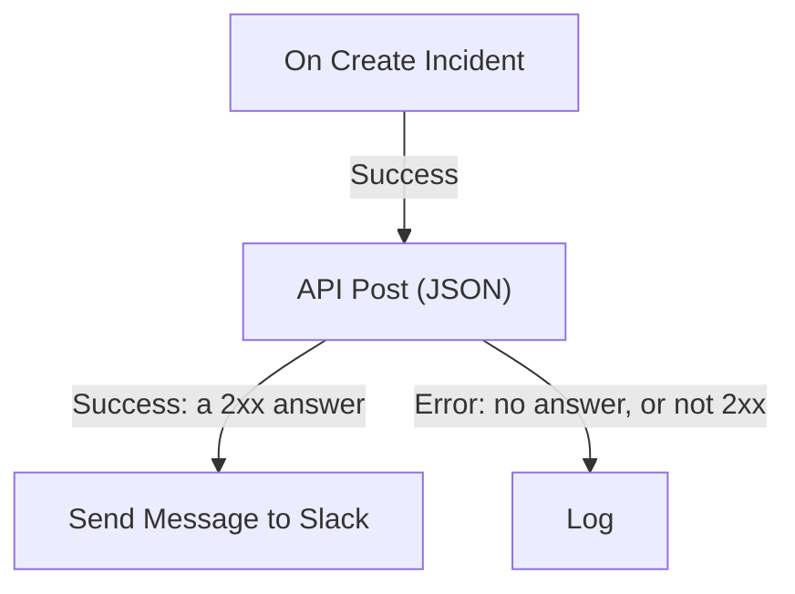

# Workflow Components

Components are the blocks you add after the trigger. Each one does one job — sends a message, calls an API, checks a condition, changes a OneUptime record — and then takes one of its outputs to the blocks connected to it. This page is the catalog: what each block needs, what it returns and when it takes each output.

You rarely need it open while you build. Every block's settings end with **How to use**: what the block does, the steps to set it up, an example built from your own workflow, and the mistakes people commonly make. For adding and connecting blocks, see [Authoring a Workflow](/docs/workflows/authoring).

:::cards
- [Send a message](#slack): Slack, Microsoft Teams, Discord, Telegram, IRC and email.
- [Call an API](#api): Send a request to any HTTP API and read the answer.
- [Add logic](#conditions): Branch on a value, reshape data, wait or log.
- [Work with OneUptime records](#oneuptime-data-components): Find, create, update and delete monitors, incidents and more.
:::

## Which component should I use?

| To…                                                   | Use                                                               |
| ----------------------------------------------------- | ----------------------------------------------------------------- |
| Post to a chat tool                                   | [Slack](#slack), [Microsoft Teams](#microsoft-teams), [Discord](#discord), [Telegram](#telegram) or [IRC](#irc) |
| Send an email through your own mail server            | [Email](#email)                                                   |
| Call any other API, or your own service               | [API](#api)                                                       |
| Summarize, classify or draft text                     | [Generate Text with AI](#generate-text-with-ai)                   |
| Take one path or another depending on a value         | [Conditions](#conditions)                                         |
| Reshape data between two blocks                       | [JSON](#json) or [Custom Code](#custom-code)                      |
| Wait before the next block                            | [Sleep](#sleep)                                                   |
| Start another workflow                                | [Execute Workflow](#execute-workflow)                             |
| Read or change incidents, monitors and other records  | [OneUptime data components](#oneuptime-data-components)          |

A dedicated block beats a generic one: the Slack block knows Slack's limits, and a record block knows the record's fields, so you get clearer errors and logs than from an **API** block doing the same job.

## How every block works

A block runs when the block before it takes the output connected to it. It reads its settings, does its job, and then takes one of its outputs. Only the blocks connected to that output run next.



- **Settings** are what you fill in. Settings marked **(Optional)** can be left empty. Less-used settings are folded under **More fields**.
- **Outputs** are the dots on the bottom edge. Most blocks have **Success** and **Error**; [Conditions](#conditions) has **Yes** and **No**.
- **Returns** are the values a block hands to later blocks, such as an API's **Response Body**. A later block reads one with `{{local.components.<block ID>.returnValues.<value ID>}}`; the **{ }** button in a setting inserts it for you. See [Variables](/docs/workflows/variables#component-outputs-data-from-earlier-blocks).

A block that takes **Error** does not fail the run: the run follows the **Error** path, or ends there if nothing is connected to it. A required setting left empty, or a setting that can never work, stops the run with an error instead.

## API

Make an HTTP request to any URL. There is one block per method: **API Get (JSON)**, **API Post (JSON)**, **API Put (JSON)**, **API Patch (JSON)** and **API Delete (JSON)**.

| Setting             | What it does                                                                                                                         |
| ------------------- | ------------------------------------------------------------------------------------------------------------------------------------ |
| **URL**             | The address to call, `http` or `https`.                                                                                              |
| **Request Body**    | The JSON to send. Usually only `POST`, `PUT` and `PATCH` requests need one.                                                         |
| **Request Headers** | Headers to send, such as an API key. Under **More fields**. Their values are hidden in the run's log.                                |

| Output      | When                                                                                     |
| ----------- | ---------------------------------------------------------------------------------------- |
| **Success** | The server answered with a 2xx status.                                                   |
| **Error**   | The request failed: the server could not be reached, or it answered with any other status. |

Either way, the block returns **Response Status**, **Response Headers** and **Response Body**, plus **Error** with the reason when it failed. Read one field of a JSON response by adding its name to the reference, as in `{{local.components.api-get-1.returnValues.response-body.id}}`.

Redirects are not followed, so point the block at the address that answers. Requests go out from OneUptime: a URL that resolves to a private network address is refused unless a self-hosted administrator allows it, and the run stops with the reason. See [Outbound network access](/docs/workflows/configuration#outbound-network-access).

## AI

### Generate Text with AI

Generate one text response from a prompt and optional JSON context. The block uses the project's default LLM provider, or the installation's global provider when the project has none. Providers are configured centrally under **Project Settings → AI → LLM Providers**; their keys and endpoints are never settings of the block.

| Setting                   | What it does                                                                                                                                                      |
| ------------------------- | ----------------------------------------------------------------------------------------------------------------------------------------------------------------- |
| **System Instructions**   | Optional guidance for the model's role, tone and constraints.                                                                                                    |
| **Prompt**                | The task. It's sent exactly as you type it, so Markdown is fine, and it can include variables and values from earlier blocks.                                    |
| **Context**               | Optional JSON you deliberately send along. It is appended after an explicit end-of-message marker and treated as untrusted data.                                 |
| **Temperature**           | Under **More fields**. Variation from `0` to `1`; the default is `0.2`, for predictable automation. Current Claude models, Opus 4.7 and later and every Claude 5 model, choose their own sampling: OneUptime leaves **Temperature** out of their requests, so it has no effect on them. |
| **Maximum Output Tokens** | Under **More fields**. From `1` to `4096`; the default is `1024`.                                                                                                |

The combined System Instructions, Prompt, and serialized Context are limited to 50,000 characters. An image embedded in them as base64, such as a synthetic monitor's screenshot in an incident's description, is replaced by a short note like `[image omitted: PNG, 340 KB]` before they are measured, because the model reads text, not images. The run's log says what was left out. The provider request has a 60-second maximum duration and is attempted once. At most three workflow AI requests can run concurrently per project.

It returns **Response** (the generated text), **Provider** and **Model** (what answered), **Total Tokens** and **Completion Tokens** (the usage the provider reported), **LLM Log ID** (the call's entry in the AI logs) and **Error**.

Connect **Success** to the blocks that use the response, and **Error** to a fallback: validation, access, provider, budget, billing and timeout failures all take it. The block sends no tools, so the model cannot query OneUptime, call APIs or change data on its own.

> [!WARNING]
> Model output is untrusted text. Review it before it reaches customers, and never let free-form AI text alone decide a destructive action. See [AI components](/docs/workflows/configuration#ai-components) for what is sent to the provider, what is logged and what it costs.

## Slack

Post a message to a Slack channel through an incoming webhook.

| Setting                        | What it does                                                                                                                                                                                                 |
| ------------------------------ | ------------------------------------------------------------------------------------------------------------------------------------------------------------------------------------------------------------ |
| **Slack Incoming Webhook URL** | The webhook of the channel to post to. It must start with `https://hooks.slack.com/services/`. Slack's guide to [creating one](https://api.slack.com/messaging/webhooks) takes a couple of minutes.            |
| **Message Text**               | The text to send. It's sent exactly as you type it, so use Slack's own formatting: `*bold*`, `_italic_`, `~strikethrough~` and `<https://example.com|a link>`. A text longer than one Slack section (3,000 characters) goes as several; past ten sections it is cut and ends with "… (truncated — see OneUptime for the full text)". |

**Success** fires when Slack took the message and **Error** when it refused it, with Slack's reason in **Error**. These blocks post through the webhook in their settings, not through your project's Slack connection.

## Microsoft Teams

Post a message to a Microsoft Teams channel. The block is called **Send Message to Teams**.

| Setting                        | What it does                                                                                                                                                                                                                                 |
| ------------------------------ | -------------------------------------------------------------------------------------------------------------------------------------------------------------------------------------------------------------------------------------------- |
| **Teams Incoming Webhook URL** | The channel webhook to post to, an `https` URL on `office.com`, `office365.com`, `logic.azure.com` or `environment.api.powerplatform.com`. Microsoft's guide shows how to [create one with Teams Workflows](https://support.microsoft.com/en-us/teams/apps-service/create-incoming-webhooks-with-workflows-for-microsoft-teams). |
| **Message Text**               | The text to send. A message bigger than an incoming webhook takes (about 12,000 characters, measured as it is sent) is cut and ends with "… (truncated — see OneUptime for the full text)".                                                  |

## Discord

Post a message to a Discord channel through an incoming webhook.

| Setting                          | What it does                                                                                                                                       |
| -------------------------------- | -------------------------------------------------------------------------------------------------------------------------------------------------- |
| **Discord Incoming Webhook URL** | The channel's webhook, an `https` URL on `discord.com` or `discordapp.com`.                                                                        |
| **Message Text**                 | The text to send. A message longer than 2,000 characters, Discord's limit, is cut and ends with "… (truncated — see OneUptime for the full text)". |

## Telegram

Send a message to a Telegram chat with a bot.

| Setting                | What it does                                                                                                                                       |
| ---------------------- | -------------------------------------------------------------------------------------------------------------------------------------------------- |
| **Telegram Bot Token** | The token BotFather gave your bot, such as `123456789:ABCdef…`. A token in any other shape stops the run, without the token being written to the log. |
| **Chat ID**            | The chat to post in: its ID, or a channel's `@username`. Add the bot to the group or channel first. To message a person, they must have started a chat with the bot. |
| **Message Text**       | The text to send. A message longer than 4,096 characters, Telegram's limit, is cut and ends with "… (truncated — see OneUptime for the full text)". |

When Telegram refuses the message, **Error** fires with Telegram's reason.

## IRC

Post a message to an IRC channel on any IRC network: Libera.Chat, OFTC, or a server of your own. IRC has no webhooks, so the block connects to the server itself, joins the channel, sends the message and leaves.

| Setting          | What it does                                                                                                                                                                                                                                       |
| ---------------- | -------------------------------------------------------------------------------------------------------------------------------------------------------------------------------------------------------------------------------------------------- |
| **IRC Server**   | The server's host name, such as `irc.libera.chat`. Just the name: no `ircs://`, and no port.                                                                                                                                                       |
| **Channel**      | The channel to post in, such as `#ops`. It has to be a channel: a nickname typed here is refused rather than sent a private message.                                                                                                              |
| **Message Text** | The text to send. Each line goes out as an IRC message of its own, and a long line is split to fit. A message is sent as at most 15 IRC lines: a longer one is cut short, and its last line says so. IRC has no Markdown, so the text is sent as typed; IRC's own formatting codes, such as bold and colours, work. |

Under **More fields**:

| Setting                                  | What it does                                                                                                                                                                                                       |
| ---------------------------------------- | ------------------------------------------------------------------------------------------------------------------------------------------------------------------------------------------------------------------ |
| **Nickname**                             | Who the message is from. Defaults to `OneUptime`. If the nickname is taken, the block tries it with an underscore or a number added, and then with one in place of its last characters, for a server that takes no longer nickname. |
| **Port**                                 | The server's port. It defaults to `6697`, or `6667` with **Disable TLS** on.                                                                                                                                       |
| **Disable TLS**                          | The block connects over TLS and checks the server's certificate. Turn this on only for a server that does not offer TLS; any password is then sent unencrypted. To trust a certificate from your own certificate authority, a self-hosted install sets `NODE_EXTRA_CA_CERTS` instead. |
| **Channel Key**                          | The key of a channel that has one (mode `+k`).                                                                                                                                                                     |
| **Send Without Joining**                 | Posts without joining, so the channel does not see the block come and go. Only works where the channel takes messages from outside (no mode `+n`).                                                                 |
| **Server Password**                      | A password the server or your bouncer asks for when you connect.                                                                                                                                                  |
| **SASL Username** and **SASL Password**  | Sign in to your account on networks that use SASL, such as Libera.Chat, which requires it for connections from some cloud and VPN addresses. Fill in both or neither.                                              |

**Success** fires once the server has taken every line. The block checks this by asking the server to answer a ping after the last line: a server answers in order, so any refusal of the message comes back first. A bouncer such as ZNC answers the ping itself, so the block listens a second longer for the network's answer behind it.

**Error** fires when the server can't be reached, refuses the connection, the nickname, a password or the channel, or refuses the message. It passes along why, in the server's own words where it gave them. A missing **IRC Server**, **Channel** or **Message Text**, or a setting that could never work, stops the run instead.

Each run of the block is a connection of its own, and IRC networks limit how often one address may connect: a burst of messages can be refused with a reason such as "Reconnecting too fast", and takes **Error** like any other refusal. For a workflow that can fire many times a minute, gather what it has to say into one message, or send it through a server of your own.

Keep the passwords in [secret global variables](/docs/workflows/variables#global-variables) and use the variable in the setting; they're hidden in run logs either way. Connections to loopback (`localhost`, `127.0.0.1`), link-local and cloud metadata addresses are refused. On OneUptime Cloud, a server on a private network address, or a name that resolves to one, is refused too. Self-hosted installs can reach an IRC server on their own network, unless `DATA_SOURCE_BLOCK_PRIVATE_ADDRESSES` is set to `true`.

## Email

Send an email through an SMTP server you enter on the block. The block is called **Send Email**.

| Setting                                | What it does                                                                                      |
| -------------------------------------- | ------------------------------------------------------------------------------------------------- |
| **From Email**                         | The sender, for example `Alerts <alerts@company.com>`.                                            |
| **To Email**                           | The recipient's address. Separate several addresses with commas or semicolons.                   |
| **Subject**                            | The subject line.                                                                                 |
| **Email Body**                         | The message, sent as HTML.                                                                        |
| **SMTP HOST** and **SMTP Port**        | The mail server to connect to.                                                                    |
| **SMTP Username** and **SMTP Password** | Optional. Fill in both or neither.                                                               |
| **Use Implicit TLS**                   | Turn on for implicit TLS, usually on port 465. Leave off for STARTTLS, usually on port 587.      |

**Success** fires when the SMTP server accepted the message. **Error** fires when the SMTP host is refused, the server can't be reached, or it rejects the message, and passes along the error message. A missing **To Email**, **From Email**, **SMTP HOST** or **SMTP Port** stops the run instead.

The block connects straight to the server in its settings. It does not use your project's [SMTP](/docs/emails/smtp) settings or OneUptime's own mail server, and the emails it sends do not appear in Notification Logs. To check what it did, look at the workflow's [Runs](/docs/workflows/runs-and-logs).

Connections to loopback (`localhost`, `127.0.0.1`), link-local and cloud metadata addresses are refused. On OneUptime Cloud, an SMTP host on a private network address, or a name that resolves to one, is refused too. Self-hosted installs can reach a mail server on their own network, unless `DATA_SOURCE_BLOCK_PRIVATE_ADDRESSES` is set to `true`. A refused host takes the **Error** output, and nothing is sent.

## Custom Code

Run a few lines of JavaScript when the other blocks can't do what you need. The block is called **Run Custom JavaScript**.

| Setting             | What it does                                                                                                                         |
| ------------------- | ------------------------------------------------------------------------------------------------------------------------------------ |
| **JavaScript Code** | Your code. Whatever it returns with `return` becomes the block's **Value**. It can use `await`.                                     |
| **Arguments**       | A JSON object of values to hand to the code, which reads them as `args`. Put variables and values from earlier blocks here; the code itself can't read them. |

```json title="Arguments"
{ "title": "{{local.components.incident-on-create-1.returnValues.model.title}}" }
```

```javascript title="JavaScript Code"
const words = args.title.split(" ");

return {
  shortTitle: words.slice(0, 5).join(" "),
  wordCount: words.length,
};
```

A later block reads the short title as `{{local.components.javascript-1.returnValues.returnValue.shortTitle}}`.

The code runs in a sandbox with `args`, `console.log` (written to the run's log), `axios` for HTTP requests, `crypto` and `sleep`. It has no file system or process, and its requests are held to the same address rules as the API block. It has 5 seconds by default; a self-hosted install changes that with `WORKFLOW_SCRIPT_TIMEOUT_IN_MS`.

**Success** fires with the returned **Value**, and **Error** when the code throws or runs out of time, with the message in **Error**. For heavier scripting, use a [Runbook](/docs/runbooks/index) instead.

## JSON

Convert between text and JSON, or combine two JSON objects.

| Block            | Takes                                    | Returns                                                                                                    |
| ---------------- | ---------------------------------------- | ---------------------------------------------------------------------------------------------------------- |
| **JSON to Text** | **JSON**, an object                      | **Text**: the object as a string. Useful when the next block expects text.                                 |
| **Text to JSON** | **Text**, which can run to several lines | **JSON**: the parsed object, so you can read its fields. Use it on JSON that arrived as text.             |
| **Merge JSON**   | **JSON 1** and **JSON 2**                | **JSON**: one object with the keys of both. Where both have a key, **JSON 2** wins.                        |

**Text to JSON** takes **Error** when the text isn't JSON. A missing input, or an input to **Merge JSON** that isn't an object, stops the run.

## Conditions

Branch on a comparison. In the **Add Component** panel this block is called **If / Else**, under **Popular**.

Its settings read as a sentence: **If** *value to check* *comparison* *compare with*, continue on **Yes**, otherwise on **No**. Under the settings, the condition is read back in words, so you can see it says what you mean. On the canvas the block shows its condition too, for example *If environment is equal to “production”*.

| Setting            | What it does                                                                                                                             |
| ------------------ | ---------------------------------------------------------------------------------------------------------------------------------------- |
| **Value to check** | Usually a value from an earlier block. Press **{ }** in the box to pick one, or type `{{`.                                                 |
| **Comparison**     | How to compare, in words. The comparisons are listed below.                                                                              |
| **Compare with**   | What to compare against, typed or picked the same way. **is empty**, **is not empty**, **is true** and **is false** don't use it.          |
| **Compare as**     | Folded away under the comparison: **Text**, **Number** or **True / False**. Choose **Text** to order dates written `2026-10-01`, or **Number** to make `200` and `200.0` equal. |

The comparisons:

- **is equal to** and **is not equal to**;
- for text: **contains**, **does not contain**, **starts with** and **ends with**;
- for numbers: **is greater than**, **is greater than or equal to**, **is less than** and **is less than or equal to**;
- **is empty** and **is not empty**, which check whether the value is there at all;
- **is true** and **is false**.

The number comparisons compare numbers and the text comparisons compare text, so you rarely need **Compare as**. How the values are compared:

- As text, capital letters count: `Error` is not `error`.
- As numbers, text that is not a number counts as `0`. The settings point out a typed value like that.
- As true or false, only `true` counts as true.
- **is empty** is met by nothing at all, blank text, an empty list or object, or a value the earlier block did not have, such as a field the webhook did not send. `0` and `false` are values, so they are not empty.

**Yes** runs when the condition is met and **No** when it is not. Blocks set up before the settings had these names run exactly as they did. One old choice is no longer offered: comparing a value as **Null** or **Undefined**, which ignored what the value held. A block that still uses it says so when you open it; choose **is empty** to check for a missing value.

## Sleep

Pause the run before the next block, to give another system a moment to catch up or to follow up later.

**Days**, **Hours**, **Minutes** and **Seconds** add up. The longest wait is 30 days: a longer one is cut to 30 days, and the run's log says so.

While it waits, the run is put aside with the status **Waiting** and picked up again when the time is up, so a long wait holds nothing up. A run whose workflow was turned off or archived in the meantime is cancelled when it wakes.

## Log

Write a value to the run's log. It changes nothing anywhere else, which makes it the easiest way to see what a value held.

**Value** is what to write. It can run to several lines, and it can include values from earlier blocks, like `{{local.components.webhook-1.returnValues.request-body}}`. The block takes **Out** when it is done.

## Execute Workflow

Start another workflow of the same project. Your workflow carries on without waiting for the other one to finish.

| Setting       | What it does                                                                                                                              |
| ------------- | ----------------------------------------------------------------------------------------------------------------------------------------- |
| **Workflow**  | The workflow to start. It must be enabled, and to receive arguments it must have a **Manual** trigger.                                    |
| **Arguments** | JSON to pass. The other workflow's Manual trigger hands each key on as a value of its own: with `{"customerId": "42"}`, it reads `{{local.components.manual-1.returnValues.customerId}}`. |

**Out** fires once the other workflow is queued. **Error** fires when it can't be: it isn't found, is turned off or archived, or starting it would loop.

Use it to share common logic: build a "post to the incident channel" workflow once, and start it from every workflow that needs it. A chain of workflows that start each other can't loop back on itself and is at most 10 deep. See [Configuration & Safety](/docs/workflows/configuration#limit-on-calling-other-workflows).

## OneUptime data components

For every kind of record in OneUptime (monitors, incidents, alerts, status pages, on-call policies, and many more), the **Add Component** panel has these components: under **OneUptime resources**, click the record type (**Browse all resources** has the ones not shown), or search by the type's name. Each title is generated from the record type, so the Monitor set reads:

| Component                | What it does                                                         |
| ------------------------ | -------------------------------------------------------------------- |
| **Find One Monitor**     | Read one record matching the query.                                  |
| **Find Many Monitors**   | Read a list of records matching the query.                           |
| **Create One Monitor**   | Add one record from a JSON object.                                   |
| **Create Many Monitors** | Add several records from a JSON array.                               |
| **Update One Monitor**   | Apply the write payload to one matching record.                      |
| **Update Many Monitors** | Apply the write payload to matching records, up to **Limit**.        |
| **Delete One Monitor**   | Delete one matching record.                                          |
| **Delete Many Monitors** | Delete matching records, up to **Limit**.                            |

The same set gives you three triggers — **On Create Monitor**, **On Update Monitor**, and **On Delete Monitor**. See [Triggers](/docs/workflows/triggers#oneuptime-event-triggers).

A type only offers the components its model allows. A read-only type has the two Find components and nothing else, so if you can't find **Delete One Monitor** in the panel, that type doesn't permit it.

This is how a workflow reads and changes OneUptime data. For example, a webhook from your CI tool can use **Create One Incident** to open an incident with the failure details.

These components act as a Project Admin of the workflow's project: what a Project Admin may not do, or your plan doesn't include, is refused, and the run log says why. See [What workflow steps can do](/docs/workflows/configuration#what-workflow-steps-can-do).

### Declaring an incident from a template

**Create One Incident** can declare the incident from one of your [incident templates](/docs/incidents/settings#incident-templates): pick it under **Incident Template**, the step's first setting. The template fills in every field **JSON Object** leaves out — the title, description, severity, initial state, monitors and other resources, on-call policies, labels, status pages and custom fields — and its owners become the incident's owners. Anything you set in **JSON Object** wins over the template's, a state included, so with a template picked **JSON Object** only needs what should differ, and can be left empty.

The incident records the template it was declared from in `createdIncidentTemplateId`. That column is OneUptime's to set: a step that sends it in **JSON Object** is refused, and its run log points you to **Incident Template**. A template from another project, or one that was deleted, takes the step's **Error** output, and on a plan that doesn't include incident templates the step is refused with the plan it needs. See [How a template gets applied](/docs/incidents/settings#how-a-template-gets-applied).

## Working with records

Every field on a data component is keyed on the record's own **column** names — the same names the API uses, not the labels on the dashboard form. The ID column is `_id`. The `id` spelling is accepted as an alias anywhere you can type a column name, but `_id` is what a record gives back, so that's what to read on the way out:

```json
{ "_id": "00000000-0000-0000-0000-000000000000" }
```

**Query** decides which records the component acts on. Keys are columns, values are what to match:

```json
{ "monitorType": "Website", "isEnabled": true }
```

A query is always scoped to the project the workflow runs in. You can't reach another project's records, and you don't need to add the project to the query yourself.

**JSON Object** on Create One, **JSON Array** on Create Many, and **Data (JSON Object)** on the Update components carry the fields to write, keyed the same way:

```json
{ "name": "Checkout API", "monitorType": "Website" }
```

A key that isn't a column is ignored rather than rejected — the run log names the ones it dropped, so check there when a field doesn't land. **Select Fields**, on the Find components and the triggers, uses the same column keys with `true` values: `{"_id": true, "name": true}`.

**Custom fields** are one column, `customFields`, holding each custom field's value under the field's name. The Update components change only the custom fields you name, and every other one keeps its value:

```json
{ "customFields": { "Notification Count": 1 } }
```

sets **Notification Count** and leaves the record's other custom fields as they were. Set a custom field to `null` to clear it, or set `customFields` itself to `null` to clear them all. Two workflows that update different custom fields of the same record at the same moment both land. This is the Update components only: the OneUptime API writes `customFields` whole, so a request to it must carry every custom field you want to keep.

You rarely type these keys yourself. In the component's settings, **Add a field** (or **Add a condition** on a query) lists the model's columns by name, with the kind of value each one takes. Search it by name, by column key or by what the field does, and press **Enter** to add the best match. On a create, the fields the record can't be created without come first, then the model's main fields (the ones it fills in for you if you leave them out), then everything else.

Fields OneUptime fills in itself aren't offered when you write a record: the record's `_id`, **Created At**, **Updated At**, **Created by User**, slugs, record numbers and notification statuses. Who created, archived or resolved a record, and when, is never a workflow's to set: a record a workflow creates is created by nobody, a value a workflow sends for one of those fields beside other fields is ignored, and an Update that sends nothing else fails with a message naming them. An update only offers fields that can change after a record exists. A query still offers the ID, the timestamps and **Created by User**, because they're useful to filter on. **Deleted At** isn't offered anywhere: records are deleted outright, so it's always empty.

**Skip** and **Limit** are two number fields on Find Many, Update Many, and Delete Many, under **More fields** — `Skip: 0` with `Limit: 100` takes the first hundred matches. **Limit** defaults to `10`, and on Update Many and Delete Many it caps how many records are actually written, not just how many come back. So `Items Deleted: 10` means ten records were deleted, not that ten matched. Raise **Limit** when you mean to change more than ten.

**Success** and **Error** report whether the query ran, not what it found. A query matching nothing returns `0` and still leaves through **Success** — that is not a failure. To branch on whether anything matched, read the returned count in an **If / Else** block.

## Next steps

:::cards
- [Variables](/docs/workflows/variables): Pass values between blocks, and keep secrets out of them.
- [Runs](/docs/workflows/runs-and-logs): See what every block received and returned on a run.
- [Configuration & Safety](/docs/workflows/configuration): Limits, permissions and what steps may do.
:::
