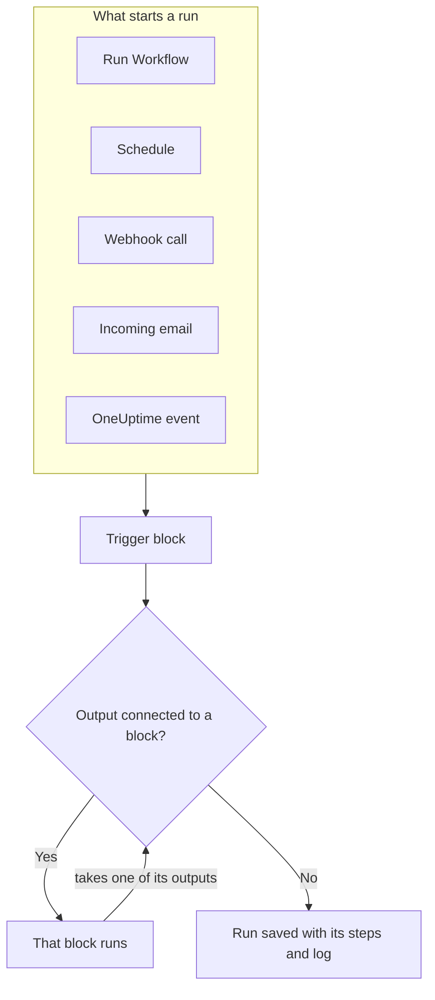
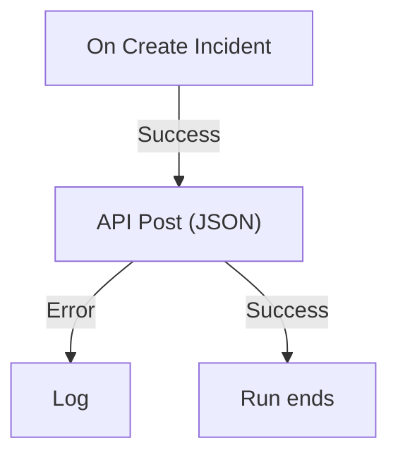

# Workflows Overview

Workflows automate work in OneUptime without code. You place blocks on a canvas, connect them, and the workflow runs on its own whenever its trigger fires: an incident is created, a schedule comes due, another tool calls a URL, or an email arrives. Use them to connect OneUptime to the rest of your stack and to take care of routine follow-up while you work on the problem itself.

:::cards
- [Authoring a Workflow](/docs/workflows/authoring): Create a workflow, then add, connect and set up its blocks on the canvas.
- [Triggers](/docs/workflows/triggers): Start a workflow by hand, on a schedule, from a webhook, an email or a OneUptime event.
- [Components](/docs/workflows/components): Every block you can add, from API calls to OneUptime records.
- [Runs](/docs/workflows/runs-and-logs): See what every run did, step by step.
:::

## How a workflow works

Every workflow has three parts:

1. **A trigger** — what starts the workflow: a manual run, a schedule, a webhook call, an incoming email, or an event in OneUptime such as a new incident. Every workflow has exactly one.
2. **Components** — what the workflow does: send a message, call an API, check a condition, create or update a OneUptime record.
3. **Connections** — the lines you draw from one block to the next. They decide what runs after what.

When the trigger fires, OneUptime starts a **run**. Each block ends by taking one of its outputs, such as **Success** or **Error**, **Yes** or **No**, and only the blocks connected to that output run next. When no block is connected to the output a block took, that path ends. The run is saved with its status, the path it took and what every block received and returned.



You build all of this visually on a canvas. Most workflows need no code at all; when one does, a **Run Custom JavaScript** block runs a few lines of JavaScript.

## What you can do with workflows

- **Connect OneUptime to your other tools** — post to Slack, Microsoft Teams, Discord, Telegram or IRC, create Jira tickets, or send a request to any API in your stack.
- **React to what happens in OneUptime** — when an incident is created, tell the right channel and open a ticket automatically.
- **Run jobs on a schedule** — every five minutes, every night, every Monday morning.
- **Receive data from outside** — let other systems start a workflow by calling its URL or emailing its address.
- **Reuse common automation** — build it once, and start it from any other workflow with an **Execute Workflow** block.

## Key terms

| Term                | What it means                                                                                         |
| ------------------- | ----------------------------------------------------------------------------------------------------- |
| **Workflow**        | The whole automation: a name, a canvas of blocks, and a switch to turn it on or off.                  |
| **Trigger**         | The first block. It decides when the workflow runs. Every workflow has exactly one.                   |
| **Component**       | Any other block: it sends a message, makes a request, checks a condition or changes a record.        |
| **Output**          | A dot on the bottom of a block, such as **Success** or **Error**. Lines from it lead to the next blocks. |
| **Run**             | One execution of the workflow, saved with its status, timestamps and what every block did.            |
| **Global variable** | A value, such as an API key, that you save once and use in any workflow of the project.              |

## Before you begin

- **A plan that includes workflows.** On OneUptime Cloud, workflows need the **Growth** plan or above, and each plan allows a number of runs every 30 days — see [Plan limits](/docs/workflows/configuration#plan-limits). Self-hosted installations without billing have neither limit.
- **Permission to build.** Creating and changing workflows takes **Workflow Admin**, **Project Admin** or **Project Owner**, or a custom role with the matching permissions. A **Workflow Member** can open workflows and run them by hand, but not change them. See [Permissions](/docs/workflows/configuration#permissions).

## Where to find workflows in OneUptime

Open **Products** in the top bar and choose **Workflows**, under **Dashboards & Automation**. Its menu holds:

- **Workflows** — your list of workflows. Create a new one or open an existing one.
- **Global Variables** — values shared across all your workflows.
- **Logs → Runs** — execution history across every workflow in your project.
- **Settings → Label Rules** and **Owner Rules** — label new workflows and assign their owners automatically.
- **Advanced → Archived** — workflows you archived. They never run and are left out of the list; unarchive them from here. See [Archiving a workflow](/docs/workflows/configuration#archiving-a-workflow).
- **Developer** — how to manage workflows with Terraform, the API or an AI assistant.

Open a single workflow and its own menu holds:

- **Overview** — name, description, labels, and the **Enabled** switch.
- **Builder** — the canvas where you design the workflow, with the **Enabled** switch at the top.
- **Workflow Variables** — values scoped to this one workflow.
- **Logs → Runs** — every run of this workflow, with details.
- **Owners** — the people and teams responsible for the workflow.
- **Developer** — how to manage this workflow with Terraform, the API or an AI assistant.
- **Settings** — duplicate, export and archive.

**Settings** sits in the menu's **Advanced** section with **Audit Logs** and **Delete Workflow**. **Advanced** and **Developer** start collapsed, in this menu and every other one, so the pages you use every day come first. Click a section's name to show its pages. It opens by itself whenever you are on one of them.

## Build your first workflow

Every workflow comes together the same way:

:::steps
1. **Create** — pick a starting point, then give your workflow a name. See [Authoring a Workflow](/docs/workflows/authoring).
2. **Pick a trigger** — manual, scheduled, webhook, incoming email, or an event from OneUptime. See [Triggers](/docs/workflows/triggers).
3. **Add components** — add actions to the canvas and connect them. See [Components](/docs/workflows/components).
4. **Turn it on** — switch **Enabled** on at the top of the **Builder**. A disabled workflow can't run at all, not even by hand.
5. **Test** — click **Run Workflow** on the **Builder** and watch the run as it happens.
:::

The example below follows these steps for a real workflow.

## Example: send new incidents to a webhook

This workflow sends a JSON summary of every new incident to a URL of yours — a ticketing system, a data warehouse, anything that accepts a webhook — and writes the reason to the run's log when the request fails.



> [!TIP]
> The **Forward new incidents to another system** template builds the same workflow for you. Find it under **Incidents** when you create a workflow.

:::steps
### Create the workflow

Open **Workflows** and click **Create Workflow**. Click **Start from scratch**, name the workflow `Send new incidents to a webhook`, and click **Create Workflow**.

The new workflow opens in the **Builder**, switched off.

### Add the trigger

Click the dashed **Choose what starts this workflow** block, then click **On Create Incident** under **Popular** in the **Add Trigger** panel.

The trigger takes the dashed block's place. The ID on it, `incident-on-create-1`, is how later blocks refer to it.

### Choose the incident fields

Click the trigger. In **Select Fields**, tick the fields the request should carry, such as the title and the description, and click **Save**.

The trigger passes the new incident on with these fields. A field you don't select arrives empty.

### Add the API block

Click **Add Component**, then click **API Post (JSON)** under **Popular**. Drag from the trigger's **Success** dot down to the top dot of the new block.

### Fill in the request

Click the API block, which says **Click to set up**. Put your endpoint in **URL**. In **Request Body**, write the JSON to send, using **{ }** to insert the incident's fields where you need them, and click **Save**.

```json title="Request Body"
{
  "id": "{{local.components.incident-on-create-1.returnValues.model._id}}",
  "title": "{{local.components.incident-on-create-1.returnValues.model.title}}",
  "description": "{{local.components.incident-on-create-1.returnValues.model.description}}"
}
```

Each `{{…}}` reference is replaced with the incident's value when the workflow runs. See [Variables](/docs/workflows/variables) for the syntax.

### Catch failures

Click **Add Component**, then click **Log**. Connect the API block's **Error** dot to it, then set the Log block's **Value** to `Could not send the incident: {{local.components.api-post-1.returnValues.error}}`.

A request that fails — an unreachable URL, or an answer that isn't 2xx — now takes this path, and the run's log says why.

### Turn it on

Switch **Enabled** on at the top of the **Builder**.

### Test it

Click **Run Workflow**, enter the **Incident ID** of an incident in this project, click **Run Workflow Manually**, and confirm with **Run**.

A **Workflow Run** panel opens and follows the run. Open the **API Post (JSON)** step to see the body it sent and the response it got.
:::

From now on, every new incident in the project starts a run. You'll find them all under the workflow's [Runs](/docs/workflows/runs-and-logs).

> [!NOTE]
> The request goes out from OneUptime. On OneUptime Cloud, the URL must be reachable from the internet. A self-hosted installation refuses private network addresses unless an administrator allows them — see [Outbound network access](/docs/workflows/configuration#outbound-network-access).

## How workflows fit with the rest of OneUptime

- **Monitors** spot the problem. **Incidents** and **alerts** record it. **Workflows** react to it.
- **Runbooks** are response procedures your team works through on an incident, an alert or a maintenance event: manual steps, approvals and scripts, with people in the loop. Workflows run unattended. Use a [runbook](/docs/runbooks/index) when a person needs to make decisions along the way, and a workflow when every step is automatic.
- **Workspace connections** link a project to Slack and Microsoft Teams for incident channels and notifications. The workflow Slack and Microsoft Teams blocks don't use them: each block posts through an incoming webhook URL of its own.

## Next steps

:::cards
- [Authoring a Workflow](/docs/workflows/authoring): Work with the canvas, the blocks and their settings.
- [Variables](/docs/workflows/variables): Pass data between blocks and keep secrets out of your workflows.
- [Configuration & Safety](/docs/workflows/configuration): Permissions, limits and security before you go live.
:::
