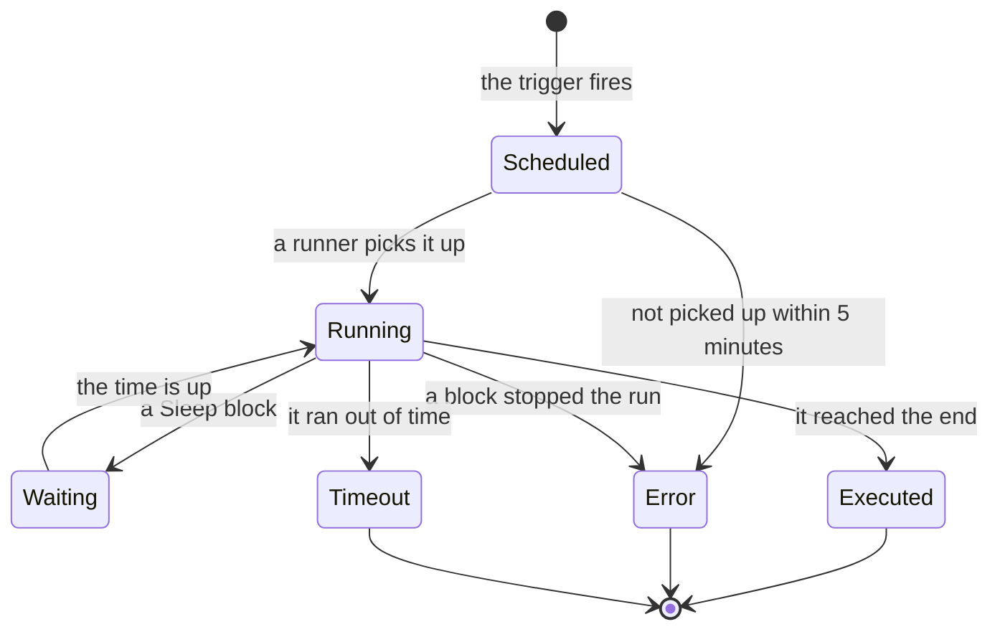

# Workflow Runs

Every time a workflow runs, OneUptime saves a record of what happened — when it ran, whether it worked, and what each block received and returned. That record is called a **run**. Runs are how you confirm a workflow worked, debug one that didn't, and look back at past activity.

:::cards
- [Run statuses](#run-statuses): What Scheduled, Waiting, Executed and the other statuses mean.
- [Reading a run](#reading-a-run): Follow the path a run took, block by block.
- [Troubleshooting](#troubleshooting): A workflow that didn't run, a block that never ran, a value that came through empty.
:::

## Where to find them

| Page                        | What you see                                                                                       |
| --------------------------- | -------------------------------------------------------------------------------------------------- |
| **Workflows → Logs → Runs** | Every run of every workflow in the project. Filter by workflow name, status and time.              |
| **Workflow → Logs → Runs**  | Just the runs of this one workflow. This one has a **Run ID** filter instead of a workflow filter. |
| **A single run**            | Opened with the **View Logs** button on a run row — run rows themselves aren't clickable.          |

Starting a run from the **Builder** opens the same **Workflow Run** view already following the run, so you can watch it happen rather than going looking for it afterwards.

## Run statuses

| Status                              | What it means                                                                                                                                                                                                                                                         |
| ----------------------------------- | --------------------------------------------------------------------------------------------------------------------------------------------------------------------------------------------------------------------------------------------------------------------- |
| **Scheduled**                       | The trigger fired and the run is queued for a runner. Usually a fraction of a second. A run still scheduled after 5 minutes fails: nothing picked it up.                                                                                                             |
| **Running**                         | The workflow is in progress.                                                                                                                                                                                                                                          |
| **Waiting**                         | The run is parked on a **Sleep** block and will resume on its own. It holds no worker while it waits.                                                                                                                                                                |
| **Executed**                        | The run reached the end without failing. This is the success state: the pill reads **Executed**, not "Success".                                                                                                                                                      |
| **Error**                           | A block stopped the run. Also used when a queued run is never picked up, when a sleeping run's resume is lost, when a schedule expression can't be resolved, and when the workflow was turned off or archived while the run waited on a **Sleep** block.             |
| **Timeout**                         | The run took longer than allowed: 2 minutes by default. See [How long a run can take](/docs/workflows/configuration#how-long-a-run-can-take).                                                                                                                       |
| **Execution Exceeded Current Plan** | The project has used up its workflow runs for the last 30 days, or the subscription is unpaid. The run is recorded but not executed. OneUptime Cloud only.                                                                                                           |

A block that takes its **Error** output — an API block answered with a 4xx, say — doesn't fail the run. The blocks connected to **Error** run, and the run still ends **Executed**. The step itself is drawn in red, so you can find it.

## Reading a run

Click **View Logs** on a run to open it. The **Workflow Run** view has two tabs, **Steps** and **Full Log**.

### The Steps tab

The path the run took, one numbered card per block, in the order they ran. Without opening anything, each card shows:

- The block's title and ID, whether it **Succeeded** or **Failed**, and how long it took.
- Which output it took, named as the canvas names it, and where that led: the next step's number and name, or a note that nothing is connected to it, so the run or that branch ended there. A step it led to that never ran says **(did not run)**. The Error output is drawn in red; Yes and No are just the way the run went. Hover the output's name for what it means.
- The step's error, if it failed, and any warning about it — for example a `{{…}}` reference that resolved to nothing.

Open a card for two blocks of detail:

| Block        | What it shows                                                                                                                                                                                                   |
| ------------ | --------------------------------------------------------------------------------------------------------------------------------------------------------------------------------------------------------------- |
| **Received** | The settings the block was given, by name and in the order its settings list them, after all variables were filled in. A setting that refers to another step or a variable shows the reference next to the value it became, and **Did not resolve** when it became nothing. |
| **Returned** | What it produced, with each value's ID (the last part of a `returnValues` reference). Lists and objects are shown indented.                                                                                    |

Failed steps, steps with a warning, and a run's only step start open. The **Steps** tab's count turns red when something failed and amber when a step has a warning.

A few runs read differently:

- **A test of one step.** A run started with **Run just this step** says **Only this step ran** at the top. The steps before it did not run, so values it reads from them are missing (expect a **Did not resolve** warning for those), and the steps after it say **(not run in this test)**. Use **Run Workflow** to try the whole path.
- **A run that stopped between steps.** If the run stopped for a reason no step explains — it timed out between steps, or failed before its first step — the path ends with **The run stopped here** and the reason.
- **A sleeping run.** A run waiting on a **Sleep** block ends with **Sleeping** and the time it carries on by itself; the steps after the Sleep say **(not run yet)**.

The ID under each step's title is exactly what goes in a `{{local.components.<id>.returnValues.…}}` reference, which makes this the fastest way to get a reference right.

The values shown are what the block received, after variables were filled in and before the block did anything with them, with two exceptions: secrets and fields the block marks sensitive are redacted, and a value longer than 4,000 characters is cut short with "… (truncated)". A run keeps its last 100 steps; a long or often-resumed run shows an amber note where the earlier ones were dropped. Runs recorded before output names were kept show the output by its ID, without where it led.

### The Full Log tab

The raw line-by-line log the runner wrote, including anything the blocks logged themselves, such as a **Log** block's value or a script's `console.log`. Use it when the Steps tab doesn't explain the failure.

## Copying and downloading a run

At the top of the **Workflow Run** view, beside its close button, **Copy log** puts the whole **Full Log** on your clipboard, ready to paste into a chat or a ticket. **Download** saves the run as a file:

| Download                 | What you get                                                                                                                                                                                                                           |
| ------------------------ | -------------------------------------------------------------------------------------------------------------------------------------------------------------------------------------------------------------------------------------- |
| **Download log**         | A `.txt` file with the full log exactly as the runner printed it, however long, under a short heading: the workflow's name and ID, the run ID, its status, and when it was scheduled, started and completed.                           |
| **Download run as JSON** | A `.json` file with the same facts as data, the steps the **Steps** tab shows (what each one received and returned, and which output it took), and the log as a list of lines. The steps are in the same shape the API returns a run's `stepTrace` in, and like the **Steps** tab they are the run's last 100. The log is always complete. |

The same two downloads are in the **⋯** menu of every run in both run lists, so you can save a run without opening it. A run you started from the **Builder** can be copied or downloaded while it is still going; you get what it has logged so far.

Files are named after the workflow, the run and when it started, in UTC, so a folder of them sorts by workflow and then by time: `nightly-sync-run-<run id>-2026-09-30T10-00-01.txt`.

A download holds nothing you could not already read in the run. Secrets and fields a block marks sensitive are redacted when the run is recorded, so they are redacted in the file too, and anyone who can open a run can download it.

## Troubleshooting

:::details My workflow didn't run
1. Make sure the workflow is **Enabled**: the switch is at the top of its **Builder**, which says so above the canvas when the workflow is off. New workflows start disabled, and a disabled workflow rejects every run — including manual ones. A webhook call to it gets HTTP 400 with a message saying how to turn it on.
2. For a OneUptime event trigger, confirm the event actually happened: open the record and check its history. An **On Update** trigger with **Listen on** fires only when one of those fields changed.
3. For a webhook trigger, confirm the other system is sending to the right URL. Most tools log when they send a webhook — check there.
4. For a schedule trigger, confirm the cron expression matches the time you expect. Schedules run in UTC.

If the run does appear, with the status **Execution Exceeded Current Plan**, the project has used all its workflow runs for the last 30 days, or the subscription is unpaid. The run's log names the count and your plan's limit. This applies to OneUptime Cloud only.
:::

:::details A later block never ran
A block that doesn't run is usually a wiring problem. Open the **Builder** and check:

- Is the earlier block's output connected to this block's input?
- Did the earlier block take a different output than you expected — **Error** instead of **Success**, or **No** instead of **Yes**? The **Steps** tab says which output it took and where that led, or that nothing is connected to it.
:::

:::details A value came through empty, or as {{…}} text
Open the run and look at the step. A reference that didn't resolve is called out on the step itself as a warning, and its setting in the **Received** block is marked **Did not resolve**.

- If you see the literal `{{local.components.…}}` text, the reference didn't resolve. Usually that's a typo in the component ID or the return-value ID — remember it's the block's **Identifier**, not the name displayed on it. Check the spelling of `local.components` itself too: `{{local.componets.api-get-1.returnValues.response-body}}` is sent as literal text and the run still reports **Executed**. If the run was a **Run just this step** test, the earlier block didn't run at all — run the whole workflow instead.
- If you see **Empty text**, the earlier block ran but didn't produce that field.

The same warning is in the **Full Log** tab as a line starting with `Warning:`.
:::

:::details It works when I run it by hand but not from the trigger
Open the **Builder**, click **Run Workflow**, and fill the trigger's fields with values that look like what the real trigger sends. Then compare that run's **Received** values with the real run's, side by side. The difference is usually a single field name or type.
:::

## Re-running a workflow

There's no "retry this run" button. Old runs are never re-run automatically, because their side effects — Slack messages, API calls, tickets — might not be safe to repeat. To redo the work, fix the workflow and let the next real trigger fire it, or open the **Builder** and click **Run Workflow** with the same values.

## How long are runs kept?

On OneUptime Cloud, runs are kept for **30 days** and then deleted — that's why both run lists describe themselves as covering the last 30 days. Self-hosted installations keep runs until you delete them; if a workflow runs very often and clutters your history, turn it off or delete it.

Runs recorded before step tracing was added have no **Steps** content and show only their **Full Log**.

## Next steps

:::cards
- [Configuration & Safety](/docs/workflows/configuration): Time limits, plan limits and what is hidden in logs.
- [Variables](/docs/workflows/variables): The reference syntax your blocks use.
- [Components](/docs/workflows/components): What each block returns and when it takes each output.
:::
