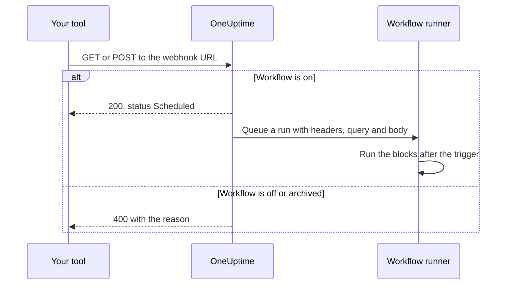
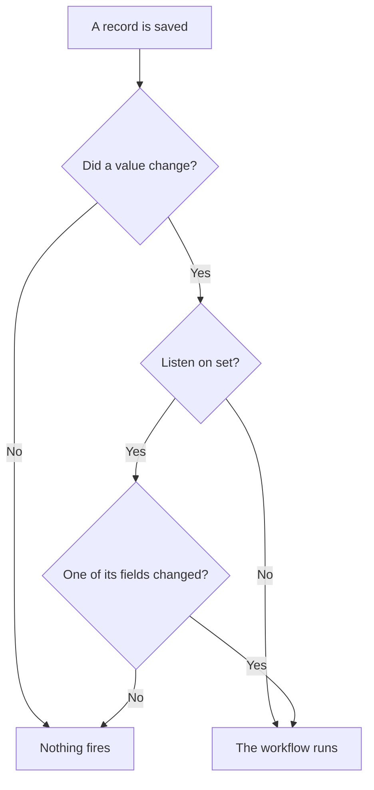

# Workflow Triggers

A trigger is the first block in a workflow — it decides when the workflow runs. Every workflow has exactly one trigger. You pick from five kinds.

:::cards
- [Manual](#manual): Start the workflow from the Builder, or from another workflow.
- [Schedule](#schedule): Run it on a repeating schedule, written as a cron expression.
- [Webhook](#webhook): Let another system start it by calling a URL.
- [Incoming Email](#incoming-email): Start it with every email sent to its own address.
- [OneUptime event triggers](#oneuptime-event-triggers): React when a record is created, updated or deleted.
:::

To add the trigger, click the dashed **Choose what starts this workflow** block on a new workflow's canvas. To change it, delete the trigger block, and the dashed block comes back. See [Authoring a Workflow](/docs/workflows/authoring#add-blocks).

## Which trigger should I use?

| If you want to…                     | Pick                |
| ----------------------------------- | ------------------- |
| Click a button to run the workflow  | **Manual**          |
| Run on a repeating schedule         | **Schedule**        |
| Have another system push data in    | **Webhook**         |
| Start from an email                 | **Incoming Email**  |
| React to something inside OneUptime | **OneUptime event** |

A workflow can only have one trigger. If you need two ways to start the same automation, build the shared logic in one workflow with a **Manual** trigger, and start it from two thin "wrapper" workflows with an **Execute Workflow** block.

## Manual

Run the workflow on demand: click **Run Workflow** on the **Builder** page, fill in the trigger's **JSON**, click **Run Workflow Manually**, and confirm with **Run**. Another workflow can start it too, with an **Execute Workflow** block.

Good for: one-click automations you want a button for, like "rotate this key" or "send a test alert", and logic you share between workflows.

**Returns**: **JSON** — what the run was started with.

- From **Run Workflow**, it is the JSON you typed, as text. To read one field of it, pass it through a **Text to JSON** block first.
- From an **Execute Workflow** block, each key of the block's **Arguments** is a value of its own. With `{"customerId": "42"}`, a later block reads `{{local.components.manual-1.returnValues.customerId}}`, where `manual-1` is the Manual trigger's ID.

## Schedule

Run the workflow on a repeating schedule. Set how often in **Schedule at**: pick one of the **Common schedules**, write a **Custom cron** expression, or choose a **Variable** that holds one. Under the field, the schedule is spelled out in words with its **Next runs**.

Good for: nightly cleanup, hourly sync, weekly reports.

Times are in UTC, so convert from your own time zone when you pick the hour. The five parts of a cron expression are the minute, the hour, the day of the month, the month and the day of the week:

| Expression    | Runs                              |
| ------------- | --------------------------------- |
| `*/5 * * * *` | Every 5 minutes.                  |
| `0 * * * *`   | Every hour, on the hour.          |
| `0 0 * * *`   | Every day at midnight UTC.        |
| `0 9 * * 1-5` | Every weekday at 9:00 UTC.        |
| `0 9 * * 1`   | Every Monday at 9:00 UTC.         |

Nothing is scheduled while the workflow is off. A **Variable** schedule reads a workflow or global variable, such as `{{local.variables.schedule}}`. If it doesn't come out as a valid cron expression, the workflow isn't scheduled, and a failed run in its run list says why.

To test the workflow without waiting for the schedule, click **Run Workflow** on the **Builder**: it starts a run straight away.

## Webhook

OneUptime gives the workflow a URL of its own. Anything that calls the URL starts the workflow, with the request's headers, query parameters and body passed in.

Good for: receiving data into OneUptime from another tool — CI/CD callbacks, alerts from other monitoring, signups in your CRM.

To get the URL, click the Webhook trigger on the canvas. The URL is at the top of its settings, with a **Copy URL** button, the methods it accepts, and a `curl` command you can paste into a terminal to try it:

```bash
curl -X POST "https://oneuptime.example.com/workflow/trigger/<secret key>" \
  -H "Content-Type: application/json" \
  -d '{"message": "Hello"}'
```

The URL accepts both `GET` and `POST`. The caller gets a quick acknowledgement, `{"status": "Scheduled"}` — the workflow itself runs in the background, so the caller never sees what it does. A call to a workflow that is turned off or archived is refused with HTTP 400 and the reason.



**Returns**:

| Value                    | What it holds                                                                                                   |
| ------------------------ | --------------------------------------------------------------------------------------------------------------- |
| **Request Headers**      | Every header of the request, by name in lower case, such as `content-type`.                                     |
| **Request Query Params** | The query string parameters in the URL, by name.                                                                |
| **Request Body**         | The body the caller sent. A JSON body, sent with `Content-Type: application/json`, can be read field by field. |

Read one field by adding its name to the reference, as in `{{local.components.webhook-1.returnValues.request-body.message}}`.

Once a request has arrived, the value picker in every block after the trigger knows what was in it: it lists the fields of the body, the headers and the query parameters, each with what it held, so you can pick `incident.title` instead of typing a path. Until then it says that no request has arrived, and offers **Copy test request**, a `curl` command for the URL; the fields show up once the run that request starts has finished. See [Using values from earlier blocks](/docs/workflows/authoring#using-values-from-earlier-blocks).

To test the workflow without the other tool, click **Run Workflow** on the **Builder** and type in headers, query parameters and a body.

### Keep the URL private

The last part of the URL is the workflow's secret key, and anyone who has the URL can start the workflow. So the key is masked until you click **Show**, and **Copy URL** copies the whole URL without showing it.

If the URL leaks, click **Reset URL** in the same place: the workflow gets a new URL, and the old one stops working at once, so update anything that calls it. Only people who can edit the workflow can see or reset its URL — see [Webhook security](/docs/workflows/configuration#webhook-security).

> [!WARNING]
> Treat the URL like a password. Anyone who has it can start your workflow, without signing in.

## Incoming Email

OneUptime gives the workflow an email address of its own. Every email sent to that address starts the workflow, with the email passed in: who sent it, who it was for, the subject, the text and HTML, the headers, and the names of any attachments.

Good for: acting on email from systems that can't call a webhook — alerts from older monitoring tools, a vendor's status notices, the report a nightly job mails out.

To get the address, click the Incoming Email trigger on the canvas. The address is at the top of its settings, with a **Copy address** button. Give it to whatever should start the workflow: a tool that can only send email, a vendor's notification settings, or a forwarding rule in your own mailbox.

Every email starts its own run. Email reaches the workflow whether the address is in To or CC, is a blind copy, or is reached through a forwarding rule. An email that names the address twice starts one run.

**Returns**:

| Value           | What it holds                                                                                          |
| --------------- | ------------------------------------------------------------------------------------------------------ |
| **From**        | The sender's address.                                                                                  |
| **To**          | Everyone the email was addressed to, as one line, such as `ops@example.com, oncall@example.com`.       |
| **CC**          | Everyone the email was copied to, as one line.                                                         |
| **Subject**     | The subject line.                                                                                      |
| **Body**        | The plain text of the email.                                                                           |
| **HTML Body**   | The email's HTML, when it has some. Body and HTML Body are each cut at 1 MB.                            |
| **Headers**     | Every header of the email, by its name in lower case, such as `message-id`.                            |
| **Attachments** | The name, type and size of each attached file. The files themselves are not kept.                      |
| **Received At** | When OneUptime received the email.                                                                     |

Once an email has arrived, the value picker in every block after the trigger knows what was in it: it lists each header and each attachment the email had, with what it held, so you can pick `headers.message-id` instead of typing a path. Until then it says that no email has reached the address yet. See [Using values from earlier blocks](/docs/workflows/authoring#using-values-from-earlier-blocks).

To try the workflow without sending an email, click **Run Workflow** on the **Builder** page and fill in a sender, a subject and a body. The values you leave out arrive empty.

Email starts the workflow only while it is on. Email to a workflow that is off is ignored, and so is email to a workflow whose trigger is no longer Incoming Email.

### Keep the address private

The part of the address before the `@` holds the workflow's secret key, and anyone who has the address can start the workflow. So the key is masked until you click **Show**, and **Copy address** copies the whole address without showing it.

If the address leaks, click **Reset address** in the same place: the workflow gets a new address, and email to the old one is ignored from then on, so give the new one to everything that emails the workflow. Only people who can edit the workflow can see or reset its address — see [Incoming email security](/docs/workflows/configuration#incoming-email-security).

> [!WARNING]
> Anyone can put any sender on an email, so **From** is not proof of who sent it. Check something only the real sender knows before a step does anything that matters.

> [!NOTE]
> On a self-hosted installation, OneUptime receives email through an inbound email provider that your administrator sets up — see [SendGrid Inbound Email](/docs/self-hosted/sendgrid-inbound-email). Until then the trigger has no address, and its settings say so.

## OneUptime event triggers

Almost every thing in OneUptime — monitors, incidents, alerts, scheduled maintenance events, status pages, on-call policies, teams — can trigger a workflow. Each offers up to three events:

- **On Create** — fires when a new one is added.
- **On Update** — fires when one is changed. Saving a record with the values it already has, such as a form saved without edits or a switch sent as it already stands, is not a change and does not fire it.
- **On Delete** — fires when one is deleted.

This is how you build "when X happens in OneUptime, do Y" without needing to check things in a loop.

**On Update** can be narrowed to some fields with **Listen on**: it then fires only when an update changes one of them, to any value — turning a switch off or clearing a field counts.



**On Create** and **On Update** pass the record to the next block, with the fields you pick in the trigger's **Select Fields**. For example, the **Incident → On Create** trigger passes the new incident, so the next block can read its title, description, severity, or any other field you selected, such as `{{local.components.incident-on-create-1.returnValues.model.title}}`. A field you didn't select comes through empty.

**On Delete** passes only the deleted record's ID: the record is gone by the time the workflow runs, so its other fields can't be read.

To test an event trigger without waiting for the event, click **Run Workflow** on the **Builder** and enter the ID of an existing record, such as an **Incident ID**. The run reads that record with the fields you selected.

### Events teams use most

| Resource                        | What teams do with it                                                        |
| ------------------------------- | ---------------------------------------------------------------------------- |
| **Incident**                    | React when an incident is declared, updated (acknowledged, resolved) or deleted. |
| **Alert**                       | The same three events, for alerts.                                           |
| **Monitor**                     | React when a monitor is added, edited or removed.                            |
| **Scheduled Maintenance Event** | Announce a maintenance window automatically when it's scheduled.             |
| **Status Page Subscriber**      | Welcome someone who subscribes to a status page.                             |
| **On-Call Policy**              | Sync policy changes to another roster system.                                |

In the **Add Trigger** panel these are under **OneUptime resources**: click the resource, then the trigger. **Browse all resources** has every one, and the search box finds a trigger from a few words, such as `incident created`.

## Next steps

:::cards
- [Components](/docs/workflows/components): The actions you add after the trigger.
- [Variables](/docs/workflows/variables): Read what the trigger passed in from later blocks.
- [Runs](/docs/workflows/runs-and-logs): Confirm your trigger fired, and see what it brought.
:::
