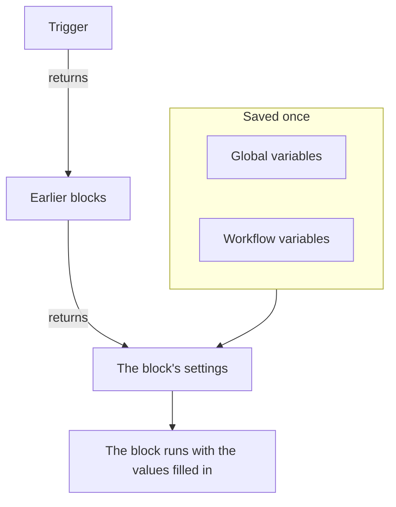
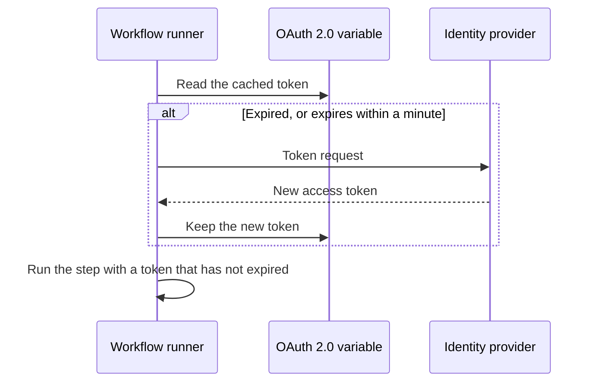

# Workflow Variables

Variables are how data moves through a workflow: from the trigger to the first block, from one block to the next, and from values you save once into every block that needs them. A block's setting reads a value with a reference in double braces, and the runner fills it in just before the block runs.

| Value                    | Where it comes from                                   | How a block reads it                                  |
| ------------------------ | ----------------------------------------------------- | ----------------------------------------------------- |
| **Global variable**      | Saved under **Workflows → Global Variables**          | `{{global.variables.NAME}}`                          |
| **Workflow variable**    | Saved on one workflow's **Workflow Variables** page   | `{{local.variables.NAME}}`                           |
| **An earlier block's value** | What the trigger or an earlier block returned in this run | `{{local.components.BLOCK_ID.returnValues.VALUE_ID}}` |



You rarely type a reference. Click **{ }** at the end of a setting, or type `{{` in it, and pick the value from a list. See [Using values from earlier blocks](/docs/workflows/authoring#using-values-from-earlier-blocks).

## Global variables

Project-wide values you save once and reuse in every workflow: API keys, URLs, channel names — anything you don't want to copy into ten different workflows.

:::steps
### Open Global Variables

Go to **Workflows → Global Variables** and click **Create Workflow Variable**.

### Name the variable

On the **Variable** step, fill in:

- **Name** — how you'll reference it. At least two characters, no spaces, and only letters, numbers, hyphens and underscores. `UPPER_SNAKE_CASE` is a good habit because it stands out in your blocks.
- **Description** — optional, free text to remind you what it's for.

Click **Next**.

### Give it a value

On the **Value** step, fill in:

- **Content** — the value itself. It's a long-text field, so multi-line values work.
- **Secret** — when on, the value is scrubbed out of run logs and step traces.

Click **Create Workflow Variable**. To change the name or description before you do, click **Variable** in the list of steps beside the form (shown on wider screens); what you typed in either step is kept.
:::

Use a global variable in any workflow with:

```text
{{global.variables.NAME}}
```

For example, if you saved your PagerDuty key as `PAGERDUTY_KEY`, any block can use it as `{{global.variables.PAGERDUTY_KEY}}` — the editor stores the reference, and workflow logging scrubs the resolved secret value.

The list shows each variable's name and description. Click **View** on a row to open the variable's page. It shows whether the variable is static or OAuth 2.0, and it's where you do everything else:

| Button                       | What it does                                                                                                                                     |
| ---------------------------- | ------------------------------------------------------------------------------------------------------------------------------------------------ |
| **Edit Variable**            | Changes the name, the description and — for a static variable that isn't secret yet — the secret flag. Once a variable is secret it stays secret. |
| **Update Content**           | Replaces a static value. The saved content can't be read back, so you type the new value in full.                                               |
| **Use in Workflows**         | Shows the exact reference to paste into your blocks, with a copy button.                                                                         |
| **Delete Workflow Variable** | Deletes it, after asking you to confirm. The confirmation names the variable, so you can check it is the one you mean.                          |

To create an **OAuth 2.0 access token** variable instead, open the **More** menu (**⋯**) next to **Create Workflow Variable** and choose **Create OAuth 2.0 Variable**. OAuth 2.0 variables have [their own section](#oauth-20-variables-tokens-that-refresh-themselves) below. A variable's type can't be changed after it's saved.

You can also update a variable over the API, which is covered [at the end of this page](#updating-a-variable-from-a-workflow). Global and workflow variables are a Growth plan feature.

## Local workflow variables

Variables scoped to one workflow, managed under **Workflow Variables** in that workflow's menu. They work the same way as global variables: **Create Workflow Variable** creates a static variable, the **More** menu (**⋯**) creates an OAuth 2.0 variable, and **View** opens a variable's own page. Reference them with:

```text
{{local.variables.NAME}}
```

Use one for a value only that workflow needs, such as a template's Slack webhook URL. Templates that ask for settings save them as workflow variables, so you can change them later without editing the blocks.

## OAuth 2.0 variables (tokens that refresh themselves)

A bearer token pasted into a static variable works until it expires, usually within the hour. After that, every run that uses it fails with `401 Unauthorized` until someone pastes a new one. An **OAuth 2.0 access token** variable stores what the OAuth token exchange needs instead of the token itself, and OneUptime keeps the token current.

You use it exactly like any other variable:

```http
Authorization: Bearer {{global.variables.CRM_API_TOKEN}}
```

### How the token stays fresh



- The first time a workflow uses the variable, OneUptime asks your identity provider's token endpoint for an access token and keeps it.
- Before every step that refers to the variable, the runner checks the token. If it has expired, or expires within the next minute, a new one is fetched before the step runs. The component always receives a token that hasn't expired, however long the variable sat unused and however long the run has been going.
- Only steps that actually refer to the variable trigger a refresh. A run that never uses a variable never fetches its token, and doesn't fail because that provider is down.
- When many runs need a new token at the same moment, one of them fetches it and the others use that one.
- If the provider doesn't say when a token expires (no `expires_in`, and the token isn't a JWT with an `exp` claim), OneUptime fetches a new one once per run and shares it between that run's steps.

### Grant types

| Grant type             | Use it for                                                                                                                                                                                                                                          |
| ---------------------- | --------------------------------------------------------------------------------------------------------------------------------------------------------------------------------------------------------------------------------------------------- |
| **Client Credentials** | OneUptime signs in as your application. The usual choice for server-to-server APIs such as Microsoft Graph, Auth0 or Okta APIs, or an internal service behind Keycloak.                                                                            |
| **Refresh Token**      | Delegated access on behalf of a user. Authorise the application once (for example in your provider's OAuth playground or with Postman) and paste the refresh token you get. OneUptime exchanges it for access tokens, and saves each new refresh token if your provider rotates them. A public client with no client secret works too. |

### Creating one

**Create OAuth 2.0 Variable** asks one thing per step:

1. **Variable**: the name workflows refer to it by, and a description.
2. **Provider**: pick your **Identity Provider** and OneUptime fills in its **Token URL**:

   | Identity Provider | Token URL it fills in |
   |---|---|
   | Microsoft Entra ID | `https://login.microsoftonline.com/{tenant-id}/oauth2/v2.0/token` |
   | Google | `https://oauth2.googleapis.com/token` |
   | Okta | `https://{your-domain}/oauth2/default/v1/token` |
   | Auth0 | `https://{your-domain}/oauth/token` |

   Replace the part in braces with your own value, such as your Directory (tenant) ID or your Okta domain. The form won't go on while the URL still has one. For any other provider, pick **Other provider** and enter its token endpoint yourself. Then pick the **Grant Type**. Picking Google selects **Refresh Token**, because Google's OAuth clients can't use Client Credentials. The provider only fills in the form; it isn't saved with the variable.
3. **Credentials**: the **Client ID** and **Client Secret** of the application you registered with the provider and, for the Refresh Token grant, the **Refresh Token**. A public client on the Refresh Token grant can leave the client secret empty.
4. **Advanced**, all optional:
   - **Scope**: space-separated. Leave it empty to get the provider's default scopes. For Client Credentials, Microsoft Entra ID needs a scope ending in `/.default` (such as `https://graph.microsoft.com/.default`) and Okta needs a custom scope.
   - **Additional Parameters**: extra form fields for the token request, such as `audience` for Auth0 (needed for Client Credentials) or `resource` for Azure AD v1. Anyone who can read the variable can read these, so don't put secrets here.
   - **Client Authentication**: whether the client ID and secret go in an HTTP Basic header (the default) or in the request body. If your provider answers `invalid_client`, try the other one.

Under some fields the form adds a line of help for the provider you picked, for example where Microsoft Entra ID shows your tenant ID, and that its client secret is the secret's **Value**, not its **Secret ID**.

When you save a new OAuth 2.0 variable, OneUptime fetches its first token straight away and tells you what the provider said. A typo in the secret or the URL shows up then, not hours later in a failed run. Fetching a token writes to the variable, so this needs permission to edit workflow variables; if you can create variables but not edit them, the first workflow run that uses the variable fetches its token instead.

The variable's page (click **View** on its row) has an **OAuth 2.0 Settings** card. **Edit Settings** walks the same **Provider** (token URL), **Credentials** (client ID) and **Advanced** (scope, additional parameters, client authentication) steps. **Next** walks on and **Save Changes** is on the last step. Every step is filled in already, so the step list beside the form opens any of them: change one setting on its step, then open the last step and save. The grant type is fixed once saved.

### The Access Token card

The **Access Token** card on an OAuth 2.0 variable's page shows one of:

| Status                 | What it means                                                                                                                        |
| ---------------------- | ------------------------------------------------------------------------------------------------------------------------------------ |
| **Valid**              | The cached token hasn't expired yet.                                                                                                 |
| **Expired**            | Normal for a variable no workflow has used lately. The next run that uses it fetches a new token.                                    |
| **Not fetched yet**    | No token has been fetched since the variable was created or its settings changed.                                                    |
| **No expiry reported** | The provider didn't say when the token expires, so each run fetches a new one.                                                       |
| **Refresh failed**     | The last attempt to get a token failed. The provider's reason is shown in full, with when it happened. The next successful refresh clears it. |

**Refresh now**, under the status, fetches a new token straight away. Use it to check new settings without running a workflow. **Update Credentials**, on the **OAuth 2.0 Settings** card, replaces the client secret or the refresh token, then fetches a token with them. Changing any setting (token URL, client ID, scope and so on) discards the cached token, so the next run fetches one with the new settings.

### When the provider says no

The step that needed the token fails before it runs, and the run log names the variable and quotes the provider's answer, for example `Could not get an OAuth 2.0 access token for {{global.variables.CRM_API_TOKEN}}: The token endpoint refused the request (HTTP 400): invalid_grant - Token has been expired or revoked.` The same reason appears on the variable's **Access Token** card. `invalid_grant` on a Refresh Token variable almost always means the refresh token itself has expired or been revoked, and **Update Credentials** is the fix.

If the refresh fails while the cached token hasn't actually expired yet (it was only inside the one-minute margin), the step goes ahead with the cached token and the log says so.

### Security

- OAuth 2.0 variables are always secret. The access token is replaced with `[REDACTED]` in run logs and step traces, including a token that was replaced partway through a run.
- The client secret, the refresh token and the access token are encrypted in the database and can never be read back through the API or the dashboard. **Refresh now** reports when the new token expires, never the token.
- The token URL has to be `http` or `https`. Requests to loopback, link-local and cloud metadata addresses are refused. On OneUptime Cloud, private network addresses are refused too. Self-hosted installs can reach an identity provider on their own network. OneUptime doesn't follow redirects on token requests, so point the Token URL at the address the endpoint actually answers on. A token request gives up after 20 seconds.

### Switching an existing static token to OAuth 2.0

A variable's type is fixed once it's saved. Delete the static variable and create an OAuth 2.0 variable with the **same name**. Workflows refer to variables by name, so they pick up the new one without any change.

## Component outputs (data from earlier blocks)

Every trigger and component can produce output during a run. Insert a reference with the **{ }** button in any setting, or by typing `{{` there, rather than typing it out — it inserts the exact IDs the runner expects, and shows the value as a chip naming the block and the value.

You can also start from the block that produces the value: its settings list each output under **Returns**, with the exact reference and a button to copy it.

Reference an earlier block's output like this:

```text
{{local.components.COMPONENT_ID.returnValues.FIELD_ID}}
```

`COMPONENT_ID` is the block's **Identifier** — the short ID shown on the block, not the name displayed on it. New blocks get one like `api-get-1`, and you can rename it in the block's **ID** section. Renaming it breaks every reference already pointing at it, the same way renaming a variable does. `FIELD_ID` is the ID of the value, and a path after it reads one field of a JSON value.

| After a block like…                                 | Read                                                                                   |
| --------------------------------------------------- | -------------------------------------------------------------------------------------- |
| An **API** block whose ID is `lookup-user`          | Its status code: `{{local.components.lookup-user.returnValues.response-status}}`. Its body: `{{local.components.lookup-user.returnValues.response-body}}`. |
| A **Run Custom JavaScript** block whose ID is `transform` | What it returned: `{{local.components.transform.returnValues.returnValue}}`.       |
| An **On Create Incident** trigger whose ID is `incident-on-create-1` | The incident's title: `{{local.components.incident-on-create-1.returnValues.model.title}}`. Record triggers return one value, `model`, and you drill into it. |

Block values only exist during the current run. Each new run starts fresh.

## Where variables work

Almost every text field accepts variables:

- The URL on an API block.
- The message text on Slack, Teams, Discord, Telegram, IRC, Email.
- The subject and body of an email.
- Headers and body fields (inside string values).
- Both sides of an **If / Else** block.

In JSON fields — **Data (JSON Object)**, **Query** and **Select Fields** on the record components, an API block's **Request Body**, the **Arguments** of **Run Custom JavaScript** — a reference is filled in for where it stands:

- **Inside quotes, it's text.** `{"title": "Down: {{local.components.ci-webhook.returnValues.request-body.service}}"}` puts the value in the string. Quotes, backslashes and line breaks in the value are escaped, so the JSON stays valid and the value stays one string.
- **On its own, it's the value itself.** `{"customFields": {{local.components.transform.returnValues.returnValue}}}` drops in the whole object, a list stays a list, and a number stays a number. Text that is JSON in itself — `5`, `true`, or an object a block returned as JSON text — goes in as that value. Any other text goes in as a string.

A reference inside a key's quotes is text too. If you need to build a structure dynamically, use a **Run Custom JavaScript** block to build it, then pass its output to the next block.

The **Run Custom JavaScript** block doesn't get variables automatically — nothing is injected into the sandbox. Put `{{global.variables.NAME}}` (or any component reference) into the block's **Arguments** JSON field; those values are substituted before the script runs and arrive as `args`.

## Looping over arrays

Inside a text field you can repeat a piece of text for every item of a list with `{{#each path}}…{{/each}}`. Within the block, `{{property}}` reads from the current item, `{{@index}}` is its 0-based position, and `{{this}}` is the item itself for lists of plain values. Names inside an `{{#each}}` block are trimmed, so stray spaces are harmless there — unlike everywhere else.

For example, this **Message Text** lists every alert a webhook sent:

```text title="Message Text"
{{#each local.components.ci-webhook.returnValues.request-body.alerts}}
- {{@index}}: {{name}} is {{status}}
{{/each}}
```

## Examples

### Building a payload from a webhook

A webhook arrives with a body like `{ "service": "checkout", "status": "failed" }`. To turn that into a OneUptime incident:

1. **Webhook** trigger with the ID `ci-webhook`.
2. **If / Else** block: **Value to check** is the `status` field of the webhook's Request Body (`{{local.components.ci-webhook.returnValues.request-body.status}}`), **Comparison** is **is equal to**, and **Compare with** is `failed`.
3. From the **Yes** branch, a **Create One Incident** block with:
   - Title: `CI build failed: {{local.components.ci-webhook.returnValues.request-body.service}}`
   - Description: `See {{local.components.ci-webhook.returnValues.request-body.url}} for the logs.`

### Using a secret in an API call

A workflow that calls PagerDuty:

1. Save `PAGERDUTY_KEY` as a secret global variable.
2. On the **API** block, set the `Authorization` header to `Token token={{global.variables.PAGERDUTY_KEY}}`.

The key stays out of the workflow and the logs.

### Chaining two API calls

The first call gives you an ID the second one needs:

1. **API** component `lookup-order`: in its **URL**, after `/orders?email=`, use **{ }** to insert the manual trigger's JSON with the path `email`.
2. **API** component `cancel-order`: `POST /orders/{{local.components.lookup-order.returnValues.response-body.id}}/cancel`.

If `lookup-order` fails, its **Error** output fires instead of **Success**. Connect that to an Email or Slack block so failures don't go unnoticed.

## Updating a variable from a workflow

A common pattern is rotating a credential on a schedule: fetch a fresh token from a third party, then store it back in the variable so the next run picks it up. Do that with an **API** block calling the OneUptime API.

If the credential is an OAuth 2.0 access token, you don't need to build this yourself. An [OAuth 2.0 variable](#oauth-20-variables-tokens-that-refresh-themselves) fetches and refreshes the token on its own.

Send `PUT /api/workflow-variable/<variable-id>` with an `ApiKey` header, and — this is the part that trips people up — the fields you want to change **wrapped in a `data` object**:

```json title="Request Body"
{
  "data": {
    "content": "{{local.components.get-token.returnValues.response-body.access_token}}"
  }
}
```

A flat body without the `data` wrapper is rejected with a 400. Send only the fields you actually want to change; `name` and `description` can stay out of the payload.

The API key needs **Edit Workflow Variables**. No read permission is required — the update doesn't read the row back.

Two things to watch:

- **Don't rename a variable you reference.** `name` is part of `{{local.variables.NAME}}`. Changing it leaves every existing reference unresolved, and an unresolved reference is passed through as literal text — see [Gotchas](#gotchas).
- **A variable can be written this way but never read back.** `content` is write-only over the API for every variable, secret or not. That's what makes a variable a safe place to park a rotating token. Marking it secret additionally keeps the value out of run logs and step traces.

## Gotchas

- **Use { } (or type `{{`).** It inserts the exact component, return-value and variable IDs the runner expects, and only offers values that exist when the block runs.
- **Variable names are case-sensitive.** `{{global.variables.MyKey}}` and `{{global.variables.mykey}}` are different.
- **A reference that doesn't resolve is left as-is, not blanked.** Referring to something that doesn't exist is not an error, and it doesn't give you an empty string either: the braces are passed straight through, so `{{local.components.api-get-1.returnValues.body}}` with a mistyped step ID ends up in your Slack message, URL or request body verbatim, and the run still reports **Executed**. The run's **Steps** tab shows a warning on the step naming any reference that slipped through, and marks the setting it was in **Did not resolve**; the run log carries the same warning line.
- **The issues panel can't check variable names.** It flags component references it can't match — an unknown step ID, an unknown return value, a malformed root — before you save. It can't tell whether a variable exists. A block's settings can: a reference to a missing variable shows there as an amber chip. Otherwise a renamed variable is caught only by the run log.
- **Spaces inside the braces are not trimmed.** `{{ local.variables.NAME }}` is a different lookup from `{{local.variables.NAME}}` and never resolves. The one exception is inside an `{{#each}}` block, where names are trimmed.

## Next steps

:::cards
- [Components](/docs/workflows/components): What every block needs and returns.
- [Runs](/docs/workflows/runs-and-logs): See the value every reference became on a run.
- [Configuration & Safety](/docs/workflows/configuration#secrets): Keep secrets out of blocks, exports and logs.
:::
