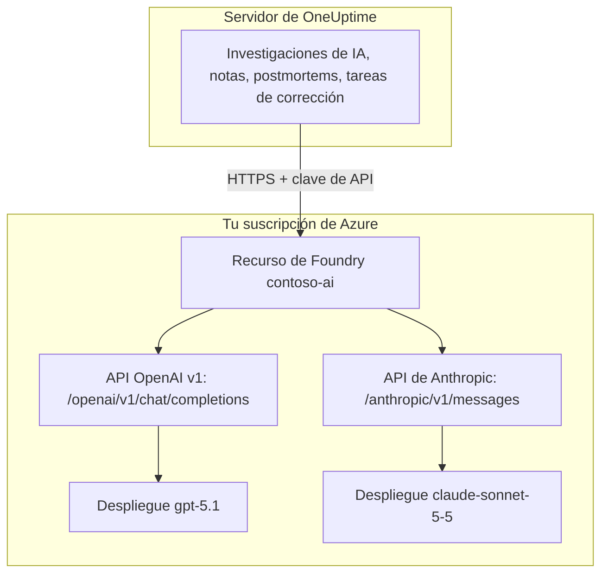

# Microsoft Foundry y Azure OpenAI

Ejecuta las funciones de IA de OneUptime con modelos que despliegas en Microsoft Foundry (antes Azure AI Foundry) o Azure OpenAI. OneUptime envía cada solicitud directamente a tu recurso en tu suscripción de Azure, así que los prompts y las respuestas los procesa el despliegue que elegiste, donde lo elegiste. Esta página te lleva de una suscripción vacía a un proveedor que funciona: el recurso de Azure, el despliegue del modelo, el punto de conexión y la clave, los ajustes de OneUptime, la red y qué hacer cuando una solicitud falla.

:::cards
- [Configurar Azure](#configurar-microsoft-foundry): Crear un recurso, desplegar un modelo, copiar su punto de conexión y su clave.
- [Conectar OneUptime](#conectar-oneuptime): Cuatro campos en los ajustes del proyecto y luego el botón Probar.
- [Autoalojado](#configurar-una-instancia-autoalojada-con-variables-de-entorno): Un proveedor para todos los proyectos, desde variables de entorno.
- [Solución de problemas](#solución-de-problemas): 401, 403, un despliegue que falta, una api-version.
:::

## Cómo funciona

OneUptime llama a tu recurso de Foundry por HTTPS desde el servidor de OneUptime, nunca desde el navegador de las personas. Cada solicitud lleva una de las claves de API del recurso y nombra el despliegue que debe responderla.



Un solo tipo de proveedor, **Azure OpenAI / Microsoft Foundry**, cubre todos los despliegues del recurso. La URL base le dice a OneUptime qué API llamar:

| Modelo que despliegas | API que llama OneUptime | URL base |
| --- | --- | --- |
| Modelos de OpenAI, como GPT-5.1 y GPT-4.1 | OpenAI v1 chat completions | `https://contoso-ai.openai.azure.com/openai/v1` |
| Foundry Models con chat completions, como DeepSeek y Grok | OpenAI v1 chat completions | `https://contoso-ai.services.ai.azure.com/openai/v1` |
| Claude | Anthropic Messages | `https://contoso-ai.services.ai.azure.com/anthropic` |

> [!IMPORTANT]
> Las funciones de IA de OneUptime llaman a herramientas: mientras trabajan, consultan tus monitores, incidentes y telemetría. Despliega un modelo que admita llamadas a herramientas (function calling). El botón **Probar** del proveedor lo comprueba por ti.

## Antes de empezar

Necesitas una suscripción de Azure, un rol que te permita crear y leer el recurso y un rol de OneUptime que pueda añadir proveedores de LLM.

| Para | Lo que necesitas en Azure |
| --- | --- |
| Crear el recurso | **Owner** o **Contributor** en el grupo de recursos, o **Foundry Account Owner** |
| Desplegar un modelo | **Owner** o **Contributor** en el grupo de recursos, o **Foundry Owner** o **Foundry Account Owner** en el recurso. Claude además necesita permiso para suscribirse a ofertas de Azure Marketplace |
| Leer las claves del recurso | Un rol con `Microsoft.CognitiveServices/accounts/listKeys/action`, como **Owner**, **Contributor** o **Cognitive Services Contributor** |

OneUptime en sí no necesita ningún rol de Azure. Una clave da por sí sola acceso a todos los despliegues del recurso, sin comprobar roles, así que trátala como una contraseña.

En OneUptime, añadir un proveedor a un proyecto requiere **Project Owner**, **Project Admin**, **Project Member**, **Settings Admin**, **Settings Member** o **Create LLM**. En su lugar, una instancia autoalojada puede registrar un proveedor para todos los proyectos desde variables de entorno, lo que requiere acceso al servidor.

## Configurar Microsoft Foundry

:::steps
### Crear un recurso

En el [portal de Foundry](https://ai.azure.com), crea un recurso de Foundry o elige uno que ya tengas. Un recurso de Azure OpenAI funciona igual. Anota el nombre del recurso: es la primera parte de su punto de conexión, como `contoso-ai` en `https://contoso-ai.openai.azure.com`.

Elige una región que ofrezca el modelo que quieres. Por ahora deja el acceso de red del recurso abierto a todas las redes; [Requisitos de red](#requisitos-de-red) explica cuándo y cómo cerrarlo.

### Desplegar un modelo

En el portal de Foundry, selecciona **Discover**, luego **Models**, y elige un modelo, por ejemplo `gpt-5.1` o `claude-sonnet-5-5`. Selecciona **Deploy** y luego **Custom settings**:

- **Deployment name**: Foundry pone el nombre del modelo. OneUptime pide el despliegue por este nombre, así que anótalo exactamente.
- **Deployment type**: decide dónde se procesan los prompts. Consulta [Dónde se procesan tus datos](#dónde-se-procesan-tus-datos).

Selecciona **Deploy** y espera a que el estado del despliegue sea **Succeeded**.

### Copiar el punto de conexión y una clave

En el [portal de Azure](https://portal.azure.com), abre el recurso y luego **Resource Management** > **Keys and Endpoint**. Copia el **Endpoint** y **KEY 1**. Guarda **KEY 2** para la rotación: cambia OneUptime a ella y luego regenera **KEY 1**.

En el portal de Foundry, la misma clave está en la pestaña **Details** del despliegue, junto a su **Target URI**.
:::

:::details ¿Prefieres la línea de comandos?
Los mismos pasos con la CLI de Azure. `--model-version` recibe una versión que el catálogo de modelos indica para el modelo.

```bash
az cognitiveservices account create \
  --name contoso-ai --resource-group oneuptime-ai \
  --kind AIServices --sku S0 --location eastus2 \
  --custom-domain contoso-ai

az cognitiveservices account deployment create \
  --name contoso-ai --resource-group oneuptime-ai \
  --deployment-name gpt-5.1 \
  --model-name gpt-5.1 --model-version <version> --model-format OpenAI \
  --sku-name GlobalStandard --sku-capacity 50

# KEY 1
az cognitiveservices account keys list \
  --name contoso-ai --resource-group oneuptime-ai \
  --query key1 --output tsv
```

Con `--custom-domain contoso-ai`, el punto de conexión del recurso es `https://contoso-ai.openai.azure.com`.
:::

## Conectar OneUptime

:::steps
### Abrir los proveedores de LLM

Ve a **Ajustes del proyecto** > **IA** > **Proveedores de LLM** y haz clic en **Crear Proveedor de LLM**.

### Ponerle nombre al proveedor

En **Información básica**, escribe un **Nombre**, como `Azure gpt-5.1`, y, si quieres, una **Descripción**. Haz clic en **Siguiente**.

### Completar los ajustes del proveedor

| Campo | Qué escribir |
| --- | --- |
| **Proveedor de LLM** | **Azure OpenAI / Microsoft Foundry** |
| **Clave de API** | **KEY 1** o **KEY 2** del recurso |
| **Nombre del modelo** | El nombre del despliegue, exactamente como lo muestra Foundry, como `gpt-5.1` |
| **URL base** | El punto de conexión del recurso con `/openai/v1`, como `https://contoso-ai.openai.azure.com/openai/v1`. Para Claude: `https://contoso-ai.services.ai.azure.com/anthropic` |

**Establecer como predeterminado**, en **Más campos**, está activado: las funciones de IA usan el proveedor predeterminado del proyecto. Haz clic en **Crear Proveedor de LLM**.

### Probar la conexión

Haz clic en **Probar** en la fila del proveedor. Un proveedor que funciona responde "Connection successful. The LLM provider responded to a test prompt and used tool calling." Si la prueba falla, el mensaje dice qué respondió Azure y qué cambiar; consulta [Solución de problemas](#solución-de-problemas).
:::

El proveedor terminado, como ejemplo:

```text
Nombre: Azure gpt-5.1
Proveedor de LLM: Azure OpenAI / Microsoft Foundry
Clave de API: <KEY 1 de contoso-ai>
Nombre del modelo: gpt-5.1
URL base: https://contoso-ai.openai.azure.com/openai/v1
```

A partir de ahora, las funciones de IA del proyecto usan este despliegue. En OneUptime Cloud, sus solicitudes no se pagan con los créditos de IA del proyecto: Azure las factura a tu suscripción.

## Formatos de la URL base

OneUptime acepta el punto de conexión en las formas en que lo muestran los portales de Azure y de Foundry, y envía cada solicitud a la dirección de al lado. Usa preferiblemente las cortas: la URL base admite hasta 100 caracteres.

| URL base | Las solicitudes van a |
| --- | --- |
| `https://contoso-ai.openai.azure.com` | `https://contoso-ai.openai.azure.com/openai/v1/chat/completions` |
| `https://contoso-ai.openai.azure.com/openai/v1` | `https://contoso-ai.openai.azure.com/openai/v1/chat/completions` |
| `https://contoso-ai.services.ai.azure.com/openai/v1` | `https://contoso-ai.services.ai.azure.com/openai/v1/chat/completions` |
| `https://contoso-ai.openai.azure.com/openai/deployments/gpt-4o` | `https://contoso-ai.openai.azure.com/openai/deployments/gpt-4o/chat/completions?api-version=2024-10-21` |
| `https://contoso-ai.services.ai.azure.com/anthropic` | `https://contoso-ai.services.ai.azure.com/anthropic/v1/messages` |

- **La API v1** (`/openai/v1`) es la API actual de Microsoft. No necesita `api-version`, toma el nombre del despliegue como modelo y sirve por igual a los modelos de OpenAI y a otros Foundry Models. Úsala para los proveedores nuevos.
- **Una URL de despliegue** (`/openai/deployments/<name>`) nombra el despliegue por sí misma, y Azure se guía por ese nombre en lugar del **Nombre del modelo**. OneUptime añade `api-version=2024-10-21` salvo que la URL base tenga su propia `api-version`. Los proveedores guardados así siguen funcionando como antes.
- **El Target URI de un despliegue**, pegado entero desde el portal de Foundry, también funciona, siempre que quepa en 100 caracteres.
- **Claude**: Foundry sirve Claude solo a través de la API Anthropic Messages, en la ruta `/anthropic` del recurso. OneUptime la llama con la misma clave. El tipo de proveedor **Anthropic** también llega a ella, con la misma URL base.

## Configurar una instancia autoalojada con variables de entorno

En una instancia autoalojada, las variables `GLOBAL_LLM_PROVIDER_*` registran al arrancar un proveedor de LLM global, que usa cualquier proyecto sin proveedor propio, incluidas las tareas de corrección con IA. El proveedor propio de un proyecto siempre va primero.

```bash
GLOBAL_LLM_PROVIDER_TYPE=AzureOpenAI
GLOBAL_LLM_PROVIDER_NAME=Azure gpt-5.1
GLOBAL_LLM_PROVIDER_BASE_URL=https://contoso-ai.openai.azure.com/openai/v1
GLOBAL_LLM_PROVIDER_MODEL_NAME=gpt-5.1
GLOBAL_LLM_PROVIDER_API_KEY=<KEY 1 of contoso-ai>
```

:::tabs
@tab Docker Compose
Añade las variables a `config.env` y vuelve a iniciar OneUptime de la misma forma en que lo iniciaste:

```bash
(export $(grep -v '^#' config.env | xargs) && docker compose up --remove-orphans -d)
```
@tab Kubernetes
Guarda la clave en un Secret y pasa las variables con el `extraEnv` global del chart:

```bash
kubectl create secret generic azure-foundry \
  --namespace oneuptime --from-literal=api-key='<KEY 1 of contoso-ai>'
```

```yaml title="values.yaml"
extraEnv:
  - name: GLOBAL_LLM_PROVIDER_TYPE
    value: AzureOpenAI
  - name: GLOBAL_LLM_PROVIDER_NAME
    value: Azure gpt-5.1
  - name: GLOBAL_LLM_PROVIDER_BASE_URL
    value: https://contoso-ai.openai.azure.com/openai/v1
  - name: GLOBAL_LLM_PROVIDER_MODEL_NAME
    value: gpt-5.1
  - name: GLOBAL_LLM_PROVIDER_API_KEY
    valueFrom:
      secretKeyRef:
        name: azure-foundry
        key: api-key
```

Después ejecuta `helm upgrade` con estos valores.
:::

El proveedor sigue a las variables: cambiarlas lo actualiza en el siguiente arranque, y quitar `GLOBAL_LLM_PROVIDER_TYPE` lo elimina. Si a este tipo le falta la clave o la URL base, el registro de arranque lo indica. Consulta [Proveedores de LLM](/docs/ai/llm-provider) para ver cada variable y cada tipo de proveedor.

## Requisitos de red

El servidor de OneUptime abre conexiones HTTPS, en el puerto 443, hacia el nombre de host del recurso, como `contoso-ai.openai.azure.com` o `contoso-ai.services.ai.azure.com`. Permite ese tráfico de salida en tu firewall o tu proxy.

- **OneUptime Cloud** llega al recurso por Internet, así que el recurso debe aceptar tráfico público. Para mantener el recurso fuera de Internet, autoaloja OneUptime.
- **Autoalojado, punto de conexión privado**: pon el recurso detrás de un punto de conexión privado en una red virtual a la que llegue el servidor de OneUptime, y vincula a ella las zonas DNS privadas `privatelink.openai.azure.com`, `privatelink.services.ai.azure.com` y `privatelink.cognitiveservices.azure.com`, para que el nombre de host habitual del recurso se resuelva a su dirección privada. La URL base no cambia.
- **Direcciones privadas**: una instancia autoalojada se conecta a direcciones privadas salvo que se defina `DATA_SOURCE_BLOCK_PRIVATE_ADDRESSES=true`. Un proveedor de LLM global se conecta a ellas en ambos casos.
- **Reglas de red del recurso**: en **Networking** del recurso, **Selected networks and private endpoints** deja fuera todo lo demás. Una solicitud que una regla rechaza falla con un 403.

## Dónde se procesan tus datos

El tipo de despliegue que eliges al desplegar el modelo decide dónde procesa Azure los prompts de OneUptime y las respuestas del modelo. Los datos almacenados en reposo se quedan en la geografía de Azure del recurso.

| Tipo de despliegue | Los prompts y las respuestas se procesan |
| --- | --- |
| Global Standard, Global Provisioned | En cualquier región de Azure |
| Data Zone Standard, Data Zone Provisioned | Solo dentro de la zona de datos: Estados Unidos, la Unión Europea o Asia-Pacífico |
| Standard, Regional Provisioned | Dentro de la geografía de Azure del recurso |

Los despliegues de Claude son **Hosted on Azure** o **Hosted on Anthropic**. Elige **Hosted on Azure** para que los prompts y las respuestas se queden en Azure. Consulta los [tipos de despliegue](https://learn.microsoft.com/en-us/azure/foundry/foundry-models/concepts/deployment-types) de Microsoft para más detalles.

## Ejemplo de solicitud y respuesta

Para comprobar un despliegue fuera de OneUptime, envíale con `curl` la solicitud que envía OneUptime:

:::tabs
@tab OpenAI v1 API
```bash
curl https://contoso-ai.openai.azure.com/openai/v1/chat/completions \
  -H "Content-Type: application/json" \
  -H "api-key: $AZURE_API_KEY" \
  -d '{
    "model": "gpt-5.1",
    "messages": [
      { "role": "user", "content": "Reply with the word: OK" }
    ]
  }'
```

La respuesta, abreviada:

```json
{
  "id": "chatcmpl-7R1nGnsXO8n4oi9UPz2f3UHdgAYMn",
  "object": "chat.completion",
  "model": "gpt-5.1",
  "choices": [
    {
      "index": 0,
      "finish_reason": "stop",
      "message": { "role": "assistant", "content": "OK" }
    }
  ],
  "usage": { "prompt_tokens": 12, "completion_tokens": 2, "total_tokens": 14 }
}
```
@tab Anthropic API
```bash
curl https://contoso-ai.services.ai.azure.com/anthropic/v1/messages \
  -H "Content-Type: application/json" \
  -H "x-api-key: $AZURE_API_KEY" \
  -H "anthropic-version: 2023-06-01" \
  -d '{
    "model": "claude-sonnet-5-5",
    "max_tokens": 1024,
    "messages": [
      { "role": "user", "content": "Reply with the word: OK" }
    ]
  }'
```

La respuesta, abreviada:

```json
{
  "id": "msg_01XFDUDYJgAACzvnptvVoYEL",
  "type": "message",
  "role": "assistant",
  "model": "claude-sonnet-5-5",
  "content": [{ "type": "text", "text": "OK" }],
  "stop_reason": "end_turn",
  "usage": { "input_tokens": 14, "output_tokens": 4 }
}
```
:::

Las solicitudes de OneUptime llevan más: sus instrucciones, la conversación, las herramientas que el modelo puede llamar y un límite de tokens. De la respuesta lee el texto, las llamadas a herramientas, por qué se detuvo el modelo y el uso de tokens, que **Ajustes del proyecto** > **IA** > **Registros de IA** muestra para cada solicitud. Los **Parámetros adicionales** del proveedor se añaden a cada solicitud.

## Microsoft Entra ID y recursos sin clave

OneUptime inicia sesión en el recurso con una de sus claves de API. Iniciar sesión con Microsoft Entra ID, como entidad de servicio o identidad administrada, aún no es compatible.

Si tu organización desactiva el acceso por clave en los recursos de IA (`disableLocalAuth`), las solicitudes fallan con `AuthenticationTypeDisabled`. Permite el acceso por clave en el recurso que usa OneUptime, o pon Azure API Management delante:

1. Importa el despliegue del recurso en API Management como una API de Azure OpenAI. API Management inicia sesión entonces en el recurso con su propia identidad administrada.
2. Establece `api-key` como nombre del encabezado de la clave de suscripción de la API.
3. En OneUptime, pon como **URL base** la dirección de la API en API Management para el despliegue, como `https://contoso-apim.azure-api.net/aoai/openai/deployments/gpt-5.1`, con la `api-version` que necesite el despliegue, como en cualquier URL de despliegue. Pon como **Clave de API** una clave de suscripción de API Management.

Los modelos de Claude que solo aceptan Microsoft Entra ID, como Claude Mythos, aún no se pueden usar.

## Solución de problemas

OneUptime pone al principio del error lo que hay que cambiar y, a continuación, la respuesta de Azure. El botón **Probar** lo muestra completo; los **Registros de IA** guardan los primeros 490 caracteres.

:::details "Azure did not accept the API key" (401)
La clave es incorrecta, se regeneró o pertenece a otro recurso. Copia de nuevo **KEY 1** desde **Keys and Endpoint** del recurso que indica la URL base y pégala en **Clave de API**.
:::

:::details "Key-based authentication is turned off for this resource" (403)
Azure respondió `AuthenticationTypeDisabled`: el recurso solo acepta Microsoft Entra ID. Consulta [Microsoft Entra ID y recursos sin clave](#microsoft-entra-id-y-recursos-sin-clave).
:::

:::details "Azure refused the request" (403)
Una regla de red del recurso dejó fuera la solicitud. Revisa los ajustes de **Networking** del recurso frente a los [requisitos de red](#requisitos-de-red).
:::

:::details "This resource has no deployment named ..." (404)
Azure respondió `DeploymentNotFound`. Pon en **Nombre del modelo** el nombre del despliegue exactamente como lo lista el portal de Foundry. Un despliegue creado en los últimos minutos puede no estar listo todavía. Si la URL base es una URL de despliegue, el nombre que hay que revisar es el que va después de `/openai/deployments/`.
:::

:::details "Azure found nothing at this address" (404)
La URL base no lleva a ninguna API de Azure OpenAI. Usa el punto de conexión del recurso con `/openai/v1`, como `https://contoso-ai.openai.azure.com/openai/v1`. El punto de conexión de inferencia de modelos del SDK Azure AI Inference retirado (`/models`) no lo es: usa `/openai/v1` en el mismo recurso.
:::

:::details "This model needs api-version ... or later" (400)
Una URL de despliegue pide `api-version=2024-10-21` salvo que indique otra, y los modelos más recientes, como la serie o y GPT-5, rechazan versiones tan antiguas. Cambia la URL base a la API v1, `https://contoso-ai.openai.azure.com/openai/v1`, con el nombre del despliegue como **Nombre del modelo**. O añade a la URL base la versión que indica Azure, como `?api-version=2024-12-01-preview`.
:::

:::details "Azure's v1 API takes no dated api-version" (400)
La URL base termina en `/openai/v1` y además tiene una `api-version` con fecha. Quita la `api-version` de la URL base.
:::

:::details "URL base no puede tener más de 100 caracteres."
Un Target URI con su `api-version` suele ser más largo. Usa el punto de conexión del recurso con `/openai/v1` y pon el nombre del despliegue en **Nombre del modelo**.
:::

:::details "...could not be reached" o "...host name could not be resolved"
El servidor de OneUptime no pudo conectarse al recurso. En OneUptime Cloud, el recurso debe ser accesible desde Internet. En una instancia autoalojada, comprueba que el servidor resuelve el nombre de host del recurso, mediante la zona DNS privada si hay un punto de conexión privado, y que se permite el HTTPS saliente.
:::

:::details Demasiadas solicitudes (429)
Se agotó la cuota de tokens por minuto del despliegue. Las funciones de IA esperan y vuelven a intentarlo, hasta diez intentos en unos cinco minutos, antes de informar del fallo; el botón **Probar** se rinde antes. Aumenta la cuota del despliegue en el portal de Foundry o cámbialo a otro tipo de despliegue.
:::

## Próximos pasos

:::cards
- [Proveedores de LLM](/docs/ai/llm-provider): Todos los tipos de proveedor y cómo un proyecto elige uno.
- [AI SRE](/docs/ai/ai-sre): Investigaciones que se ejecutan con este proveedor.
- [Ask AI](/docs/ai/ask-ai): Preguntas sobre tu sistema, respondidas en el panel.
:::
