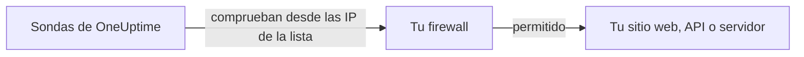

# Direcciones IP

Las sondas de OneUptime Cloud comprueban tus sitios web, API y servidores desde un conjunto fijo de direcciones IP. Si delante de lo que monitorizas hay un firewall o una lista de permitidos, permite estas direcciones para que las comprobaciones lleguen.



## Direcciones IP que hay que permitir

Permite en tu firewall el tráfico de estas direcciones:

{{IP_WHITELIST}}

> [!NOTE]
> Estas direcciones pueden cambiar. OneUptime te avisa con antelación cuando cambian. Para estar al día sin estar pendiente de los anuncios, [obtén la lista](#obtener-la-lista-mediante-programación) cada vez que actualices tu firewall.

## Obtener la lista mediante programación

La misma lista se sirve como JSON, sin necesidad de clave de API, para que un script mantenga al día las reglas de tu firewall:

```bash
curl -s https://oneuptime.com/ip-whitelist
```

```json
{
  "ipWhitelist": ["<list of IPs>"]
}
```

`ipWhitelist` es un array con una dirección por entrada. Para imprimir una dirección por línea, por ejemplo para pasarlas a un script de firewall:

```bash
curl -s https://oneuptime.com/ip-whitelist | jq -r '.ipWhitelist[]'
```

## OneUptime autoalojado

En tu propia instancia, esta página y el endpoint `/ip-whitelist` muestran las direcciones del ajuste `IP_WHITELIST` de la instancia, una lista separada por comas. Indica las direcciones desde las que tus propias sondas envían sus comprobaciones.

:::tabs
@tab Kubernetes
Define el valor `ipWhitelist` del chart de Helm:

```yaml title="values.yaml"
ipWhitelist: "203.0.113.1,203.0.113.2"
```
@tab Docker Compose
`config.env` no se lo pasa a la aplicación. Añádelo al entorno del servicio `app` en un `docker-compose.override.yml` junto a `docker-compose.yml` y vuelve a iniciar OneUptime:

```yaml title="docker-compose.override.yml"
services:
  app:
    environment:
      IP_WHITELIST: "203.0.113.1,203.0.113.2"
```
:::

Si no hay nada definido, esta página muestra **No IP addresses configured.** y el endpoint devuelve un array `ipWhitelist` vacío.

## Próximos pasos

:::cards
- [Sondas personalizadas](/docs/probe/custom-probe): Ejecutar una sonda dentro de tu propia red en lugar de abrir el firewall.
- [Crear un monitor](/docs/monitor/create-monitor): Empezar a comprobar un sitio web, una API o un servidor.
:::
