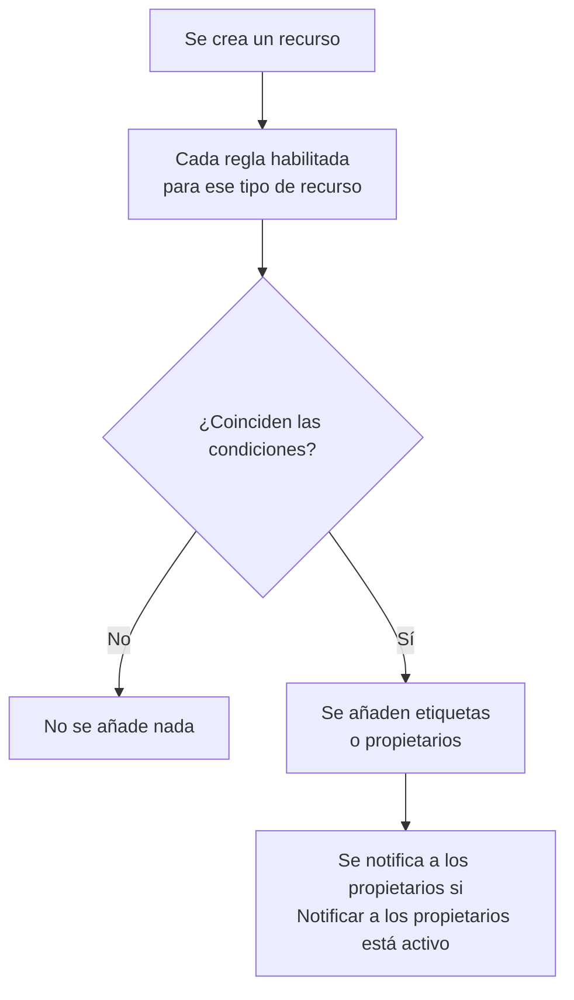

# Reglas de etiquetas y propietarios

Las reglas de etiquetas y las reglas de propietarios organizan tus recursos por ti. Una **regla de etiquetas** añade etiquetas a cada recurso nuevo que coincide con ella, y una **regla de propietarios** le añade usuarios y equipos como propietarios: así, un nuevo incidente de base de datos recibe la etiqueta _Base de datos_ y pertenece al equipo de bases de datos sin que nadie tenga que acordarse.

:::cards
- [Crear una regla](#crear-una-regla): Dos pasos: con qué coincide la regla y, después, qué añade.
- [Heredar etiquetas y propietarios](#heredar-etiquetas-y-propietarios): Transmitir lo que llevan los monitores, hosts y servicios de un evento.
- [Cuándo se ejecutan las reglas](#cuándo-se-ejecutan-las-reglas): Recursos nuevos, y **Ejecutar ahora** para los que ya tienes.
:::

## Cómo funciona

Las reglas se ejecutan cuando se crea un recurso. Cada regla habilitada comprueba sus condiciones sobre el recurso nuevo, y cada regla que coincide añade lo que añade.

Las etiquetas y los propietarios sirven para filtrar y agrupar recursos, deciden a quién avisa OneUptime sobre ellos y qué alcanzan los [permisos limitados por etiquetas o a los recursos propios](/docs/permissions/index). Las reglas los mantienen coherentes sin que nadie tenga que acordarse.

## Dónde encontrar las reglas

Cada producto con etiquetas y propietarios tiene ambas en sus **Ajustes** (en incidentes, alertas y mantenimiento programado, en **Reglas**): monitores, incidentes y episodios de incidentes, alertas y episodios de alertas, eventos de mantenimiento programado, páginas de estado, servicios, hosts, clústeres de Kubernetes, hosts de Docker, clústeres de Docker Swarm, hosts de Podman, clústeres de Proxmox, vCenters de VMware, clústeres de Ceph, cabinas de almacenamiento, bases de datos, colas, flotas de IoT, funciones serverless, recursos en la nube, aplicaciones RUM, paneles, políticas de guardia, horarios de guardia, políticas de llamadas entrantes, workflows, runbooks, dispositivos de red y SLO.

Por ejemplo, las reglas de etiquetas de monitores están en **Monitores → Ajustes → Reglas de etiquetas**, y las de incidentes en **Incidentes → Reglas → Reglas de etiquetas**. **Ajustes** y **Reglas** empiezan plegados en el menú lateral: haz clic en el título de la sección para abrirla. Las páginas de incidentes y alertas tienen una pestaña **Reglas de incidentes** (o **Reglas de alerta**) y una pestaña **Reglas de episodios**.

## Crear una regla

Todas las reglas de etiquetas y de propietarios se crean igual, en dos pasos.

:::steps
### Abrir la lista de reglas

Abre la página **Reglas de etiquetas** o **Reglas del propietario** del producto y haz clic en su botón de creación, que lleva el nombre de la regla, por ejemplo **Crear Regla de etiquetas de monitores**.

### Elegir con qué coincide la regla

En el paso **Coincidencia**, haz clic en **Añadir condición** por cada condición que deba cumplir el recurso. Con dos o más, elige **Coincidir con todas** o **Coincidir con cualquiera**. Una regla sin condiciones coincide con cualquier recurso nuevo.

### Elegir qué añade la regla

En el paso **Etiquetas**, elige las **Etiquetas a añadir**. En una regla de propietarios, el paso es **Propietarios**: **Añadir propietario** abre una sola lista de personas y equipos.

El **Nombre** se rellena a partir de lo que eliges (_Añadir Production_, _Añadir Platform como propietarios_) y sigue tus elecciones hasta que escribas un nombre propio. Una regla que solo hereda recibe en cambio el nombre de aquello de lo que hereda (ver más abajo).

### Revisar los campos plegados

**Más campos** contiene la **Descripción** opcional y, en una regla de propietarios, **Notificar a los propietarios**, que está activo por defecto: los propietarios que añade una regla reciben la misma notificación «se te ha añadido como propietario» que un propietario añadido a mano. Desactívalo para añadir propietarios sin avisar.

### Guardar la regla

En el último paso, vuelve a hacer clic en el botón con el nombre de la regla, por ejemplo **Crear Regla de etiquetas de monitores**. La regla empieza habilitada y la lista la muestra con una etiqueta verde **Habilitado**.
:::

Una regla nueva tiene que añadir algo: al menos una etiqueta (o un propietario) o, en una regla de incidentes, alertas o mantenimiento programado, algo que herede (ver más abajo). Para pausar una regla sin eliminarla, desactiva **Habilitado** en su formulario de edición; la lista mostrará entonces una etiqueta roja **Deshabilitado**.

### Se cree como se cree la regla

Lo mismo vale para una regla creada mediante la API, Terraform, un workflow o una [importación de reglas de etiquetas](/docs/configuration/label-rule-import-export): OneUptime rechaza una regla nueva que no añade nada, con un mensaje que nombra los campos que hay que rellenar. Estos mensajes están en inglés en todos los idiomas.

| Regla | Mensaje |
| --- | --- |
| Regla de etiquetas | This label rule adds nothing. Choose at least one label in Labels to Add. |
| Regla de etiquetas de incidentes, alertas o mantenimiento programado | This label rule adds nothing. Choose at least one label in Labels to Add, or turn on an Inherit Labels switch. |
| Regla de propietarios | This owner rule adds nothing. Choose at least one user or team in Owner Users or Owner Teams. |
| Regla de propietarios de incidentes, alertas o mantenimiento programado | This owner rule adds nothing. Choose at least one user or team in Owner Users or Owner Teams, or turn on an Inherit Owners switch. |

- **API**: establece `labelsToAdd` (o `ownerUsers` / `ownerTeams`) en al menos un registro del proyecto, o uno de los interruptores `inheritLabelsFrom…` (`inheritOwnersFrom…`) de la regla en `true`, un booleano JSON.
- **Terraform**: un recurso de regla de etiquetas o de propietarios que no añade nada falla en `terraform apply` con el mensaje anterior. Dale `labels_to_add` (o `owner_users` / `owner_teams`) o activa uno de sus interruptores de herencia.

Las reglas que ya tienes no se tocan: consulta [Editar una regla](#editar-una-regla).

## Heredar etiquetas y propietarios

Las reglas de incidentes, alertas y mantenimiento programado también pueden transmitir lo que llevan los recursos a los que afecta un evento. Bajo **Etiquetas a añadir** (o **Propietarios**), la sección plegada **Heredar etiquetas** (o **Heredar propietarios**) contiene seis interruptores:

- **Heredar etiquetas de los monitores**: cada etiqueta de los monitores del incidente se añade también al incidente. Una alerta tiene un solo monitor, así que en una regla de alertas el interruptor es **Heredar etiquetas del monitor** (y en una regla de propietarios de alertas, **Heredar propietarios del monitor**).
- **Heredar etiquetas de los hosts**, **Heredar etiquetas de los clústeres de Kubernetes**, **Heredar etiquetas de los hosts de Docker**, **Heredar etiquetas de los hosts de Podman** y **Heredar etiquetas de los servicios** hacen lo mismo con esos recursos.

Las reglas de propietarios tienen los mismos seis interruptores para propietarios (**Heredar propietarios de los monitores**, etc.). Mientras ningún interruptor está activo, la sección plegada explica para qué sirve; en una regla que hereda, se abre sola. Las reglas de episodios no tienen interruptores de herencia.

Una regla que hereda puede dejar vacío **Etiquetas a añadir** (o **Propietarios**): añade lo que hereda. Una regla así recibe el nombre de aquello de lo que hereda:

| Interruptores activos | Nombre |
| --- | --- |
| **Heredar etiquetas de los monitores** | _Heredar etiquetas de: monitores_ |
| **Heredar etiquetas de los monitores** y **Heredar etiquetas de los hosts** | _Heredar etiquetas de: monitores, hosts_ |
| **Heredar etiquetas del monitor**, en una regla de alertas | _Heredar etiquetas de: monitor_ |

El nombre sigue a los interruptores hasta que eliges una etiqueta (la regla pasa a llamarse según sus etiquetas) o escribes un nombre propio.

## Editar una regla

El formulario de edición de una regla tiene los mismos dos pasos y añade el interruptor **Habilitado**. No exige lo que añade la regla: una regla guardada antes de que OneUptime lo pidiera (mediante la API, Terraform, una importación o el formulario antiguo) puede no añadir nada, y una edición puede quitar todo lo que añade una regla.

Una regla así se puede seguir renombrando, desactivando o eliminando, también mediante la API y Terraform. La lista marca una regla que no añade nada con **No añade nada** junto a su estado, y lo mismo hace la página de la regla. Edítala para elegir qué añade, o elimínala.

## Cuándo se ejecutan las reglas

Cada regla habilitada se ejecuta cuando se crea un recurso, desde el panel o mediante la API, y cada regla que coincide añade lo que añade:

- Si coinciden varias reglas, todas añaden sus etiquetas y propietarios.
- Una regla nunca quita nada: ni etiquetas o propietarios que alguien añadió a mano, ni los que añadió ella misma.
- Una regla deshabilitada no hace nada.

Una regla que escribes hoy se aplica a los recursos creados después. Para aplicarla a los que ya tienes, usa **Ejecutar ahora**: consulta [Ejecutar reglas sobre recursos existentes](/docs/configuration/run-rules-now). Las reglas de etiquetas también se pueden copiar entre proyectos: consulta [Importar y exportar reglas de etiquetas](/docs/configuration/label-rule-import-export).

## Próximos pasos

:::cards
- [Ejecutar reglas sobre recursos existentes](/docs/configuration/run-rules-now): Aplicar una regla a los recursos que ya tienes.
- [Importar y exportar reglas de etiquetas](/docs/configuration/label-rule-import-export): Copiar reglas de etiquetas entre proyectos en JSON.
- [Configuración y automatización de incidentes](/docs/incidents/settings): Las demás reglas que puede ejecutar un incidente.
- [Reglas de etiquetas y propietarios de los SLO](/docs/slo/label-and-owner-rules): Con qué coinciden las reglas de los SLO.
:::
