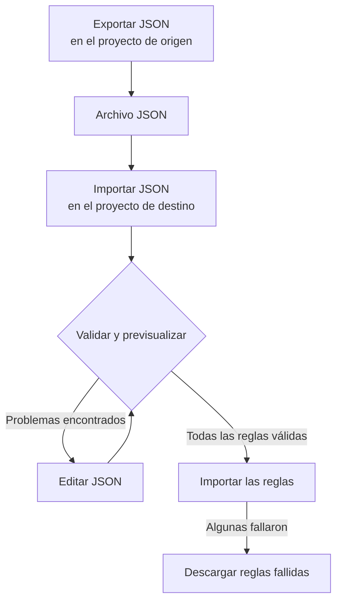

# Importar y exportar reglas de etiquetas

Copia reglas de etiquetas entre proyectos, o crea muchas a la vez, como un archivo JSON. Cada página **Reglas de etiquetas** tiene las acciones **Exportar JSON** e **Importar JSON** en su menú **Más opciones** (**⋯**), también en incidentes, alertas, monitores y dispositivos de red. La única excepción es VMware: sus reglas de etiquetas de vCenter no tienen ninguna de las dos.



## Exportar reglas

Abre **Más opciones** y selecciona **Exportar JSON** para descargar todas las reglas de ese tipo del proyecto actual. La exportación incluye las reglas de otras páginas de la tabla e ignora los filtros de la tabla.

El archivo conserva de cada regla su estado de habilitación, sus condiciones, las etiquetas que añade y sus opciones de herencia de etiquetas. Se omiten los ID de proyecto, los ID de regla y los campos de auditoría.

Las etiquetas, los monitores y las severidades vinculados se escriben con su nombre exacto. Una importación no los crea: deben existir ya en el proyecto de destino.

## Importar reglas

:::steps
### Abrir Importar JSON

Abre la página **Reglas de etiquetas** del proyecto de destino y selecciona **Más opciones → Importar JSON**.

### Añadir el archivo

Sube un archivo de exportación JSON o pega su contenido.

### Validar y previsualizar

Selecciona **Validar y previsualizar**. Cada regla se comprueba antes de crear ninguna, y los recursos a los que hace referencia deben existir en el proyecto de destino con nombres únicos y coincidentes.

### Revisar la vista previa

Comprueba los nombres de las reglas, su estado, sus etiquetas y sus condiciones. Un lote grande se muestra página a página. Para corregir algo, selecciona **Editar JSON** y valida de nuevo.

### Importar

Selecciona el botón de importación, que cuenta las reglas (por ejemplo **Importar 2 reglas**), y mantén la ventana abierta hasta que aparezcan los resultados.
:::

Las importaciones añaden reglas nuevas y conservan las existentes, así que importar otra vez el mismo archivo crea otra copia. A cada regla se le aplican los permisos de creación habituales y la validación del servidor.

Si algunas reglas fallan, selecciona **Descargar reglas fallidas** para guardar solo esas filas, corrígelas e importa ese archivo de nuevo. Si una solicitud agota el tiempo de espera, revisa la lista de reglas antes de reintentar: puede que el servidor haya guardado la regla antes de que se perdiera su respuesta.

## Crear un lote en JSON

Exporta una regla existente para obtener un ejemplo de tu tipo de recurso y luego edita o añade entradas en el array `items`. Este ejemplo crea dos reglas de etiquetas de monitores. Las etiquetas `Production` e `Infrastructure` deben existir ya en el proyecto de destino.

```json title="monitor-label-rules.json"
{
  "fileType": "oneuptime-label-rules",
  "schemaVersion": 1,
  "resourceType": "MonitorLabelRule",
  "items": [
    {
      "name": "Production API monitors",
      "description": "Label production API monitors automatically",
      "isEnabled": true,
      "monitorNamePattern": "^api-prod-",
      "monitorLabels": [],
      "labelsToAdd": ["Production"]
    },
    {
      "name": "Database monitors",
      "isEnabled": false,
      "monitorNamePattern": "^database-",
      "labelsToAdd": ["Infrastructure"]
    }
  ]
}
```

| Campo | Qué contiene |
| --- | --- |
| `fileType` | Siempre `oneuptime-label-rules`. |
| `schemaVersion` | Siempre `1`. |
| `resourceType` | El tipo de regla que contiene el archivo, como `MonitorLabelRule`. |
| `items` | Las reglas, un objeto cada una. Un archivo necesita al menos una. |

Usa booleanos JSON para `isEnabled`, texto para los patrones y arrays de nombres para los recursos vinculados.

Esto detiene todo el lote antes del paso de importación: patrones no válidos, campos desconocidos, nombres que faltan y referencias ambiguas. También una regla que no añade nada (un `labelsToAdd` vacío y, en una regla de incidentes, alertas o mantenimiento programado, ningún interruptor `inheritLabelsFrom…` en `true`), porque OneUptime se niega a crearla (consulta [Reglas de etiquetas y propietarios](/docs/configuration/label-and-owner-rules#se-cree-como-se-cree-la-regla)). Una exportación puede contener una regla así si se guardó antes de esa comprobación; dale una etiqueta o quítala del archivo antes de importar.

> [!NOTE]
> Los archivos y el JSON pegado están limitados a 10 MB.

## Copiar entre tipos de recurso

Mantén el `resourceType` original en el archivo y abre **Importar JSON** en la página de destino. Los patrones compatibles de nombre o título principal, los patrones de descripción y las etiquetas requeridas se asignan a los campos del destino, y la vista previa enumera esas asignaciones para que puedas revisarlas. Las referencias a severidades de incidentes y alertas se comparan con los nombres de severidad del destino.

Las condiciones o acciones que el destino no admite bloquean la importación. Por ejemplo, una regla de incidentes limitada a monitores concretos no se puede copiar a las reglas de dispositivos de red sin editar esas condiciones.

> [!WARNING]
> Las reglas de etiquetas de dispositivos de red y de SLO admiten comodines además de expresiones regulares. Una transferencia entre esas reglas y otros tipos de reglas rechaza los patrones que contienen `*` o espacios alrededor, porque allí coinciden de otra forma. Edita esos patrones para el destino o mantén la regla dentro del mismo tipo de recurso. Las reglas de etiquetas de dispositivos de red y de SLO pueden intercambiar cualquier patrón entre sí, porque coinciden de la misma forma.

## Próximos pasos

:::cards
- [Reglas de etiquetas y propietarios](/docs/configuration/label-and-owner-rules): Con qué coincide una regla de etiquetas y qué añade.
- [Ejecutar reglas sobre recursos existentes](/docs/configuration/run-rules-now): Aplicar las reglas importadas a los recursos que ya tienes.
:::
