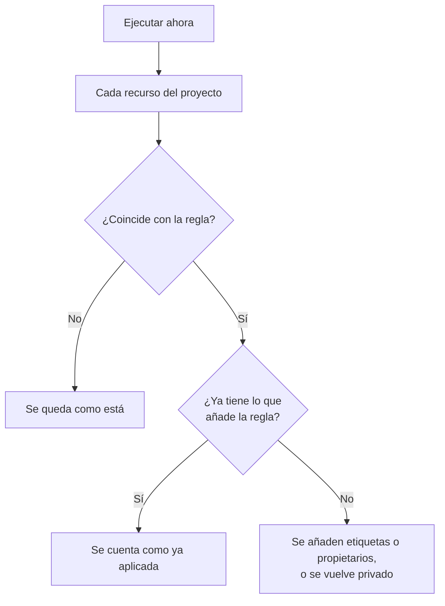

# Ejecutar reglas sobre recursos existentes

Las reglas de etiquetas, de propietarios y de privacidad se ejecutan automáticamente cuando se **crea** un recurso. Por eso, una regla que escribes hoy no cambia nada en los monitores, incidentes o hosts que ya tienes. **Ejecutar ahora** cierra esa brecha: aplica una regla a cada recurso que ya existe en el proyecto.

## Qué reglas se pueden ejecutar

- **Reglas de etiquetas** y **Reglas del propietario**, para cada recurso que las tiene: monitores, incidentes, episodios de incidentes, alertas, episodios de alertas, eventos de mantenimiento programado, páginas de estado, servicios, hosts, clústeres de Kubernetes, hosts de Docker, clústeres de Docker Swarm, hosts de Podman, clústeres de Proxmox, vCenters de VMware, clústeres de Ceph, cabinas de almacenamiento, bases de datos, colas, flotas de IoT, funciones serverless, recursos en la nube, aplicaciones RUM, paneles, políticas de guardia, horarios de guardia, políticas de llamadas entrantes, workflows, runbooks, dispositivos de red y SLO.
- **Reglas de privacidad**, para incidentes, alertas, episodios de incidentes y episodios de alertas.
- **Reglas de monitores** en una página de estado. Ya resincronizan la página cada vez que se guarda una regla; ejecutar una la resincroniza al momento.
- **Reglas de monitores** en un SLO. Ya resincronizan el SLO cada vez que se guarda una regla; ejecutar una resincroniza al momento los monitores del SLO. Consulta [Monitores y reglas de monitores](/docs/slo/monitor-rules).

Las reglas que realizan una acción en lugar de describir un recurso (**Reglas de guardia**, **Reglas de runbook**, **Reglas de remediación automática** y **Reglas de agrupación**) no se pueden ejecutar sobre registros existentes. Ejecutarlas avisaría a personas, ejecutaría runbooks, iniciaría correcciones o reorganizaría episodios de incidentes que ya terminaron.

## Antes de empezar

Para ejecutar una regla necesitas permiso para editar la regla **y** para editar los recursos que cambia: por ejemplo, una regla de etiquetas de monitores necesita tanto el permiso de edición de reglas de etiquetas de monitores como el de edición de monitores. Las reglas de propietarios necesitan además permiso para añadir propietarios. Las reglas de monitores de una página de estado o de un SLO solo necesitan permiso para editar la regla.

> [!IMPORTANT]
> Un permiso limitado a ciertas etiquetas, o a los recursos de los que eres propietario, no basta: una ejecución puede cambiar todos los recursos del proyecto. Las listas de bloqueo de los equipos se aplican como en cualquier otro sitio, y un bloqueo limitado a algunas etiquetas también cuenta: una ejecución cambiaría los recursos que llevan esas etiquetas, así que un bloqueo con etiquetas sobre la edición de los recursos que cambia una regla rechaza la ejecución.

Las reglas de una red piden lo mismo cuando las ejecutas sobre los dispositivos que ya tienes. **Ejecutar ahora** de una regla de asignación de sitio o de etiquetas de dispositivo necesita permiso para editar la regla y **Edit Network Device**. **Simulación** y **Ejecutar regla** de una regla de importación automática necesitan permiso para editar la regla, **Create Network Device** y, cuando la regla tiene una plantilla de monitor, **Create Monitor**. Cada uno debe abarcar todo el proyecto. Consulta [Importar automáticamente con reglas de importación automática](/docs/monitor/network-device-monitor#importing-automatically-with-auto-import-rules).

## Ejecutar una regla

:::steps
### Abrir la lista de reglas

Abre la página de reglas, por ejemplo **Monitores → Ajustes → Reglas de etiquetas**.

### Seleccionar Ejecutar ahora

Abre el menú **⋯** al final de la fila de la regla y selecciona **Ejecutar ahora**, o selecciona **Ver** y luego **Ejecutar ahora** en la página de la regla. Un cuadro de diálogo explica qué hará la ejecución.

### Decidir si avisar a los propietarios nuevos

En una regla de propietarios, elige si quieres **Notificar a los propietarios que añade esta ejecución**. Está desactivado por defecto y solo tiene efecto cuando la propia regla tiene activado **Notificar a los propietarios**. Un propietario recibe un aviso por cada recurso al que se le añade.

### Lanzar la regla

Selecciona **Ejecutar regla** y mantén abierto el cuadro de diálogo. En un proyecto grande, el cuadro de diálogo muestra cuánto ha avanzado la ejecución.

### Leer el informe

Cuando termina la ejecución, el cuadro de diálogo informa con cuántos recursos coincidió la regla, cuántos cambió y cuántos ya tenían lo que añade la regla.
:::

## Ejecutar varias reglas

Selecciona reglas en la tabla, abre el menú de acciones masivas y elige **Ejecutar ahora**. Las reglas seleccionadas se ejecutan una tras otra.

- Los propietarios añadidos por una ejecución masiva nunca reciben aviso. Para avisarles, ejecuta una sola regla.
- Una regla que no puede ejecutarse (por ejemplo, porque está deshabilitada) aparece con el motivo, y las demás reglas se ejecutan igualmente.

## Qué hace una ejecución

- **Solo añade.** Se añaden etiquetas, se añaden propietarios, los recursos se vuelven privados. No se quita nada ni se hace público nada, así que volver a ejecutar una regla es seguro: la segunda ejecución informa de que todo ya estaba aplicado.
- **Se evalúa cada recurso del proyecto**, incluidos los incidentes y las alertas resueltos.
- **Los propietarios existentes se omiten**, nunca se añaden dos veces.
- **Solo se añaden las etiquetas propias de tu proyecto.** Una etiqueta que nombra la regla y que ya no es una de las etiquetas de tu proyecto se omite, y las demás etiquetas de la regla se añaden igualmente. Lo mismo ocurre cuando una regla se ejecuta sobre un recurso nuevo.
- **La regla se aplica igual que al crear el recurso**, incluidas las etiquetas y los propietarios heredados de los monitores, hosts y servicios de un incidente. Si el recurso tiene un historial de actividad, el historial registra qué regla lo cambió.
- **Las reglas deshabilitadas no se ejecutan.** Habilita antes la regla.
- **Las reglas de monitores de las páginas de estado** añaden los monitores con los que coinciden y quitan los que añadieron antes y con los que ya no coinciden. Los monitores añadidos a mano a la página nunca se tocan.
- **Una sola ejecución abarca hasta 100.000 recursos.** En un proyecto más grande la ejecución se detiene y lo indica; vuelve a ejecutar la regla para continuar.

## Próximos pasos

:::cards
- [Reglas de etiquetas y propietarios](/docs/configuration/label-and-owner-rules): Escribir las reglas que aplica una ejecución.
- [Importar y exportar reglas de etiquetas](/docs/configuration/label-rule-import-export): Traer primero reglas de etiquetas de otro proyecto.
- [Configuración y automatización de incidentes](/docs/incidents/settings): Las reglas de incidentes, incluidas las de privacidad.
:::
