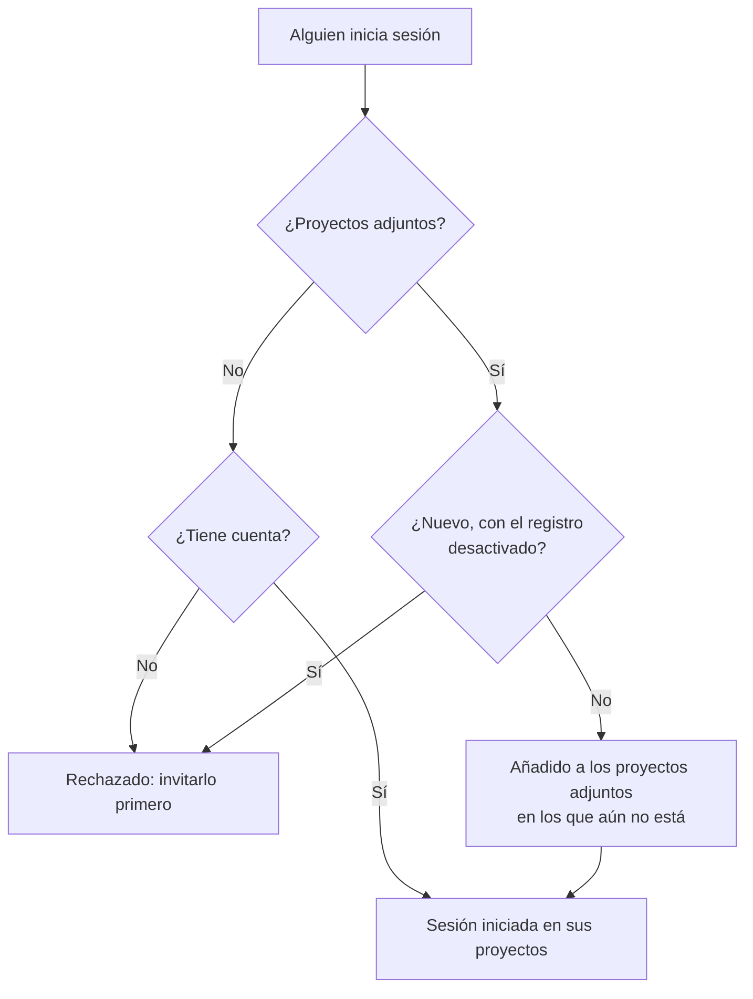

# SSO global

El SSO global permite que un **administrador de la instancia** de OneUptime (administrador maestro) configure **una sola vez**, a nivel de instancia, un proveedor de identidad SAML 2.0 u OpenID Connect (OIDC) y lo conecte a cualquier proyecto del servidor. En lugar de que cada propietario de proyecto configure su propio proveedor de identidad, un administrador maestro configura uno que sirve a toda la instancia.

> [!NOTE]
> El SSO global, incluido el interruptor "Require SSO for Login" para toda la instancia, forma parte de todas las ediciones de OneUptime: toda instancia autoalojada lo tiene, también la Community Edition, y no necesita licencia. Es administración de la instancia, así que no se aplica a OneUptime Cloud. Consulta [Edición Enterprise](/docs/self-hosted/enterprise) para ver qué incluye cada edición.

:::cards
- [Configurar un proveedor](#configurar-el-sso-global): Crearlo, dar a tu proveedor de identidad las URL de OneUptime y probarlo.
- [Cómo inician sesión los usuarios](#cómo-inician-sesión-los-usuarios): Solo miembros existentes, o recién llegados añadidos a los proyectos que adjuntas.
- [Imponer SSO](#imponer-sso): Exigir SSO en un proyecto o en toda la instancia.
- [Desactivar un proveedor](#desactivar-o-eliminar-un-proveedor): Qué termina y qué cambios rechaza OneUptime.
:::

## SSO global frente a SSO de proyecto

|                         | SSO de proyecto                                      | SSO global                                               |
| ----------------------- | ---------------------------------------------------- | -------------------------------------------------------- |
| Lo configura            | Propietario/administrador del proyecto (Ajustes del proyecto) | Administrador maestro de la instancia (Admin Dashboard) |
| Alcance                 | Un solo proyecto                                     | Toda la instancia, conectable a cualquier proyecto       |
| Resultado del inicio de sesión | Acceso a ese único proyecto                   | Acceso a todos los proyectos a los que llega el usuario  |

Para el proveedor propio de un solo proyecto, consulta [SSO](/docs/identity/sso).

## Configurar el SSO global

:::steps
### Abrir la lista de proveedores

:::tabs
@tab SAML
Inicia sesión como administrador maestro y abre el Admin Dashboard con **Ajustes de admin** en tu menú de usuario. Después ve a **Ajustes** > **Autenticación** > **Global SSO**.
@tab OpenID Connect
Inicia sesión como administrador maestro y abre el Admin Dashboard con **Ajustes de admin** en tu menú de usuario. Después ve a **Ajustes** > **Autenticación** > **Global OIDC**.
:::

### Crear el proveedor

:::tabs
@tab SAML
- Haz clic en **Create Global SSO**.
- Introduce un **Nombre**, la **Sign On URL** y el **Issuer** de tu proveedor de identidad, y pega el **Public Certificate**. Todo lo demás ya está completado en **Más campos**: el **Signature Method** (`RSA-SHA256`), el **Digest Method** (`SHA256`) y una descripción (`Sign in with` y el nombre). Cámbialos solo si tu IdP lo requiere. Al guardar se abre la página del proveedor.
@tab OpenID Connect
- Haz clic en **Create Global OIDC**.
- Introduce un **Nombre**, la **Issuer URL** y el **Client ID** y el **Client Secret** de la aplicación que registraste en tu IdP. También funciona pegar la URL de descubrimiento del IdP en **Issuer URL**. Todo lo demás ya está completado en **Más campos**: la **Discovery URL** (el emisor seguido de `/.well-known/openid-configuration`), los **Scopes** (`openid email profile`), los nombres de notificación `email` y `name`, y una descripción (`Sign in with` y el nombre). Cámbialos solo si tu IdP lo requiere. Al guardar se abre la página del proveedor.
:::

### Copiar las URL de OneUptime en tu proveedor de identidad

:::tabs
@tab SAML
En la página del proveedor, la tarjeta **Identity Provider URLs** muestra la **ACS URL (Assertion Consumer Service / Reply URL)** y el **Issuer (Entity ID)**. Pega ambos en tu proveedor de identidad (Okta, Microsoft Entra ID, OneLogin, JumpCloud y otros).
@tab OpenID Connect
En la página del proveedor, la tarjeta **Identity Provider URL** muestra la **Redirect URI (Callback URL)**. Añádela a las URI de redirección permitidas de tu proveedor de identidad.
:::

### Activar el proveedor

Un proveedor nuevo empieza desactivado. Haz clic en **Edit Configuration** en la página del proveedor y activa **Habilitado**.

Activar un proveedor global solo añade una opción "Sign in with SSO" en la página de inicio de sesión: nunca impone el SSO ni deja fuera a nadie, así que puedes activarlo, probarlo y volver a desactivarlo sin riesgo si hace falta.

### Probar el proveedor

Usa el enlace de la tarjeta **Test this SSO provider** (**Test this OIDC provider** en OpenID Connect) para hacer un inicio de sesión completo a través de tu proveedor de identidad. No necesitas adjuntar ningún proyecto antes: la prueba inicia tu sesión en los proyectos a los que ya perteneces. El proveedor debe estar activado para que el enlace funcione.
:::

## Cómo inician sesión los usuarios

El comportamiento de un proveedor global depende de si le adjuntas proyectos:

- **Sin proyectos adjuntos (todos los proyectos / invitar primero):** los usuarios pueden iniciar sesión con el proveedor y llegar a **cualquier proyecto del que ya sean miembros**. Los usuarios nuevos **no** se crean automáticamente: primero hay que invitar al usuario a un proyecto. Úsalo para un SSO de toda la empresa cuando las membresías se gestionan en otro sitio.

- **Proyectos adjuntos (aprovisionamiento automático):** Abre el proveedor y usa la tabla **Attached Projects** para adjuntar uno o más proyectos, cada uno con un conjunto de equipos predeterminados. Los usuarios que inician sesión se **aprovisionan automáticamente** en esos proyectos y se agregan a los equipos predeterminados en el primer inicio de sesión. Un proyecto que adjuntas empieza con su equipo de miembros; elige otros equipos si los recién llegados deben empezar con otro acceso. Agrega un proyecto + equipos a la vez para construir la lista; para cambiar un adjunto, elimínalo y vuelve a agregarlo.

Quien ya es miembro de un proyecto adjunto conserva los equipos que tiene allí.

Dos interruptores del proveedor cambian esto. Ambos empiezan desactivados, plegados en **Más campos**:

| Interruptor | Qué hace cuando está activado |
| --- | --- |
| **Disable Sign Up with SSO** | Las personas deben estar invitadas a un proyecto antes de poder iniciar sesión con este proveedor, aunque haya proyectos adjuntos. No se crea a nadie nuevo en su primer inicio de sesión. |
| **Restrict to Attached Projects** | Iniciar sesión con este proveedor cumple la exigencia de SSO solo en los proyectos adjuntos a él, así que quienes ya iniciaron sesión pueden perder el acceso a otros proyectos. Cuando está desactivado, la cumple en todos los proyectos a los que pertenece la persona, y los proyectos adjuntos solo deciden dónde se añaden los recién llegados. |

## Imponer SSO

Configurar un proveedor global no obliga a nadie a usarlo; el inicio de sesión con contraseña sigue funcionando. Para exigir SSO, activa la exigencia en un proyecto o en toda la instancia:

- **Por proyecto:** un proyecto puede exigir SSO y, opcionalmente, un proveedor *concreto* (de proyecto o global). Consulta [Exigir SSO en tu proyecto](/docs/identity/sso#exigir-sso-en-tu-proyecto).
- **En toda la instancia:** **Admin** > **Ajustes** > **Autenticación** tiene un interruptor **Exigir SSO para iniciar sesión** que impone el SSO a todos los usuarios de la instancia. Pide confirmación antes de activarse y se guarda en cuanto confirmas. Los administradores maestros quedan exentos para que nunca se queden fuera.

Activar **Exigir SSO para iniciar sesión** necesita un proveedor de SSO que inicie sesiones, para que nadie se quede fuera por ello:

- Para toda la instancia, cada proyecto que no exige SSO por sí mismo necesita uno: uno de sus propios proveedores SAML u OIDC que esté activado, o un proveedor global activado que inicie sesiones en él. Mientras un proyecto no tenga ninguno, activar el interruptor se rechaza y el mensaje nombra los proyectos (o, si son muchos, los primeros y cuántos son). Primero activa un proveedor global, o un proveedor en esos proyectos. Un proyecto que exige un proveedor concreto necesita ese: mientras esté desactivado, eliminado o no inicie sesiones en el proyecto, el mensaje nombra ese proyecto aparte; primero activa ese proveedor o exige otro allí.
- Para un proyecto, se pide lo mismo a ese proyecto, y al proveedor que exige si exige uno.
- Un guardado que envía **Exigir SSO para iniciar sesión** activado cuando ya lo está — con otros ajustes o desde la API — se comprueba igual, para la instancia o para un proyecto, y también uno que nombra el proveedor que un proyecto ya exige.
- Para un proyecto nuevo, que aún no tiene proveedor propio: mientras la instancia exija SSO, crear un proyecto necesita un proveedor global activado que inicie sesiones en todos los proyectos; de lo contrario nadie, ni siquiera quien lo crea, podría abrirlo. Sin él, la creación de un proyecto se rechaza y el mensaje pide a un administrador del servidor que active uno. Los administradores maestros pueden seguir creando proyectos. Un proyecto creado con **Exigir SSO para iniciar sesión** ya activado necesita lo mismo, lo cree quien lo cree.

Desactivarlo nunca se rechaza.

## Desactivar o eliminar un proveedor

Desactivar un proveedor global, eliminarlo o restringirlo a sus proyectos adjuntos pone fin a las sesiones que inició allí donde ya no inicia sesiones. Donde se exige SSO, quienes iniciaron sesión con él deben volver a iniciar sesión con SSO en su siguiente solicitud, las páginas que tienen abiertas dejan de recibir actualizaciones en directo al instante, y un cliente MCP que alguien conectó tras iniciar sesión con él deja de funcionar en el proyecto.

Volver a activar el proveedor no recupera esas sesiones: las personas vuelven a iniciar sesión con él. Un proveedor que ya estaba desactivado cuando actualizaste cuenta como desactivado en la actualización.

Un certificado o secreto de cliente nuevo, otras URL o un nombre nuevo mantienen a todos con la sesión iniciada.

### Todo proyecto que exige SSO mantiene una forma de entrar

Un proyecto que exige SSO, por sí mismo o porque lo exige toda la instancia, siempre conserva un proveedor con el que las personas pueden iniciar sesión en él. Por eso se rechazan estos cambios mientras dejarían a un proyecto así sin ningún proveedor, o le quitarían el proveedor que exige:

- desactivar un proveedor global, eliminarlo o restringirlo a sus proyectos adjuntos;
- en un proveedor restringido a sus proyectos adjuntos: adjuntar su primer proyecto (hasta entonces inicia sesiones en todos los proyectos), desactivar un adjunto, moverlo a otro proyecto u otro proveedor, o quitarlo.

El mensaje nombra los proyectos, o los primeros y cuántos son. Primero activa otro proveedor para ellos, uno propio o uno global, o desactiva allí **Exigir SSO para iniciar sesión**. Un proyecto que exige precisamente este proveedor se nombra aparte: primero exige otro proveedor allí o desactiva **Exigir SSO para iniciar sesión**.

Los cambios que permiten a un proveedor iniciar la sesión de más personas — activarlo o activar un adjunto, quitar la restricción — nunca se rechazan. Llegan al instante a todos los servidores de aplicaciones, igual que desactivar **Exigir SSO para iniciar sesión**: las personas pueden iniciar sesión con el proveedor enseguida. Solo cuando se guarda otro cambio del mismo proveedor en ese mismo momento puede un servidor de aplicaciones tardar hasta un minuto en seguirlo.

Dos cambios sobre quién puede iniciar sesión se comprueban uno tras otro. Si se está guardando otro en ese mismo momento y tarda más de lo habitual — activar **Exigir SSO para iniciar sesión** para toda la instancia lee todos los proyectos —, un cambio se rechaza con "Another change to who can sign in with SSO is being saved. Try again in a moment.": guárdalo de nuevo. Un proyecto creado en ese momento también espera al cambio, y si espera demasiado se rechaza con "The server's SSO settings are being changed. Create the project again in a moment."

## Solución de problemas

:::details "You must be invited to a project on this OneUptime instance before you can sign in with SSO"
La persona aún no tiene cuenta de OneUptime y el proveedor no crea ninguna: o no tiene proyectos adjuntos, o **Disable Sign Up with SSO** está activado. Invítala a un proyecto o adjunta un proyecto al proveedor.
:::

:::details "This SSO provider does not grant access to any project you are a member of"
**Restrict to Attached Projects** está activado y la persona no es miembro de ningún proyecto adjunto al proveedor. Adjunta uno de sus proyectos o añádela a un proyecto adjunto.
:::

:::details "You are not a member of any project on this OneUptime instance"
La persona tiene cuenta, pero no pertenece a ningún proyecto, y el proveedor no tiene dónde añadirla. Invítala a un proyecto o adjunta al proveedor un proyecto con equipos predeterminados.
:::

:::details "Issuer URL does not match"
En un proveedor SAML, el emisor de la respuesta de tu proveedor de identidad no es el **Issuer** guardado en el proveedor. Vuelve a copiarlo de tu proveedor de identidad; ambos deben coincidir exactamente.
:::

## Próximos pasos

:::cards
- [SSO](/docs/identity/sso): Configurar el proveedor SAML u OIDC propio de un proyecto.
- [SCIM](/docs/identity/scim): Deja que tu proveedor de identidad añada y quite personas automáticamente.
- [Usuarios, equipos y permisos](/docs/permissions/index): Lo que permiten hacer los equipos a los que se unen los recién llegados.
:::
