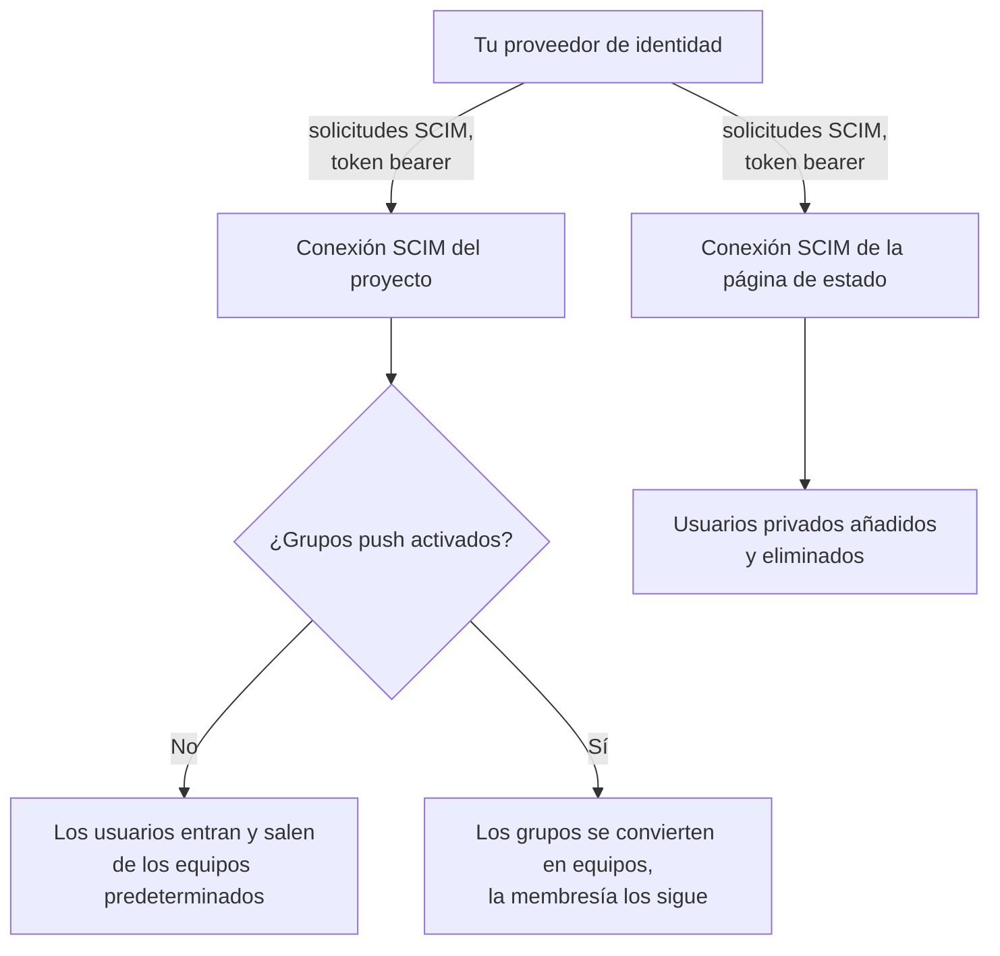
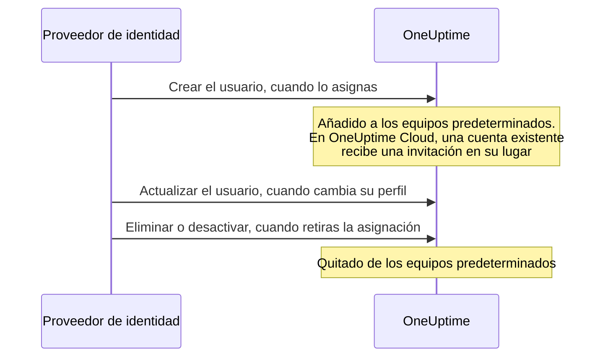

# SCIM

SCIM (System for Cross-domain Identity Management) aprovisiona y desaprovisiona personas automáticamente. Tu proveedor de identidad (IdP) — Microsoft Entra ID, Okta o cualquier otro sistema SCIM 2.0 — añade personas a tus proyectos de OneUptime y a tus páginas de estado privadas cuando se las asignas, y las quita cuando retiras la asignación.

> [!NOTE]
> **Edición:** SCIM forma parte de la Enterprise Edition de OneUptime. En OneUptime Cloud está disponible a partir del plan **Scale**. Las instalaciones autoalojadas necesitan la imagen de la Enterprise Edition y una licencia. Consulta [Edición Enterprise](/docs/self-hosted/enterprise). Sin una licencia válida (tras la prueba de 14 días, o 30 días después de que caduque una licencia), las solicitudes SCIM se rechazan hasta que se activa una licencia.

:::cards
- [Configurar SCIM de proyecto](#configurar-scim-de-proyecto): Crear una conexión y dar a tu IdP su URL y su token.
- [Configurar SCIM de página de estado](#configurar-scim-de-página-de-estado): Aprovisionar los usuarios privados de una página de estado.
- [Conectar tu proveedor de identidad](#configurar-tu-proveedor-de-identidad): Paso a paso para Microsoft Entra ID y Okta.
- [Preguntas frecuentes](#preguntas-frecuentes): Usuarios existentes, desaprovisionamiento, cambios de correo.
:::

## Cómo funciona

Tu proveedor de identidad llama al endpoint SCIM de OneUptime, autenticado con un token bearer, cada vez que asignas, cambias o retiras a alguien. Lo que cambia la solicitud depende de dónde esté la conexión:



La integración de SCIM ofrece estas ventajas:

- **Aprovisionamiento automático de usuarios**: los usuarios se crean en OneUptime cuando se les asigna en tu IdP.
- **Desaprovisionamiento automático de usuarios**: los usuarios se quitan de OneUptime cuando se retira su asignación en tu IdP.
- **Sincronización de atributos de usuario**: la información de los usuarios se mantiene igual en tu IdP y en OneUptime.
- **Gestión centralizada del acceso**: el acceso a OneUptime se gestiona desde tu sistema de gestión de identidades actual.

SCIM y el [SSO](/docs/identity/sso) son independientes: SCIM decide quién está en un proyecto, el SSO cómo inician sesión. La mayoría de las organizaciones usan ambos.

## SCIM para proyectos

El SCIM de proyecto permite a los proveedores de identidad gestionar los miembros de los equipos en los proyectos de OneUptime.

### Configurar SCIM de proyecto

Solo un propietario del proyecto puede añadir o cambiar la conexión SCIM de un proyecto, o ver o restablecer su token bearer: mediante SCIM, tu proveedor de identidad puede añadir personas a cualquier equipo del proyecto.
:::steps
1. **Ir a los ajustes del proyecto**

   - Abre tu proyecto de OneUptime
   - Ve a **Ajustes del proyecto** > **Seguridad** > **SCIM**

2. **Configurar los ajustes de SCIM**

   - Introduce un **Nombre**. **Equipos predeterminados** empieza con el equipo de miembros de tu proyecto: los usuarios nuevos se añaden a estos equipos
   - En **Más campos**, **Aprovisionar usuarios automáticamente** (añadir usuarios cuando se les asigna en tu IdP) y **Desaprovisionar usuarios automáticamente** (quitar usuarios cuando se retira su asignación en tu IdP) están activados, y **Habilitar grupos push** está desactivado. Cámbialos ahí si lo necesitas
   - Guarda. El cuadro de diálogo con la **SCIM Base URL** y el **Bearer Token** para la configuración de tu IdP se abre al instante

3. **Configurar tu proveedor de identidad**

   - Usa la **SCIM Base URL** del cuadro de diálogo. En OneUptime Cloud es `https://oneuptime.com/identity/scim/v2/<scim-id>`; una instalación autoalojada muestra su propio host
   - Configura la autenticación con token bearer usando el **Bearer Token** del cuadro de diálogo
   - Asigna los atributos de usuario (el correo es obligatorio). [Configurar tu proveedor de identidad](#configurar-tu-proveedor-de-identidad) tiene los detalles para Microsoft Entra ID y Okta
:::

Para volver a ver las URL, selecciona **Ver URLs de SCIM** en la fila de la conexión. **Restablecer token Bearer** sustituye el token; actualiza tu proveedor de identidad con el nuevo.

### Cómo se aprovisiona un usuario de proyecto



Quien ya tenía una cuenta de OneUptime se une cuando acepta la invitación en OneUptime Cloud (consulta las [preguntas frecuentes](#preguntas-frecuentes)). El acceso concedido por equipos ajenos a los equipos predeterminados de la conexión no se toca.

## SCIM para páginas de estado

El SCIM de página de estado permite a los proveedores de identidad aprovisionar y desaprovisionar los usuarios privados de páginas de estado, que pueden acceder a las páginas de estado privadas.

### Configurar SCIM de página de estado

:::steps
1. **Ir a los ajustes de la página de estado**

   - Abre **Páginas de estado** y selecciona tu página de estado
   - Ve a **Seguridad** > **SCIM**

2. **Configurar los ajustes de SCIM**

   - Introduce un **Nombre**. En **Más campos**, **Aprovisionar usuarios automáticamente** (añadir usuarios privados cuando se les asigna en tu IdP) y **Desaprovisionar usuarios automáticamente** (eliminar usuarios privados cuando se retira su asignación en tu IdP) están activados. Cámbialos ahí si lo necesitas
   - Guarda. El cuadro de diálogo con la **SCIM Base URL** y el **Bearer Token** para la configuración de tu IdP se abre al instante

3. **Configurar tu proveedor de identidad**

   - Usa la **SCIM Base URL** del cuadro de diálogo. En OneUptime Cloud es `https://oneuptime.com/identity/status-page-scim/v2/<scim-id>`
   - Configura la autenticación con token bearer usando el token proporcionado
   - Asigna los atributos de usuario (el correo es obligatorio)
:::

Para volver a ver las URL, selecciona **Mostrar URLs del endpoint SCIM** en la fila de la conexión.

El SCIM de página de estado solo admite usuarios. No admite grupos ni su aprovisionamiento.

### Cómo se aprovisiona un usuario privado

```mermaid title="La vida de un usuario privado con el SCIM de página de estado"
sequenceDiagram
    participant IdP as Proveedor de identidad
    participant O as OneUptime
    IdP->>O: Crear el usuario, cuando lo asignas
    Note over O: El usuario privado puede acceder<br/>a la página de estado privada
    IdP->>O: Eliminar, o poner active en false
    Note over O: Usuario privado y sus<br/>sesiones eliminados
```

> [!WARNING]
> El desaprovisionamiento elimina de forma permanente al usuario privado de la página de estado y todas sus sesiones en esa página de estado. Si el usuario se vuelve a asignar más adelante, se aprovisiona como un usuario privado nuevo. Cuando **Desaprovisionar usuarios automáticamente** está desactivado, las actualizaciones que ponen `active` en `false` se ignoran y las solicitudes DELETE se rechazan.

## Configurar tu proveedor de identidad

Cada proveedor de abajo empieza creando una conexión SCIM de proyecto en OneUptime y luego conecta tu proveedor de identidad a ella.

### Microsoft Entra ID (antes Azure AD)

Microsoft Entra ID ofrece gestión de identidades de nivel empresarial con aprovisionamiento SCIM. Necesitas:

- Un tenant de Microsoft Entra ID con licencia Premium P1 o P2 (necesaria para el aprovisionamiento automático).
- Un proyecto de OneUptime en el plan **Scale** o superior en OneUptime Cloud.
- Acceso de administrador a Microsoft Entra ID y a OneUptime.

:::steps
#### Crear la conexión SCIM para Entra ID

1. Inicia sesión en tu panel de OneUptime
2. Ve a **Ajustes del proyecto** > **Seguridad** > **SCIM**
3. Haz clic en **Crear SCIM**
4. Introduce un nombre descriptivo (por ejemplo, "Microsoft Entra ID Provisioning")
5. Revisa las opciones:
   - **Equipos predeterminados**: empieza con el equipo de miembros de tu proyecto; los usuarios nuevos se añaden a estos equipos
   - **Aprovisionar usuarios automáticamente** y **Desaprovisionar usuarios automáticamente**: activados, en **Más campos**
   - **Habilitar grupos push**: en **Más campos**; actívalo si quieres gestionar la membresía de los equipos con grupos de Entra ID
6. Guarda la configuración
7. Copia la **SCIM Base URL** y el **Bearer Token** del cuadro de diálogo que se abre; los necesitarás para Entra ID

#### Crear una aplicación empresarial en Entra ID

1. Inicia sesión en el [Microsoft Entra admin center](https://entra.microsoft.com)
2. Ve a **Identity** > **Applications** > **Enterprise applications**
3. Haz clic en **+ New application** y luego en **+ Create your own application**
4. Introduce un nombre (por ejemplo, "OneUptime")
5. Selecciona **Integrate any other application you don't find in the gallery (Non-gallery)** y haz clic en **Create**

#### Conectar Entra ID con OneUptime

1. En tu aplicación empresarial de OneUptime, ve a **Provisioning** y haz clic en **Get started**
2. Establece **Provisioning Mode** en **Automatic**
3. En **Admin Credentials**, establece **Tenant URL** en la **SCIM Base URL** de OneUptime (por ejemplo, `https://oneuptime.com/identity/scim/v2/<scim-id>`) y **Secret Token** en el **Bearer Token**
4. Haz clic en **Test Connection** para comprobar la configuración y luego en **Save**

#### Asignar los atributos de usuario en Entra ID

1. En la sección Provisioning, haz clic en **Mappings** y luego en **Provision Azure Active Directory Users**
2. Configura las siguientes asignaciones de atributos, quita las que no necesites y haz clic en **Save**:

| Atributo de Azure AD                                          | Atributo SCIM de OneUptime     | Obligatorio  |
| ------------------------------------------------------------- | ------------------------------ | ------------ |
| `userPrincipalName`                                           | `userName`                     | Sí           |
| `mail`                                                        | `emails[type eq "work"].value` | Recomendado  |
| `displayName`                                                 | `displayName`                  | Recomendado  |
| `givenName`                                                   | `name.givenName`               | Opcional     |
| `surname`                                                     | `name.familyName`              | Opcional     |
| `Switch([IsSoftDeleted], , "False", "True", "True", "False")` | `active`                       | Recomendado  |

#### Asignar los grupos en Entra ID (opcional)

Si activaste **Habilitar grupos push** en OneUptime:

1. Vuelve a **Mappings** y haz clic en **Provision Azure Active Directory Groups**
2. Establece **Enabled** en **Yes**
3. Configura las siguientes asignaciones de atributos y haz clic en **Save**:

| Atributo de Azure AD | Atributo SCIM de OneUptime |
| -------------------- | -------------------------- |
| `displayName`        | `displayName`              |
| `members`            | `members`                  |

#### Asignar usuarios y grupos en Entra ID

1. En tu aplicación empresarial de OneUptime, ve a **Users and groups**
2. Haz clic en **+ Add user/group**, selecciona los usuarios y grupos que se aprovisionarán en OneUptime y haz clic en **Assign**

#### Iniciar el aprovisionamiento en Entra ID

1. Ve a **Provisioning** > **Overview** y haz clic en **Start provisioning**
2. Empieza el ciclo de aprovisionamiento inicial; la primera sincronización puede tardar hasta 40 minutos
3. Revisa los **Provisioning logs** en busca de errores. Las personas que asignaste aparecen en los equipos del proyecto en OneUptime
:::

### Okta

Okta ofrece una gestión de identidades flexible con compatibilidad con SCIM. Necesitas:

- Un tenant de Okta con aprovisionamiento (la función Lifecycle Management).
- Un proyecto de OneUptime en el plan **Scale** o superior en OneUptime Cloud.
- Acceso de administrador a Okta y a OneUptime.

:::steps
#### Crear la conexión SCIM para Okta

1. Inicia sesión en tu panel de OneUptime
2. Ve a **Ajustes del proyecto** > **Seguridad** > **SCIM**
3. Haz clic en **Crear SCIM**
4. Introduce un nombre descriptivo (por ejemplo, "Okta Provisioning")
5. Revisa las opciones:
   - **Equipos predeterminados**: empieza con el equipo de miembros de tu proyecto; los usuarios nuevos se añaden a estos equipos
   - **Aprovisionar usuarios automáticamente** y **Desaprovisionar usuarios automáticamente**: activados, en **Más campos**
   - **Habilitar grupos push**: en **Más campos**; actívalo si quieres gestionar la membresía de los equipos con grupos de Okta
6. Guarda la configuración
7. Copia la **SCIM Base URL** y el **Bearer Token** del cuadro de diálogo que se abre; los necesitarás para Okta

#### Crear o abrir la aplicación de Okta

En la Okta Admin Console, ve a **Applications** > **Applications**:

- Si ya usas Okta para el SSO de OneUptime, abre esa aplicación.
- Si no, haz clic en **Create App Integration**, selecciona **SAML 2.0**, ponle el nombre "OneUptime" y completa la configuración SAML (consulta [SSO](/docs/identity/sso)).

#### Activar el aprovisionamiento SCIM en Okta

1. En tu aplicación de OneUptime, ve a la pestaña **General**
2. En la sección **App Settings**, haz clic en **Edit**, selecciona **SCIM** en **Provisioning** y haz clic en **Save**
3. Aparece una nueva pestaña **Provisioning**

#### Conectar Okta con OneUptime

1. En la pestaña **Provisioning**, haz clic en **Integration** y luego en **Configure API Integration**, y marca **Enable API integration**
2. Configura lo siguiente:
   - **SCIM connector base URL**: la **SCIM Base URL** de OneUptime (por ejemplo, `https://oneuptime.com/identity/scim/v2/<scim-id>`)
   - **Unique identifier field for users**: `userName`
   - **Supported provisioning actions**: Import New Users and Profile Updates, Push New Users, Push Profile Updates y, si usas aprovisionamiento basado en grupos, Push Groups
   - **Authentication Mode**: **HTTP Header**
   - **Authorization**: el **Bearer Token** de OneUptime. OneUptime espera la cabecera `Authorization: Bearer <token>`; si Okta ya muestra la palabra Bearer delante del campo, introduce solo el token
3. Haz clic en **Test API Credentials** para comprobar la conexión y luego en **Save**

#### Elegir qué aprovisiona Okta

1. En la pestaña **Provisioning**, haz clic en **To App** y luego en **Edit**
2. Activa **Create Users**, **Update User Attributes** y **Deactivate Users**, y haz clic en **Save**

#### Asignar los atributos de usuario en Okta

Desplázate hasta **Attribute Mappings** y revisa estas asignaciones. Quita las que no necesites:

| Atributo de Okta   | Atributo SCIM de OneUptime      | Dirección        |
| ------------------ | ------------------------------- | ---------------- |
| `userName`         | `userName`                      | De Okta a la app |
| `user.email`       | `emails[primary eq true].value` | De Okta a la app |
| `user.firstName`   | `name.givenName`                | De Okta a la app |
| `user.lastName`    | `name.familyName`               | De Okta a la app |
| `user.displayName` | `displayName`                   | De Okta a la app |

#### Enviar grupos desde Okta (opcional)

Si activaste **Habilitar grupos push** en OneUptime:

1. Ve a la pestaña **Push Groups** y haz clic en **+ Push Groups**
2. Selecciona **Find groups by name** o **Find groups by rule**
3. Busca y selecciona los grupos que quieres enviar y haz clic en **Save**

#### Asignar personas en Okta

1. Ve a la pestaña **Assignments**
2. Haz clic en **Assign** > **Assign to People** o **Assign to Groups**, selecciona a quién aprovisionar, haz clic en **Assign** para cada uno y luego en **Done**

#### Comprobar el aprovisionamiento en Okta

1. Ve a **Reports** > **System Log** en la Okta Admin Console y filtra por tu aplicación de OneUptime
2. Comprueba que los eventos de aprovisionamiento se completaron y que las personas aparecen en los equipos del proyecto en OneUptime
:::

### Otros proveedores de identidad

La implementación SCIM de OneUptime sigue la especificación SCIM v2.0 y funciona con cualquier proveedor de identidad compatible:

| Ajuste | Valor |
| --- | --- |
| SCIM Base URL | La **SCIM Base URL** de OneUptime: `https://oneuptime.com/identity/scim/v2/<scim-id>` para un proyecto, o `https://oneuptime.com/identity/status-page-scim/v2/<scim-id>` para una página de estado |
| Autenticación | Token HTTP Bearer |
| Identificador único de usuario | `userName`, que debe ser una dirección de correo válida |
| Operaciones | GET, POST, PUT, PATCH y DELETE para Users, en el SCIM de proyecto y de página de estado. Groups solo se admite en el SCIM de proyecto. |

## Referencia de la API de SCIM

Las rutas son relativas a la **SCIM Base URL** de la conexión.

| Endpoint                 | Métodos                 | Descripción                                               |
| ------------------------ | ----------------------- | --------------------------------------------------------- |
| `/ServiceProviderConfig` | GET                     | Capacidades del servidor SCIM                             |
| `/Schemas`               | GET                     | Esquemas de recursos disponibles                          |
| `/ResourceTypes`         | GET                     | Tipos de recursos disponibles                             |
| `/Users`                 | GET, POST               | Listar y crear usuarios                                   |
| `/Users/{id}`            | GET, PUT, PATCH, DELETE | Gestionar un usuario                                      |
| `/Groups`                | GET, POST               | Listar y crear grupos/equipos (solo SCIM de proyecto)     |
| `/Groups/{id}`           | GET, PUT, PATCH, DELETE | Gestionar un grupo (solo SCIM de proyecto)                |
| `/Bulk`                  | POST                    | Varias operaciones en una sola solicitud                  |

Lo que informa `/ServiceProviderConfig`:

| Capacidad | Compatible |
| --- | --- |
| PATCH | Sí |
| Bulk | Sí, hasta 1.000 operaciones y 1 MB por solicitud |
| Filtro | Sí, hasta 200 resultados |
| Ordenación | Sí |
| Cambio de contraseña | No |
| ETag | No |
| Autenticación | Token HTTP Bearer |

Un grupo que crea tu proveedor de identidad se convierte en un equipo con el mismo nombre en el proyecto; si ya existe un equipo con ese nombre, se usa en lugar de crear uno nuevo.

:::details Esquema de usuario de SCIM
```json
{
  "schemas": ["urn:ietf:params:scim:schemas:core:2.0:User"],
  "userName": "user@example.com",
  "name": {
    "givenName": "John",
    "familyName": "Doe",
    "formatted": "John Doe"
  },
  "displayName": "John Doe",
  "emails": [
    {
      "value": "user@example.com",
      "type": "work",
      "primary": true
    }
  ],
  "active": true
}
```
:::

:::details Esquema de grupo de SCIM
```json
{
  "schemas": ["urn:ietf:params:scim:schemas:core:2.0:Group"],
  "displayName": "Engineering Team",
  "members": [
    {
      "value": "user-id-here",
      "display": "user@example.com"
    }
  ]
}
```
:::

## Planes y licencias

En OneUptime Cloud, SCIM necesita el plan **Scale**. Una instalación autoalojada necesita la Enterprise Edition y una licencia, como indica la nota al principio de esta página.

### Por debajo del plan Scale

En OneUptime Cloud, el aprovisionamiento SCIM solo funciona por completo mientras el proyecto está en **Scale** o superior. Por debajo — cuando termina una prueba de Scale o se baja de plan — las conexiones SCIM del proyecto, y las de sus páginas de estado, solo quitan personas, así que quien se va sigue perdiendo su acceso:

- **Sigue funcionando:** desactivar un usuario (`active` en `false`, en una conexión configurada para quitar a las personas que desactiva), eliminar un usuario, quitar miembros de un grupo (el `Remove` de Entra ID sobre `members` con los miembros como valor, el `remove` de Okta sobre `members[value eq "..."]`, o sustituir los miembros por algunos de los que ya tiene el grupo), eliminar un grupo y una solicitud `Bulk` formada solo por `DELETE`. Las consultas también se responden — listar y filtrar usuarios y grupos, que es lo que hacen los proveedores de identidad antes de quitar a alguien —, pero por debajo del plan una consulta nunca crea a nadie.
- **Se rechaza:** crear un usuario o un grupo, reactivar un usuario (`active` en `true` para alguien a quien la conexión volvería a añadir a uno de sus equipos), añadir a alguien a un grupo en el que no está, y cambiar solo el correo o el nombre de un usuario o el nombre de un grupo. Una solicitud que añade a alguien se rechaza entera, aunque también quite personas, porque un `PATCH` de SCIM es todo o nada. El rechazo es un `402` con un error en formato SCIM, que tu proveedor de identidad muestra: `SCIM provisioning needs the Scale plan. This project's plan does not include it, so its SCIM connections can only remove people: requests that add or change people or groups are refused. The connections are kept: upgrade the project to Scale in Project Settings > Billing and they work fully again.` Cada rechazo aparece también en los registros SCIM de la conexión.
- **Una baja que también cambia un perfil** — una desactivación que envía un correo o un nombre nuevo, o una actualización de grupo que quita miembros y cambia el nombre del grupo — se aplica, y deja el correo, el nombre o el nombre del grupo como estaban. Los proveedores de identidad vuelven a enviar lo que ven distinto, así que un cambio rechazado una vez vuelve con sus solicitudes posteriores, y una baja nunca espera al plan. Una desactivación en una conexión que no quita a las personas que desactiva (desaprovisionamiento automático desactivado, o grupos enviados en su lugar) no quita a nadie, así que un correo o un nombre nuevo enviado con ella se rechaza como un cambio por sí solo.
- **Una solicitud que no cambia nada se responde como siempre** — el `PUT` de Okta de un usuario tal como está, con `active` en `true`, para alguien que ya está en todos los equipos de la conexión; añadir a alguien a un grupo en el que ya está; un correo enviado de nuevo con otras mayúsculas; atributos que OneUptime no guarda, como un cargo o un departamento. El usuario privado de una página de estado está en la página o no está, así que `active` en `true` nunca lo cambia.

No se elimina nada. Cambia al plan **Scale** y las conexiones vuelven a funcionar por completo tal como están, con el mismo token bearer y sin nada que volver a configurar en tu proveedor de identidad; un cambio de plan surte efecto en menos de un minuto. Los proveedores de identidad siguen llamando según su propio calendario: Okta muestra los rechazos entre sus errores de aprovisionamiento, y Entra ID los muestra en sus registros de aprovisionamiento y puede poner en cuarentena un trabajo que falla una y otra vez, lo que ralentiza sus sincronizaciones — también las bajas — a una al día aproximadamente. Reinicia allí el aprovisionamiento después de cambiar de plan, para que se aprovisionen las personas añadidas mientras tanto.

Por debajo de **Scale**, **Ajustes del proyecto** > **Seguridad** > **SCIM**, y la página **SCIM** de una página de estado, muestran las conexiones debajo de la oferta del plan (**Conexiones SCIM aún configuradas**) e indican que solo quitan personas. Elimina una conexión para quitarla. Añadir una conexión, cambiar una o sustituir su token bearer requiere **Scale**. La lista no muestra los tokens bearer, y solo los propietarios del proyecto pueden leer un token, en cualquier plan.

## Solución de problemas

Empieza por la pestaña **Registros** de **Ajustes del proyecto** > **Seguridad** > **SCIM** (o de la página **SCIM** de la página de estado). Muestra las solicitudes SCIM que envió tu proveedor de identidad, con su estado, y **Ver detalles** muestra la solicitud y lo que respondió OneUptime.

:::details Entra ID: falla Test Connection
Comprueba que **Tenant URL** sea la **SCIM Base URL** exactamente como la muestra OneUptime, y que **Secret Token** sea el **Bearer Token** actual. Después de **Restablecer token Bearer**, el token anterior deja de funcionar.
:::

:::details Okta: falla la prueba de las credenciales de la API, o las solicitudes reciben 401 Unauthorized
Comprueba la **SCIM connector base URL** y el token. OneUptime lee la cabecera `Authorization: Bearer <token>`, así que asegúrate de que la palabra Bearer se envía exactamente una vez. Si el token se perdió o se filtró, selecciona **Restablecer token Bearer** en OneUptime y actualiza Okta.
:::

:::details Los usuarios no se aprovisionan
Comprueba que los usuarios estén asignados a la aplicación en tu proveedor de identidad, que el aprovisionamiento esté activado allí y que las asignaciones de atributos sean correctas. En Entra ID, los **Provisioning logs** muestran cada error; en Okta, el **System Log**.
:::

:::details Usuarios duplicados en Okta
Asegúrate de que `userName` sea único y corresponda a la dirección de correo del usuario.
:::

:::details Fallos al enviar grupos
Comprueba que los grupos existan en tu proveedor de identidad y tengan los miembros correctos, y que **Habilitar grupos push** esté activado en OneUptime.
:::

:::details Los cambios de Entra ID tardan en llegar
Entra ID aprovisiona según su propio calendario: la primera sincronización puede tardar hasta 40 minutos, y las siguientes se ejecutan aproximadamente cada 40 minutos. Un trabajo que Entra ID ha puesto en cuarentena se sincroniza con menos frecuencia; corrige los errores de sus **Provisioning logs** y reinícialo.
:::

## Preguntas frecuentes

:::details ¿Qué pasa cuando se desaprovisiona a un usuario?
El desaprovisionamiento puede pedirse con una solicitud DELETE o poniendo `active` en `false` en una actualización PUT/PATCH:

- **SCIM de proyecto**: con **Desaprovisionar usuarios automáticamente** activado, el usuario se quita de los equipos predeterminados configurados en los ajustes de SCIM, mientras su cuenta de OneUptime se conserva. El acceso concedido por otros equipos no se ve afectado. Cuando los grupos push están activados, la membresía de los equipos se gestiona mediante el aprovisionamiento de grupos.
- **SCIM de página de estado**: con **Desaprovisionar usuarios automáticamente** activado, el usuario privado de la página de estado y todas sus sesiones en esa página de estado se eliminan de forma permanente. Esto no elimina una cuenta de usuario de proyecto de OneUptime aparte.
:::

:::details ¿Puedo usar SCIM sin SSO?
Sí, SCIM y SSO son funciones independientes. Puedes usar SCIM para aprovisionar usuarios y dejar que inicien sesión con sus contraseñas de OneUptime o con cualquier otro método de autenticación.
:::

:::details ¿Cómo gestiono los usuarios que ya existen en OneUptime?
Cuando SCIM intenta crear un usuario que ya existe (coincidiendo por correo electrónico), OneUptime no crea un usuario duplicado. Lo que ocurre después depende de dónde se ejecute OneUptime:

- **Autoalojado**: el usuario existente se agrega de inmediato a los equipos predeterminados configurados (o al equipo del grupo, con grupos push).
- **OneUptime Cloud**: Una cuenta de OneUptime pertenece a la persona, no a un proyecto concreto, así que SCIM no puede convertir a alguien en miembro de tu proyecto por su propia cuenta. En su lugar, el usuario existente es **invitado** a los equipos y recibe el correo de invitación habitual. Se une cuando acepta las invitaciones desde **Invitaciones del proyecto** en OneUptime, o cuando confirma el inicio de sesión único (SSO) de tu proyecto desde el correo que OneUptime envía en su primer inicio de sesión con SSO. Hasta entonces figura como pendiente. Lo mismo ocurre cuando un grupo agrega a un usuario existente que aún no es miembro de tu proyecto.

Los usuarios que crea el propio SCIM y los usuarios que son miembros de tu proyecto se agregan de inmediato en ambos casos. Confirmar el SSO de tu proyecto convierte a alguien en miembro, así que también se agrega de inmediato; quien haya dejado tu proyecto desde entonces vuelve a ser invitado.
:::

:::details ¿Puede SCIM cambiar la dirección de correo o el nombre de un usuario?
La dirección de correo electrónico de una cuenta de OneUptime es con la que esa persona inicia sesión en todos los proyectos a los que pertenece, y adonde llegan sus enlaces para restablecer la contraseña. Por eso:

- **OneUptime Cloud**: SCIM nunca cambia una dirección de correo electrónico. Una solicitud que la cambiaría se rechaza con un error SCIM `400` de tipo `mutability` y no se aplica nada de esa solicitud; tu proveedor de identidad muestra el motivo. Pide al usuario que cambie su dirección desde su propio perfil de OneUptime. Una solicitud que repite la dirección que la cuenta ya tiene no es un cambio y se completa correctamente.
- **Autoalojado**: SCIM cambia la dirección de correo electrónico solo de un usuario que se ha unido a este proyecto, no pertenece a ningún otro proyecto y no es administrador de OneUptime. Cualquier otro cambio se rechaza de la misma manera.

Los nombres siguen la misma regla en todos los casos: SCIM actualiza el nombre solo de un usuario que se ha unido a este proyecto, no pertenece a ningún otro proyecto y no es administrador de OneUptime. Para cualquier otro usuario, el nombre se deja como está y el resto de la solicitud se completa igualmente.
:::

:::details ¿Qué diferencia hay entre los equipos predeterminados y los grupos push?
- **Equipos predeterminados**: todos los usuarios aprovisionados mediante SCIM se añaden a los mismos equipos predefinidos
- **Grupos push**: la membresía de los equipos la gestiona tu proveedor de identidad, de modo que distintos usuarios pueden estar en distintos equipos según su pertenencia a grupos del IdP
:::

:::details ¿Con qué frecuencia se sincroniza el aprovisionamiento?
Depende de tu proveedor de identidad:

- **Microsoft Entra ID**: la sincronización inicial puede tardar hasta 40 minutos; las siguientes se ejecutan cada 40 minutos
- **Okta**: casi en tiempo real para la mayoría de las operaciones, con sincronizaciones completas periódicas
:::

## Próximos pasos

:::cards
- [SSO](/docs/identity/sso): Deja que las personas que aprovisiona SCIM inicien sesión con tu proveedor de identidad.
- [Usuarios, equipos y permisos](/docs/permissions/index): Lo que permiten hacer los equipos predeterminados a los usuarios nuevos.
- [SSO global](/docs/identity/global-sso): Un solo proveedor de identidad para todos los proyectos de una instancia autoalojada.
:::
