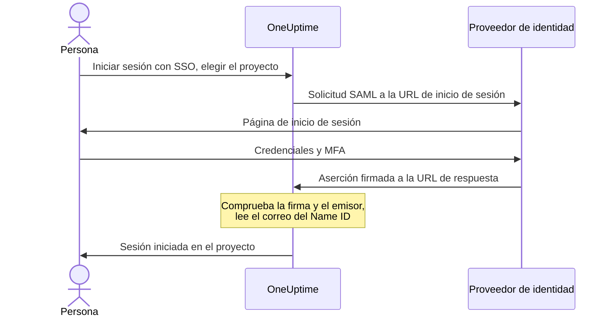

# SSO

El inicio de sesión único (SSO) permite que las personas de tu proyecto inicien sesión en OneUptime con el proveedor de identidad (IdP) de tu organización, mediante SAML 2.0 u OpenID Connect. Gestionas el acceso, las contraseñas y la autenticación multifactor en un solo lugar, y puedes exigir SSO a todos los miembros del proyecto.

> [!NOTE]
> **Edición:** el SSO, incluido "Require SSO for login", forma parte de todas las ediciones de OneUptime: las instalaciones autoalojadas lo tienen en la Community Edition, sin necesidad de licencia. En OneUptime Cloud está disponible a partir del plan **Scale**. Consulta [Edición Enterprise](/docs/self-hosted/enterprise) para ver qué incluye cada edición.

:::cards
- [Configurar un proveedor SAML](#configurar-sso): Crearlo en OneUptime y dar dos URL a tu IdP.
- [Guías de proveedores de identidad](#guías-de-proveedores-de-identidad): Keycloak, Microsoft Entra ID y Okta, paso a paso.
- [OpenID Connect](#openid-connect-oidc): Iniciar sesión mediante una aplicación OIDC.
- [Exigir SSO](#exigir-sso-en-tu-proyecto): Hacer del SSO la única forma de entrar en el proyecto.
:::

## Cómo funciona el inicio de sesión SAML

Un proveedor SAML conecta un proyecto con una aplicación de tu proveedor de identidad. Quien inicia sesión elige el proyecto en la página **Iniciar sesión con SSO** de OneUptime, inicia sesión en tu IdP y vuelve con la sesión iniciada.



OneUptime solo lee unas pocas cosas de la aserción que envía tu IdP:

| De la aserción | Qué hace OneUptime con ello |
| --- | --- |
| Firma | La comprueba con el **Certificado público** del proveedor. La respuesta debe estar firmada y no debe estar cifrada. |
| Issuer | Debe coincidir exactamente con el **Emisor** del proveedor. |
| Name ID | La dirección de correo de la persona. Debe ser una dirección de correo válida. |
| `http://schemas.microsoft.com/identity/claims/displayname` | El nombre de la persona, que se usa cuando OneUptime crea su cuenta. Opcional. |

Quienes inician sesión por primera vez se unen a los **Equipos** del proveedor, que deciden lo que pueden hacer: consulta [Roles y equipos de los usuarios de SSO](#roles-y-equipos-de-los-usuarios-de-sso).

> [!NOTE]
> En OneUptime Cloud, la primera vez que alguien inicia sesión en el proyecto con uno de sus proveedores SAML u OIDC, OneUptime le envía un enlace por correo en lugar de iniciar su sesión. La persona lo abre, confirma que el inicio de sesión único del proyecto puede iniciar su sesión y continúa. El enlace es válido durante 24 horas. Esto ocurre una vez por proyecto, y de nuevo si la persona deja el proyecto y vuelve. Las instalaciones autoalojadas inician la sesión de inmediato.

## Configurar SSO

Necesitas permiso para añadir proveedores de SSO — **Project Owner**, **Project Admin** o **Create Project SSO** — y, en OneUptime Cloud, el plan **Scale**. Para la parte de tu proveedor de identidad, consulta las [guías de proveedores de identidad](#guías-de-proveedores-de-identidad).

:::steps
1. **Ir a los ajustes del proyecto**

   - Abre tu proyecto de OneUptime
   - Ve a **Ajustes del proyecto** > **Seguridad** > **SSO**

2. **Crear la configuración de SSO**

   - Haz clic en **Crear SSO**
   - Introduce un **Nombre** para la configuración de SSO (por ejemplo, "Keycloak SAML" u "Okta SAML")
   - Introduce la **URL de inicio de sesión** de tu proveedor de identidad
   - Introduce el **Emisor** (Entity ID) de tu proveedor de identidad
   - Pega el **Certificado público** de tu proveedor de identidad
   - En el paso **Inicio de sesión**, **Equipos** empieza con el equipo de miembros de tu proyecto: quienes inician sesión por primera vez se unen a estos equipos. Solo se aceptan equipos a los que tú podrías invitar a alguien: un equipo que da más acceso del que tienes se indica en **Equipos**
   - Todo lo demás ya está completado en **Más campos**: el **Método de firma** (`RSA-SHA256`), el **Método de resumen** (`SHA256`) y una descripción ("Sign in with" y el nombre). Cámbialos solo si tu proveedor de identidad lo requiere

3. **Obtener los metadatos de SSO de OneUptime**
   - Al guardar se abre el cuadro de diálogo **Configuración de SSO**. Puedes volver a abrirlo con el botón **Ver configuración SSO**
   - Copia el **Identificador (Entity ID)**, como `https://oneuptime.com/<project-id>/<provider-id>`; lo necesitas en la configuración de tu IdP
   - Copia la **URL de respuesta (URL del Assertion Consumer Service)**, como `https://oneuptime.com/identity/idp-login/<project-id>/<provider-id>`; la necesitas en la configuración de tu IdP
   - Un proveedor nuevo empieza desactivado. Cuando tu IdP tenga estos dos valores, edita el proveedor y activa **Habilitado**

4. **Probar el proveedor**
   - Abre el enlace de la tarjeta **Probar el inicio de sesión único (SSO)** y elige el proveedor en la página que se abre. Se te redirige a la página de inicio de sesión de tu proveedor de identidad y vuelves a OneUptime con la sesión iniciada
   - Cuando funcione, puedes [exigir SSO](#exigir-sso-en-tu-proyecto) en el proyecto
:::

## Guías de proveedores de identidad

Elige tu proveedor de identidad. Cada guía obtiene los valores del IdP, crea el proveedor en OneUptime y luego da al IdP el **Identificador (Entity ID)** y la **URL de respuesta** de OneUptime.

:::tabs
@tab Keycloak
Keycloak es una solución de código abierto muy extendida para la gestión de identidades y accesos. Necesitas una instancia de Keycloak en funcionamiento con un realm, y acceso de administrador a Keycloak y a OneUptime.

:::steps
1. **Reunir los valores de tu realm**

   - **URL de inicio de sesión**: `https://<your-keycloak-domain>/auth/realms/<your-realm>/protocol/saml`
   - **Emisor**: `https://<your-keycloak-domain>/auth/realms/<your-realm>`
   - **Certificado**: el certificado de firma del realm. Abre `https://<your-keycloak-domain>/auth/realms/<your-realm>/protocol/saml/descriptor` y copia el valor de `X509Certificate`, o abre **Realm settings** > **Keys** y haz clic en **Certificate** en la clave RS256

   Keycloak 17 y versiones posteriores sirven estas URL sin el prefijo `/auth`. Pon el certificado entre sus propias líneas, así:

   ```text
   -----BEGIN CERTIFICATE-----
   MIICnzCCAYcCBgFyPZ8QFzANBgkqhkiG.......
   -----END CERTIFICATE-----
   ```

2. **Crear el proveedor en OneUptime**

   Ve a **Ajustes del proyecto** > **Seguridad** > **SSO**, haz clic en **Crear SSO** y completa:
   - **Nombre**: un nombre descriptivo (por ejemplo, `my-project-oneuptime`)
   - **URL de inicio de sesión** y **Emisor**: los valores de arriba
   - **Certificado público**: el certificado, entre sus propias líneas `BEGIN CERTIFICATE` y `END CERTIFICATE`
   - **Método de firma** y **Método de resumen**: ya definidos en **Más campos** (`RSA-SHA256` y `SHA256`)

   Guarda y copia el **Identificador (Entity ID)** y la **URL de respuesta (URL del Assertion Consumer Service)** del cuadro de diálogo que se abre.

3. **Crear el cliente de Keycloak**

   En Keycloak, abre **Clients** en tu realm y crea un cliente, o edita uno existente:
   - **Client Protocol** (tipo de cliente): `saml`
   - **Client ID**: el **Identificador (Entity ID)** de OneUptime
   - **Root URL** y **Valid Redirect URIs**: tu URL de OneUptime
   - **Assertion Consumer Service POST Binding URL**: la **URL de respuesta (URL del Assertion Consumer Service)** de OneUptime

4. **Ajustar la configuración del cliente**

   - Establece **Name ID Format** en `email` y activa **Force Name ID Format**, para que Keycloak envíe siempre el correo como Name ID
   - En la pestaña **Keys** del cliente, desactiva **Client signature required** (en **Signing keys config**): OneUptime no firma sus solicitudes

5. **Activar el proveedor y probarlo**

   En OneUptime, edita el proveedor y activa **Habilitado**; después abre el enlace de la tarjeta **Probar el inicio de sesión único (SSO)** y elige el proveedor. Deberías llegar a la página de inicio de sesión de Keycloak y volver a OneUptime.
:::
@tab Microsoft Entra ID
Microsoft Entra ID (antes Azure AD / Active Directory) es el servicio de identidad en la nube de Microsoft. Necesitas un tenant que admita aplicaciones empresariales con SSO SAML, y acceso de administrador a Entra ID y a OneUptime.

:::steps
1. **Crear una aplicación empresarial en Entra ID**

   - Inicia sesión en el [Microsoft Entra admin center](https://entra.microsoft.com)
   - Ve a **Identity** > **Applications** > **Enterprise applications**, haz clic en **+ New application** y luego en **+ Create your own application**
   - Introduce un nombre (por ejemplo, "OneUptime"), selecciona **Integrate any other application you don't find in the gallery (Non-gallery)** y haz clic en **Create**

2. **Copiar los valores SAML de Entra ID**

   - En la aplicación, ve a **Single sign-on** y selecciona **SAML**
   - En **SAML Certificates**, descarga el **Certificate (Base64)**, abre el archivo en un editor de texto y copia su contenido
   - En **Set up OneUptime**, copia la **Login URL** y el **Microsoft Entra Identifier** (**Azure AD Identifier** en tenants antiguos)

3. **Crear el proveedor en OneUptime**

   Ve a **Ajustes del proyecto** > **Seguridad** > **SSO**, haz clic en **Crear SSO** y completa:
   - **Nombre**: un nombre descriptivo (por ejemplo, `Azure AD SAML`)
   - **URL de inicio de sesión**: la **Login URL**
   - **Emisor**: el **Microsoft Entra Identifier**
   - **Certificado público**: el certificado Base64, incluidas las líneas `BEGIN CERTIFICATE` y `END CERTIFICATE`
   - **Método de firma** y **Método de resumen**: ya definidos en **Más campos** (`RSA-SHA256` y `SHA256`)

   Guarda y copia el **Identificador (Entity ID)** y la **URL de respuesta (URL del Assertion Consumer Service)** del cuadro de diálogo que se abre.

4. **Dar a Entra ID las URL de OneUptime**

   En **Basic SAML Configuration**, haz clic en **Edit** y establece:
   - **Identifier (Entity ID)**: el **Identificador (Entity ID)** de OneUptime
   - **Reply URL (Assertion Consumer Service URL)**: la **URL de respuesta** de OneUptime

   Haz clic en **Save**.

5. **Enviar el correo como Name ID**

   En **Attributes & Claims**, haz clic en **Edit**:
   - Establece **Unique User Identifier (Name ID)** en la dirección de correo del usuario: `user.mail`, o `user.userprincipalname` cuando esa sea la dirección de correo
   - Establece el **Name identifier format** en `Email address`
   - Opcionalmente, añade una notificación llamada `http://schemas.microsoft.com/identity/claims/displayname` con el atributo de origen `user.displayname`, para que las cuentas nuevas reciban el nombre de la persona. OneUptime ignora las demás notificaciones

6. **Asignar usuarios y grupos**

   En **Users and groups** de la aplicación, haz clic en **+ Add user/group**, selecciona los usuarios y grupos que tendrán acceso por SSO y haz clic en **Assign**.

7. **Activar el proveedor y probarlo**

   En OneUptime, edita el proveedor y activa **Habilitado**; después abre el enlace de la tarjeta **Probar el inicio de sesión único (SSO)** y elige el proveedor. Deberías llegar a la página de inicio de sesión de Microsoft y volver a OneUptime.
:::
@tab Okta
Okta es una plataforma de identidad muy utilizada con SSO SAML. Necesitas una organización de Okta con acceso de administrador, y acceso de administrador a OneUptime.

:::steps
1. **Crear una aplicación SAML en Okta**

   - En la Okta Admin Console, ve a **Applications** > **Applications** y haz clic en **Create App Integration**
   - Selecciona **SAML 2.0** y haz clic en **Next**, introduce "OneUptime" como **App name** y haz clic en **Next**
   - Okta pide las URL de OneUptime antes de mostrar las suyas. Por ahora, introduce tu dirección de OneUptime (por ejemplo `https://oneuptime.com`) como **Single sign-on URL** y como **Audience URI (SP Entity ID)**: las sustituirás en el paso 4
   - Establece **Name ID format** en `EmailAddress` y **Application username** en `Email`
   - Haz clic en **Next**, selecciona **I'm an Okta customer adding an internal app** y haz clic en **Finish**

2. **Copiar los valores SAML de Okta**

   En la pestaña **Sign On** de la aplicación, en **SAML Signing Certificates**, busca el certificado activo:
   - Haz clic en **Actions** > **View IdP metadata** y copia la **URL de inicio de sesión** (Identity Provider Single Sign-On URL) y el **Emisor** (Identity Provider Issuer)
   - Haz clic en **Actions** > **Download certificate**, abre el archivo `.cert` en un editor de texto y copia su contenido

3. **Crear el proveedor en OneUptime**

   Ve a **Ajustes del proyecto** > **Seguridad** > **SSO**, haz clic en **Crear SSO** y completa:
   - **Nombre**: un nombre descriptivo (por ejemplo, `Okta SAML`)
   - **URL de inicio de sesión** y **Emisor**: los valores de Okta
   - **Certificado público**: el certificado, incluidas las líneas `BEGIN CERTIFICATE` y `END CERTIFICATE`
   - **Método de firma** y **Método de resumen**: ya definidos en **Más campos** (`RSA-SHA256` y `SHA256`)

   Guarda y copia el **Identificador (Entity ID)** y la **URL de respuesta (URL del Assertion Consumer Service)** del cuadro de diálogo que se abre.

4. **Dar a Okta las URL de OneUptime**

   En la pestaña **General** de la aplicación, haz clic en **Edit** en **SAML Settings** y en **Next**, y establece:
   - **Single sign-on URL**: la **URL de respuesta (URL del Assertion Consumer Service)** de OneUptime
   - **Audience URI (SP Entity ID)**: el **Identificador (Entity ID)** de OneUptime

   Opcionalmente, añade una declaración de atributo llamada `http://schemas.microsoft.com/identity/claims/displayname` con el valor `user.firstName + " " + user.lastName`, para que las cuentas nuevas reciban el nombre de la persona. Haz clic en **Next** y luego en **Finish**.

5. **Asignar personas**

   En la pestaña **Assignments**, haz clic en **Assign** > **Assign to People** o **Assign to Groups**, selecciona quién obtiene acceso por SSO, haz clic en **Assign** para cada uno y luego en **Done**.

6. **Activar el proveedor y probarlo**

   En OneUptime, edita el proveedor y activa **Habilitado**; después abre el enlace de la tarjeta **Probar el inicio de sesión único (SSO)** y elige el proveedor. Deberías llegar a la página de inicio de sesión de Okta y volver a OneUptime.
:::
@tab Otro
El SSO de OneUptime usa SAML 2.0 y funciona con cualquier proveedor de identidad compatible:

:::steps
1. Obtén la **URL de inicio de sesión** (su endpoint de SSO), el **Emisor** (su Entity ID) y el **Certificado público** (su certificado de firma X.509) de tu proveedor de identidad. Si tu IdP solo los muestra cuando existe una aplicación, crea la aplicación con tu dirección de OneUptime como URL provisionales.
2. En OneUptime, crea el proveedor con esos valores y copia el **Identificador (Entity ID)** y la **URL de respuesta (URL del Assertion Consumer Service)** del cuadro de diálogo **Configuración de SSO** (o de **Ver configuración SSO**).
3. En la aplicación SAML de tu proveedor de identidad, establece la **Assertion Consumer Service URL / Reply URL** y el **Entity ID / Audience URI** con los valores de OneUptime, y el **Name ID Format** en la dirección de correo.
4. El **Método de firma** (`RSA-SHA256`) y el **Método de resumen** (`SHA256`) ya están definidos en **Más campos**; cámbialos solo si tu proveedor de identidad firma de otra forma
5. Activa **Habilitado** en el proveedor y pruébalo con el enlace de la tarjeta **Probar el inicio de sesión único (SSO)**.
:::
:::

## OpenID Connect (OIDC)

Un proyecto también puede iniciar sesión mediante un proveedor OpenID Connect, como Google Workspace, Okta, Microsoft Entra ID, Auth0 o Keycloak. Necesitas permiso para añadir proveedores OIDC (**Project Owner**, **Project Admin** o **Create Project OIDC**) y, en OneUptime Cloud, el plan **Scale**.

:::steps
1. Registra en tu proveedor de identidad una aplicación (un cliente OIDC) que pueda usar el flujo authorization code con PKCE, y copia su **URL del emisor**, su **ID de cliente** y su **Secreto de cliente**.
2. En OneUptime, ve a **Ajustes del proyecto** > **Seguridad** > **OIDC** y haz clic en **Crear OIDC**.
3. Introduce un **Nombre** (lo que las personas ven en la página de inicio de sesión), la **URL del emisor**, el **ID de cliente** y el **Secreto de cliente**. También puedes pegar la URL de descubrimiento del proveedor en **URL del emisor**.
4. En el paso **Inicio de sesión**, **Equipos** empieza con el equipo de miembros de tu proyecto: quienes inician sesión por primera vez se unen a estos equipos. Todo lo demás ya está completado en **Más campos**: la **URL de descubrimiento** (el emisor seguido de `/.well-known/openid-configuration`), los **Alcances** (`openid email profile`), los nombres de notificación `email` y `name`, y una descripción ("Sign in with" y el nombre). Cámbialos solo si tu proveedor lo requiere. Solo se aceptan equipos a los que tú podrías invitar a alguien: un equipo que da más acceso del que tienes se indica en **Equipos**.
5. Guarda. Se abre el cuadro de diálogo **Configuración de OIDC** con la **URI de redirección**: añádela a las URI de redirección permitidas de tu aplicación. Un proveedor nuevo empieza desactivado, así que después edítalo y activa **Habilitado**.
6. Usa el enlace de la tarjeta **Probar OpenID Connect (OIDC)** para iniciar sesión mediante el proveedor antes de exigir SSO en el proyecto.
:::

## Roles y equipos de los usuarios de SSO

OneUptime no asigna roles ni grupos de tu proveedor de identidad. Lo que alguien puede hacer depende de los equipos a los que pertenece: un proveedor añade a los recién llegados a sus **Equipos**, y tú gestionas los equipos y sus permisos en OneUptime, como describe [Usuarios, equipos y permisos](/docs/permissions/index). Para mantener la pertenencia a los equipos alineada con tu proveedor de identidad, usa [SCIM](/docs/identity/scim).

Los equipos de un proveedor deciden lo que pueden hacer las personas que inician sesión con él, por eso un proveedor solo se guarda con equipos a los que la persona que lo guarda podría invitar a alguien. Cada guardado los vuelve a comprobar: un proveedor cuyos equipos dan más acceso del que tienes solo puede cambiarlo alguien cuyo acceso los cubra, como un propietario del proyecto. Los proveedores guardados antes de esta comprobación siguen iniciando la sesión de las personas en sus equipos. Cualquiera que pueda editar un proveedor puede seguir desactivándolo, para poder detenerlo en el acto.

## Exigir SSO en tu proyecto

Configurar un proveedor no impide que nadie inicie sesión con contraseña. Para que el SSO sea la única forma de entrar en el proyecto, usa el interruptor **Requerir SSO para iniciar sesión** en **Ajustes del proyecto** > **Seguridad** > **SSO**, debajo de tus proveedores:

:::steps
1. Prueba primero tu proveedor con el enlace de la tarjeta **Probar el inicio de sesión único (SSO)**.
2. Activa **Requerir SSO para iniciar sesión**. OneUptime pregunta antes de guardar nada: a partir de entonces todos los miembros del proyecto, tú incluido, deben iniciar sesión con SSO para abrirlo, y quien haya iniciado sesión con contraseña queda fuera del proyecto hasta que inicie sesión con SSO.
3. Haz clic en **Requerir SSO** para confirmar. El interruptor se guarda al instante; no hay un botón de guardar aparte.
:::

Para activar **Requerir SSO para iniciar sesión** hace falta un proveedor que inicie la sesión de las personas en el proyecto: uno de sus propios proveedores SAML u OIDC que esté activado, o un proveedor global activado que inicie sesiones en él. Sin ninguno, OneUptime lo rechaza y pide que primero actives un proveedor para el proyecto y lo pruebes. Si eliges un proveedor que el proyecto exige, tiene que ser uno de esos, y se pide lo mismo cuando más adelante exiges otro proveedor.

Un guardado que envía **Requerir SSO para iniciar sesión** activado cuando ya lo está, o que nombra el proveedor que el proyecto ya exige, se comprueba igual: la API, Terraform y otras herramientas suelen enviar todos los ajustes en cada guardado. Así que, mientras el proyecto no tenga ningún proveedor que inicie sesiones, o el proveedor que exige se haya desactivado desde entonces, ese guardado se rechaza con las mismas palabras, cambie lo que cambie: primero activa un proveedor, exige otro o desactiva **Requerir SSO para iniciar sesión**.

Un proyecto nuevo sigue la misma regla. Aún no tiene proveedor propio, así que crearlo con **Requerir SSO para iniciar sesión** ya activado — solo puede hacerlo un administrador maestro — necesita un proveedor global activado que inicie sesiones en todos los proyectos, y sin él se rechaza con las mismas palabras. Crea el proyecto, configura y prueba su proveedor y luego activa el interruptor.

Mientras todo el servidor exija SSO (**Admin** > **Ajustes** > **Autenticación** > **Exigir SSO para iniciar sesión**), crear cualquier proyecto también necesita un proveedor global así; de lo contrario nadie, ni siquiera quien lo crea, podría abrir el proyecto. Sin él, la creación de un proyecto se rechaza y el mensaje pide a un administrador del servidor que active uno. Los administradores maestros pueden seguir creando proyectos.

Desactivar **Requerir SSO para iniciar sesión** se guarda en cuanto cambias el interruptor y deja que los miembros vuelvan a entrar con su contraseña al instante, salvo que alguien lo vuelva a activar en ese mismo momento; entonces un servidor de aplicaciones puede tardar hasta un minuto en seguir el cambio. Pueden cambiarlo los propietarios del proyecto, los administradores del proyecto y los miembros con el permiso **Edit Project**; los demás ven el interruptor bloqueado, junto con el permiso que necesitarían.

> [!NOTE]
> En OneUptime Cloud, exigir SSO requiere el plan **Scale**, y desactivarlo funciona en todos los planes. Por debajo de Scale, **Ajustes del proyecto** > **Seguridad** > **SSO** muestra la oferta del plan; un proyecto que una prueba de Scale dejó exigiendo SSO también encuentra ahí **Requerir SSO para iniciar sesión**, debajo de la oferta, para poder desactivarlo. Volver a activarlo requiere **Scale**.

## Desactivar o eliminar un proveedor

| Lo que cambias | Las personas que iniciaron sesión con el proveedor |
| --- | --- |
| Desactivarlo o eliminarlo | Vuelven a iniciar sesión con SSO en su siguiente solicitud, donde se exige SSO |
| Un certificado o secreto de cliente nuevo, otras URL, un nombre nuevo u otros equipos | Siguen con la sesión iniciada |
| Activarlo | Pueden iniciar sesión con él al instante |

Desactivar o eliminar un proveedor SAML u OIDC pone fin a las sesiones que inició. En un proyecto que exige SSO, por sí mismo o porque lo exige todo el servidor:

- Quien inició sesión con él debe volver a iniciar sesión con SSO en su siguiente solicitud, y las páginas que tiene abiertas dejan de recibir actualizaciones en directo al instante.
- Un cliente MCP que alguien conectó tras iniciar sesión con él deja de funcionar en el proyecto. Vuelve a conectarlo después de iniciar sesión con SSO.
- Volver a activar el proveedor no recupera esas sesiones: las personas vuelven a iniciar sesión con él.

Cambiar cualquier otra cosa de un proveedor mantiene a todos con la sesión iniciada: un certificado o secreto de cliente nuevo, otras URL, un nombre nuevo u otros equipos. Sus sesiones se comprobaron cuando se iniciaron, y el siguiente inicio de sesión usa los ajustes nuevos.

Mientras el proyecto exija SSO, OneUptime mantiene una forma de entrar: no puedes desactivar ni eliminar el último proveedor con el que las personas pueden iniciar sesión en el proyecto, contando los proveedores globales que inician sesiones en él, ni el proveedor que el proyecto exige. Primero desactiva **Requerir SSO para iniciar sesión**.

Activar un proveedor permite iniciar sesión con él al instante.

Cuando todo el servidor exige SSO (**Admin** > **Ajustes** > **Autenticación** > **Exigir SSO para iniciar sesión**), cada proyecto mantiene una forma de entrar del mismo modo, incluso uno que no exige SSO por sí mismo: primero activa otro proveedor para él.

Los proveedores globales siguen la misma regla: un cambio en uno de ellos, o en sus proyectos adjuntos, que dejaría sin proveedor a un proyecto que exige SSO se rechaza, nombrando el proyecto. Consulta [SSO global](/docs/identity/global-sso#desactivar-o-eliminar-un-proveedor).

Donde ni el proyecto ni el servidor exigen SSO, desactivar un proveedor detiene los nuevos inicios de sesión con él. Quienes ya iniciaron sesión la mantienen, igual que quienes iniciaron sesión con contraseña.

## Proveedores que quedan por debajo del plan Scale

Un proveedor SAML u OIDC que un proyecto todavía tiene sigue iniciando sesiones cuando termina una prueba de Scale o se baja de plan. Por eso, por debajo de Scale, las páginas **SSO** y **OIDC** muestran los proveedores del proyecto debajo de la oferta (**Proveedores SAML aún configurados**, **Proveedores OIDC aún configurados**):

- **Desactivar** detiene un proveedor al instante. OneUptime pregunta antes.
- **Eliminar** lo quita.

Añadir un proveedor, cambiar uno o volver a activarlo requiere **Scale**. Quién puede hacer cada cosa es lo mismo que con Scale: desactivar un proveedor requiere permiso para editarlo, y eliminarlo, permiso para eliminarlo.

Mientras el proyecto siga exigiendo SSO, sus páginas **SSO** y **OIDC** también muestran **Requerir SSO para iniciar sesión**: desactívalo antes de desactivar el último proveedor. Hasta entonces, el último proveedor con el que las personas pueden iniciar sesión no se puede desactivar ni eliminar, para que nadie quede fuera del proyecto.

Las páginas **SSO** y **OIDC** de una página de estado muestran sus propios proveedores de la misma forma. Mientras la página de estado siga exigiendo SSO, ambas páginas también muestran **Requerir SSO para iniciar sesión**: desactívalo antes de desactivar sus proveedores, o sus usuarios privados no podrán iniciar sesión en absoluto.

## Solución de problemas

:::details "SSO Config not found"
El proveedor está desactivado, o el enlace es de un proveedor que ya no existe. Un proveedor nuevo empieza desactivado: edítalo y activa **Habilitado**.
:::

:::details "No teams added."
La persona aún no está en el proyecto y el proveedor no tiene **Equipos** a los que añadirla. Edita el proveedor y elige al menos un equipo, como el equipo de miembros de tu proyecto.
:::

:::details "Issuer URL does not match"
El emisor de la aserción de tu IdP no es el **Emisor** del proveedor. Vuelve a copiarlo de tu IdP — la URL del realm de Keycloak, el **Microsoft Entra Identifier** o el Identity Provider Issuer de Okta — para que ambos coincidan exactamente.
:::

:::details El inicio de sesión falla con un error de firma o de certificado
Pega el certificado de firma actual del IdP en **Certificado público**, incluidas las líneas `BEGIN CERTIFICATE` y `END CERTIFICATE`. Para Entra ID, descarga el certificado **Base64**, no el sin formato; para Okta, el certificado de firma activo; para Keycloak, el certificado del realm correcto.
:::

:::details "Encrypted SAML Responses are not supported"
OneUptime no descifra aserciones. Desactiva el cifrado de aserciones de la aplicación en tu IdP para que envíe una aserción firmada y sin cifrar.
:::

:::details "SAML response did not include a valid email address"
OneUptime lee la dirección de correo del Name ID. Establece el Name ID en el correo del usuario: **Name ID Format** `email` con **Force Name ID Format** en Keycloak, el **Unique User Identifier (Name ID)** en Entra ID, o **Name ID format** `EmailAddress` y **Application username** `Email` en Okta. La dirección debe coincidir con la cuenta de OneUptime de la persona.
:::

:::details Entra ID: AADSTS700016
El **Identifier (Entity ID)** de Entra ID no coincide con el de OneUptime. Vuelve a copiarlo desde **Ver configuración SSO**; ambos valores deben ser idénticos.
:::

:::details Okta: 404 o una audiencia que no coincide
La **Single sign-on URL** de Okta debe ser exactamente la **URL de respuesta** de OneUptime, y la **Audience URI** exactamente el **Identificador (Entity ID)** de OneUptime. Comprueba que ambas sustituyeron los valores provisionales.
:::

:::details El usuario no está asignado a la aplicación
Entra ID y Okta solo inician la sesión de las personas asignadas a la aplicación. Asigna al usuario, o a un grupo al que pertenezca.
:::

:::details Keycloak: bucle de redirección
Comprueba que **Valid Redirect URIs** y **Assertion Consumer Service POST Binding URL** estén configurados como arriba, en el cliente del realm correcto.
:::

## Próximos pasos

:::cards
- [SSO global](/docs/identity/global-sso): Un solo proveedor de identidad para todos los proyectos de una instancia autoalojada.
- [SCIM](/docs/identity/scim): Deja que tu proveedor de identidad añada y quite personas automáticamente.
- [Usuarios, equipos y permisos](/docs/permissions/index): Lo que permiten hacer los equipos a los que se unen los recién llegados.
:::
