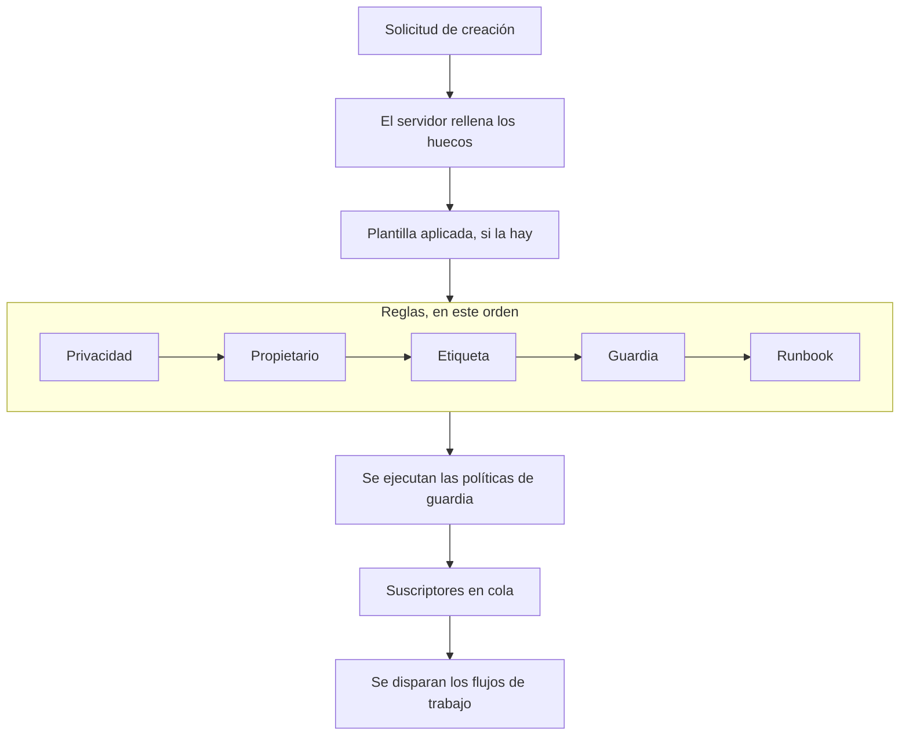

# Declarar un incidente

Declarar un incidente crea el registro con el que trabaja tu equipo: recibe un número, una gravedad y un estado inicial, sus políticas de guardia avisan a las personas y —salvo que indiques lo contrario— los suscriptores de la página de estado se enteran. Esta página recorre las cinco formas de declarar uno, campo por campo, y lo que ocurre en cuanto existe.

:::cards
- [Declarar uno a mano](#declarar-uno-a-mano): El formulario de tres pasos, campo por campo.
- [Declarar desde una plantilla](#declarar-desde-una-plantilla): El mismo tipo de incidente, rellenado cada vez.
- [Declarar desde los criterios de un monitor](#declarar-automáticamente-desde-los-criterios-de-un-monitor): Deja que una comprobación fallida lo abra por ti.
- [Declarar por la API](#declarar-por-la-api): Desde tu propio código, un script u otra herramienta.
:::

## Cinco formas de declarar un incidente

Un incidente entra en OneUptime de cinco formas, y todas acaban en el mismo sitio: una fila de la tabla `Incident` con una gravedad, un estado actual y una lista de recursos afectados. La única diferencia es quién rellena los campos: tú a las tres de la madrugada, una plantilla guardada, los criterios de un monitor, tu propio código llamando a la API, o alguien ajeno a tu equipo rellenando un formulario.

| Si quieres…                                                              | Elige                                                                       |
| ------------------------------------------------------------------------ | --------------------------------------------------------------------------- |
| Abrir un incidente a mano, rellenándolo todo                             | El asistente **Declarar incidente**                                         |
| Abrir un tipo de incidente recurrente con los campos rellenados          | **Crear desde plantilla**                                                   |
| Abrir uno automáticamente cuando fallan las comprobaciones de un monitor | Un filtro de criterios de un monitor con **Cuando los filtros coinciden, declarar un incidente.** |
| Abrir uno desde tu propio código, un script u otra herramienta           | `POST /api/incident`                                                        |
| Dejar que personas ajenas a tu equipo informen de un problema mediante un enlace | Un [formulario](/docs/forms/index)                                   |

Las cinco escriben el mismo modelo, así que un incidente abierto por una sonda es exactamente igual que uno abierto a mano por un respondedor, salvo por algunas columnas de control que el servidor rellena en los automáticos. Las integraciones también lo escriben: [Huntress](/docs/integrations/huntress) abre un incidente por cada informe de incidente que envía su SOC.

> [!TIP]
> También puedes declarar un incidente a partir de alertas: **Declarar incidente** en una lista de alertas, en la cabecera de una alerta o en la página **Incidentes vinculados** de una alerta abre el mismo asistente, rellenado a partir de las alertas, y las vincula al nuevo incidente. Una casilla del formulario, marcada por defecto, también reconoce las alertas, para que dejen de escalar. Consulta [Alertas vinculadas](/docs/incidents/linked-alerts).

## Declarar uno a mano

El formulario **Declarar nuevo incidente** pide un incidente en tres pasos —**Detalles del incidente**, **Recursos afectados** y **Guardia y roles**— y luego muestra un resumen para revisar. Cuando tu proyecto pide algunos de sus campos personalizados de incidente al crear, un cuarto paso, **Detalles**, viene justo después de **Recursos afectados**.

:::steps
1. Abre **Incidentes → Todos los incidentes** y haz clic en **Declarar incidente** arriba a la derecha de la lista **Incidentes**. El formulario se abre en **Detalles del incidente**.
2. Escribe un **Título** y elige una **Gravedad del incidente**. El resto del formulario es opcional.
3. Haz clic en **Siguiente** para recorrer los pasos restantes, rellenando lo que ya sabes: monitores y otros recursos, políticas de guardia, roles.
4. Lee el resumen y haz clic en **Declarar incidente**. Llegas al nuevo incidente, y su **Feed del incidente** empieza a registrar.
:::

Solo el primer paso tiene campos obligatorios, más cualquier campo personalizado que tus administradores hayan marcado como **Obligatorio al crear**, que pide el paso **Detalles**. Cada paso antes del resumen tiene un simple **Siguiente**, y **Declarar incidente** está en el resumen, el último paso. Si tienes prisa, rellena **Detalles del incidente** y pulsa **Siguiente** en los demás pasos sin rellenarlos: adjuntar recursos, añadir políticas de guardia y asignar roles también pueden esperar a las páginas del propio incidente. Pulsar **Intro** en un campo también avanza; nunca declara antes del resumen.

> [!TIP]
> Las opciones que la mayoría de los incidentes nunca necesita esperan bajo una cabecera **Más campos** al final de su paso, plegada; haz clic en ella para abrirlas. Mientras está plegada, la cabecera nombra lo que contiene y muestra cada opción definida, con su valor —definida por una plantilla, por ejemplo, o por una alerta privada a partir de la cual declaras—, y se abre sola cuando algo de su interior necesita corregirse. El resumen solo lista una de esas opciones cuando está definida, salvo **Notificar a suscriptores de la página de estado**, que lista siempre, con quién recibirá la notificación.

**Desde la página de un recurso.** **Declarar incidente** en la pestaña **Incidentes** de un monitor, un host, un servicio, un clúster o la mayoría de los demás recursos abre el mismo formulario con ese recurso ya elegido en **Recursos afectados**, así que basta con un título y una gravedad, y el incidente aparece en la pestaña desde la que empezaste.

:::details Qué páginas de recurso lo ofrecen y qué eligen
**Declarar incidente** en la pestaña **Incidentes** de un monitor, un host, un clúster de Kubernetes, Proxmox, Ceph o Docker Swarm, un host de Docker o Podman, un vCenter, una cabina de almacenamiento, una flota IoT, una base de datos o un servicio abre el mismo asistente con ese recurso ya elegido en **Recursos afectados** (un monitor en **Monitores**, cualquier otra cosa en **Otros recursos afectados**), antes de cualquier cosa que añada una plantilla. **Crear desde plantilla** en esa pestaña también conserva el recurso. Las migas de pan vuelven por la pestaña del recurso, y una vez declarado llegas al nuevo incidente, como desde la lista de incidentes.

La pestaña **Incidentes** de un elemento del inventario elige el host, el servicio o el clúster de Kubernetes al que apunta el elemento, y las migas de pan vuelven por la pestaña de ese recurso. **Crear alerta** en la pestaña **Alertas** de un recurso funciona igual: desde un monitor rellena el **Monitor** de la alerta, desde cualquier otro recurso, **Otros recursos afectados**.

El recurso se busca con tus propios permisos: si no puedes leerlo, o se ha eliminado, el formulario simplemente se abre sin nada elegido.
:::

### Paso 1 — Detalles del incidente

- **Título** — obligatorio. El resumen de una línea que todos verán en la lista, en Slack y (si el incidente es visible) en tu página de estado. Texto de ejemplo: `Incident Title`.
- **Gravedad del incidente** — obligatoria. Una de las gravedades configuradas para tu proyecto; los proyectos nuevos se crean con **Critical Incident**, **Major Incident** y **Minor Incident**.
- **Descripción** — opcional, escrita en Markdown. Es el campo que se muestra en la página de estado, así que escríbelo para los clientes y no para tu equipo. Una imagen que pongas en ella se muestra a todo el mundo mientras el incidente es visible en las páginas de estado, y solo a los miembros de tu proyecto mientras está oculto. Puedes editarla más tarde desde **Descripción** en el menú lateral del incidente.

En **Más campos**:

- **Declarado el** — empieza en el momento en que abriste la página. Es la marca de tiempo desde la que se mide cada duración del incidente, así que retrásala si estás registrando algo que empezó antes.
- **Estado inicial** — opcional, y vacío al principio. Si se deja vacío, el incidente empieza en el estado marcado con `isCreatedState`, que los proyectos nuevos crean como **Identificado**, o en el estado inicial de la plantilla, cuando declaras desde una plantilla. Elige un estado posterior solo cuando registres un incidente que ya había pasado ese punto, reconocido o resuelto. Un incidente así no avisa a nadie; consulta [Declarado ya reconocido o resuelto](#declarado-ya-reconocido-o-resuelto).
- **Etiquetas** — opcionales. Las etiquetas agrupan incidentes relacionados para que puedas filtrar por ellas, y un equipo cuyos permisos están restringidos a etiquetas solo ve los incidentes que llevan una de sus etiquetas.
- **Incidente privado** — casilla, desactivada por defecto (`isPrivate`). Un incidente privado solo es visible para sus usuarios propietarios, los miembros de sus equipos propietarios, los administradores y los propietarios del proyecto, y se oculta en todas las páginas de estado, independientemente de cualquier otro ajuste, incluidas las páginas de estado a las que está limitado. La lista de incidentes los marca con una etiqueta roja **Privado**.

> [!NOTE]
> **Las alertas y los episodios también empiezan en el estado que elijas.** **Crear alerta**, y **Crear episodio** en las listas de episodios de incidente y de alerta, tienen el mismo **Estado inicial** en **Más campos**. Si se deja vacío, la alerta o el episodio empieza en el estado de creación del proyecto. Elige un estado posterior para registrar una alerta o un episodio que ya estaba reconocido o resuelto: empieza en ese estado, su cronología de estados empieza con él, y un episodio registrado como resuelto cuenta como resuelto de inmediato. A sus propietarios no se les avisa de ese primer estado por separado, y los suscriptores de la página de estado de un episodio de incidente se enteran una vez, cuando se crea el episodio. Una alerta o un episodio registrado así no avisa a nadie, igual que un incidente: consulta [Declarado ya reconocido o resuelto](#declarado-ya-reconocido-o-resuelto). Por la API, la misma elección es `currentAlertStateId` o `currentIncidentStateId`; consulta [Referencia de la API de OneUptime](/docs/api-reference/api-reference).

:::details Escribir en el editor de Markdown
La descripción —como las notas, la causa raíz, la remediación y los campos personalizados de texto enriquecido— se escribe en el editor de Markdown. Se abre en modo visual, que muestra el texto con formato; **Markdown** en su barra de herramientas cambia al modo Markdown, que muestra el código Markdown, y **Visual** vuelve atrás. En una lista, **Aumentar sangría** y **Disminuir sangría** de su barra de herramientas, o Tab y Mayús+Tab, anidan un elemento bajo el de arriba y lo vuelven a sacar; donde no hay nada bajo lo que anidar, y fuera de una lista, Tab pasa al siguiente campo como de costumbre. En modo visual, **Bloque de código**, **Tabla** y **Lista de tareas** en medio o al final de una línea parten la línea en el cursor y ponen el nuevo bloque en sus propias líneas —también en el borde de una palabra en negrita, un enlace o un código en línea, sin dejar formato vacío detrás—, y **Lista de tareas** en un elemento de lista añade su tarea a la lista de ese elemento en lugar de como subtarea. En modo Markdown, **Bloque de código** y **Tabla** se insertan en el cursor, así que empieza antes una línea nueva para ellos, **Lista de tareas** convierte la línea del cursor en una tarea, y **Lista numerada** numera cada nivel de una lista anidada desde 1. La barra de herramientas cabe en una línea: los formularios con el editor se abren en un diálogo ancho, así que en la mayoría de las pantallas caben todos los botones, y donde no —en un teléfono o en una ventana estrecha— los botones que no caben están en **Más formato** (**⋯**) al final de la barra, en el mismo orden, y cada uno que elijas allí se inserta donde estaba el cursor. En las pantallas más estrechas, el interruptor **Markdown** también pasa ahí.

**Deshacer.** En modo visual, Ctrl+Z (Cmd+Z en un Mac) deshace tus cambios uno a uno, del más reciente al más antiguo —lo que escribiste y también las ediciones del propio editor: una sangría aumentada o disminuida, un bloque que insertó en una línea, un pegado con formato o en bloque—, y Ctrl+Mayús+Z (Cmd+Mayús+Z) o Ctrl+Y los rehace en el mismo orden. En modo Markdown, Ctrl+Z deshace una sangría aumentada o disminuida, el cambio de un botón de lista y un pegado con formato, pero no lo que insertan los botones **Bloque de código**, **Tabla** y **Línea horizontal**.

**Pegar en él.** Pegar desde Word, Google Docs o una página de OneUptime —la descripción de otro incidente, por ejemplo— conserva las listas y su anidamiento, los enlaces y el formato, y las viñetas `•` pegadas se convierten en una lista de verdad. Los enlaces que son solo un icono, como el ancla junto a un encabezado en GitHub, se omiten. En modo visual, código o una cita pegados en una línea se convierten en un bloque propio que parte la línea, y una lista pegada en un elemento de lista se une a la lista de ese elemento en lugar de anidarse dentro —pegada en el elemento vacío que deja Intro, ocupa el lugar de ese elemento—, mientras que un bloque de código, una cita o una tabla pegados en un elemento se quedan dentro de él. En modo Markdown, lo que el pegado convierte en bloques —código, una cita, una lista, un encabezado, varios párrafos— va en sus propias líneas, con una línea en blanco a cada lado, cuando cae en medio de una línea, y una lista pegada al final de la línea de un elemento de lista, o tras un `- ` suelto, se une a esa lista con la sangría del elemento; el Markdown copiado como texto sin formato se inserta en el cursor tal cual. Lo que pegues dentro de un bloque de código queda exactamente como lo copiaste. Pegar sobre una selección que abarca varios elementos, párrafos o celdas de tabla la sustituye, como lo haría escribir. En modo visual, un pegado o el botón **Código** sobre celdas de tabla conserva todas las celdas y columnas, un pegado no deja atrás ninguna viñeta, cita ni bloque de código vacíos, y cuando la selección termina dentro de un bloque de código, solo el resto de esa línea de código se une al texto.

**Copiar desde una nota.** Un bloque de código copiado de una nota o una descripción se vuelve a pegar como bloque de código en su lenguaje, igual que una de sus líneas copiada con su salto de línea, como la copia un triple clic en Chrome, Edge y Safari. Una palabra o parte de una línea copiada de un bloque de código se pega como código en línea. En Chrome, Edge y Safari, las líneas copiadas de una vista de código dibujada como tabla —la pestaña YAML de un recurso de Kubernetes, los marcos de la traza de pila de una excepción— se pegan como su texto sin formato, con la sangría conservada.
:::

### Paso 2 — Recursos afectados

Los monitores van primero, aparte, porque las páginas de estado ven un incidente a través de sus monitores, y el estado al que pasan los monitores está justo debajo.

- **Monitores** — un buscador que adjunta los monitores a los que afecta el incidente; su pestaña **Etiquetas** añade de una vez todos los monitores con una etiqueta. Una página de estado muestra un incidente, y avisa a sus suscriptores de él, cuando lista uno de los monitores del incidente, así que son ellos los que deciden qué páginas de estado se enteran (`monitors` en el incidente).
- **Cambiar el estado del monitor a** — opcional, y solo se muestra cuando hay al menos un monitor elegido. Elige un estado de monitor que se aplica a cada monitor adjunto a este incidente, para que declarar el incidente y marcar los monitores como degradados sea una sola acción y no dos. Declarar desde una plantilla que define uno empieza con el estado de la plantilla, que se muestra en cuanto eliges un monitor. Sin ningún monitor elegido no se guarda ningún estado, tampoco el de la plantilla; quita el último monitor y el campo desaparece hasta que elijas otro, lo que recupera tu elección. El estado de un monitor lo comparten todas las páginas de estado que lo listan, así que, con páginas de estado elegidas en **Más campos**, el formulario te recuerda que el cambio también se ve en las páginas que no elegiste.
- **Otros recursos afectados** — un segundo buscador para todo lo demás a lo que afecta el incidente: hosts, clústeres de Kubernetes, hosts de Docker y Podman, clústeres de Proxmox, Ceph y Docker Swarm, vCenters, cabinas de almacenamiento, flotas IoT, bases de datos y servicios; todo lo que, aparte de los monitores, ofrece la tarjeta **Recursos afectados** del propio incidente. Por debajo son relaciones separadas del incidente (`hosts`, `kubernetesClusters`, `dockerHosts`, `podmanHosts`, `services` y más), pero el formulario las reúne en un solo selector.

Un monitor puede indicar qué vigila: **Monitor → Vista general → Recursos vinculados**, los mismos tipos de recursos que **Otros recursos afectados**. Elige un monitor así y lo que tiene vinculado se añade enseguida a **Otros recursos afectados**, y una línea bajo el campo nombra lo que se añadió. Quita lo que no quieras antes de declarar: no se vuelve a añadir nada para ese monitor mientras sigas en el formulario, y quitar el monitor deja lo que añadió. Lo mismo ocurre cuando un monitor viene de una plantilla o de la página desde la que declaras, y en **Crear alerta** y **Schedule Maintenance**.

La tarjeta **Recursos afectados** del incidente pregunta igual cuando la editas más tarde: **Monitores**, **Cambiar el estado del monitor a** en cuanto hay un monitor, y luego **Otros recursos afectados**. Guardar un incidente sin ningún monitor conserva el estado que tenía.

En **Más campos**:

- **Limitar a estas páginas de estado** — opcional. Si se deja vacío, el incidente se muestra en todas las páginas de estado que listan sus monitores, y avisa a sus suscriptores. Elige páginas aquí y solo se usan las elegidas entre esas; la pestaña **Etiquetas** añade de una vez todas las páginas con una etiqueta. El formulario avisa cuando una página elegida no lista ninguno de los monitores del incidente, y cuando el incidente es privado, lo que lo oculta en todas las páginas de estado. Consulta [Una página de estado por audiencia](/docs/status-pages/one-status-page-per-audience).
- **Notificar a suscriptores de la página de estado** — casilla, activada por defecto. Controla si se notifica a los suscriptores de la creación del incidente (`shouldStatusPageSubscribersBeNotifiedOnIncidentCreated`). Plegarla en **Más campos** no cambia nada de lo que hace: sigue empezando marcada, y el resumen siempre la lista. Debajo, y de nuevo en el resumen antes de enviar, **Will notify** lista las páginas de estado a las que se avisará, con un número de suscriptores «hasta» por canal, y las páginas a las que no se avisará y por qué. Cuando no se avisará a nadie (no hay ningún monitor adjunto, ninguna página de estado lista los monitores, o las páginas aún no tienen suscriptores) no muestra nada, y solo avisa cuando el motivo es el alcance de páginas de estado del incidente. En el resumen, **Vista previa**, junto a **Sí**, muestra el correo que recibirán los suscriptores de cada una de esas páginas de estado, y **Enviarme una prueba** lo envía al correo de tu propia cuenta; consulta [Suscriptores y anuncios](/docs/status-pages/subscribers#incidentes). Desactívala para el ruido interno que aun así quieras registrar. El incidente queda entonces en silencio por defecto: las nuevas notas públicas sobre él, y el diálogo de cambio de estado de su página de vista general (**Reconocer**, **Resolver** o elegir otro estado), empiezan con su propia casilla **Notificar a suscriptores de la página de estado** desmarcada. El formulario manual de la página **Cronología de estados** y la acción masiva **Cambiar estado** de la lista de incidentes siguen empezando con ella marcada.

> [!IMPORTANT]
> **Adjunta monitores aunque parezca redundante.** El vínculo entre un incidente y una página de estado pasa por los monitores del incidente: una página de estado muestra un incidente, y avisa a sus suscriptores de él, cuando uno de sus recursos es uno de los monitores del incidente. **Limitar a estas páginas de estado** solo puede acotar esa lista, nunca ampliarla, y una página de estado con **Mostrar solo incidentes limitados a esta página** activado solo muestra los incidentes limitados a ella. Un incidente sin monitores adjuntos no avisa a ningún suscriptor de página de estado. Consulta [Recursos y grupos de la página de estado](/docs/status-pages/resources-and-groups).

El indicador **¿Debe ser visible en la página de estado?** (`isVisibleOnStatusPage`) no está en el asistente; vale true por defecto. Cámbialo después desde **Ajustes** en el menú lateral del incidente, donde se llama **Visible en la página de estado**.

**Declarar oculto y publicar más tarde.** Un incidente que está oculto en las páginas de estado al crearse no avisa a ningún suscriptor, y su estado de notificación dice **Omitido: oculto en las páginas de estado**. Cuando más tarde activas **Visible en la página de estado**, el formulario de edición ofrece **Notificar a los suscriptores que se creó este incidente**, para que la rutina de declarar oculto, averiguar a quién afecta y luego publicar les avise de todos modos. Empieza marcada mientras el incidente no está resuelto y desmarcada una vez resuelto, para que publicar un incidente antiguo para que conste no lo anuncie como nuevo. Solo se ofrece cuando el incidente se declaró con **Notificar a suscriptores de la página de estado** activado y no es privado; por tanto, no para un incidente notificado mediante un [formulario](/docs/forms/on-submit), que se declara oculto y con ella desactivada. Por la API, envía `"miscDataProps": {"notifySubscribersOfIncidentCreatedOnPublish": true}` con la actualización que pone `isVisibleOnStatusPage` a `true`, o vuelve a poner tú mismo `subscriberNotificationStatusOnIncidentCreated` en `Pending`. Un post mortem publicado mientras el incidente estaba oculto no necesita ninguna casilla: activar **Visible en la página de estado** lo envía una vez, como se describe en [Suscriptores y anuncios](/docs/status-pages/subscribers#incidentes).

### Detalles — tus campos personalizados de incidente

Este paso solo aparece cuando al menos un campo personalizado de incidente tiene **Mostrar al crear** activado en **Incidentes → Ajustes → Campos personalizados**, o, cuando declaras desde una plantilla, cuando los **Campos personalizados al crear** de la plantilla piden uno. Pide esos campos, en su **Orden** —el orden en que se arrastran en esa página de ajustes—, con la entrada que pide su tipo: un desplegable, un número, una fecha, un interruptor sí/no, texto largo o texto enriquecido en el editor de Markdown. También se omite para quien no puede leer los campos personalizados de incidente del proyecto: en OneUptime Cloud necesita el plan **Growth** o superior, y un rol que pueda ver los campos personalizados de incidente.

- Un campo marcado como **Obligatorio al crear** debe rellenarse antes de poder declarar. Un campo sí/no obligatorio —una confirmación, por ejemplo— debe estar activado.
- Un 0 o un interruptor desactivado es una respuesta, y se guarda como tal.
- Un campo cuyo valor se copia de un campo personalizado de monitor no se pregunta una vez que el incidente tiene un monitor, porque el valor se copia del monitor cuando se crea el incidente.
- Declarar desde una plantilla empieza el paso con los valores de la plantilla, y los valores de la plantilla para los campos que el paso no pregunta se conservan tal cual. Un valor que borres en el paso se queda borrado. Un valor de plantilla que ya no encaja en su campo —una opción de desplegable eliminada desde entonces— se omite en lugar de rechazar el incidente.
- Declarar desde una plantilla también sigue los **Campos personalizados al crear** de la plantilla. Un campo que marca como **Obligatorio** u **Opcional** se pregunta aunque el proyecto no lo muestre al crear, un campo que marca como **Oculto** no se pregunta —el valor de la plantilla sigue aplicándose—, y un campo dejado en **Predeterminado** sigue su propio **Mostrar al crear** y **Obligatorio al crear**. Consulta [Campos personalizados al crear](/docs/incidents/settings#campos-personalizados-al-crear).

**Obligatorio al crear** solo lo comprueba el panel, igual que los **Campos personalizados al crear** de una plantilla. Los incidentes creados por monitores, la API, Slack, Microsoft Teams o la IA pueden dejar un campo vacío, y cada campo sigue siendo opcional después en la página **Campos personalizados** del incidente, así que corregir un valor en plena interrupción nunca exige todos los demás. Consulta [Campos personalizados](/docs/incidents/settings#campos-personalizados) para los tipos de campo y los ajustes.

### Paso 3 — Guardia y roles

- **Política de guardia** — una selección múltiple de las políticas de guardia que se ejecutarán cuando se cree este incidente. Corresponde a `onCallDutyPolicies` en el incidente.
- **Asignar roles del incidente** — quién asume cada rol que define tu proyecto, una tarjeta por rol. Un rol marcado como **Principal** que dejes vacío es tuyo: lo asumes cuando se declara el incidente, y el resumen lo dice. Un rol que acepta una sola persona lo indica en cuanto tiene una; un rol que acepta varias conserva su selector.

Este es el único lugar donde una política de guardia se adjunta directamente a un incidente. Las gravedades no llevan política de guardia: la gravedad es una etiqueta, y solo influye en los avisos como *criterio de coincidencia* dentro de una regla de guardia. Las reglas configuradas en **Incidentes → Reglas → Reglas de guardia** añaden sus políticas a lo que elijas aquí; el conjunto final que se ejecuta es la unión de ambas, sin duplicados. Un incidente declarado en un estado posterior no ejecuta ninguna; consulta [Declarado ya reconocido o resuelto](#declarado-ya-reconocido-o-resuelto).

Los roles en sí se configuran en **Incidentes → Ajustes → Roles de incidente**. Un proyecto nuevo tiene uno, Comandante de incidente; añade allí Respondedor, Responsable de comunicaciones o lo que necesite tu proceso. Si no eliges a nadie como Comandante de incidente, lo pasas a ser tú cuando se declara el incidente.

## Declarar desde una plantilla

Si declaras una y otra vez el mismo tipo de incidente —el mismo patrón de título, la misma gravedad, la misma política de guardia—, guárdalo una vez como plantilla y declara desde ella:

:::steps
1. En la lista **Incidentes**, haz clic en **Crear desde plantilla** (el botón con contorno junto a **Declarar incidente**). Se abre un diálogo **Crear incidente a partir de plantilla**, con un desplegable **Seleccionar plantilla de incidente**.
2. Elige una plantilla. El formulario de creación se abre rellenado.
3. Cambia lo que sea distinto esta vez, y luego recorre los pasos y declara como de costumbre.
:::

Si tu proyecto aún no tiene plantillas, obtienes en su lugar un diálogo **No hay plantillas de incidente**, con un botón **Crear plantilla** que te lleva a **Incidentes → Ajustes → Plantillas de incidente**.

Las plantillas se crean con su propio asistente de cuatro pasos —**Información de la plantilla**, **Detalles del incidente**, **Recursos afectados**, **De guardia**—, más los pasos **Campos personalizados** y **Campos personalizados al crear** después de **Recursos afectados** cuando tu proyecto tiene campos personalizados de incidente. El **Estado inicial del incidente**, los **Propietarios** y las **Etiquetas** de la plantilla están en **Más campos** al final de **Detalles del incidente**. **Recursos afectados** pregunta como el formulario de declaración —**Monitores**, luego **Cambiar el estado del monitor a**, luego **Otros recursos afectados**, con **Limitar a estas páginas de estado** en **Más campos**—, salvo que una plantilla siempre pregunta por el estado del monitor: también se aplica a los monitores elegidos cuando se declara un incidente desde la plantilla. Estos son los campos:

| Campo                                  | Propósito                                              |
| -------------------------------------- | ------------------------------------------------------ |
| **Nombre de la plantilla**             | Cómo se identifica la plantilla en el selector.        |
| **Descripción de la plantilla**        | Una nota para tu yo futuro sobre cuándo recurrir a ella. |
| **Título**                             | El título que se rellena en el incidente.              |
| **Descripción**                        | La descripción en Markdown que se rellena en el incidente. |
| **Gravedad del incidente**             | La gravedad que se rellena en el incidente.            |
| **Estado inicial del incidente**       | El estado en el que empiezan los incidentes de esta plantilla. Si se deja vacío, el estado inicial habitual. Un incidente que empieza reconocido o resuelto no avisa a nadie. |
| **Monitores**                          | Los monitores que se adjuntan.                         |
| **Cambiar el estado del monitor a**    | El estado de monitor que se aplica a los monitores del incidente, incluidos los elegidos al declararlo. |
| **Otros recursos afectados**           | Los hosts, clústeres y servicios que se adjuntan.      |
| **Limitar a estas páginas de estado**  | Las páginas de estado a las que se limita el incidente. |
| **Política de guardia**                | Las políticas que se ejecutan cuando se crea el incidente. |
| **Propietarios**                       | Las personas y los equipos propietarios de los incidentes creados desde esta plantilla, elegidos de una sola lista. |
| **Etiquetas**                          | Las etiquetas que se aplican al incidente.             |
| **Campos personalizados**              | Los valores de los campos personalizados del incidente. |
| **Campos personalizados al crear**     | Qué campos personalizados pide el paso **Detalles**, y cuáles deben rellenarse. |

Algunas reglas rápidas:

- Las plantillas no se editan desde la lista de plantillas: creas una y luego la abres para cambiarla.
- Una plantilla solo rellena un campo que dejaste vacío. En la página de creación, la plantilla se aplica como un relleno previo que puedes sobrescribir; en el servidor —para un formulario que declara desde una plantilla— un campo solo se rellena desde la plantilla cuando la solicitud dejó ese campo `undefined`. Lo que aporte quien llama siempre gana.
- El paso **Detalles** sigue los **Campos personalizados al crear** de la plantilla, como se [describe más arriba](#detalles-tus-campos-personalizados-de-incidente).
- Los valores de los campos personalizados se combinan campo por campo. Los valores de una plantilla rellenan los campos personalizados con los que no se declaró el incidente; un valor definido en el paso **Detalles**, o enviado en los `customFields` de la solicitud, siempre gana, `0`, `false` y `null` incluidos. Un campo copiado de un campo personalizado de monitor sigue tomando el valor del monitor.
- Los valores de los campos personalizados de una plantilla existente están en su tarjeta **Campos personalizados**, junto a sus otras tarjetas.
- Los **Propietarios** de la plantilla se añaden una vez que existen los canales de Slack y Microsoft Teams del incidente, así que una regla de notificación que invita a los propietarios del incidente a un canal nuevo también los invita a ellos. Declarar desde una plantilla en el panel los añade sin la notificación de «te han añadido»; un [formulario](/docs/forms/on-submit) con plantilla los notifica, y retiene la notificación **Incidente creado** del incidente hasta que se añaden, para que les llegue a ellos y no a los propietarios del proyecto.

## Declarar automáticamente desde los criterios de un monitor

La mayoría de los incidentes no deberían necesitar que una persona los escriba. Los criterios de un monitor pueden declarar uno en cuanto coincide un filtro:

:::steps
1. Abre el monitor, elige **Criterios** en su menú lateral y haz clic en **Editar criterios de monitoreo**. (Un monitor nuevo pide los mismos criterios mientras lo creas).
2. En el filtro de criterios que debe declarar, activa **Cuando los filtros coinciden, declarar un incidente.** Aparece una sección **Crear incidente** con un botón **Añadir incidente**: un filtro de criterios puede declarar más de un incidente.
3. Rellena los campos del incidente (abajo) y guarda. La próxima vez que coincida el filtro, se declara el incidente y avisa a sus políticas de guardia.
:::

Cada entrada de incidente tiene:

- **Título del incidente** — admite plantillas; el texto de ejemplo sugiere algo como `{{monitorName}} is down`.
- **Gravedad** — obligatoria.
- **Descripción del incidente** — también admite plantillas.
- **De guardia → Políticas de guardia** — las políticas que se ejecutan cuando se crea este incidente.
- **Roles de incidente** — quién asume cada rol en el incidente, elegido en las mismas tarjetas que **Asignar roles del incidente** del formulario de declaración, una por rol. Se muestra cuando tu proyecto tiene roles de incidente.
- **Propiedad y etiquetas → Propietarios** (personas y equipos, elegidos de una sola lista), **Etiquetas**.
- **Más campos → Resolver incidente automáticamente** (resuelve el incidente automáticamente cuando los criterios dejan de coincidir), **Mostrar incidente en la página de estado**, **Incidente privado** y **Notas de remediación**.

Para la lista completa de variables `{{variable}}` que puedes usar en el título, la descripción y las notas de remediación, consulta [Plantillas de incidentes y alertas](/docs/monitor/incident-alert-templating).

Los incidentes creados así los marca el servidor: se define `isCreatedAutomatically`, `createdCriteriaId` registra qué filtro de criterios se activó, y `createdByProbe` qué sonda lo vio. Todo lo demás se comporta exactamente igual que en un incidente declarado a mano.

Un incidente que declara un monitor se vincula a lo que vigila el monitor: todo lo que nombra su configuración (el host de un monitor de host, el clúster de un monitor de Kubernetes, los servicios de un monitor de registros) y todo lo que está en sus **Recursos vinculados**. La configuración de un monitor de sitio web o de API no nombra ninguna infraestructura, así que vincúlalo al clúster, los hosts o la base de datos que hay detrás del sitio: sus incidentes aparecen entonces en las páginas de esos recursos, OneUptime AI puede investigarlos allí, y la corrección por IA del clúster o del recurso puede actuar sobre ellos (consulta [AI SRE](/docs/ai/ai-sre#which-incidents-a-clusters-fixes-act-on)). Las alertas que crea un monitor se vinculan de la misma forma.

## Declarar por la API

El modelo de incidente expone un endpoint CRUD estándar, así que `POST /api/incident` crea uno. Autentícate con una clave de API generada en **Ajustes del proyecto → Avanzado → Claves de API**, enviada en la cabecera `apikey`: la clave identifica el proyecto, así que no necesitas pasar un id de proyecto aparte.

```bash
curl -X POST https://oneuptime.com/api/incident \
  -H "apikey: $ONEUPTIME_API_KEY" \
  -H "Content-Type: application/json" \
  -d '{
    "data": {
      "title": "Checkout latency above SLO",
      "description": "Investigating elevated p99 latency on the checkout service.",
      "incidentSeverityId": "<incident-severity-id>"
    }
  }'
```

Campos útiles del cuerpo de la solicitud:

| Campo                    | Obligatorio | Notas                                                                                                                                                                                                                                       |
| ------------------------ | ----------- | ------------------------------------------------------------------------------------------------------------------------------------------------------------------------------------------------------------------------------------------- |
| `title`                  | Sí          | El título del incidente.                                                                                                                                                                                                                    |
| `incidentSeverityId`     | Sí          | Una de las gravedades de tu proyecto. El servidor comprueba que pertenezca al mismo proyecto que la clave de API, y rechaza la solicitud si no es así.                                                                                    |
| `declaredAt`             | No          | Opcional aquí, aunque el formulario lo exige. Omítelo y el servidor usa la hora actual.                                                                                                                                                     |
| `currentIncidentStateId` | No          | El estado en el que empezar; si se omite, el estado de creación. Se comprueba contra el proyecto de la clave de API, como la gravedad. La misma comprobación se aplica al estado de monitor detrás de **Cambiar el estado del monitor a**. |
| `statusPages`            | No          | Los ids de las páginas de estado a las que limitar el incidente, todas del mismo proyecto. Omítelo para llegar a todas las páginas de estado que listan los monitores del incidente. `isScopedToStatusPages` se deduce de él, y un valor que envíes para este se ignora. Consulta [Una página de estado por audiencia](/docs/status-pages/one-status-page-per-audience). |
| `customFields`           | No          | Los valores de los campos personalizados del incidente, indexados por el nombre de cada campo. Cada valor que envíes debe encajar en su campo —un número para un campo **Número**, una de las opciones para un **Desplegable (selección única)**—, o la solicitud se rechaza con un error `400` que nombra el campo. **Obligatorio al crear** no se comprueba aquí. Consulta [Valores de campos personalizados por la API](/docs/incidents/settings#valores-de-campos-personalizados-por-la-api). |

Una clave de API no puede declarar desde una plantilla: una solicitud que envía `createdIncidentTemplateId` se rechaza. OneUptime define esa columna por sí mismo, para los incidentes notificados mediante un [formulario](/docs/forms/on-submit) y para el paso **Create One Incident** de un flujo de trabajo, que declara desde la plantilla elegida en su ajuste **Incident Template** (consulta [Componentes de flujo de trabajo](/docs/workflows/components)). Para declarar desde una plantilla por la API, lee la plantilla en `/api/incident-templates` y envía sus valores en la solicitud.

Los endpoints relacionados son `/api/incident-state`, `/api/incident-severity` y `/api/incident-state-timeline`. La [referencia de la API](/reference) generada tiene la forma exacta de las solicitudes y respuestas de cada uno, incluida la manera de expresar campos de relación como los monitores.

## Notificar mediante un formulario

La quinta vía de entrada es para personas ajenas a tu equipo. Un formulario es una página que compartes como enlace: cualquiera que lo tenga puede informar de un problema sin cuenta de OneUptime, y cada envío declara un incidente. Tú construyes lo que pregunta el formulario —un título, una descripción, una gravedad, monitores, campos personalizados, preguntas propias— y decides cómo las respuestas se convierten en el incidente: una gravedad predeterminada, una plantilla de incidente desde la que declarar, y monitores, etiquetas, políticas de guardia y propietarios que añadir siempre.

Los incidentes notificados así se declaran ocultos en las páginas de estado, con **Notificar a suscriptores de la página de estado** desactivado, para que un respondedor los clasifique antes de que nada sea público, y una nota privada registra quién los notificó. Los formularios son un producto propio, en **Formularios** dentro del menú **Productos**, y también pueden programar eventos de mantenimiento; consulta [Formularios](/docs/forms/index).

## Números y prefijos de incidente

Cada incidente recibe un número secuencial de un contador propio del proyecto, que asigna el servidor al crearlo. Dos columnas lo guardan: `incidentNumber` (el entero sin más) e `incidentNumberWithPrefix` (lo que ves de verdad). Sin prefijo configurado, el valor mostrado es `#42`.

:::steps
1. Ve a **Incidentes → Ajustes → Prefijo de número** y haz clic en **Actualizar**.
2. Escribe el prefijo en **Prefijo de número de incidente**. El campo muestra una vista previa del número mientras escribes: `INC-` lo convierte en `INC-42`. Déjalo vacío para conservar el `#` predeterminado.
3. Haz clic en **Guardar cambios**. Los incidentes declarados a partir de ahora reciben el nuevo prefijo; los existentes conservan su número.
:::

El mismo diálogo tiene **Prefijo de número de episodio de incidente** para la numeración de los episodios. [Prefijos de número](/docs/incidents/settings#prefijos-de-número) lista las reglas que sigue un prefijo.

El número aparece en la primera columna de la lista de incidentes, enlaza con el incidente y se muestra como **Número de incidente** en la **Vista general** del incidente.

## Qué ocurre en cuanto se declara un incidente

La llamada de creación hace más que escribir una fila:



En orden:

1. **El servidor rellena los huecos.** `declaredAt` vale ahora por defecto, el estado actual vale por defecto el estado `isCreatedState` del proyecto, y el número de incidente y el número con prefijo se asignan a partir del contador del proyecto.
2. **Se aplica una plantilla**, cuando un formulario o el paso **Create One Incident** de un flujo de trabajo declara el incidente desde una (`createdIncidentTemplateId`), rellenando solo los campos que quien llama dejó sin definir; un estado que nombre quien llama gana al de la plantilla. El panel, en cambio, aplica una plantilla en el formulario, antes de enviar la solicitud.
3. **Se ejecutan las reglas de privacidad**, que marcan el incidente como privado cuando una regla que coincide lo indica. Es el primer motor de reglas que se ejecuta, así que todo lo que viene después ve el ajuste de privacidad correcto.
4. **Se ejecutan las reglas de propietario**, que añaden los usuarios y equipos propietarios que nombran las reglas que coinciden.
5. **Se ejecutan las reglas de etiquetas**, que añaden las etiquetas que corresponden al incidente.
6. **Se ejecutan las reglas de guardia.** Cada regla habilitada en **Incidentes → Reglas → Reglas de guardia** cuyos criterios coinciden añade sus políticas al incidente. No hay orden de prioridad ni cortocircuito: se activan todas las reglas que coinciden y las políticas se deduplican.
7. **Se ejecutan las reglas de runbook**, que adjuntan e inician los runbooks que coinciden. Consulta [Runbooks](/docs/runbooks/index).
8. **Se ejecutan las políticas de guardia.** Cada política del incidente —elegida en el asistente, heredada de una plantilla o añadida por una regla— se ejecuta en paralelo con el tipo de evento `IncidentCreated`. Que falle una política no detiene a las demás. Una política archivada no avisa a nadie: su registro de ejecución en el incidente dice que no se ejecutó porque la política está archivada. Un incidente declarado ya reconocido o resuelto no ejecuta ninguna; consulta [Declarado ya reconocido o resuelto](#declarado-ya-reconocido-o-resuelto) más abajo.
9. **Los suscriptores se ponen en cola**, si **Notificar a suscriptores de la página de estado** se dejó activado y el incidente es visible en la página de estado. El envío lo gestiona una tarea en segundo plano, no dentro de tu solicitud, y va a las páginas de estado a las que llega el incidente: las que listan sus monitores, acotadas por **Limitar a estas páginas de estado**, y sin las páginas que solo muestran incidentes limitados a ellas cuando no está limitado. Una página de estado archivada no envía nada. Su progreso se muestra como **Estado de notificación del suscriptor** en la **Vista general** del incidente: qué se envió y qué falló en cada página de estado, y **Reintentar** o **Reenviar** una vez terminado. Consulta [Suscriptores y anuncios](/docs/status-pages/subscribers).
10. **Se disparan los flujos de trabajo.** El disparador **On Create Incident** inicia cualquier flujo de trabajo construido sobre él. Consulta [Visión general de los flujos de trabajo](/docs/workflows/index).

A partir de ahí el incidente está activo: cuenta para la insignia **Incidentes activos** del menú lateral de Incidentes (cualquier estado por encima de tu estado resuelto cuenta como activo), aparece en las páginas de estado que llevan uno de sus monitores (solo en las elegidas, si lo limitaste), y su **Cronología de estados** empieza a registrar.

### Declarado ya reconocido o resuelto

Elegir un **Estado inicial** posterior —en el formulario, mediante el **Estado inicial del incidente** de una plantilla, o con `currentIncidentStateId` desde la API, Terraform o un flujo de trabajo— registra un incidente del que alguien ya se está ocupando, o que ya ha terminado. No se trata como una nueva emergencia:

```mermaid title="Lo que desencadena un incidente nuevo, según el estado en el que empieza"
flowchart TB
    start{"Estado inicial"} -->|"Estado de creación, el predeterminado"| live["Tratado como nuevo: avisa a la guardia"]
    start -->|"Reconocido o posterior"| acked["Registrado: no avisa a nadie"]
    start -->|"Resuelto o posterior"| over["Registrado como terminado"]
    over --> quiet["Sin agrupación, runbooks, IA, canal ni SLA"]
```

- **En tu estado reconocido o después** — **Reconocido**, o cualquier estado situado por debajo en **Incidentes → Ajustes → Estado del incidente** — no se ejecuta ninguna política de guardia, así que no se avisa a nadie. El incidente sigue listando sus políticas, las que elegiste y las que añaden las reglas de guardia, y su feed dice por qué en una línea: _No one was paged. This incident was created already acknowledged, so its on-call policy **Primary** was not run._ Su SLA, si una regla le da uno, empieza ya marcado como respondido. Todo lo demás de abajo se ejecuta como en cualquier incidente nuevo.
- **En tu estado resuelto o después** — **Resuelto**, o cualquier estado situado por debajo — el incidente ha terminado, así que, además, no se ejecuta nada de lo que responde a un incidente en curso:
  - no se agrupa en un episodio, lo que podría volver a avisar;
  - ninguna regla de runbook ni de autorremediación actúa sobre él;
  - OneUptime AI no lo investiga: su tarjeta **Investigación de IA** dice que se creó ya resuelto, y **Ask OneUptime AI** debajo sigue respondiendo preguntas sobre él;
  - no se crea ningún canal de Slack ni de Microsoft Teams para él;
  - sus monitores conservan su estado y siguen monitorizándose, diga lo que diga **Cambiar el estado del monitor a**;
  - no se inicia ningún SLA para él.
- **Lo que sí ocurre:** se ejecutan las reglas de privacidad, de propietario, de etiquetas y de guardia, se añaden sus propietarios y se les avisa de que se creó, la entrada **Incidente creado** se escribe en su feed y se publica en los canales de Slack y Microsoft Teams que nombran tus reglas, y se avisa a los suscriptores de la página de estado cuando **Notificar a suscriptores de la página de estado** está activado y el incidente se muestra en su página de estado. Un incidente que ya ha terminado sigue siendo una noticia para ellos.

Las alertas, los episodios de alerta y los episodios de incidente siguen la misma regla: lo que se crea ya reconocido no avisa a nadie, y lo que se crea resuelto tampoco se agrupa, ni se remedia, ni lo investiga la IA, ni tiene canal propio. Un incidente o una alerta en el estado de creación —el predeterminado, y el de todo incidente que abre un monitor— lo desencadena todo como antes.

## Solución de problemas

:::details Declarar falla y pide un estado de creación de incidentes
Si tu proyecto no tiene ningún estado con el indicador `isCreatedState`, la llamada de creación falla y te pide que añadas un estado de creación de incidentes desde los ajustes. Normalmente solo ocurre en un proyecto cuyos estados se han editado mucho; consulta [Estados y severidades de incidentes](/docs/incidents/states-and-severities).
:::

:::details El incidente se declaró, pero ningún suscriptor de la página de estado se enteró
Comprueba, por orden: **Notificar a suscriptores de la página de estado** estaba activado; el incidente tiene al menos un monitor adjunto, y una página de estado lista ese monitor; el incidente es visible en las páginas de estado y no es privado; y **Limitar a estas páginas de estado** no deja fuera la página. El **Estado de notificación del suscriptor** en la **Vista general** del incidente dice cuál de estos puntos lo detuvo.
:::

:::details El paso Detalles con nuestros campos personalizados no aparece
El paso solo se muestra cuando un campo tiene **Mostrar al crear** activado, o los **Campos personalizados al crear** de una plantilla piden uno, y solo para quien puede leer los campos personalizados de incidente del proyecto; en OneUptime Cloud eso requiere el plan **Growth** o superior.
:::

## Qué leer después

:::cards
- [Estados y severidades de incidentes](/docs/incidents/states-and-severities): Qué hacen los indicadores de estado y cómo añadir los tuyos.
- [Notas, responsables y actividad de incidentes](/docs/incidents/notes-owners-and-feed): Notas públicas, notas privadas, propietarios y el feed de actividad.
- [Configuración y automatización de incidentes](/docs/incidents/settings): Plantillas, campos personalizados, roles, reglas y disparadores de flujos de trabajo.
- [Suscriptores y anuncios](/docs/status-pages/subscribers): Quién se entera del incidente que acabas de declarar.
:::
