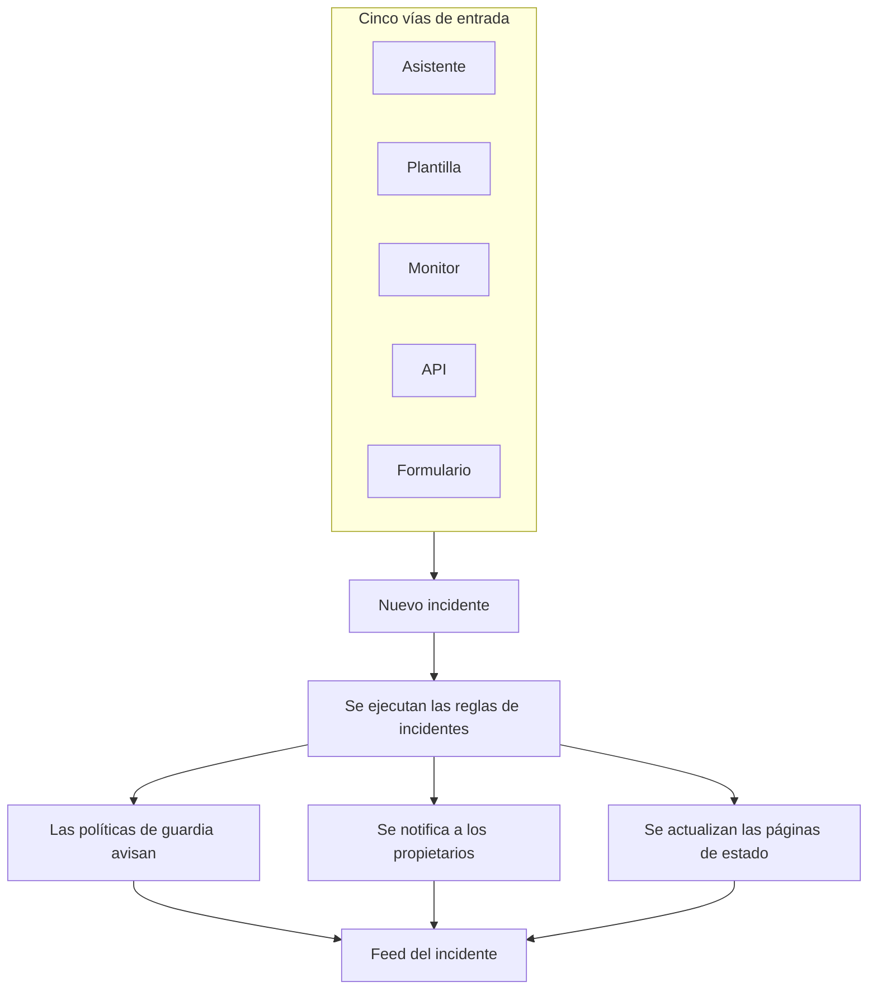
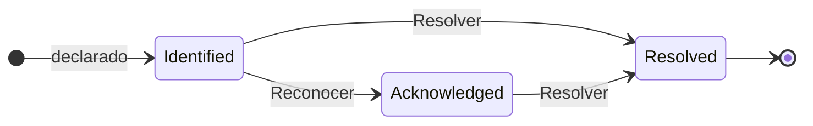

# Visión general de los incidentes

Un incidente es el registro con el que trabaja tu equipo cuando algo falla: qué está afectado, qué tan grave es, en qué punto está la respuesta, de quién es y todo lo que se anota por el camino. Declarar uno avisa a la rotación de guardia adecuada, informa a sus propietarios y —si así lo quieres— publica la interrupción en tu página de estado, para que los clientes sepan que ya estás en ello.

:::cards
- [Declarar un incidente](/docs/incidents/declaring-incidents): A mano, desde una plantilla, desde un monitor, por la API o mediante un formulario.
- [Estados y severidades de incidentes](/docs/incidents/states-and-severities): El ciclo de vida, y qué hacen reconocer y resolver.
- [Notas, responsables y actividad de incidentes](/docs/incidents/notes-owners-and-feed): Actualizaciones para los clientes y para tu equipo, y quién se entera de ellas.
- [Alertas vinculadas](/docs/incidents/linked-alerts): Une las alertas que provocó una interrupción al incidente que las explica.
- [Configuración y automatización de incidentes](/docs/incidents/settings): Plantillas, campos personalizados, roles, mediciones y reglas.
:::

## De un vistazo

- **Un producto propio** — abre **Incidentes** desde el menú **Productos** de la barra superior; la lista está en `/dashboard/{projectId}/incidents`.
- **Tres estados iniciales** — **Identificado**, **Reconocido** y **Resuelto** se crean en todo proyecto nuevo. Puedes añadir los tuyos; los tres iniciales se pueden renombrar y recolorear, pero nunca eliminar.
- **Tres gravedades iniciales** — **Critical Incident**, **Major Incident** y **Minor Incident**. Una gravedad es una etiqueta con un color y un orden: no tiene comportamiento propio.
- **Cinco vías de entrada** — el asistente **Declarar incidente**, **Crear desde plantilla**, una regla de criterios de un monitor, `POST /api/incident`, o un [formulario](/docs/forms/index) que cualquiera con su enlace puede rellenar.
- **Numerados por proyecto** — cada incidente recibe un número de incidente de un contador propio del proyecto, que se muestra con el prefijo de tu proyecto: `INC-42` en un proyecto nuevo, o `#42` sin prefijo.
- **Dos tipos de notas** — notas privadas (notas internas) para tu equipo y notas públicas para los suscriptores de la página de estado.
- **Las alertas se vinculan a los incidentes** — vincula las alertas que forman parte de un incidente, o declara un incidente directamente a partir de alertas —desde una lista de alertas o desde la página de una alerta— y reconócelas al hacerlo. Consulta [Alertas vinculadas](/docs/incidents/linked-alerts).
- **La configuración vive en Incidentes, no en Ajustes del proyecto** — estados, gravedades, plantillas, campos personalizados y los motores de reglas están todos en **Incidentes → Ajustes** e **Incidentes → Reglas**.

## Cómo funciona

Puedes declarar un incidente a mano a las tres de la madrugada, o dejar que un monitor lo declare en cuanto coincidan sus criterios. En ambos casos el incidente es el mismo objeto, con el mismo ciclo de vida y el mismo rastro documental al final.

### 1. Se declara

Cinco caminos llevan al mismo objeto:

- **A mano** — en la lista de incidentes, haz clic en **Declarar incidente**. Se abre el asistente **Declarar nuevo incidente**, de tres pasos: **Detalles del incidente**, **Recursos afectados**, **Guardia y roles**. El primer paso pide un título, una gravedad y una descripción, y lo que la mayoría de los incidentes nunca necesita queda plegado en **Más campos**. Solo el primer paso pide algo que tengas que responder: **Siguiente** recorre el resto, y **Declarar incidente** está en el resumen del final.
  - **A partir de alertas** — **Declarar incidente** sobre una selección de alertas, o en la cabecera de una alerta, abre el mismo asistente, rellenado a partir de las alertas, las vincula al nuevo incidente y, salvo que desmarques la casilla, las reconoce para que dejen de escalar; consulta [Alertas vinculadas](/docs/incidents/linked-alerts).
- **Desde una plantilla** — haz clic en **Crear desde plantilla** y elige una **Plantilla de incidente** guardada. Las plantillas rellenan el título, la descripción, la gravedad, el estado inicial, los recursos, las políticas de guardia, los propietarios y las etiquetas.
- **Desde un monitor** — una regla de criterios de un monitor con la opción «declarar un incidente» activada crea el incidente automáticamente en cuanto coinciden sus filtros. Los títulos y las descripciones admiten allí plantillas `{{variable}}`.
- **Por la API** — `POST /api/incident` con una clave de API. El servidor rellena por ti `declaredAt`, el estado de creación y el número de incidente.
- **Mediante un formulario** — alguien ajeno a tu equipo rellena un formulario que compartiste como enlace, sin cuenta de OneUptime. El incidente se declara oculto en las páginas de estado, a partir de la plantilla de incidente del formulario si tiene una. Consulta [Formularios](/docs/forms/index).

Las integraciones también abren incidentes: [Huntress](/docs/integrations/huntress) convierte cada informe de incidente que envía su SOC en un incidente, que avisa a las políticas de guardia que elijas. Consulta [Declarar un incidente](/docs/incidents/declaring-incidents) para el recorrido campo por campo.

### 2. Se enteran las personas adecuadas

Al crearse, OneUptime ejecuta la automatización que configuraste: reglas de privacidad, reglas de propietario, reglas de etiquetas, reglas de guardia y reglas de runbook. Todas las políticas de guardia adjuntas al incidente —a mano, desde una plantilla o añadidas por una regla de guardia que coincide— se ejecutan en paralelo.

Se notifica a los propietarios por los canales que cada uno activó en **Ajustes de usuario → Ajustes de notificaciones**: correo electrónico, SMS, llamada de voz, notificación push, WhatsApp, Telegram, Slack, Microsoft Teams o webhook. Si un incidente no tiene ningún propietario, la notificación recae en los propietarios del proyecto en lugar de perderse.

Si el incidente es visible en una página de estado y las notificaciones a suscriptores están activadas, también se avisa a los suscriptores: los de cada página de estado que lista uno de sus monitores, o solo los de las páginas a las que lo limitaste. Consulta [Una página de estado por audiencia](/docs/status-pages/one-status-page-per-audience) para dar a cada audiencia su propia página de estado.

> [!NOTE]
> Las notificaciones las envía una tarea programada que se ejecuta cada minuto, así que cuenta con hasta un minuto de retraso aproximadamente en lugar de un envío instantáneo.

### 3. Tu equipo lo trabaja

Los respondedores reconocen el incidente, adjuntan los recursos afectados, vinculan las alertas que forman parte de él, ejecutan runbooks, asignan roles de incidente y anotan lo que van descubriendo: notas privadas para el equipo, notas públicas para los clientes, y además las páginas **Causa raíz** y **Remediación** cuando el panorama se aclara. Todo lo que hacen llega al **Feed del incidente** en la página **Vista general**.

### 4. Se resuelve

Hacer clic en **Resolver** lleva el incidente al estado resuelto, deja constancia en la cronología de estados, detiene el contador de duración, devuelve los monitores que retiene y quita el incidente de la sección activa de cualquier página de estado en la que se mostraba. No hace falta cambiar nada más para que ocurra: una página de estado solo muestra incidentes en un estado situado por encima del estado resuelto. Consulta [Qué hace resolver](/docs/incidents/states-and-severities#qué-hace-resolver).

Después puedes escribir un post mortem y, si quieres, publicarlo en la página de estado.

## Términos clave

Un puñado de palabras aparece en todas las demás páginas de esta sección. Aclara estas primero.

| Término                     | Qué significa                                                                                                                                       |
| --------------------------- | --------------------------------------------------------------------------------------------------------------------------------------------------- |
| **Incidente**               | El registro en sí: título, descripción, gravedad, estado actual, recursos afectados y todo lo que se escribe en él durante la respuesta.             |
| **Estado del incidente**    | En qué punto de su ciclo de vida está el incidente. Una fila propia del proyecto con un nombre, un color y un `order`, más los indicadores que le dan sentido. |
| **Gravedad del incidente**  | Qué tan grave es. Una fila propia del proyecto con un nombre, un color y un `order`. Pura clasificación: nada en el producto trata una gravedad de forma especial. |
| **Número de incidente**     | Un contador por proyecto que se muestra como `#42`, o con un prefijo que configures, como `INC-42`.                                                 |
| **Recursos afectados**      | Los monitores, hosts, clústeres de Kubernetes, hosts de Docker, servicios y demás infraestructura que adjuntas al incidente.                        |
| **Nota pública**            | Una actualización escrita para los lectores y suscriptores de la página de estado. Se muestra en la cronología de la página de estado.              |
| **Nota privada**            | Una nota interna (el modelo `IncidentInternalNote`) para el equipo que responde. Nunca llega a una página de estado.                                 |
| **Propietario**             | Un usuario o un equipo responsable del incidente. Los propietarios reciben notificaciones cuando se crea, cuando se publican notas y cuando cambia el estado. |
| **Feed del incidente**      | La cronología de actividad de solo anexado en la **Vista general** del incidente, que registra cambios de estado, notas, cambios de propietarios, ejecuciones de reglas y notificaciones. |
| **Cronología de estados**   | El registro de en qué estado estuvo el incidente, cuándo y durante cuánto tiempo, con el estado de notificación a suscriptores de cada transición.   |
| **Alerta vinculada**        | Una alerta vinculada al incidente como parte de su respuesta. Una alerta puede vincularse a más de un incidente y conserva su propio estado.         |

## Los tres estados que OneUptime crea en cada proyecto

Al crear un proyecto, OneUptime crea exactamente tres estados de incidente, en este orden:

| Estado            | Orden | Color               | Qué significa                                                             |
| ----------------- | ----- | ------------------- | ------------------------------------------------------------------------- |
| **Identificado**  | 1     | Rojo (`#fd625e`)    | El estado en el que entra un incidente recién creado. Es el estado de creación. |
| **Reconocido**    | 2     | Amarillo (`#ffbf53`) | Alguien ha tomado el incidente y está trabajando en él.                  |
| **Resuelto**      | 3     | Verde (`#2ab57d`)   | El incidente ha terminado. Resolverlo es lo que lo retira de tu página de estado. |

Los nombres son solo etiquetas: lo que de verdad dirige el comportamiento son tres booleanos en la fila del estado: `isCreatedState`, `isAcknowledgedState` e `isResolvedState`. Se espera que solo un estado por proyecto tenga cada indicador.

Esa distinción importa más de lo que parece:

- `isCreatedState` decide dónde empieza un incidente nuevo. Si al crearlo no se elige explícitamente ningún estado, OneUptime busca el estado de creación del proyecto y lo usa.
- `isAcknowledgedState` e `isResolvedState` marcan el estado reconocido y el estado resuelto. La posición del estado de un incidente respecto a ellos decide los botones **Reconocer** y **Resolver** de la cabecera del incidente, los dos indicadores de la **Vista general** del incidente y el contador **Incidentes activos** del menú lateral: un incidente en el estado reconocido o en cualquier estado posterior está reconocido, y uno en el estado resuelto o en cualquier estado posterior está resuelto.
- **Incidentes activos** se define únicamente como «el estado actual está por encima del estado resuelto». Por eso, un estado personalizado que añadas por encima del estado resuelto está activo; uno que coloques después cuenta como resuelto, igual que el estado resuelto.

> [!NOTE]
> El primer estado inicial se llama **Identificado**, aunque varias descripciones del producto todavía lo llaman estado de creación («created»). Si buscas «Created» en la lista de estados de tu proyecto, es la fila llamada **Identificado**.

Puedes añadir tus propios estados en **Incidentes → Ajustes → Estado del incidente**. Un estado nuevo se añade justo por encima del estado resuelto, y reordenas las filas arrastrándolas; la columna **Cuenta como** muestra cómo cuenta un incidente en cada estado: no reconocido, reconocido o resuelto. Los tres estados marcados llevan la etiqueta **Predefinido**: conservan su orden y no se pueden eliminar, pero puedes renombrarlos, recolorearlos y moverlos, y por eso la interfaz lee los nombres de los estados de forma dinámica.

El orden se aplica, no es decorativo: un incidente no puede pasar a un estado que esté antes en el orden que su estado actual. Todos los detalles están en [Estados y severidades de incidentes](/docs/incidents/states-and-severities).

## Las tres gravedades que OneUptime crea en cada proyecto

Todo proyecto nuevo recibe además tres gravedades:

| Gravedad              | Orden | Color                | Qué significa                                              |
| --------------------- | ----- | -------------------- | ---------------------------------------------------------- |
| **Critical Incident** | 1     | Granate (`#b70400`)  | Impacto muy alto en los clientes, que requiere una respuesta inmediata. |
| **Major Incident**    | 2     | Rojo (`#fd625e`)     | Impacto importante, que suele requerir una respuesta inmediata. |
| **Minor Incident**    | 3     | Amarillo (`#ffbf53`) | Impacto bajo, que suele resolverse en horario laboral.     |

Las gravedades tienen `name`, `description`, `color` y `order`, y nada más. No hay indicadores, y ninguna ruta de código trata «Critical Incident» de forma distinta a cualquier otra fila. La gravedad es la forma en que las personas priorizan, y está disponible como criterio de coincidencia cuando escribes reglas de guardia, pero elegir una gravedad no avisa, por sí sola, a nadie.

Edita o añade gravedades en **Incidentes → Ajustes → Gravedad del incidente**. Las descripciones iniciales completas están en [Estados y severidades de incidentes](/docs/incidents/states-and-severities).

## Dónde están los incidentes en el panel

Abre **Incidentes** desde el menú **Productos** de la barra superior. Su menú lateral está organizado en secciones:

| Sección                  | Qué haces allí                                                                                                                                                             |
| ------------------------ | -------------------------------------------------------------------------------------------------------------------------------------------------------------------------- |
| **Vista general**        | **Todos los incidentes** e **Incidentes activos**; este último lleva una insignia roja con el número de incidentes en un estado situado por encima del estado resuelto.       |
| **Episodios**            | Los episodios de incidente, una función de agrupación aparte con sus propias páginas.                                                                                      |
| **IA**                   | **Análisis**, **Registros**, **Ajustes**: lo que OneUptime AI aprendió de tus incidentes y todo lo que hizo por ellos, y lo que puede hacer por su cuenta, con las reglas de qué incidentes investiga y corrige. Consulta [AI SRE](/docs/ai/ai-sre). |
| **Espacio de trabajo**   | Los espacios de chat que este proyecto ha conectado: **Slack**, **Microsoft Teams** o ambos, cada uno con sus reglas de notificación para incidentes. Si no hay ninguno conectado, contiene **Conectar Slack o Teams**, una página que muestra ambos y cómo conectarlos. |
| **Integraciones**        | Herramientas que abren incidentes por su cuenta: **Huntress**, cuyos informes de incidente se convierten en incidentes que avisan a la guardia. Consulta [Huntress](/docs/integrations/huntress). |
| **Reglas**               | Los motores de reglas: **Reglas de agrupación**, **Reglas de guardia**, **Reglas del propietario**, **Reglas de runbook**, **Reglas de privacidad**, **Reglas de etiquetas**, **Reglas de SLA**, **Reglas de recordatorio**. |
| **Ajustes**              | **Estado del incidente**, **Gravedad del incidente**, **Plantillas de incidente**, **Plantillas de notas**, **Plantillas de post mortem**, **Campos personalizados**, **Roles de incidente**, **Mediciones**, **Alertas vinculadas**, **Prefijo de número**. |

**Vista general** y **Episodios** están abiertas; **IA**, **Espacio de trabajo**, **Integraciones**, **Reglas**, **Ajustes** y **Desarrolladores** están plegadas por defecto, para que el menú se abra con las listas que usas cada día. Haz clic en el título de una sección para desplegarla y encontrar las páginas a las que se refiere el resto de esta documentación; una sección también se abre sola siempre que estás en una de sus páginas. La configuración de incidentes no está en los ajustes del proyecto; vive toda aquí.

La lista de incidentes muestra **Número de incidente**, **Título**, **Estado**, **Gravedad**, **Recursos afectados**, **Declarado**, **Duración**, **Etiquetas** y **Propietarios**, con una acción masiva **Cambiar estado** para cerrar varios a la vez.

## Qué muestra cada página de un incidente

Abre un incidente y su propio menú lateral agrupa sus páginas así:

| Sección del menú lateral | Páginas                                                                                   |
| ------------------------ | ----------------------------------------------------------------------------------------- |
| **Vista general**        | **Vista general**, **Cronología de estados**, **SLA**                                     |
| **Investigación**        | **Descripción**, **Causa raíz**, **Remediación**, **Runbooks**, **Post mortem**, **Alertas vinculadas** |
| **Equipo**               | **Roles**, **Ejecuciones de guardia**, **Propietarios**                                   |
| **Notificaciones**       | **Registros de notificación**, **Registros de IA** — plegada hasta que haces clic en **Notificaciones** |
| **Notas**                | **Notas privadas**, **Notas públicas**                                                    |
| **Desarrolladores**      | **Terraform**, **API**, **Asistentes de IA** — plegada hasta que haces clic en **Desarrolladores** |
| **Avanzado**             | **Campos personalizados**, **Ajustes**, **Registros de auditoría**, **Eliminar incidente** — plegada hasta que haces clic en **Avanzado** |

Qué contiene cada una:

- **Vista general** — la respuesta de un vistazo. Bajo la cabecera, unos indicadores muestran el tiempo hasta el reconocimiento, el tiempo hasta la resolución y la **Duración** total. La tarjeta **Investigación de IA** encabeza la página —lo que encontró OneUptime AI, o por qué no empezó—, con el **Feed del incidente** debajo. A su lado están la tarjeta **Videollamada**, la tarjeta **Detalles del incidente** (título, gravedad, etiquetas, número de incidente, declarado el, declarado por, políticas de guardia, y el ID del incidente en una pequeña línea **ID** al pie, a un clic de tu portapapeles), **Roles de incidente**, una tarjeta **Recursos afectados** y los campos personalizados del incidente. Cuando tu proyecto tiene [mediciones](/docs/incidents/settings#mediciones), una tarjeta **Mediciones** bajo **Detalles del incidente** indica qué muestra cada una para este incidente: **12 minutos**, **En curso desde hace 5 minutos**, **No alcanzado**.
- **Cronología de estados** — cada estado por el que ha pasado el incidente, con **Comienza en**, **Termina en**, **Duración** y el estado de notificación a suscriptores de cada transición. **Ver causa** y **Ver registros** explican por qué ocurrió cada cambio.
- **SLA** — el seguimiento del SLA de este incidente.
- **Descripción**, **Causa raíz**, **Remediación** — tres páginas en Markdown. La descripción es la que se muestra en tu página de estado.
- **Runbooks** — las ejecuciones de runbook adjuntas a este incidente.
- **Post mortem** — el informe y sus adjuntos, que puedes publicar opcionalmente en la página de estado. **Editar nota de análisis post mortem** pide la nota y los adjuntos, y luego **Publicar en la página de estado**; solo mientras esa opción está activada pide **Notificar a los suscriptores** y **Análisis post mortem publicado el**, que al activar la publicación se fija en ahora. **Generar con IA** redacta la nota por ti, y **Aplicar plantilla** —que se muestra en cuanto el proyecto tiene una plantilla de post mortem— la empieza a partir de una. A los suscriptores se les avisa una vez, cuando se publica el post mortem: la primera vez que la página de estado lo muestra, lo que requiere **Publicar en la página de estado** activado y una nota escrita. Guardarlo de nuevo, o editarlo mientras está publicado, actualiza la página de estado sin avisar a nadie; volver a publicarlo después de retirarlo de la página de estado les avisa de nuevo. Uno publicado mientras el incidente está oculto se envía cuando el incidente se hace visible. Consulta [El post mortem](/docs/status-pages/subscribers#incidentes).
- **Alertas vinculadas** — las alertas vinculadas a este incidente, con el estado actual de cada alerta, y quién la vinculó y cuándo. Las alertas tienen una página **Incidentes vinculados** equivalente. Consulta [Alertas vinculadas](/docs/incidents/linked-alerts).
- **Roles**, **Ejecuciones de guardia**, **Propietarios** — quién está en él, qué políticas se activaron y a quién se notifica.
- **Registros de notificación**, **Registros de IA**, **Registros de auditoría** — qué se envió y qué cambió.
- **Notas privadas** y **Notas públicas** — qué se le dijo a tu equipo y a tus clientes. Consulta [Notas, responsables y actividad de incidentes](/docs/incidents/notes-owners-and-feed).
- **Campos personalizados**, **Ajustes**, **Eliminar incidente** — la página **Ajustes** contiene **Visible en la página de estado** e **Incidente privado**, la tarjeta **Alcance de páginas de estado** que limita el incidente a algunas páginas de estado, y la tarjeta **Recordatorios**, cuyo interruptor **Enviar recordatorios** se guarda en cuanto lo cambias y muestra cuándo sale el próximo recordatorio.

## Cómo encajan los incidentes con el resto de OneUptime

- **Los monitores detectan el problema; los incidentes lo registran.** Una regla de criterios de un monitor puede declarar un incidente automáticamente, rellenando título, gravedad, políticas de guardia, propietarios, etiquetas y notas de remediación. Consulta [Plantillas de incidentes y alertas](/docs/monitor/incident-alert-templating) para las variables disponibles.
- **Las alertas son las señales; los incidentes, la respuesta.** Vincula a un incidente las alertas que explica, desde cualquiera de los dos lados, y dos interruptores del proyecto, activados en los proyectos nuevos, reconocen y resuelven esas alertas junto con el incidente. Consulta [Alertas vinculadas](/docs/incidents/linked-alerts).
- **Las políticas de guardia se encargan de avisar.** Adjunta políticas en el paso **Guardia y roles** del asistente de declaración, en una plantilla o mediante **Incidentes → Reglas → Reglas de guardia**. Se activa toda regla que coincide: el conjunto ejecutado es la unión de todas las coincidencias más lo adjuntado directamente, sin duplicados.
- **Los runbooks dicen a la gente qué hacer.** Las reglas de runbook adjuntan un procedimiento automáticamente cuando se crea un incidente que coincide, y los respondedores pueden iniciar uno a mano desde el incidente. Consulta [Visión general de los Runbooks](/docs/runbooks/index).
- **Las páginas de estado informan a los clientes.** Un incidente aparece en la lista activa de una página de estado cuando la página lista uno de sus monitores, la página tiene los incidentes activados, el incidente está marcado como visible en la página de estado y su estado actual está por encima del estado resuelto. Un incidente limitado a algunas páginas de estado solo aparece en esas. Los incidentes privados se ocultan siempre en todas las páginas de estado. Consulta [Visión general de las páginas de estado](/docs/status-pages/index) y [Una página de estado por audiencia](/docs/status-pages/one-status-page-per-audience).
- **Los flujos de trabajo automatizan alrededor.** Los disparadores **On Create Incident**, **On Update Incident** y **On Delete Incident** te permiten construir automatización sin código sobre el ciclo de vida del incidente. Consulta [Visión general de los flujos de trabajo](/docs/workflows/index).

## Próximos pasos

:::cards
- [Declarar un incidente](/docs/incidents/declaring-incidents): Recorre el asistente campo por campo, o declara desde una plantilla, un monitor o la API.
- [Estados y severidades de incidentes](/docs/incidents/states-and-severities): Añade tus propios estados y mira exactamente qué hace cada uno.
- [Visión general de las páginas de estado](/docs/status-pages/index): Cómo llegan los incidentes a tus clientes.
- [Suscriptores y anuncios](/docs/status-pages/subscribers): A quién se notifica cuando un incidente avanza.
:::
