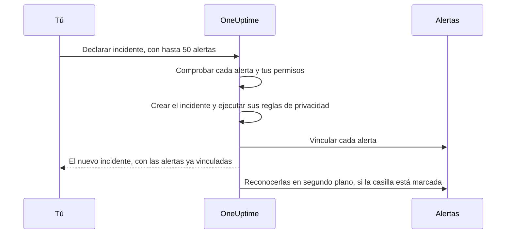

# Alertas vinculadas

Una interrupción rara vez dispara una sola alerta. Cuando cae la base de datos principal, se dispara el monitor de retraso de replicación, se dispara el monitor de tasa de errores de la API, y el SLO de latencia del pago empieza a consumir su presupuesto: tres alertas, un problema. Vincular esas alertas al incidente lo dice: el incidente es donde ocurre la respuesta, y cada alerta muestra qué incidente la explica.

Un vínculo es solo un vínculo. La alerta conserva su propio estado, sus propietarios, sus políticas de guardia, sus notas y su feed; el incidente conserva los suyos. Vincular no fusiona ni copia nada, y por sí solo nunca reconoce, resuelve ni silencia una alerta. (Declarar un incidente nuevo a partir de alertas es distinto: el nuevo incidente se rellena a partir de ellas, como se [describe más abajo](#declarar-un-incidente-a-partir-de-alertas), y salvo que desmarques la casilla del formulario, las alertas se reconocen al declararlo, lo que detiene su escalado; consulta [Reconocer las alertas al declarar](#reconocer-las-alertas-al-declarar)). Dos interruptores del proyecto, activados en los proyectos nuevos, hacen que las alertas vinculadas acompañen al incidente cuando se reconoce y se resuelve; consulta [más abajo](#mantener-los-estados-de-las-alertas-sincronizados-con-el-incidente).

:::cards
- [Vincular alertas a un incidente](#vincular-alertas-desde-un-incidente): Desde el incidente, desde una alerta, o muchas a la vez.
- [Declarar un incidente a partir de alertas](#declarar-un-incidente-a-partir-de-alertas): Un incidente nuevo, rellenado y vinculado de una vez.
- [Mantener sincronizados los estados de las alertas](#mantener-los-estados-de-las-alertas-sincronizados-con-el-incidente): Reconocer y resolver las alertas junto con el incidente.
- [Permisos](#permisos): Quién puede vincular, y qué le permite hacer vincular.
:::

> [!TIP]
> Si vienes de Opsgenie, esta es la versión de OneUptime de asociar alertas a un incidente.

## De un vistazo

- **Muchos a muchos** — un incidente puede tener cualquier número de alertas vinculadas, y una alerta puede vincularse a varios incidentes.
- **Tres sitios para vincular** — la página **Alertas vinculadas** del incidente, la página **Incidentes vinculados** de la alerta, y la acción masiva **Vincular a incidente** de las listas principales de alertas, para hasta **50** alertas a la vez.
- **Declarar un incidente a partir de alertas** — **Declarar incidente** en una lista de alertas, en la cabecera de una alerta o en su página **Incidentes vinculados** rellena un incidente nuevo a partir de las alertas y las vincula al crearlo. Una casilla del formulario, marcada por defecto, también las reconoce, lo que detiene su propio escalado de guardia.
- **Registrado en ambos lados** — cada vínculo y desvínculo escribe una entrada de feed en el incidente y en la alerta, salvo que un incidente declarado a partir de alertas recibe una sola entrada que las lista todas. Solo las entradas del incidente se publican en Slack y Microsoft Teams, y el título de una alerta o un incidente privados nunca se escribe en el otro lado.
- **Los estados de las alertas siguen al incidente** — dos interruptores del proyecto, ambos activados en los proyectos nuevos, reconocen y resuelven las alertas vinculadas cuando se reconoce y se resuelve el incidente. Desactiva cualquiera de los dos en **Incidentes → Ajustes → Alertas vinculadas**.
- **Automatizable** — los vínculos son un recurso normal de la API, `/api/incident-alert`.

## Cómo funciona

Las alertas son señales: coincidieron los criterios de un monitor, un SLO empezó a consumir su presupuesto, se disparó una regla de seguridad. Un incidente es la respuesta coordinada a un problema (consulta [Visión general de los incidentes](/docs/incidents/index)). La mayoría de los problemas producen varias señales, y sin vínculos, lo único que las une a la respuesta es la memoria de alguien.

```mermaid title="Tres alertas, un incidente, y los interruptores que las mueven"
flowchart TB
    subgraph signals["Alertas"]
        direction LR
        lag["Retraso de replicación"]
        errors["Tasa de errores de la API"]
        latency["Latencia del pago"]
    end
    signals -->|"vinculadas a"| incident["Incidente"]
    incident -->|"reconocido"| ack["Alertas vinculadas reconocidas"]
    incident -->|"resuelto"| res["Alertas vinculadas resueltas"]
```

Con las alertas vinculadas:

- Los respondedores del incidente ven, en una lista, qué alertas forman parte de él y en qué estado está cada una.
- Quien abre una de esas alertas ve que ya se está atendiendo, y bajo qué incidente, en lugar de declarar un segundo incidente para la misma interrupción.
- El feed del incidente registra cuándo se vinculó cada alerta y quién lo hizo, así que la cronología muestra cómo se fue formando el panorama.
- Con los interruptores activados, reconocer el incidente detiene los escalados de guardia de las alertas, para que a quienes trabajan el incidente no se les vuelva a avisar por sus síntomas.

## Cómo funcionan los vínculos

Un vínculo une una alerta con un incidente. Los vínculos funcionan en ambos sentidos: el mismo vínculo aparece en la página **Alertas vinculadas** del incidente y en la página **Incidentes vinculados** de la alerta.

- **Una alerta puede vincularse a varios incidentes.** El fallo de una dependencia compartida puede ser síntoma de dos incidentes distintos. Cada incidente lista la alerta, y la alerta lista ambos incidentes.
- **Cada par se vincula una vez.** Vincular una alerta a un incidente al que ya está vinculada se rechaza con «This alert is already linked to this incident.», incluso cuando dos personas vinculan el mismo par en el mismo momento.
- **Los vínculos se crean o se eliminan, nunca se editan.** Un vínculo no tiene más campos que su incidente, su alerta, cuándo se hizo y quién lo hizo. Para mover una alerta a otro incidente, vincúlala al nuevo y desvincúlala del anterior.
- **Los vínculos se quedan dentro de un proyecto.** La alerta y el incidente deben pertenecer al mismo proyecto.

## Vincular alertas desde un incidente

:::steps
### Abrir la página Alertas vinculadas del incidente

Abre el incidente y elige **Alertas vinculadas** en la sección **Investigación** de su menú lateral. La tabla lista cada alerta ya vinculada a él.

### Elegir la alerta

Haz clic en **Vincular alerta** y elígela en el desplegable **Alerta**. El desplegable lista primero las alertas más recientes, cada una con su número —como `ALT-63: Checkout API is offline`—, para poder distinguir alertas con el mismo título, como las alertas repetidas de un monitor. Para encontrar una alerta más antigua, escribe: el desplegable busca en todas las alertas por título.

### Guardar el vínculo

Haz clic en **Vincular alerta** en el diálogo. La alerta aparece en la tabla, y ambos feeds registran el vínculo. Si el vínculo se rechaza, por ejemplo porque la alerta ya está vinculada, el diálogo sigue abierto y dice por qué.
:::

| Columna           | Qué muestra                                      |
| ----------------- | ------------------------------------------------ |
| **Alerta n.º**    | El número de la alerta, como `#17` o `ALT-17`.   |
| **Título**        | El título de la alerta, con un enlace a la alerta. |
| **Estado actual** | El propio estado de la alerta, como **Reconocido**. |
| **Vinculado el**  | Cuándo se vinculó la alerta.                     |
| **Vinculado por** | Quién la vinculó.                                |

Cada fila tiene **Ver alerta** para abrir la alerta y **Desvincular** para quitar el vínculo.

## Vincular incidentes desde una alerta

El lado de la alerta refleja el del incidente. Abre una alerta y elige **Incidentes vinculados** en la sección **Básico** de su menú lateral. La tabla lista cada incidente al que está vinculada la alerta, con el número, el título y el estado actual del incidente, y cuándo y quién la vinculó.

- **Vincular incidente** vincula esta alerta a un incidente existente. Su desplegable funciona como el del lado del incidente: primero los incidentes más recientes, cada uno con su número —como `INC-42: Checkout is down`—, y escribir busca en todos los incidentes por título.
- **Ver incidente** abre un incidente vinculado.
- **Desvincular** quita un vínculo.
- **Declarar incidente** inicia un incidente nuevo a partir de esta alerta. El mismo botón está en la cabecera de la alerta, junto a **Reconocer** y **Resolver**. Consulta [Declarar un incidente a partir de alertas](#declarar-un-incidente-a-partir-de-alertas).

## Vincular muchas alertas a la vez

Las listas principales de alertas tienen dos acciones masivas para esto: **Todas las alertas** y **Alertas activas**, las alertas activas de la página de inicio, y la página **Alertas** de un monitor, un servicio, un host, un clúster de Kubernetes, un SLO o cualquier otro recurso que tenga una. La lista **Alertas miembro** de un episodio de alerta no las tiene: selecciona las alertas en una de las listas principales. Selecciona las alertas y elige:

- **Vincular a incidente** — elige el incidente en el desplegable **Incidente** y haz clic en **Vincular alertas**. Los incidentes más recientes se listan primero, con sus números, y escribir busca en todos los incidentes por título. OneUptime vincula cada alerta seleccionada, mostrando el progreso sobre la marcha. Una alerta que ya está vinculada a ese incidente cuenta como hecha en lugar de fallida, así que ejecutar la acción dos veces no causa problemas.
- **Declarar incidente** — abre el formulario de declaración de un incidente nuevo rellenado a partir de las alertas seleccionadas. Consulta la sección siguiente.

Ambas acciones admiten hasta **50** alertas a la vez. Selecciona más y se desactivan, con una descripción emergente que dice por qué. El límite existe porque cada vínculo escribe en ambos feeds, y cada vínculo hecho con **Vincular a incidente** también se publica en los canales de Slack y Microsoft Teams del incidente: una selección de mil alertas los inundaría.

## Declarar un incidente a partir de alertas

Cuando una ráfaga de alertas resulta ser un incidente que nadie ha declarado todavía, decláralo a partir de las alertas. Hay tres formas de entrar:

- Selecciona las alertas en una de las listas principales de alertas y elige **Declarar incidente**.
- Abre una alerta y haz clic en **Declarar incidente** en su cabecera, junto a **Reconocer** y **Resolver**. Se queda ahí cuando la alerta está reconocida o resuelta, así que aún puedes declarar un incidente para una alerta a posteriori, para hacerle un post mortem, por ejemplo.
- Abre la página **Incidentes vinculados** de una alerta y haz clic en **Declarar incidente**.

Las tres necesitan permiso para crear incidentes y vincularles alertas. Sin él, el botón está bloqueado, y su descripción emergente nombra el permiso que falta.

Uses la que uses, llegas al formulario habitual **Declarar nuevo incidente**, con las alertas listadas como las que se vincularán y estos campos rellenados:

| Campo                      | Rellenado con                                                                                                                                                                                                                                                                          |
| -------------------------- | -------------------------------------------------------------------------------------------------------------------------------------------------------------------------------------------------------------------------------------------------------------------------------------- |
| **Título**                 | Una alerta: su título. Varias: el título de la alerta más grave.                                                                                                                                                                                                                       |
| **Descripción**            | Una alerta: su descripción. Varias: una lista con una línea por alerta, con su número y su título.                                                                                                                                                                                     |
| **Gravedad del incidente** | La gravedad de la alerta más grave, traducida a una gravedad de incidente. Gana una gravedad de incidente con el mismo nombre, sin distinguir mayúsculas. Si no, OneUptime toma la gravedad de incidente que está en la misma posición del orden de gravedades, o la última si tienes menos gravedades de incidente. |
| **Recursos afectados**     | Todos los monitores, hosts, clústeres de Kubernetes, hosts de Docker, hosts de Podman y servicios de las alertas seleccionadas, combinados. Los monitores van en **Monitores** y el resto en **Otros recursos afectados**. Otros recursos, como los SLO o los clústeres de VMware, Proxmox y Ceph, no se copian: añádelos tú si el incidente los afecta. |
| **Etiquetas**              | Todas las etiquetas de todas las alertas seleccionadas.                                                                                                                                                                                                                                |
| **Incidente privado**      | Activado si alguna de las alertas es privada. El formulario lo dice, y los propietarios de las alertas pasan a ser propietarios del incidente; consulta más abajo.                                                                                                                    |

«La más grave» sigue el orden de tus gravedades de alerta: la primera gravedad de alerta de la lista es la más grave. Con las gravedades con las que empieza todo proyecto, una alerta **Alta** se convierte en un **Critical Incident** y una alerta **Low** en un **Major Incident**.

Todo se puede editar antes de enviar. **Etiquetas** e **Incidente privado** están en **Más campos** en el primer paso del formulario, cuya cabecera plegada muestra cualquiera de los dos mientras está definido.

**Se señala una alerta que ya tiene un incidente.** Con **Declarar incidente** en la página de cada alerta, dos respondedores avisados por la misma interrupción podrían declararla cada uno. Por eso el aviso que lista las alertas marca cada alerta que ya está vinculada a un incidente —«(already linked to Incident INC-42)», con un enlace a ese incidente— y añade una nota, redactada según cuántas de las alertas están vinculadas:

- Todas las alertas, y es una: «This alert is already linked to an incident. If it is the same problem, update that incident instead of declaring another one.»
- Todas las alertas, y son varias: «These alerts are already linked to incidents. If it is the same problem, update that incident instead of declaring another one.»
- Solo algunas: «Some of these alerts are already linked to an incident. If it is the same problem, link the other alerts to that incident from the alerts list instead of declaring another one.»

Los enlaces a los incidentes se abren en una pestaña nueva, para que puedas revisar el incidente existente sin perder lo que has rellenado en el formulario. La nota es un recordatorio, no un bloqueo, y solo se nombran los incidentes que tienes permiso para ver.

**Las políticas de guardia no se copian.** Las alertas ejecutaron sus propias políticas de guardia al crearse, así que copiarlas al incidente avisaría a las mismas personas una segunda vez. Las políticas de guardia del incidente son las que elijas en el paso **Guardia y roles** más las que añadan tus reglas de guardia de incidentes, exactamente igual que en cualquier otro incidente.

**Los monitores de las alertas se rellenan como monitores afectados.** Como en cualquier incidente declarado a mano, el monitoreo activo de los monitores del incidente se pausa hasta que se resuelve el incidente. Quita un monitor de **Monitores** en el paso **Recursos afectados** antes de enviar si debe seguir comprobándose.

**Una alerta privada da un incidente privado.** Si alguna de las alertas es privada, **Incidente privado** empieza activado, y el aviso que lista las alertas lo dice. Un incidente privado solo es visible para sus propietarios, los Project Owners y los Project Admins, así que OneUptime se asegura de que quienes podían ver las alertas puedan ver el incidente: una vez declarado, los propietarios de cada alerta declarada —tanto usuarios como equipos— se añaden como propietarios del incidente, sin recibir notificación. Se añaden justo después de que se creen los canales de Slack y Microsoft Teams del incidente, así que se les invita a esos canales como a cualquier otro propietario. Tú también eres propietario, como en cualquier incidente que declares. Lo mismo ocurre cuando una regla de privacidad de incidentes hace privado el nuevo incidente. Si desactivas **Incidente privado** antes de enviar y no se aplica ninguna regla de privacidad, el incidente no es privado y no se copia ningún propietario.



Cuando envías, el servidor comprueba las alertas antes de crear nada: como mucho 50, cada una una alerta de este proyecto que tienes permiso para ver, y debes tener permiso para vincular alertas a incidentes. Si alguna comprobación falla, la solicitud se rechaza y no se crea ningún incidente, así que un id de alerta incorrecto nunca gasta un número de incidente. Una vez que existe el incidente —y una vez ejecutadas sus reglas de privacidad, para que los vínculos sepan si es privado—, cada alerta se vincula antes de que la solicitud responda, así que la página **Alertas vinculadas** del incidente ya las lista. Si falla un único vínculo —porque la alerta se eliminó un momento antes, por ejemplo—, el incidente se declara igualmente y las demás alertas se vinculan igualmente.

El feed del incidente recibe una sola entrada **Alerta vinculada** que lista las alertas, escrita después de **Incidente creado**, en lugar de una por alerta; consulta [El feed, Slack y Microsoft Teams](#el-feed-slack-y-microsoft-teams).

### Reconocer las alertas al declarar

Declarar un incidente no detiene, por sí solo, los avisos de sus alertas: el escalado de guardia de una alerta solo se detiene cuando se reconoce la propia alerta. Así que, cuando alguna de las alertas aún no está reconocida, el aviso del formulario tiene una casilla, marcada por defecto: **Acknowledge this alert to stop its escalation** para una alerta, **Acknowledge these 3 alerts to stop their escalation** para varias. Si algunas ya están reconocidas, solo nombra las demás y dice que el resto se deja como está.

Déjala marcada y, una vez declarado el incidente y vinculadas las alertas:

- **Las alertas se reconocen en tu nombre.** Cada una pasa a tu estado de alerta **Reconocido** como si hubieras hecho clic tú en **Reconocer**: la **Cronología de estados** y el feed de la alerta te nombran, se notifica a los propietarios de la alerta, y el cambio se publica en los canales de Slack y Microsoft Teams de la alerta como cualquier otro cambio de estado de alerta. La causa dice «Acknowledged because Incident INC-42 was declared from this alert.» o, para un incidente privado, «Acknowledged because a private incident was declared from this alert.», para que un incidente privado nunca se nombre donde pueda leerlo el público de la alerta.
- **Su propio escalado de guardia se detiene en un minuto aproximadamente.** El siguiente paso de escalado ve una alerta reconocida y se detiene. Los avisos que ya salieron no se retiran.
- **Los recordatorios solo se detienen si la regla de recordatorio lo indica.** Los recordatorios de una alerta solo se detienen al reconocerla cuando su regla de recordatorio tiene **Dejar de recordar cuando** puesto en **Reconocido**; si no, continúan hasta que se resuelve la alerta.
- **Un episodio de alerta sigue escalando.** Si una alerta pertenece a un episodio que avisa mediante su propia política de guardia, el episodio sigue escalando hasta que se reconoce el propio episodio.
- **Las alertas ya reconocidas o resueltas se dejan en paz.** Como en todas partes, los estados se comparan por su orden, así que una alerta en un estado personalizado posterior a **Reconocido** cuenta como reconocida, y nada se mueve nunca hacia atrás.

Desmarca la casilla para declarar sin reconocer. Siempre que vayan a quedar alertas sin reconocer —la casilla está desmarcada o bloqueada—, el formulario lo dice: «Declaring the incident does not acknowledge the alert: it keeps escalating until it is acknowledged.» Y si reconoces las alertas sin elegir una política de guardia para el incidente, el resumen del paso **Guardia y roles** lo señala: «The alerts it is declared from are acknowledged too, so their own escalation stops. An alert episode they belong to keeps escalating until the episode is acknowledged, and an incident on-call rule, if any, may still page.»

**Necesitas permiso para reconocer las alertas.** Reconocerlas al declarar requiere **Create Alert State Timeline** y **Edit Alert** (reconocer una alerta en su propia página solo requiere el primero: consulta [Cambiar un estado](/docs/permissions/index#cambiar-un-estado)): Project Owner, Project Admin, Project Member, Alert Admin y Alert Member tienen ambos, mientras que Incident Admin e Incident Member, que pueden declarar incidentes a partir de alertas, no tienen ninguno. Tu alcance de etiquetas y de propietarios en las alertas también debe incluir cada alerta que se vaya a reconocer; solo se comprueban las que aún no están reconocidas. Las alertas ya reconocidas o resueltas no necesitan ningún permiso y nunca bloquean la declaración. Sin los permisos, la casilla está bloqueada, con una descripción emergente que nombra el que falta, y aun así puedes declarar el incidente. El servidor vuelve a comprobar antes de crear nada, para cada alerta que va a reconocer: si no puedes reconocer alguna, no se crea ningún incidente y el formulario dice por qué; desmarca la casilla y vuelve a enviar.

**El proyecto necesita un estado de alerta Reconocido.** Todo proyecto empieza con uno. Si el tuyo no lo tiene, no se ofrece la casilla.

Las alertas se reconocen en segundo plano, justo después de vincularse, unas pocas a la vez —hasta 5 a la vez—, para que la página del incidente pueda abrirse un momento antes y declarar a partir de muchas alertas no deje esperando a las últimas detrás de todas las demás. Una alerta que no se puede reconocer —porque se eliminó entretanto, por ejemplo— se registra y nunca detiene a las demás ni al incidente, y una alerta que otra persona reconoce o resuelve entretanto se queda como la dejó.

**Con los interruptores de alertas vinculadas del proyecto activados, puede que sean los interruptores los que muevan las alertas.** Si el incidente se declara directamente en un estado reconocido o resuelto y uno de los [interruptores de alertas vinculadas](#mantener-los-estados-de-las-alertas-sincronizados-con-el-incidente) actúa sobre ese estado, el interruptor mueve las alertas vinculadas a medida que se vinculan, y la casilla le deja esas alertas, para que cada alerta tenga un solo autor de cambios. Se reconocen o resuelven como lo hace el interruptor —con la causa del interruptor, como «Acknowledged because linked Incident INC-42 was acknowledged.», que nombra el incidente por su número aunque sea privado—, no se te atribuyen, y no se notifica a sus propietarios. Declarar en tu primer estado de incidente, como siempre, o con los interruptores desactivados, deja cada alerta a la casilla.

### Declarar por la API

`POST /api/incident` acepta los ids de las alertas que vincular en `miscDataProps`, en `alertIdsToLink`, y si reconocer esas alertas en `acknowledgeAlertsToLink`:

```bash
curl -X POST https://oneuptime.com/api/incident \
  -H "apikey: $ONEUPTIME_API_KEY" \
  -H "Content-Type: application/json" \
  -d '{
    "data": {
      "title": "Primary database unavailable",
      "incidentSeverityId": "<incident-severity-id>"
    },
    "miscDataProps": {
      "alertIdsToLink": ["<alert-id>", "<another-alert-id>"],
      "acknowledgeAlertsToLink": true
    }
  }'
```

`alertIdsToLink` es un array de 1 a 50 ids de alerta. Los duplicados se ignoran, y se aplican las mismas comprobaciones que en el panel, antes de crear el incidente. Por la API no se rellena nada: envía el título, la gravedad y los recursos que quieras. La clave de API necesita permiso para crear incidentes y vincularles alertas, y debe poder leer las alertas. Una clave de API no es un usuario, así que los vínculos hechos con ella no tienen **Vinculado por**. Para el resto del cuerpo de la solicitud, consulta [Declarar un incidente](/docs/incidents/declaring-incidents).

`acknowledgeAlertsToLink` es opcional, y está desactivado salvo que lo envíes. Ponlo a `true` para reconocer las alertas una vez vinculadas, como hace la casilla del formulario: las alertas ya reconocidas o resueltas se dejan en paz y no necesitan ningún permiso. Omítelo, o envía `false`, para declarar sin reconocerlas. Se comprueba junto con los ids de las alertas, antes de crear el incidente, y la solicitud se rechaza con un 400 cuando:

- es cualquier cosa distinta de `true` o `false`;
- se envía sin `alertIdsToLink`;
- el proyecto no tiene un estado de alerta Reconocido;
- la clave de API no puede reconocer cada alerta que aún no está reconocida: eso requiere **Create Alert State Timeline** y **Edit Alert**, con un alcance de etiquetas que incluya cada una de esas alertas.

Una clave de API no es un usuario, así que las alertas reconocidas con ella no se atribuyen a nadie, igual que sus vínculos no tienen **Vinculado por**.

## Vincular y desvincular por la API

Los vínculos son un recurso CRUD estándar en `/api/incident-alert`. Para vincular una alerta a un incidente, crea uno:

```bash
curl -X POST https://oneuptime.com/api/incident-alert \
  -H "apikey: $ONEUPTIME_API_KEY" \
  -H "Content-Type: application/json" \
  -d '{
    "data": {
      "incidentId": "<incident-id>",
      "alertId": "<alert-id>"
    }
  }'
```

Para listar las alertas vinculadas de un incidente, consulta por `incidentId`. Consulta en cambio por `alertId` para encontrar los incidentes a los que está vinculada una alerta:

```bash
curl -X POST https://oneuptime.com/api/incident-alert/get-list \
  -H "apikey: $ONEUPTIME_API_KEY" \
  -H "Content-Type: application/json" \
  -d '{
    "query": { "incidentId": "<incident-id>" },
    "select": { "_id": true, "alertId": true, "createdAt": true },
    "limit": 50,
    "skip": 0
  }'
```

Para desvincular, elimina el vínculo por su propio id: el `_id` del vínculo, no el de la alerta ni el del incidente:

```bash
curl -X DELETE https://oneuptime.com/api/incident-alert/<link-id> \
  -H "apikey: $ONEUPTIME_API_KEY"
```

Ambos ids son obligatorios. Una solicitud de vínculo también se rechaza cuando la alerta o el incidente pertenecen a otro proyecto o son uno que no puedes ver. El error dice lo mismo tanto si la alerta o el incidente no existen como si solo están ocultos para ti, así que nunca revela que existe uno privado.

El mismo recurso alimenta los componentes de flujo de trabajo generados —**On Create Incident Alert** se dispara cuando se vincula una alerta y **On Delete Incident Alert** cuando se desvincula— y las herramientas Incident Alert del servidor MCP. La [referencia de la API](/reference) tiene la forma completa de las solicitudes y las respuestas.

## Desvincular

Desvincula desde cualquiera de los dos lados: **Desvincular** en una fila de la página **Alertas vinculadas** del incidente o de la página **Incidentes vinculados** de la alerta, y luego confirma. Para desvincular varios a la vez, selecciona las filas y elige la acción masiva **Desvincular**. Solo quita los vínculos: las alertas y los incidentes en sí no se eliminan.

Desvincular quita el vínculo y nada más. La alerta y el incidente conservan sus estados, y una alerta que se reconoció o resolvió por el incidente se queda así: los estados de las alertas nunca retroceden. Ambos feeds registran el desvínculo.

## Permisos

Vincular tiene cuatro permisos detallados propios, en el grupo **Incident** de la [Referencia de permisos](/docs/permissions/reference):

| Permiso                   | Qué permite                                                                                                            | Roles que lo incluyen                                                                                    |
| ------------------------- | ---------------------------------------------------------------------------------------------------------------------- | -------------------------------------------------------------------------------------------------------- |
| **Create Incident Alert** | Vincular una alerta a un incidente, también al declarar un incidente a partir de alertas. También debes poder leer ambos. | Project Owner, Project Admin, Project Member, Incident Admin, Incident Member, Alert Admin, Alert Member |
| **Delete Incident Alert** | Desvincular.                                                                                                           | Project Owner, Project Admin, Project Member, Incident Admin, Incident Member, Alert Admin, Alert Member |
| **Read Incident Alert**   | Ver las listas **Alertas vinculadas** e **Incidentes vinculados**.                                                     | Todos los anteriores, más Viewer, Incident Viewer y Alert Viewer                                         |
| **Edit Incident Alert**   | Nada en la práctica: un vínculo no tiene campos que se puedan cambiar.                                                 | Project Owner, Project Admin, Project Member, Incident Admin, Incident Member, Alert Admin, Alert Member |

Los roles de alerta se incluyen para que quienes trabajan alertas puedan vincularlas, y los de incidente para que puedan hacerlo quienes trabajan incidentes. Ninguno basta por sí solo, porque un vínculo solo se crea cuando puedes leer ambos lados:

- **Un rol de alerta también necesita acceso de lectura a los incidentes**: añade Viewer, Incident Viewer o Read Incident.
- **Un rol de incidente también necesita acceso de lectura a las alertas**: añade Viewer, Alert Viewer o Read Alert.

Además se aplican tres reglas más:

- **Debes poder ver ambos lados.** Un vínculo solo se crea cuando puedes leer tanto la alerta como el incidente. Las alertas e incidentes privados, y las restricciones por etiquetas, se aplican como siempre.
- **Un vínculo pertenece a su incidente.** Que puedas ver un vínculo depende de tu acceso a su incidente: las restricciones por etiquetas y el alcance de propietarios en los incidentes también se aplican al vínculo.
- **Vincular necesita acceso de lectura a una alerta, no de edición.** Con los interruptores de alertas vinculadas del proyecto activados, como lo están en los proyectos nuevos, eso basta para que un vínculo reconozca o resuelva la alerta; consulta [Quién mueve una alerta vinculada](#quién-mueve-una-alerta-vinculada).

Declarar un incidente a partir de alertas también necesita permiso para crear incidentes, y reconocer sus alertas al declarar necesita **Create Alert State Timeline** y **Edit Alert** en cada una de las que aún no están reconocidas; consulta [Reconocer las alertas al declarar](#reconocer-las-alertas-al-declarar). En el panel, una acción para la que te falta un permiso está bloqueada, y su descripción emergente nombra el permiso que falta. Eso incluye el acceso de lectura al otro lado: **Vincular alerta** está bloqueado si no puedes leer alertas, y **Vincular incidente** y **Vincular a incidente** si no puedes leer incidentes. Para ver cómo se combinan roles, permisos detallados, etiquetas y alcance de propietarios, consulta [Usuarios, equipos y permisos](/docs/permissions/index).

## El feed, Slack y Microsoft Teams

Cada vínculo y desvínculo se escribe en ambos feeds, atribuido a quien hizo el cambio:

| Cambio        | Feed del incidente                         | Feed de la alerta                                     |
| ------------- | ------------------------------------------ | ----------------------------------------------------- |
| Vincular      | **Alerta vinculada** (`AlertLinked`)       | **Vinculada a incidente** (`LinkedToIncident`)        |
| Desvincular   | **Alerta desvinculada** (`AlertUnlinked`)  | **Desvinculada de incidente** (`UnlinkedFromIncident`) |

Cada entrada nombra el otro lado por su número y enlaza con él, para que puedas saltar del feed del incidente a la alerta y volver. También da el título del otro lado, salvo que ese lado sea privado:

- **El título de una alerta privada queda fuera de la entrada del incidente**, y por tanto fuera de Slack y Microsoft Teams. La entrada dice, por ejemplo, «Linked Alert #12 (private alert) to Incident #5».
- **El título de un incidente privado queda fuera de la entrada de la alerta**, que dice «Linked to Incident #5 (private incident)».

Esto se cumple incluso cuando ambos son privados, porque una alerta privada y un incidente privado pueden tener propietarios distintos. Abrir la alerta o el incidente vinculados está sujeto a su propia privacidad, como siempre.

**Solo las entradas del incidente llegan a Slack y Microsoft Teams.** **Alerta vinculada** y **Alerta desvinculada** se publican allí donde van las demás actualizaciones del feed del incidente. Las entradas del lado de la alerta se quedan en el panel, así que un vínculo produce un mensaje en lugar de dos. Consulta [Integración con Slack](/docs/workspace-connections/slack) e [Integración con Microsoft Teams](/docs/workspace-connections/microsoft-teams) para configurar esos canales.

**Declarar un incidente a partir de alertas escribe una entrada, no una por alerta.** Los vínculos que se hacen al declarar el incidente no escriben entradas **Alerta vinculada** propias. En su lugar, una vez publicada la entrada **Incidente creado** del incidente —y creados los propios canales de Slack y Microsoft Teams del incidente, si los usas—, el incidente recibe una sola entrada **Alerta vinculada**: «Declared from 3 alerts:», seguida de una línea por alerta con su número y su título (una alerta privada sin su título). Ese es el único mensaje que se publica en Slack y Microsoft Teams. Cada alerta sigue recibiendo su propia entrada **Vinculada a incidente**.

Los diálogos **Filtrar por tipo de evento** de ambos feeds, en el menú **⋯** de cada feed, listan estos tipos de evento, así que puedes mostrar u ocultar la actividad de vínculos como cualquier otro tipo de entrada. Más sobre el feed del incidente en [Notas, responsables y actividad de incidentes](/docs/incidents/notes-owners-and-feed).

## Mantener los estados de las alertas sincronizados con el incidente

Dos interruptores del proyecto permiten que el incidente arrastre consigo sus alertas vinculadas. Ambos están activados en los proyectos nuevos. Un proyecto creado antes de que estuvieran activados por defecto conserva el ajuste que tenía, que está desactivado salvo que alguien los activara. Tienen una página de ajustes propia, **Incidentes → Ajustes → Alertas vinculadas**, donde cada uno es un interruptor de su tarjeta **Alertas vinculadas** que se guarda en cuanto lo cambias. Solo los Project Owners y los Project Admins pueden cambiarlos; para todos los demás, los interruptores están bloqueados y dicen qué permiso necesitan:

- **Reconocer las alertas vinculadas cuando se reconoce el incidente** — cuando el incidente llega a tu estado reconocido, cada alerta vinculada que aún no está reconocida pasa a tu estado de alerta **Reconocido**. Eso es lo que detiene los escalados de guardia de esas alertas: el siguiente paso de escalado ve una alerta reconocida y se detiene, en un minuto aproximadamente. Los avisos que ya salieron no se retiran. Los recordatorios de alerta también se detienen cuando la regla de recordatorio de la alerta tiene **Dejar de recordar cuando** puesto en **Reconocido**; si no, continúan hasta que se resuelve la alerta.
- **Resolver las alertas vinculadas cuando se resuelve el incidente** — cuando el incidente llega a tu estado resuelto, cada alerta vinculada que aún no está resuelta pasa a tu estado de alerta **Resuelto**, salvo una alerta que siga vinculada a otro incidente que no está resuelto. Esa alerta se deja abierta para el otro incidente —reconocida, si también está activado el interruptor de reconocimiento— y se resuelve cuando se resuelve el último de sus incidentes.

Con ambos interruptores desactivados, vincular no cambia nada del estado de una alerta. Una alerta vinculada se queda donde está hasta que alguien la mueve, su política de guardia sigue escalando, y sus recordatorios siguen llegando. La única excepción es declarar un incidente a partir de alertas con la casilla del formulario marcada, que las reconoce al declarar; consulta [Reconocer las alertas al declarar](#reconocer-las-alertas-al-declarar).

### Cómo se comportan los interruptores

- **El orden, no los nombres.** «Llega» significa que el estado actual del incidente está en el estado reconocido o resuelto, o más allá, en el orden de tus estados. Un estado personalizado entre Reconocido y Resuelto, como un estado **Monitoreo**, cuenta como reconocido. Las alertas se comparan igual, así que una alerta en un estado personalizado posterior a **Reconocido** ya cuenta como reconocida.
- **Nunca hacia atrás.** Solo se mueven las alertas que van por detrás del estado de destino. El interruptor de reconocimiento deja en paz una alerta que ya está reconocida, y una alerta resuelta nunca se toca.
- **Resolver con solo el interruptor de reconocimiento activado** reconoce las alertas vinculadas, porque resuelto está más allá de reconocido.
- **Vincular a un incidente que ya está reconocido o resuelto** aplica los interruptores a la nueva alerta de inmediato, como si el incidente acabara de cambiar de estado.
- **Reabrir un incidente no reabre sus alertas.** Las alertas no pueden pasar a un estado anterior.
- **Solo cuenta el estado actual.** Añadir una entrada pasada a la **Cronología de estados** del incidente —una con **Termina en**— no mueve ninguna alerta.
- **Vincular por sí solo nunca cambia el estado de una alerta.** Con ambos interruptores desactivados, el incidente nunca mueve sus alertas.

Las alertas cambian de estado en segundo plano, justo después de que lo haga el incidente. Cada cambio pasa por la propia cronología de estados de la alerta con una causa como «Acknowledged because linked Incident INC-42 was acknowledged.», así que la **Cronología de estados** y el feed de la alerta muestran por qué se movió. A los propietarios de la alerta no se les envía una notificación de cambio de estado por ello, pero el cambio de estado se publica en Slack y Microsoft Teams como cualquier otro cambio de estado de alerta. Que una alerta no se pueda mover no detiene a las demás.

### Quién mueve una alerta vinculada

Activar un interruptor entrega los estados de las alertas vinculadas al incidente, a propósito: el incidente es donde se lleva la respuesta, así que quien lleva el incidente lleva también sus alertas. A partir de entonces:

- **Quien puede cambiar el estado de un incidente mueve sus alertas vinculadas.** Reconocer o resolver el incidente las reconoce o resuelve.
- **Quien puede vincular una alerta puede moverla.** Vincular una alerta a un incidente que ya está reconocido o resuelto mueve la alerta al vincularla.

Ninguna de las dos cosas necesita permiso para editar las alertas. OneUptime las mueve por sí mismo, y vincular solo necesita acceso de lectura a una alerta. Así que, con el interruptor de reconocimiento activado, cualquiera que pueda vincular alertas o cambiar estados de incidentes puede reconocer —y detener el escalado de guardia de— cualquier alerta que vea; con el interruptor de resolución activado, puede resolverla. Por eso solo los Project Owners y los Project Admins pueden cambiar los interruptores. Están activados en un proyecto nuevo, así que desactívalos si los estados de las alertas solo deben cambiarlos personas que pueden editar alertas.

### Resolver alertas que vienen de monitores

Reconocer siempre es seguro para la alerta de un monitor: una alerta reconocida sigue contando como abierta, así que el monitor sigue usándola en lugar de abrir otra.

> [!WARNING]
> Resolver es distinto. Si el monitor sigue fallando cuando se resuelve su alerta, la siguiente comprobación del monitor abre una alerta nueva, y la alerta nueva no está vinculada al incidente. Si tus incidentes suelen resolverse antes de que se recuperen sus monitores, desactiva el interruptor de resolución y deja solo el de reconocimiento, o resuelve los incidentes solo cuando sus monitores estén sanos.

## Eliminar alertas e incidentes

- **Eliminar una alerta** la quita de cada incidente al que estaba vinculada. Por lo demás, los incidentes no cambian.
- **Eliminar un incidente** quita sus vínculos. Por lo demás, las alertas no cambian y conservan sus estados.
- **Eliminar un proyecto** quita todos sus vínculos junto con todo lo demás.

Ninguna de estas acciones escribe entradas de feed **Alerta desvinculada** ni **Desvinculada de incidente**: solo lo hace un desvínculo explícito.

## Próximos pasos

:::cards
- [Declarar un incidente](/docs/incidents/declaring-incidents): El formulario de declaración, las plantillas, los criterios de monitor y la API.
- [Estados y severidades de incidentes](/docs/incidents/states-and-severities): El orden de estados con el que comparan los interruptores.
- [Configuración y automatización de incidentes](/docs/incidents/settings): Las páginas de ajustes de incidentes, entre ellas Alertas vinculadas.
- [Usuarios, equipos y permisos](/docs/permissions/index): Roles, permisos detallados y alcance.
:::
