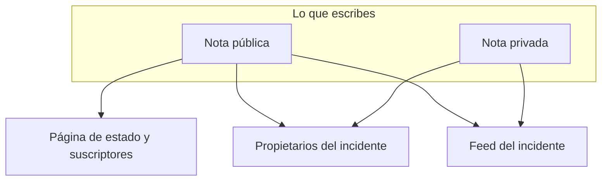

# Notas, responsables y actividad de incidentes

Todo incidente reúne un registro escrito mientras lo trabajas: actualizaciones para tus clientes, notas de trabajo para tu equipo y un feed de actividad de todo lo que ocurrió. Esta página trata la escritura de notas públicas y privadas, a quién llega cada una, el feed del incidente y los propietarios a los que se informa de cada cambio.

:::cards
- [Publicar una nota pública](#publicar-una-nota-pública): Cuenta a los clientes lo que sabes, en la página de estado y por notificación.
- [Cuándo se notifica a los suscriptores](#cuándo-llega-de-verdad-una-nota-pública-a-los-suscriptores): Las comprobaciones que supera una nota pública, y su insignia.
- [El feed del incidente](#el-feed-del-incidente): La cronología de todo lo que ocurrió.
- [Propietarios](#propietarios): Quién es responsable, y qué se le dice.
:::

## Cómo funciona

Parte de lo que escribes es para tus clientes: la actualización que sale en la página de estado a las 02:14 diciendo que has encontrado el despliegue defectuoso. El resto es para tu equipo: la traza de pila que alguien pegó, el gráfico que por fin tuvo sentido, la decisión de conmutar. OneUptime mantiene separados esos dos públicos, y registra ambos en el incidente.



Las **Notas públicas** se publican en tu página de estado y pueden notificar a los suscriptores. Las **Notas privadas** (el modelo `IncidentInternalNote`) se quedan dentro del panel. Por debajo de ambas están el **Feed del incidente**, una cronología de solo anexado que registra todo lo que le ocurrió al incidente, y la lista de **Propietarios**, que decide a quién se informa.

Todo cuelga del menú lateral del incidente: **Notas → Notas públicas**, **Notas → Notas privadas** y **Equipo → Propietarios**. El feed vive en la página **Vista general** del incidente.

## Notas públicas frente a notas privadas

Los dos tipos de nota se parecen en el panel y se comportan de forma muy distinta.

|                              | Nota pública                                                        | Nota privada                                                    |
| ---------------------------- | ------------------------------------------------------------------- | --------------------------------------------------------------- |
| Modelo                       | `IncidentPublicNote`                                                | `IncidentInternalNote`                                          |
| Se muestra en páginas de estado | Sí, como parte de la cronología del incidente                    | Nunca: nada en la aplicación de páginas de estado las lee       |
| Hora de publicación          | `postedAt`, que puedes fijar tú mismo                               | Ninguna: se marca y ordena por `createdAt`                      |
| Notifica a los suscriptores  | Cuando **Notificar a los suscriptores de la página de estado** está activado | Nunca: no tiene ningún campo de suscriptores           |
| Adjuntos accesibles por      | Los visitantes de la página de estado, mediante una ruta de la página de estado | Solo la API autenticada del panel                     |
| Notifica a los propietarios  | Sí                                                                  | Sí                                                              |

**Qué significa de verdad «privada».** Significa «no publicada en la página de estado», no «restringida a un grupo más pequeño de personas». Los roles predefinidos que pueden leer un incidente leen ambos tipos de nota, así que cualquiera que pueda leer el incidente suele poder leer sus notas privadas; en un rol personalizado son permisos distintos, **Read Incident Status Page Note** y **Read Incident Internal Note**. Si necesitas restringir quién puede ver un incidente en absoluto, usa el indicador **Incidente privado** (`isPrivate`) del propio incidente, que oculta el incidente en todas las páginas de estado y lo limita a los usuarios propietarios del incidente, los miembros de sus equipos propietarios, y los administradores y propietarios del proyecto.

**Los propietarios ven ambas.** La tarea de notificación a propietarios consulta juntas las notas públicas y las privadas. Una nota privada es privada para tus suscriptores, no para las personas que responden.

| Si quieres…                                                   | Elige            |
| ------------------------------------------------------------- | ---------------- |
| Contar a los clientes lo que sabes y cuándo sabrás más        | **Nota pública** |
| Poner fecha anterior a una actualización que ya enviaste por otro lado | **Nota pública** |
| Registrar una hipótesis, un comando que ejecutaste o un callejón sin salida | **Nota privada** |
| Adjuntar un volcado de memoria o una captura de un panel interno | **Nota privada** |

## Publicar una nota pública

:::steps
### Abrir las notas públicas

Abre el incidente y elige **Notas → Notas públicas** en su menú lateral. El editor que hay sobre las notas dice quién leerá la nota antes de que la publiques: **Public · Visible on your status page**.

### Escribir la actualización

Escribe la nota en Markdown, o empieza desde una de tus **Plantillas** o desde **Redactar con IA**. Añade archivos con **Asociar** si los suscriptores deben verlos.

### Decidir a quién se avisa

Deja **Notificar a los suscriptores de la página de estado** marcada para notificar a los suscriptores, o desmárcala para publicar sin hacer ruido. **Will notify**, debajo, muestra a qué páginas de estado llegará la nota, y **Vista previa** muestra el correo que recibirán.

### Publicarla

Haz clic en **Post update**, o pulsa Ctrl+Intro (⌘+Intro en un Mac). La nota aparece arriba de la lista, con una insignia que sigue su notificación.
:::

El mismo editor se abre en un diálogo desde **Añadir nota pública** en el menú **Acciones** del feed del incidente (consulta [El feed del incidente](#el-feed-del-incidente)), así que una nota se escribe igual desde cualquiera de los dos sitios.

| Control                                                | Propósito                                                                                                                                     |
| ------------------------------------------------------ | --------------------------------------------------------------------------------------------------------------------------------------------- |
| La nota                                                | El cuerpo, en Markdown. Obligatorio.                                                                                                          |
| **Plantillas**                                         | Inserta una de tus plantillas de notas en la nota, después de lo que ya has escrito. Consulta [Plantillas de notas](#plantillas-de-notas).         |
| **Redactar con IA**                                    | Redacta la nota a partir del incidente, para que la edites. Consulta [Generar una nota con IA](#generar-una-nota-con-ia).                   |
| **Asociar**                                            | Archivos compartidos con los suscriptores en la página de estado. Opcional.                                                                   |
| **Posted now**                                         | Cuándo dice la nota que se publicó: el momento en que la publicas, salvo que elijas aquí una hora anterior, en tu zona horaria actual.        |
| **Notificar a los suscriptores de la página de estado** | Casilla. Activada por defecto, salvo que el incidente se declarara sin notificar a los suscriptores; entonces empieza desactivada. Desactívala para publicar sin hacer ruido. |

**Los incidentes silenciosos siguen en silencio.** Si un incidente se declaró con **Notificar a suscriptores de la página de estado** desactivado (o como incidente privado), a sus suscriptores nunca se les avisó de él, así que una nota pública no debería ser lo primero que oigan. En un incidente así la casilla empieza desactivada, con una línea debajo que explica por qué. Puedes marcarla de todos modos para notificar a los suscriptores esa nota. Las notas publicadas sin una elección explícita siguen la misma regla: las notas de Slack y Microsoft Teams, los flujos de trabajo y las solicitudes a la API que omiten `shouldStatusPageSubscribersBeNotifiedOnNoteCreated`. Un `true` o un `false` explícitos siempre se respetan. Las notas públicas de los [eventos de mantenimiento programado](/docs/status-pages/subscribers#eventos-de-mantenimiento-programado) y de los [episodios de incidente](/docs/status-pages/subscribers) siguen una regla parecida, según si el propio evento o episodio notificó a los suscriptores al crearse; hacer privado un episodio no le afecta.

**Ver a quién llegará la nota.** Mientras **Notificar a los suscriptores de la página de estado** está marcada, una línea **Will notify** debajo lista las páginas de estado a las que irá la nota, con un número de suscriptores «hasta» por canal, y las páginas que listan los monitores del incidente pero no recibirán aviso, con el motivo. Cuando no se avisará a nadie no muestra nada, salvo que el incidente esté oculto en las páginas de estado o que el motivo sea su alcance de páginas de estado. Sigue el alcance de páginas de estado del incidente, así que una nota en un incidente limitado a dos páginas de sede dice que llegará a esas dos. Consulta [Una página de estado por audiencia](/docs/status-pages/one-status-page-per-audience).

**Ver qué recibirán.** Junto a la misma casilla, **Vista previa** muestra el correo que recibirán los suscriptores de cada una de esas páginas de estado por la nota que estás escribiendo, y qué plantilla usa y por qué. Se queda en gris hasta que la nota tiene algo de texto. **Enviarme una prueba** envía ese correo a la dirección de tu propia cuenta, y a nadie más. Consulta [Suscriptores y anuncios](/docs/status-pages/subscribers#incidentes).

> [!TIP]
> **La hora de publicación es la marca de tiempo real de la nota.** Las páginas de estado ordenan y muestran las notas públicas por `postedAt`, no por cuándo las escribiste; así que, si estás poniendo al día la página de estado con una actualización que enviaste hace 40 minutos, elige **Posted now** y fija cuándo ocurrió de verdad. Si una nota llega por la API (`/api/incident-public-note`) sin hora, OneUptime le pone la hora actual.

Cada nota muestra quién la escribió, su hora de publicación, el Markdown renderizado con sus adjuntos y, en su cabecera, en qué punto está su notificación a los suscriptores. **Buscar notas…** encuentra notas por lo que dicen, y el feed se puede leer de más reciente a más antiguo o al revés.

## Publicar una nota privada

**Notas → Notas privadas** es deliberadamente más sencilla. Es el mismo editor, que dice **Private · Only your team can see this**, con la nota, **Plantillas**, **Redactar con IA** y **Asociar** para archivos destinados al equipo de respuesta al incidente. **Añadir nota privada** en el menú **Acciones** del feed del incidente la abre en un diálogo. Por la API, las notas privadas son `/api/incident-internal-note`.

Sin hora de publicación ni casilla de suscriptores: la nota se marca con la hora en que se crea.

Ambos tipos de nota se escriben en el editor de Markdown, que anida elementos de lista con **Aumentar sangría** y **Disminuir sangría** —o Tab y Mayús+Tab— y conserva las listas, los enlaces y el formato de lo que pegas desde Word, Google Docs u otra página de OneUptime. Ctrl+Z deshace una sangría aumentada o disminuida, y en modo visual también los bloques y los pegados que insertó el editor, en orden con lo que escribiste. Un bloque de código copiado de una nota se vuelve a pegar como bloque de código, y una palabra copiada de uno, como código en línea. Consulta [Declarar un incidente](/docs/incidents/declaring-incidents#paso-1-detalles-del-incidente).

## Adjuntos en las notas

Ambos tipos de nota aceptan archivos adjuntos con el botón **Asociar** del editor, y ambos muestran bajo el cuerpo de la nota una lista de adjuntos con un enlace **Download attachment** por archivo.

Donde se separan es en quién puede obtener el archivo:

- **Los adjuntos de las notas públicas** los pueden descargar los visitantes de la página de estado mediante una ruta de la página de estado, junto con la propia nota.
- **Los adjuntos de las notas privadas** solo son accesibles mediante la API autenticada del panel. No hay ninguna ruta de página de estado para ellos.

Eso convierte los adjuntos en la misma decisión pública/privada que el texto de la nota. Una imagen de la cronología pensada para clientes va en una nota pública; un volcado de configuración, en una privada.

Las imágenes siguen la misma decisión. Una imagen que pegas o sueltas en una nota, o que añades con **Subir imagen**, se guarda en el proyecto del incidente y se muestra dentro de la nota, y quién puede verla depende de la nota:

- **En una nota privada** —o en una nota pública antes de publicarse—, una imagen solo se muestra a los miembros del proyecto, con la sesión iniciada como exija el proyecto. Cualquier otra persona que abra su dirección no ve nada, como si no hubiera imagen.
- **En una nota pública**, una imagen se muestra a todos los que pueden ver la nota: en la página de estado y en los correos que reciben sus suscriptores. Una nota pública se muestra con su incidente, nunca sin él: mientras el incidente está oculto en las páginas de estado o es privado, las imágenes de sus notas también se muestran solo a los miembros del proyecto.

Toda subida empieza siendo privada, tanto desde el panel como desde la API. Una imagen solo es visible para todo el mundo mientras algo que muestran tus páginas de estado la contiene: una nota pública mientras su incidente, episodio o evento de mantenimiento programado se muestra en las páginas de estado, un anuncio desde que empieza a mostrarse, la descripción del incidente mientras el incidente está **Visible en la página de estado** y no es privado, su post mortem una vez que también se publica allí, la descripción de un episodio o de un evento de mantenimiento programado mientras se muestra en las páginas de estado (nunca mientras el episodio es privado), y las descripciones de vista general, de grupo y de recurso de la propia página de estado. Cuando eso deja de ocurrir —el incidente se oculta o se hace privado, la imagen se quita del texto, se elimina la nota o el incidente—, la imagen vuelve a ser privada, salvo que otra cosa que muestran tus páginas de estado la siga conteniendo. La descripción y el mensaje de agradecimiento de un formulario muestran sus imágenes a todo el mundo de la misma forma, mientras el formulario acepta envíos.

Leer una nota mediante la API, Terraform o un flujo de trabajo solo lista los adjuntos que quien lee puede abrir: archivos del proyecto de la nota y archivos públicos. Un adjunto que una nota nombra de otro proyecto se omite de la lista, como si la nota no lo tuviera.

## Generar una nota con IA

El editor tiene un botón **Redactar con IA**, en ambas páginas de notas y en los diálogos **Añadir nota pública** y **Añadir nota privada** del feed. Envía el incidente al proveedor de IA de tu proyecto y deja el Markdown generado en la nota, donde lo editas antes de publicar: nada se publica automáticamente.

| Diálogo                                | Qué escribe                                                          | Plantillas                                                        |
| -------------------------------------- | -------------------------------------------------------------------- | ----------------------------------------------------------------- |
| **Generar nota pública con IA**        | Una nota para clientes, a partir de un análisis de los datos del incidente. | **Status Update**, **Resolution Notice**, **Maintenance Update** |
| **Generar nota privada con IA**        | Una nota técnica interna.                                            | **Investigation Update**, **Technical Analysis**, **Shift Handoff** |

Detrás del botón, el panel hace una petición a `/incident/generate-note-from-ai/{incidentId}` con la plantilla elegida y un tipo de nota `public` o `internal`.

Lo que se envía es el texto del incidente. Una imagen o un archivo incrustado en él —una captura de pantalla pegada en la descripción, por ejemplo— se sustituye por una breve indicación como `[image omitted: PNG, 340 KB]`, y cada campo de texto se recorta a 16.000 caracteres, para que un único pegado grande nunca desplace al resto. El incidente en sí conserva sus imágenes.

## Plantillas de notas

Si tu equipo escribe las mismas tres actualizaciones en cada interrupción, guárdalas una vez. El menú **Plantillas** del editor las lista, en ambas páginas de notas y en los diálogos de notas del feed, y elegir una la inserta en la nota.

Las plantillas se comparten entre notas públicas y privadas: una sola lista de plantillas sirve para ambas, y la misma plantilla puede insertarse en cualquiera de los dos tipos de nota.

Los marcadores de una plantilla —`{{incident.title}}`, `{{incident.state}}`, `{{incident.customFields.impact}}` y los demás que se listan en [Plantillas de notas](/docs/incidents/settings#plantillas-de-notas)— se rellenan con los valores actuales del incidente cuando la eliges, tanto en las páginas de notas como en los diálogos **Reconocer** y **Resolver**. Lo que ya habías escrito nunca cambia, y un marcador sin valor se queda tal cual.

> [!IMPORTANT]
> Lee la nota rellenada antes de publicar una pública: `{{incident.affectedStatusPages}}` nombra cada página de estado a la que llega el incidente, y los suscriptores de todas ellas la leen.

Las gestionas en **Incidentes → Ajustes → Plantillas de notas**: la tarjeta se titula **Plantillas de notas públicas o privadas para incidentes** y su formulario es de una sola página: **Nombre de la plantilla** y **Descripción de la plantilla**, ambos obligatorios, y luego el cuerpo. Antes de que tengas alguna, el menú **Plantillas** lo dice y enlaza allí.

## Publicar notas desde Slack o Microsoft Teams

Si has conectado un espacio de trabajo, los respondedores nunca tienen que salir del canal. Tanto Slack como Microsoft Teams ofrecen una acción para añadir una nota que abre un diálogo con un desplegable **Note Type** —**Public Note** (publicada en la página de estado) o **Private Note** (visible solo para los miembros del equipo)— y un cuadro de texto **Note**, y escribe el resultado directamente en el incidente.

Tres detalles que conviene conocer:

- **Protección contra duplicados** — cada nota registra el mensaje de Slack del que procede (`postedFromSlackMessageId`, con el formato `channel_id:message_ts`), así que varias personas que reaccionan al mismo mensaje producen una nota, no cinco.
- **Las notas hacen eco** — publicar cualquiera de los dos tipos de nota también envía un mensaje al canal del incidente conectado, porque el elemento del feed de la nota se crea con la notificación del espacio de trabajo activada.
- **Se publica en nombre de quien la pidió** — una nota del diálogo o de una reacción se publica con los permisos de OneUptime de esa persona, así que necesita su permiso para publicar ese tipo de nota en el incidente. Cuando se rechaza, se le dice por qué —en un mensaje directo en Slack, y en la conversación en Microsoft Teams (en el hilo del mensaje, para una reacción)— y no se publica nada.

## Cuándo llega de verdad una nota pública a los suscriptores

Crear una nota pública con **Notificar a suscriptores de la página de estado** activado no garantiza por sí solo que salga un correo. La nota tiene que superar una cadena de comprobaciones, y cada fallo registra un motivo concreto en lugar de dar un error:

```mermaid title="Las comprobaciones que supera una nota pública antes de que los suscriptores se enteren"
flowchart TB
    note["Nota pública publicada"] --> box{"¿Casilla Notificar activada?"}
    box -->|No| skipped["Suscriptores no notificados"]
    box -->|Sí| incident{"¿Incidente en páginas de estado?"}
    incident -->|No| skipped
    incident -->|Sí| pages{"¿Página dentro del alcance?"}
    pages -->|No| skipped
    pages -->|Sí| prefs{"¿Suscriptor apuntado?"}
    prefs -->|Sí| sent["Mensaje enviado"]
```

1. **Notificar a suscriptores de la página de estado** debe estar activado. Si no lo está, la nota se marca como omitida en el momento en que se crea. Empieza desactivado en los incidentes que se declararon sin notificar a los suscriptores.
2. La nota debe pertenecer a un incidente que todavía existe.
3. El incidente debe tener al menos un monitor adjunto: sin monitores no hay ningún recurso de página de estado hacia el que encaminar la nota.
4. El indicador **Visible en la página de estado** (`isVisibleOnStatusPage`) del incidente debe ser true, y el incidente no debe ser privado (`isPrivate`). Un incidente privado se oculta en todas las páginas de estado, diga lo que diga el indicador; consulta [Mantener un incidente fuera de la página de estado](/docs/incidents/states-and-severities#mantener-un-incidente-fuera-de-la-página-de-estado).
5. Cada página de estado a la que llega el incidente debe tener **Mostrar incidentes** (`showIncidentsOnStatusPage`) activado. Las páginas a las que llega son las que listan sus monitores, acotadas a las páginas a las que está limitado el incidente, si las hay. Un incidente que no está limitado a ninguna página omite las páginas que solo muestran incidentes limitados a ellas. Consulta [Una página de estado por audiencia](/docs/status-pages/one-status-page-per-audience).
6. Cada suscriptor debe cumplir sus propias preferencias: no estar dado de baja, y estar suscrito a este recurso y al tipo de evento `Incident` allí donde la página deja elegir a los suscriptores.

> [!NOTE]
> **Las notificaciones no son instantáneas.** La tarea que las envía se ejecuta una vez por minuto, así que cuenta con hasta un minuto aproximadamente entre guardar la nota y que salga el correo. Eso es lo que significa **Se notificará a los suscriptores en breve** en una nota, y **Se enviará pronto** en las notificaciones propias del incidente.

La cabecera de una nota pública sigue todo el recorrido con una insignia. Haz clic en ella para ver el mensaje de estado de la notificación, que dice qué ocurrió:

| Insignia                                      | Qué significa                                                                                                                                     |
| --------------------------------------------- | ------------------------------------------------------------------------------------------------------------------------------------------------- |
| **Suscriptores no notificados**               | No se envió nada: la nota se publicó con **Notificar a suscriptores de la página de estado** desmarcado, o se cerró una de las barreras anteriores. El motivo queda registrado. |
| **Se notificará a los suscriptores en breve** | En cola, esperando la próxima ejecución de la tarea de envío.                                                                                     |
| **Notificando a los suscriptores**            | La tarea está recorriendo la lista de suscriptores.                                                                                               |
| **Suscriptores notificados**                  | Se envió el mensaje de cada suscriptor. El mensaje de estado lista, por página de estado, cuántos salieron por cada canal.                        |
| **La notificación falló**                     | No se le envió a todos los suscriptores, o la tarea se detuvo con un error. El mensaje de estado dice cuál de las dos.                            |

**Enviado significa enviado.** La tarea espera cada mensaje: un correo o un SMS cuenta como enviado en cuanto el servidor de correo o el proveedor de SMS lo ha aceptado, y un mensaje de Slack, Microsoft Teams o webhook, en cuanto el otro extremo ha respondido. Un mensaje rechazado, con error o sin respuesta en 4 minutos cuenta como fallido, y un solo fallo cambia la insignia a **La notificación falló**; a los demás suscriptores se les sigue enviando. El mensaje de estado dice entonces algo como `Not every subscriber was sent this notification: 2 of 61 messages failed. Site 03: 41 email sent. Site 07: 16 email, 2 SMS sent; 2 email failed.` «Enviado» llega hasta donde OneUptime puede ver: un servidor de correo todavía puede devolver un correo más tarde.

:::details Páginas grandes y envíos largos
Los suscriptores de una página de estado se leen de 10.000 en 10.000 hasta llegar a todos, y hay 20 mensajes en curso a la vez. Una notificación deja de iniciar mensajes nuevos a los 20 minutos: lo que no alcanzó hasta entonces se lista, y se marca como **La notificación falló**. Un envío interrumpido a medias —su servidor se reinició o dejó de responder— también se marca como **La notificación falló**, con un mensaje que empieza por `Interrupted:`, una vez que lleva 40 minutos en **Notificando a los suscriptores**, para que nunca se quede ahí para siempre. Consulta [Suscriptores y anuncios](/docs/status-pages/subscribers).
:::

### Volver a enviar la notificación de una nota

Haz clic en la insignia de notificación de una nota para ver qué ocurrió. Una nota cuya notificación falló ofrece **Reintentar notificación**, y una cuya notificación salió ofrece **Reenviar notificación**. Ambas preguntan antes: la confirmación lista las páginas de estado a las que llegaría ahora la nota, con un número «hasta» por canal, o dice que no llegaría a nadie, y explica qué ocurre. Cualquiera de las dos devuelve la nota al estado pendiente para que la recoja la próxima ejecución, y la envía a cada página de estado a la que llega ahora el incidente, incluidos los suscriptores que ya la recibieron. Si cambiaste las páginas a las que está limitado el incidente desde que se publicó la nota, va a las páginas a las que está limitado ahora. Una nota publicada con **Notificar a suscriptores de la página de estado** desmarcado no ofrece ninguna de las dos, porque nunca se pensó para enviarse, y no se ofrece ninguna mientras una notificación sigue en cola o enviándose. Las notas públicas de los eventos de mantenimiento programado y de los episodios de incidente conservan **Reintentar notificación** solo tras un fallo.

Volver a enviar la notificación de una nota cuenta a cada suscriptor lo que dice la nota, igual que al publicarla, así que necesita el permiso para publicar notas públicas que notifican a los suscriptores además del permiso para editar notas públicas. Por la API es la misma actualización que hace el panel, que vuelve a poner `subscriberNotificationStatusOnNoteCreated` en `Pending`; se rechaza para quien no tenga esos permisos, para una nota publicada sin notificar a los suscriptores, y mientras se está enviando la notificación de la nota.

:::details Cómo se reanuda la notificación de «creado» del incidente
Solo la notificación de «creado» del incidente se reanuda donde se detuvo: guarda un registro de las páginas de estado a las que envió por completo, y **Reintentar** en la **Vista general** del incidente las omite. El registro se guarda por página de estado, no por suscriptor, así que a una página en la que se detuvo a medias se le vuelve a enviar entera, incluidos los suscriptores de esa página que ya la recibieron. La confirmación de **Reintentar** ofrece **Enviarla de nuevo a todas las páginas de estado, incluidas las ya alcanzadas**, que la convierte en **Reenviar a todas las páginas**, y **Reenviar** tras un éxito la envía de nuevo a todas las páginas. Consulta [Una página de estado por audiencia](/docs/status-pages/one-status-page-per-audience#adding-status-pages).
:::

### Editar una nota pública

**Editar una nota pública es silencioso salvo que lo pidas.** El formulario de edición de la nota tiene una casilla **Notificar a los suscriptores sobre esta actualización**, desmarcada cada vez. Márcala para un cambio que los suscriptores necesitan conocer y reciben la nota editada, marcada como actualización; la nota muestra entonces una segunda insignia para la actualización junto a la original, con su propio **Reintentar notificación** tras un fallo:

| Insignia de actualización                  | Qué significa                                       |
| ------------------------------------------ | --------------------------------------------------- |
| **Actualización en cola**                  | Esperando la próxima ejecución de la tarea de envío. |
| **Enviando actualización**                 | La tarea está recorriendo la lista de suscriptores. |
| **Actualización enviada**                  | A cada suscriptor se le envió la nota editada.      |
| **Error al enviar la actualización**       | No se le envió a todos los suscriptores.            |
| **Actualización no enviada**               | Una de las barreras anteriores la detuvo.           |

Una actualización enviada no se vuelve a ofrecer: edita la nota con la casilla marcada para enviar el texto más reciente, o reenvía la propia nota. Si la notificación original todavía no se ha enviado, no sale ninguna actualización aparte: la original lleva la edición. Si se está enviando en ese momento, la actualización espera a que termine y luego sale. La casilla y el **Reintentar notificación** de la actualización necesitan los mismos permisos que volver a enviar la notificación de la nota; sin ellos aún puedes editar la nota, sin notificar a nadie. Consulta [Suscriptores y anuncios](/docs/status-pages/subscribers).

El mensaje real que reciben los suscriptores sale de una plantilla por página de estado y por canal: correo electrónico, SMS, Slack y Microsoft Teams tienen cada uno su propia plantilla para el evento **Subscriber Incident Note Created**, con variables para el nombre y la URL de la página de estado, el enlace de detalles, los recursos afectados, la gravedad y el título del incidente, el cuerpo de la nota, las etiquetas del incidente, sus páginas de estado afectadas y sus campos personalizados, y un enlace de baja propio de cada suscriptor. Los mensajes predeterminados de correo, Slack y Microsoft Teams también listan los campos personalizados del incidente marcados con **Incluir en las notificaciones a suscriptores**, con sus valores actuales. Consulta [Suscriptores y anuncios](/docs/status-pages/subscribers) para ver cómo se configuran esas plantillas y canales.

## El feed del incidente

La tarjeta **Feed del incidente** está al final de la columna izquierda de la página **Vista general** del incidente. Es la historia del incidente en orden: cada elemento es un icono, el avatar y el nombre de quien lo causó, una marca de tiempo relativa con la hora local exacta al pasar el ratón, y un cuerpo en Markdown. Por defecto, los elementos más recientes están arriba.

Algunos elementos llevan detalles adicionales —una notificación a propietarios lista a todos a quienes se escribió, por ejemplo, y una notificación a suscriptores lista cada página de estado a la que fue, con el número de mensajes enviados y fallidos en cada canal y el asunto con el que salió su correo, seguido, cuando envió alguno, de los valores de campos personalizados que puso en un mensaje, en **Custom fields sent**—. Esos muestran un botón **Más información** que abre un panel **Más información**.

La cabecera de la tarjeta también tiene un menú **Acciones** para que puedas actuar sin salir de la cronología:

- **Ejecutar runbook** — inicia un [runbook](/docs/runbooks/index) sobre este incidente.
- **Ejecutar política de guardia** — avisa a una política bajo demanda. Una política archivada no avisa a nadie: su registro de ejecución en el incidente dice que no se ejecutó porque la política está archivada.
- **Añadir nota pública** — el editor de la página **Notas públicas**, en un diálogo: escribe la nota y luego **Post update**. Las plantillas, **Redactar con IA**, los adjuntos, **Notificar a los suscriptores de la página de estado** con a quién llegará, y **Vista previa** están todos ahí. La nota se publica ahora; para ponerle una fecha anterior, elige **Posted now**.
- **Añadir nota privada** — el editor de la página **Notas privadas**, en un diálogo: escribe la nota y luego **Add note**.

Ambas acciones de nota están bloqueadas, nombrando el permiso que falta, para quien no puede escribir notas. Después de publicar una nota, el diálogo se cierra y el feed la muestra.

Todo lo demás está tras el botón **⋯** junto a él, el mismo botón **Más opciones** que tiene la cabecera de tarjeta de una tabla, para que la cabecera muestre los menos botones posibles:

- **Más recientes primero** / **Más antiguos primero** — el orden en que se lee el feed. Una marca indica el que está en uso, y tu navegador recuerda la elección para el feed de cada incidente.
- **Filtrar por tipo de evento** — un diálogo que lista los tipos de evento del feed, cada uno con el icono que llevan sus elementos, y un cuadro de búsqueda cuando la lista es larga. Marca los que quieras mostrar y elige **Aplicar filtros**; sin nada marcado, se muestran todos los tipos de evento. Mientras el feed está filtrado, un recuadro encima dice cuántos tipos de evento muestra, con una etiqueta por cada uno, **Editar filtros** y **Limpiar filtros**. El filtro no se guarda: sal del incidente y su feed vuelve a mostrarlo todo.
- **Actualizar** — vuelve a cargar el feed.

> [!NOTE]
> **El feed es de solo anexado, y no es tu registro de auditoría.** La API permite crear y leer elementos del feed pero no modificarlos ni eliminarlos, así que nadie puede reescribir en silencio la historia de un incidente. Tampoco es permanente: en las instalaciones con facturación, se eliminan las filas del feed de más de tres años. Para un registro duradero de quién cambió qué, usa **Avanzado → Registros de auditoría** en el menú lateral del incidente.

## Qué registra el feed

Los elementos del feed los escriben el propio servicio de incidentes, ambos servicios de notas, la cronología de estados, los cambios de propietarios y de miembros, la vinculación y desvinculación de alertas, los motores de reglas, la ejecución de guardias, los ejecutores de investigación y de post mortem de la IA, y las tareas programadas de notificación. Los tipos de evento cubren:

- **El incidente en sí** — `IncidentCreated`, `IncidentUpdated`, `IncidentStateChanged`. Una entrada `IncidentUpdated` registra lo que cambió una edición: el título, la descripción, la causa raíz, las notas de remediación, las etiquetas, la gravedad, los monitores y el estado que se les puso, y las páginas de estado añadidas al alcance del incidente o quitadas de él. Tiene una línea por cada valor que cambió y ninguna para un valor guardado tal cual, así que guardar una tarjeta sin cambiar nada, o un cliente de la API o un flujo de trabajo que vuelve a escribir el incidente tal como está, no añade ninguna entrada. Un texto que se lee igual es el mismo (dejando aparte los saltos de línea y los espacios alrededor), y las etiquetas son las mismas si forman el mismo conjunto en cualquier orden; un valor que se borró se lee como eliminado, y quitar todas las etiquetas como «All labels removed.». Las entradas **Alert updated** de una alerta funcionan igual.
- **Notas e informes** — `PublicNote`, `PrivateNote`, `RootCause`, `RemediationNotes`, `PostmortemNote`. Un elemento `PostmortemNote` se escribe cuando cambia la nota del post mortem, no cada vez que se guarda el post mortem.
- **Personas** — `OwnerUserAdded`, `OwnerTeamAdded`, `OwnerUserRemoved`, `OwnerTeamRemoved`, `IncidentMemberAdded`, `IncidentMemberRemoved`.
- **Alertas vinculadas** — `AlertLinked` y `AlertUnlinked`, que se muestran como **Alerta vinculada** y **Alerta desvinculada**.
- **Notificaciones** — `OwnerNotificationSent`, `SubscriberNotificationSent`, `OnCallPolicy`, `OnCallNotification`.
- **Automatización** — `LabelRuleExecuted`, `OwnerRuleExecuted`, `PrivacyRuleExecuted`, `OnCallRuleExecuted`, `AutoRemediation`.
- **Videollamadas** — `VideoCallStarted` y `VideoCallFailed`: una llamada iniciada para el incidente, con su enlace para unirse, o el motivo por el que un proveedor no pudo iniciar una. Consulta [Videollamadas](/docs/workspace-connections/video-calls).

Cada tipo tiene su propio icono, así que puedes recorrer un feed largo y distinguir los cambios de estado de la conversación. El análisis de causa raíz generado por IA se marca de forma distinta y se muestra en un modo de Markdown restringido. El elemento **Incidente creado**, el elemento que registra un título nuevo y los elementos de entrada o salida de un episodio muestran un título exactamente como se escribió: escapan `\`, `[`, `]`, `*`, `_`, `~`, los acentos graves y \< en él, así que un título no puede convertirse en una imagen, HTML sin procesar, una mención de Slack como \<!here\>, un enlace cuyo texto oculta adónde lleva, ni negrita, cursiva o código. Una dirección en un título se sigue mostrando como un enlace a esa misma dirección.

Vincular una alerta también se registra en la alerta. Las alertas tienen su propio feed, donde el mismo cambio aparece como **Vinculada a incidente** (`LinkedToIncident`) o **Desvinculada de incidente** (`UnlinkedFromIncident`), nombrando el incidente. Solo las entradas **Alerta vinculada** y **Alerta desvinculada** del incidente se publican en Slack y Microsoft Teams, así que cada vínculo se anuncia una vez. Un incidente declarado a partir de alertas recibe una sola entrada **Alerta vinculada** que las lista todas en lugar de una por alerta, y el título de una alerta o un incidente privados se omite de la entrada del otro lado. Consulta [Alertas vinculadas](/docs/incidents/linked-alerts).

Los feeds respetan la privacidad de los incidentes: en los incidentes privados, las lecturas del feed se filtran igual que el incidente.

## Propietarios

Los propietarios son las personas y los equipos responsables de un incidente. Son el destino de las notificaciones de todo lo que le ocurre, y son la razón por la que un incidente no pasa desapercibido mientras todos suponen que otro se está ocupando.

Abre **Equipo → Propietarios** en el menú lateral del incidente. La tarjeta **Propietarios** muestra una insignia con el recuento y describe a los propietarios como las personas y los equipos responsables de este incidente a los que se notifican los cambios, con un recuento como «2 people · 1 team». Los propietarios se muestran como avatares superpuestos; al pasar el ratón por uno se ve el correo de la persona o se indica que la entrada es un **Equipo**.

- Haz clic en **Añadir propietario** para abrir un selector con un cuadro de búsqueda de personas o equipos.
- Haz clic en el control de quitar de un avatar para abrir la confirmación **Eliminar propietario**, y luego en **Eliminar**.
- Cuando aún no hay propietarios, la tarjeta lo dice y te invita a añadir a un compañero o a un equipo para que reciban notificaciones de los cambios.

Los usuarios propietarios y los equipos propietarios son registros distintos: añadir un equipo convierte a cada miembro de ese equipo en propietario a efectos de notificación sin listarlos uno por uno. Por la API son `/api/incident-owner-user` y `/api/incident-owner-team`.

Solo los equipos y los miembros de tu propio proyecto pueden ser propietarios. El selector solo los ofrece a ellos, y a los propietarios añadidos mediante la API, Terraform o un flujo de trabajo se les aplica lo mismo: un equipo de otro proyecto, o alguien que no es miembro del proyecto, se rechaza.

## Cómo se asignan los propietarios

Hay cuatro caminos para llegar a la lista de propietarios:

- **Desde una plantilla de incidente** — las plantillas llevan un campo **Propietarios**: las personas y los equipos propietarios del incidente, a los que se notificará cuando se cree o se actualice, elegidos de la misma lista que **Añadir propietario**. Crear un incidente desde la plantilla los rellena, y se añaden una vez que existen los canales de Slack y Microsoft Teams del incidente, así que una regla de notificación que invita a los propietarios del incidente a un canal nuevo también los invita a ellos. El panel, y el paso **Create One Incident** de un flujo de trabajo con un **Incident Template** elegido, los añaden sin la notificación de «te han añadido»; un [formulario](/docs/forms/on-submit) con plantilla los notifica, y retiene la notificación **Incidente creado** del incidente hasta que se añaden. Consulta [Declarar un incidente](/docs/incidents/declaring-incidents).
- **Desde las reglas de propietario de incidentes** — las reglas que coinciden añaden propietarios automáticamente en el momento de la creación.
- **En la creación por la API** — los usuarios y equipos propietarios que se pasan con la llamada de creación se añaden de la misma forma, una vez que existen los canales, y sin la notificación de «te han añadido».
- **A mano** — el control **Añadir propietario** de la página **Propietarios**, en cualquier momento del incidente.

Añadir dos veces a la misma persona no tiene riesgo; los propietarios ya asignados no se duplican.

## Reglas de propietario de incidentes

Las **Reglas de propietario de incidentes** asignan automáticamente usuarios y equipos propietarios cuando se crean incidentes que coinciden: la capa de enrutamiento que hace que un incidente de base de datos llegue al equipo de base de datos sin que nadie lo piense. Las encontrarás en **Incidentes → Reglas → Reglas del propietario**, con el resto de la automatización de incidentes que se trata en [Configuración y automatización de incidentes](/docs/incidents/settings).

El formulario de la regla tiene dos pasos —**Coincidencia**, las condiciones que debe cumplir un incidente, y luego **Propietarios**, lo que añade la regla—:

- **Propietarios** — **Añadir propietario** abre una sola lista de personas y equipos; haz clic en cada uno para añadirlo, y quita una elección con la **×** de su etiqueta. Cuando la regla coincide, cada persona y equipo elegido se añade como propietario, y los propietarios ya asignados no se duplican.
- **Heredar propietarios**, plegado en **Propietarios** — asigna propietarios a partir de entidades relacionadas en lugar de nombrarlos. **Heredar propietarios de los monitores** convierte a cada propietario de los monitores del incidente en propietario del incidente, y **Heredar propietarios de los hosts**, **Heredar propietarios de los clústeres de Kubernetes**, **Heredar propietarios de los hosts de Docker**, **Heredar propietarios de los hosts de Podman** y **Heredar propietarios de los servicios** hacen lo mismo con esos recursos.

Una regla nueva tiene que añadir a alguien: elige al menos un propietario, o activa un interruptor de **Heredar propietarios**. La API y Terraform también rechazan una regla nueva que no añade a nadie. Su **Nombre** se rellena a partir de los propietarios que elijas —o, en una regla que solo hereda, a partir de sus interruptores (_Inherit owners from monitors_)— hasta que escribas un nombre propio. Editar una regla nunca exige propietarios, así que una regla antigua que no añade nada todavía se puede renombrar o desactivar; la lista la marca con **No añade nada**. Consulta [Reglas de etiquetas y propietarios](/docs/configuration/label-and-owner-rules).

**Notificar a los propietarios**, en **Más campos**, controla si las personas se enteran. Déjalo activado para un enrutamiento real; desactívalo para añadir propietarios en silencio, útil cuando una regla es una comodidad de registro más que un aviso.

Cada ejecución de una regla se escribe en el feed del incidente, así que siempre puedes saber si a una persona la añadió una regla o un humano.

## De qué se notifica a los propietarios

Cinco tareas notifican a los propietarios, y cada una se ejecuta una vez por minuto:

| Notificación                     | Cuándo                                                       | Asunto del correo                                              |
| -------------------------------- | ------------------------------------------------------------ | -------------------------------------------------------------- |
| **Incidente creado**             | Se declara el incidente.                                     | `[New Incident {number}] - {title}`                            |
| **Se publicó una nota**          | Se publica una nota pública *o* privada.                     | `[Update Incident {number}] - {title}`                         |
| **Cambió el estado**             | El incidente pasa a otro estado.                             | `[{State} Incident {number}] - {title}`                        |
| **Te han añadido**               | Te añaden como propietario.                                  | `You have been added as the owner of Incident {number} - {title}` |
| **Sigue sin resolverse**         | Un recordatorio, según la hora del próximo recordatorio del incidente. | `[Reminder] Incident {number} is still {state} - {title}` |

Cada notificación sale por los canales que la persona activó en **Ajustes de usuario → Ajustes de notificaciones** —correo electrónico, SMS, llamada de voz, notificación push, WhatsApp, Telegram, Slack, Microsoft Teams o webhook—, que deciden qué se envía de verdad. Cada destinatario puede desactivar cada una por separado: los ajustes por usuario se formulan como enviarte las notificaciones de incidente creado, nota publicada, cambio de estado, propietario añadido, miembro asignado y recordatorio de incidente aún abierto. Quien solo quiera una llamada para los cambios de estado puede tener exactamente eso. Consulta [Estados y severidades de incidentes](/docs/incidents/states-and-severities) para saber qué significa un cambio de estado.

**Los incidentes sin propietario no se quedan en silencio.** Si un incidente no tiene ningún propietario, las tareas de notificación recurren a los propietarios del proyecto, para que no se pierda nada. La notificación **Incidente creado** de un incidente notificado mediante un formulario cuya plantilla tiene propietarios espera a esos propietarios en su lugar. Cada persona notificada también se añade al elemento del feed correspondiente, así que después puedes ver exactamente a quién se avisó y en qué dirección.

## Próximos pasos

:::cards
- [Configuración y automatización de incidentes](/docs/incidents/settings): Reglas de propietario, plantillas de notas y el resto de la automatización.
- [Suscriptores y anuncios](/docs/status-pages/subscribers): Adónde van a parar las notas públicas y quién las recibe.
- [Una página de estado por audiencia](/docs/status-pages/one-status-page-per-audience): A qué páginas de estado llegan las notas de un incidente.
- [Estados y severidades de incidentes](/docs/incidents/states-and-severities): La máquina de estados que alimenta la mitad del feed.
:::
