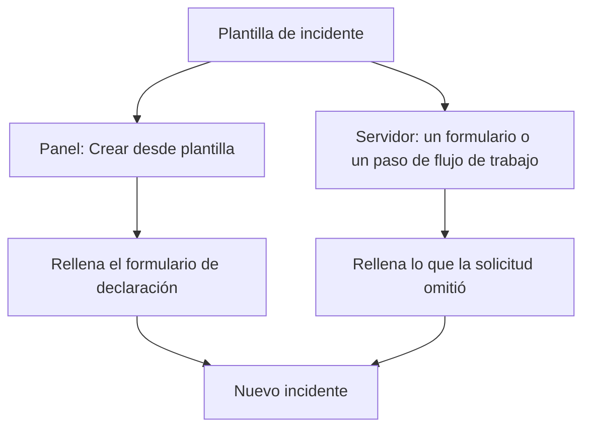
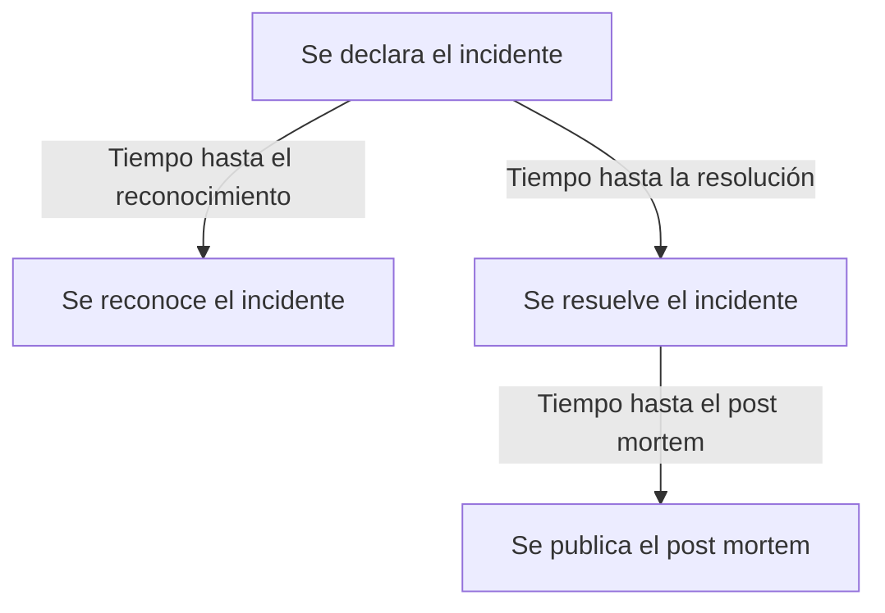

# Configuración y automatización de incidentes

La configuración de incidentes está en **Incidentes**, no en **Ajustes del proyecto**: los estados y las gravedades, las plantillas, los campos personalizados, los roles, las mediciones y los prefijos de número, y las reglas que actúan sobre cada incidente nuevo. Esta página es la referencia de cada una de esas páginas, y de lo que se ejecuta por sí solo en el momento en que se declara un incidente.

:::cards
- [Plantillas de incidente](#plantillas-de-incidente): Declara el mismo tipo de incidente, rellenado, cada vez.
- [Campos personalizados](#campos-personalizados): Tus propios campos en cada incidente, que se piden al declararlo.
- [Mediciones](#mediciones): El tiempo hasta reconocer, resolver o mitigar, calculado para cada incidente.
- [Reglas](#reglas-que-se-ejecutan-al-crear-un-incidente): Propietarios, etiquetas, avisos y episodios, definidos automáticamente.
:::

## Dónde está la configuración de incidentes

Abre **Incidentes** desde el menú **Productos** de la barra superior y despliega **Ajustes** al final de su menú lateral. **Reglas** y **Ajustes** empiezan plegadas, así que despliégalas antes de que aparezcan las páginas de abajo. Todo aquí es propio del proyecto: las plantillas, los roles, los campos personalizados y las reglas pertenecen a un proyecto y se aplican a cada incidente declarado en él, en rutas que empiezan por `/dashboard/{projectId}/incidents/settings/`.

| Página                             | Qué haces allí                                                                                     |
| ---------------------------------- | -------------------------------------------------------------------------------------------------- |
| **Estado del incidente**           | Añadir, renombrar, recolorear y reordenar los estados por los que pasa un incidente.               |
| **Gravedad del incidente**         | Añadir, renombrar, recolorear y reordenar los niveles de gravedad.                                 |
| **Plantillas de incidente**        | Rellenar de antemano un incidente entero: título, descripción, recursos, políticas de guardia, propietarios, etiquetas. |
| **Plantillas de notas**            | Texto reutilizable para notas públicas y privadas.                                                 |
| **Plantillas de post mortem**      | Estructuras de post mortem reutilizables.                                                          |
| **Campos personalizados**          | Definir campos adicionales que aparecen en cada incidente.                                         |
| **Roles de incidente**             | Definir los roles a los que asignas a los respondedores, como Comandante de incidente.             |
| **Mediciones**                     | Medir cuánto tardan las cosas, como el tiempo hasta el reconocimiento o hasta la resolución, en cada incidente. |
| **Alertas vinculadas**             | Elegir si las alertas vinculadas a un incidente se reconocen y se resuelven con él. Ambas opciones están activadas en los proyectos nuevos. |
| **Prefijo de número**              | El texto delante de los números de incidente y de episodio, como `INC-` en `INC-42`.               |

Lo que OneUptime AI hace por su cuenta no se configura aquí: tiene una sección propia, **Incidentes → IA**, en rutas que empiezan por `/dashboard/{projectId}/incidents/ai/`. Su página **Ajustes** activa o desactiva la investigación de incidentes nuevos, su corrección automática (desactivada hasta que la actives) —con las pull requests de corrección y de telemetría que falta, que forman parte de la corrección, agrupadas debajo— y los borradores de post mortem, y cada uno se guarda en cuanto lo cambias; las reglas de investigación y las reglas de autorremediación que acotan qué incidentes se investigan y se corrigen, y los límites opcionales con los que trabaja la IA, están plegados en **Más ajustes**, y ninguno se aplica hasta que lo definas. **Análisis** y **Registros** están al lado: lo que la IA aprendió de tus incidentes, y todo lo que hizo. Consulta [AI SRE](/docs/ai/ai-sre).

**Estado del incidente** y **Gravedad del incidente** se tratan a fondo en [Estados y severidades de incidentes](/docs/incidents/states-and-severities); el resto de esta página empieza en **Plantillas de incidente**. Los formularios que permiten a personas ajenas a tu equipo notificar incidentes son un producto propio: consulta [Formularios](/docs/forms/index). Las herramientas que abren incidentes por su cuenta, como [Huntress](/docs/integrations/huntress), se configuran en **Incidentes → Integraciones**.

Despliega **Reglas** y tienes ocho páginas más: **Reglas de agrupación**, **Reglas de guardia**, **Reglas del propietario**, **Reglas de runbook**, **Reglas de privacidad**, **Reglas de etiquetas**, **Reglas de SLA** y **Reglas de recordatorio**. Se tratan más abajo.

## Plantillas de incidente

Una plantilla de incidente es el esqueleto guardado de un incidente. En lugar de volver a escribir el mismo título, la misma lista de monitores y la misma política de guardia cada vez que el clúster de pagos se tambalea, lo guardas una vez y declaras a partir de él.

:::steps
1. Ve a **Incidentes → Ajustes → Plantillas de incidente** (`/dashboard/{projectId}/incidents/settings/templates`). La tarjeta se titula **Plantillas de incidente**.
2. Haz clic en **Crear Plantilla de incidente**. Pon nombre a la plantilla en **Información de la plantilla** y luego rellena en **Detalles del incidente** el incidente que declara: un **Título**, una **Gravedad del incidente** y una **Descripción**.
3. Pulsa **Siguiente** para recorrer los pasos opcionales —los recursos a los que afecta, sus campos personalizados y sus políticas de guardia—, rellenando lo que comparte cada incidente de este tipo.
4. Haz clic en **Crear Plantilla de incidente** en el último paso. A partir de ahora, **Crear desde plantilla** de la lista de incidentes ofrece la plantilla.
:::

Crearla te lleva por un asistente de cuatro pasos, con dos pasos más cuando tu proyecto tiene campos personalizados de incidente. Solo los dos primeros piden algo que tengas que responder: **Siguiente** recorre los pasos opcionales que vienen después, y **Crear Plantilla de incidente** está en el último paso.

- **Información de la plantilla** — **Nombre de la plantilla** y **Descripción de la plantilla**. Dan nombre a la plantilla en sí; nunca aparecen en el incidente.
- **Detalles del incidente** — **Título**, **Descripción** (Markdown) y **Gravedad del incidente**. En **Más campos**, cuya cabecera plegada nombra los tres y muestra cada uno que esté definido:
  - **Estado inicial del incidente** — el estado en el que empiezan los incidentes declarados desde la plantilla. Empieza vacío, como en el formulario de declaración, y sus opciones se listan en el orden de los estados. Si se deja vacío, como dice su texto de ejemplo, empiezan en el estado inicial habitual: el estado de creación del proyecto, en el que empieza cada incidente nuevo. Una plantilla guardada con un estado lo conserva.
  - **Propietarios** — las personas y los equipos propietarios de los incidentes declarados desde la plantilla. **Añadir propietario** abre una sola lista de ambos, la misma lista que la página **Propietarios** de un incidente; cada elección se muestra como una etiqueta que puedes quitar. Una plantilla existente los muestra en una tarjeta **Propietarios**.
  - **Etiquetas** — las etiquetas con las que empiezan los incidentes declarados desde la plantilla.
- **Recursos afectados** — como en el formulario de declaración: **Monitores**, luego **Cambiar el estado del monitor a**, luego **Otros recursos afectados** para los hosts, clústeres y servicios, con **Limitar a estas páginas de estado** en **Más campos**. Una plantilla siempre pregunta por **Cambiar el estado del monitor a**, haya monitores elegidos o no: también se aplica a los monitores elegidos cuando se declara un incidente desde la plantilla, donde el formulario de declaración lo muestra en cuanto se elige el primer monitor. La tarjeta **Recursos afectados** de una plantilla existente pregunta igual, y muestra el estado que elige la plantilla, o **Los monitores mantienen su estado.** cuando no elige ninguno. **Limitar a estas páginas de estado** limita los incidentes declarados desde la plantilla a algunas de las páginas de estado que listan sus monitores: una plantilla `Region East outage` puede llevar las páginas de la sede Este. Una plantilla existente lo muestra en una tarjeta **Alcance de páginas de estado**, con **Editar alcance de páginas de estado**. Consulta [Una página de estado por audiencia](/docs/status-pages/one-status-page-per-audience).
- **Campos personalizados** — solo cuando tu proyecto tiene campos personalizados de incidente: los valores con los que empiezan los incidentes declarados desde esta plantilla. Aquí se ofrece cada campo, no solo los que pide el paso **Detalles**, y ninguno es obligatorio. Una plantilla existente tiene una tarjeta **Campos personalizados** para cambiarlos.
- **Campos personalizados al crear** — también solo cuando tu proyecto tiene campos personalizados de incidente: cuáles pide el paso **Detalles** cuando se declara un incidente desde esta plantilla, y cuáles deben rellenarse. Una plantilla existente tiene una tarjeta **Campos personalizados al crear** para cambiarlos. Consulta [Campos personalizados al crear](#campos-personalizados-al-crear).
- **De guardia** — **Política de guardia**, las políticas que se ejecutan cuando se declara un incidente creado desde esta plantilla.

Algunas reglas rápidas:

- La lista de plantillas muestra solo **Nombre** y **Descripción**. Las filas no se pueden editar ni eliminar desde la lista: abre una plantilla (`/dashboard/{projectId}/incidents/settings/templates/{modelId}`) para cambiarla.
- Cualquiera que pueda editar una plantilla puede cambiar sus detalles y sus recursos afectados, **Estado inicial del incidente** y **Cambiar el estado del monitor a** incluidos: los Project Owners, Project Admins y Project Members, los Incident Admins e Incident Members, y un rol con **Edit Incident Template**.
- Las plantillas admiten importación y exportación JSON, así que puedes mover una de un proyecto a otro.
- Sin plantillas, la lista dice **No se encontraron plantillas de incidente** con **Crear Plantilla de incidente** justo debajo.
- Tampoco sin plantillas, **Crear desde plantilla** de la lista de incidentes abre un diálogo **No hay plantillas de incidente** que dice dónde se crean las plantillas, y su botón **Crear plantilla** abre **Incidentes → Ajustes → Plantillas de incidente**.

### Cómo se aplica una plantilla

Hay dos caminos, y combinan los datos del mismo modo.



- **En el panel** — el botón **Crear desde plantilla** de la lista de incidentes abre un selector **Seleccionar plantilla de incidente**, y la página de declaración lee la plantilla del parámetro de consulta `incidentTemplateId` y luego rellena el formulario con la plantilla más sus equipos propietarios y sus usuarios propietarios. Su paso **Detalles** sigue los [campos personalizados al crear](#campos-personalizados-al-crear) de la plantilla. Los propietarios pasan a ser propietarios del incidente sin recibir notificación, una vez que existen los canales de Slack y Microsoft Teams del incidente, así que una regla de notificación que invita a los propietarios del incidente a un canal nuevo también los invita a ellos.
- **En el servidor** — un [formulario](/docs/forms/on-submit#the-incident-template) que tiene una **Plantilla de incidente**, y el paso **Create One Incident** de un flujo de trabajo con un ajuste **Incident Template** elegido, declaran el incidente desde la plantilla en el servidor. El paso lee la plantilla como Project Admin del proyecto del flujo de trabajo, así que una plantilla de otro proyecto, o una que se eliminó, se rechaza, y en un plan que no incluye las plantillas de incidente el paso se rechaza indicando el plan que necesita. Los propietarios de la plantilla pasan a ser propietarios del incidente, como en el panel. Consulta [Componentes de flujo de trabajo](/docs/workflows/components).

Un incidente declarado en el servidor registra la plantilla en `createdIncidentTemplateId`. Solo OneUptime define esa columna, para un formulario o un paso de flujo de trabajo que nombra una plantilla: una clave de API o un usuario con sesión iniciada no pueden, y una solicitud que envía `createdIncidentTemplateId` se rechaza. Para declarar desde una plantilla por la API, léela de `/api/incident-templates` y envía sus valores en la solicitud.

> [!IMPORTANT]
> Lo importante es la regla de combinación: **una plantilla solo rellena un campo que dejaste sin definir**. El título, la descripción, la gravedad del incidente, el estado inicial del incidente, el estado de monitor detrás de **Cambiar el estado del monitor a**, los monitores, hosts, clústeres de Kubernetes, hosts de Docker, hosts de Podman, servicios, políticas de guardia, etiquetas y páginas de estado solo se copian de la plantilla cuando quien llama o el formulario no aportaron nada. Lo que defines explícitamente siempre gana, también un estado: un incidente que nombra su estado empieza en él y aun así toma todo lo demás de la plantilla, como en el panel. Los valores de los campos personalizados se combinan campo por campo: la plantilla rellena los campos con los que no se declaró el incidente, y un valor que defines —`0`, `false` y `null` incluidos— gana al de la plantilla.

### Campos personalizados al crear

La configuración del proyecto decide qué pide el paso **Detalles** cuando se declara un incidente: **Mostrar al crear** pide un campo, y **Obligatorio al crear** lo hace obligatorio. Una plantilla puede cambiar ambas cosas para los incidentes declarados desde ella. Su tarjeta **Campos personalizados al crear** —y el paso del asistente del mismo nombre— lista cada campo personalizado de incidente en su **Orden**, con un ajuste cada uno:

| Ajuste              | Cuando se declara un incidente desde esta plantilla                                                                                 |
| ------------------- | ----------------------------------------------------------------------------------------------------------------------------------- |
| **Predeterminado**  | El campo sigue su propio **Mostrar al crear** y **Obligatorio al crear**. La opción dice cuál, como **Predeterminado (obligatorio)**. |
| **Obligatorio**     | El paso **Detalles** pide el campo, y debe rellenarse. Un campo sí/no debe estar activado.                                          |
| **Opcional**        | El paso pide el campo, y puede quedarse vacío, aunque el proyecto lo exija.                                                         |
| **Oculto**          | El paso no pide el campo, aunque el proyecto lo muestre o lo exija. El propio valor de la plantilla para él sigue aplicándose.       |

En la tarjeta, un campo que la plantilla pone en **Obligatorio**, **Opcional** u **Oculto** también muestra, bajo su tipo, qué hace el proyecto con él: **Predeterminado del proyecto: obligatorio**, **Predeterminado del proyecto: opcional** o **Predeterminado del proyecto: no se muestra**. Lo ve cualquiera que pueda ver la plantilla.

Úsalo cuando los incidentes de una plantilla necesiten una respuesta que otros no necesitan —un nivel de cliente en una plantilla `Customer data exposure`, por ejemplo— o para dejar fuera de una plantilla en la que no encaja una pregunta que el proyecto hace en todas partes.

- **Indexados por la variable de plantilla.** Cada ajuste se guarda con la **Variable de plantilla** del campo, que nunca cambia, así que renombrar un campo conserva su ajuste. Un campo que se elimina y se vuelve a crear con el mismo nombre recupera su ajuste, a diferencia de las preguntas de un formulario, que nombran un campo por su ID, de modo que un campo eliminado y vuelto a crear no se pregunta hasta que se añade de nuevo.
- **Editar y Guardar los vuelven a leer.** **Editar** en la tarjeta vuelve a leer los campos y los ajustes de la plantilla, con un indicador de carga en el diálogo mientras tanto, y **Guardar** los lee una vez más y solo escribe los campos que cambiaste en él. Así se conserva un cambio que otro administrador hizo entretanto en otros campos —incluido un ajuste que dio a un campo creado mientras tu diálogo estaba abierto—, y un cambio que hiciste en un campo eliminado entretanto no se escribe. La tarjeta lista luego los campos tal como están. Si no se pueden leer cuando pulsas **Editar**, el diálogo dice por qué y ofrece **Volver a intentar** en lugar de **Guardar**; cuando pulsas **Guardar**, dice por qué, no guarda nada y conserva tus elecciones.
- **Solo el panel los aplica.** Como **Obligatorio al crear**, los ajustes dan forma al formulario **Declarar incidente** y a nada más. Los incidentes declarados por la API, por un flujo de trabajo, un monitor, Slack, Microsoft Teams o la IA no están sujetos a ellos, y los [formularios](/docs/forms/building) hacen sus propias preguntas. Consulta [Obligatorio al crear solo lo comprueba el panel](#obligatorio-al-crear-solo-lo-comprueba-el-panel).
- **Un campo copiado de un campo personalizado de monitor** sigue sin preguntarse una vez que el incidente tiene un monitor, diga lo que diga la plantilla.
- **Cualquiera que pueda editar plantillas de incidente puede cambiarlos**, Project Members e Incident Members incluidos, incluso para un campo que un Project Admin hizo **Obligatorio al crear** para todo el proyecto. Los ajustes de todo el proyecto en sí necesitan un Project Owner, un Project Admin o el permiso **Edit Incident Custom Field**.
- **Viajan con la plantilla.** La exportación JSON de una plantilla los incluye, y en el proyecto al que la importas se aplican a los campos con la misma **Variable de plantilla**.

Por la API, son los `customFieldSettings` de la plantilla: un objeto indexado por la **Variable de plantilla** de cada campo, con `Required`, `Optional`, `Hidden` o `Default` para cada campo.

```json title="customFieldSettings"
{
  "customFieldSettings": {
    "impact": "Required",
    "affected_location": "Optional",
    "additional_information": "Hidden"
  }
}
```

Un campo que no aparece sigue sus propios ajustes, como con `Default`. Una solicitud se rechaza con un error `400` cuando una clave no es una **Variable de plantilla** válida —letras minúsculas, dígitos y guiones bajos— o un valor no es ninguno de los cuatro. Una clave que no coincide con ningún campo se conserva, y se ignora.

## Plantillas de notas

Las plantillas de notas dan a los respondedores texto preparado para las actualizaciones del incidente, para que una actualización de la página de estado a las tres de la madrugada no la escriba desde cero alguien medio dormido.

:::steps
1. Ve a **Incidentes → Ajustes → Plantillas de notas** (`/dashboard/{projectId}/incidents/settings/note-templates`). La tarjeta se titula **Plantillas de notas públicas o privadas para incidentes**: una sola biblioteca sirve para ambos tipos de nota.
2. Haz clic en **Crear Plantilla de nota de incidente** y rellena su única página: **Nombre de la plantilla** y **Descripción de la plantilla**, ambos obligatorios, y luego la **Nota** en sí, en Markdown, obligatoria: el texto con el que empieza una nota cuando se elige la plantilla.
3. Guárdala. La plantilla se ofrece en **Plantillas** en ambas páginas de notas, y en **Seleccionar plantilla de nota** en los diálogos **Reconocer incidente** y **Resolver incidente**.
:::

Como con las plantillas de incidente, las filas se crean y se consultan en lugar de editarse en la propia lista; abre una plantilla para cambiarla.

**Variables.** Una plantilla de nota puede llevar variables que se rellenan con los valores del incidente cuando se elige la plantilla, así que el autor ve —y aún puede cambiar— el texto terminado antes de publicarlo:

| Variable                            | Se rellena con                                                     |
| ----------------------------------- | ------------------------------------------------------------------ |
| `{{incident.title}}`                | El título del incidente.                                           |
| `{{incident.number}}`               | Su número, por ejemplo `INC-42` o `#42`.                           |
| `{{incident.severity}}`             | Su gravedad.                                                       |
| `{{incident.state}}`                | Su estado actual.                                                  |
| `{{incident.startedAt}}`            | Cuándo se declaró, en la zona horaria del autor, con la zona indicada. |
| `{{incident.labels}}`               | Sus etiquetas, separadas por comas.                                |
| `{{incident.affectedStatusPages}}`  | Las páginas de estado en las que se muestra y a las que notifica, que el autor puede ver. |
| `{{incident.customFields.<key>}}`   | El valor de un campo personalizado, según la **Variable de plantilla** del campo, que el editor **Nota** lista en **Variables de plantilla** con el nombre del campo. |

Antes, los campos personalizados se escribían `{{customFields.<key>}}`; las plantillas que aún lo usan se rellenan igual. Una variable sin valor, o que no está en la lista, se queda exactamente como está escrita, para que el autor la rellene. Los valores se insertan como texto: el título de un incidente no puede convertirse en una imagen, HTML o un enlace cuyo texto oculta adónde lleva en la nota publicada, aunque una dirección que contenga sigue mostrándose como enlace a esa dirección. Un campo personalizado **Texto enriquecido (Markdown)** se inserta como el Markdown que es.

> [!IMPORTANT]
> Las variables de campos personalizados, de etiquetas y de páginas de estado rellenan los propios registros de tu equipo, cada campo personalizado esté o no marcado con **Incluir en las notificaciones a suscriptores**, y una sola biblioteca sirve también para las notas públicas, que se muestran en las páginas de estado del incidente y se envían por correo a sus suscriptores. Lee el texto rellenado antes de publicar una nota pública.

**Insertar una variable.** Nunca necesitas escribir el nombre de una variable. El editor **Nota** ofrece las variables de tres formas, y cada una inserta la variable donde está el cursor:

- **Variables de plantilla**, plegada bajo el editor: ábrela para ver cada variable con lo que la rellena —los campos personalizados de incidente del proyecto por su nombre— y haz clic en una.
- **Insertar variable**, al final de la barra de herramientas del editor: la misma lista, con un cuadro de búsqueda.
- Escribir `{{` en la nota abre la lista bajo el cursor. Sigue escribiendo para acotarla, elige con las flechas y pulsa Intro o Tab para insertar la variable; Escape cierra la lista.

La misma lista, el mismo botón y el mismo `{{` vienen con las demás plantillas que tienen variables: los recordatorios de nota de una regla de SLA, el título y la descripción del episodio de una regla de agrupación de incidentes o de alertas, la descripción de incidente y de alerta y las notas de remediación de una regla de monitor, las plantillas de una regla de tasa de consumo de un SLO y las plantillas personalizadas de notificación a suscriptores de una página de estado.

Las plantillas de notas aparecen donde de verdad las necesitas: los diálogos de confirmación **Reconocer incidente** y **Resolver incidente** ofrecen ambos **Seleccionar plantilla de nota** sobre el campo **Nota pública**, plegado en **Añadir una nota pública**. Consulta [Notas, responsables y actividad de incidentes](/docs/incidents/notes-owners-and-feed) para ver en qué se diferencian las notas públicas y las privadas.

## Plantillas de post mortem

Una plantilla de post mortem es el esqueleto del informe que escribes después de un incidente —tus encabezados, tus indicaciones, tus preguntas de siempre—, para que cada revisión del proyecto siga la misma forma.

:::steps
1. Ve a **Incidentes → Ajustes → Plantillas de post mortem** (`/dashboard/{projectId}/incidents/settings/postmortem-templates`). La tarjeta se titula **Plantillas de post mortem**.
2. Haz clic en **Crear Plantilla de post mortem de incidente** y rellena su única página: **Nombre de la plantilla** y **Descripción de la plantilla**, ambos obligatorios, y luego **Plantilla de análisis post mortem**, el cuerpo en sí, en Markdown, obligatorio.
3. Guárdala. La página **Post mortem** de cada incidente ofrece ahora **Aplicar plantilla**.
:::

Una se aplica desde el incidente, no desde los ajustes. Abre un incidente, elige **Post mortem** en su menú lateral (`/dashboard/{projectId}/incidents/{incidentId}/postmortem`) y usa **Aplicar plantilla**. Se abre un diálogo **Aplicar plantilla de análisis post mortem** con un desplegable **Seleccionar plantilla**; elegir una carga el cuerpo de la plantilla en el editor **Nota del análisis post mortem**, donde lo editas antes de guardar. Los episodios de incidente tienen la misma página **Post mortem** y usan la misma biblioteca de plantillas. **Aplicar plantilla** solo se muestra cuando el proyecto tiene una plantilla de post mortem; si solo hay una, ya está elegida. El editor se abre con el post mortem del incidente tal como está, con la plantilla como su nota, así que si está en la página de estado, cuándo se publicó y sus adjuntos se quedan como estaban.

## Campos personalizados

Los campos personalizados te permiten llevar tus propios metadatos en cada incidente —un nombre de servicio interno, la referencia de un ticket de cambio, un nivel de cliente— y hacer las mismas preguntas cada vez que se declara un incidente, como su impacto y cuándo se espera resolverlo.

:::steps
1. Ve a **Incidentes → Ajustes → Campos personalizados** (`/dashboard/{projectId}/incidents/settings/custom-fields`). La página se titula **Campos personalizados de incidente** y lista los campos en su **Orden**, cada uno solo con su **Nombre del campo** y su **Tipo de campo**.
2. Haz clic en **Crear Campo personalizado de incidente** y rellena su **Nombre del campo**, su **Descripción del campo** y su **Tipo de campo**, y, para un tipo desplegable, sus opciones, justo debajo del tipo.
3. Para preguntar el campo siempre que se declare un incidente, abre **Más campos** y activa **Mostrar al crear**, y **Obligatorio al crear** si hay que responderlo.
4. Guárdalo y luego arrastra la fila por su asa hasta donde deba listarse el campo. **Editar** en la fila de un campo abre el resto de sus ajustes.
:::

Crear un campo pide su **Nombre del campo**, su **Descripción del campo** y su **Tipo de campo** en una sola página y, para un tipo desplegable, sus opciones, justo debajo del tipo. Los valores de un campo nuevo se escriben a mano. Todo lo demás está en **Más campos**, que empieza plegado tanto si creas un campo como si lo editas; plegado, su cabecera nombra lo que contiene y muestra lo que está definido. Para crear un campo que copie su valor de un campo personalizado de monitor, abre el menú **Más** (**⋯**) junto a **Crear Campo personalizado de incidente** y elige **Crear campo personalizado asignado**; consulta [Campos copiados de un monitor](#campos-copiados-de-un-monitor).

Cada definición tiene:

- **Nombre del campo** — obligatorio, de al menos dos caracteres. El texto de ejemplo sugiere un nombre tipo identificador como `internal-service`.
- **Descripción del campo** — opcional.
- **Tipo de campo** — obligatorio. Elige cómo se introducen los datos; los tipos se listan más abajo. Los tipos desplegables también necesitan sus opciones.
- **Opciones del menú desplegable** — los valores que aparecen en el desplegable, cada uno con un color opcional: el pequeño botón junto a una opción muestra su color y abre los mismos colores con nombre que cualquier otro campo de color, con **Sin color** primero y **Color personalizado** para un código exacto. Arrastra una opción por el asa del principio de su fila para cambiar dónde se lista. Las opciones se pueden añadir, renombrar y quitar cuando los incidentes ya tienen valores; consulta [Cambiar las opciones de un desplegable](#cambiar-las-opciones-de-un-desplegable).
- **Orden** — dónde aparece el campo entre los campos personalizados del incidente: en la página **Campos personalizados** del incidente, en el paso **Detalles** y en los mensajes a suscriptores. No hay ningún número que escribir: arrastra un campo por el asa del principio de su fila para subirlo o bajarlo, y un campo nuevo se añade al final. El arrastre se desactiva mientras un filtro o una búsqueda acotan la lista.
- **Mostrar al crear** — en **Más campos**. Pide el campo en el paso **Detalles** cuando se declara un incidente desde el panel (consulta [Declarar un incidente](/docs/incidents/declaring-incidents)). Una plantilla de incidente puede dar a cualquier campo un valor inicial, se muestre al crear o no, y puede pedir un campo u omitirlo para los incidentes declarados desde ella; consulta [Campos personalizados al crear](#campos-personalizados-al-crear). Los [formularios](/docs/forms/building#custom-fields) no lo siguen: un formulario solo pregunta los campos que se le han añadido.
- **Obligatorio al crear** — en **Más campos**, disponible en cuanto **Mostrar al crear** está activado. El paso **Detalles** no te deja declarar el incidente hasta que el campo está rellenado, y un campo **Booleano** debe estar activado. El panel es el único sitio donde se comprueba; consulta [Obligatorio al crear solo lo comprueba el panel](#obligatorio-al-crear-solo-lo-comprueba-el-panel).
- **Incluir en las notificaciones a suscriptores** — en **Más campos**. Envía el campo y su valor a los suscriptores de la página de estado con los mensajes del incidente: el correo, los mensajes de Slack y Microsoft Teams y los webhooks predeterminados, pero no los SMS. Los suscriptores suelen ser ajenos a tu equipo, así que actívalo solo para campos que se puedan compartir sin riesgo. Consulta [Suscriptores y anuncios](/docs/status-pages/subscribers#incidentes).
- **Variable de plantilla** — la clave con la que una plantilla llega al campo, `{{incident.customFields.<key>}}`, en las plantillas de notas y en las plantillas personalizadas de notificación a suscriptores. Se forma a partir del nombre del campo cuando se crea —letras minúsculas, dígitos y guiones bajos, así que `Expected Resolution` se convierte en `expected_resolution`, con `_2`, `_3` y así sucesivamente cuando otro campo ya tiene la clave— y no cambia cuando se renombra el campo. Nadie la define a mano: la API ignora un valor enviado para ella. Las plantillas escritas con el antiguo `{{customFields.<key>}}` siguen funcionando. Nunca necesitas buscarla: los editores que la insertan —la **Nota** de una plantilla de nota y las plantillas personalizadas de notificación a suscriptores de una página de estado para eventos de incidente— listan la variable de cada campo en **Variables de plantilla**, con el nombre del campo. El formulario **Editar** de un campo también la muestra, de solo lectura, al final de **Más campos**, con un botón que la copia.

**Orden**, **Mostrar al crear**, **Obligatorio al crear**, **Incluir en las notificaciones a suscriptores** y **Variable de plantilla** solo existen en los campos personalizados de incidente. Los campos personalizados de los monitores, las alertas, los eventos de mantenimiento programado y los demás recursos no los tienen.

Las definiciones viven en su propio modelo; los valores viven en el propio incidente, en la columna `customFields`. En un incidente concreto los rellenas desde **Campos personalizados** en el menú lateral del incidente (`/dashboard/{projectId}/incidents/{incidentId}/custom-fields`), donde los campos se listan en su **Orden**. Las plantillas de incidente guardan valores para los mismos campos en sus propios `customFields`.

**Una carencia que conviene conocer.** Las definiciones de campos personalizados de incidente son la única parte de la familia de incidentes sin disparadores de flujo de trabajo; consulta la sección de flujos de trabajo más abajo.

### Tipos de campo

| Tipo de campo                           | Se introduce como                                     | Útil para                                          |
| --------------------------------------- | ----------------------------------------------------- | -------------------------------------------------- |
| **Texto**                               | Una línea de texto                                    | La referencia de un ticket de cambio, un nombre de servicio interno |
| **Número**                              | Un número                                             | La duración estimada en minutos, los usuarios afectados |
| **Booleano**                            | Un interruptor sí/no                                  | Una confirmación, «de cara al cliente»             |
| **Desplegable (selección única)**       | Una opción de una lista                               | Impacto, región                                    |
| **Desplegable (selección múltiple)**    | Varias opciones de una lista                          | Sistemas afectados                                 |
| **Fecha**                               | Una fecha                                             | Una fecha de renovación de contrato                |
| **Fecha y hora**                        | Una fecha y una hora del día                          | Resolución prevista                                |
| **Texto largo**                         | Varias líneas de texto sin formato                    | Usuarios o sistemas afectados, información adicional |
| **Texto enriquecido (Markdown)**        | Texto con formato, en el editor de Markdown con su modo visual | Una solución temporal con enlaces y listas |

**Texto largo** y **Texto enriquecido (Markdown)** están disponibles para los campos personalizados de todos los recursos, no solo de los incidentes. Un valor de texto enriquecido se guarda como el Markdown en el que se escribió. No hay tipo de botones de opción ni de grupo de casillas: usa un **Desplegable (selección única)**, un **Desplegable (selección múltiple)** o un **Booleano**.

### Obligatorio al crear solo lo comprueba el panel

**Obligatorio al crear** detiene el formulario **Declarar incidente**, y nada más. Los incidentes que abren un monitor, la API, Slack, Microsoft Teams o la IA no pueden rellenar un formulario, así que se crean con el campo vacío. Una vez que existe un incidente, cada campo sigue siendo opcional en su página **Campos personalizados**, así que a un respondedor que corrige un valor en plena interrupción nunca se le piden todos los demás. Tómalo como una indicación para quienes declaran incidentes, no como la promesa de que cada incidente tiene un valor.

Los [campos personalizados al crear](#campos-personalizados-al-crear) de una plantilla son iguales: dan forma al formulario **Declarar incidente** y a nada más. Los [formularios](/docs/forms/building#required-questions) son la excepción, porque el servidor comprueba las preguntas **Obligatorio** de un formulario cuando se envía.

### Campos copiados de un monitor

Un campo personalizado puede tomar su valor de un campo personalizado de los monitores del incidente en lugar de escribirse: una región o un nivel de cliente que tus monitores ya registran, por ejemplo. Para crear uno, abre el menú **Más** (**⋯**) junto a **Crear Campo personalizado de incidente** y elige **Crear campo personalizado asignado**. Pide tres cosas:

- **Campo del monitor** — el campo personalizado de monitor que copiar. Se ofrece cada uno, con su tipo bajo su nombre. El nuevo campo recibe ese tipo, y las opciones de un desplegable, así que ambos siempre coinciden.
- **Nombre del campo** — empieza con el nombre del campo del monitor, hasta que escribas otro.
- **Descripción del campo** — opcional.

El valor se rellena cuando se crea un incidente con un monitor, y se mantiene al día cuando cambia el valor del monitor. Cuando los monitores de un incidente tienen valores distintos, un campo de un solo valor se queda como está y un campo de selección múltiple recibe todos. Copiar nunca borra un valor: un incidente sin monitor conserva lo que se escribió en él, y borrar el valor del monitor deja en paz las copias. El paso **Detalles** no pregunta un campo copiado una vez que el incidente tiene un monitor.

Para copiar de un monitor el valor de un campo existente, cambiar qué campo de monitor copia, o volver a escribirlo a mano, abre **Editar** en la fila del campo y usa **Tomar el valor de** en **Más campos**. Los campos personalizados de alertas y de mantenimiento programado pueden copiar de sus monitores de la misma forma.

### Valores de campos personalizados por la API

En `POST /api/incident` y en las actualizaciones de un incidente, `customFields` es un objeto indexado por el **Nombre del campo** de cada campo:

```json title="customFields"
{
  "customFields": {
    "Impact": "Major",
    "Estimated Duration": 90,
    "Acknowledgement": true,
    "Expected Resolution": "2026-10-01T14:30:00.000Z"
  }
}
```

Cuando un usuario o una clave de API crean o actualizan un incidente, cada valor que la solicitud define o cambia debe encajar en su campo, o la solicitud se rechaza con un error `400` que nombra el campo y el valor enviado:

| Tipo de campo                                                         | Acepta                                                         |
| --------------------------------------------------------------------- | -------------------------------------------------------------- |
| **Texto**, **Texto largo**, **Texto enriquecido (Markdown)**          | Texto. Un número, `true` o `false` se guarda tal como se envió. |
| **Número**                                                            | Un número, o un texto que lo sea, como `"42"`.                 |
| **Booleano**                                                          | `true` o `false`, o el texto `"true"` o `"false"`.             |
| **Fecha**, **Fecha y hora**                                           | Una fecha, preferiblemente como texto ISO 8601.                |
| **Desplegable (selección única)**                                     | Una de sus opciones.                                           |
| **Desplegable (selección múltiple)**                                  | Una lista de sus opciones, o una sola opción por sí sola.      |

Para un **Desplegable (selección múltiple)**, el rechazo nombra las 10 primeras entradas que no están entre sus opciones, y luego cuántas más hay.

Lo que no se comprueba, para que las integraciones existentes sigan funcionando:

- **Los valores que la solicitud deja como están.** La tarjeta **Campos personalizados** devuelve todos los valores cuando guardas uno de ellos, así que un valor guardado antes de que existieran estas comprobaciones, o una opción de desplegable quitada desde entonces, nunca te impide guardar los demás. Una selección múltiple conserva las entradas que ya tenía.
- **Las claves que no son el nombre de un campo personalizado de incidente**, como el `jiraIssueKey` que escribe la [integración con Jira](/docs/integrations/jira).
- **Los valores vacíos.** `null` o una cadena vacía borran un campo.
- **Los valores copiados de un campo personalizado de monitor**, y las escrituras que hace el propio OneUptime.
- **Obligatorio al crear.** La API nunca pide un campo.

Un incidente que un formulario o el paso **Create One Incident** de un flujo de trabajo declara desde una plantilla (`createdIncidentTemplateId`) empieza con los valores de los campos personalizados de la plantilla, combinados campo por campo bajo los que envía (consulta [Cómo se aplica una plantilla](#cómo-se-aplica-una-plantilla)). Una clave de API no puede declarar desde una plantilla: una solicitud que envía `createdIncidentTemplateId` se rechaza.

### Renombrar un campo

Los valores se guardan con el nombre del campo, así que renombrar un campo tiene que moverlos. Cuando guardas un nuevo **Nombre del campo**, OneUptime mueve el valor del campo al nuevo nombre en cada incidente y cada plantilla de incidente del proyecto, y actualiza las vistas guardadas de la lista de incidentes que muestran el campo o filtran por él. El movimiento no inicia ningún flujo de trabajo **On Update Incident**, y no cambia la hora de última actualización de ningún incidente. La **Variable de plantilla** del campo se queda como estaba, así que las plantillas de notas, las plantillas personalizadas de notificación a suscriptores y las integraciones por webhook que la usan siguen funcionando.

Se rechazan dos renombrados: uno a un nombre que ya tiene otro campo personalizado de incidente (comparado sin distinguir mayúsculas), y una solicitud a la API que renombraría varios campos a la vez. Los flujos de trabajo y los clientes de la API que leen o escriben un valor con el nombre antiguo del campo tienen que cambiar al nuevo.

Tras un renombrado, el campo solo contiene sus propios valores. Eliminar un campo deja sus valores en los incidentes que los tenían, así que los incidentes aún pueden tener, con el nuevo nombre, valores de un campo que se eliminó; el renombrado los borra, en lugar de mostrarlos como respuestas de este campo o enviarlos a los suscriptores. Cada incidente y cada plantilla se mueven juntos: si el movimiento falla, ninguno cambia, el campo conserva su nombre antiguo y el guardado informa de un error, así que simplemente puedes volver a intentarlo. Un campo **creado** con el nombre de un campo eliminado es distinto: muestra los valores que dejó ese campo, y los envía a los suscriptores en cuanto se activa **Incluir en las notificaciones a suscriptores**.

Eliminar un campo deja las preguntas que lo piden en cada [formulario](/docs/forms/building#custom-fields) del proyecto, pero ya no se hacen: el constructor de formularios marca cada una para que la elimines. Un campo vuelto a crear con el mismo nombre es un campo nuevo, y no se pregunta en un formulario hasta que alguien lo añade allí. Las plantillas de incidente conservan su ajuste de **Campos personalizados al crear** para él.

### Cambiar las opciones de un desplegable

Las opciones de un campo **Desplegable (selección única)** o **Desplegable (selección múltiple)** se pueden cambiar en cualquier momento: abre **Editar** en la fila del campo. Un incidente guarda el texto de la opción que se le dio, así que lo que un cambio hace a los incidentes que tienen una opción depende del cambio:

| Lo que haces con una opción              | Lo que les pasa a los incidentes que la tienen                                                                     |
| ---------------------------------------- | ------------------------------------------------------------------------------------------------------------------ |
| **Añadir** una                           | Nada. Se ofrece a partir de ahora.                                                                                 |
| **Cambiar nombre** (cambiar su texto)    | Muestran el nuevo nombre. Bajo la opción, el formulario dice cuántos incidentes lo harán.                          |
| **Quitarla** (la papelera de al lado)    | La conservan, mostrada como _ya no es una opción_, salvo que elijas otra opción para ellos en **Ya no son opciones**. |
| **Arrastrarla** por su asa               | Nada. Solo cambia el orden en que se listan las opciones.                                                          |

Al abrirse, el formulario cuenta cuántos incidentes tienen cada valor. **Ya no son opciones** lista cada opción que quitas y que un incidente todavía tiene, y cada valor que tienen incidentes y que nunca fue una opción (uno escrito por la API, por ejemplo), cada uno con cuántos incidentes lo tienen. Para cada uno, consérvalo tal cual o elige la opción que deben tener esos incidentes en su lugar. **Deshacer** recupera una opción que quitaste por error.

Al guardar, una opción renombrada y un valor para el que eliges una opción se mueven: en cada incidente y cada plantilla de incidente del proyecto, en las vistas guardadas de la lista de incidentes que filtran por él, y en las respuestas que dan para el campo las [plantillas de formulario](/docs/forms/building). Como con un campo renombrado, el movimiento no inicia ningún flujo de trabajo **On Update Incident** ni cambia la hora de última actualización de ningún incidente; si falla, no se mueve nada y el campo conserva sus opciones antiguas. Los flujos de trabajo, los clientes de la API y las configuraciones de Terraform que escriben una opción con su texto antiguo necesitan el texto nuevo.

Un incidente cuyo valor ya no ofrece su campo muestra el valor, marcado como _ya no es una opción_, en su página **Campos personalizados** y en la lista de incidentes. Editar sus otros campos lo conserva; elige otra opción para cambiarlo.

Los campos personalizados de todos los demás recursos funcionan igual: monitores, alertas, eventos de mantenimiento programado, páginas de estado, políticas de guardia, equipos, miembros de equipo y elementos del inventario. Renombrar una opción de un campo de monitor, o añadir una, hace lo mismo en los campos de incidente, de alerta y de mantenimiento programado que lo copian (consulta [Campos copiados de un monitor](#campos-copiados-de-un-monitor)), para que sigan ofreciendo cada valor que copian.

Por la API, envía la nueva lista como `dropdownOptions`, y los renombrados en `miscDataProps`:

```json
{
  "data": { "dropdownOptions": "Facility Alpha\nFacility B" },
  "miscDataProps": {
    "renamedDropdownOptions": [{ "from": "Facility A", "to": "Facility Alpha" }]
  }
}
```

Cada `to` debe ser una de las opciones del campo una vez guardado, y cada `from` solo se puede renombrar una vez. Sin `renamedDropdownOptions`, la lista cambia y cada valor guardado se queda como está, que es también lo que hace cambiar `dropdown_options` en Terraform.

### Terraform

Los ajustes están en el recurso `oneuptime_incident_custom_field` como `sort_order`, `show_on_create`, `is_required_on_create` e `include_in_subscriber_notifications`. `variable_key` es de solo lectura: la clave que OneUptime formó al crear el campo.

Omite `sort_order` y un campo nuevo va al final de la lista. Dale el número que ya tiene otro campo y ocupa ese lugar, mientras los campos que estorban avanzan un puesto. Un número que no tiene ningún otro campo se conserva tal como lo escribiste.

## Mediciones

Una medición es el tiempo entre dos momentos de un incidente. El **tiempo hasta el reconocimiento** es el tiempo desde que se declara un incidente hasta que alguien lo reconoce; el **tiempo hasta la resolución** va desde que se declara hasta que se resuelve. Configuras una medición una vez, y OneUptime la calcula para cada incidente, incluidos los pasados, y la representa en un gráfico, para que veas si tu equipo va siendo más rápido.

Ve a **Incidentes → Ajustes → Mediciones** (`/dashboard/{projectId}/incidents/settings/measurements`) y elige **Crear Medición de incidente**. Cada definición tiene un **nombre**, un **punto de inicio** y un **punto final**. Su **clave** permanente se forma a partir del nombre mientras lo escribes —«Time to Detect» da `time-to-detect`—, así que no hay nada que rellenar. Para elegir una clave propia, elige **Editar** junto a ella antes de crear la medición.



Las alertas y los eventos de mantenimiento programado tienen la misma función, en **Alertas → Ajustes → Mediciones** y **Mantenimiento programado → Ajustes → Mediciones**. Todo lo que sigue se aplica a los tres, cada uno con sus propios momentos.

### Mediciones listas para usar

El formulario se abre en **¿Qué quieres medir?**. Elige una de estas y se rellenan su nombre, su descripción y ambos momentos: **Siguiente** muestra los momentos, y la medición se crea desde ese último paso.

| Dónde                      | Medición                               | Empieza cuando                                    | Termina cuando                         |
| -------------------------- | -------------------------------------- | ------------------------------------------------- | -------------------------------------- |
| Incidentes                 | **Tiempo hasta el reconocimiento**     | Se declara el incidente                           | Se reconoce el incidente               |
| Incidentes                 | **Tiempo hasta la resolución**         | Se declara el incidente                           | Se resuelve el incidente               |
| Incidentes                 | **Tiempo hasta el post mortem**        | Se resuelve el incidente                          | Se publica el post mortem              |
| Alertas                    | **Tiempo hasta el reconocimiento**     | Se crea la alerta                                 | Se reconoce la alerta                  |
| Alertas                    | **Tiempo hasta la resolución**         | Se crea la alerta                                 | Se resuelve la alerta                  |
| Mantenimiento programado   | **Retraso del inicio**                 | El mantenimiento debe empezar según lo programado | Empieza el mantenimiento               |
| Mantenimiento programado   | **Exceso de tiempo**                   | El mantenimiento debe terminar según lo programado | Termina el mantenimiento              |
| Mantenimiento programado   | **Duración del mantenimiento**         | Empieza el mantenimiento                          | Termina el mantenimiento               |

Elige **Otra cosa** para elegir tú los dos momentos. Un nombre que hayas escrito se conserva cuando eliges una de estas.

### Elegir los dos momentos

El segundo paso, **Inicio y fin**, tiene **Empieza cuando** y **Termina cuando**. Cada uno lista, con palabras sencillas, los momentos en los que una medición puede empezar o terminar. Una medición nueva empieza cuando se declara el incidente, así que la mayoría de las veces solo eliges dónde termina.

| Momento                                         | Cuándo ocurre                                                                | Guardado en la API como                               |
| ----------------------------------------------- | ---------------------------------------------------------------------------- | ----------------------------------------------------- |
| **Se declara el incidente**                     | Cuándo empezó el incidente en OneUptime: cuando se creó, salvo que alguien fijara una hora anterior. | `Declared At` (`Timeline Start` es el mismo instante) |
| **Se reconoce el incidente**                    | Cuándo llega a tu estado reconocido, o a cualquier estado posterior (también cuenta una resolución directa desde el inicio). | `State Role Entered`, rol `Acknowledged` |
| **Se resuelve el incidente**                    | Cuándo llega a tu estado resuelto.                                           | `State Role Entered`, rol `Resolved`                  |
| **Se publica el post mortem**                   | Cuándo se publica el post mortem del incidente.                              | `Postmortem Posted At`                                |
| **El incidente pasa a un estado que tú elijas** | Cualquiera de tus estados de incidente. El formulario pregunta entonces cuál. | `State Entered`, con el estado                       |
| **Empieza el impacto**                          | Cuándo se vieron afectados los clientes por primera vez; consulta más abajo. | `Impact Started At`                                   |
| **El incidente pasa a su primer estado**        | Cuándo llega al estado en el que empiezan los incidentes nuevos, como Identificado. | `State Role Entered`, rol `Created`            |
| **Se crea el incidente en OneUptime**           | Normalmente el mismo momento en que se declara.                              | `Created At`                                          |

Las alertas empiezan en **Se crea la alerta** y no tienen post mortem; el mantenimiento programado añade **El mantenimiento debe empezar según lo programado** y **El mantenimiento debe terminar según lo programado**, la ventana prevista, junto a **Empieza el mantenimiento**, **Termina el mantenimiento** y **Se completa el mantenimiento**.

Llegar a **reconocido** o **resuelto** sigue al estado que cumple ese papel, así que sigue funcionando si renombras o sustituyes el estado. **Un estado que tú elijas** queda ligado a ese único estado.

### Más campos

Unas pocas opciones que la mayoría de las mediciones nunca cambian están plegadas en **Más campos** al final del paso **Inicio y fin**, puestas en los valores predeterminados que también usa la API. Plegado, su cabecera las nombra y muestra las que se han cambiado.

- **Si el inicio ocurre más de una vez** y **Si el fin ocurre más de una vez** aparecen para un momento que llega a un estado. Un incidente reabierto puede volver a llegar al mismo estado. **Usar la primera vez** es el valor predeterminado y coincide con los tiempos de incidente integrados; **Usar la última vez** sigue a un incidente reabierto hasta su última pasada.
- **Mostrar duraciones en** es la unidad que usan los gráficos de la medición. **Automático** es el valor predeterminado: registra segundos, que los gráficos muestran como segundos, minutos, horas o días a medida que crecen los números. **Minutos**, **Horas** o **Días** mantienen un gráfico en una sola unidad. Cada punto se escribe en la unidad que elijas, y cambiarla reescribe los puntos de la medición en la nueva.
- **Resumen del gráfico** es cómo resume **Ver gráfico** muchos incidentes: **Promedio** por defecto, o **Mediana**, el percentil 90, 95 o 99, **La más larga** o **La más corta**.
- **Mostrar en las páginas de incidentes** pone la medición en la tarjeta **Mediciones** de la página de cada incidente (consulta más abajo). Está activado por defecto; desactívalo para una medición que solo quieras en un gráfico. Las alertas y el mantenimiento programado lo llaman **Mostrar en las páginas de alertas** y **Mostrar en las páginas de eventos de mantenimiento**.

Editar una medición añade un interruptor **Habilitado**: desactívalo para dejar de medir incidentes. Los números ya registrados se conservan.

### Qué informa una medición

| Estado             | Significado                                                                                |
| ------------------ | ------------------------------------------------------------------------------------------ |
| **Grabado**        | Ocurrieron ambos momentos. La duración está en el incidente y en el gráfico.               |
| **Pendiente**      | Un momento aún no ha ocurrido, pero todavía puede ocurrir: el incidente sigue abierto.     |
| **Not Applicable** | Un momento nunca puede ocurrir: el estado se saltó, o la hora nunca se registró.           |
| **Invalid**        | Ocurrieron ambos momentos, pero el fin es anterior al inicio. Tus horas registradas se contradicen. |

Solo los valores **Grabado** se convierten en puntos del gráfico. Un momento saltado no escribe nada en lugar de un cero, para que no pueda arrastrar un promedio hacia él.

**Invalid** es el estado que conviene vigilar. Es lo que dice una medición cuando la cronología a partir de la cual se calculó es errónea: por ejemplo, un fin 17 minutos antes de su inicio. Es deliberadamente más llamativo que un número de aspecto plausible que nadie cuestiona.

### En la página de cada incidente

La página de cada incidente muestra sus propias mediciones en una tarjeta **Mediciones**, justo debajo de **Detalles del incidente**, en el orden de la lista de esta página de ajustes. Cada una dice qué mide —**Declarado → Reconocido**— y qué muestra para este incidente:

| Muestra                                  | Cuándo                                                                                                                           |
| ---------------------------------------- | -------------------------------------------------------------------------------------------------------------------------------- |
| Una duración, como **4 minutos**         | Ocurrieron ambos momentos (**Grabado**). Está en la unidad de la medición: **Automático** se lee como los demás tiempos de la página, **1 hora y 5 minutos**, y **Horas** se lee **1,5 horas**. |
| **En curso desde hace 12 minutos**       | El reloj ha empezado y el fin aún no ha ocurrido. Va contando mientras la página está abierta.                                   |
| **Aún no ha empezado**                   | El inicio aún no ha ocurrido, o es una hora todavía futura, como el inicio programado de un evento de mantenimiento.              |
| **No alcanzado**                         | El incidente está resuelto, y el momento que esperaba la medición nunca llegó: un incidente resuelto sin haberse reconocido.      |
| **No medido**                            | Un momento nunca puede ocurrir (**Not Applicable**), con el motivo, como un estado saltado.                                       |
| **Termina antes de empezar**             | Las horas registradas se contradicen (**Invalid**), con cuánto se separan.                                                        |
| **Aún no calculado**                     | OneUptime todavía no la ha calculado para este incidente, como justo después de crear la medición.                               |

Una medición cuyo inicio o fin cambias sigue mostrando su valor antiguo en cada incidente hasta que OneUptime la vuelve a calcular, igual que su gráfico. Justo después de un cambio de estado desde la cabecera del incidente, la tarjeta muestra los nuevos valores en cuanto OneUptime los ha calculado, normalmente al instante.

Las alertas y los eventos de mantenimiento programado tienen la misma tarjeta en sus páginas. Para un evento de mantenimiento, **No alcanzado** llega una vez terminado el evento. La tarjeta se omite cuando ninguna medición habilitada tiene **Mostrar en las páginas de incidentes** activado, y para quien no puede leer mediciones.

### Inicio del impacto, y por qué está vacío

**Inicio del impacto** es un campo del incidente, y de la alerta. Está vacío por defecto y OneUptime nunca lo rellena. Lo registra un formulario de incidente que pregunta cuándo empezó el impacto (consulta [Formularios](/docs/forms/index)), o la API. Hasta que se registra, una medición que empieza o termina en **Empieza el impacto** no tiene número para ese incidente.

Esa es la idea. `Declared At` registra cuándo se enteró OneUptime, que para un incidente disparado por un monitor es cuando se procesaron los criterios, no cuando empezó el impacto. Si «Time to Detect» tomara por defecto como inicio la misma marca de tiempo que usa su fin, cada incidente informaría de cero y el gráfico diría «detectamos al instante». Un campo vacío y una medición **Not Applicable** dicen la verdad: nadie ha registrado cuándo empezó esto.

### Corregir una marca de tiempo errónea

Cada medición se vuelve a calcular desde cero siempre que cambian los datos que tiene debajo: una entrada de la cronología de estados creada, editada o eliminada, o `Impact Started At`, `Declared At` o `Postmortem Posted At` corregidos en el incidente. Nada se parchea de forma incremental, así que no hay ningún valor desfasado que reparar.

El campo **Comienza en** de una entrada de la cronología de estados es editable. Si un incidente se reconoció a las 09:12 pero la entrada dice 09:29, corrige la entrada y cada medición derivada de ella se mueve con ella.

### Gráficos, API y Terraform

Elige **Ver gráfico** en una medición para abrir su gráfico en el explorador de métricas, para el último mes, resumido a su manera. Cada medición habilitada escribe una métrica llamada `oneuptime.incident.measurement.<key>`, que también puedes añadir a cualquier panel. Las alertas usan `oneuptime.alert.measurement.<key>` y el mantenimiento programado usa `oneuptime.scheduled-maintenance.measurement.<key>`. La columna **Clave** de la lista, oculta por defecto, muestra la clave de cada medición.

Las definiciones son recursos normales de la API, así que el proveedor de Terraform las gestiona como `oneuptime_incident_measurement`, `oneuptime_alert_measurement` y `oneuptime_scheduled_maintenance_measurement`. Los valores calculados son de solo lectura y aparecen como fuentes de datos. Si se omiten, las opciones de **Más campos** toman los mismos valores predeterminados que en el panel: `unit` es `seconds` (o `minutes`, `hours`, `days`), `aggregation_type` es `Avg` (o `P50`, `P90`, `P95`, `P99`, `Max`, `Min`), y `start_state_occurrence` y `end_state_occurrence` son `First` (o `Last`). `show_on_incident_view` (`show_on_alert_view`, `show_on_scheduled_maintenance_view`) es `true`.

La **clave** es permanente porque forma parte del nombre de la métrica: cambiarla dejaría huérfana la serie. Renombra la medición con libertad; la clave se queda.

Por la API y en Terraform, la clave también se puede omitir: se forma a partir del nombre, con `-2`, `-3` y así sucesivamente cuando otra medición del proyecto ya la tiene. Una clave que envíes se conserva tal como la escribiste. Debe tener letras minúsculas, números y guiones, empezar por una letra o un número, tener como máximo 50 caracteres, y ninguna otra medición del proyecto puede tenerla.

### Migrar desde otra plataforma de incidentes

Si vienes de una herramienta con definiciones declarativas de mediciones, se trasladan directamente:

| Su medición             | Configúrala aquí como                                                                               |
| ----------------------- | --------------------------------------------------------------------------------------------------- |
| Time to Detect          | **Otra cosa**: **Empieza el impacto** → **Se declara el incidente**                                 |
| Time to Acknowledge     | El **Tiempo hasta el reconocimiento** listo para usar                                               |
| Time to Mitigate        | **Otra cosa**: **Se declara el incidente** → **El incidente pasa a un estado que tú elijas**, un estado **Mitigado** que añades entre Reconocido y Resuelto |
| Time to Resolve         | El **Tiempo hasta la resolución** listo para usar                                                   |

Time to Mitigate necesita un estado que no existe por defecto. Añádelo en **Incidentes → Ajustes → Estado del incidente**: un estado nuevo se añade justo por encima del estado resuelto, y puedes arrastrarlo a cualquier lugar entre los demás.

> [!NOTE]
> **Una cosa que conviene saber sobre el historial.** Una medición que creas hoy también se calcula para los incidentes pasados, en segundo plano: el valor en cada incidente y su punto en el gráfico. Cambiar dónde empieza o termina una medición, o su unidad, la vuelve a calcular para cada incidente. Para conservar los números antiguos, crea una medición nueva en su lugar.

## Roles de incidente

Los roles de incidente son los puestos con nombre a los que asignas personas durante una respuesta. Defínelos en **Incidentes → Ajustes → Roles de incidente** (`/dashboard/{projectId}/incidents/settings/roles`). La tabla lista el nombre y la descripción de cada rol.

Un proyecto nuevo empieza con un rol, **Comandante de incidente**, la persona a cargo de la respuesta. OneUptime lo cubre por ti: cuando declaras un incidente desde el panel sin elegir a nadie para el rol, pasas a ser su Comandante de incidente, y un incidente que todavía no tiene ninguno recibe a la primera persona que cambia su estado, salvo que ya tenga otro rol en él. Comandante de incidente se puede renombrar, pero no eliminar, y siempre lo ocupa una sola persona. Su **Eliminar** está bloqueado, y dice por qué.

Añade los demás roles que usa tu equipo, como Respondedor, Responsable de comunicaciones o Escriba, con **Crear Rol de incidente**. El formulario es de una sola página: un nombre y una descripción, y luego **Más campos**, plegado, con **Permitir varios usuarios**, el icono del rol y su color. El color de un rol nuevo ya viene elegido, uno que todavía no usan los roles de la lista, y el icono es opcional, así que solo abres **Más campos** para cambiarlos. Un rol lo ocupa una sola persona por incidente salvo que actives **Permitir varios usuarios**. Los proyectos creados con versiones anteriores de OneUptime también empezaban con Responder, Communications Lead y Observer. Los conservan hasta que los elimines.

Los roles son solo definiciones. Asignas personas a ellos en cada incidente: el asistente de declaración lo pregunta en su paso **Guardia y roles**, con un campo **Asignar roles del incidente**, y cada incidente tiene una página **Roles** en su menú lateral. Los criterios de un monitor y una regla de agrupación de incidentes pueden elegir personas para ellos de antemano. Cada uno de estos formularios pregunta con las mismas tarjetas, una por rol: un rol marcado como **Principal** es Comandante de incidente u otro rol principal, y un rol que admite una sola persona quita su selector en cuanto tiene una. En la tarjeta **Roles** de un incidente, un rol que admite varias personas ofrece **Añadir más**.

## Prefijos de número

Cada incidente recibe un número de un contador propio del proyecto. Sin prefijo se muestra como `#42`; con uno, como `INC-42`. Si tu equipo dice «INC-42» en voz alta, haz que el producto también lo diga. Los proyectos nuevos empiezan con `INC-` para los incidentes e `IE-` para los episodios de incidente.

Ve a **Incidentes → Ajustes → Prefijo de número** (`/dashboard/{projectId}/incidents/settings/number-prefix`). La tarjeta **Prefijo de número** tiene una fila para **Incidentes** y otra para **Episodios de incidente**. Cada una muestra su prefijo y un ejemplo del número que forma: `INC-`, y luego **Ejemplo:** `INC-42`. Un proyecto sin prefijo muestra **Sin prefijo** y `#42`.

:::steps
1. Haz clic en **Actualizar**. Se abre el diálogo **Editar prefijo de número**, con dos campos: **Prefijo de número de incidente** (texto de ejemplo `INC-`) y **Prefijo de número de episodio de incidente** (texto de ejemplo `IE-`).
2. Escribe el prefijo. Bajo cada campo, **Vista previa:** muestra el número mientras escribes, así que ves `OPS-42` antes de guardar `OPS-`. Deja un campo vacío para volver a `#`.
3. Haz clic en **Guardar cambios**. Los incidentes y episodios creados a partir de ahora reciben el nuevo prefijo.
:::

Un prefijo:

- tiene hasta 20 caracteres;
- usa letras (de cualquier alfabeto), dígitos y `-` `_` `.` `/` `:` `#`: sin espacios, y nada que Markdown, Slack o HTML leerían como formato;
- no termina en un dígito, que se juntaría con el número: `SEV1` convertiría el incidente 42 en `SEV142`.

El diálogo dice qué está mal antes de guardar, y la API rechaza los mismos prefijos. Los espacios alrededor de un prefijo se recortan.

**Qué cambia un prefijo nuevo.** Solo los incidentes y episodios creados después de guardar reciben el nuevo prefijo. Cada uno de los existentes conserva el número que recibió: el valor con prefijo se guarda en el incidente como `incidentNumberWithPrefix`, que es lo que usan la lista de incidentes, la cabecera del incidente, las notificaciones y los nombres de los canales de Slack y Microsoft Teams del incidente. El contador continúa: si el último incidente era `INC-41` y cambias a `OPS-`, el siguiente es `OPS-42`.

Los Project Owners, los Project Admins y cualquiera con **Edit Project** pueden cambiar los prefijos. Los demás los ven con el botón **Actualizar** bloqueado.

Las alertas y los eventos de mantenimiento programado tienen la misma página: **Alertas → Ajustes → Prefijo de número** para los números de alerta y de episodio de alerta (`ALT-` y `AE-` en los proyectos nuevos), y **Mantenimiento programado → Ajustes → Prefijo de número** para los números de evento (`SM-`). En los tres, la antigua dirección de **Más Ajustes** (`…/settings/more`) sigue funcionando y abre **Prefijo de número**.

## Interruptores de alertas vinculadas

Vincular alertas a un incidente nunca cambia su estado por sí solo. Dos interruptores del proyecto, en la tarjeta **Alertas vinculadas** de **Incidentes → Ajustes → Alertas vinculadas** (`/dashboard/{projectId}/incidents/settings/linked-alerts`), permiten que el incidente arrastre consigo sus alertas vinculadas:

- **Reconocer las alertas vinculadas cuando se reconoce el incidente** — reconocer el incidente reconoce cada alerta vinculada que aún no está reconocida, lo que detiene los escalados de guardia de esas alertas.
- **Resolver las alertas vinculadas cuando se resuelve el incidente** — resolver el incidente resuelve cada alerta vinculada que aún no está resuelta, salvo una alerta que siga vinculada a otro incidente que no está resuelto.

Ambos están activados en los proyectos nuevos; un proyecto creado antes de que estuvieran activados por defecto conserva el ajuste que tenía. Cada uno es un interruptor que se guarda en cuanto lo cambias. Solo los Project Owners y los Project Admins pueden cambiarlos; para todos los demás, los interruptores están bloqueados y dicen qué permiso necesitan. Los estados se comparan por su orden, así que cuentan los estados personalizados; las alertas nunca retroceden, reabrir un incidente no reabre sus alertas, y una alerta vinculada a un incidente que ya está reconocido o resuelto se iguala al vincularse. Activar un interruptor entrega los estados de las alertas vinculadas al incidente: quien puede cambiar el estado de un incidente, o vincular una alerta a un incidente que ya está reconocido o resuelto, también mueve las alertas, sin necesitar permiso para editar alertas. [Alertas vinculadas](/docs/incidents/linked-alerts) tiene todas las reglas, incluido por qué resolver una alerta cuyo monitor sigue fallando hace que el monitor dispare una nueva.

## Reglas que se ejecutan al crear un incidente

**Incidentes → Reglas** contiene ocho motores de reglas, e **Incidentes → IA → Ajustes** dos más, en **Más ajustes**: **Reglas de autorremediación** y **Reglas de investigación**. Todas hacen el mismo trabajo —mirar un incidente en el momento en que se crea, y actuar si coincide—, pero se diferencian en lo que hacen y en cómo se resuelven varias reglas que coinciden.

```mermaid title="Las reglas por las que pasa un incidente nuevo, en orden"
flowchart TB
    created["Incidente creado"] --> privacy["Reglas de privacidad: privado o no"]
    privacy --> owner["Reglas del propietario: añadir propietarios"]
    owner --> label["Reglas de etiquetas: añadir etiquetas"]
    label --> oncall["Reglas de guardia: añadir políticas"]
    oncall --> runbook["Reglas de runbook: iniciar runbooks"]
    runbook --> execute["Se ejecutan las políticas de guardia"]
```

Las reglas de agrupación, de SLA, de recordatorio, de investigación y de autorremediación también actúan sobre el nuevo incidente, cada una por su cuenta: consulta cada regla más abajo.

- **Reglas de agrupación** — agrupan incidentes relacionados en episodios. Las reglas se evalúan de arriba abajo en la lista; arrastra una regla para cambiar su posición. Se tratan en detalle más abajo.
- **Reglas de guardia** — ejecutan políticas de guardia para los incidentes que coinciden. Se tratan en detalle más abajo.
- **Reglas del propietario** — asignan propietarios automáticamente.
- **Reglas de runbook** — inician un [runbook](/docs/runbooks/index) cuando un incidente coincide.
- **Reglas de autorremediación**, en **IA** → **Ajustes** — qué incidentes nuevos se corrigen mientras **Corregir automáticamente los incidentes nuevos** está activado, y cómo: con OneUptime AI o con los runbooks de la regla, preguntando antes de corregir o no. Sin ninguna regla, se corrige cada incidente nuevo. Si hay una investigación de IA en cola para el incidente, se ejecutan cuando termina, con su análisis en la mano.
- **Reglas de investigación**, en **IA** → **Ajustes** — qué incidentes nuevos investiga OneUptime AI. Sin ninguna regla, todos. Consulta [AI SRE](/docs/ai/ai-sre).
- **Reglas de privacidad** — deciden si un incidente que coincide es privado.
- **Reglas de etiquetas** — aplican etiquetas automáticamente.
- **Reglas de SLA** — siguen los tiempos de respuesta y de resolución. Las reglas se evalúan de arriba abajo en la lista; arrastra una regla para cambiar su posición.
- **Reglas de recordatorio** — recuerdan periódicamente a los propietarios del incidente mientras sigue abierto. Las reglas se evalúan de arriba abajo en la lista y gana la primera que coincide; arrastra una regla para cambiar su posición. La regla de un incidente se vuelve a emparejar, y la espera hasta su próximo recordatorio vuelve a empezar, cuando cambian su gravedad o sus etiquetas o cuando se cambia su interruptor **Enviar recordatorios**. Guardar la gravedad y las etiquetas que ya tiene —cada guardado de la tarjeta **Detalles del incidente** las envía— deja su próximo recordatorio donde estaba. Las alertas funcionan igual.

> [!IMPORTANT]
> **La semántica del orden no es uniforme.** Las reglas de agrupación, las reglas de SLA y las reglas de recordatorio se evalúan en orden, y sus listas se ordenan arrastrando: una regla nueva se añade al final. Las reglas de guardia no: se activa cada regla que coincide. No supongas que un mismo modelo se aplica a las diez.

Las páginas **Reglas de guardia**, **Reglas del propietario**, **Reglas de etiquetas** y **Reglas de privacidad** tienen pestañas: una pestaña **Reglas de incidentes** y una pestaña **Reglas de episodios**, cada una con su propia tabla. Configura la pestaña **Reglas de incidentes** salvo que te refieras específicamente a los episodios. **Reglas de agrupación**, **Reglas de runbook**, **Reglas de autorremediación**, **Reglas de investigación**, **Reglas de SLA** y **Reglas de recordatorio** son tablas únicas.

Las reglas de propietario, de etiquetas y de privacidad solo actúan sobre los incidentes y episodios creados después de que exista la regla. Para aplicar una de ellas a incidentes que ya existen, usa **Ejecutar ahora** en la fila de la regla, en su propia página o desde las acciones masivas de la tabla; consulta [Ejecutar reglas sobre recursos existentes](/docs/configuration/run-rules-now). Las reglas de guardia, de runbook, de autorremediación, de investigación, de agrupación, de SLA y de recordatorio no se pueden ejecutar sobre incidentes existentes.

**Una regla nueva empieza activada.** Crear una regla no pregunta si debe estar habilitada: empieza habilitada, exactamente igual que una creada por la API o Terraform, y cada otro interruptor del formulario empieza como lo guardaría la API: **Notificar a los propietarios** en una regla de propietario está activado, por ejemplo. Para pausar una regla sin eliminarla, desactiva **Habilitado** en su formulario de edición; la lista muestra una etiqueta verde **Habilitado** o roja **Deshabilitado** para cada regla. Las reglas de agrupación son la excepción: su formulario de creación muestra el interruptor **Habilitado**, ya activado.

**Una regla solo nombra registros de tu proyecto.** Los monitores, etiquetas, gravedades, políticas de guardia, roles y equipos que elige una regla son los de tu proyecto, y las personas son sus miembros: los selectores del formulario no ofrecen nada más. Las reglas guardadas por la API, Terraform o un flujo de trabajo se someten a lo mismo: una regla que nombra un registro de otro proyecto, un registro que no existe, o a alguien que no es miembro del proyecto se rechaza, y el error nombra el campo y el id. Editar una regla solo comprueba lo que añade la edición, así que una regla que nombra a alguien que ya dejó el proyecto todavía se puede guardar. Cuando una regla se ejecuta, solo añade como propietarios los equipos de tu propio proyecto y solo avisa mediante las políticas de guardia de tu propio proyecto.

## Reglas de etiquetas y de propietario de incidentes

**Incidentes → Reglas → Reglas de etiquetas** asigna etiquetas a los incidentes nuevos que coinciden, y **Reglas del propietario** les añade usuarios y equipos propietarios. **Alertas → Reglas** y **Mantenimiento programado → Reglas** tienen las mismas dos páginas y funcionan igual. Crear una regla lleva dos pasos: **Coincidencia**, las condiciones que debe cumplir un incidente, y luego **Etiquetas** (o **Propietarios**), lo que añade la regla. Su **Nombre** se rellena a partir de lo que eliges hasta que escribas un nombre propio, y la **Descripción** opcional (y el **Notificar a los propietarios** de una regla de propietario) espera en **Más campos**.

**Una regla puede heredar.** En **Etiquetas a añadir** (o **Propietarios**), la sección plegada **Heredar etiquetas** (o **Heredar propietarios**) contiene seis interruptores que también transmiten las etiquetas (o los propietarios) de los monitores, hosts, clústeres de Kubernetes, hosts de Docker, hosts de Podman y servicios del incidente. Una regla que hereda puede dejar **Etiquetas a añadir** vacío, y entonces recibe el nombre de aquello de lo que hereda (_Inherit labels from monitors, hosts_); una regla nueva que ni nombra ni hereda nada no se puede guardar, ni desde el formulario ni por la API o Terraform. Las reglas de episodios, en la pestaña **Reglas de episodios**, no tienen interruptores de herencia.

**Las reglas antiguas que no añaden nada** —guardadas antes de que OneUptime preguntara qué añaden— todavía se pueden renombrar, desactivar o eliminar, y la lista marca cada una con **No añade nada**. [Reglas de etiquetas y propietarios](/docs/configuration/label-and-owner-rules) explica el formulario paso a paso.

## Reglas de agrupación de incidentes

**Incidentes → Reglas → Reglas de agrupación** (`/dashboard/{projectId}/incidents/settings/grouping-rules`) reúne incidentes relacionados en un episodio. Cuando cae una base de datos y 20 monitores abren incidentes en cinco minutos, una regla puede poner los 20 en un episodio que tu equipo reconoce y resuelve a la vez. **Alertas → Reglas → Reglas de agrupación** hace lo mismo con las alertas.

**Empieza desde una plantilla.** Un proyecto sin reglas de agrupación ve cuatro reglas listas para usar en lugar de la lista vacía; una vez que hay reglas, **Crear desde plantilla** en la tarjeta abre las mismas cuatro. **Añadir regla** guarda una con un solo clic: habilitada, al final de la lista y aplicada a cada incidente nuevo. Edítala después como cualquier otra regla.

| Plantilla                                       | Agrupa                                                       | Ventana de tiempo |
| ----------------------------------------------- | ------------------------------------------------------------ | ----------------- |
| **Agrupar incidentes del mismo monitor**        | Un episodio por monitor                                      | 30 minutos        |
| **Agrupar incidentes que ocurren a la vez**     | Un episodio compartido, sea cual sea el monitor              | 10 minutos        |
| **Agrupar incidentes por gravedad**             | Un episodio por gravedad                                     | 30 minutos        |
| **Agrupar repeticiones del mismo incidente**    | Un episodio por título de incidente, sin tener en cuenta números ni mayúsculas | 1 hora |

**O responde a dos preguntas.** **Crear regla personalizada**, o el botón de creación de la tarjeta, abre un formulario que empieza como una regla que ya funciona:

- **Agrupación** — **Agrupar incidentes por**: **Monitor**, **Todo junto**, **Gravedad**, **Título** o **Personalizado**. Personalizado añade un paso **Agrupar por** con los cinco interruptores que hay detrás de las respuestas (monitor, gravedad, título del incidente, etiquetas del incidente y etiquetas del monitor; las etiquetas agrupan por su conjunto exacto). **Agrupar solo los incidentes que llegan seguidos** está activado por defecto: un incidente solo se une a un episodio si llega dentro de la ventana de tiempo del incidente anterior del episodio. Desactivado, los incidentes que coinciden siguen uniéndose al episodio abierto hasta que se resuelve. **Nombre** sigue la respuesta hasta que escribas el tuyo, y **Habilitado** está activado.
- **Qué incidentes** — condiciones que acotan la regla. Déjalo vacío para agrupar cada incidente nuevo.

Todo lo demás que puede hacer una regla está plegado en **Más campos**, al final del paso **Agrupación**, en tres grupos: **Guardia y propiedad** (las políticas de guardia que se ejecutan cuando la regla abre un episodio, **Propietarios del episodio** y las asignaciones de roles del episodio), **Ciclo de vida del episodio** (reabrir episodios resueltos recientemente, esperar antes de resolver un episodio y resolver episodios tranquilos, cada uno un interruptor con sus minutos) y **Detalles** (la descripción de la regla, las plantillas de título y descripción del episodio, mostrar episodios en las páginas de estado y las etiquetas del episodio). Plegado, su cabecera nombra lo que contiene, y cada ajuste que usa una regla es una etiqueta que dice su valor —"On-Call Duty Policies: 2", "Reopen recently resolved episodes: 30 minutes"—, así que editar una regla nunca oculta lo que hace. Abrirlo no añade ningún paso: **Crear regla de agrupación de incidentes** está en **Qué incidentes**, el último paso. El formulario de alertas no tiene ajustes de páginas de estado ni de roles de episodio.

La columna **Agrupación** de la lista dice qué hace cada regla —«One episode per monitor», «New incidents join while they arrive within 30 minutes of the last one»—, con una nota por cada ajuste de ciclo de vida activado, por las políticas de guardia que ejecuta y por mostrar episodios en las páginas de estado. **Criterios de coincidencia** muestra a qué incidentes se aplica, y **Estado** si está activada.

**Propietarios del episodio** es un solo selector para personas y equipos, que se abre con **Añadir propietario**. Cada uno que eliges pasa a ser propietario de cada episodio que abre la regla: listado en la página **Propietarios** del episodio y notificado como cualquier otro propietario. Solo se pueden elegir los equipos y los miembros de tu proyecto, y la API rechaza una regla que nombra un equipo de otro proyecto o a alguien que no es miembro. Quien deja el proyecto más tarde se omite, y quien tiene una invitación todavía pendiente pasa a ser propietario de los episodios que se abren después de unirse. Los propietarios se aplican a los episodios que la regla abre después de guardar; los episodios que abrió antes conservan los propietarios que tienen.

:::details Reglas guardadas con un asignado predeterminado
Las reglas guardadas antes de que el formulario preguntara por propietarios pueden tener todavía un equipo y un usuario predeterminados, que el formulario antes pedía como Default Assign To Team y Default Assign To User. Nada en OneUptime mostraba ese asignado predeterminado, así que no hacía responsable a nadie. Editar una regla así lo indica en la cabecera plegada de **Más campos** —una etiqueta **Asignado predeterminado**, y una frase debajo que te pide resolverlo—, y al desplegarla se ve, bajo **Propietarios del episodio**, una línea **Asignado predeterminado** que los nombra: **Añadir como propietarios** los convierte en propietarios de los episodios que la regla abra a partir de entonces, y **Eliminar** descarta el ajuste antiguo. Cualquiera de los dos surte efecto al guardar. Hasta que alguien lo haga, la regla lo conserva: la API lo sigue devolviendo como `defaultAssignToUser` y `defaultAssignToTeam`, y cada episodio nuevo lo sigue llevando como `assignedToUser` y `assignedToTeam` mientras nombre a un miembro y a uno de los equipos de tu proyecto, pero no convierte a nadie en propietario ni envía ninguna notificación.
:::

## Reglas de guardia de incidentes

**Incidentes → Reglas → Reglas de guardia** (`/dashboard/{projectId}/incidents/settings/on-call-rules`) es donde automatizas los avisos. La tarjeta, **Reglas de guardia de incidentes**, describe reglas que ejecutan automáticamente políticas de guardia cuando se crean incidentes que coinciden. La página tiene dos pestañas: **Reglas de incidentes** y **Reglas de episodios**.

El formulario de creación tiene tres pasos:

:::steps
1. **Información básica** — **Nombre** (el texto de ejemplo sugiere algo como avisar al equipo de base de datos por cualquier incidente de base de datos) y **Descripción**. La regla empieza habilitada; su formulario de edición añade el interruptor **Habilitado**, y la lista muestra una etiqueta verde **Habilitado** o roja **Deshabilitado** por regla.
2. **Criterios de coincidencia** — las **Condiciones** de la regla. Cada condición elige un criterio —**Monitores**, **Gravedades de incidente**, **Etiquetas de incidentes**, **Etiquetas del monitor**, **Título del incidente**, **Descripción del incidente**, **Nombre del monitor** o **Descripción del monitor**—, un operador y un valor, y se lee como una frase: «Si **Título del incidente** contiene `database`», «Y **Etiquetas del monitor** tiene alguno de _Production_».
3. **Políticas de guardia** — las políticas que ejecuta esta regla.
:::

### Cómo se resuelve la coincidencia

Las reglas que trae la propia página merecen interiorizarse:

- Con dos o más condiciones eliges **Coincidir con todas** (cada condición debe cumplirse) o **Coincidir con cualquiera** (basta con una). Una regla sin condiciones coincide con todos los incidentes.
- Un criterio de lista —**Monitores**, **Gravedades de incidente**, **Etiquetas de incidentes**, **Etiquetas del monitor**— usa **Tiene alguno de**, **Tiene todos los** o **No tiene ninguno de** los valores que elijas.
- Un criterio de texto —el título y la descripción del incidente, los nombres y descripciones de sus monitores— usa **Contiene**, **No contiene**, **Es igual a**, **No es igual a**, **Empieza por** o **Termina en**, sin distinguir mayúsculas, o **Coincide con el patrón** / **No coincide con el patrón** para una expresión regular sin distinguir mayúsculas o un comodín `*`. Una condición de texto nueva empieza en **Contiene**.
- **Se activan todas las reglas que coinciden.** No hay prioridad ni cortocircuito.
- El conjunto de políticas que se ejecuta de verdad es la unión de las políticas de cada regla que coincide más cualquier política adjunta al incidente a mano o por una plantilla, sin duplicados, para que cada política se ejecute como mucho una vez.

> [!NOTE]
> La gravedad es un criterio de coincidencia aquí y en ningún otro sitio. Una gravedad de incidente no tiene ningún campo de guardia: elegir «Critical Incident» no avisa, por sí solo, a nadie. Si quieres que la gravedad dirija los avisos, escribe una regla de guardia que coincida con ella.

## Adjuntar políticas de guardia directamente

Las reglas no son la única vía. Cada incidente lleva su propia lista de políticas de guardia, que aparece como el campo **Política de guardia** en el paso **Guardia y roles** del asistente de declaración y en el paso **De guardia** de una plantilla de incidente. La descripción del campo lo dice claramente: son las políticas de guardia que se ejecutan cuando se crea este incidente.

Cuando se crea un incidente, OneUptime ejecuta las reglas de etiquetas, luego las reglas de guardia (que añaden sus políticas coincidentes a la lista del incidente), luego las reglas de runbook, y si la lista resultante no está vacía, se ejecuta cada política que contiene. Las ejecuciones van en paralelo y se resuelven de forma independiente, así que el fallo de una política no detiene a las demás. Cada ejecución se marca con el incidente que la desencadenó y con el tipo de evento de notificación de incidente creado.

Para ver qué ocurrió, abre el incidente y elige **Ejecuciones de guardia** en su menú lateral (`/dashboard/{projectId}/incidents/{incidentId}/on-call-policy-execution-logs`).

## Dirigir los incidentes desde flujos de trabajo

Los disparadores de flujo de trabajo de los incidentes no se escriben a mano: OneUptime los genera a partir de los modelos de datos, así que cada modelo de la familia de incidentes recibe los componentes **On Create X**, **On Update X** y **On Delete X**, con el nombre singular del modelo. Los tres principales son **On Create Incident**, **On Update Incident** y **On Delete Incident**. Los encontrarás en el panel **Add Trigger** en `/dashboard/{projectId}/workflows`, en **OneUptime resources** → **Incident**; los dos primeros también están en **Popular**.

La misma generación te da disparadores para la propia configuración: **On Create Incident State**, **On Update Incident Severity**, **On Create Incident Template**, **On Create Incident Note Template**, **On Create Incident State Timeline**, **On Create Incident Public Note**, **On Create Incident Internal Note**, **On Create Incident On-Call Rule**, **On Create Incident Role**, **On Create Incident Member** y más. Cada modelo recibe también los componentes de acción correspondientes —**Find One Incident**, **Create One Incident**, **Update One Incident**, **Delete One Incident** y sus equivalentes para muchas filas—, así que un disparador y una acción con nombres parecidos están uno junto a otro en la misma categoría. **On Create Incident** inicia un flujo de trabajo; **Create One Incident** abre un incidente.

Algunos detalles que importan cuando los conectas:

- **On Update X** admite un argumento opcional **Listen on** que acota el disparador a las actualizaciones que cambian campos concretos, sea cual sea su nuevo valor: un interruptor desactivado o un campo borrado también cuentan. Un campo guardado con el valor que ya tiene no es un cambio, así que un formulario de edición que lo devuelve en cada guardado no despierta el flujo de trabajo. Déjalo vacío para dispararlo con cualquier cambio. Si una actualización llega sin registro de qué campos cambiaron, el filtro se omite y el flujo de trabajo se ejecuta de todos modos.
- **On Create X** y **On Update X** admiten ambos un argumento obligatorio **Select Fields**; **On Delete X** no admite argumentos.
- Los tres exponen un único puerto de salida **Success**, y cada uno acepta un argumento de ID para que puedas ejecutar el flujo de trabajo a mano sobre un registro.
- Los nombres vienen del nombre singular del modelo, no del nombre de su tabla; por eso ves **On Create Incident Team Owner** y **On Create Incident User Owner** en lugar de nombres con forma de tabla.
- No hay disparadores para las definiciones de campos personalizados de incidente. Ese modelo es el único miembro de la familia de incidentes con los flujos de trabajo desactivados.

Para construir el resto del flujo de trabajo, consulta [Crear un flujo de trabajo](/docs/workflows/authoring) y [Variables de flujo de trabajo](/docs/workflows/variables).

## Qué leer después

:::cards
- [Declarar un incidente](/docs/incidents/declaring-incidents): Dónde aparecen las plantillas, los campos personalizados y los roles al declarar.
- [Estados y severidades de incidentes](/docs/incidents/states-and-severities): Las páginas de ajustes de estados y gravedades, y qué hacen los indicadores.
- [Alertas vinculadas](/docs/incidents/linked-alerts): Qué hacen los interruptores de alertas vinculadas con las alertas de un incidente.
- [Visión general de los flujos de trabajo](/docs/workflows/index): Automatiza sobre los disparadores de incidentes.
:::
