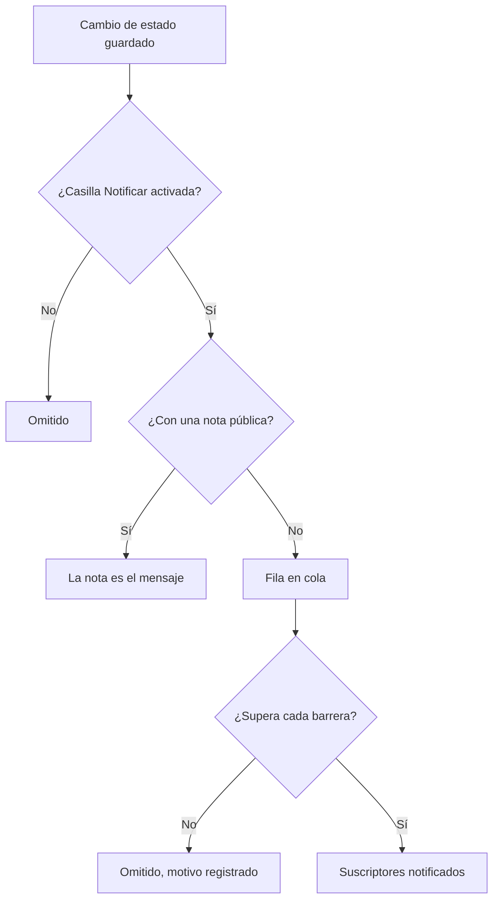

# Estados y severidades de incidentes

Todo incidente lleva dos clasificaciones: un **estado**, que dice en qué punto está tu respuesta, y una **gravedad**, que dice cuánto duele. Esta página explica qué hace cada estado, cómo añadir los tuyos y cómo se ordenan las gravedades, para quien configura incidentes o quiere saber por qué uno avisó o no, se resolvió o no, o apareció o no en una página de estado.

:::cards
- [Añadir tus propios estados](#añadir-tus-propios-estados): Modela tu respuesta, y mira cómo cuenta cada estado.
- [Qué hace reconocer](#qué-hace-reconocer): Los avisos se detienen y el SLA se marca como respondido.
- [Qué hace resolver](#qué-hace-resolver): Se devuelven los monitores y se cierra el SLA.
- [Avisar a los suscriptores](#avisar-a-los-suscriptores-de-la-página-de-estado-de-un-cambio-de-estado): Las barreras que supera un cambio de estado antes de que una página de estado se entere.
:::

## Cómo funciona

En el panel, estados y gravedades se parecen: ambos se muestran como etiquetas de color en la lista de incidentes y como un punto de color delante del nombre allí donde eliges uno, y ambos son listas propias del proyecto que puedes renombrar y recolorear. Pero hacen trabajos muy distintos.

Los estados dirigen el comportamiento. Tres indicadores booleanos en las filas de estado, junto con el orden de los estados, deciden qué incidentes cuentan como activos, qué botones aparecen en la cabecera del incidente, cuándo se detiene el reloj del SLA y cuándo desaparece el incidente de tu página de estado. Las gravedades no dirigen nada por sí mismas: son etiquetas que describen el impacto, y en las que otras reglas pueden basarse.

```mermaid title="Los incidentes solo bajan por la lista; la posición de un estado decide cómo cuenta"
flowchart TB
    subgraph open["Cuenta como no reconocido"]
        identified["Identificado"]
    end
    subgraph working["Cuenta como reconocido"]
        acknowledged["Reconocido"]
        mitigated["Mitigated (personalizado)"]
    end
    subgraph done["Cuenta como resuelto"]
        resolved["Resuelto"]
        closed["Closed (personalizado)"]
    end
    identified --> acknowledged
    acknowledged --> mitigated
    mitigated --> resolved
    resolved --> closed
    identified -. "saltar pasos" .-> resolved
```

El modelo `IncidentState` tiene `name`, `description`, `color` y `order`, más tres booleanos: `isCreatedState`, `isAcknowledgedState` e `isResolvedState`. Todo lo que el producto hace con los estados se basa en esos booleanos y en `order`, nunca en el nombre del estado. Por eso puedes renombrar **Resuelto** como «Closed» sin que nada se rompa: el indicador viaja con la fila.

El modelo `IncidentSeverity` tiene `name`, `description`, `color` y `order`, y nada más. No hay indicadores. Nada en OneUptime trata por sí solo **Critical Incident** de forma distinta a **Minor Incident**: la gravedad solo importa allí donde apuntas algo a ella, como el criterio de coincidencia **Gravedades de incidente** de una regla de guardia.

Algunas reglas rápidas:

- **Elige la gravedad para comunicar el impacto**: se muestra en la lista de incidentes, en la **Vista general** del incidente, y es un campo obligatorio cuando declaras un incidente.
- **Elige los estados para modelar tu proceso**: los pasos de respuesta que de verdad recorres, en el orden en que los recorres.
- **No codifiques la urgencia en los estados**: un estado llamado «Critical» no avisaría a nadie. Eso lo hace la gravedad junto con una regla de guardia.

> [!TIP]
> Ambas listas se crean al crear tu proyecto, y ambas se editan en **Incidentes → Ajustes**. Esa sección del menú lateral de Incidentes está plegada por defecto, así que despliega **Ajustes** antes de buscarlas.

## Los estados iniciales

Con el proyecto se crean tres estados, en este orden. La creación es idempotente: un estado solo se añade cuando no existe ya uno con ese nombre.

| Estado            | `order` | Indicador             | Color     | Qué significa                                      |
| ----------------- | ------- | --------------------- | --------- | -------------------------------------------------- |
| **Identificado**  | `1`     | `isCreatedState`      | `#fd625e` | El estado en el que entran los incidentes nuevos.  |
| **Reconocido**    | `2`     | `isAcknowledgedState` | `#ffbf53` | Alguien ha tomado el incidente.                    |
| **Resuelto**      | `3`     | `isResolvedState`     | `#2ab57d` | El incidente ha terminado y deja de contar como activo. |

> [!NOTE]
> El primer estado se llama **Identificado**, aunque varias descripciones del producto todavía lo llaman estado «created». Cuando una documentación o una descripción emergente dice «estado de creación», se refiere al estado que lleva `isCreatedState`; en un proyecto recién creado, es **Identificado**.

## Qué hace de verdad cada indicador de estado

| Indicador             | Propósito                                                                                                                                                                                            |
| --------------------- | ---------------------------------------------------------------------------------------------------------------------------------------------------------------------------------------------------- |
| `isCreatedState`      | El estado que recibe un incidente cuando nadie eligió uno. Si ningún estado del proyecto lleva este indicador, crear un incidente falla con un error que te pide añadir un estado de creación de incidentes desde los ajustes. |
| `isAcknowledgedState` | Marca el estado reconocido del proyecto: aquel al que **Reconocer** lleva un incidente y que da nombre al indicador de reconocimiento. Un incidente en él, en cualquier estado posterior, o resuelto, está reconocido: ya no se le ofrece **Reconocer**, la guardia deja de avisar por él y su SLA se marca como respondido. |
| `isResolvedState`     | Marca el estado resuelto del proyecto: aquel al que **Resolver** lleva un incidente y que muestra el indicador de resolución. Un incidente en él, o en cualquier estado posterior, está resuelto: sale de **Incidentes activos** y de la sección activa de una página de estado, y su SLA se marca como resuelto. |

Se espera que solo un estado por proyecto tenga cada indicador: las búsquedas toman el primero en el orden. Los tres estados marcados llevan la etiqueta **Predefinido** en la página de ajustes; pasa el ratón por encima (o llega a ella con Tab) para leer qué hace OneUptime con el estado. Se pueden renombrar, recolorear y arrastrar, pero:

- **Conservan su orden.** El de creación va antes que el reconocido, y el reconocido antes que el resuelto. Un arrastre que rompería eso —**Resuelto** por encima de **Reconocido**, por ejemplo— se rechaza, las filas vuelven a su sitio y la página dice por qué.
- **No se pueden eliminar.** Su **Eliminar** sigue en el menú de la fila, bloqueado, con el motivo. Una eliminación masiva los omite y los lista como no eliminados. La API también se niega a eliminar el último estado de creación, reconocido o resuelto de un proyecto.

Como la interfaz lee los nombres de los estados de forma dinámica, renombrar un estado cambia lo que ves en todas partes: los indicadores (**Acknowledged in** y **Resolved in** con los nombres iniciales), la confirmación **Mark Incident as …** de un estado personalizado y la etiqueta de la lista de incidentes siguen el nombre que diste a la fila.

## Añadir tus propios estados

Un estado que añades es un paso de tu respuesta que los tres iniciales no nombran: «Investigating», «Mitigated», «Monitoring», «Closed».

:::steps
### Abrir la lista de estados

Ve a **Incidentes → Ajustes → Estado del incidente**. La tarjeta **Estados de incidente** lista tus estados en su orden, una fila cada uno: un asa para arrastrarlo, su color y su nombre, cómo **Cuenta como** un incidente en él, y su descripción. La frase bajo el título lo dice claramente: los incidentes solo bajan por esta lista.

### Crear el estado

Haz clic en **Crear Estado del incidente**, en la cabecera de la tarjeta, y rellena el formulario (campos abajo). El nuevo estado se añade **justo por encima del estado resuelto**: donde va la mayoría de los estados, y nunca por debajo, donde contaría silenciosamente como resuelto.

### Arrastrarlo a su sitio

Arrastra una fila por su asa para moverla. El nuevo orden se guarda al soltarla; no hay número de orden que escribir. Con el teclado, pon el foco en el asa, pulsa Espacio, muévela con las flechas y vuelve a pulsar Espacio. La columna **Cuenta como** se actualiza al soltar la fila.
:::

**Editar** abre el mismo formulario que crear. El ID del estado está en **Mostrar ID** en el menú de la fila.

| Campo           | Obligatorio | Qué hace                                                                                                                                                                                                                                                           |
| --------------- | ----------- | ------------------------------------------------------------------------------------------------------------------------------------------------------------------------------------------------------------------------------------------------------------------- |
| **Nombre**      | Sí          | Al menos dos caracteres. El texto de ejemplo sugiere algo como «Investigating».                                                                                                                                                                                    |
| **Descripción** | No          | Texto libre que explica cuándo está un incidente en este estado.                                                                                                                                                                                                   |
| **Color**       | Sí          | Ya elegido cuando se abre el formulario: un color que todavía no usa ningún estado de la lista, para que un estado nuevo nunca salga del mismo rojo que el de arriba. Elige otro de la fila de colores con nombre (Red, Orange, Lime, Green, Teal, Blue, Indigo, Purple, Magenta, Pink), o usa **Color personalizado** para un color de marca exacto como `#fd625e`. |

El color tiñe la etiqueta del estado y el punto delante de su nombre en cada selector de estado: los formularios de declaración y de plantilla, la acción masiva **Cambiar estado**, el menú de estados de la cabecera y las condiciones de reglas y filtros. Todos esos selectores listan los estados en el orden en que los pone esta página.

No puedes definir los tres indicadores desde este formulario: pertenecen a las filas iniciales. Un estado que añades es, por tanto, un estado sin indicador, lo que tiene tres consecuencias que conviene planificar:

- **Su posición decide cómo cuenta.** La columna **Cuenta como** lo muestra, y cambia al arrastrar: por encima del estado reconocido, un incidente en él está **No reconocido**; desde el estado reconocido hacia abajo cuenta como **Reconocido**, así que las políticas de guardia dejan de escalarlo; desde el estado resuelto hacia abajo cuenta como **Resuelto**, así que las páginas de estado dejan de mostrarlo como activo.
- **Por encima del estado resuelto, mantiene el incidente activo.** **Incidentes activos** contiene los incidentes cuyo estado actual está por encima del estado resuelto, así que un estado que añadas ahí mantiene el incidente en la lista activa y en el contador de la barra lateral. Un estado arrastrado por debajo del estado resuelto cuenta como resuelto en todas partes —las listas activas, las páginas de estado, los recordatorios y el SLA—, y pasar un incidente a él desde **Resuelto** no es una segunda resolución.
- **Pasas un incidente a él desde el menú de la cabecera.** Los botones de la cabecera son solo **Reconocer** y **Resolver**; un estado personalizado está en **Cambiar el estado a** dentro del menú **⋯** junto a ellos, que lista todos los estados posteriores al actual. Su confirmación se titula **Mark Incident as `<state name>`** con un botón de envío **Mark as `<state name>`**.

> [!TIP]
> Una forma habitual es un paso de mitigación entre el estado reconocido y el resuelto: crea «Mitigated» y queda justo por encima de **Resuelto**, después de **Reconocido**, contando como reconocido. Para un paso de clasificación antes de que nadie haya reconocido el incidente, arrástralo por encima de **Reconocido**.

## El orden es una restricción real, no una preferencia de visualización

El orden se aplica cuando se escribe un cambio de estado, no solo cuando se dibuja la lista:

- **Se rechazan las transiciones hacia atrás.** Pasar un incidente a un estado que está antes en el orden que su estado actual falla con un error que nombra ambos estados.
- **Se rechaza volver a elegir el estado actual.** Poner un incidente en el estado en el que ya está falla con «Incident state cannot be same as previous state.»
- **Una fila con fecha anterior no puede duplicar a su vecina.** Insertar una fila de cronología cuyo estado coincide con el de la fila que la sigue también se rechaza.
- **Los botones de la cabecera siguen la posición de los estados marcados en el orden.** **Reconocer** y **Resolver** se ofrecen según dónde esté el estado actual en la lista ordenada. Un estado personalizado colocado *después* del estado resuelto nunca muestra un botón **Resolver**, porque un incidente en él ya cuenta como resuelto.

Así que, cuando añadas un estado, colócalo donde de verdad pasaría un incidente por él. Ordenarlo mal no solo queda raro: hace imposibles algunas transiciones. Mover un estado más abajo cambia cómo cuentan los incidentes que ya están en él, en el momento en que lo sueltas.

Por la API y Terraform, el orden es la columna `order`: los números más bajos van primero. Un estado creado sin él va justo por encima del estado resuelto; uno creado o actualizado con un número ocupa ese lugar, y los estados que estorban bajan un puesto. Los números que nadie más tiene se conservan tal como se escribieron, así que un estado gestionado con Terraform relee el número que se le dio.

## Las gravedades iniciales

Con el proyecto se crean tres gravedades, en este orden, de la más grave a la menos:

| Gravedad              | `order` | Color     | Descripción inicial                                                                                                                                                                       |
| --------------------- | ------- | --------- | ----------------------------------------------------------------------------------------------------------------------------------------------------------------------------------------- |
| **Critical Incident** | `1`     | `#b70400` | Issues causing very high impact to customers. Immediate response is required. Examples include a full outage, or a data breach.                                                          |
| **Major Incident**    | `2`     | `#fd625e` | Issues causing significant impact. Immediate response is usually required. We might have some workarounds that mitigate the impact on customers. Examples include an important sub-system failing. |
| **Minor Incident**    | `3`     | `#ffbf53` | Issues with low impact, which can usually be handled within working hours. Most customers are unlikely to notice any problems. Examples include a slight drop in application performance. |

La gravedad es obligatoria cuando declaras un incidente, y es obligatoria en cada especificación de incidente de los criterios de un monitor, así que todo incidente —manual o automático— llega con una. Consulta [Declarar un incidente](/docs/incidents/declaring-incidents) para el flujo de declaración y [Plantillas de incidentes y alertas](/docs/monitor/incident-alert-templating) para el camino impulsado por monitores.

## Editar gravedades

Ve a **Incidentes → Ajustes → Gravedad del incidente**. La misma forma que la página de estados: una fila por gravedad, de la más grave a la menos, arrastra una fila para cambiar su rango, **Crear Gravedad del incidente** añade una al final (la menos grave), con **Nombre**, **Descripción** y **Color** en el formulario, y el color ya elegido como en el formulario de estados.

El rango importa allí donde OneUptime compara gravedades: un episodio toma la gravedad de su incidente más grave, y los valores Critical y Warning de una recomendación de monitor corresponden a tu primera y tu segunda gravedad.

Dos diferencias con los estados:

- **No hay protección contra la eliminación.** Cualquier gravedad se puede eliminar, incluidas las tres iniciales.
- **No hay indicadores que heredar, ni «Cuenta como».** Una gravedad nueva se comporta exactamente igual que las iniciales: es una etiqueta con un color y un rango.

Donde la gravedad hace algo más que describir: en **Incidentes → Reglas → Reglas de guardia**, el campo **Gravedades de incidente** de una regla es un criterio de coincidencia. Listar ahí **Critical Incident** es como se expresa «avisar al equipo de base de datos por todo lo crítico»: la política de guardia vive en la regla, no en la gravedad.

**Cambiar la gravedad de un incidente** —con **Editar** en la tarjeta **Detalles del incidente** del incidente, por la API o Terraform (`incidentSeverityId`), con un flujo de trabajo o con las herramientas de IA— hace las mismas cuatro cosas se envíe como se envíe: el feed del incidente recibe una entrada **Incident updated** que nombra la nueva gravedad, se recalculan los plazos del SLA del incidente, su regla de recordatorio se vuelve a emparejar y las métricas de incidentes cuentan un cambio de gravedad. Guardar la gravedad que el incidente ya tiene no hace nada de eso, así que editar solo el título de un incidente deja sus plazos de SLA, sus recordatorios y su recuento de cambios de gravedad como estaban. La gravedad de una alerta funciona igual para su entrada de feed y sus recordatorios.

## Mover un incidente por sus estados

Un incidente cambia de estado de cuatro formas:

| Forma                       | Dónde                                                                                       | Qué pide                                                                                                                                                                                                     |
| --------------------------- | ------------------------------------------------------------------------------------------- | ------------------------------------------------------------------------------------------------------------------------------------------------------------------------------------------------------------ |
| **Botones de la cabecera**  | La cabecera del incidente: **Reconocer** y **Resolver**, y **Cambiar el estado a** en su menú **⋯** | Una breve confirmación —**Reconocer incidente** o **Resolver incidente**— con **Notificar a suscriptores de la página de estado** y, plegada en **Añadir una nota pública**, la **Nota pública** opcional y su selector **Seleccionar plantilla de nota** (cuando el proyecto tiene plantillas de notas). |
| **Cronología de estados**   | **Cronología de estados** en el menú lateral del incidente                                  | Una fila añadida a mano, con **Estado del incidente**, **Comienza en** y **Notificar a suscriptores de la página de estado**.                                                                                |
| **Cambio masivo**           | **Cambiar estado** sobre una selección en la lista de incidentes                            | Una página con el estado, **Notificar a suscriptores de la página de estado** y el mismo **Añadir una nota pública** plegado.                                                                               |
| **Automáticamente**         | Un criterio de monitor, o tu propio código                                                  | Un criterio con **Resolver incidente automáticamente** activado resuelve su incidente cuando el criterio deja de cumplirse. La API cambia el estado creando una fila en `/api/incident-state-timeline`.      |

Si el estado actual está antes del estado reconocido, la cabecera ofrece **Reconocer** y **Resolver**; si está entre los dos, solo **Resolver**. Reconocer también detiene cualquier escalado de guardia del incidente.

Cada una de estas formas escribe una fila de cronología. Un cambio de estado también hace algunas cosas que no tienes que pedir: publica una entrada en el feed del incidente, asigna un Comandante de incidente si el incidente aún no lo tiene, y actualiza el reloj del SLA. Reabrir un incidente resuelto inicia un registro de SLA nuevo desde la hora de reapertura.

## Qué hace reconocer

Un incidente queda reconocido desde el momento en que pasa a tu estado reconocido, a cualquier estado posterior —un estado **Mitigated** o **Investigating** que colocaste por debajo de **Reconocido**— o a un estado resuelto, sea cual sea de las cuatro formas anteriores la que lo mueve. La columna **Cuenta como** de la página de ajustes de estados muestra cuáles son esos estados. Una vez reconocido:

- **Ya no se ofrece Reconocer.** Ni en la cabecera del incidente, ni en la aplicación móvil (su botón y su deslizamiento), ni en Slack o Microsoft Teams, ni mediante `acknowledge_incident` del servidor MCP de OneUptime. Reconocerlo de todos modos —desde un aviso de guardia, Slack o Teams— se rechaza con «Incident is already acknowledged.» (o «Incident is already resolved.»), en lugar de devolverlo hacia arriba en su lista.
- **La guardia deja de avisar por él.** Un respondedor que reconoce su aviso después de que un compañero reconociera el incidente, o lo hiciera avanzar, ve su aviso reconocido y el incidente se queda donde está.
- **El SLA se marca como respondido**, en el primer movimiento de ese tipo; avanzar luego por estados posteriores conserva esa hora.
- **El tiempo hasta el reconocimiento corre hasta ese primer movimiento**: el indicador de la **Vista general** del incidente, la métrica **Time to Acknowledge**, una medición que termina cuando **Se reconoce el incidente**, y el MTTA de los resúmenes de Slack y Microsoft Teams. Un incidente que pasó directamente de **Identificado** a **Investigating** quedó reconocido entonces; uno resuelto de inmediato quedó reconocido al resolverse.
- **Un filtro Reconocido** —en el widget de lista de incidentes de un panel, por ejemplo— muestra los incidentes en tu estado reconocido y en cualquier estado posterior, antes de resolverse.

Las alertas y los episodios siguen la misma regla, con tus estados de alerta.

## Qué hace resolver

Un incidente se resuelve cuando pasa de un estado por encima de tu estado resuelto al estado resuelto, o a cualquier estado posterior, sea cual sea de las cuatro formas anteriores la que lo mueve. Cada resolución:

- **Devuelve los monitores que retiene el incidente.** Un incidente declarado abierto retiene sus monitores: los puso en su estado de **Cambiar el estado del monitor a**, cuando nombra uno, y, declarado a mano, pausó su monitoreo. Una edición mientras está abierto —añadir monitores, o cambiar ese estado— también hace que los retenga. Resolver reanuda su monitoreo y los devuelve a operativos, salvo que otro incidente abierto siga sobre ellos, y desde entonces el incidente no retiene nada. Así que un incidente declarado ya resuelto no devuelve nada, y tampoco una segunda resolución tras una reapertura: un estado que sus monitores recibieran entretanto —de sus sondas, de un mantenimiento o puesto a mano— se mantiene.
- **Marca el SLA como resuelto** y, cuando los borradores de post mortem de OneUptime AI están activados, redacta un post mortem.

Pasar de **Resuelto** a un estado posterior —**Closed**, por ejemplo— no es una segunda resolución: nada de esto vuelve a ejecutarse, y no empieza ningún SLA nuevo. Un incidente declarado antes de que OneUptime empezara a registrar esto devuelve sus monitores en su próxima resolución, como antes.

## La cronología de estados

La página **Cronología de estados** del menú lateral del incidente es el registro de auditoría de cada estado por el que ha pasado el incidente. La tarjeta de esa página se titula **Cronología de estados**, y está ordenada de más reciente a más antigua.

| Columna                                   | Qué muestra                                                                                                                                                                                                                                                    |
| ----------------------------------------- | -------------------------------------------------------------------------------------------------------------------------------------------------------------------------------------------------------------------------------------------------------------- |
| **Estado del incidente**                  | Una etiqueta de color con el nombre y el color del estado.                                                                                                                                                                                                     |
| **Comienza en**                           | Cuándo entró el incidente en este estado.                                                                                                                                                                                                                      |
| **Termina en**                            | Cuándo salió. El estado actual muestra `Currently Active`.                                                                                                                                                                                                     |
| **Duración**                              | El tiempo pasado en el estado, contado hasta ahora para el actual.                                                                                                                                                                                             |
| **Estado de notificación del suscriptor** | Si la notificación de la página de estado para este cambio se envió, se omitió o sigue pendiente, con un enlace **más detalles** y, cuando el envío falló, una acción **Reintentar**. **Reintentar** vuelve a enviar el cambio de estado a cada página de estado a la que llega ahora el incidente, incluidos los suscriptores que ya lo recibieron. |

Cada fila tiene dos acciones:

- **Ver causa** — abre un diálogo **Causa raíz** que muestra el Markdown registrado con ese cambio de estado.
- **Ver registros** — abre un diálogo que explica por qué cambió el estado, con un visor **Registro de estados del incidente**.

En el panel, las filas de la cronología se pueden añadir y eliminar, pero no editar; un incidente siempre conserva al menos una fila. Por la API se puede corregir el `startsAt` de una fila, y cada medición calculada a partir de la cronología lo sigue.

> [!WARNING]
> Eliminar la fila equivocada reescribe la historia del incidente, así que trátalo como una herramienta de corrección y no como un hábito de limpieza.

## La lista de incidentes activos

**Incidentes → Incidentes activos** es la lista que vigilas durante un turno. Su definición es exactamente una condición: el estado actual del incidente está por encima de tu estado resuelto, el primer estado del orden marcado con `isResolvedState`. No se tiene en cuenta nada más: ni la gravedad, ni la antigüedad, ni si alguien lo ha reconocido.

El elemento del menú lateral lleva una insignia roja con un contador que usa la misma consulta, así que la insignia y la lista siempre coinciden. Cuando no hay nada que ver, la página lo dice.

La consecuencia práctica: un estado personalizado que añadas por encima del estado resuelto mantiene los incidentes en esta lista —«Mitigated» no es «terminado»—, y uno que coloques después los saca de ella, como hace el estado resuelto. Las alertas y los episodios siguen la misma regla con sus propios estados, y los contadores del menú lateral, los recordatorios, las páginas de estado y la aplicación móvil la leen todos.

## Avisar a los suscriptores de la página de estado de un cambio de estado

Un cambio de estado puede notificar a los suscriptores de tu página de estado, pero pasa por varias barreras. Entenderlas ahorra mucha depuración del tipo «¿por qué no se notificó a nadie?».



La notificación se solicita por fila de cronología con **Notificar a suscriptores de la página de estado** (`shouldStatusPageSubscribersBeNotified`), la casilla del diálogo de cambio de estado y del formulario manual de la cronología. En el diálogo de cambio de estado empieza desactivada cuando el incidente se declaró sin notificar a los suscriptores. La misma casilla decide también si la nota pública del diálogo notifica a alguien. Cuando está desactivada, la fila se guarda con un estado omitido y una explicación. Cuando está activada, la fila se pone en cola y una tarea en segundo plano la recoge: la tarea se ejecuta cada minuto, así que la entrega es rápida pero no instantánea.

**La fila en cola se omite después cuando se cumple cualquiera de estas condiciones:**

- **El nuevo estado es el estado de creación.** A los suscriptores ya se les avisó cuando se declaró el incidente, así que la primera fila de la cronología no envía a propósito un segundo mensaje.
- **El incidente no tiene monitores adjuntos.** Sin recursos, no hay ninguna página de estado en la que situar el incidente.
- **El incidente no es visible en la página de estado** (`isVisibleOnStatusPage` está desactivado).
- **La página de estado tiene los incidentes desactivados** (`showIncidentsOnStatusPage` está desactivado). Esta es por página de estado: otras páginas que muestran el mismo monitor siguen recibiendo la notificación.
- **La página de estado está fuera del alcance del incidente.** Un incidente limitado a algunas páginas de estado con **Limitar a estas páginas de estado** solo notifica a esas páginas entre las que listan sus monitores, y una página con **Mostrar solo incidentes limitados a esta página** activado nunca recibe notificación de un incidente que no esté limitado a ella. También esta es por página de estado. Consulta [Una página de estado por audiencia](/docs/status-pages/one-status-page-per-audience).

**Una cosa más que cambia el resultado.** Si escribes una **Nota pública** en el diálogo de cambio de estado (en **Añadir una nota pública**) o en la acción masiva **Cambiar estado** mientras **Notificar a suscriptores de la página de estado** está activado, la fila de la cronología se marca como ya notificada en lugar de ponerse en cola, y su mensaje de estado dice que la nota la llevó. Es la propia nota la que llega a los suscriptores, así que reciben un mensaje en lugar de dos. Una nota que solo contiene espacios no se publica, y la fila se pone en cola como siempre. Los cambios de estado de los mantenimientos programados funcionan igual. El tipo de evento detrás del mensaje simple de cambio de estado es `Subscriber Incident State Changed`.

**La nota dice en qué estado está ahora el incidente.** Como la nota es el único mensaje, nombra el nuevo estado en cada canal, como lo habría hecho el mensaje de cambio de estado: el asunto del correo es `[Resolved Incident] <title>` y sus detalles muestran una fila **Estado** en el color del estado, el SMS dice `Incident <title> on <status page> is Resolved.`, los mensajes de Slack y Microsoft Teams llevan una línea `**Status:** Resolved`, y la carga útil `IncidentNoteCreated` del webhook lleva `incidentState` en `data`. Una nota publicada por sí sola conserva su mensaje habitual, igual que la notificación de actualización de una edición.

**Publicar la nota necesita su propio permiso.** Cambiar el estado y publicar una nota pública son permisos distintos (**Create Incident State Timeline** y **Create Incident Status Page Note** en un rol personalizado; los roles predefinidos de incidente y de proyecto tienen ambos). Cambiar el estado no requiere permiso para editar el incidente: consulta [Cambiar un estado](/docs/permissions/index#cambiar-un-estado). A quien puede cambiar el estado de un incidente pero no publicar notas públicas no se le ofrece **Añadir una nota pública** en el diálogo ni en la acción masiva **Cambiar estado**. Un cambio de estado que envíe con una nota por la API se rechaza entero, con un mensaje que dice que el estado no se cambió y por qué, para que nunca se registre un cambio como comunicado por una nota que nunca se publicó. Sin la nota, el cambio se aplica. Las alertas, los episodios de alerta y los episodios de incidente ofrecen en su lugar una nota privada con un cambio de estado (**Añadir una nota privada**), y funciona igual: publicarla requiere el permiso propio de la nota (**Create Alert Internal Note**, **Create Alert Episode Internal Note** o **Create Incident Episode Internal Note** en un rol personalizado; los roles predefinidos de alerta, de incidente y de proyecto los tienen), y un cambio de estado enviado con una nota privada por alguien sin ese permiso se rechaza entero, así que el estado no cambia.

**Enviado significa enviado a cada suscriptor.** La tarea espera cada mensaje y lo cuenta como enviado o fallido, por página de estado y canal, y el mensaje de estado de la fila lista esos recuentos. Un solo mensaje fallido, o un envío que se quedó sin tiempo o se interrumpió, deja la fila como **Fallido**. Consulta [Suscriptores y anuncios](/docs/status-pages/subscribers).

Para saber quién recibe estos mensajes y cómo se eligen las plantillas, consulta [Suscriptores y anuncios](/docs/status-pages/subscribers).

## Mantener un incidente fuera de la página de estado

Cuatro cosas distintas deciden si un incidente aparece siquiera en una página pública, y las cuatro deben cumplirse:

- **Mostrar incidentes** (`showIncidentsOnStatusPage`) en la propia página de estado.
- **Visible en la página de estado** (`isVisibleOnStatusPage`) en el incidente: un interruptor de la página **Ajustes** del incidente. Vale true por defecto y no está en el asistente de declaración; un criterio de monitor puede definirlo con **Mostrar incidente en la página de estado**. Un incidente declarado oculto no avisa a ningún suscriptor al crearse; cuando activas este interruptor más tarde, el formulario de edición ofrece **Notificar a los suscriptores que se creó este incidente**. Consulta [Declarar un incidente](/docs/incidents/declaring-incidents).
- **La página está al alcance del incidente.** La página lista uno de los monitores del incidente y, si el incidente está limitado a algunas páginas de estado, es una de ellas. Una página con **Mostrar solo incidentes limitados a esta página** activado solo muestra los incidentes limitados a ella. Consulta [Una página de estado por audiencia](/docs/status-pages/one-status-page-per-audience).
- **El estado actual está por encima del estado resuelto.** Esto es lo que retira un incidente de la sección activa: la consulta de la página de estado obtiene los incidentes cuyo estado actual está por encima de tu estado resuelto, así que el estado resuelto y cualquier estado posterior retiran el incidente. No archivas ni cierras nada: lo resuelves, y pasa al historial.

**Los incidentes privados nunca aparecen.** Activar **Incidente privado** oculta el incidente en todas las páginas de estado, independientemente de los interruptores anteriores, y lo restringe a sus propietarios más los administradores y propietarios del proyecto. Nada de él llega tampoco a un suscriptor de la página de estado: ni su creación, ni sus cambios de estado, ni sus notas públicas, ni su post mortem. Las imágenes de su descripción, su post mortem, sus campos personalizados y sus notas públicas no son visibles para todo el mundo mientras es privado.

Los dos interruptores se mantienen sincronizados, así que la página **Ajustes** del incidente siempre muestra lo que hacen las páginas de estado:

- Hacer privado un incidente desactiva con él **Visible en la página de estado**.
- Activar **Visible en la página de estado** mientras el incidente sigue siendo privado lo deja desactivado. Para publicar un incidente privado, desactiva **Incidente privado** y activa **Visible en la página de estado**, en un solo guardado o uno tras otro.

Esto se cumple escriba quien escriba el incidente: el panel, la API, Terraform, un flujo de trabajo, un monitor, una plantilla de incidente o una regla de privacidad. Un valor enviado como texto, como `"true"`, cuenta igual que `true`. Una escritura sobre muchos incidentes que activa **Visible en la página de estado** —el **Update Many** de un flujo de trabajo, por ejemplo— muestra los que no son privados y deja ocultos todos los privados. Cada incidente se decide tal como está cuando le llega la escritura, así que un cambio de su privacidad que llegue en el mismo momento nunca queda pisado: un incidente nunca se guarda privado y visible a la vez. Un incidente creado privado se crea oculto, y no avisa a ningún suscriptor de su creación.

**Los episodios siguen la misma regla.** Un episodio de incidente privado se oculta en todas las páginas de estado, diga lo que diga su interruptor **Visible en la página de estado**, y sus suscriptores no se enteran de nada sobre él. En la página **Ajustes** del episodio, el interruptor lo dice, y se queda desactivado mientras el episodio es privado. Un incidente privado nunca lleva su episodio a una página de estado: un episodio solo llega a una página a través de incidentes que no son privados.

:::details Actualizar desde una versión sin estas reglas
Los incidentes y episodios guardados como privados con **Visible en la página de estado** aún activado, de antes de estas reglas, lo tienen desactivado al actualizar. No se envía nada a nadie. Las imágenes que un incidente o episodio así había hecho visibles para todo el mundo vuelven a ser privadas, salvo que algo que muestran tus páginas de estado las siga conteniendo. Lo mismo ocurre con las imágenes de las notas públicas de incidentes, episodios y eventos de mantenimiento programado que tus páginas de estado no muestran, que antes seguían siendo visibles para todo el mundo.
:::

Cuánto historial resuelto conserva la página es un ajuste de la página de estado, no del incidente. Consulta [Recursos y grupos de la página de estado](/docs/status-pages/resources-and-groups) para ver cómo los monitores de la página deciden qué incidentes aparecen.

## Próximos pasos

:::cards
- [Declarar un incidente](/docs/incidents/declaring-incidents): Elige un estado inicial y una gravedad al declarar.
- [Notas, responsables y actividad de incidentes](/docs/incidents/notes-owners-and-feed): Publica la nota pública que acompaña a un cambio de estado.
- [Configuración y automatización de incidentes](/docs/incidents/settings): Mide el tiempo entre estados, y usa las gravedades en las reglas.
- [Suscriptores y anuncios](/docs/status-pages/subscribers): Quién recibe los mensajes que envía un cambio de estado.
:::
