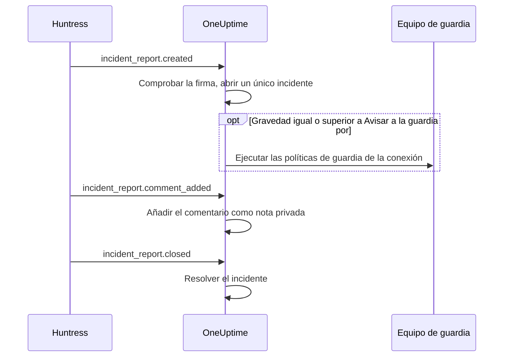

# Integración con Huntress

Avisa a tu equipo de guardia por los informes de incidente de Huntress. Cuando el SOC de Huntress envía un informe de incidente sobre un equipo o una identidad, OneUptime abre un único incidente para él, con la gravedad que elijas, avisa a las políticas de guardia que indiques y resuelve el incidente cuando el informe se cierra en Huntress.

Esta integración es **entrante**: Huntress envía cada evento de un informe de incidente a una URL de webhook que te da OneUptime, firmado con el secreto de firma del endpoint. OneUptime nunca llama a Huntress, así que no necesita ninguna clave de API de Huntress.

:::cards
- [Cómo funciona](#cómo-funciona): Qué hace OneUptime con cada evento de un informe.
- [Configurarla](#configurar-la-integración): Conectar en OneUptime, añadir el endpoint en Huntress, guardar su secreto de firma, enviar una prueba.
- [Ajustes](#ajustes): Avisos, gravedades, organizaciones, etiquetas y resolución.
- [Solución de problemas](#solución-de-problemas): Qué significan los errores de la conexión y qué cambiar.
:::

## Cómo funciona

Huntress envía un evento sobre un informe de incidente cuando el informe se envía, cuando alguien lo comenta y cuando se cierra. Cada evento lleva el informe completo.

1. **Comprobar.** Una solicitud debe estar firmada con el secreto de firma del endpoint, no más de cinco minutos antes de llegar. Todo lo demás se rechaza, y la página de la conexión dice por qué.
2. **Abrir un único incidente.** El primer evento de un informe abre un incidente con el nombre del informe, como `Huntress: Incident on DESKTOP-01 (Acme Corp)`. Su descripción contiene el resumen del informe, su gravedad en Huntress, la organización, el equipo o la identidad afectados, los indicadores que encontró Huntress y un enlace al informe en Huntress. Los eventos posteriores del mismo informe, y las entregas que Huntress reenvía, encuentran ese incidente: un informe nunca abre dos.
3. **Avisar.** El incidente se abre con la gravedad de incidente que la conexión asigna a la gravedad de Huntress del informe. Cuando esa gravedad es igual o superior a **Avisar a la guardia por**, se ejecutan las **Políticas de guardia** de la conexión.
4. **Seguir el informe.** Un comentario añadido en Huntress se convierte en una nota privada en el incidente. Cuando el informe se cierra o se descarta, el incidente se resuelve.

Los incidentes abiertos así nunca aparecen en una página de estado. Tus reglas de incidentes (de guardia, de propietarios, de etiquetas y de privacidad) se aplican a ellos como a cualquier otro incidente.

## Antes de empezar

- En OneUptime, el rol **Project Owner** o **Project Admin**. Los miembros, los lectores y los roles de incidentes ven la conexión y los informes que recibió, pero no pueden cambiarla.
- En Huntress, el rol **Account Admin**: solo los administradores de la cuenta pueden añadir webhooks.
- Una política de guardia a la que avisar. Sin ella, los informes abren incidentes y no avisan a nadie, salvo que una regla de guardia de incidentes coincida con ellos.
- En una instalación autoalojada, un OneUptime al que Huntress llegue desde internet por HTTPS: Huntress solo envía webhooks a URL `https://`.

## Configurar la integración

:::steps
### Conectar Huntress en OneUptime

Abre **Incidentes → Integraciones → Huntress** (`/dashboard/{projectId}/incidents/integrations/huntress`). La sección **Integraciones** del menú lateral de incidentes está plegada por defecto, así que despliégala primero. Haz clic en **Conectar Huntress**.

Elige las **Políticas de guardia** a las que avisar. **Avisar a la guardia por** pregunta entonces qué informes las avisan, y empieza en **Informes altos y críticos**. Todo lo demás espera en **Más campos** con un valor por defecto (consulta [Ajustes](#ajustes)). Haz clic en **Conectar Huntress**. Se abre la página de la conexión, con una tarjeta **Conectar Huntress** que te guía por los tres pasos siguientes.

### Añadir un endpoint de webhook en Huntress

En la página de la conexión, haz clic en **Copiar URL del webhook**. La URL tiene la forma `https://oneuptime.com/api/huntress/webhook/<connection-id>`; en una instalación autoalojada empieza por tu propio host.

En Huntress, abre el menú de arriba a la derecha y elige **Integrations**. Haz clic en **Add an Integration**, elige **Webhooks** y haz clic en **Add Endpoint**. Pega la URL, activa **Incident Reports** y guarda. Deja desactivados **Escalations**, **Platform Actions** y **Account Notices**: OneUptime acepta esos eventos y no hace nada con ellos.

### Guardar el secreto de firma del endpoint

En Huntress, abre el menú del endpoint (⋯) y elige **View Signing Secret**. Cópialo entero: empieza por `whsec_`. En la página de la conexión, haz clic en **Guardar secreto de firma**, pégalo y haz clic en **Guardar secreto de firma**. El secreto se cifra y no se vuelve a mostrar.

Mientras el secreto no esté guardado, OneUptime rechaza toda solicitud a la URL. Huntress vuelve a enviar más tarde un evento rechazado, así que un evento rechazado ahora llega igualmente.

### Enviar una prueba

En Huntress, abre el menú del endpoint (⋯) y elige **Send Test**. En pocos segundos, la tarjeta de la página de la conexión pasa a ser **Conexión**, con el estado **Recibiendo informes**.

> [!NOTE]
> Lleve lo que lleve la prueba, la conexión muestra que llegó. Una prueba que lleva un informe de incidente abre un incidente como cualquier otro informe, y avisa a la guardia si es lo bastante grave.
:::

## Ajustes

**Conectar Huntress** solo pregunta a quién se avisa y por qué informes. Todo lo demás espera en **Más campos**, con un valor por defecto que sirve a la mayoría de los equipos. Para cambiar un ajuste más tarde, haz clic en **Editar configuración** en la tarjeta **Ajustes** de la conexión.

| Ajuste | Qué hace | Por defecto |
| --- | --- | --- |
| **Políticas de guardia** | Las políticas que se ejecutan cuando un informe es lo bastante grave. Déjalo vacío para abrir incidentes sin avisar a nadie. | Ninguna |
| **Avisar a la guardia por** | Qué informes avisan a las políticas: **Solo informes críticos**, **Informes altos y críticos** o **Todos los informes**. Cada informe abre un incidente en cualquier caso. | **Informes altos y críticos** |
| **Nombre** | Cómo se llama la conexión en OneUptime. | `Huntress` |
| **Gravedad para informes críticos**, **Gravedad para informes altos**, **Gravedad para informes bajos** | La gravedad de incidente con la que se abre cada gravedad de Huntress. | Tus tres gravedades de incidente más altas, por orden |
| **Solo estas organizaciones** | Las organizaciones de Huntress cuyos informes abren incidentes, un nombre o ID de organización por línea. Los nombres no distinguen mayúsculas. | Vacío: todas las organizaciones |
| **Etiquetas** | Etiquetas que se añaden a cada incidente, además de la que lleva el nombre de la organización del informe. | Ninguna |
| **Resolver cuando Huntress cierre el informe** | Resolver el incidente cuando su informe se cierra o se descarta en Huntress. Si está desactivado, una nota privada en el incidente lo indica en su lugar. | Activado |

### Gravedades

Huntress da a cada informe de incidente una de tres gravedades. Salvo que elijas una gravedad de incidente para alguna, el informe se abre según el orden de tus gravedades de incidente, tal como las lista **Incidentes → Ajustes → Gravedad del incidente**:

| Gravedad en Huntress | Qué quiere decir Huntress | Gravedad de incidente |
| --- | --- | --- |
| Critical | Atacantes al teclado, malware peligroso o compromiso activo, que hay que contener de inmediato. | La más alta |
| High | Malware confirmado que requiere una corrección urgente, o un compromiso de identidad sobre el que actuar. | La segunda |
| Low | Programas potencialmente no deseados, restos de malware y hallazgos de identidad más antiguos. | La tercera |

Un proyecto con menos gravedades usa la más baja para el resto. Un informe sin gravedad se trata como alto. Si se elimina una gravedad que elegiste, vuelve a decidir el orden.

### Organizaciones

Cada incidente recibe una etiqueta con el nombre de la organización de Huntress del informe, como _Acme Corp_. Una conexión recibe los informes de todas las organizaciones de tu cuenta de Huntress, y **Solo estas organizaciones** lo acota.

> [!TIP]
> Para avisar al equipo de cada cliente, deja vacías las **Políticas de guardia** de la conexión y añade una regla de guardia de incidentes por organización, como «Si **Etiquetas de incidentes** tiene alguno de _Acme Corp_», que ejecute la política de ese cliente. Consulta [Reglas de guardia de incidentes](/docs/incidents/settings#reglas-de-guardia-de-incidentes).

## Informes en la página de la conexión

La lista **Informes de incidente** de la conexión muestra cada informe que envió Huntress, el más reciente primero: el equipo o la identidad afectados, su gravedad y su estado en Huntress, y su **Resultado**.

| Resultado | Qué pasó |
| --- | --- |
| **Incidente abierto** | El informe abrió un incidente. **Ver incidente** lo abre; **Guardia avisada** indica que la conexión avisó a sus políticas. |
| **Incidente resuelto** | Huntress cerró el informe y su incidente se resolvió. |
| **Omitido: organización no vigilada** | La organización del informe no está en **Solo estas organizaciones**. |
| **Omitido: ya cerrado en Huntress** | El informe ya estaba cerrado la primera vez que OneUptime supo de él. |

Un informe omitido sigue omitido aunque cambies los ajustes más tarde. Cuando **Resolver cuando Huntress cierre el informe** está desactivado, un informe cerrado conserva el resultado **Incidente abierto**.

## Seguridad

- **Solo solicitudes firmadas.** OneUptime comprueba las cabeceras `svix-id`, `svix-timestamp` y `svix-signature` que envía Huntress contra el cuerpo de la solicitud tal como llegó. Una solicitud que no está firmada con el secreto guardado, o que se firmó más de cinco minutos antes o después, se rechaza.
- **El secreto sigue siendo secreto.** Se guarda cifrado, la API nunca lo devuelve y no se vuelve a mostrar. **Reemplazar secreto de firma** en la página de la conexión guarda otro, como el secreto de un endpoint nuevo.
- **La URL es una dirección, no una contraseña.** Nombra la conexión; solo se atiende una solicitud firmada con el secreto del endpoint.
- **Un endpoint por conexión.** Cada conexión tiene su propia URL y su propio secreto. Para recibir los informes de una segunda cuenta de Huntress, conecta otra vez.

## Usar el correo en su lugar

Huntress también envía los informes de incidente por correo, y un [monitor de correos entrantes](/docs/monitor/incoming-email-monitor) puede abrir incidentes a partir de esos correos, por ejemplo cuando el asunto contiene `Critical Incident Report`. Sin embargo, trata los correos como el estado de un solo monitor: mientras su incidente está abierto, el siguiente informe no abre ninguno, y el incidente se resuelve según los criterios del monitor y no cuando Huntress cierra el informe. La conexión de Huntress abre un incidente por informe y resuelve cada uno con su informe, así que es preferible. En cuanto la conexión reciba informes, deja de enviar los correos al monitor, o cada informe avisará dos veces.

## Solución de problemas

Cuando OneUptime rechaza una solicitud, la página de la conexión muestra el motivo en **Se rechazó la última solicitud**. En Huntress, **View Delivery Attempts** en el menú del endpoint (⋯) lista cada entrega con la respuesta de OneUptime.

:::details "A request arrived but was refused, because no signing secret is saved for this connection yet"
Guarda el secreto de firma del endpoint: consulta [Configurar la integración](#configurar-la-integración). Huntress vuelve a enviar la solicitud rechazada.
:::

:::details "The request's signature does not match the signing secret"
El secreto guardado no es el de este endpoint. Cada endpoint tiene el suyo: en Huntress, abre el menú del endpoint (⋯), elige **View Signing Secret**, cópialo entero y guárdalo con **Reemplazar secreto de firma**.
:::

:::details "The request was signed more than five minutes from now"
Los relojes de Huntress y de tu servidor de OneUptime se separan más de cinco minutos, o la solicitud es una repetición. En una instalación autoalojada, comprueba que el reloj del servidor sea correcto.
:::

:::details "No Huntress connection has this address."
La conexión se eliminó, o la URL del endpoint en Huntress no es la de la conexión. Haz clic en **Copiar URL del webhook** en la página de la conexión y vuelve a pegar la URL en el endpoint de Huntress.
:::

:::details "This project has no incident severities, so a Huntress report cannot open an incident"
Añade una en **Incidentes → Ajustes → Gravedad del incidente**. Huntress vuelve a enviar el informe.
:::

:::details No se avisó a nadie
Un informe por debajo de **Avisar a la guardia por** abre un incidente sin avisar. En la lista **Informes de incidente**, **Guardia avisada** bajo el resultado de un informe indica que la conexión avisó. La página **Ejecuciones de guardia** del incidente muestra qué hizo cada política.
:::

## Próximos pasos

:::cards
- [Reglas de guardia de incidentes](/docs/incidents/settings#reglas-de-guardia-de-incidentes): Avisar al equipo de cada organización, por su etiqueta.
- [Estados y severidades de incidentes](/docs/incidents/states-and-severities): Ordenar las gravedades con las que se abren los informes de Huntress.
- [Reglas de escalado](/docs/on-call/escalation-rules): Decidir a quién se avisa y cuándo pasa el aviso al siguiente.
- [Descripción general de integraciones](/docs/integrations/index): Las demás herramientas que puedes conectar.
:::
