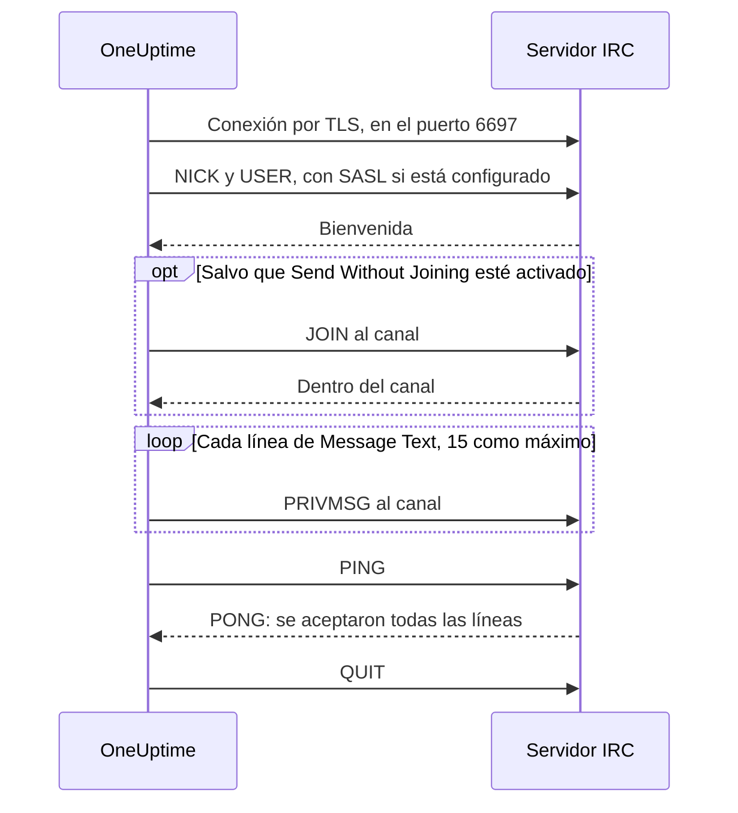

# Integración con IRC

Publica actualizaciones de incidentes en un canal de cualquier red IRC: Libera.Chat, OFTC o un servidor propio.

IRC no tiene webhooks, así que el paso de flujo de trabajo **Send Message to IRC** de OneUptime se conecta por sí mismo al servidor, como cualquier cliente IRC. No hay nada que instalar ni ninguna aplicación que registrar. Esta integración es **saliente**: OneUptime publica en el canal y no lee lo que se dice en él.

:::cards
- [Cómo funciona](#cómo-funciona): Lo que una ejecución del paso le dice al servidor.
- [Configuración](#configurar-la-integración): Servidor y canal, contraseñas y después el flujo de trabajo: desde la plantilla o desde cero.
- [Consejos](#consejos): Publicar sin entrar, SASL, mensajes largos y ráfagas.
- [Solución de problemas](#solución-de-problemas): Qué significan los errores del paso y qué cambiar.
:::

## Cómo funciona

Cada ejecución del paso mantiene una conversación breve con el servidor IRC, como lo haría un cliente IRC, y después cuelga.

1. **Conectar.** El paso se conecta por TLS en el puerto `6697` y comprueba el certificado del servidor.
2. **Registrarse.** Se registra como `OneUptime`, salvo que pongas otro **Nickname**, e inicia sesión con SASL cuando **SASL Username** y **SASL Password** están rellenados.
3. **Entrar.** Entra en el canal, salvo que **Send Without Joining** esté activado, con la **Channel Key** si el canal tiene una.
4. **Enviar.** Cada línea de **Message Text** sale como un mensaje IRC propio, un `PRIVMSG`.
5. **Confirmar.** IRC nunca dice «entregado», así que el paso envía un `PING` y espera el `PONG` del servidor. Un servidor responde en orden, de modo que para entonces ya ha llegado cualquier rechazo del mensaje.
6. **Salir.** Sale del servidor.

El paso toma su salida **Éxito** en cuanto el servidor ha aceptado todas las líneas. Toma **Error**, con el motivo en palabras del propio servidor cuando lo dio, cuando no se puede llegar al servidor o este rechaza la conexión, el apodo, una contraseña, el canal o el mensaje.

## Antes de empezar

- En OneUptime Cloud, el plan **Growth** o uno superior: los flujos de trabajo y sus variables forman parte de él. Las instalaciones autoalojadas sin facturación no tienen límites de plan.
- Un rol que construye flujos de trabajo: **Project Owner**, **Project Admin** o **Workflow Admin**.
- Una cuenta en la red IRC, si te pide iniciar sesión. Libera.Chat lo pide para las conexiones desde algunas direcciones de nube y de VPN.

## Configurar la integración

:::steps
### Elegir un servidor y un canal

Decide adónde van los mensajes: el nombre de host del servidor, por ejemplo `irc.libera.chat`, y el canal, por ejemplo `#your-channel`.

- **IRC Server** admite el nombre de host y nada más: sin `ircs://` y sin puerto. El paso se conecta por TLS en el puerto `6697`. Si tu servidor acepta TLS en otro puerto, ponlo en **Port**, en **Más campos**.
- **Channel** tiene que ser un canal. Un apodo escrito ahí se rechaza, así que el paso nunca envía a nadie un mensaje privado por error.

El servidor tiene que ser uno al que OneUptime pueda conectarse. Las direcciones de loopback (`localhost`, `127.0.0.1`), de enlace local y de metadatos de la nube se rechazan siempre. En OneUptime Cloud también se rechaza un servidor en una dirección de red privada. Una instalación autoalojada puede llegar a un servidor IRC de su propia red, salvo que `DATA_SOURCE_BLOCK_PRIVATE_ADDRESSES` esté en `true`.

### Guardar las contraseñas como variables secretas

Sáltate este paso si tu servidor, tu red y tu canal no necesitan contraseña. Si no, guarda cada contraseña como una [variable global](/docs/workflows/variables#variables-globales) secreta. Así el flujo de trabajo guarda el nombre de la variable en lugar de la contraseña, y cambias la contraseña en un solo sitio.

| Ajuste              | Rellénalo cuando                                                                               | Variable, por ejemplo |
| ------------------- | ---------------------------------------------------------------------------------------------- | --------------------- |
| **Server Password** | El servidor o tu bouncer pide una contraseña al conectarte.                                    | `IRC_SERVER_PASSWORD` |
| **SASL Password**   | La red quiere que inicies sesión en tu cuenta. **SASL Username** lleva el nombre de la cuenta. | `IRC_SASL_PASSWORD`   |
| **Channel Key**     | El canal tiene una clave (modo `+k`).                                                          | `IRC_CHANNEL_KEY`     |

Para guardar una, abre **Flujos de trabajo → Variables globales** y haz clic en **Crear Variable del flujo de trabajo**. Escribe el nombre en **Nombre** y haz clic en **Siguiente**. Pega la contraseña en **Contenido**, activa **Secreto** y haz clic en **Crear Variable del flujo de trabajo**. Los registros de ejecución muestran `[REDACTED]` en lugar del valor de una variable secreta.

### Crear el flujo de trabajo

Empieza desde la plantilla, que crea todo el flujo de trabajo por ti, o desde cero.

:::tabs
@tab Desde la plantilla
1. Abre **Flujos de trabajo** y haz clic en **Crear flujo de trabajo**.
2. Escribe `IRC` en **Buscar plantillas…**, haz clic en **Tell IRC when an incident opens** y después en **Usar esta plantilla**.
3. Deja el nombre **Notify IRC on new incident** o cámbialo, y haz clic en **Siguiente**.
4. Escribe **IRC Server** y **IRC Channel**, y haz clic en **Crear flujo de trabajo**.

El flujo de trabajo se abre en el **Constructor** con tres pasos: **On Create Incident**; **Send Message to IRC**, que publica el número, el título, la gravedad y el estado del incidente en dos líneas; y un paso **Registro** en su salida **Error**, que deja constancia de por qué no se entregó un mensaje. El servidor y el canal se guardan como las variables `ircServer` e `ircChannel` del flujo de trabajo. Si guardaste contraseñas en el paso anterior, haz clic en **Send Message to IRC**, abre **Más campos** y elige cada variable con el botón **{ }** de su ajuste.
@tab Desde cero
1. Abre **Flujos de trabajo**, haz clic en **Crear flujo de trabajo**, elige **Empezar desde cero**, ponle nombre al flujo de trabajo y haz clic en **Crear flujo de trabajo**.
2. En el **Constructor**, haz clic en **Elige qué inicia este flujo de trabajo** y elige **On Create Incident** en **Populares**. Haz clic en el disparador y, en **Select Fields**, elige los campos del incidente que muestra tu mensaje, por ejemplo su título.
3. Haz clic en **Añadir componente**, busca `irc` y haz clic en **Send Message to IRC**. Conecta la salida **Éxito** del disparador a este paso.
4. Haz clic en el paso nuevo y rellena **IRC Server**, **Channel** y **Message Text**. El botón **{ }** de **Message Text** inserta campos del incidente, por ejemplo su título.
5. Si guardaste contraseñas en el paso anterior, abre **Más campos**. En **Server Password**, **SASL Password** o **Channel Key**, haz clic en **{ }** y elige la variable en **Variables globales**. Pon el nombre de tu cuenta en **SASL Username**.
:::

### Activarlo y probarlo

Activa el interruptor **Habilitado** en la parte superior del **Constructor**. A partir de ahí, cada incidente nuevo se publica en el canal.

Para probarlo sin abrir un incidente, haz clic en **Ejecutar flujo de trabajo** y pon el ID de un incidente que ya tengas en **ID del incidente**. La página del incidente muestra su ID. Haz clic en **Ejecutar flujo de trabajo manualmente** y confirma con **Ejecutar**. El panel **Ejecución del flujo de trabajo** sigue la ejecución: el registro del paso de IRC dice cuántas líneas envió, por ejemplo `Sent 2 lines to #your-channel.`, y el mensaje aparece en el canal. Si el paso toma **Error**, su registro dice por qué: consulta [Solución de problemas](#solución-de-problemas).
:::

## Consejos

- **Publicar sin entrar.** La mayoría de los canales solo aceptan mensajes de sus miembros (modo `+n`), así que el paso entra antes de publicar y sale justo después. Un canal en `-n` acepta mensajes de fuera: activa **Send Without Joining** en **Más campos**, y el canal no ve al paso entrar y salir.
- **Iniciar sesión con SASL.** En las redes que usan SASL, como Libera.Chat, rellena **SASL Username** y **SASL Password** para iniciar sesión en tu cuenta. Libera.Chat lo exige para las conexiones desde algunas direcciones de nube y de VPN. Consulta [la guía de SASL de Libera.Chat](https://libera.chat/guides/sasl).
- **Ten en cuenta el límite de 15 líneas.** Cada línea de **Message Text** es un mensaje IRC propio, una línea larga se divide para que quepa y las líneas en blanco se omiten. Un mensaje se envía como 15 líneas IRC como máximo: uno más largo se recorta, y su última línea lo indica. Las cuatro primeras líneas salen de golpe y el resto a una por segundo, el ritmo de los clientes IRC, así que 15 líneas tardan unos 11 segundos.
- **Agrupa las ráfagas en un solo mensaje.** Cada ejecución es una conexión propia, y las redes IRC limitan la frecuencia con la que una misma dirección puede conectarse. Una ráfaga de ejecuciones puede rechazarse con un motivo como `Reconnecting too fast`, y toma **Error** como cualquier otro rechazo. Para un flujo de trabajo que puede dispararse muchas veces por minuto, agrupa lo que tenga que decir en un solo mensaje o envíalo a través de un servidor propio.
- **Da formato con los códigos de IRC.** IRC no tiene Markdown, así que el texto se envía tal como está escrito. Los códigos de formato de IRC, como la negrita y los colores, funcionan.
- **Un servidor sin TLS.** Activa **Disable TLS** solo para un servidor que no ofrezca TLS: el paso se conecta entonces en el puerto `6667`, y cualquier contraseña se envía sin cifrar. Para confiar en el certificado de un servidor emitido por tu propia autoridad de certificación, una instalación autoalojada define `NODE_EXTRA_CA_CERTS` en su lugar.
- **Otro apodo.** Los mensajes llegan de `OneUptime` salvo que pongas **Nickname**. Si el apodo está ocupado, el paso añade un guion bajo o un número.

## Solución de problemas

Cuando el paso toma **Error**, el registro de ejecución dice por qué, en una frase que empieza como una de estas.

:::details "The IRC server refused the connection"
El servidor, o tu bouncer, rechazó la conexión, y el mensaje termina con su motivo. Cuando el servidor quiere una contraseña, el mensaje lo dice: rellena **Server Password** o revísala.
:::

:::details "SASL sign-in failed"
La red rechazó la cuenta o la contraseña. Revisa **SASL Username** y **SASL Password**.
:::

:::details "Could not join #your-channel"
El canal rechazó al paso, por el motivo que da el mensaje. Un canal con clave la necesita en **Channel Key**.
:::

:::details "Could not send to #your-channel"
El servidor rechazó el mensaje, por el motivo que da el propio mensaje de error. Con **Send Without Joining** activado, puede que el canal solo acepte mensajes de sus miembros: desactívalo.
:::

:::details "The TLS certificate of the IRC server … is not trusted"
El certificado del servidor no es uno en el que OneUptime confíe. Una instalación autoalojada puede confiar en su propia autoridad de certificación con `NODE_EXTRA_CA_CERTS`. Activa **Disable TLS** solo para un servidor que no ofrezca TLS.
:::

## Próximos pasos

:::cards
- [Componentes → IRC](/docs/workflows/components#irc): Cada ajuste del paso y qué significan sus salidas.
- [Variables](/docs/workflows/variables#variables-globales): Las variables globales secretas y cómo las usan los pasos.
- [Ejecuciones](/docs/workflows/runs-and-logs): Lee qué hizo cada ejecución del flujo de trabajo.
- [Resumen de integraciones](/docs/integrations/index): El patrón saliente y las demás herramientas que puedes conectar.
:::
