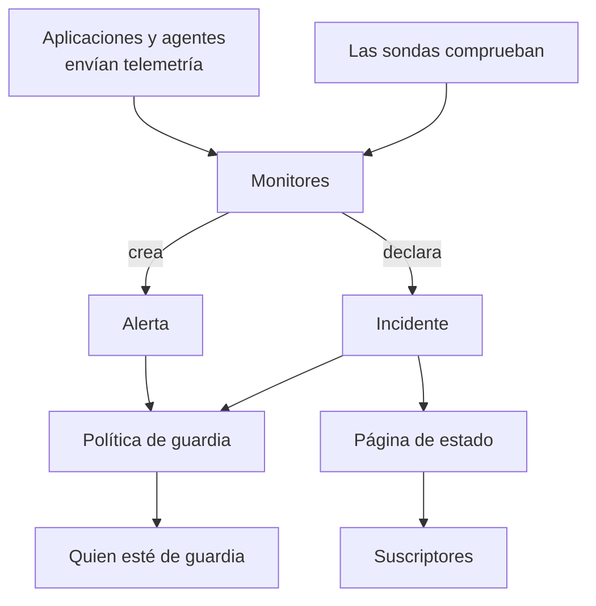

# Conceptos básicos

OneUptime tiene muchos productos, pero se apoyan en un puñado de ideas: proyectos, monitores, incidentes y alertas, guardias, páginas de estado y telemetría. Esta página explica cada una en unas pocas frases, muestra cómo se relacionan y enlaza con las páginas que las tratan a fondo. Léela una vez, y todas las demás páginas de la documentación se leerán con más facilidad.

:::cards
- [Proyectos y personas](#proyectos-y-personas): Dónde vive todo, y quién puede hacer qué.
- [Monitores y sondas](#monitores-y-sondas): Cómo detecta OneUptime que algo va mal.
- [Incidentes y alertas](#incidentes-y-alertas): El registro con el que trabaja tu equipo.
- [Guardia](#guardia): A quién se avisa, cómo, y quién va después.
:::

## Cómo se relacionan las piezas

Un problema recorre OneUptime en una sola dirección. Las sondas y tu propia telemetría alimentan a los monitores. Los criterios de un monitor deciden cuándo algo va mal y qué se abre: un incidente, una alerta o ambos. Las políticas de guardia avisan a las personas sobre ellos, y las páginas de estado informan a tus clientes de los incidentes.

## Proyectos y personas

Un **proyecto** lo contiene todo: monitores, incidentes, políticas de guardia, páginas de estado, telemetría y ajustes. La mayoría de las empresas necesitan uno, y algunas tienen uno por entorno o por unidad de negocio. Nada de lo que creas en un proyecto es visible en otro.

Tu **cuenta** es independiente de tus proyectos. Una cuenta, con un correo y una contraseña, puede pertenecer a tantos proyectos como quieras; cambia de uno a otro con el selector de proyectos de arriba a la izquierda. Consulta [Su cuenta](/docs/introduction/your-account).

Las personas están en un proyecto a través de **equipos**, y los permisos de un equipo deciden lo que pueden hacer sus miembros. Cada proyecto nuevo empieza con tres equipos: Owners, contigo dentro, Admin y Members. En OneUptime Cloud, cada proyecto tiene su propio plan.

:::cards
- [Usuarios, equipos y permisos](/docs/permissions/index): Invitar a personas y decidir lo que pueden hacer.
:::

## Monitores y sondas

Un **monitor** comprueba una cosa que ejecutas y decide si funciona. La mayoría de los monitores los comprueban **sondas**: máquinas que ejecutan la comprobación según una programación, como pedir una página, llamar a una API, hacer ping a un host o consultar una base de datos. OneUptime Cloud ejecuta sondas en varias regiones, una instalación autoalojada ejecuta las suyas, y puedes añadir sondas personalizadas dentro de tu red. Otros monitores leen en cambio lo que envías: la telemetría de tus aplicaciones, o los datos que informa un agente desde tus servidores, tus clústeres de Kubernetes y el resto de tu infraestructura.

Los **criterios** de un monitor deciden qué significa cada resultado. Se evalúan en orden, y el primero que coincide puede cambiar el estado del monitor, declarar un incidente, crear una alerta o las tres cosas. Cada proyecto nuevo tiene tres estados de monitor: **Operativo**, **Degradado** y **Sin conexión**.

:::cards
- [Crear un monitor](/docs/monitor/create-monitor): Elegir un tipo, decir qué comprobar y con qué frecuencia.
- [Sondas personalizadas](/docs/probe/custom-probe): Comprobar lo que solo tu propia red puede alcanzar.
:::

## Incidentes y alertas

Ambos registran un problema, y ambos pueden avisar a quien esté de guardia. Lo que los distingue es a quién afecta el problema.

| | Incidente | Alerta |
| --- | --- | --- |
| **Qué es** | Un problema que afecta a tus usuarios, como una caída o una ralentización | Un problema que tu equipo debe revisar antes de que afecte a los usuarios |
| **En las páginas de estado** | Puede aparecer, y avisa a los suscriptores | Nunca |
| **Estados iniciales** | **Identificado**, **Reconocido**, **Resuelto** | **Identificado**, **Reconocido**, **Resuelto** |
| **Gravedades iniciales** | Critical Incident, Major Incident, Minor Incident | **Alta**, **Low** |

Reconocerlo indica que alguien se está ocupando, y evita que sus políticas de guardia avisen al siguiente nivel. Resolverlo lo cierra. Puedes añadir tus propios estados y gravedades, y vincular alertas al incidente del que resultaron formar parte.

Un **episodio** agrupa incidentes relacionados, o alertas relacionadas, para que tu equipo los trabaje como uno solo. Las reglas de agrupación deciden qué va junto.

:::cards
- [Visión general de los incidentes](/docs/incidents/index): Cómo se declaran, se trabajan y se resuelven los incidentes.
- [Alertas vinculadas](/docs/incidents/linked-alerts): Vincular las alertas que generó una caída con su incidente.
:::

## Guardia

Una **política de guardia** decide a quién se avisa sobre un incidente o una alerta, y quién va después si nadie responde. Sus **reglas de escalado** son sus niveles: cada una avisa a sus personas y luego espera a que alguien lo reconozca antes de avisar al siguiente nivel. Un nivel puede avisar a personas, a equipos o a una **programación de guardia**, una rotación que sabe en todo momento quién está de guardia.

Cómo se localiza a cada persona lo decide ella. En los **Ajustes de usuario**, cada uno guarda las formas en que OneUptime puede localizarle, como correo, SMS, llamadas, notificaciones push, Slack o Microsoft Teams, y cuáles usar cuando le avisan.

:::cards
- [Reglas de escalado](/docs/on-call/escalation-rules): Avisar a las personas nivel a nivel hasta que alguien responda.
- [Programaciones de guardia](/docs/on-call/schedules): Rotaciones, capas y relevos.
:::

## Páginas de estado y mantenimiento

Una **página de estado** muestra a tus clientes si tus servicios funcionan. Tú eliges qué monitores muestra, con nombres que tus clientes entienden. Mientras un incidente en uno de esos monitores está activo, la página lo muestra, y sus **suscriptores** reciben aviso por correo, SMS, Slack, Microsoft Teams o webhook. Una página de estado puede ser pública, o privada para las personas que dejes entrar.

El **mantenimiento programado** anuncia con antelación los trabajos previstos. Un evento pasa por **Programado**, **En curso**, **Finalizado** y **Completado**, y las páginas de estado en las que lo muestras informan de él a visitantes y suscriptores.

:::cards
- [Visión general de las páginas de estado](/docs/status-pages/index): Crear una página de estado y decidir qué muestra.
- [Suscriptores y anuncios](/docs/status-pages/subscribers): A quién se avisa, y cuándo.
:::

## Telemetría

La **telemetría** es lo que tus sistemas envían a OneUptime: registros, métricas, trazas, excepciones y perfiles. Las aplicaciones la envían con OpenTelemetry, y los agentes de OneUptime la envían desde hosts, clústeres de Kubernetes, hosts de Docker y el resto de tu infraestructura. Cada emisor usa una **clave de ingesta**, creada en **Ajustes del proyecto → Telemetría y APM → Claves de ingesta**. Buscas en la telemetría, la representas en paneles y la vigilas con monitores de telemetría, que abren incidentes y alertas como cualquier otro monitor.

:::cards
- [OpenTelemetry](/docs/telemetry/open-telemetry): Enviar registros, métricas y trazas desde tus aplicaciones.
- [Monitor de registros](/docs/monitor/logs-monitor): Enterarte cuando aparece un patrón en tus registros.
:::

## Automatización e IA

- Los **Flujos de trabajo** ejecutan acciones cuando ocurre algo, como publicar en Slack cuando se declara un incidente.
- Los **Runbooks** convierten un procedimiento de respuesta en pasos que tu equipo puede ejecutar, a mano o automáticamente.
- **OneUptime AI** investiga los nuevos incidentes y alertas y publica lo que ha encontrado en su cronología, y **Preguntar a la IA** responde preguntas sobre tu proyecto. Un proyecto nuevo empieza con la IA activada; el interruptor **Habilitar IA** en **Ajustes del proyecto → IA → Funciones de IA** la desactiva por completo.

:::cards
- [Visión general de los flujos de trabajo](/docs/workflows/index): Automatizar acciones con disparadores y componentes.
- [AI SRE](/docs/ai/ai-sre): Cómo investiga OneUptime AI los incidentes y las alertas.
:::

## Etiquetas y propietarios

Las **etiquetas** son marcas que pones a monitores, incidentes, páginas de estado y la mayoría de los demás recursos, para filtrarlos y agruparlos. Los permisos de un equipo pueden limitarse a los recursos con ciertas etiquetas. Los **propietarios** son las personas y los equipos responsables de un recurso: reciben aviso cuando le pasa algo. Las reglas de etiquetas y de propietarios añaden por ti etiquetas y propietarios a los recursos nuevos.

:::cards
- [Reglas de etiquetas y propietarios](/docs/configuration/label-and-owner-rules): Etiquetar los recursos nuevos y darles propietarios automáticamente.
:::

## Próximos pasos

:::cards
- [Inicio rápido](/docs/introduction/quickstart): Poner estas ideas en práctica en quince minutos.
- [Página de inicio y atajos](/docs/introduction/home): Encontrar cada producto en el panel.
- [Crear un monitor](/docs/monitor/create-monitor): Tu primer monitor, campo por campo.
- [Visión general de los incidentes](/docs/incidents/index): Qué pasa después de que un monitor declara un incidente.
:::
