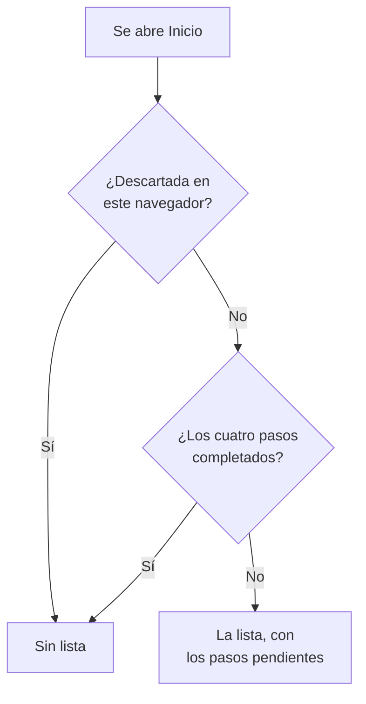

# Página de inicio y atajos

Inicio es la primera página que ves en un proyecto. Te dice de un vistazo si algo te necesita ahora mismo, y guía a un proyecto nuevo por su primera configuración. Esta página explica qué muestra Inicio, cómo encontrar cualquier producto, página o acción en el panel, y los atajos de teclado que te ahorran viajes por los menús.

:::cards
- [Qué muestra Inicio](#qué-muestra-inicio): La lista de bienvenida, los cinco mosaicos y los incidentes activos.
- [Orientarse](#orientarse): El menú Productos y las barras de la parte superior de cada página.
- [Buscar](#buscar-una-página-un-ajuste-o-una-acción): Encontrar cualquier página, ajuste o acción escribiendo su nombre.
- [Atajos de teclado](#atajos-de-teclado): Ir a Inicio, a Monitores o a Incidentes con dos teclas.
:::

## Qué muestra Inicio

Abre **Inicio** en la barra superior, o pulsa `g` y luego `h` desde cualquier sitio. De arriba abajo, Inicio muestra:

1. **Te damos la bienvenida a OneUptime 👋**, una lista para un proyecto nuevo, hasta que esté completa.
2. Cinco mosaicos que cuentan lo que necesita atención.
3. **Incidentes activos**, cada incidente que aún no está resuelto.

### La lista de bienvenida

La lista te guía por las cuatro cosas que un proyecto necesita antes de ser útil. Cada paso abre la página donde lo haces, y se marca solo cuando el proyecto tiene lo que pide.

| Paso | Completado cuando | Abre |
| --- | --- | --- |
| **Crea tu primer monitor** | El proyecto tiene un monitor. | El formulario **Crear monitor**, o la lista **Monitores** para quien no puede crear monitores. |
| **Publica una página de estado** | El proyecto tiene una página de estado. | **Páginas de estado** |
| **Invita a tu equipo** | Alguien además de ti está en el proyecto, o invitado a él. | **Usuarios** |
| **Configura una política de guardia** | El proyecto tiene una política de guardia. | **Guardia** |

Bajo los pasos, **Cómo funciona OneUptime** muestra los cuatro productos principales en el orden en que un problema pasa por ellos: **Monitores**, **Incidentes y alertas**, **Guardia** y **Páginas de estado**. Haz clic en uno para abrirlo.

La lista desaparece cuando los cuatro pasos están completados. Para ocultarla antes, haz clic en **Descartar**. El descarte se recuerda en este navegador, para este proyecto; todo lo que abren los pasos sigue en el menú **Productos**.

### Los mosaicos

Cada mosaico cuenta algo, dice si eso te necesita y abre la lista que hay detrás del número.

| Mosaico | Qué cuenta | Cuando el número es cero |
| --- | --- | --- |
| **Incidentes activos** | Incidentes que no están resueltos | **Todo en orden** |
| **Alertas activas** | Alertas que no están resueltas | **Todo en orden** |
| **Monitores no operativos** | Monitores cuyo estado no es uno operativo. Los monitores archivados no cuentan. | **Todos operativos** |
| **Mantenimiento en curso** | Eventos de mantenimiento programado en curso | **Ninguno en curso** |
| **SLO en riesgo** | SLO activados que están en riesgo o han agotado su presupuesto de error | **Presupuestos en buen estado** |

Un número mayor que cero muestra **Requiere atención**, o **En curso** y **Presupuesto agotándose** en los mosaicos de mantenimiento y de SLO. Un proyecto sin monitores ve **Aún no hay monitores** en el mosaico de monitores, y uno sin SLO ve **Aún no hay SLO**: un proyecto vacío no es lo mismo que uno sano. Esos dos mosaicos abren entonces las listas **Monitores** y **SLO**, donde creas uno.

### El menú lateral de Inicio

El menú lateral de Inicio tiene las mismas listas, cada una con un contador:

| Sección | Páginas |
| --- | --- |
| **Incidentes** | **Incidentes activos** y **Episodios activos** |
| **Alertas** | **Alertas activas** y **Episodios activos** |
| **Monitores** | **No operativo** |
| **Eventos programados** | **En curso** |

Un episodio agrupa incidentes o alertas relacionados para que los trabajes como uno solo. Consulta [Conceptos básicos](/docs/introduction/core-concepts#incidentes-y-alertas).

## Orientarse

Todo en OneUptime está bajo **Productos** en la barra superior. El menú presenta sus grupos como las filas de una sola lista, y siempre se abre con el primero de ellos, los esenciales, desplegado: Monitores, Incidentes, Alertas, Guardia, Páginas de estado, Mantenimiento programado y SLO. Cada uno de los demás grupos (Observabilidad, IA, Código, Recursos, Infraestructura, Paneles y automatización y Ajustes) está plegado en una fila de la misma lista. Cada fila nombra los productos del grupo y dice cuántos son. Haz clic en una fila para desplegarla o plegarla, o llega a ella con las flechas y pulsa **Intro**.

- **La búsqueda lo encuentra todo.** Escribe en el cuadro de búsqueda del menú para encontrar cualquier producto por su nombre, por lo que hace o por una palabra conocida como `k8s` o `RUM`. La búsqueda mira también dentro de los grupos plegados.
- **Empiezas donde estás.** El grupo de la página en la que estás se despliega solo, y los productos que abriste hace poco aparecen arriba.
- **Tus elecciones se mantienen.** El menú recuerda, en tu navegador, qué otros grupos desplegaste o plegaste. Los esenciales vuelven a estar desplegados cada vez que abres el menú, aunque los hayas plegado.
- **En un teléfono**, el botón del menú lista los productos de la misma manera: los esenciales desplegados arriba, y cada uno de los demás grupos como una fila que se abre con un toque.

### Las barras superiores

Dos barras recorren la parte superior de cada página.

| Dónde | Qué hay |
| --- | --- |
| Arriba a la izquierda | El selector de proyectos: cambiar a otro de tus proyectos, o crear uno nuevo. |
| Arriba a la derecha | **Buscar** y **Preguntar a la IA**, la campana de notificaciones con lo que te necesita ahora (incidentes y alertas activos, las políticas de guardia en las que estás de turno, invitaciones pendientes), **Ayuda**, y tu foto, que abre el menú de tu [cuenta](/docs/introduction/your-account). |
| Debajo | **Inicio** y **Productos** a la izquierda, **Ajustes de usuario** a la derecha: cómo te localiza OneUptime en este proyecto. |

**Ayuda** abre esta documentación (**Documentación**) y la lista **Atajos de teclado**, y ofrece soporte por correo y en Slack. En una pantalla estrecha, como la de un teléfono, **Buscar**, **Preguntar a la IA** y **Ayuda** se quitan para ganar espacio; la campana y tu foto se quedan.

## Buscar una página, un ajuste o una acción

Pulsa **Cmd+K** (Mac) o **Ctrl+K** (Windows y Linux), o haz clic en el icono de búsqueda de la barra superior, y empieza a escribir. La búsqueda encuentra:

- **Cada página de los menús**, por el nombre que le da el menú: Claves de API, Zona de peligro, Programaciones de guardia, Gravedad del incidente, tus propios Métodos de notificación. Cada resultado dice dónde está, por ejemplo *Ajustes del proyecto › Avanzado*, de modo que las páginas con el mismo nombre (Campos personalizados en Incidentes, Alertas y Monitores) se distinguen fácilmente.
- **Acciones**, por lo que quieres hacer: Declarar incidente, Crear monitor o Eliminar proyecto, que abre la Zona de peligro. Una acción que cambia algo solo se ofrece a quien tiene permiso para hacerla.
- **Tus monitores, incidentes, alertas, páginas de estado y políticas de guardia**, por su nombre.

La búsqueda lee lo que escribes como lo quieres decir:

- Las mayúsculas, los acentos, los espacios y los guiones no importan: *on-call*, *on call* y *oncall* encuentran las mismas páginas, y las palabras pueden ir en cualquier orden.
- Conoce otras palabras para muchas páginas, en inglés: *pager* o *escalation* para Políticas de guardia, *rota* para Programaciones de guardia, *2fa* para la autenticación de dos factores, *delete project* para la Zona de peligro.
- Añade el nombre del producto para acotar una búsqueda: *incident custom fields* encuentra la página Campos personalizados de Incidentes.
- Una pequeña errata, como *incidnet*, sigue encontrando lo que querías cuando nada coincide tal cual.

Con el cuadro de búsqueda vacío, la búsqueda lista las páginas que abriste hace poco, las acciones y los productos.

## Atajos de teclado

Pulsa `?` en cualquier parte del panel para ver todos los atajos, o abre **Ayuda** y elige **Atajos de teclado**. En un Mac, `Mod` es la tecla Comando; en Windows y Linux, es Ctrl.

| Teclas | Qué hacen |
| --- | --- |
| `Mod` + `K` | Abrir la paleta de comandos: buscar cualquier página, ajuste o acción. |
| `Mod` + `I` | Preguntar a la IA sobre lo que estás viendo. |
| `/` | Buscar en la lista de esta página. |
| `?` | Mostrar los atajos de teclado. |
| `Esc` | Cerrar un cuadro de diálogo o un panel. |

### Ir a un producto

Pulsa `g` y luego una letra para ir directamente a un producto. Pulsa la letra en el segundo y medio siguiente a `g`.

| Teclas | Va a |
| --- | --- |
| `g` luego `h` | Inicio |
| `g` luego `m` | Monitores |
| `g` luego `i` | Incidentes |
| `g` luego `a` | Alertas |
| `g` luego `o` | Guardia |
| `g` luego `s` | Páginas de estado |
| `g` luego `e` | Mantenimiento programado |
| `g` luego `d` | Paneles |
| `g` luego `l` | Registros |
| `g` luego `t` | Trazas |

Los atajos no te estorban. `?`, `/` y `g` no hacen nada mientras escribes en un campo, y nada te saca de la página mientras hay un cuadro de diálogo abierto, así que una tecla pulsada sin querer no puede hacerte perder un formulario a medio rellenar. Cualquier otro producto está a una búsqueda de distancia con `Mod` + `K`.

## Próximos pasos

:::cards
- [Inicio rápido](/docs/introduction/quickstart): Recorrer la lista de bienvenida, paso a paso.
- [Su cuenta](/docs/introduction/your-account): Tu perfil, la seguridad de tu inicio de sesión, el idioma y el tema.
- [Preguntar a la IA](/docs/ai/ask-ai): Lo que la IA puede responder y hacer por ti.
- [Conceptos básicos](/docs/introduction/core-concepts): Qué son los monitores, los incidentes, las alertas y las guardias.
:::
