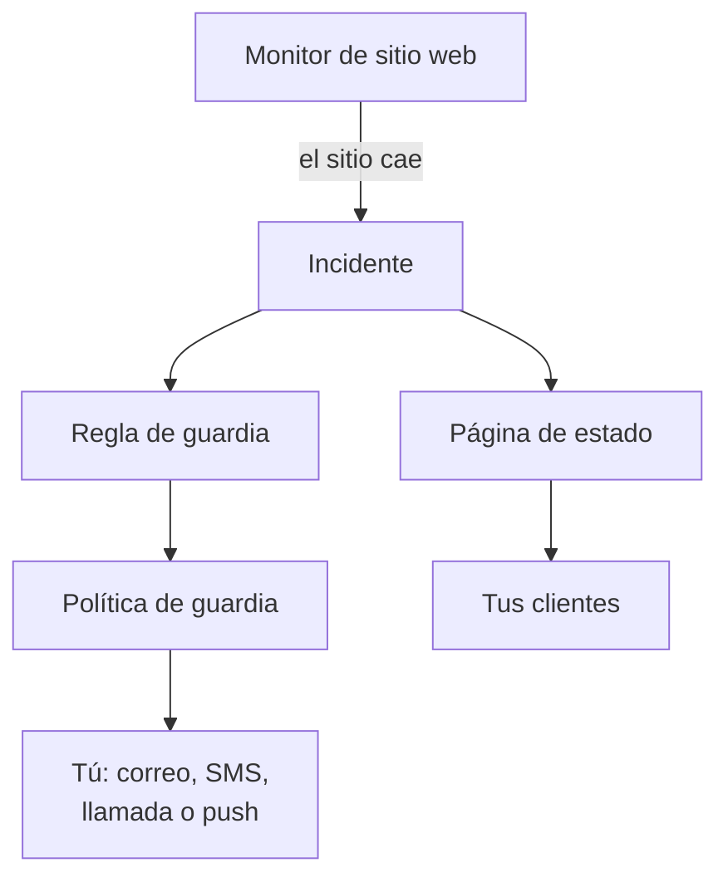

# Inicio rápido

Esta guía te lleva de una cuenta nueva a una configuración que funciona en unos quince minutos: un monitor que comprueba tu sitio web cada cinco minutos, una política de guardia que te avisa cuando el sitio cae y una página de estado que informa a tus clientes. Sigue la lista **Te damos la bienvenida a OneUptime 👋** de la página de inicio de tu proyecto.

## Antes de empezar

- **Una cuenta.** En OneUptime Cloud, regístrate en [oneuptime.com](https://oneuptime.com/accounts/register) y abre el enlace del correo que recibirás. En tu propia instalación, ábrela en el navegador y regístrate: la primera cuenta se convierte en el administrador principal. Para instalar una, consulta [Docker Compose](/docs/installation/docker-compose).
- **Un sitio web que vigilar.** Cualquier dirección que responda por HTTP o HTTPS, como la página de inicio de tu empresa.

## Crear un proyecto

En OneUptime todo vive en un proyecto: tus monitores, incidentes, políticas de guardia, páginas de estado y las personas que trabajan en ellos.

:::steps
### Empezar un proyecto nuevo

La primera vez que inicias sesión, OneUptime muestra **No hay proyectos**. Haz clic en **Crear nuevo proyecto**. Si alguien ya te invitó a un proyecto, acepta la invitación en esa misma página.

### Ponerle nombre

Escribe un **Nombre del proyecto**, por ejemplo el nombre de tu empresa. En OneUptime Cloud, el paso siguiente te pide elegir un plan.

### Crearlo

Haz clic en **Crear proyecto**. Se abre la página de inicio de tu proyecto, con la lista **Te damos la bienvenida a OneUptime 👋** arriba.
:::

## Monitorizar tu sitio web

:::steps
### Abrir la creación de monitores

En la lista, haz clic en **Crea tu primer monitor**. También puedes abrir **Monitores** desde el menú **Productos** y hacer clic en **Crear monitor**.

### Elegir Sitio web

En **Tipo de monitor**, elige **Sitio web**. Escribe un **Nombre**, por ejemplo `Website`, y haz clic en **Siguiente**.

### Escribir la dirección

Escribe la dirección completa de tu sitio en **URL del sitio web**, por ejemplo `https://example.com`. OneUptime añade los criterios por ti: el monitor pasa a **Sin conexión** y declara un incidente cuando el sitio no responde, o responde con un error. Haz clic en **Siguiente**.

### Crear el monitor

Mantén las **Sondas** seleccionadas y el **Intervalo de monitoreo** de **Cada 5 minutos**, y haz clic en **Crear monitor**. Se abre la página del monitor, y las sondas empiezan a comprobar tu sitio.
:::

Para probar la comprobación antes de guardar, haz clic en **Probar monitor** en el segundo paso. Todos los demás tipos de monitor se describen en [Crear un monitor](/docs/monitor/create-monitor).

## Recibir un aviso cuando caiga

Tal como está, un incidente sin propietarios se envía por correo a los propietarios del proyecto, y eso te incluye a ti. Para que te avisen hasta que alguien responda, crea una política de guardia y haz que cada incidente la active.

:::steps
### Crear una política de guardia

En la lista, haz clic en **Configura una política de guardia**, o abre **Guardia** desde el menú **Productos**. Haz clic en **Crear Política de guardia** y escribe un **Nombre**. En **¿A quién se avisa primero?**, haz clic en **Añadir destinatario** y elígete a ti. Haz clic en **Crear Política de guardia**.

### Activarla con cada incidente

Abre **Incidentes** desde el menú **Productos**, despliega **Reglas** en el menú lateral y elige **Reglas de guardia**. Haz clic en **Crear Regla de guardia de incidentes**, escribe un **Nombre** y haz clic en **Siguiente**. Deja vacío **Criterios de coincidencia**, para que la regla coincida con todos los incidentes, y haz clic en **Siguiente**. Elige tu política en **Políticas de guardia** y haz clic en **Crear Regla de guardia de incidentes**.

### Elegir cómo te localizan

Tu correo de inicio de sesión ya es una forma de localizarte. Para recibir también SMS o llamadas, abre **Ajustes de usuario** en la barra bajo la barra superior, ve a **Métodos de notificación** y, en la pestaña **Direct Contact**, añade tu número en **Números de teléfono para notificaciones SMS** o **Números de teléfono para notificaciones por llamada**. Haz clic en **Verificar** y escribe el código que OneUptime te envía. Un número verificado se usa para los avisos de guardia al instante.
:::

> [!NOTE]
> Los SMS y las llamadas están desactivados en un proyecto nuevo. Un propietario del proyecto, un Billing Admin o alguien con Manage Billing los activa en la tarjeta **Canales de notificación**, en **Ajustes del proyecto → Notificaciones → Ajustes de notificaciones**.

Para más niveles, rotaciones y cuánto espera cada nivel, consulta [Reglas de escalado](/docs/on-call/escalation-rules) y [Programaciones de guardia](/docs/on-call/schedules).

## Publicar una página de estado

:::steps
### Crear la página de estado

En la lista, haz clic en **Publica una página de estado**, o abre **Páginas de estado** desde el menú **Productos**. Haz clic en **Crear página de estado**, escribe un **Nombre**, por ejemplo `Acme Status`, y haz clic en **Crear página de estado**.

### Añadir tu monitor

Abre la nueva página de estado. En su menú lateral, en **Recursos**, elige **Monitores**; en los proyectos con los grupos de monitores activados se llama **Recursos**. Haz clic en **Añadir monitor**, elige tu monitor de sitio web y haz clic en **Añadir monitor**. La fila muestra a los visitantes el nombre del monitor; cámbialo en **Nombre para mostrar** si quieres.

### Abrir la página

Elige **Vista general** en el menú lateral. La tarjeta **URL de vista previa de la página de estado** enlaza con tu página de estado: ábrela, y tu sitio web aparece como operativo.
:::

Una página de estado nueva es pública: cualquiera que tenga su dirección puede abrirla. Para darle tu propio dominio, tu logotipo y tus colores, consulta [Marca y dominios de la página de estado](/docs/status-pages/branding-and-domains).

## Invitar a tu equipo

En la lista, haz clic en **Invita a tu equipo**, o abre **Usuarios** desde el menú **Productos**, en **Ajustes**. Haz clic en **Invitar usuario**, escribe su **Correo electrónico** y elige un **Equipo**: de entrada está elegido el equipo de miembros. Haz clic en **Invitar**. OneUptime le envía la invitación por correo, y el equipo decide lo que puede hacer. Consulta [Usuarios, equipos y permisos](/docs/permissions/index).

## Probarlo

Declara un incidente de prueba para ver funcionar toda la cadena.

:::steps
### Declarar un incidente de prueba

Abre **Incidentes** y haz clic en **Declarar incidente**. Escribe un **Título**, por ejemplo `Test incident`, elige una **Gravedad del incidente** y haz clic en **Siguiente**. En **Monitores**, elige tu monitor de sitio web, para que el incidente aparezca en tu página de estado. Haz clic en **Siguiente** hasta llegar al resumen y, después, en **Declarar incidente**.

### Ver lo que pasa

En uno o dos minutos, tu política de guardia te avisa y el incidente aparece en tu página de estado.

### Resolverlo

En la página del incidente, haz clic en **Resolver**. Los avisos se detienen y el incidente sale de tu página de estado.
:::

> [!WARNING]
> Cualquiera que abra tu página de estado ve el incidente de prueba hasta que lo resuelvas. Haz la prueba antes de compartir la dirección de la página.

## Solución de problemas

:::details No me avisaron
Abre el incidente y elige **Ejecuciones de guardia** en su menú lateral: ahí ves si tu política se ejecutó y a quién avisó. Si no se ejecutó, comprueba que tu regla de guardia está activada y nombra la política. Si se ejecutó, comprueba que tus métodos en **Ajustes de usuario → Métodos de notificación** están verificados.
:::

:::details El incidente no aparece en mi página de estado
Una página de estado muestra un incidente cuando uno de los monitores del incidente está en la página. Comprueba que el incidente incluye tu monitor entre sus recursos afectados, y que el monitor está en la página de estado.
:::

:::details El monitor dice que está sin conexión, pero mi sitio funciona
Abre el monitor y revisa lo que recibieron las sondas. Consulta la sección de solución de problemas de [Monitor de sitio web](/docs/monitor/website-monitor).
:::

## Próximos pasos

:::cards
- [Conceptos básicos](/docs/introduction/core-concepts): Las ideas detrás de lo que acabas de configurar.
- [Programaciones de guardia](/docs/on-call/schedules): Repartir la guardia con tu equipo.
- [Marca y dominios de la página de estado](/docs/status-pages/branding-and-domains): Hacer tuya la página de estado.
- [OpenTelemetry](/docs/telemetry/open-telemetry): Enviar registros, métricas y trazas desde tus aplicaciones.
:::
